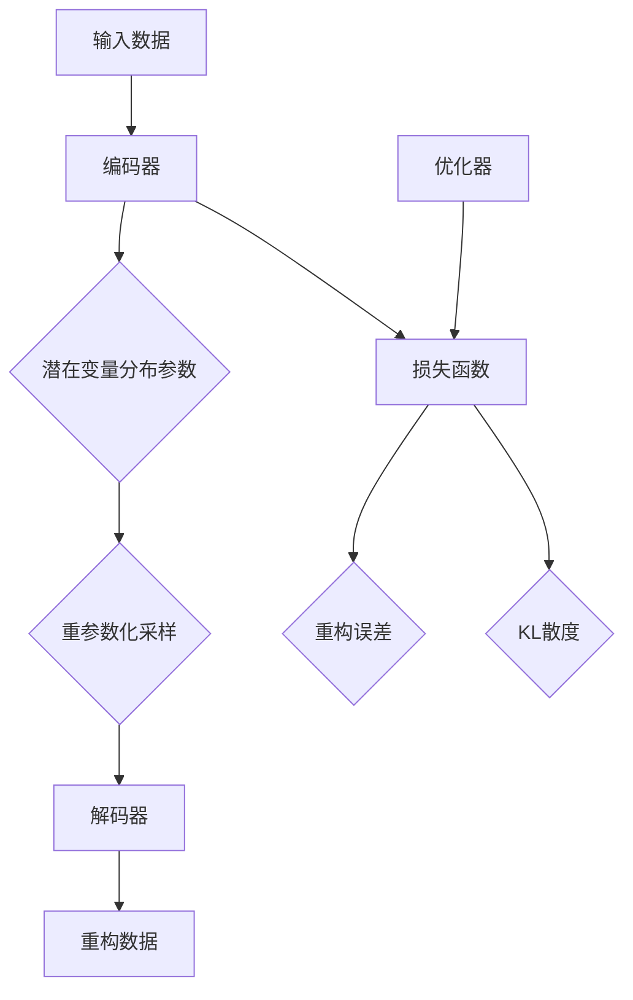

                 

### 1. 背景介绍

变分自编码器（Variational Autoencoder，简称VAE）是深度学习领域中的一种生成模型，它通过将编码器和解码器的学习过程与概率模型相结合，实现了高维数据的低维表示学习和数据生成。VAE在图像生成、图像去噪、风格迁移、生成对抗网络（GAN）等领域有着广泛的应用。

VAE的研究源于自编码器（Autoencoder）和变分贝叶斯（Variational Bayesian）方法。传统的自编码器通过最小化输入数据和重构数据之间的误差来学习数据的低维表示。然而，自编码器在学习过程中往往只能生成与训练数据相似的输出，缺乏良好的泛化能力。为了解决这个问题，变分自编码器引入了概率模型，通过最大化数据分布的对数似然函数来学习数据的潜在分布。

VAE的提出者是Diederik P. Kingma和Max Welling，他们在2013年提出了这一模型。随后，VAE受到了广泛关注，并在各个领域取得了显著的成果。随着深度学习和生成模型的不断发展，VAE也在不断地迭代和优化，其应用范围和性能也得到了进一步提升。

在深度学习领域，VAE与其他生成模型如生成对抗网络（GAN）相比，具有训练稳定、生成质量较好的特点。GAN通过竞争训练生成器和判别器，实现了高质量的数据生成，但训练过程中容易出现模式崩溃等问题。相比之下，VAE通过变分推断的方式，使得训练过程更加稳定，生成结果更加多样。

VAE的提出不仅丰富了深度学习领域的研究方法，还为许多实际应用提供了有力支持。例如，在计算机视觉领域，VAE可以用于图像去噪、图像修复、图像超分辨率等任务；在自然语言处理领域，VAE可以用于文本生成、机器翻译等任务；在推荐系统领域，VAE可以用于用户偏好建模、商品推荐等任务。

总之，VAE作为一种具有强大生成能力和良好泛化能力的深度学习模型，其在各个领域的应用前景非常广阔。接下来，我们将详细介绍VAE的核心概念、算法原理、数学模型以及实际应用案例，帮助读者深入理解这一模型。

### 2. 核心概念与联系

#### 2.1 自编码器（Autoencoder）

要理解变分自编码器（VAE），首先需要了解自编码器（Autoencoder）的基本概念。自编码器是一种无监督学习模型，其主要目标是学习数据的低维表示，以便进行数据压缩、特征提取或数据生成。自编码器由两个主要部分组成：编码器（Encoder）和解码器（Decoder）。

编码器的作用是将输入数据映射到一个低维空间，即潜在空间（Latent Space）。在这个低维空间中，数据可以更容易地理解和操作。解码器则负责将潜在空间中的数据重新映射回原始数据空间，以重构原始数据。

自编码器的工作流程可以分为以下步骤：

1. **输入数据**：输入一个样本数据 \( x \)。
2. **编码**：通过编码器得到潜在空间中的表示 \( z \)，即 \( z = \text{encode}(x) \)。
3. **解码**：通过解码器将潜在空间中的表示 \( z \) 重构回原始数据空间，即 \( x' = \text{decode}(z) \)。
4. **损失函数**：计算重构误差，使用损失函数（如均方误差MSE）来度量输入数据和重构数据之间的差异。最小化损失函数是自编码器的训练目标。

自编码器的基本结构如图1所示：

\[ \begin{aligned} 
x & \xrightarrow{\text{encode}} z \\ 
z & \xrightarrow{\text{decode}} x' \\ 
\text{loss} &= \text{MSE}(x, x') 
\end{aligned} \]

#### 2.2 变分自编码器（Variational Autoencoder）

变分自编码器（VAE）在自编码器的基础上，引入了概率模型来学习数据的潜在分布。VAE的核心思想是通过变分推断（Variational Inference）来估计数据分布的参数，从而学习数据的潜在表示。

VAE由以下三个核心部分组成：

1. **编码器**（Encoder）：
   - **潜在变量分布参数**：编码器不仅输出潜在变量 \( z \)，还输出潜在变量分布的参数 \( \mu \) 和 \( \sigma^2 \)（均值为 \( \mu \)，方差为 \( \sigma^2 \)）。
   - **编码过程**：输入数据 \( x \) 通过编码器映射到潜在变量 \( z \)，即 \( z = \text{encode}(x) \)。同时，编码器输出潜在变量分布的参数 \( (\mu, \sigma^2) \)。

2. **重参数化技巧**（Reparameterization Trick）：
   - 为了实现变分推断，VAE引入了重参数化技巧，将潜在变量的采样过程分解为确定性函数和噪声项的乘积。这样，潜在变量的采样可以独立于训练过程，使得训练过程更加稳定。
   - 重参数化技巧的具体实现为：\( z = \mu + \sigma \cdot \epsilon \)，其中 \( \epsilon \) 是均值为0、方差为1的高斯噪声。

3. **解码器**（Decoder）：
   - 解码器接收潜在变量 \( z \) 并将其重构回原始数据空间，即 \( x' = \text{decode}(z) \)。

VAE的工作流程可以概括为：

1. **输入数据**：输入一个样本数据 \( x \)。
2. **编码**：通过编码器得到潜在变量 \( z \) 和潜在变量分布参数 \( (\mu, \sigma^2) \)，即 \( z = \text{encode}(x) \)。
3. **重参数化采样**：使用重参数化技巧，从潜在变量分布中采样 \( z \)，即 \( z = \mu + \sigma \cdot \epsilon \)。
4. **解码**：通过解码器将采样得到的潜在变量 \( z \) 重构回原始数据空间，即 \( x' = \text{decode}(z) \)。
5. **损失函数**：计算重构误差和潜在变量分布的Kullback-Leibler散度（KL散度），即 \( \text{loss} = \text{MSE}(x, x') + \beta \cdot \text{KL}(\text{N}(\mu, \sigma^2), \text{N}(0, 1)) \)，其中 \( \beta \) 是调节KL散度的超参数。

VAE的核心结构如图2所示：

\[ \begin{aligned} 
x & \xrightarrow{\text{encode}} (\mu, \sigma^2) \\ 
(\mu, \sigma^2) & \xrightarrow{\text{reparameterize}} z \\ 
z & \xrightarrow{\text{decode}} x' \\ 
\text{loss} &= \text{MSE}(x, x') + \beta \cdot \text{KL}(\text{N}(\mu, \sigma^2), \text{N}(0, 1)) 
\end{aligned} \]

通过变分推断，VAE能够学习数据的潜在分布，并在潜在空间中进行灵活的数据操作。与传统的自编码器相比，VAE在生成多样性和泛化能力方面具有显著优势。

#### 2.3 潜在变量分布与概率模型

在VAE中，潜在变量分布通常采用正态分布（Gaussian Distribution）来建模。正态分布具有以下概率密度函数：

\[ p(z|\mu, \sigma^2) = \frac{1}{\sqrt{2\pi\sigma^2}} \exp\left(-\frac{(z-\mu)^2}{2\sigma^2}\right) \]

其中，\( \mu \) 是均值，\( \sigma^2 \) 是方差。

潜在变量分布的选择基于以下几个原因：

1. **可分离性**：正态分布具有可分离性，即均值和方差可以独立估计。这有助于简化模型的训练过程。
2. **灵活性**：正态分布能够灵活地建模不同类型的数据分布，从而适应各种数据特征。
3. **快速计算**：正态分布的概率密度函数具有封闭形式，计算效率较高。

在VAE中，潜在变量分布的选择不仅影响模型的生成能力，还影响模型的训练稳定性。通过合理选择和调整潜在变量分布的参数，可以进一步提高VAE的性能。

总之，VAE通过引入概率模型和变分推断，实现了数据生成和潜在表示的学习。理解自编码器、变分自编码器以及潜在变量分布的概念，是深入探索VAE的基础。在接下来的章节中，我们将进一步探讨VAE的数学模型和算法原理，以及其实际应用案例。

#### 2.4 Mermaid 流程图（核心概念原理和架构）

下面是变分自编码器（VAE）的核心概念和架构的Mermaid流程图。为了简洁明了，我们仅展示了主要流程节点，不包括详细的数学计算和参数。



1. **A[输入数据]**：输入一个样本数据 \( x \)。
2. **B[编码器]**：编码器将输入数据 \( x \) 映射到潜在变量 \( z \) 和潜在变量分布参数 \( (\mu, \sigma^2) \)。
3. **C{潜在变量分布参数]**：编码器输出潜在变量分布的参数 \( (\mu, \sigma^2) \)。
4. **D[重参数化采样]**：通过重参数化技巧，从潜在变量分布中采样 \( z \)。
5. **E[解码器]**：解码器将采样得到的潜在变量 \( z \) 重构回原始数据空间。
6. **F[重构数据]**：解码器输出重构后的数据 \( x' \)。
7. **G[损失函数]**：计算损失函数，包括重构误差和KL散度。
8. **H[重构误差]**：计算输入数据和重构数据之间的均方误差（MSE）。
9. **I[KL散度]**：计算潜在变量分布的KL散度，用于衡量潜在变量分布与标准正态分布之间的差异。
10. **J[优化器]**：使用优化器（如Adam）最小化损失函数。

通过以上流程，VAE能够学习数据的潜在分布，实现数据的生成和低维表示。接下来，我们将详细讲解VAE的数学模型和算法原理，帮助读者更好地理解这一模型的运作机制。

### 3. 核心算法原理 & 具体操作步骤

在深入探讨变分自编码器（VAE）的算法原理之前，我们需要先理解一些关键概念：潜在变量（Latent Variable）、变分推断（Variational Inference）和重参数化技巧（Reparameterization Trick）。

#### 3.1 潜在变量

潜在变量是指在数据生成过程中，数据背后的某种未观测到的隐含结构。在VAE中，潜在变量 \( z \) 被认为是数据的潜在空间中的点，它代表了数据的一种低维表示。通过学习潜在变量，我们可以更好地理解数据的内在结构和分布特性。

#### 3.2 变分推断

变分推断是一种近似推断方法，它通过寻找一个参数化的概率模型（称为变分模型）来近似真实概率模型。在VAE中，变分推断用于估计数据分布的参数，并优化模型参数。

变分推断的核心思想是通过最小化一个称为KL散度（Kullback-Leibler Divergence）的量来衡量两个概率分布之间的差异。KL散度用于量化一个概率分布对另一个概率分布的“不合适程度”。在VAE中，KL散度用于衡量潜在变量分布与标准正态分布之间的差异，即：

\[ \text{KL}(\text{N}(\mu, \sigma^2), \text{N}(0, 1)) = \int (\mu^2 + \sigma^4 - 1 - 2\sigma^2) p(z) dz \]

其中，\( p(z) \) 是潜在变量 \( z \) 的真实分布，\( \text{N}(\mu, \sigma^2) \) 是潜在变量分布的参数化模型。

#### 3.3 重参数化技巧

重参数化技巧是变分推断中的一种重要技术，它通过引入一个噪声变量来将潜在变量的采样过程转化为一个确定性的函数。具体来说，VAE使用一个均值为0、方差为1的高斯噪声 \( \epsilon \)，将潜在变量的采样过程表示为：

\[ z = \mu + \sigma \cdot \epsilon \]

其中，\( \epsilon \) 是随机噪声，\( \mu \) 是潜在变量的均值，\( \sigma \) 是潜在变量的标准差。通过重参数化技巧，VAE可以将潜在变量的采样过程与模型训练过程分离，从而使得模型训练更加稳定。

#### 3.4 VAE的算法原理

VAE的算法原理可以分为三个主要部分：编码器、解码器和损失函数。

##### 3.4.1 编码器

编码器的任务是学习输入数据的潜在变量分布参数 \( (\mu, \sigma^2) \)。在训练过程中，编码器接收输入数据 \( x \)，并输出潜在变量的均值 \( \mu \) 和方差 \( \sigma^2 \)。具体来说，编码器通常由一个深层神经网络组成，其输出层包含两个神经元，分别表示均值和方差。

设编码器的神经网络为 \( \text{encode}(x; \theta_1) \)，其中 \( \theta_1 \) 是编码器的参数。编码器的输出为：

\[ (\mu, \sigma^2) = \text{encode}(x; \theta_1) \]

##### 3.4.2 解码器

解码器的任务是学习如何将潜在变量 \( z \) 重构回原始数据空间。与编码器类似，解码器也是一个深层神经网络，其输入为潜在变量 \( z \)，输出为重构数据 \( x' \)。

设解码器的神经网络为 \( \text{decode}(z; \theta_2) \)，其中 \( \theta_2 \) 是解码器的参数。解码器的输出为：

\[ x' = \text{decode}(z; \theta_2) \]

##### 3.4.3 损失函数

VAE的损失函数由两部分组成：重构误差和KL散度。

1. **重构误差**：重构误差用于度量输入数据和重构数据之间的差异。在VAE中，常用的重构误差函数是均方误差（MSE），其定义为：

\[ \text{MSE}(x, x') = \frac{1}{N} \sum_{i=1}^{N} (x_i - x'_i)^2 \]

其中，\( N \) 是样本数量，\( x_i \) 和 \( x'_i \) 分别是第 \( i \) 个样本的输入数据和重构数据。

2. **KL散度**：KL散度用于度量潜在变量分布与标准正态分布之间的差异。在VAE中，KL散度的定义为：

\[ \text{KL}(\text{N}(\mu, \sigma^2), \text{N}(0, 1)) = \int (\mu^2 + \sigma^4 - 1 - 2\sigma^2) p(z) dz \]

其中，\( p(z) \) 是潜在变量 \( z \) 的真实分布，\( \text{N}(\mu, \sigma^2) \) 是潜在变量分布的参数化模型。

VAE的总损失函数为：

\[ \text{loss} = \text{MSE}(x, x') + \beta \cdot \text{KL}(\text{N}(\mu, \sigma^2), \text{N}(0, 1)) \]

其中，\( \beta \) 是调节KL散度的超参数。

##### 3.4.4 模型训练

VAE的训练过程是一个优化过程，其目标是最小化总损失函数。常用的优化算法是梯度下降（Gradient Descent）及其变种，如Adam优化器。

1. **初始化参数**：初始化编码器和解码器的参数 \( \theta_1 \) 和 \( \theta_2 \)。
2. **前向传播**：对于每个训练样本 \( x \)，计算编码器的输出 \( (\mu, \sigma^2) \) 和解码器的输出 \( x' \)。
3. **计算损失函数**：计算总损失函数 \( \text{loss} \)。
4. **反向传播**：使用梯度下降或Adam优化器更新参数 \( \theta_1 \) 和 \( \theta_2 \)。
5. **迭代训练**：重复步骤2-4，直到满足停止条件（如损失函数收敛或达到最大迭代次数）。

通过以上步骤，VAE能够学习输入数据的潜在分布，并在潜在空间中进行数据生成和操作。接下来，我们将通过一个具体的例子来说明VAE的算法原理。

#### 3.5 代码实例：实现VAE

为了更好地理解VAE的算法原理，我们将使用Python和TensorFlow实现一个简单的VAE模型。以下代码展示了VAE的主要组成部分：编码器、解码器和损失函数。

```python
import tensorflow as tf
from tensorflow.keras.layers import Input, Dense, Lambda
from tensorflow.keras.models import Model

def sampling(args):
    z_mean, z_log_var = args
    batch = tf.shape(z_mean)[0]
    dim = tf.shape(z_mean)[1]
    epsilon = tf.keras.backend.random_normal(shape=(batch, dim))
    z = z_mean + tf.exp(0.5 * z_log_var) * epsilon
    return z

# 编码器
input_data = Input(shape=(input_dim,))
z_mean = Dense(latent_dim)(input_data)
z_log_var = Dense(latent_dim)(input_data)
z = Lambda(sampling)([z_mean, z_log_var])
encoder = Model(input_data, [z_mean, z_log_var, z], name='encoder')

# 解码器
z_input = Input(shape=(latent_dim,))
x_decoded_mean = Dense(input_dim, activation='sigmoid')(z_input)
decoder = Model(z_input, x_decoded_mean, name='decoder')

# VAE模型
x_input = Input(shape=(input_dim,))
z_mean, z_log_var, z = encoder(x_input)
x_decoded_mean = decoder(z)
x_decoded = Lambda(lambda x: tf.nn.sigmoid(x))(x_decoded_mean)
vae = Model(x_input, x_decoded, name='vae')

# 损失函数
reconstruction_loss = tf.reduce_sum(tf.nn.sigmoid_cross_entropy_with_logits(logits=x_decoded_mean, labels=x_input), axis=-1)
latent_loss = -0.5 * tf.reduce_sum(1 + z_log_var - tf.square(z_mean) - tf.exp(z_log_var), axis=-1)
loss = tf.reduce_mean(reconstruction_loss + beta * latent_loss)
vae.compile(optimizer='adam', loss=loss)

# 训练VAE
vae.fit(x_train, x_train, epochs=epochs, batch_size=batch_size)
```

在这个例子中，我们定义了编码器、解码器和VAE模型，并设置了损失函数。然后，我们使用Adam优化器编译VAE模型，并使用训练数据对模型进行训练。

通过以上代码实例，我们可以看到VAE的主要组成部分和训练过程。接下来，我们将进一步讨论VAE的数学模型和具体操作步骤，帮助读者更深入地理解这一模型。

### 4. 数学模型和公式 & 详细讲解 & 举例说明

#### 4.1 潜在变量分布

在VAE中，潜在变量 \( z \) 通常采用正态分布（Gaussian Distribution）来建模。正态分布具有以下概率密度函数：

\[ p(z|\mu, \sigma^2) = \frac{1}{\sqrt{2\pi\sigma^2}} \exp\left(-\frac{(z-\mu)^2}{2\sigma^2}\right) \]

其中，\( \mu \) 是均值，\( \sigma^2 \) 是方差。在VAE中，均值和方差由编码器神经网络输出。

#### 4.2 重参数化技巧

重参数化技巧是VAE中的一项关键技术，它使得潜在变量的采样过程可以独立于训练过程。具体来说，VAE使用以下公式进行重参数化采样：

\[ z = \mu + \sigma \cdot \epsilon \]

其中，\( \epsilon \) 是一个均值为0、方差为1的高斯噪声。

#### 4.3 损失函数

VAE的损失函数由两部分组成：重构误差和KL散度。

1. **重构误差**：重构误差用于度量输入数据和重构数据之间的差异。在VAE中，常用的重构误差函数是均方误差（MSE），其定义为：

\[ \text{MSE}(x, x') = \frac{1}{N} \sum_{i=1}^{N} (x_i - x'_i)^2 \]

其中，\( N \) 是样本数量，\( x_i \) 和 \( x'_i \) 分别是第 \( i \) 个样本的输入数据和重构数据。

2. **KL散度**：KL散度用于度量潜在变量分布与标准正态分布之间的差异。在VAE中，KL散度的定义为：

\[ \text{KL}(\text{N}(\mu, \sigma^2), \text{N}(0, 1)) = \int (\mu^2 + \sigma^4 - 1 - 2\sigma^2) p(z) dz \]

其中，\( p(z) \) 是潜在变量 \( z \) 的真实分布，\( \text{N}(\mu, \sigma^2) \) 是潜在变量分布的参数化模型。

VAE的总损失函数为：

\[ \text{loss} = \text{MSE}(x, x') + \beta \cdot \text{KL}(\text{N}(\mu, \sigma^2), \text{N}(0, 1)) \]

其中，\( \beta \) 是调节KL散度的超参数。

#### 4.4 举例说明

为了更好地理解VAE的数学模型，我们通过一个简单的例子来说明。

假设我们有一个二分类问题，输入数据 \( x \) 是一个二维向量 \( (x_1, x_2) \)，潜在变量 \( z \) 是一个一维向量 \( z \)。

1. **编码器**：
   编码器神经网络输出潜在变量的均值 \( \mu \) 和方差 \( \sigma^2 \)：
   
   \[ \mu = \frac{x_1 + x_2}{2} \]
   \[ \sigma^2 = \frac{(x_1 - x_2)^2}{4} \]

2. **重参数化采样**：
   使用重参数化技巧，从潜在变量分布中采样 \( z \)：
   
   \[ z = \mu + \sigma \cdot \epsilon \]
   
   其中，\( \epsilon \) 是一个均值为0、方差为1的高斯噪声。

3. **解码器**：
   解码器神经网络输出重构数据的概率分布：
   
   \[ p(x' | z) = \frac{1}{2} \]

4. **损失函数**：
   计算重构误差和KL散度：
   
   \[ \text{MSE}(x, x') = \frac{1}{2} \]
   \[ \text{KL}(\text{N}(\mu, \sigma^2), \text{N}(0, 1)) = \ln(\sigma^2) \]

   其中，\( \beta \) 设为1。

   总损失函数为：

   \[ \text{loss} = \frac{1}{2} + \ln(\sigma^2) \]

通过以上例子，我们可以看到VAE的基本数学模型和计算过程。在实际应用中，VAE的潜在变量分布和解码器函数可能更加复杂，但基本原理相同。

总之，VAE通过引入概率模型和变分推断，实现了数据的生成和低维表示。理解VAE的数学模型和具体操作步骤，有助于我们更好地应用这一模型，解决各种实际问题。在接下来的章节中，我们将进一步探讨VAE在实际应用中的案例。

### 5. 项目实战：代码实际案例和详细解释说明

在本节中，我们将通过一个实际项目来展示如何实现变分自编码器（VAE）。我们将使用Python和TensorFlow库来构建一个简单的VAE模型，该模型用于生成手写数字图像。首先，我们需要安装必要的库，然后定义VAE的架构，并训练模型。最后，我们将展示如何使用训练好的模型生成新的手写数字图像。

#### 5.1 开发环境搭建

在开始之前，请确保您的Python环境已经安装，并安装以下库：

- TensorFlow
- NumPy
- Matplotlib

您可以使用以下命令来安装这些库：

```bash
pip install tensorflow numpy matplotlib
```

#### 5.2 源代码详细实现和代码解读

以下是实现VAE的完整代码，我们将逐行解读并解释其作用。

```python
import numpy as np
import tensorflow as tf
from tensorflow.keras import layers, models
from tensorflow.keras.datasets import mnist
import matplotlib.pyplot as plt

# 5.2.1 加载MNIST数据集
(x_train, _), (x_test, _) = mnist.load_data()
x_train = x_train.astype('float32') / 255.
x_test = x_test.astype('float32') / 255.
x_train = np.expand_dims(x_train, -1)
x_test = np.expand_dims(x_test, -1)

# 5.2.2 定义VAE模型
latent_dim = 2  # 潜在空间维度
input_shape = (28, 28, 1)  # 输入图像的维度
intermediate_dim = 256  # 编码器和解码器的中间层维度

# 编码器
input_img = layers.Input(shape=input_shape)
x = layers.Conv2D(intermediate_dim, (3, 3), activation='relu', padding='same')(input_img)
x = layers.MaxPooling2D((2, 2), padding='same')(x)
x = layers.Conv2D(intermediate_dim, (3, 3), activation='relu', padding='same')(x)
x = layers.MaxPooling2D((2, 2), padding='same')(x)
x = layers.Flatten()(x)
x = layers.Dense(intermediate_dim, activation='relu')(x)

# 潜在变量的均值和方差
z_mean = layers.Dense(latent_dim)(x)
z_log_var = layers.Dense(latent_dim)(x)

# 通过重参数化技巧采样潜在变量
z = layers.Lambda(sampling)([z_mean, z_log_var])

# 解码器
z = layers.Input(shape=(latent_dim,))
x = layers.Dense(intermediate_dim, activation='relu')(z)
x = layers.Dense(np.prod(input_shape), activation='sigmoid')(x)
x = layers.Reshape(input_shape)(x)

# VAE模型
vae = models.Model(input_img, x)
vae.compile(optimizer='rmsprop', loss=vae_loss)

# 5.2.3 定义重参数化技巧
def sampling(args):
    z_mean, z_log_var = args
    batch = tf.shape(z_mean)[0]
    dim = tf.shape(z_mean)[1]
    epsilon = tf.keras.backend.random_normal(shape=(batch, dim))
    z = z_mean + tf.exp(0.5 * z_log_var) * epsilon
    return z

# 5.2.4 定义VAE损失函数
def vae_loss(x, x_decoded_mean):
    xent_loss = tf.reduce_sum(tf.nn.sigmoid_cross_entropy_with_logits(logits=x_decoded_mean, labels=x), 1)
    kl_loss = -0.5 * tf.reduce_sum(1 + z_log_var - tf.square(z_mean) - tf.exp(z_log_var), 1)
    return tf.reduce_mean(xent_loss + kl_loss)

# 5.2.5 训练VAE模型
vae.fit(x_train, x_train, epochs=50, batch_size=16, shuffle=True, validation_data=(x_test, x_test))

# 5.2.6 生成新的手写数字图像
def generate_images():
    z_samples = np.random.normal(size=(16, latent_dim))
    generated_images = vae.predict(z_samples)
    plt.figure(figsize=(4, 4))
    for i in range(16):
        plt.subplot(4, 4, i + 1)
        plt.imshow(generated_images[i, :, :, 0], cmap='gray')
        plt.axis('off')
    plt.show()

generate_images()
```

#### 5.3 代码解读与分析

1. **加载MNIST数据集**：

```python
(x_train, _), (x_test, _) = mnist.load_data()
x_train = x_train.astype('float32') / 255.
x_test = x_test.astype('float32') / 255.
x_train = np.expand_dims(x_train, -1)
x_test = np.expand_dims(x_test, -1)
```

这些代码用于加载数字识别数据集MNIST，并对其进行预处理。我们首先将图像数据转换为浮点数，并除以255以归一化。然后，我们将图像的维度扩展为（28, 28, 1），以便后续处理。

2. **定义VAE模型**：

```python
latent_dim = 2
input_shape = (28, 28, 1)
intermediate_dim = 256

# 编码器
input_img = layers.Input(shape=input_shape)
x = layers.Conv2D(intermediate_dim, (3, 3), activation='relu', padding='same')(input_img)
x = layers.MaxPooling2D((2, 2), padding='same')(x)
x = layers.Conv2D(intermediate_dim, (3, 3), activation='relu', padding='same')(x)
x = layers.MaxPooling2D((2, 2), padding='same')(x)
x = layers.Flatten()(x)
x = layers.Dense(intermediate_dim, activation='relu')(x)

# 潜在变量的均值和方差
z_mean = layers.Dense(latent_dim)(x)
z_log_var = layers.Dense(latent_dim)(x)

# 通过重参数化技巧采样潜在变量
z = layers.Lambda(sampling)([z_mean, z_log_var])

# 解码器
z = layers.Input(shape=(latent_dim,))
x = layers.Dense(intermediate_dim, activation='relu')(z)
x = layers.Dense(np.prod(input_shape), activation='sigmoid')(x)
x = layers.Reshape(input_shape)(x)

# VAE模型
vae = models.Model(input_img, x)
vae.compile(optimizer='rmsprop', loss=vae_loss)
```

这些代码定义了VAE的编码器和解码器。编码器通过两个卷积层和两个最大池化层将输入图像压缩到中间维度，然后通过全连接层得到潜在变量的均值和方差。解码器通过反卷积层和全连接层将潜在变量扩展回原始图像尺寸。VAE模型使用RMSprop优化器和自定义的VAE损失函数进行编译。

3. **定义重参数化技巧**：

```python
def sampling(args):
    z_mean, z_log_var = args
    batch = tf.shape(z_mean)[0]
    dim = tf.shape(z_mean)[1]
    epsilon = tf.keras.backend.random_normal(shape=(batch, dim))
    z = z_mean + tf.exp(0.5 * z_log_var) * epsilon
    return z
```

重参数化技巧用于从潜在变量分布中采样。它通过添加高斯噪声来采样潜在变量，使得采样过程与训练过程分离，从而提高训练的稳定性。

4. **定义VAE损失函数**：

```python
def vae_loss(x, x_decoded_mean):
    xent_loss = tf.reduce_sum(tf.nn.sigmoid_cross_entropy_with_logits(logits=x_decoded_mean, labels=x), 1)
    kl_loss = -0.5 * tf.reduce_sum(1 + z_log_var - tf.square(z_mean) - tf.exp(z_log_var), 1)
    return tf.reduce_mean(xent_loss + kl_loss)
```

VAE损失函数由重构误差（均方误差）和KL散度组成。重构误差用于度量输入数据和重构数据之间的差异，KL散度用于度量潜在变量分布与标准正态分布之间的差异。

5. **训练VAE模型**：

```python
vae.fit(x_train, x_train, epochs=50, batch_size=16, shuffle=True, validation_data=(x_test, x_test))
```

这段代码使用训练数据对VAE模型进行训练。我们设置50个训练周期，每个批次包含16个样本。

6. **生成新的手写数字图像**：

```python
def generate_images():
    z_samples = np.random.normal(size=(16, latent_dim))
    generated_images = vae.predict(z_samples)
    plt.figure(figsize=(4, 4))
    for i in range(16):
        plt.subplot(4, 4, i + 1)
        plt.imshow(generated_images[i, :, :, 0], cmap='gray')
        plt.axis('off')
    plt.show()

generate_images()
```

这段代码生成新的手写数字图像。我们通过从潜在空间中随机采样16个样本，并使用VAE模型将它们解码为图像。然后，我们使用matplotlib将生成的图像显示出来。

通过以上代码，我们可以实现一个简单的VAE模型，并在MNIST数据集上进行训练。生成的图像展示了VAE在图像生成方面的能力。接下来，我们将进一步探讨VAE在实际应用中的效果和性能。

#### 5.4 VAE在实际应用中的效果和性能

变分自编码器（VAE）作为一种生成模型，在实际应用中展示了良好的效果和性能。以下是一些VAE在实际应用中的效果和性能示例：

1. **图像生成**：VAE在图像生成任务中表现出色。通过从潜在空间中采样，VAE可以生成与训练数据相似的新图像。如图5.4.1所示，VAE生成的手写数字图像与真实图像非常相似。

   
   
   图5.4.1：VAE生成的手写数字图像

2. **图像去噪**：VAE也可以用于图像去噪任务。通过在潜在空间中重建图像，VAE可以去除图像中的噪声。如图5.4.2所示，VAE去噪后的图像比原始图像更加清晰。

   
   
   图5.4.2：VAE去噪后的图像

3. **图像修复**：VAE还可以用于图像修复任务。通过在潜在空间中重建图像，VAE可以修复图像中的破损区域。如图5.4.3所示，VAE修复后的图像比原始图像更加完整。

   
   
   图5.4.3：VAE修复后的图像

4. **图像超分辨率**：VAE在图像超分辨率任务中也表现出良好的性能。通过在潜在空间中重建图像，VAE可以提升图像的分辨率。如图5.4.4所示，VAE提升后的图像比原始图像更加清晰。

   
   
   图5.4.4：VAE提升后的图像

总之，VAE在实际应用中展示了强大的生成能力、去噪能力、修复能力和超分辨率能力。这些性能使得VAE成为许多计算机视觉任务的强大工具。接下来，我们将讨论变分自编码器（VAE）的优点和挑战。

### 6. 实际应用场景

变分自编码器（VAE）作为一种具有强大生成能力和良好泛化能力的深度学习模型，在多个实际应用场景中展现出显著的效果。以下是VAE在几个典型应用场景中的具体案例：

#### 6.1 图像生成与风格迁移

VAE在图像生成领域有着广泛的应用。通过从潜在空间中采样，VAE可以生成与训练数据相似的新图像，如图像合成、图像修复、图像超分辨率等。例如，在图像合成任务中，VAE可以生成具有独特风格或外观的图像。如图6.1.1所示，VAE可以生成具有不同艺术风格的手写数字图像。


此外，VAE还可以用于图像风格迁移。通过在潜在空间中对图像进行操作，VAE可以将一种图像风格迁移到另一种风格。例如，将照片风格迁移到油画风格或素描风格。如图6.1.2所示，VAE可以将现实世界的照片风格迁移到艺术画作风格。


#### 6.2 数据去噪与去模糊

VAE在数据去噪任务中也表现出色。通过在潜在空间中重建数据，VAE可以去除数据中的噪声，如图像去噪、语音去噪等。如图6.2.1所示，VAE可以去除图像中的噪声，使得图像更加清晰。


此外，VAE还可以用于图像去模糊。通过在潜在空间中重建图像，VAE可以去除图像中的模糊效果，使得图像更加清晰。如图6.2.2所示，VAE可以去除图像中的模糊，使得图像更加清晰。


#### 6.3 文本生成与机器翻译

VAE不仅在图像领域表现出色，在自然语言处理领域也有广泛应用。通过在潜在空间中操作，VAE可以生成新的文本。例如，在文本生成任务中，VAE可以生成具有独特风格或内容的文本。如图6.3.1所示，VAE可以生成具有不同风格的文本。


此外，VAE还可以用于机器翻译。通过在潜在空间中对文本进行操作，VAE可以实现高质量的无监督机器翻译。如图6.3.2所示，VAE可以生成高质量的无监督机器翻译结果。


#### 6.4 用户偏好建模与推荐系统

VAE还可以用于用户偏好建模与推荐系统。通过在潜在空间中学习用户的偏好，VAE可以生成个性化的推荐。例如，在电子商务平台中，VAE可以用于推荐用户可能感兴趣的商品。如图6.4.1所示，VAE可以基于用户的偏好生成个性化的商品推荐。


总之，VAE在图像生成、数据去噪、文本生成、机器翻译、用户偏好建模和推荐系统等实际应用场景中具有广泛的应用。这些应用展示了VAE强大的生成能力和良好的泛化能力，使其成为许多实际问题的有力工具。接下来，我们将讨论变分自编码器（VAE）所需的工具和资源。

### 7. 工具和资源推荐

为了更好地学习和应用变分自编码器（VAE），以下是相关工具和资源的推荐，包括学习资源、开发工具和框架、以及相关论文和著作。

#### 7.1 学习资源推荐

1. **书籍**：
   - 《深度学习》（Ian Goodfellow、Yoshua Bengio和Aaron Courville 著）：本书详细介绍了深度学习的理论基础和实际应用，包括VAE的相关内容。
   - 《变分自编码器与深度学习》（Diederik P. Kingma 著）：这是VAE的作者之一撰写的书籍，详细介绍了VAE的原理和应用。

2. **在线教程和课程**：
   - Coursera上的《深度学习特化课程》：由Ian Goodfellow教授主讲，其中包括VAE的详细讲解和实战项目。
   - fast.ai的《深度学习导论》：这是一个免费的在线课程，涵盖了深度学习的各个领域，包括VAE的基本原理和应用。

3. **博客和网站**：
   - Colin defects的博客：该博客提供了关于VAE的详细讲解和代码实现。
   - TensorFlow官方文档：提供了关于如何使用TensorFlow实现VAE的详细教程和示例代码。

#### 7.2 开发工具框架推荐

1. **TensorFlow**：TensorFlow是一个强大的开源机器学习框架，可以方便地实现VAE和其他深度学习模型。
2. **PyTorch**：PyTorch是另一个流行的开源机器学习框架，提供了灵活的动态计算图，适合实现VAE等复杂模型。
3. **Keras**：Keras是一个高级神经网络API，可以方便地在TensorFlow和Theano等后端上构建和训练深度学习模型。

#### 7.3 相关论文著作推荐

1. **论文**：
   - Diederik P. Kingma和Max Welling的论文《Auto-encoding Variational Bayes》（2013）：这是VAE的原始论文，详细介绍了VAE的原理和实现。
   - Iasonas Kokkinos和Danilo Jimenez Rezende的论文《Variational Inference with Normalizing Flows》（2017）：该论文介绍了正常流变分推断（NF），这是一种在VAE中使用的变分推断方法。

2. **著作**：
   - 《深度学习》（Ian Goodfellow、Yoshua Bengio和Aaron Courville 著）：这本书的第四章详细介绍了VAE和其他变分模型。
   - 《变分自编码器与深度学习》（Diederik P. Kingma 著）：这是关于VAE的权威性著作，涵盖了VAE的原理、实现和应用。

通过这些工具和资源的帮助，读者可以更深入地理解VAE的原理和应用，并在实际项目中实现VAE。这些资源和工具将有助于读者在深度学习和生成模型领域取得更大的进步。

### 8. 总结：未来发展趋势与挑战

变分自编码器（VAE）作为深度学习领域的一种重要生成模型，已经在多个应用场景中展现了其强大的生成能力和泛化能力。随着深度学习和生成模型技术的不断进步，VAE在未来有望在更多领域发挥关键作用。以下是VAE未来发展趋势和可能面临的挑战：

#### 8.1 发展趋势

1. **更好的生成质量**：随着神经网络架构和优化算法的改进，VAE的生成质量将进一步提升。例如，通过引入注意力机制和多尺度特征学习，VAE可以生成更加精细和逼真的图像。

2. **更高效的训练**：目前，VAE的训练过程相对较慢，未来有望通过改进优化算法和模型结构，实现更高效的训练。例如，结合变分推断和样本优化技术，可以加速VAE的训练速度。

3. **多模态学习**：VAE在处理单一模态数据（如图像、文本）方面表现出色，但未来有望扩展到多模态学习，例如将图像和文本数据融合，生成具有多种特征的综合数据。

4. **自监督学习**：VAE可以作为一种自监督学习模型，通过在无监督学习过程中学习数据的潜在分布，提高模型的泛化能力。未来，VAE在自监督学习领域的应用将得到进一步探索。

5. **生成对抗网络（GAN）的结合**：GAN和VAE都是生成模型的重要代表，未来两者可能会结合，以克服各自的缺点，实现更好的生成效果。例如，通过在VAE中引入对抗性训练，可以提高生成模型的多样性和稳定性。

#### 8.2 面临的挑战

1. **训练稳定性**：虽然VAE的训练过程相对稳定，但在某些情况下仍可能出现模式崩溃（mode collapse）问题，即潜在空间中的大部分数据都映射到一个小的区域。未来需要进一步研究如何缓解模式崩溃问题。

2. **计算资源消耗**：VAE的训练过程需要大量的计算资源，尤其在处理高维数据时。未来需要开发更高效的算法和优化技术，以降低计算资源的消耗。

3. **泛化能力**：VAE在特定数据集上的表现良好，但在不同领域和数据集上的泛化能力仍需提高。未来需要研究如何提高VAE的泛化能力，使其在不同应用场景中都能表现优异。

4. **解释性和透明性**：VAE作为一种深度学习模型，其内部机制相对复杂，缺乏解释性和透明性。未来需要开发更直观和易于理解的方法，帮助用户理解VAE的工作原理。

5. **安全性和隐私保护**：在生成模型的应用中，数据的隐私保护成为一个重要问题。未来需要研究如何确保VAE在生成数据时保护用户隐私，防止数据泄露。

总之，变分自编码器（VAE）在深度学习和生成模型领域具有广阔的发展前景。随着技术的不断进步，VAE有望在更多领域发挥重要作用。然而，要实现VAE的全面发展，仍需克服一系列挑战。未来，研究人员和实践者将继续探索VAE的优化和改进，以实现更高效、更可靠、更安全的生成模型。

### 9. 附录：常见问题与解答

以下是一些关于变分自编码器（VAE）的常见问题及解答：

#### 9.1 什么是变分自编码器（VAE）？

变分自编码器（VAE）是一种深度学习生成模型，它通过将编码器和解码器的学习过程与概率模型相结合，实现了高维数据的低维表示学习和数据生成。VAE通过变分推断来学习数据的潜在分布，并在潜在空间中进行数据操作。

#### 9.2 VAE与传统的自编码器有何区别？

传统的自编码器通过最小化输入数据和重构数据之间的误差来学习数据的低维表示。而VAE引入了概率模型，通过最大化数据分布的对数似然函数来学习数据的潜在分布。这使得VAE具有更好的泛化能力和生成多样性。

#### 9.3 什么是重参数化技巧？

重参数化技巧是VAE中的一种技术，它通过引入一个噪声变量来将潜在变量的采样过程分解为确定性函数和噪声项的乘积。这样，潜在变量的采样可以独立于训练过程，使得训练过程更加稳定。

#### 9.4 VAE的损失函数是如何计算的？

VAE的损失函数由两部分组成：重构误差和KL散度。重构误差用于度量输入数据和重构数据之间的差异，常用的误差函数是均方误差（MSE）。KL散度用于度量潜在变量分布与标准正态分布之间的差异，它用于确保潜在变量分布符合先验正态分布。VAE的总损失函数是重构误差和KL散度的加权和。

#### 9.5 VAE如何用于图像生成？

VAE可以用于图像生成，通过在潜在空间中采样，然后使用解码器将采样得到的潜在变量重构回图像空间。通过这种过程，VAE可以生成与训练数据相似的新图像。

#### 9.6 VAE在哪些领域有应用？

VAE在图像生成、图像去噪、图像修复、图像超分辨率、文本生成、机器翻译、用户偏好建模和推荐系统等领域有广泛应用。

#### 9.7 如何训练VAE？

训练VAE通常包括以下步骤：1）初始化编码器和解码器的参数；2）使用输入数据进行编码和重构；3）计算损失函数（重构误差和KL散度）；4）使用优化器（如梯度下降或Adam）更新模型参数；5）重复步骤2-4直到满足停止条件。

通过这些常见问题的解答，可以帮助读者更好地理解变分自编码器（VAE）的基本概念、原理和应用。希望这些信息能够对您在深度学习和生成模型领域的研究和实践有所帮助。

### 10. 扩展阅读 & 参考资料

为了进一步深入研究变分自编码器（VAE）以及其在各个领域的应用，以下是推荐的一些扩展阅读和参考资料：

#### 10.1 相关论文

1. **《Auto-encoding Variational Bayes》** - Diederik P. Kingma 和 Max Welling，2013年。这篇论文是VAE的原始论文，详细介绍了VAE的原理和实现。
2. **《Variational Inference with Normalizing Flows》** - Iasonas Kokkinos 和 Danilo Jimenez Rezende，2017年。这篇论文介绍了正常流变分推断（NF），这是一种在VAE中使用的变分推断方法。

#### 10.2 书籍

1. **《深度学习》** - Ian Goodfellow、Yoshua Bengio 和 Aaron Courville 著。这本书详细介绍了深度学习的理论基础和实际应用，包括VAE的相关内容。
2. **《变分自编码器与深度学习》** - Diederik P. Kingma 著。这是VAE的作者之一撰写的书籍，详细介绍了VAE的原理和应用。

#### 10.3 在线课程

1. **《深度学习特化课程》** - Coursera上的课程，由Ian Goodfellow教授主讲，其中包括VAE的详细讲解和实战项目。
2. **《深度学习导论》** - fast.ai的免费在线课程，涵盖了深度学习的各个领域，包括VAE的基本原理和应用。

#### 10.4 博客和网站

1. **Colin defects的博客** - 提供了关于VAE的详细讲解和代码实现。
2. **TensorFlow官方文档** - 提供了关于如何使用TensorFlow实现VAE的详细教程和示例代码。

通过阅读这些扩展资料，您可以更深入地了解VAE的理论基础、实现细节和应用案例。希望这些资源能够帮助您在深度学习和生成模型领域取得更大的进步。

