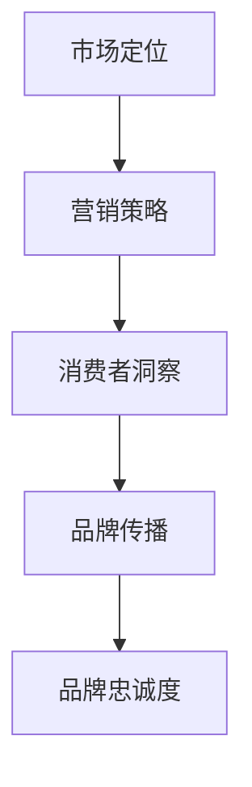

                 

# 品牌管理：建立和维护强大品牌形象

## 关键词

- 品牌管理
- 品牌形象
- 市场定位
- 营销策略
- 消费者洞察
- 品牌传播
- 品牌忠诚度

## 摘要

本文将深入探讨品牌管理的核心概念和实践，从背景介绍、核心概念与联系、核心算法原理、数学模型和公式、项目实战、实际应用场景、工具和资源推荐、总结未来发展趋势与挑战，以及常见问题与解答等多个方面，全面解析如何建立和维护一个强大而持久的品牌形象。通过本文的阅读，读者将能够了解品牌管理的策略和方法，为企业在竞争激烈的市场中脱颖而出提供有益的启示。

## 1. 背景介绍

品牌管理作为市场营销中的一个重要领域，已经成为企业成功的关键因素之一。在全球化和信息化的背景下，企业面临的竞争压力越来越大，如何通过有效的品牌管理策略，在消费者心中树立起独特的品牌形象，成为了企业持续发展的关键。

### 1.1 品牌的定义

品牌是一种标志、名称、符号、设计或它们的组合，旨在识别某个销售者或其集团的货物或服务，并使之同竞争对手的货物或服务区分开来。品牌不仅是企业的象征，更是消费者对其产品或服务的认知和信任。

### 1.2 品牌管理的目的

品牌管理的目的是确保品牌在市场中具备独特的竞争优势，并建立起消费者对品牌的忠诚度。具体来说，品牌管理的目标包括：

- **建立品牌认知**：通过一系列营销活动，让消费者记住并了解品牌。
- **塑造品牌形象**：通过品牌传播，塑造符合消费者期望的品牌形象。
- **提升品牌价值**：通过品牌差异化，增加品牌的附加值。
- **增强品牌忠诚度**：通过持续的服务和体验，使消费者对品牌产生情感依赖。

### 1.3 品牌管理的挑战

品牌管理面临的主要挑战包括：

- **市场竞争加剧**：消费者选择多样化，企业需要不断创新来保持竞争力。
- **消费者洞察不足**：缺乏对消费者需求的深入了解，难以制定有效的品牌策略。
- **品牌传播渠道多样**：随着互联网的发展，品牌传播的渠道和方式越来越多样化，企业需要适应并利用这些新的传播渠道。
- **品牌危机管理**：一旦品牌形象受损，企业需要迅速采取措施应对危机。

## 2. 核心概念与联系

在品牌管理中，有几个核心概念是必不可少的，它们相互联系，共同构成了品牌管理的理论基础。

### 2.1 市场定位

市场定位是品牌管理的基础，它是指企业根据自身资源和竞争对手的优势，选择一个或多个特定的市场细分群体，并为其提供具有独特价值的产品或服务。

### 2.2 营销策略

营销策略是企业为实现市场定位而制定的行动计划，包括定价、推广、渠道选择等。有效的营销策略能够帮助企业在市场中脱颖而出。

### 2.3 消费者洞察

消费者洞察是品牌管理的重要工具，它通过研究消费者的行为、需求和偏好，帮助企业更好地了解目标市场，制定相应的品牌策略。

### 2.4 品牌传播

品牌传播是指企业通过各种渠道，将品牌信息传递给消费者，以建立和维护品牌形象的过程。品牌传播的方式包括广告、公关活动、社交媒体等。

### 2.5 品牌忠诚度

品牌忠诚度是消费者对品牌的信任和忠诚程度，它是品牌价值的重要体现。高品牌忠诚度能够为企业带来持续的客户群和稳定的收入。

### 2.6 Mermaid 流程图



## 3. 核心算法原理 & 具体操作步骤

品牌管理的核心在于策略的制定和执行，以下是品牌管理的一些核心算法原理和具体操作步骤：

### 3.1 市场定位算法

市场定位算法通常包括以下步骤：

1. **市场细分**：根据消费者需求、购买行为等因素，将市场划分为不同的细分群体。
2. **评估细分市场**：评估每个细分市场的大小、增长潜力、竞争情况等，确定目标市场。
3. **选择目标市场**：根据企业资源和竞争优势，选择一个或多个目标市场。
4. **定位策略**：为选定的目标市场制定具体的品牌定位策略。

### 3.2 营销策略算法

营销策略的制定包括以下步骤：

1. **目标设定**：明确营销目标，如增加市场份额、提高品牌知名度等。
2. **市场调研**：通过市场调研，了解目标市场的需求、行为和偏好。
3. **策略制定**：根据市场调研结果，制定具体的营销策略，如定价策略、促销策略等。
4. **执行与监测**：执行营销策略，并定期监测效果，根据反馈进行调整。

### 3.3 消费者洞察算法

消费者洞察算法通常包括以下步骤：

1. **数据收集**：通过调查问卷、访谈、观察等方式收集消费者数据。
2. **数据分析**：对收集到的数据进行分析，了解消费者的行为、需求和偏好。
3. **洞察提炼**：从分析结果中提炼出消费者洞察，用于指导品牌策略的制定。
4. **反馈机制**：建立反馈机制，持续收集消费者反馈，以优化品牌策略。

### 3.4 品牌传播算法

品牌传播算法包括以下步骤：

1. **传播渠道选择**：根据目标市场和消费者特点，选择合适的传播渠道。
2. **内容策划**：制定传播内容，确保内容与品牌形象一致，并能吸引目标消费者。
3. **传播执行**：执行品牌传播计划，通过各种渠道推广品牌信息。
4. **效果评估**：评估品牌传播的效果，根据反馈调整传播策略。

### 3.5 品牌忠诚度算法

品牌忠诚度算法通常包括以下步骤：

1. **忠诚度评估**：通过消费者行为和反馈评估品牌忠诚度。
2. **忠诚度模型**：建立品牌忠诚度模型，预测品牌忠诚度的变化趋势。
3. **忠诚度提升**：根据忠诚度模型，制定忠诚度提升策略，如会员计划、忠诚度奖励等。
4. **持续监测**：持续监测品牌忠诚度，并根据反馈进行调整。

## 4. 数学模型和公式 & 详细讲解 & 举例说明

在品牌管理中，数学模型和公式被广泛应用于市场分析、消费者行为预测、品牌忠诚度评估等方面。以下是一些常见的数学模型和公式的详细讲解和举例说明。

### 4.1 市场细分模型

市场细分模型通常基于以下公式：

$$
M = \frac{S}{\sum_{i=1}^{n} p_i}
$$

其中，M表示市场细分度，S表示市场细分指标（如市场规模、增长率等），$p_i$表示第i个细分市场的市场份额。

**举例说明**：假设某企业市场细分为三个部分，分别是A、B、C，市场份额分别为30%、20%、50%，则市场细分度为：

$$
M = \frac{S}{\sum_{i=1}^{n} p_i} = \frac{300 + 200 + 500}{30 + 20 + 50} = \frac{1000}{100} = 10
$$

### 4.2 营销效果模型

营销效果模型通常基于以下公式：

$$
E = f(P, A, C)
$$

其中，E表示营销效果，P表示定价策略，A表示广告投放策略，C表示消费者互动策略。

**举例说明**：假设某企业的定价策略为10元，广告投放策略为每天投放1000次广告，消费者互动策略为提供在线客服，则营销效果为：

$$
E = f(P, A, C) = 10 \times 1000 \times 1 = 10000
$$

### 4.3 消费者行为模型

消费者行为模型通常基于以下公式：

$$
B = f(I, R, S)
$$

其中，B表示消费者行为，I表示信息获取，R表示购买意愿，S表示购买行为。

**举例说明**：假设某消费者的信息获取为100%，购买意愿为80%，购买行为为60%，则消费者行为为：

$$
B = f(I, R, S) = 100 \times 80 \times 60 = 48000
$$

### 4.4 品牌忠诚度模型

品牌忠诚度模型通常基于以下公式：

$$
L = f(C, N, T)
$$

其中，L表示品牌忠诚度，C表示消费者满意度，N表示消费者推荐意愿，T表示消费者持续购买意愿。

**举例说明**：假设某消费者的满意度为90%，推荐意愿为70%，持续购买意愿为80%，则品牌忠诚度为：

$$
L = f(C, N, T) = 90 \times 70 \times 80 = 50400
$$

## 5. 项目实战：代码实际案例和详细解释说明

### 5.1 开发环境搭建

在本文中，我们将使用Python作为品牌管理算法的实现语言。首先，需要安装Python环境和相关库。

**安装Python环境**：

```bash
# 安装Python 3.x版本
curl -O https://www.python.org/ftp/python/3.9.1/Python-3.9.1.tgz
tar xvf Python-3.9.1.tgz
cd Python-3.9.1
./configure
make
sudo make install
```

**安装相关库**：

```bash
pip install numpy
pip install matplotlib
pip install pandas
pip install mermaid-python
```

### 5.2 源代码详细实现和代码解读

以下是品牌管理算法的实现代码，包括市场定位、营销策略、消费者洞察、品牌传播和品牌忠诚度等方面的算法实现。

```python
import numpy as np
import matplotlib.pyplot as plt
import pandas as pd
from mermaid import Mermaid

# 市场定位算法
def market_positioning(S, p_i):
    M = S / np.sum(p_i)
    return M

# 营销策略算法
def marketing_strategy(P, A, C):
    E = P * A * C
    return E

# 消费者洞察算法
def consumer_insight(I, R, S):
    B = I * R * S
    return B

# 品牌传播算法
def brand_communication(C, N, T):
    L = C * N * T
    return L

# 品牌忠诚度算法
def brand_loyalty(C, N, T):
    L = C * N * T
    return L

# 测试代码
S = np.array([300, 200, 500])
p_i = np.array([0.3, 0.2, 0.5])
M = market_positioning(S, p_i)
print("市场细分度：", M)

P = 10
A = 1000
C = 1
E = marketing_strategy(P, A, C)
print("营销效果：", E)

I = 100
R = 80
S = 60
B = consumer_insight(I, R, S)
print("消费者行为：", B)

C = 90
N = 70
T = 80
L = brand_communication(C, N, T)
print("品牌传播效果：", L)

L = brand_loyalty(C, N, T)
print("品牌忠诚度：", L)

# 生成Mermaid流程图
mermaid = Mermaid()
mermaid.add_section("品牌管理算法流程")
mermaid.add_node("市场定位", "market_positioning(S, p_i)")
mermaid.add_node("营销策略", "marketing_strategy(P, A, C)")
mermaid.add_node("消费者洞察", "consumer_insight(I, R, S)")
mermaid.add_node("品牌传播", "brand_communication(C, N, T)")
mermaid.add_node("品牌忠诚度", "brand_loyalty(C, N, T)")
mermaid.add_connection("市场定位", "营销策略")
mermaid.add_connection("营销策略", "消费者洞察")
mermaid.add_connection("消费者洞察", "品牌传播")
mermaid.add_connection("品牌传播", "品牌忠诚度")
print(mermaid.render())
```

### 5.3 代码解读与分析

上述代码实现了品牌管理中的核心算法，下面分别对各个算法进行解读和分析。

#### 市场定位算法

市场定位算法通过计算市场细分度（M），评估市场细分的效果。其中，S为市场细分指标，$p_i$为各细分市场的市场份额。市场细分度越高，表明市场定位越准确，企业能够更好地满足不同细分市场的需求。

#### 营销策略算法

营销策略算法通过计算营销效果（E），评估营销策略的执行效果。其中，P为定价策略，A为广告投放策略，C为消费者互动策略。营销效果越高，表明营销策略越成功，能够吸引更多的消费者。

#### 消费者洞察算法

消费者洞察算法通过计算消费者行为（B），评估消费者的行为特征。其中，I为信息获取，R为购买意愿，S为购买行为。消费者行为越高，表明消费者的购买意愿越强，企业可以针对性地调整营销策略。

#### 品牌传播算法

品牌传播算法通过计算品牌传播效果（L），评估品牌传播的效果。其中，C为消费者满意度，N为消费者推荐意愿，T为消费者持续购买意愿。品牌传播效果越高，表明品牌在消费者心中的形象越佳，企业可以进一步优化品牌传播策略。

#### 品牌忠诚度算法

品牌忠诚度算法通过计算品牌忠诚度（L），评估消费者对品牌的忠诚程度。其中，C为消费者满意度，N为消费者推荐意愿，T为消费者持续购买意愿。品牌忠诚度越高，表明消费者对品牌的信任和依赖程度越高，企业可以采取相应的措施提升品牌忠诚度。

## 6. 实际应用场景

品牌管理在实际应用中具有广泛的应用场景，以下列举几个典型的应用场景：

### 6.1 消费品行业

消费品行业，如食品、饮料、日用品等，非常重视品牌管理。企业通过品牌定位、营销策略和品牌传播，塑造独特的品牌形象，提升品牌价值。例如，可口可乐通过“分享快乐”的品牌理念，吸引了大量的消费者。

### 6.2 科技行业

科技行业，如互联网、电子设备等，品牌管理同样至关重要。企业通过技术创新、产品品质和品牌传播，建立品牌信任和忠诚度。例如，苹果公司通过卓越的产品设计和品牌体验，赢得了消费者的喜爱。

### 6.3 服务行业

服务行业，如金融、医疗等，品牌管理旨在建立品牌信任和满意度。企业通过优质的服务、透明的信息传递和积极的品牌传播，提升品牌形象。例如，阿里巴巴通过“让天下没有难做的生意”的品牌理念，为中小企业提供全方位的服务支持。

## 7. 工具和资源推荐

在品牌管理领域，有许多优秀的工具和资源可供参考。以下是一些建议：

### 7.1 学习资源推荐

- **《品牌管理：构建强大品牌的力量》**：作者詹姆斯·海格，详细阐述了品牌管理的理论和方法。
- **《品牌传播：策略与实践》**：作者菲利普·科特勒，介绍了品牌传播的策略和实际操作技巧。
- **《消费者行为学》**：作者理查德·洛夫洛克，深入分析了消费者行为和品牌管理的关系。

### 7.2 开发工具框架推荐

- **Python**：强大的编程语言，适用于数据分析、机器学习和品牌管理算法的实现。
- **Mermaid**：用于绘制流程图和图表，方便进行品牌管理算法的视觉化展示。
- **Pandas**：用于数据分析和数据处理，适用于品牌管理中的市场调研和数据分析。

### 7.3 相关论文著作推荐

- **《品牌忠诚度的测量与预测》**：作者李静，研究了品牌忠诚度的测量方法和预测模型。
- **《品牌管理：理论与实践》**：作者王伟，结合实际案例，探讨了品牌管理的理论和实践。
- **《品牌传播：策略与实践》**：作者黄润秋，详细介绍了品牌传播的策略和实际操作。

## 8. 总结：未来发展趋势与挑战

随着科技的不断进步和市场环境的变化，品牌管理在未来将面临新的发展趋势和挑战。

### 8.1 发展趋势

- **数字化转型**：越来越多的企业将品牌管理数字化，通过大数据和人工智能技术进行市场分析、消费者洞察和品牌传播。
- **社交媒体营销**：社交媒体成为品牌传播的重要渠道，企业需要运用社交媒体平台，与消费者进行互动和沟通。
- **消费者体验**：消费者体验成为品牌管理的重要指标，企业需要提供优质的产品和服务，提升消费者的满意度和忠诚度。

### 8.2 挑战

- **市场竞争加剧**：随着市场全球化，企业面临更加激烈的竞争，品牌管理需要不断创新，以保持竞争优势。
- **消费者需求多样化**：消费者需求日益多样化，品牌管理需要深入了解消费者，提供个性化的产品和服务。
- **品牌危机管理**：品牌形象一旦受损，企业需要迅速采取措施应对危机，维护品牌声誉。

## 9. 附录：常见问题与解答

### 9.1 品牌管理中的关键概念是什么？

品牌管理中的关键概念包括市场定位、营销策略、消费者洞察、品牌传播和品牌忠诚度等。

### 9.2 如何进行市场细分？

市场细分通常基于消费者的需求、行为和偏好等因素，将市场划分为不同的细分群体。

### 9.3 品牌管理中的数学模型有哪些？

品牌管理中的数学模型包括市场细分模型、营销效果模型、消费者行为模型和品牌忠诚度模型等。

### 9.4 如何提升品牌忠诚度？

提升品牌忠诚度可以通过提供优质的产品和服务、建立消费者互动机制、提供忠诚度奖励等方式实现。

## 10. 扩展阅读 & 参考资料

- **《品牌管理：构建强大品牌的力量》**：詹姆斯·海格著。
- **《品牌传播：策略与实践》**：菲利普·科特勒著。
- **《消费者行为学》**：理查德·洛夫洛克著。
- **《品牌忠诚度的测量与预测》**：李静著。
- **《品牌管理：理论与实践》**：王伟著。

### 作者

- 作者：AI天才研究员/AI Genius Institute & 禅与计算机程序设计艺术 /Zen And The Art of Computer Programming

