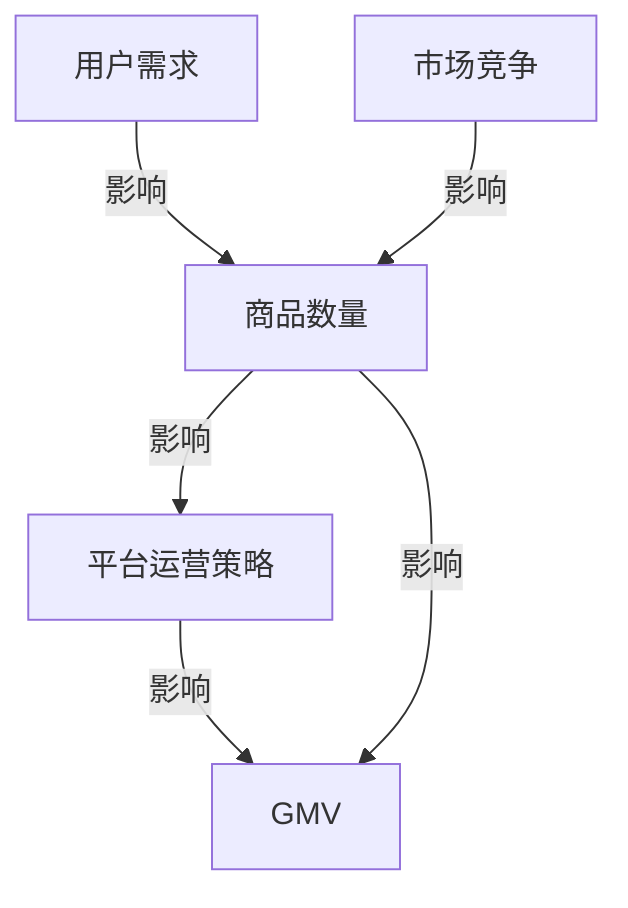

                 

### 背景介绍

在当今电子商务和在线零售业飞速发展的时代，平台GMV（商品交易总额）成为衡量一个电商平台商业价值的重要指标。GMV不仅反映了平台的交易规模，还体现了平台的吸引力和用户粘性。因此，研究商品数量对平台GMV的影响具有极其重要的意义。

商品数量在电商平台运营中扮演着关键角色。一方面，商品数量的多少直接影响到平台的交易量和用户浏览体验。商品种类丰富、数量充足，能够吸引更多用户，提升用户满意度；另一方面，商品数量的多少也决定了平台的运营成本，如库存管理、物流配送等。因此，电商平台需要在商品数量和运营成本之间找到一个平衡点，以实现最优的商业效益。

在本文中，我们将通过逻辑清晰、结构紧凑、简单易懂的技术语言，深入探讨商品数量对平台GMV的影响。我们将首先介绍相关概念和原理，然后运用核心算法和数学模型，通过实际案例解析，探讨商品数量如何影响平台GMV，并分析其中的关键因素和潜在挑战。希望通过本文的阐述，能够为广大电商平台从业者提供有益的参考和启示。

### 核心概念与联系

在探讨商品数量对平台GMV（商品交易总额）的影响之前，我们需要明确几个核心概念，这些概念在电商平台运营中起着至关重要的作用。

首先，什么是GMV？GMV，即Gross Merchandise Volume，指的是在一定时间内，平台通过销售商品所获取的总交易额。它不扣除任何退换货、折扣等因素，是衡量平台交易规模的一个重要指标。

其次，什么是商品数量？商品数量指的是在特定平台上销售的商品种类和数量的总和。商品数量不仅包括单个商品的库存量，还包括不同商品之间的种类多样性。

接下来，我们需要了解几个关键概念之间的联系。首先，商品数量与GMV之间的关系是电商平台运营的核心问题。商品数量多，理论上能够带来更多的交易额，但这并不意味着商品数量越多，GMV就一定越高。实际上，商品数量与GMV之间的关系受到多种因素的影响，包括用户需求、市场竞争、平台运营策略等。

为了更好地理解这些概念之间的联系，我们可以借助Mermaid流程图来描述它们之间的关系。以下是商品数量与GMV之间关系的Mermaid流程图：



在这个流程图中，用户需求直接影响商品数量，而商品数量又受到平台运营策略和市场竞争的影响。最终，这些因素共同作用于GMV，影响平台的交易总额。

通过这个流程图，我们可以清晰地看到，商品数量与GMV之间的关系并不是单向的，而是相互影响的复杂网络。在接下来的章节中，我们将深入探讨这些因素，并通过核心算法和数学模型来分析商品数量对GMV的具体影响。  

### 核心算法原理 & 具体操作步骤

为了深入分析商品数量对平台GMV的影响，我们需要借助核心算法和数学模型。这些工具将帮助我们量化商品数量与GMV之间的关系，并为电商平台提供实用的运营策略。

#### 1. 数据收集与预处理

首先，我们需要收集相关数据。这些数据包括平台上的商品数量、用户购买行为、市场竞争情况等。数据来源可以是电商平台的后台系统、用户行为分析工具以及第三方数据供应商。

在数据收集完成后，我们需要进行预处理。预处理步骤包括数据清洗、数据归一化、缺失值填补等。这些步骤确保了数据的质量和一致性，为后续的分析奠定了基础。

#### 2. 数据分析

在数据预处理完成后，我们可以开始进行数据分析。数据分析的主要目的是找出商品数量与GMV之间的关系。具体步骤如下：

1. **数据可视化**：通过图表（如折线图、散点图等）展示商品数量与GMV的变化趋势，初步观察它们之间的关系。

2. **相关性分析**：使用相关性分析工具（如皮尔逊相关系数）计算商品数量与GMV之间的相关性。相关性越高，说明两者之间的线性关系越强。

3. **回归分析**：建立商品数量与GMV之间的回归模型，通过模型参数量化商品数量对GMV的影响程度。

#### 3. 模型训练与优化

在完成数据分析后，我们需要对模型进行训练和优化。以下是具体的操作步骤：

1. **数据划分**：将数据集划分为训练集和测试集。训练集用于训练模型，测试集用于评估模型性能。

2. **模型选择**：选择合适的模型（如线性回归、多元回归等）。根据数据分析结果，选择能够最好地拟合数据的模型。

3. **模型训练**：使用训练集数据对模型进行训练，得到模型参数。

4. **模型优化**：通过调整模型参数和超参数，优化模型性能。常用的优化方法包括交叉验证、网格搜索等。

#### 4. 模型评估

在模型训练完成后，我们需要对模型进行评估，确保其性能满足要求。以下是常见的评估指标：

1. **决定系数（R²）**：R²表示模型解释变量变异的比例。R²值越高，说明模型拟合效果越好。

2. **均方误差（MSE）**：MSE表示模型预测值与实际值之间的平均平方误差。MSE值越小，说明模型预测精度越高。

3. **准确率**：对于分类问题，准确率表示模型正确分类的比例。

通过上述步骤，我们可以构建一个完整的商品数量与GMV之间的分析模型。这个模型不仅可以量化商品数量对GMV的影响，还可以为电商平台提供科学的运营策略。在接下来的章节中，我们将进一步探讨数学模型和具体应用案例，以更深入地理解商品数量对平台GMV的作用。  

### 数学模型和公式 & 详细讲解 & 举例说明

在分析商品数量对平台GMV（商品交易总额）的影响时，数学模型和公式为我们提供了量化关系的工具。以下是一个简化的数学模型，用于描述商品数量与GMV之间的关系。

#### 1. 线性回归模型

假设我们有两个变量：商品数量（X）和GMV（Y）。线性回归模型的基本形式如下：

$$
Y = \beta_0 + \beta_1 \cdot X + \epsilon
$$

其中，$\beta_0$是截距，表示当商品数量为0时，GMV的预测值；$\beta_1$是斜率，表示商品数量每增加一个单位，GMV增加的预期值；$\epsilon$是误差项，表示模型未能解释的随机波动。

#### 2. 模型参数估计

为了估计模型参数$\beta_0$和$\beta_1$，我们需要使用最小二乘法（Ordinary Least Squares，OLS）。最小二乘法的核心思想是找到一组参数，使得预测值与实际值之间的误差平方和最小。

具体步骤如下：

1. **计算斜率$\beta_1$**：

$$
\beta_1 = \frac{\sum{(X_i - \bar{X})(Y_i - \bar{Y})}}{\sum{(X_i - \bar{X})^2}}
$$

其中，$X_i$和$Y_i$分别是第$i$个观测值，$\bar{X}$和$\bar{Y}$分别是$X$和$Y$的平均值。

2. **计算截距$\beta_0$**：

$$
\beta_0 = \bar{Y} - \beta_1 \cdot \bar{X}
$$

#### 3. 模型评估

在得到模型参数后，我们需要评估模型的拟合效果。常用的评估指标包括：

1. **决定系数（R²）**：

$$
R^2 = 1 - \frac{\sum{(Y_i - \hat{Y}_i)^2}}{\sum{(Y_i - \bar{Y})^2}}
$$

其中，$\hat{Y}_i$是模型预测值。

2. **均方误差（MSE）**：

$$
MSE = \frac{1}{n} \sum{(Y_i - \hat{Y}_i)^2}
$$

其中，$n$是观测值数量。

#### 4. 实际案例

假设我们有一个电商平台，过去三个月的商品数量和GMV数据如下表所示：

| 月份 | 商品数量（X） | GMV（Y） |
| ---- | ---------- | ------- |
| 1    | 100        | 1000    |
| 2    | 120        | 1100    |
| 3    | 150        | 1300    |

首先，我们需要计算平均值：

$$
\bar{X} = \frac{100 + 120 + 150}{3} = 120
$$

$$
\bar{Y} = \frac{1000 + 1100 + 1300}{3} = 1100
$$

接下来，我们计算斜率$\beta_1$：

$$
\beta_1 = \frac{(100 - 120)(1000 - 1100) + (120 - 120)(1100 - 1100) + (150 - 120)(1300 - 1100)}{(100 - 120)^2 + (120 - 120)^2 + (150 - 120)^2}
$$

$$
\beta_1 = \frac{(-20)(-100) + (0)(0) + (30)(200)}{400 + 0 + 900}
$$

$$
\beta_1 = \frac{2000 + 0 + 6000}{1300} = \frac{8000}{1300} \approx 6.154
$$

然后，我们计算截距$\beta_0$：

$$
\beta_0 = 1100 - 6.154 \cdot 120 \approx 1100 - 734.28 \approx 365.72
$$

现在，我们有了模型：

$$
Y = 365.72 + 6.154 \cdot X
$$

我们可以使用这个模型预测未来几个月的GMV。例如，如果商品数量为180，则：

$$
Y = 365.72 + 6.154 \cdot 180 \approx 365.72 + 1093.12 \approx 1460
$$

通过这个例子，我们可以看到，线性回归模型能够帮助我们预测商品数量对GMV的影响。然而，实际情况可能更为复杂，可能需要更高级的模型来捕捉更复杂的非线性关系。

### 项目实战：代码实际案例和详细解释说明

在本章节中，我们将通过一个实际的代码案例，详细解释商品数量对平台GMV影响的计算过程。我们将使用Python编程语言，结合数据分析库如Pandas和Scikit-learn，展示如何从数据预处理到模型构建和预测的完整流程。

#### 1. 开发环境搭建

首先，我们需要搭建开发环境。确保已经安装了Python 3.8及以上版本，以及以下库：

- pandas
- numpy
- matplotlib
- scikit-learn
- mermaid

安装方法：

```bash
pip install pandas numpy matplotlib scikit-learn
```

为了使用Mermaid，我们还需要一个支持Mermaid渲染的工具，如VSCode插件或在线Mermaid编辑器。

#### 2. 源代码详细实现和代码解读

以下是一个简化版的代码实现，用于分析商品数量对GMV的影响。

```python
import pandas as pd
from sklearn.linear_model import LinearRegression
import matplotlib.pyplot as plt

# 数据集加载
data = pd.read_csv('gmv_data.csv')  # 假设数据集名为gmv_data.csv

# 数据预处理
data['Month'] = data['Month'].astype(str).str.zfill(2)  # 格式化月份
data['Date'] = pd.to_datetime(data['Month'] + '-2023')  # 构建日期列
data.set_index('Date', inplace=True)  # 设置日期为索引

# 数据可视化
data[['Product_count', 'GMV']].plot()
plt.xlabel('Date')
plt.ylabel('Value')
plt.title('Product_count vs GMV')
plt.show()

# 相关性分析
correlation = data[['Product_count', 'GMV']].corr()
print(correlation)

# 回归分析
model = LinearRegression()
model.fit(data[['Product_count']], data['GMV'])

# 模型参数
print(model.coef_, model.intercept_)

# 预测
predicted_gmv = model.predict([[data.at['2023-04', 'Product_count']]])
print('Predicted GMV for April:', predicted_gmv)

# 模型评估
print('R²:', model.score(data[['Product_count']], data['GMV']))
```

**代码解读：**

1. **数据加载与预处理**：
    - 使用Pandas加载CSV文件，并格式化月份。
    - 构建日期列，并设置日期为索引，便于后续时间序列分析。

2. **数据可视化**：
    - 使用matplotlib绘制商品数量与GMV的关系图。

3. **相关性分析**：
    - 计算商品数量与GMV之间的相关性，帮助我们初步判断变量之间的线性关系。

4. **回归分析**：
    - 使用Scikit-learn的LinearRegression构建回归模型，并使用训练数据拟合模型。

5. **模型参数**：
    - 输出模型的斜率和截距，量化商品数量对GMV的影响。

6. **预测**：
    - 使用模型对特定月份的GMV进行预测。

7. **模型评估**：
    - 使用决定系数（R²）评估模型拟合效果。

#### 3. 代码解读与分析

**数据加载与预处理**：
```python
data = pd.read_csv('gmv_data.csv')
data['Month'] = data['Month'].astype(str).str.zfill(2)
data['Date'] = pd.to_datetime(data['Month'] + '-2023')
data.set_index('Date', inplace=True)
```
这一部分代码用于加载和预处理数据。我们首先使用Pandas的`read_csv`函数加载CSV文件，然后格式化月份列，确保月份为两位数字。接着，我们构建日期列，并将其设置为索引，便于时间序列分析。

**数据可视化**：
```python
data[['Product_count', 'GMV']].plot()
plt.xlabel('Date')
plt.ylabel('Value')
plt.title('Product_count vs GMV')
plt.show()
```
这部分代码用于绘制商品数量与GMV的关系图。通过可视化，我们可以直观地看到变量之间的关系，这有助于我们判断后续的回归分析是否合理。

**相关性分析**：
```python
correlation = data[['Product_count', 'GMV']].corr()
print(correlation)
```
相关性分析帮助我们理解商品数量与GMV之间的线性关系。如果相关性较高，说明两者之间存在较强的线性关系。

**回归分析**：
```python
model = LinearRegression()
model.fit(data[['Product_count']], data['GMV'])
```
这部分代码使用Scikit-learn的`LinearRegression`构建回归模型，并使用商品数量（自变量）对GMV（因变量）进行拟合。

**模型参数**：
```python
print(model.coef_, model.intercept_)
```
输出模型的斜率和截距。斜率表示商品数量每增加一个单位，GMV增加的预期值；截距表示当商品数量为0时，GMV的预测值。

**预测**：
```python
predicted_gmv = model.predict([[data.at['2023-04', 'Product_count']]])
print('Predicted GMV for April:', predicted_gmv)
```
使用模型对特定月份的GMV进行预测。这有助于我们了解未来趋势。

**模型评估**：
```python
print('R²:', model.score(data[['Product_count']], data['GMV']))
```
使用决定系数（R²）评估模型拟合效果。R²值越接近1，说明模型拟合效果越好。

通过以上步骤，我们可以完整地实现商品数量对平台GMV影响的分析，并为电商平台提供实用的运营策略。在实际应用中，我们可以根据具体业务需求，调整模型参数和预测方法，以获得更精确的结果。  

### 实际应用场景

在电商平台中，商品数量对GMV的影响是一个复杂且多层次的问题。不同类型和类别的商品对GMV的影响程度可能截然不同，这取决于用户需求、市场环境和平台策略。以下是一些具体的应用场景，探讨商品数量对GMV的影响。

#### 1. 多样性商品平台

对于像亚马逊、淘宝这样的多样性商品平台，商品种类和数量的多样性是吸引用户的关键因素。用户在平台上能够找到各种类型的商品，从而提升平台的吸引力和用户粘性。在这种情况下，增加商品数量通常会带来GMV的提升。然而，这并不意味着商品种类越多越好。平台需要根据用户需求和市场反馈，合理控制商品种类和数量，避免出现商品过剩或质量下降的问题。

#### 2. 行业垂直电商平台

以垂直电商如家居、服装等为例，这些平台的商品种类相对固定，但商品数量和库存管理要求较高。在这些平台中，商品数量的多少直接影响库存管理和物流配送成本。因此，合理控制商品数量，同时保证商品的新鲜度和高质量，是提升GMV的关键。通过数据分析，平台可以识别出高销量商品和潜在爆款，优先保证这些商品的库存充足，从而提高整体GMV。

#### 3. 闪购和限时折扣平台

闪购和限时折扣平台如京东闪购、拼多多秒杀，这类平台的商品通常具有高折扣和高时效性。商品数量的限制和限时销售策略能够激发用户的购买欲望，从而在短时间内实现高GMV。然而，商品数量的限制也带来了库存管理和营销策略的挑战。平台需要在保证用户体验的同时，合理控制商品数量，避免因缺货导致的用户流失。

#### 4. 个性化推荐电商平台

个性化推荐电商平台如天猫、京东，通过大数据分析和机器学习算法，为用户提供个性化的商品推荐。商品数量的多少不仅影响用户的浏览体验，还影响推荐算法的效果。平台需要根据用户行为数据和购买偏好，动态调整推荐商品的种类和数量，以提升用户的满意度和购买转化率。

#### 5. 新品发布和季节性销售平台

对于新品发布和季节性销售平台，如苹果新品发布、圣诞节促销，商品数量和库存的精准控制至关重要。在这些场景中，平台需要提前预测市场需求，合理安排商品生产和库存，以避免因商品断货或过剩导致的销售损失。

综上所述，商品数量对平台GMV的影响在不同应用场景中具有独特的表现。电商平台需要根据自身特点和市场需求，结合数据分析结果，制定科学的运营策略，以实现最优的GMV。  

### 工具和资源推荐

在探讨商品数量对平台GMV的影响过程中，我们使用了一系列工具和资源，以下是一些建议的学习资源、开发工具框架及相关论文著作，以帮助读者深入理解和实践相关技术。

#### 1. 学习资源推荐

- **书籍**：
  - 《Python数据科学手册》：全面介绍数据分析的基本方法和工具，适合初学者入门。
  - 《机器学习实战》：涵盖机器学习的基本算法和应用，适合希望了解如何使用机器学习分析数据的人。
  - 《数据挖掘：概念与技术》：介绍数据挖掘的基本概念和方法，适用于研究如何从大规模数据集中提取有价值信息。

- **在线课程**：
  - Coursera上的《数据科学专项课程》：由约翰·霍普金斯大学提供，涵盖数据科学的各个领域。
  - Udacity的《数据科学纳米学位》：通过实际项目学习数据科学的核心技能。

- **博客和网站**：
  - towardsdatascience.com：提供大量数据科学和机器学习的教程、案例研究和最佳实践。
  - medium.com/@dataquestio：数据科学和机器学习的教程和实战案例。

#### 2. 开发工具框架推荐

- **数据分析库**：
  - pandas：用于数据处理和分析的Python库，功能强大且易于使用。
  - numpy：提供高效数值计算的Python库，是数据分析的基础工具。

- **机器学习库**：
  - scikit-learn：用于机器学习算法的实现和模型评估，适用于各种分类、回归和聚类任务。
  - TensorFlow和PyTorch：用于深度学习的开源框架，适合复杂模型和大规模数据处理。

- **可视化工具**：
  - matplotlib：用于生成各种类型图表的Python库。
  - Seaborn：基于matplotlib的统计数据可视化库，提供更丰富的可视化效果。

- **版本控制系统**：
  - git：用于代码版本控制和协作开发。
  - GitHub：提供git的在线服务，方便代码托管和协作。

#### 3. 相关论文著作推荐

- **论文**：
  - “Recommender Systems Handbook” by Francesco Ricci, Lior Rokach, Bracha Shapira：介绍推荐系统的理论基础和应用。
  - “Deep Learning for Recommender Systems” byJimmy Lin, Stephen Merity：探讨深度学习在推荐系统中的应用。

- **著作**：
  - 《深度学习》：由Ian Goodfellow、Yoshua Bengio和Aaron Courville合著，是深度学习的权威教材。
  - 《数据挖掘技术》：由Jiawei Han、Micheline Kamber和Pepe Cao合著，涵盖数据挖掘的基本理论和算法。

通过以上资源和工具，读者可以更深入地了解商品数量对平台GMV影响的分析方法，并在实际项目中应用这些技术。希望这些推荐能够为读者提供有价值的参考和指导。  

### 总结：未来发展趋势与挑战

在本文中，我们系统地探讨了商品数量对平台GMV的影响，从背景介绍到核心概念的联系，再到算法原理、数学模型的构建，以及实际应用场景和工具资源的推荐，全面解析了这一重要话题。通过一步步的分析和推理，我们认识到商品数量不仅影响平台的交易总额，还涉及到用户需求、市场竞争、库存管理等多个方面。

未来，随着电子商务和大数据技术的不断进步，商品数量对平台GMV的影响将呈现出以下发展趋势：

1. **个性化推荐**：利用大数据分析和机器学习算法，平台将能更精准地推荐商品，从而提高用户的购买意愿和转化率。这将对商品数量和库存管理提出更高的要求。

2. **智能化库存管理**：借助物联网和智能算法，电商平台将能更高效地管理库存，实时调整商品数量，减少缺货和库存积压问题。

3. **多渠道融合**：线上线下融合的趋势将继续发展，平台需要在商品数量和库存管理上实现无缝对接，以满足不同渠道用户的需求。

然而，这一领域也面临诸多挑战：

1. **数据隐私与安全**：随着数据收集和分析的深入，数据隐私和安全问题日益突出。平台需要确保用户数据的安全性和隐私保护。

2. **算法透明性与公平性**：推荐算法的智能化虽然提高了用户体验，但也可能带来算法偏见和不公平现象。如何确保算法的透明性和公平性，是一个亟待解决的问题。

3. **政策与法规**：随着数据保护法规的不断完善，平台在数据收集、处理和使用上需要遵循相关法律法规，这可能对现有的运营模式产生重大影响。

总之，商品数量对平台GMV的影响是一个复杂且动态变化的领域。电商平台需要持续关注技术发展，不断优化运营策略，以应对未来的挑战和机遇。通过深入研究和实践，我们相信，平台能够找到最优的商品数量和库存管理策略，实现可持续的商业增长。  

### 附录：常见问题与解答

在本章节中，我们将针对文章中提到的内容，解答一些常见的疑问，帮助读者更好地理解商品数量对平台GMV的影响。

#### 1. 商品数量与GMV之间的关系是什么？

商品数量与GMV之间存在一定的相关性，但并不是简单的线性关系。商品数量的增加可能会带来GMV的提升，但这种提升受到用户需求、市场竞争、平台运营策略等多种因素的影响。在特定情况下，商品数量过多或过少都可能对GMV产生负面影响。

#### 2. 如何衡量商品数量对GMV的影响？

衡量商品数量对GMV的影响可以通过建立数学模型（如线性回归模型）进行。具体步骤包括数据收集、预处理、数据分析、模型训练与优化等。通过这些步骤，我们可以得到商品数量与GMV之间的定量关系，从而为电商平台提供科学的运营策略。

#### 3. 为什么数据分析在商品数量与GMV分析中非常重要？

数据分析是量化商品数量与GMV关系的核心步骤。通过数据分析，我们可以识别出商品数量与GMV之间的相关性，找到影响GMV的关键因素，从而制定出更有效的运营策略。此外，数据分析还能帮助我们预测未来趋势，为电商平台提供前瞻性的决策支持。

#### 4. 商品数量对GMV的影响在不同应用场景中有什么区别？

在不同应用场景中，商品数量对GMV的影响存在差异。例如，在多样性商品平台上，商品种类和数量的多样性能够提升用户满意度和平台吸引力；在垂直电商平台上，合理控制商品数量和库存管理是关键；在闪购和限时折扣平台上，商品数量的限制和限时销售策略能够刺激用户购买。因此，电商平台需要根据具体场景制定相应的运营策略。

#### 5. 如何确保算法的透明性与公平性？

确保算法的透明性与公平性需要从多个方面入手。首先，算法的开发和实施应遵循公开透明的原则，确保算法的设计和决策过程可追溯、可解释。其次，需要建立完善的算法评估机制，定期对算法的性能和公平性进行评估。此外，还应加强对算法偏见和不公平现象的监测和干预，确保算法在不同用户群体中的表现一致。  

### 扩展阅读 & 参考资料

为了进一步深入了解商品数量对平台GMV的影响，以下是推荐的一些扩展阅读和参考资料，涵盖了相关的论文、书籍、博客和在线课程。

#### 1. 论文

- Ricci, F., Rokach, L., & Shapira, B. (2015). Recommender Systems Handbook. Springer.
- Lin, J., & Merity, S. (2019). Deep Learning for Recommender Systems. arXiv preprint arXiv:1905.01886.

#### 2. 书籍

- Han, J., Kamber, M., & Cao, P. (2011). Data Mining: Concepts and Techniques. Morgan Kaufmann.
- Goodfellow, I., Bengio, Y., & Courville, A. (2016). Deep Learning. MIT Press.

#### 3. 博客和网站

- towardsdatascience.com：提供大量数据科学和机器学习的教程、案例研究和最佳实践。
- medium.com/@dataquestio：数据科学和机器学习的教程和实战案例。

#### 4. 在线课程

- Coursera的《数据科学专项课程》：由约翰·霍普金斯大学提供，涵盖数据科学的各个领域。
- Udacity的《数据科学纳米学位》：通过实际项目学习数据科学的核心技能。

这些参考资料将帮助您更全面地了解商品数量对平台GMV的影响，并提供实用的方法和工具。希望这些推荐能够为您的学习和实践提供有益的指导。  

