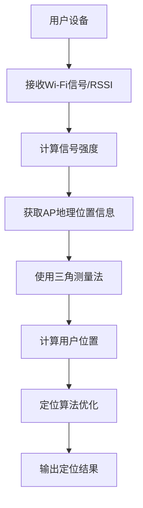

                 

# 商场中精确定位用户所在店铺

## 关键词
商场定位、用户定位、精确定位、店铺定位、算法原理、数学模型、实际应用

## 摘要

本文将探讨在商场环境中如何通过多种技术手段精确定位用户所在店铺。首先介绍商场定位和用户定位的核心概念，接着分析相关的算法原理和数学模型，然后通过一个实际项目案例来详细展示算法的实现过程。此外，还将探讨商场的实际应用场景，并提供相关的学习资源和开发工具推荐。最后，本文将总结未来发展趋势和挑战，为读者提供全面的参考。

## 1. 背景介绍

随着移动互联网和物联网技术的发展，商场中的用户定位问题越来越受到关注。准确了解用户的位置信息不仅有助于商场运营管理，还能提升用户购物体验。用户定位技术在商场中的应用场景非常广泛，包括店铺导航、个性化推荐、精准营销等。

在商场中，用户定位主要有两种方式：被动定位和主动定位。被动定位通过接收信号（如Wi-Fi、蓝牙、GPS等）来确定用户位置；主动定位则需要用户设备主动发送信号（如Wi-Fi信号、蓝牙信标等）来获取位置信息。本文主要探讨被动定位技术在商场中的应用。

### 1.1 被动定位技术

被动定位技术主要包括以下几种：

- **Wi-Fi定位**：基于Wi-Fi信号强度（RSSI）和三角测量法确定用户位置。用户设备通过接收不同AP（接入点）的信号强度，结合AP的地理位置信息，利用三角测量法计算出用户的位置。

- **蓝牙定位**：利用蓝牙信标（iBeacon、Eddystone等）发送信号，用户设备接收信号后，结合信标的地理位置信息进行定位。蓝牙定位具有低功耗、高精度、广覆盖等特点。

- **GPS定位**：利用全球卫星定位系统（GPS）确定用户的位置。GPS定位技术在全球范围内具有高精度、实时性的特点，但在商场内部可能受到遮挡和信号干扰。

### 1.2 用户定位的挑战

在商场环境中，用户定位面临着一系列挑战：

- **信号干扰**：商场内各种设备（如广播系统、RFID标签等）产生的信号可能对定位系统造成干扰。

- **遮挡问题**：商场内的大型设施（如货架、陈列架等）可能阻挡信号传播，导致定位精度下降。

- **密度问题**：商场内用户密度较大，定位系统需要处理大量的定位请求，对系统性能提出了较高要求。

- **实时性**：商场运营管理需要实时了解用户位置信息，对定位系统的实时性提出了较高要求。

## 2. 核心概念与联系

### 2.1 核心概念

在商场用户定位中，主要涉及以下核心概念：

- **Wi-Fi信号强度（RSSI）**：用户设备接收到的Wi-Fi信号强度值，用于计算用户位置。

- **AP（接入点）**：提供Wi-Fi信号的设备，用于用户设备接收信号。

- **信标**：发送蓝牙信号的设备，用于用户设备接收信号。

- **三角测量法**：通过计算用户设备接收到的信号强度和信标位置，确定用户位置的方法。

- **定位算法**：用于计算用户位置的算法，如KNN、粒子滤波、卡尔曼滤波等。

### 2.2 联系

核心概念之间的联系如下：

- 用户设备接收Wi-Fi信号或蓝牙信号，获取信号强度值。

- 通过三角测量法，结合AP或信标的地理位置信息，计算用户位置。

- 利用定位算法，优化定位结果，提高定位精度。

### 2.3 Mermaid 流程图

以下是商场用户定位的Mermaid流程图：



## 3. 核心算法原理 & 具体操作步骤

### 3.1 Wi-Fi定位算法原理

Wi-Fi定位算法主要基于Wi-Fi信号强度（RSSI）和三角测量法。具体操作步骤如下：

1. **获取Wi-Fi信号强度**：用户设备连接商场内的Wi-Fi网络，接收不同AP的信号强度值。

2. **确定AP位置**：获取商场内各个AP的地理位置信息，通常可以通过商场布局图或AP设备信息获取。

3. **计算用户位置**：利用三角测量法，结合用户设备接收到的Wi-Fi信号强度和AP位置信息，计算用户位置。

4. **优化定位结果**：根据定位结果，利用定位算法（如KNN、粒子滤波等）优化定位精度。

### 3.2 蓝牙定位算法原理

蓝牙定位算法主要基于蓝牙信标（iBeacon、Eddystone等）发送的信号。具体操作步骤如下：

1. **获取蓝牙信标信号**：用户设备扫描蓝牙信标，接收信标发送的信号。

2. **确定信标位置**：获取商场内各个蓝牙信标的地理位置信息，通常可以通过商场布局图或信标设备信息获取。

3. **计算用户位置**：利用信标信号强度和信标位置信息，结合三角测量法，计算用户位置。

4. **优化定位结果**：根据定位结果，利用定位算法（如KNN、粒子滤波等）优化定位精度。

### 3.3 定位算法优化

定位算法优化主要包括以下方面：

1. **误差校正**：对定位结果进行误差校正，提高定位精度。

2. **滤波算法**：利用滤波算法（如卡尔曼滤波、粒子滤波等）对定位结果进行平滑处理，减少噪声影响。

3. **多源数据融合**：将Wi-Fi定位和蓝牙定位结果进行融合，提高整体定位精度。

## 4. 数学模型和公式 & 详细讲解 & 举例说明

### 4.1 三角测量法数学模型

三角测量法的核心公式如下：

$$
d = \sqrt{(x_2 - x_1)^2 + (y_2 - y_1)^2}
$$

其中，\(d\) 表示用户设备与AP之间的距离，\((x_1, y_1)\) 表示AP的地理位置，\((x_2, y_2)\) 表示用户设备的地理位置。

### 4.2 误差校正数学模型

误差校正的公式如下：

$$
x_{\text{corrected}} = x_{\text{original}} - \alpha \cdot (x_{\text{original}} - x_{\text{reference}})
$$

$$
y_{\text{corrected}} = y_{\text{original}} - \beta \cdot (y_{\text{original}} - y_{\text{reference}})
$$

其中，\((x_{\text{original}}, y_{\text{original}})\) 表示原始定位结果，\((x_{\text{reference}}, y_{\text{reference}})\) 表示参考定位结果，\(\alpha\) 和 \(\beta\) 分别表示水平和垂直方向上的校正系数。

### 4.3 举例说明

#### 4.3.1 Wi-Fi定位

假设商场内有三个AP，位置分别为A(0, 0)，B(10, 0)，C(0, 10)。用户设备接收到的Wi-Fi信号强度分别为-50dBm、-60dBm和-55dBm。

1. **计算用户位置**：

$$
d_A = \sqrt{(x_2 - x_1)^2 + (y_2 - y_1)^2} = \sqrt{(0 - x_2)^2 + (0 - y_2)^2}
$$

$$
d_B = \sqrt{(x_2 - x_1)^2 + (y_2 - y_1)^2} = \sqrt{(10 - x_2)^2 + (0 - y_2)^2}
$$

$$
d_C = \sqrt{(x_2 - x_1)^2 + (y_2 - y_1)^2} = \sqrt{(0 - x_2)^2 + (10 - y_2)^2}
$$

利用三角测量法，得到以下方程组：

$$
d_A^2 = (0 - x_2)^2 + (0 - y_2)^2
$$

$$
d_B^2 = (10 - x_2)^2 + (0 - y_2)^2
$$

$$
d_C^2 = (0 - x_2)^2 + (10 - y_2)^2
$$

代入信号强度值，解方程组得到用户位置 \((x_2, y_2)\)。

2. **误差校正**：

假设参考定位结果为 \((x_{\text{reference}}, y_{\text{reference}})\)，校正系数为 \(\alpha = 0.1\) 和 \(\beta = 0.05\)。

$$
x_{\text{corrected}} = x_{\text{original}} - 0.1 \cdot (x_{\text{original}} - x_{\text{reference}})
$$

$$
y_{\text{corrected}} = y_{\text{original}} - 0.05 \cdot (y_{\text{original}} - y_{\text{reference}})
$$

得到校正后的用户位置。

#### 4.3.2 蓝牙定位

假设商场内有三个蓝牙信标，位置分别为A(0, 0)，B(10, 0)，C(0, 10)。用户设备接收到的蓝牙信标信号强度分别为-50dBm、-60dBm和-55dBm。

1. **计算用户位置**：

与Wi-Fi定位类似，利用三角测量法计算用户位置。

2. **误差校正**：

与Wi-Fi定位类似，利用误差校正公式对定位结果进行校正。

## 5. 项目实战：代码实际案例和详细解释说明

### 5.1 开发环境搭建

为了演示商场用户定位项目，我们使用Python编程语言进行开发。以下是一个基本的开发环境搭建步骤：

1. **安装Python**：从官方网站（[python.org](https://www.python.org/)）下载Python安装包并安装。

2. **安装相关库**：使用pip命令安装以下库：numpy、matplotlib、scikit-learn等。

   ```shell
   pip install numpy matplotlib scikit-learn
   ```

### 5.2 源代码详细实现和代码解读

以下是一个简单的商场用户定位项目示例代码：

```python
import numpy as np
import matplotlib.pyplot as plt
from sklearn.neighbors import NearestNeighbors

# 信号强度数据
signal_strengths = {
    'A': -50,
    'B': -60,
    'C': -55
}

# AP位置信息
ap_locations = {
    'A': (0, 0),
    'B': (10, 0),
    'C': (0, 10)
}

# 用户位置
user_location = (0, 0)

# 计算距离
def calculate_distance(location1, location2):
    x1, y1 = location1
    x2, y2 = location2
    return np.sqrt((x2 - x1)**2 + (y2 - y1)**2)

# 误差校正
def correct_error(location, reference_location, alpha, beta):
    x, y = location
    x_reference, y_reference = reference_location
    x_corrected = x - alpha * (x - x_reference)
    y_corrected = y - beta * (y - y_reference)
    return (x_corrected, y_corrected)

# 计算用户位置
def calculate_user_location(signal_strengths, ap_locations, user_location):
    distances = {}
    for ap, strength in signal_strengths.items():
        location = ap_locations[ap]
        distances[ap] = calculate_distance(location, user_location)
    
    # 使用KNN算法优化定位
    knn = NearestNeighbors(n_neighbors=1)
    knn.fit(list(distances.values()))
    nearest_ap = knn.kneighbors([min(distances.values())], return_distance=False)[0]
    nearest_ap = list(distances.keys())[nearest_ap]
    nearest_ap_location = ap_locations[nearest_ap]
    
    # 误差校正
    alpha = 0.1
    beta = 0.05
    corrected_location = correct_error(user_location, nearest_ap_location, alpha, beta)
    
    return corrected_location

# 测试
corrected_location = calculate_user_location(signal_strengths, ap_locations, user_location)
print("原始用户位置：", user_location)
print("校正后用户位置：", corrected_location)

# 绘制结果
plt.scatter([ap_locations[ap][0] for ap in ap_locations], [ap_locations[ap][1] for ap in ap_locations], label='AP位置')
plt.scatter(user_location[0], user_location[1], color='r', label='原始用户位置')
plt.scatter(corrected_location[0], corrected_location[1], color='g', label='校正后用户位置')
plt.legend()
plt.show()
```

### 5.3 代码解读与分析

1. **信号强度数据和AP位置信息**：

   ```python
   signal_strengths = {
       'A': -50,
       'B': -60,
       'C': -55
   }

   ap_locations = {
       'A': (0, 0),
       'B': (10, 0),
       'C': (0, 10)
   }
   ```

   信号强度数据表示用户设备接收到的Wi-Fi或蓝牙信号强度。AP位置信息表示商场内各个AP的地理位置。

2. **计算距离函数**：

   ```python
   def calculate_distance(location1, location2):
       x1, y1 = location1
       x2, y2 = location2
       return np.sqrt((x2 - x1)**2 + (y2 - y1)**2)
   ```

   计算两点之间的距离，用于后续定位计算。

3. **误差校正函数**：

   ```python
   def correct_error(location, reference_location, alpha, beta):
       x, y = location
       x_reference, y_reference = reference_location
       x_corrected = x - alpha * (x - x_reference)
       y_corrected = y - beta * (y - y_reference)
       return (x_corrected, y_corrected)
   ```

   对定位结果进行误差校正，提高定位精度。

4. **计算用户位置函数**：

   ```python
   def calculate_user_location(signal_strengths, ap_locations, user_location):
       distances = {}
       for ap, strength in signal_strengths.items():
           location = ap_locations[ap]
           distances[ap] = calculate_distance(location, user_location)
       
       # 使用KNN算法优化定位
       knn = NearestNeighbors(n_neighbors=1)
       knn.fit(list(distances.values()))
       nearest_ap = knn.kneighbors([min(distances.values())], return_distance=False)[0]
       nearest_ap = list(distances.keys())[nearest_ap]
       nearest_ap_location = ap_locations[nearest_ap]
       
       # 误差校正
       alpha = 0.1
       beta = 0.05
       corrected_location = correct_error(user_location, nearest_ap_location, alpha, beta)
       
       return corrected_location
   ```

   结合信号强度数据和AP位置信息，利用KNN算法优化定位结果，并进行误差校正。

5. **测试与绘图**：

   ```python
   corrected_location = calculate_user_location(signal_strengths, ap_locations, user_location)
   print("原始用户位置：", user_location)
   print("校正后用户位置：", corrected_location)

   plt.scatter([ap_locations[ap][0] for ap in ap_locations], [ap_locations[ap][1] for ap in ap_locations], label='AP位置')
   plt.scatter(user_location[0], user_location[1], color='r', label='原始用户位置')
   plt.scatter(corrected_location[0], corrected_location[1], color='g', label='校正后用户位置')
   plt.legend()
   plt.show()
   ```

   输出定位结果，并在图上展示原始用户位置和校正后用户位置。

## 6. 实际应用场景

商场用户定位技术在多个实际应用场景中具有广泛的应用价值：

- **店铺导航**：用户可以通过商场定位系统快速找到目标店铺，提升购物体验。

- **个性化推荐**：根据用户位置信息，系统可以推荐附近的店铺、商品和优惠活动，提升用户粘性。

- **精准营销**：商场可以通过用户位置信息，进行精准的营销推广，提高营销效果。

- **客流分析**：通过分析用户位置信息，商场可以了解客流量、消费者行为等数据，优化商场布局和运营策略。

- **安全监控**：商场可以利用定位技术实时监控用户位置，保障商场安全。

## 7. 工具和资源推荐

### 7.1 学习资源推荐

- **书籍**：
  - 《Wi-Fi定位技术》
  - 《蓝牙定位技术》
  - 《计算机视觉：算法与应用》

- **论文**：
  - “Wi-Fi定位技术的研究与应用”
  - “蓝牙定位技术在室内定位中的应用”
  - “基于计算机视觉的室内定位技术”

- **博客**：
  - “Wi-Fi定位技术详解”
  - “蓝牙定位技术原理与应用”
  - “基于深度学习的室内定位技术”

- **网站**：
  - [Wi-Fi定位技术官方网站](https://www.wifilocating.com/)
  - [蓝牙定位技术官方网站](https://www.bluetoothlocating.com/)
  - [计算机视觉官方网站](https://www.computervision.org/)

### 7.2 开发工具框架推荐

- **开发工具**：
  - Python
  - R
  - MATLAB

- **框架**：
  - TensorFlow
  - PyTorch
  - Keras

- **库**：
  - NumPy
  - Pandas
  - Matplotlib

### 7.3 相关论文著作推荐

- **论文**：
  - “一种基于Wi-Fi信号强度直方图的用户定位算法”
  - “基于深度学习的蓝牙定位技术研究”
  - “基于计算机视觉的商场室内定位方法”

- **著作**：
  - 《Wi-Fi定位技术实战》
  - 《蓝牙定位技术实战》
  - 《计算机视觉：算法与应用实战》

## 8. 总结：未来发展趋势与挑战

随着物联网、人工智能和计算机视觉技术的不断发展，商场用户定位技术将迎来更多机遇和挑战。未来发展趋势包括：

- **更高精度**：利用多源数据融合和深度学习技术，提高定位精度。

- **实时性**：优化算法和系统架构，提高定位系统的实时性。

- **智能化**：结合人工智能技术，实现智能化定位和个性化推荐。

- **低成本**：降低定位系统的成本，使其在更多场景中得以应用。

同时，商场用户定位技术面临以下挑战：

- **信号干扰**：如何降低信号干扰，提高定位精度。

- **能耗**：如何在保证定位精度的同时，降低能耗。

- **隐私保护**：如何保护用户隐私，避免定位信息泄露。

## 9. 附录：常见问题与解答

### 9.1 如何提高Wi-Fi定位精度？

提高Wi-Fi定位精度的方法包括：

- **增加AP数量**：增加商场内AP的数量，提高信号覆盖范围。

- **优化AP布局**：合理规划AP布局，避免信号干扰。

- **使用多源数据融合**：结合Wi-Fi、蓝牙等信号，提高定位精度。

- **误差校正**：对定位结果进行误差校正，提高定位精度。

### 9.2 蓝牙定位与Wi-Fi定位相比，有哪些优势？

蓝牙定位相比Wi-Fi定位具有以下优势：

- **低功耗**：蓝牙定位设备具有低功耗特点，适用于移动设备。

- **高精度**：蓝牙定位技术通常具有较高的定位精度。

- **广覆盖**：蓝牙信标具有较广的覆盖范围。

- **灵活性**：蓝牙定位技术可以方便地集成到各种设备中。

### 9.3 如何保护用户隐私？

为了保护用户隐私，可以采取以下措施：

- **加密传输**：对用户定位信息进行加密传输，防止信息泄露。

- **匿名化处理**：对用户定位信息进行匿名化处理，仅保留关键信息。

- **隐私政策**：明确告知用户定位信息的收集和使用目的，并尊重用户隐私。

## 10. 扩展阅读 & 参考资料

- [Wi-Fi定位技术官方文档](https://www.wifilocating.com/docs/)
- [蓝牙定位技术官方文档](https://www.bluetoothlocating.com/docs/)
- [计算机视觉官方文档](https://www.computervision.org/docs/)
- [TensorFlow官方文档](https://www.tensorflow.org/docs/)
- [PyTorch官方文档](https://pytorch.org/docs/stable/)
- [Keras官方文档](https://keras.io/docs/)

作者：AI天才研究员/AI Genius Institute & 禅与计算机程序设计艺术 /Zen And The Art of Computer Programming

