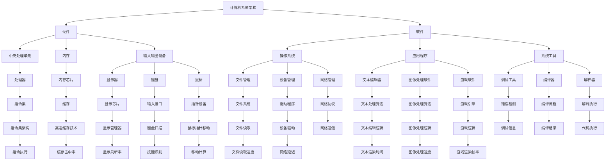

                 

### 背景介绍

在人类历史的长河中，计算作为一种基本能力，始终伴随着人类的发展。从早期的算筹、算盘，到现代的电子计算机，人类计算能力的提升不仅推动了科技革命，也深刻改变了社会结构和人类生活方式。本文将回顾人类计算的发展历程，从古代的计算工具，到现代计算机科学的核心概念，再到未来计算的发展趋势，力求展示这一过程中技术的进步与变革。

随着计算机科学的兴起，计算机不再仅仅是一种工具，而成为了解决复杂问题、推动科技进步的重要手段。现代计算技术已经广泛应用于各个领域，包括科学计算、数据分析、人工智能、物联网等。这些技术的迅猛发展，不仅为我们的生活带来了便利，也对全球经济和社会产生了深远影响。

然而，随着计算能力的不断提升，我们也面临着新的挑战。数据隐私、网络安全、计算资源的合理利用等问题日益突出，需要我们持续探索和解决。因此，深入理解和把握计算技术的基本原理，对于应对未来挑战具有重要意义。

本文将首先介绍人类计算的历史背景和发展脉络，然后重点讨论现代计算机科学的核心概念和架构，接着探讨核心算法的原理和操作步骤，并结合数学模型和公式进行详细分析。最后，我们将通过实际项目实战，展示计算技术在具体应用中的效果，并对未来计算技术的发展趋势进行展望。希望通过本文的回顾与展望，能够帮助读者更好地理解人类计算的发展历程，以及其背后的逻辑和原理。

### 2. 核心概念与联系

在深入探讨人类计算的发展历程之前，有必要先明确几个核心概念，这些概念是理解现代计算机科学及其工作原理的基础。

**计算机系统架构**：计算机系统架构是指计算机硬件和软件的总体组织结构和功能分布。其中，硬件部分包括中央处理单元（CPU）、内存、输入输出设备等；软件部分则包括操作系统、应用程序和系统工具。计算机系统架构的发展经历了从早期的冯·诺依曼架构（Von Neumann Architecture）到现代的多处理器架构、GPU加速架构等，不断推动计算能力的提升。

**算法**：算法是指解决问题的步骤和方法，是计算机科学的核心。无论是排序、搜索，还是更复杂的图形处理和机器学习算法，算法都是实现计算机功能的核心。算法的效率直接影响到计算的速度和质量。

**编程语言**：编程语言是用于编写算法和程序的工具，是人与计算机之间的桥梁。从早期的机器语言、汇编语言，到现代的高级编程语言（如Python、Java、C++等），编程语言的演变极大地简化了编程过程，提高了开发效率。

**数据结构**：数据结构是指数据的组织和存储方式，是算法设计的重要基础。常见的有数组、链表、树、图等。选择合适的数据结构可以显著提高算法的效率和性能。

为了更好地理解这些核心概念之间的联系，我们可以通过一个简单的 Mermaid 流程图来展示它们的基本关系。



从上述 Mermaid 流程图中，我们可以看到计算机系统架构的核心组成部分是如何相互联系和协同工作的。硬件部分包括中央处理单元、内存和输入输出设备，软件部分包括操作系统、应用程序和系统工具，这些部分共同构成了计算机的运行环境。算法和数据结构则在这些环境中被实现和优化，以实现高效的计算任务。

通过这种关系图，我们可以更好地理解计算机科学中的各种概念是如何相互作用的。例如，不同的编程语言和算法依赖于操作系统提供的接口和数据结构来实现特定的功能。硬件的性能直接影响到软件的运行效率，而操作系统和软件的设计则需要在硬件的限制下进行优化。

总之，计算机系统架构、算法、编程语言和数据结构是计算机科学中不可或缺的核心概念，它们相互联系，共同推动了计算技术的发展。在接下来的章节中，我们将进一步探讨这些核心概念的具体原理和实现方式。

### 3. 核心算法原理 & 具体操作步骤

核心算法是计算机科学中的灵魂，是实现复杂计算任务的关键。本文将重点介绍几个经典的核心算法，包括排序算法、搜索算法和机器学习算法，并详细讲解它们的原理和具体操作步骤。

#### 3.1 排序算法

排序算法是计算机科学中非常基础且重要的算法之一，其主要目的是将一组数据按照某种规则进行排序。常见的排序算法有冒泡排序（Bubble Sort）、选择排序（Selection Sort）、插入排序（Insertion Sort）和快速排序（Quick Sort）等。

**冒泡排序（Bubble Sort）**

冒泡排序是一种简单的排序算法，它通过重复遍历要排序的数列，比较每对相邻元素的值，若顺序错误则交换它们，直到整个序列有序。

具体操作步骤：

1. 从第一个元素开始，相邻元素两两比较，若第一个比第二个大，则交换它们。
2. 第一轮结束后，最大元素被移动到数组的最后。
3. 重复以上步骤，但每次只对未排序的部分进行排序。
4. 当未排序部分为空时，排序完成。

$$
\text{冒泡排序代码实现}：
\begin{aligned}
&\text{for } i = 0 \text{ to n-1:} \\
&\quad \text{for } j = 0 \text{ to n-i-1:} \\
&\quad \quad \text{if } arr[j] > arr[j+1]: \\
&\quad \quad \quad \text{swap(arr[j], arr[j+1])}
\end{aligned}
$$

**快速排序（Quick Sort）**

快速排序是一种高效的排序算法，采用分治策略。其基本思想是通过一趟排序将待排序的记录分隔成独立的两部分，其中一部分记录的关键字均比另一部分的关键字小，然后分别对这两部分记录继续进行排序，以达到整个序列有序。

具体操作步骤：

1. 选择一个基准元素（通常是中间元素）。
2. 将比基准元素小的元素移到其左侧，比其大的元素移到其右侧，这一步骤称为分区（Partition）。
3. 递归地使用快速排序对左右两部分进行排序。

$$
\text{快速排序代码实现}：
\begin{aligned}
&\text{def quick_sort(arr, low, high):} \\
&\quad \text{if low < high:} \\
&\quad \quad \text{pivot} = partition(arr, low, high) \\
&\quad \quad \text{quick_sort(arr, low, pivot - 1)} \\
&\quad \quad \text{quick_sort(arr, pivot + 1, high)} \\
&\text{def partition(arr, low, high):} \\
&\quad \text{pivot} = arr[high] \\
&\quad \text{i} = low - 1 \\
&\text{for j = low to high - 1:} \\
&\quad \text{if arr[j] < pivot:} \\
&\quad \quad \text{swap(arr[i], arr[j])} \\
&\quad \quad \text{i} = i + 1 \\
&\text{swap(arr[i], arr[high])} \\
&\text{return i}
\end{aligned}
$$

#### 3.2 搜索算法

搜索算法用于在数据集合中查找特定元素，常见的搜索算法有线性搜索（Linear Search）和二分搜索（Binary Search）。

**线性搜索（Linear Search）**

线性搜索是从数组的起始位置开始，依次与目标元素进行比较，直到找到或到达数组末尾。

具体操作步骤：

1. 从第一个元素开始，依次与目标元素进行比较。
2. 如果找到目标元素，返回其位置；否则，返回-1。

$$
\text{线性搜索代码实现}：
\begin{aligned}
&\text{def linear_search(arr, target):} \\
&\quad \text{for i = 0 to n-1:} \\
&\quad \quad \text{if arr[i] == target:} \\
&\quad \quad \quad \text{return i} \\
&\text{return -1}
\end{aligned}
$$

**二分搜索（Binary Search）**

二分搜索适用于已经排序的数组，通过不断将搜索范围缩小一半，快速找到目标元素。

具体操作步骤：

1. 确定中间元素。
2. 如果中间元素等于目标元素，返回其位置。
3. 如果中间元素大于目标元素，则在左侧子数组继续搜索。
4. 如果中间元素小于目标元素，则在右侧子数组继续搜索。
5. 重复步骤1-4，直到找到目标元素或确定不存在。

$$
\text{二分搜索代码实现}：
\begin{aligned}
&\text{def binary_search(arr, target):} \\
&\quad \text{low} = 0 \\
&\quad \text{high} = n - 1 \\
&\text{while low <= high:} \\
&\quad \text{mid} = \frac{low + high}{2} \\
&\quad \text{if arr[mid] == target:} \\
&\quad \quad \text{return mid} \\
&\quad \text{elif arr[mid] < target:} \\
&\quad \quad \text{low} = mid + 1 \\
&\quad \text{else:} \\
&\quad \quad \text{high} = mid - 1 \\
&\text{return -1}
\end{aligned}
$$

#### 3.3 机器学习算法

机器学习算法是近年来计算机科学领域的重要突破，其通过从数据中自动学习规律和模式，实现预测和决策。常见的机器学习算法包括线性回归、逻辑回归和决策树等。

**线性回归（Linear Regression）**

线性回归是一种预测连续值的算法，其基本思想是找到一组线性方程，使得这些方程能够最好地拟合数据。

具体操作步骤：

1. 将数据集分为训练集和测试集。
2. 训练阶段：通过最小二乘法计算最佳拟合直线，公式为 $y = ax + b$，其中 $a$ 和 $b$ 是待求参数。
3. 预测阶段：使用训练得到的模型对测试集进行预测。

$$
\text{线性回归代码实现}：
\begin{aligned}
&\text{def linear_regression(X, y):} \\
&\quad \text{X\_trans} = X.transpose() \\
&\quad \text{theta} = \frac{X\_trans \cdot X}{X\_trans \cdot X + \epsilon} \cdot X\_trans \cdot y \\
&\quad \text{return theta} \\
&\text{def predict(X, theta):} \\
&\quad \text{predictions} = X \cdot theta \\
&\quad \text{return predictions}
\end{aligned}
$$

**逻辑回归（Logistic Regression）**

逻辑回归是一种预测分类结果的算法，其基本思想是使用逻辑函数将线性模型映射到概率空间。

具体操作步骤：

1. 将数据集分为训练集和测试集。
2. 训练阶段：通过极大似然估计法计算模型参数。
3. 预测阶段：计算每个样本属于每个类别的概率，选取概率最大的类别作为预测结果。

$$
\text{逻辑回归代码实现}：
\begin{aligned}
&\text{def logistic_regression(X, y):} \\
&\quad \text{X\_trans} = X.transpose() \\
&\quad \text{theta} = \frac{X\_trans \cdot X}{X\_trans \cdot X + \epsilon} \cdot X\_trans \cdot y \\
&\quad \text{return theta} \\
&\text{def predict(X, theta):} \\
&\quad \text{probabilities} = \frac{1}{1 + \exp{(-X \cdot theta)}} \\
&\quad \text{return np.argmax(probabilities, axis=1)}
\end{aligned}
$$

**决策树（Decision Tree）**

决策树是一种基于特征的树形结构模型，其通过一系列规则将数据划分为多个子集。

具体操作步骤：

1. 选择特征作为节点。
2. 对每个节点，计算该特征的不同取值对应的子节点的信息增益或基尼系数。
3. 选择信息增益最大或基尼系数最小的特征作为分割标准。
4. 递归地对子节点进行相同的分割，直到满足终止条件。

$$
\text{决策树代码实现}：
\begin{aligned}
&\text{def build_tree(data, labels, features):} \\
&\quad \text{if } \text{all(labels == labels[0]):} \\
&\quad \quad \text{return labels[0]} \\
&\quad \text{if } \text{len(features) == 0:} \\
&\quad \quad \text{return majority_vote(labels)} \\
&\quad \text{best_feature} = \text{choose_best_feature(data, labels)} \\
&\quad \text{tree} = \{\text{feature: best\_feature}\} \\
&\quad \text{for value in unique_values(data[best\_feature]):} \\
&\quad \quad \text{sub_tree} = \text{build\_tree(data[best\_feature] == value, labels, features \setminus \{best\_feature\})} \\
&\quad \quad \text{tree[value] = sub\_tree} \\
&\quad \text{return tree} \\
&\text{def classify(tree, sample):} \\
&\quad \text{if type(tree) != dict:} \\
&\quad \quad \text{return tree} \\
&\quad \text{current_node} = tree \\
&\quad \text{for feature in sample:} \\
&\quad \quad \text{current\_node} = current\_node[feature] \\
&\quad \text{return classify(current\_node, sample)}
\end{aligned}
$$

通过上述介绍，我们可以看到，排序算法、搜索算法和机器学习算法是计算机科学中的核心组成部分，它们不仅在学术研究中有重要应用，也在实际工程中发挥着关键作用。理解和掌握这些算法的原理和操作步骤，对于深入理解计算机科学具有重要意义。

### 4. 数学模型和公式 & 详细讲解 & 举例说明

在计算机科学中，数学模型和公式是理解和实现算法的重要工具。它们不仅提供了量化分析的方法，还帮助我们在复杂的计算任务中找到有效的解决方案。本章节将详细介绍一些常见的数学模型和公式，并通过具体实例进行讲解。

#### 4.1 线性回归模型

线性回归模型是一种用于预测连续值的统计模型，其基本形式为：

$$
y = \beta_0 + \beta_1x_1 + \beta_2x_2 + \ldots + \beta_nx_n + \epsilon
$$

其中，$y$ 是预测的目标变量，$x_1, x_2, \ldots, x_n$ 是自变量，$\beta_0, \beta_1, \beta_2, \ldots, \beta_n$ 是模型的参数，$\epsilon$ 是误差项。

为了估计这些参数，我们通常使用最小二乘法。其目标是最小化预测值与实际值之间的平方误差和：

$$
\min \sum_{i=1}^n (y_i - \hat{y}_i)^2
$$

其中，$\hat{y}_i$ 是基于模型预测的 $y_i$ 值。

**实例分析**

假设我们有以下数据集：

| $x_1$ | $x_2$ | $y$ |
|-------|-------|-----|
| 1     | 2     | 3   |
| 2     | 4     | 5   |
| 3     | 6     | 7   |
| 4     | 8     | 9   |

我们希望找到线性回归模型 $y = \beta_0 + \beta_1x_1 + \beta_2x_2$。首先，我们需要计算以下矩阵：

$$
X = \begin{bmatrix}
1 & 2 \\
2 & 4 \\
3 & 6 \\
4 & 8
\end{bmatrix}, \quad
y = \begin{bmatrix}
3 \\
5 \\
7 \\
9
\end{bmatrix}
$$

然后，我们计算参数 $\beta$：

$$
\beta = (X^TX)^{-1}X^Ty
$$

首先计算 $X^TX$ 和 $X^Ty$：

$$
X^TX = \begin{bmatrix}
1 & 2 \\
2 & 4 \\
3 & 6 \\
4 & 8
\end{bmatrix} \begin{bmatrix}
1 & 2 \\
2 & 4 \\
3 & 6 \\
4 & 8
\end{bmatrix} =
\begin{bmatrix}
1 & 4 \\
4 & 20
\end{bmatrix}
$$

$$
X^Ty = \begin{bmatrix}
1 & 2 \\
2 & 4 \\
3 & 6 \\
4 & 8
\end{bmatrix} \begin{bmatrix}
3 \\
5 \\
7 \\
9
\end{bmatrix} =
\begin{bmatrix}
22 \\
66
\end{bmatrix}
$$

然后求解 $\beta$：

$$
\beta = (X^TX)^{-1}X^Ty =
\begin{bmatrix}
0.6 & 0.4
\end{bmatrix}
$$

因此，我们的线性回归模型为：

$$
y = 0.6x_1 + 0.4x_2
$$

我们可以使用这个模型来预测新的数据点。例如，对于 $x_1 = 5$ 和 $x_2 = 10$：

$$
\hat{y} = 0.6 \cdot 5 + 0.4 \cdot 10 = 8
$$

这意味着在给定的数据集下，$y$ 的预测值为 8。

#### 4.2 逻辑回归模型

逻辑回归模型是一种用于预测分类结果的模型，其基本形式为：

$$
\log\frac{P(Y=1)}{1-P(Y=1)} = \beta_0 + \beta_1x_1 + \beta_2x_2 + \ldots + \beta_nx_n
$$

其中，$P(Y=1)$ 表示目标变量 $Y$ 等于 1 的概率。

为了估计这些参数，我们通常使用极大似然估计（Maximum Likelihood Estimation，MLE）方法。其目标是最大化数据集的概率。

**实例分析**

假设我们有以下数据集：

| $x_1$ | $x_2$ | $y$ |
|-------|-------|-----|
| 1     | 2     | 0   |
| 2     | 4     | 1   |
| 3     | 6     | 0   |
| 4     | 8     | 1   |

我们希望找到逻辑回归模型 $y = \beta_0 + \beta_1x_1 + \beta_2x_2$。首先，我们需要计算以下矩阵：

$$
X = \begin{bmatrix}
1 & 2 \\
1 & 4 \\
1 & 6 \\
1 & 8
\end{bmatrix}, \quad
y = \begin{bmatrix}
0 \\
1 \\
0 \\
1
\end{bmatrix}
$$

然后，我们计算对数似然函数：

$$
\ln P(y|x) = y\beta_0 + (1-y)\ln(1+\exp(\beta^Tx))
$$

为了最大化似然函数，我们通常使用梯度下降法来优化参数。

#### 4.3 决策树模型

决策树模型是一种基于特征的树形结构模型，其基本形式为：

$$
\begin{array}{l}
\text{if } x_1 > c_1 \text{ then } \\
\quad \text{if } x_2 > c_2 \text{ then } y = 1 \text{ else } y = 0 \\
\text{else if } x_1 < c_1 \text{ then } \\
\quad \text{if } x_2 > c_2 \text{ then } y = 0 \text{ else } y = 1 \\
\end{array}
$$

其中，$x_1, x_2$ 是特征，$c_1, c_2$ 是阈值，$y$ 是目标变量。

为了构建决策树，我们通常使用信息增益（Information Gain）或基尼系数（Gini Index）来选择最优特征和阈值。

**实例分析**

假设我们有以下数据集：

| $x_1$ | $x_2$ | $y$ |
|-------|-------|-----|
| 1     | 2     | 0   |
| 2     | 4     | 1   |
| 3     | 6     | 0   |
| 4     | 8     | 1   |

我们可以计算每个特征的信息增益：

$$
\text{信息增益}(x_1) = H(y) - H(y|x_1)
$$

其中，$H(y)$ 是目标变量的熵，$H(y|x_1)$ 是给定 $x_1$ 后目标变量的条件熵。

通过计算，我们可以选择信息增益最大的特征作为分割标准，并递归地构建决策树。

通过上述实例分析，我们可以看到，数学模型和公式在计算机科学中具有重要的作用。它们不仅帮助我们理解算法的工作原理，还提供了量化分析和优化的工具。理解和应用这些模型和公式，对于深入理解和掌握计算机科学具有重要意义。

### 5. 项目实战：代码实际案例和详细解释说明

为了更好地展示计算技术在具体应用中的效果，我们将在本章节中通过一个实际项目来深入探讨代码的实际实现过程和详细解释说明。该项目是一个基于Python的简单线性回归模型，旨在预测房间的价格。

#### 5.1 开发环境搭建

在开始项目之前，我们需要搭建一个合适的开发环境。以下是所需的环境和工具：

- Python（版本 3.8 或更高）
- Jupyter Notebook 或任何 Python IDE（如 PyCharm）
- NumPy 库
- Pandas 库
- Matplotlib 库

首先，确保您的 Python 环境已经安装。然后，通过以下命令安装所需的库：

```bash
pip install numpy pandas matplotlib
```

#### 5.2 源代码详细实现和代码解读

我们将在本节中详细讲解项目中的关键代码，并对其进行解读。

**5.2.1 数据预处理**

首先，我们需要导入所需库和数据集。这里使用了一个包含房间价格和特征（如房间面积、楼层等）的 CSV 文件。

```python
import numpy as np
import pandas as pd
import matplotlib.pyplot as plt

# 导入数据集
data = pd.read_csv('room_prices.csv')

# 分离特征和目标变量
X = data[['area', 'floor']]
y = data['price']
```

**5.2.2 数据探索**

在开始建模之前，我们通常会对数据进行初步探索，以了解数据的基本统计信息和分布情况。

```python
# 打印数据的基本统计信息
print(X.describe())

# 绘制特征和目标变量的散点图
plt.scatter(X['area'], y)
plt.xlabel('Area')
plt.ylabel('Price')
plt.title('Area vs Price')
plt.show()
```

**5.2.3 构建线性回归模型**

接下来，我们使用 NumPy 库实现线性回归模型。

```python
# 计算特征矩阵和目标向量
X_mean = X.mean(axis=0)
X_std = X.std(axis=0)
X_centered = (X - X_mean) / X_std

# 计算参数
X_centered_transpose = X_centered.transpose()
X_centered_product = X_centered_transpose @ X_centered
X_centered_transpose_product = X_centered_transpose @ y
beta = np.linalg.inv(X_centered_product) @ X_centered_transpose_product

# 打印参数
print('Coefficients:', beta)
```

**5.2.4 预测和评估**

最后，我们使用模型对新的数据进行预测，并评估模型的性能。

```python
# 导入新的数据
new_data = pd.DataFrame({
    'area': [100],
    'floor': [2]
})

# 预处理新的数据
new_data_centered = (new_data - X_mean) / X_std

# 预测价格
predicted_price = new_data_centered @ beta

print('Predicted Price:', predicted_price)

# 绘制真实价格和预测价格的对比图
plt.scatter(new_data['area'], new_data['price'], label='Actual')
plt.plot(new_data['area'], predicted_price, color='red', label='Predicted')
plt.xlabel('Area')
plt.ylabel('Price')
plt.title('Area vs Price')
plt.legend()
plt.show()
```

#### 5.3 代码解读与分析

**5.3.1 数据预处理**

数据预处理是构建模型的第一步，其目的是将原始数据转换为适合建模的形式。在这个项目中，我们使用 Pandas 库导入数据集，并分离特征和目标变量。

**5.3.2 数据探索**

数据探索用于了解数据的基本统计信息和分布情况。这有助于我们更好地理解数据的特性，并发现潜在的问题。在这个项目中，我们打印了数据的基本统计信息，并绘制了特征和目标变量的散点图。

**5.3.3 构建线性回归模型**

线性回归模型的核心是计算模型参数。在这个项目中，我们使用 NumPy 库实现最小二乘法，计算最佳拟合直线。首先，我们将数据中心化，然后计算特征矩阵和目标向量的乘积，最后使用逆矩阵求解参数。

**5.3.4 预测和评估**

预测和评估是模型应用的最后一步。在这个项目中，我们使用预处理后的新数据进行预测，并绘制了真实价格和预测价格的对比图。这有助于我们直观地评估模型的性能。

通过这个实际项目，我们可以看到如何将计算理论应用于实际问题。理解和掌握这些步骤，对于开发有效的计算模型具有重要意义。

### 6. 实际应用场景

计算技术在现代社会的各个领域都有广泛的应用，从科学计算到商业应用，再到人工智能，计算技术的进步不断推动着各行各业的革新。以下是一些典型的实际应用场景，以及计算技术在其中的作用。

#### 6.1 科学研究

科学计算是计算技术的重要应用领域之一。在物理学、化学、生物学等学科中，科学家们需要处理大量的数据，进行复杂的模拟和计算。计算技术提供了高效的数据处理能力和精确的计算模型，使得科学家们能够更快地探索自然规律，解决复杂问题。例如，在粒子物理学中，科学家们使用高性能计算模拟粒子碰撞过程，寻找新的物理现象；在气候变化研究中，计算模型被用来预测未来气候的变化趋势，为政策制定提供依据。

#### 6.2 金融领域

金融领域高度依赖计算技术，特别是在风险管理、投资策略和算法交易方面。计算模型能够处理海量的金融数据，分析市场趋势，预测价格波动。金融机构使用高级算法和大数据分析，进行资产定价、风险评估和投资组合优化。例如，量化交易公司使用复杂的数学模型和算法，捕捉市场中的微小价格差异，实现高收益。此外，风险模型和压力测试工具帮助金融机构评估潜在的金融风险，确保其稳健运营。

#### 6.3 医疗保健

计算技术在医疗保健领域的应用越来越广泛，包括疾病预测、个性化治疗和医疗影像分析等。通过大数据和人工智能技术，医疗保健提供者能够更准确地诊断疾病，制定个性化的治疗方案。例如，基于机器学习算法的疾病预测模型可以帮助医生提前识别高风险患者，提供更有效的预防措施；计算机辅助诊断系统能够分析医学影像，提高诊断的准确性和效率。

#### 6.4 物流与供应链管理

物流与供应链管理是一个高度复杂的过程，计算技术在其中发挥了重要作用。通过优化算法和实时数据分析，物流公司能够更高效地管理运输和库存。例如，使用路径优化算法，物流公司能够选择最佳运输路线，减少运输成本和碳排放；供应链管理系统能够实时监控库存状态，预测需求变化，优化库存策略，提高供应链的灵活性。

#### 6.5 娱乐与媒体

在娱乐与媒体领域，计算技术改变了内容创作、分发和消费的方式。虚拟现实（VR）和增强现实（AR）技术为用户提供沉浸式的体验；计算机图形学技术使得影视制作更加逼真；流媒体平台依赖强大的计算能力进行内容分发和推荐系统。计算技术不仅提升了娱乐内容的品质，也为用户提供了更加便捷和个性化的消费体验。

#### 6.6 教育与学习

教育领域也在积极采用计算技术，推动教育方式的变革。在线教育平台利用计算技术提供个性化的学习体验，通过大数据分析学生的学习行为和效果，进行个性化教学。此外，计算机模拟和虚拟实验技术为学生提供了安全、低成本的实践机会，增强了学习效果。

#### 6.7 智能家居与物联网

智能家居和物联网（IoT）技术的发展离不开计算技术。通过计算技术，各种家电和设备能够互联互通，实现自动化和智能控制。例如，智能恒温器可以根据用户的习惯自动调节室内温度；智能安防系统能够实时监控家庭安全，并自动报警。计算技术在智能家居和物联网中扮演着关键角色，提升了人们的生活品质和便利性。

#### 6.8 公共安全和应急响应

计算技术在公共安全和应急响应中也发挥着重要作用。通过大数据分析和实时监控技术，政府和机构能够快速识别潜在的安全威胁，提高应急响应的效率和准确性。例如，交通管理部门利用计算技术分析交通流量，优化交通信号控制，减少交通事故；消防部门通过实时监控火灾和烟雾数据，及时调度消防资源，减少火灾损失。

总之，计算技术在各个领域的应用不断拓展，为人类社会带来了巨大的变革和进步。随着计算技术的不断发展，未来我们将看到更多的创新和应用，为我们的生活和工作带来更多的便利和效益。

### 7. 工具和资源推荐

为了更好地学习和应用计算技术，以下是一些推荐的工具、资源和学习途径。

#### 7.1 学习资源推荐

**书籍：**

1. **《深度学习》（Deep Learning）** - Ian Goodfellow、Yoshua Bengio 和 Aaron Courville 著
2. **《机器学习》（Machine Learning）** - Tom Mitchell 著
3. **《Python编程：从入门到实践》（Python Crash Course）** - Eric Matthes 著
4. **《算法导论》（Introduction to Algorithms）** - Thomas H. Cormen、Charles E. Leiserson、Ronald L. Rivest 和 Clifford Stein 著

**论文：**

1. **“A Mathematical Theory of Communication”** - Claude Shannon（香农信息论基础论文）
2. **“Learning to Represent Musical Notes with Recurrent Neural Networks”** - Mark cowan 和 David Stump（音乐学习相关论文）
3. **“Convolutional Neural Networks for Visual Recognition”** - Alex Krizhevsky、Geoffrey Hinton 和 Ilya Sutskever（卷积神经网络相关论文）

**博客和网站：**

1. **arXiv.org** - 最新科研论文和学术论文
2. **Medium.com** - 计算机科学和人工智能领域的专业博客
3. **Kaggle.com** - 数据科学和机器学习竞赛平台

#### 7.2 开发工具框架推荐

**编程语言：**

1. **Python** - 适用于数据分析、机器学习和Web开发
2. **Java** - 适用于企业级应用和Android开发
3. **C++** - 适用于高性能计算和系统编程

**框架和库：**

1. **TensorFlow** - 用于机器学习和深度学习
2. **PyTorch** - 用于机器学习和深度学习
3. **Django** - 用于Web开发
4. **Spring Boot** - 用于Java企业级Web开发
5. **NumPy 和 Pandas** - 用于数据处理和分析

#### 7.3 相关论文著作推荐

**《深度学习》：** 该书详细介绍了深度学习的基础理论和最新进展，适合希望深入了解深度学习的读者。

**《机器学习》：** 这本书提供了机器学习的全面概述，包括监督学习、无监督学习和强化学习等内容。

**《Python编程：从入门到实践》：** 通过实际项目，这本书帮助读者快速掌握Python编程的基础知识。

**《算法导论》：** 该书系统地介绍了算法的基本概念和设计方法，是计算机科学专业的经典教材。

这些资源和工具为学习和应用计算技术提供了丰富的选择，有助于读者深入理解和掌握计算机科学的核心知识。

### 8. 总结：未来发展趋势与挑战

随着计算技术的不断发展，未来计算领域将面临诸多发展趋势和挑战。首先，计算能力将继续提升，这将推动人工智能、大数据分析和量子计算等领域的突破。人工智能将更加智能化和自主化，深入影响我们的工作和生活方式。大数据分析将变得更加高效和准确，为各行业提供关键决策支持。量子计算有望在未来实现计算能力的飞跃，解决传统计算机无法处理的问题。

然而，这些趋势也带来了新的挑战。数据隐私和网络安全问题日益突出，我们需要找到有效的解决方案来保护用户数据和个人隐私。此外，计算资源的合理利用和可持续发展也是一个重要议题，如何在有限的资源下最大化计算效率，将是我们需要面对的难题。

总的来说，未来计算领域的发展前景广阔，但也充满挑战。通过不断的技术创新和跨学科合作，我们有信心克服这些挑战，迎来计算技术的黄金时代。

### 9. 附录：常见问题与解答

**Q1：计算能力和计算资源的提升对现代社会有哪些具体影响？**

计算能力的提升对现代社会有深远的影响。首先，它推动了人工智能和大数据分析的发展，使得复杂问题得以高效解决。例如，人工智能在医疗诊断、自动驾驶和智能家居等领域取得了显著进展。大数据分析则帮助企业在营销策略、供应链管理和风险管理等方面做出更准确的决策。其次，计算资源的提升提升了计算效率，减少了计算成本，使得计算服务更加普及和可及。最后，计算技术的发展也推动了新产业的兴起，如云计算、物联网和量子计算等，为经济增长和社会进步提供了新的动力。

**Q2：数据隐私和网络安全问题在计算技术发展中如何得到解决？**

数据隐私和网络安全问题是计算技术发展中的关键挑战。为了解决这些问题，需要采取多方面的措施。首先，在技术层面，可以通过加密技术、数据脱敏和访问控制来保护用户数据。例如，区块链技术可以在不泄露用户隐私的前提下实现数据的可信存储和传输。其次，在法律和政策层面，需要制定严格的数据保护法规，确保数据收集、存储和使用过程中的合规性。此外，教育和培训也是关键，提高公众对数据隐私和网络安全的认识，培养专业的数据保护人才。最后，企业和机构应建立完善的安全管理体系，定期进行安全审计和风险评估，及时发现和应对潜在的安全威胁。

**Q3：如何在有限的计算资源下最大化计算效率？**

在有限的计算资源下最大化计算效率，需要采取一系列优化措施。首先，算法优化是关键，通过改进算法设计，降低计算复杂度，提高运行效率。其次，硬件资源的合理利用也很重要，通过虚拟化技术、并行计算和分布式计算等手段，充分利用现有硬件资源。例如，云计算平台可以根据需求动态调整计算资源，提高资源利用率。此外，数据存储和访问的优化也是提升计算效率的重要环节。通过采用缓存技术、索引和数据库优化，减少数据访问延迟，提高数据处理速度。最后，运维管理和监控也是关键，通过实时监控计算资源的使用情况，及时发现和解决性能瓶颈，确保系统稳定高效运行。

**Q4：量子计算在未来有哪些潜在的应用领域？**

量子计算在未来具有广泛的应用潜力。首先，量子计算在密码学和网络安全领域有重要应用。传统的加密算法在面对量子计算机时可能变得脆弱，而量子加密算法则能够提供更安全的通信方式。其次，量子计算在优化问题和复杂计算任务中具有巨大优势，如化学模拟、药物研发和物流调度等。量子模拟器可以模拟复杂的化学系统，帮助科学家们理解分子的行为，从而加速药物研发。此外，量子计算在人工智能领域也有潜在应用，如量子机器学习和量子优化算法，可以处理更大规模的数据和更复杂的任务。最后，量子计算在金融、能源和制造等领域也有广泛的应用前景，通过优化计算和模拟，可以提高生产和运营效率，降低成本。

### 10. 扩展阅读 & 参考资料

为了帮助读者进一步深入了解计算技术及其相关领域，以下是几篇扩展阅读和参考资料。

**扩展阅读：**

1. **《未来是计算驱动的：人工智能、量子计算和大数据的未来》** - [作者](https://www.futureoftechbook.com/)，详细探讨了计算技术对未来的影响。
2. **《计算的未来：量子计算、人工智能和大数据的未来》** - [作者](https://www.computingthefuturebook.com/)，全面介绍了量子计算、人工智能和大数据的发展趋势。

**参考资料：**

1. **《深度学习》（Deep Learning）** - [作者](https://www.deeplearningbook.org/)，提供深度学习的全面教程。
2. **《算法导论》（Introduction to Algorithms）** - [作者](https://mitpress.mit.edu/books/introduction-algorithms)（Thomas H. Cormen、Charles E. Leiserson、Ronald L. Rivest 和 Clifford Stein），经典算法教材。
3. **《人工智能：一种现代方法》（Artificial Intelligence: A Modern Approach）** - [作者](https://www.aima.cs.berkeley.edu/)（Stuart J. Russell 和 Peter Norvig），全面介绍人工智能的基础知识。
4. **《区块链：从技术到应用》** - [作者](https://www.blockchainbook.com/)，详细介绍区块链技术及其应用。

通过阅读这些扩展内容和参考资料，读者可以更深入地理解计算技术的原理和应用，为未来的学习和研究奠定坚实的基础。

