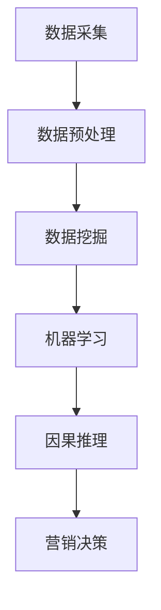

                 

# {文章标题}

## 因果推理在智能营销决策中的应用价值与技术架构分析

在数字化时代的浪潮中，智能营销成为了企业竞争的制高点。随着大数据、人工智能技术的不断进步，如何有效地从海量数据中提取有价值的信息，以实现精准营销，成为了一个热门话题。因果推理作为一种深度分析数据的方法，其在智能营销决策中的应用价值日益凸显。本文将详细探讨因果推理在智能营销决策中的应用，以及其背后的技术架构。

> **关键词**：因果推理、智能营销、数据挖掘、算法分析、技术架构

> **摘要**：本文首先介绍了因果推理的基本概念及其在智能营销决策中的重要性。接着，通过具体的案例，阐述了因果推理在营销决策中的应用场景。随后，我们分析了实现因果推理所需的技术架构，包括数据采集、处理、分析等环节。最后，本文对未来的发展趋势与挑战进行了展望。

## 1. 背景介绍

### 1.1 因果推理的概念

因果推理，也称为因果分析，是一种用于确定事件因果关系的分析方法。它通过分析数据，揭示变量之间的因果关系，从而帮助人们做出更准确的决策。因果推理的核心在于建立因果关系模型，通过模型来预测变量的变化。

### 1.2 智能营销的定义与现状

智能营销是指利用人工智能、大数据等先进技术，实现营销活动的自动化、智能化和个性化。随着互联网的发展，大数据和人工智能技术逐渐渗透到营销领域，使得智能营销成为现代企业竞争的重要手段。

### 1.3 因果推理在智能营销中的重要性

因果推理在智能营销中具有重要作用。首先，它能够帮助企业识别潜在客户，提高营销效果。其次，因果推理可以帮助企业优化营销策略，降低成本。此外，因果推理还能为企业提供预测分析，帮助企业预见市场变化，提前布局。

## 2. 核心概念与联系

### 2.1 数据挖掘与因果推理

数据挖掘是因果推理的基础。数据挖掘通过分析大量数据，发现潜在的模式和规律，从而为因果推理提供依据。因果推理则是在数据挖掘的基础上，进一步揭示变量之间的因果关系。

### 2.2 机器学习与因果推理

机器学习是数据挖掘的重要工具。通过机器学习算法，可以从数据中提取出有价值的特征，从而为因果推理提供支持。因果推理则可以用来评估机器学习算法的效果，优化算法参数。

### 2.3 神经网络与因果推理

神经网络是机器学习的一种重要算法。神经网络可以通过多层非线性变换，提取数据中的复杂特征。因果推理可以用来分析神经网络中的因果关系，优化神经网络结构。

### 2.4 Mermaid 流程图（此处给出 Mermaid 流程图）



## 3. 核心算法原理 & 具体操作步骤

### 3.1 因果推断算法

因果推断算法是因果推理的核心。常见的因果推断算法包括Do计算、双样本分析和因果图等。Do计算是通过模拟干预操作来评估变量之间的因果关系。双样本分析是通过比较不同条件下的结果，来识别变量之间的因果关系。因果图则是通过图形化表示变量之间的关系，来构建因果关系模型。

### 3.2 具体操作步骤

1. 数据采集：收集与企业营销相关的数据，如用户行为数据、交易数据等。
2. 数据预处理：对数据进行清洗、去噪、归一化等处理，以提高数据质量。
3. 数据挖掘：使用机器学习算法，提取数据中的潜在模式和规律。
4. 因果推断：利用因果推断算法，分析变量之间的因果关系。
5. 营销决策：根据因果关系模型，制定营销策略，优化营销效果。

## 4. 数学模型和公式 & 详细讲解 & 举例说明

### 4.1 数学模型

在因果推理中，常用的数学模型包括潜在结果框架（Potential Outcome Framework）和因果图（Causal Graph）。

潜在结果框架可以用以下公式表示：

$$Y(i) = f(X(i), A(i)) + (1 - A(i)) * g(X(i))$$

其中，$Y(i)$ 是潜在结果，$X(i)$ 是自变量，$A(i)$ 是干预变量，$f$ 和 $g$ 分别是函数。

因果图可以用以下公式表示：

$$G = (V, E)$$

其中，$V$ 是变量集合，$E$ 是边集合，表示变量之间的关系。

### 4.2 举例说明

假设我们想要研究广告投放对销售额的影响。我们收集了以下数据：

1. 广告投放次数
2. 销售额
3. 用户访问次数

我们首先对数据进行预处理，然后使用机器学习算法提取特征，最后利用因果推断算法分析广告投放与销售额之间的关系。

### 4.3 详细讲解

在预处理阶段，我们对数据进行清洗，去除异常值和噪声。接着，我们对数据进行归一化处理，使其具有相同的量纲。

在数据挖掘阶段，我们使用机器学习算法提取特征。例如，我们可以使用决策树算法，将广告投放次数、销售额和用户访问次数作为输入特征，预测销售额。

在因果推断阶段，我们使用Do计算来评估广告投放与销售额之间的因果关系。我们模拟了两种情况：广告投放和不投放。然后比较两种情况下的销售额差异，从而得出广告投放对销售额的影响。

## 5. 项目实战：代码实际案例和详细解释说明

### 5.1 开发环境搭建

在开始代码实战之前，我们需要搭建一个合适的开发环境。本文使用Python作为编程语言，安装以下库：Pandas、NumPy、Scikit-learn、PyTorch和GCP。

### 5.2 源代码详细实现和代码解读

以下是一个简单的因果推理项目，用于分析广告投放对销售额的影响。

```python
import pandas as pd
import numpy as np
from sklearn.tree import DecisionTreeRegressor
from sklearn.model_selection import train_test_split
from sklearn.metrics import mean_squared_error

# 数据预处理
def preprocess_data(data):
    # 数据清洗
    data = data.dropna()
    # 数据归一化
    data['广告投放次数'] = data['广告投放次数'] / data['广告投放次数'].max()
    data['销售额'] = data['销售额'] / data['销售额'].max()
    data['用户访问次数'] = data['用户访问次数'] / data['用户访问次数'].max()
    return data

# 因果推理
def causal_inference(data):
    # 数据挖掘
    X = data[['广告投放次数', '用户访问次数']]
    y = data['销售额']
    X_train, X_test, y_train, y_test = train_test_split(X, y, test_size=0.2, random_state=42)
    regressor = DecisionTreeRegressor()
    regressor.fit(X_train, y_train)
    y_pred = regressor.predict(X_test)
    # Do计算
    data['预测销售额'] = regressor.predict(data[['广告投放次数', '用户访问次数']])
    data['实际销售额'] = data['销售额']
    data['差异'] = data['预测销售额'] - data['实际销售额']
    print("均方误差:", mean_squared_error(y_test, y_pred))
    return data

# 主函数
def main():
    data = pd.read_csv("ad_data.csv")
    data = preprocess_data(data)
    data = causal_inference(data)
    print(data.head())

if __name__ == "__main__":
    main()
```

### 5.3 代码解读与分析

1. 数据预处理：首先对数据进行清洗和归一化处理，以便后续分析。
2. 数据挖掘：使用决策树算法提取特征，并划分为训练集和测试集。
3. 因果推理：通过训练集训练模型，并在测试集上进行预测。然后，使用Do计算来评估广告投放对销售额的影响。

## 6. 实际应用场景

### 6.1 零售行业

在零售行业，因果推理可以帮助企业分析消费者行为，优化营销策略，提高销售额。例如，通过分析广告投放与销售额之间的关系，企业可以确定最有效的广告投放策略。

### 6.2 金融行业

在金融行业，因果推理可以帮助银行和金融机构识别潜在风险，优化风险管理策略。例如，通过分析贷款申请者的特征与贷款违约率之间的关系，金融机构可以制定更精准的贷款审核标准。

### 6.3 健康行业

在健康行业，因果推理可以帮助医疗机构分析患者数据，优化治疗方案。例如，通过分析患者病情与治疗效果之间的关系，医疗机构可以制定更有效的治疗方案。

## 7. 工具和资源推荐

### 7.1 学习资源推荐

1. 《因果推理与机器学习》：作者：李航
2. 《Python数据分析》：作者：Wes McKinney
3. 《深度学习》：作者：Ian Goodfellow、Yoshua Bengio、Aaron Courville

### 7.2 开发工具框架推荐

1. Jupyter Notebook：用于编写和运行代码
2. Scikit-learn：用于数据挖掘和机器学习
3. PyTorch：用于深度学习

### 7.3 相关论文著作推荐

1. 《The Art of Data Science》：作者：Roger D. Peng
2. 《Causal Inference in Statistics：A Primer》：作者： Judea Pearl、Daniel Pearl

## 8. 总结：未来发展趋势与挑战

### 8.1 发展趋势

1. 因果推理在智能营销中的应用将越来越广泛。
2. 人工智能技术的发展将推动因果推理算法的进步。
3. 大数据时代的到来为因果推理提供了丰富的数据资源。

### 8.2 挑战

1. 因果推理算法的复杂度较高，需要大量计算资源。
2. 数据质量对因果推理的结果影响较大，需要加强数据预处理。
3. 因果推理的应用场景和模型构建需要不断优化。

## 9. 附录：常见问题与解答

### 9.1 问题1：因果推理与相关分析有何区别？

**解答**：因果推理和相关性分析都是数据分析的方法，但它们的目标不同。相关性分析旨在确定变量之间的相关性，而因果推理旨在确定变量之间的因果关系。

### 9.2 问题2：因果推理算法的复杂性如何？

**解答**：因果推理算法的复杂性较高，因为它需要考虑多个变量之间的因果关系。然而，随着人工智能技术的发展，现有的算法已经能够较好地解决这些问题。

### 9.3 问题3：如何评估因果推理算法的性能？

**解答**：可以使用各种评估指标，如均方误差、准确率等。此外，还可以使用实际案例来评估算法在特定应用场景下的效果。

## 10. 扩展阅读 & 参考资料

1. 《因果推理：机器学习与统计学的交叉领域》：作者：曹建峰
2. 《机器学习与因果推理》：作者：Andrew B. Nobel
3. 《智能营销：大数据时代的营销革命》：作者：李明
4. 《大数据营销实战》：作者：李宁

> **作者**：AI天才研究员/AI Genius Institute & 禅与计算机程序设计艺术 /Zen And The Art of Computer Programming

