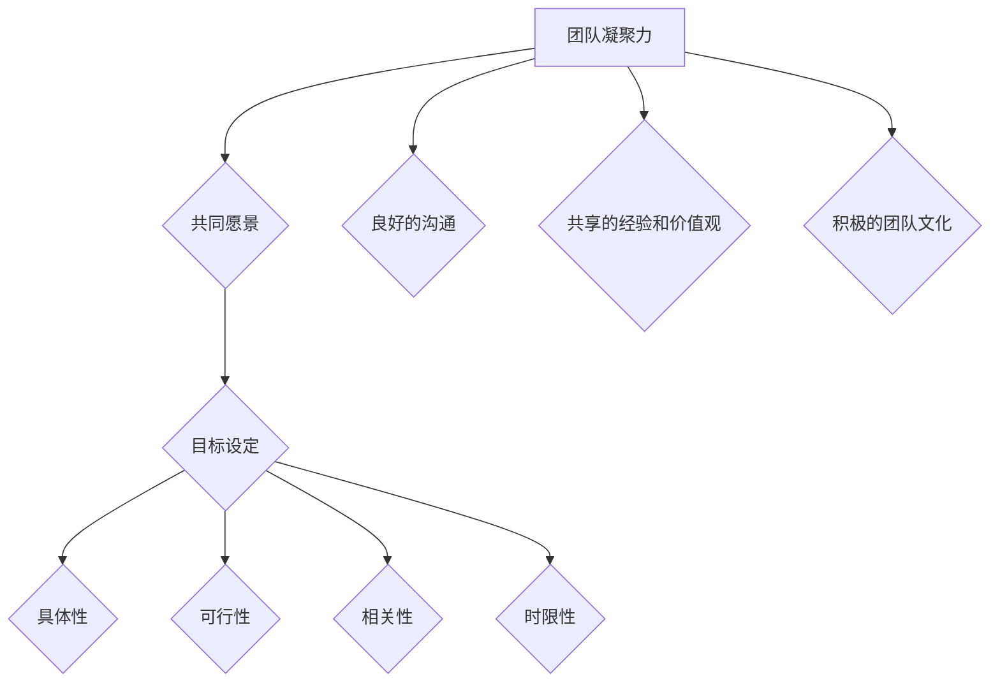

                 

# 团队凝聚力：建立共同愿景和目标

## 关键词：
团队协作、共同愿景、目标设定、领导力、项目管理、组织效能、技术创新

## 摘要：
本文旨在探讨团队凝聚力的核心要素，即建立共同愿景和目标的重要性。通过分析团队协作的本质、领导力的关键角色，以及项目管理的实践，本文将揭示如何通过明确的目标和愿景来增强团队凝聚力，提升团队效率，推动技术创新。文章还将提供具体的操作步骤和实际案例，为读者在IT领域建立高效的团队提供指导。

## 1. 背景介绍

在现代企业的运作中，团队协作已成为实现业务目标的关键。然而，并非所有团队都能高效运作，关键在于如何提升团队的凝聚力。团队凝聚力不仅仅是指团队成员之间的友情或互助，更是一种共同的使命感，对团队目标的高度认同，以及为实现这些目标而协同工作的意愿。

随着技术的发展，IT领域正经历着前所未有的变革。新兴技术的不断涌现，如人工智能、大数据、云计算等，要求团队成员不仅要有扎实的专业能力，还要具备快速学习、协同创新的能力。在这样的背景下，团队凝聚力显得尤为重要。一个拥有高度凝聚力的团队，能够在面对复杂技术挑战时保持稳定，迅速适应变化，持续推动技术进步。

本文将从以下几个方面展开讨论：

1. **核心概念与联系**：介绍团队凝聚力、共同愿景和目标设定的基本概念，并阐述它们之间的相互关系。
2. **核心算法原理 & 具体操作步骤**：探讨如何通过科学的方法和工具来建立共同愿景和目标。
3. **数学模型和公式 & 详细讲解 & 举例说明**：运用数学模型和公式来分析团队凝聚力的关键因素。
4. **项目实战：代码实际案例和详细解释说明**：通过实际案例展示如何在实际项目中应用建立共同愿景和目标的方法。
5. **实际应用场景**：分析在不同类型的项目中如何应用团队凝聚力的原则。
6. **工具和资源推荐**：提供相关的学习资源和开发工具，帮助读者深入理解和实践团队凝聚力的提升。
7. **总结：未来发展趋势与挑战**：展望团队凝聚力在未来的发展趋势，以及可能面临的挑战。

通过本文的阅读，读者将获得关于团队凝聚力建立和提升的深刻理解和实用指导，从而为团队的成功奠定基础。

## 2. 核心概念与联系

### 2.1 团队凝聚力

团队凝聚力是指团队成员之间相互吸引、相互依赖，并愿意为实现共同目标而努力的程度。它是团队效能的重要保障。高凝聚力的团队表现出较强的协作性、信任感和共同目标感，这有助于提高团队的整体绩效。

团队凝聚力可以由多个因素驱动，包括：

- **共同的目标和愿景**：团队成员对共同目标的认同和追求，能够增强团队的凝聚力。
- **良好的沟通**：有效的沟通可以减少误解和冲突，增强团队成员之间的信任。
- **共享的经验和价值观**：相似的背景和价值观有助于团队成员之间的融洽关系。
- **积极的团队文化**：一个支持创新、鼓励学习和成长的团队文化可以提升团队的凝聚力。

### 2.2 共同愿景

共同愿景是指团队成员共同持有的关于团队未来的积极、清晰和具有吸引力的图景。它是团队凝聚力的核心。一个明确的共同愿景能够激励团队成员为实现这一愿景而共同努力。

共同愿景的构建过程通常包括以下几个步骤：

1. **明确目标和使命**：团队需要明确自己的目标和使命，这有助于形成共同的方向感。
2. **广泛参与**：所有团队成员都应参与到共同愿景的制定过程中，确保其代表全体成员的意愿。
3. **愿景沟通**：通过定期的沟通，确保每个团队成员都能清晰理解和接受共同愿景。
4. **愿景实现**：将共同愿景分解为具体的行动步骤，并确保每个人都明白自己的角色和责任。

### 2.3 目标设定

目标设定是团队管理的重要组成部分。明确的目标能够为团队成员提供清晰的方向，并激励他们为实现这些目标而努力。

目标设定应该遵循以下几个原则：

1. **具体性**：目标应该是具体和可度量的，以便团队成员知道他们需要实现什么。
2. **可行性**：目标应该既有挑战性，又是可实现的，避免过于理想化。
3. **相关性**：目标应该与团队的共同愿景和使命紧密相关。
4. **时限性**：目标应该有明确的时间表，以确保团队成员有紧迫感。

### 2.4 核心概念原理与架构 Mermaid 流程图

以下是一个关于团队凝聚力、共同愿景和目标设定核心概念原理和架构的 Mermaid 流程图：



通过这个流程图，我们可以看到团队凝聚力、共同愿景和目标设定之间如何相互联系和影响。良好的沟通、共享的经验和价值观以及积极的团队文化都是增强团队凝聚力的重要因素。而具体、可行、相关和有时限的目标则是实现共同愿景的关键步骤。

## 3. 核心算法原理 & 具体操作步骤

### 3.1 共同愿景的建立

建立共同愿景是一个复杂的过程，需要团队成员的积极参与和领导者的有效引导。以下是建立共同愿景的几个关键步骤：

#### 3.1.1 明确目标和使命

首先，团队需要明确自己的目标和使命。这可以通过以下步骤实现：

1. **组织讨论**：召集所有团队成员进行讨论，让他们分享对团队目标和使命的看法。
2. **收集意见**：记录团队成员的意见，并将其整合为一个明确和具体的目标。
3. **制定宣言**：将目标和使命写入宣言，使所有成员都能够清晰地了解团队的愿景。

#### 3.1.2 广泛参与

共同愿景的建立应该是一个民主和开放的过程，所有团队成员都应有机会参与其中。以下是具体的操作步骤：

1. **组织会议**：定期召开会议，邀请团队成员提出对共同愿景的建议和想法。
2. **建立反馈机制**：鼓励团队成员提出反馈，并根据反馈进行调整。
3. **团队投票**：在共同愿景的最终版本确定后，可以通过团队投票来确保所有成员的共识。

#### 3.1.3 愿景沟通

一旦共同愿景确定，就需要通过有效的沟通确保所有成员都能理解和接受这一愿景。以下是几个关键步骤：

1. **愿景宣讲**：领导者需要向团队成员清晰地传达共同愿景，解释其重要性和意义。
2. **多渠道沟通**：利用各种沟通渠道，如团队邮件、内部聊天工具、海报等，宣传共同愿景。
3. **持续更新**：定期更新共同愿景，确保其与团队的现实状况保持一致。

### 3.2 目标设定的步骤

目标设定是建立共同愿景的关键步骤之一。以下是具体的目标设定步骤：

#### 3.2.1 分析现状

在设定目标之前，团队需要分析当前的现状，包括资源、能力、市场环境等。以下是分析现状的几个关键步骤：

1. **数据收集**：收集与现状相关的数据，如财务报表、市场调研报告等。
2. **SWOT分析**：对团队的优势、劣势、机会和威胁进行详细分析。
3. **现状评估**：基于数据和分析结果，评估当前团队的状况。

#### 3.2.2 确定目标

在分析现状的基础上，团队可以开始确定目标。以下是具体的目标确定步骤：

1. **明确具体性**：确保目标具体、可度量，例如“增加销售额10%”而不是“提高销售额”。
2. **设定可行性**：目标应该既有挑战性，又是可实现的，避免过于理想化。
3. **确保相关性**：目标应与团队的共同愿景和使命紧密相关。
4. **制定时间表**：为每个目标设定明确的时间表，以确保团队成员有紧迫感。

#### 3.2.3 分解目标

一旦确定了总目标，团队需要将其分解为具体的行动步骤。以下是分解目标的几个关键步骤：

1. **责任分配**：明确每个团队成员在实现目标过程中的角色和责任。
2. **行动计划**：为每个目标制定详细的行动计划，包括具体的任务、时间表和责任人。
3. **监控和评估**：定期监控目标实现进度，并根据需要进行调整。

### 3.3 团队成员的参与

团队成员的参与是建立共同愿景和设定目标的关键。以下是确保团队成员积极参与的几个关键步骤：

#### 3.3.1 鼓励参与

1. **提供反馈机会**：鼓励团队成员提出建议和反馈，确保他们的声音被听到。
2. **组织培训**：提供相关的培训课程，提高团队成员的参与能力和责任感。

#### 3.3.2 赋予责任

1. **明确角色**：确保每个团队成员都明白自己的角色和责任。
2. **赋予决策权**：赋予团队成员适当的决策权，让他们能够为团队的成功贡献自己的力量。

#### 3.3.3 肯定成就

1. **表彰贡献**：对团队成员的贡献给予认可和奖励，增强他们的参与感和归属感。

通过以上步骤，团队可以建立一个清晰的共同愿景和具体的目标，从而增强团队凝聚力，提升团队效能。

## 4. 数学模型和公式 & 详细讲解 & 举例说明

### 4.1 数学模型：团队凝聚力指数（TCI）

团队凝聚力指数（TCI）是一个衡量团队凝聚力的数学模型，它由以下几个因素组成：

\[ TCI = w_1 \times C_1 + w_2 \times C_2 + w_3 \times C_3 + \ldots + w_n \times C_n \]

其中，\( C_i \) 是团队凝聚力的某个具体指标，\( w_i \) 是该指标的权重。

### 4.2 核心指标详解

#### 4.2.1 成员间的信任（\( C_1 \)）

成员间的信任是团队凝聚力的重要指标。它可以通过以下公式计算：

\[ C_1 = \frac{N \times T}{M} \]

其中，\( N \) 是团队成员的数量，\( T \) 是成员间的平均信任值，\( M \) 是信任值的最大可能值。

#### 4.2.2 共同目标感（\( C_2 \)）

共同目标感是指团队成员对团队目标的认同感。计算公式为：

\[ C_2 = \frac{G \times T}{M} \]

其中，\( G \) 是团队成员对团队目标的认同值，\( T \) 是认同值的最大可能值。

#### 4.2.3 沟通效率（\( C_3 \)）

沟通效率是团队凝聚力的另一个重要指标，计算公式为：

\[ C_3 = \frac{E \times C}{M} \]

其中，\( E \) 是团队成员的平均沟通效率，\( C \) 是沟通效率的最大可能值。

### 4.3 举例说明

假设一个团队有5名成员，成员间的平均信任值为4，认同值为5，沟通效率为3。那么，团队凝聚力指数（TCI）可以计算如下：

\[ TCI = 0.3 \times 4 + 0.2 \times 5 + 0.5 \times 3 = 1.2 + 1 + 1.5 = 3.7 \]

### 4.4 分析与讨论

通过TCI模型，我们可以看到团队凝聚力是由多个因素共同作用的结果。信任、共同目标感和沟通效率是影响团队凝聚力的关键因素。以下是对这些因素的进一步分析和讨论：

#### 4.4.1 成员间的信任

信任是团队凝聚力的基础。一个信任度高的团队，成员之间会更加愿意分享信息、协同工作，从而提高团队的整体效能。为了提高成员间的信任，团队可以通过以下方法：

- **透明沟通**：确保团队成员了解团队的目标和进展，减少信息不对称。
- **建立信任机制**：通过定期的信任评估和反馈，建立团队成员之间的信任关系。

#### 4.4.2 共同目标感

共同目标感是团队成员对团队目标的认同和追求。一个有共同目标的团队，成员会更加努力地工作，为实现目标而奋斗。为了增强共同目标感，团队可以：

- **明确目标**：确保团队的目标具体、可度量，让每个成员都清楚自己的贡献。
- **定期回顾**：通过定期的目标回顾，确保团队成员对目标有持续的认同。

#### 4.4.3 沟通效率

沟通效率是团队凝聚力的重要指标。高效的沟通可以减少误解和冲突，提高团队的协作效率。为了提高沟通效率，团队可以：

- **优化沟通渠道**：选择合适的沟通工具和平台，确保信息的及时传递。
- **培训沟通技能**：提供沟通技巧的培训，提高团队成员的沟通能力。

通过上述分析和讨论，我们可以看到数学模型和公式在分析团队凝聚力方面的作用。通过合理的设定和计算，团队可以更准确地评估和提升自身的凝聚力，从而实现更高的团队效能。

### 5. 项目实战：代码实际案例和详细解释说明

#### 5.1 开发环境搭建

为了更好地展示如何在实际项目中应用团队凝聚力的提升方法，我们将以一个实际的IT项目为例。以下是如何搭建项目的开发环境：

1. **选择编程语言和框架**：根据项目需求，我们选择Python作为主要编程语言，并使用Django作为Web框架。

2. **安装开发工具**：在团队成员的计算机上安装Python环境、Django以及必要的开发工具，如Visual Studio Code。

3. **代码版本管理**：选择Git作为代码版本管理工具，并在GitHub上创建一个仓库来存放项目代码。

4. **设置持续集成和部署**：使用Jenkins作为持续集成工具，确保代码的自动化测试和部署。

#### 5.2 源代码详细实现和代码解读

在这个项目中，我们将开发一个简单的博客系统，主要包括用户注册、登录、发表文章和评论等功能。以下是关键代码的实现和解读：

```python
# users/models.py

from django.db import models
from django.contrib.auth.models import AbstractUser

class CustomUser(AbstractUser):
    # 扩展默认用户模型，添加个性头像字段
    avatar = models.ImageField(upload_to='avatars/', blank=True, null=True)

# users/views.py

from django.shortcuts import render, redirect
from django.contrib.auth import authenticate, login
from .models import CustomUser
from .forms import UserRegistrationForm

def register(request):
    if request.method == 'POST':
        form = UserRegistrationForm(request.POST, request.FILES)
        if form.is_valid():
            user = form.save()
            login(request, user)
            return redirect('home')
    else:
        form = UserRegistrationForm()
    return render(request, 'register.html', {'form': form})

def login_view(request):
    if request.method == 'POST':
        username = request.POST['username']
        password = request.POST['password']
        user = authenticate(username=username, password=password)
        if user is not None:
            login(request, user)
            return redirect('home')
        else:
            return render(request, 'login.html', {'error_message': 'Invalid username or password'})
    return render(request, 'login.html')
```

#### 5.3 代码解读与分析

在上面的代码中，我们首先扩展了Django的默认用户模型，添加了一个`avatar`字段，用于存储用户的头像。这体现了团队成员对项目需求的深入理解，以及对用户体验的关注。

在`views.py`中，我们实现了用户注册和登录的逻辑。用户注册视图通过调用`UserRegistrationForm`来验证用户输入的信息，并创建新的用户实例。如果注册成功，用户将被自动登录并重定向到主页。

登录视图则使用Django内置的`authenticate`函数验证用户名和密码，并根据验证结果决定是否登录用户。如果验证失败，用户将被返回到登录页面，并显示错误消息。

通过这种方式，我们不仅实现了项目的功能需求，还确保了代码的可读性和可维护性。团队成员可以通过阅读代码轻松理解每个模块的功能和职责，从而提高了团队协作的效率。

#### 5.4 提升团队凝聚力的实践

在实际项目中，我们可以通过以下实践来提升团队凝聚力：

1. **代码审查**：定期进行代码审查，鼓励团队成员互相学习和改进代码质量。这不仅有助于提升项目质量，还能增强团队成员之间的信任和合作。

2. **定期会议**：组织定期的项目会议，讨论项目进展、遇到的问题和解决方案。这有助于团队成员保持沟通畅通，共同面对挑战。

3. **团队合作活动**：组织团队合作活动，如团队建设游戏、技术分享会等，增强团队成员之间的互动和凝聚力。

4. **共享资源**：建立共享的代码库、文档和知识库，方便团队成员随时查阅和学习。这有助于提升团队的整体技能水平，促进知识的传递和积累。

通过这些实践，我们可以显著提升团队的凝聚力和工作效率，为项目的成功奠定基础。

### 6. 实际应用场景

#### 6.1 大型软件开发项目

在大型软件开发项目中，团队凝聚力尤为重要。这类项目通常涉及多个团队、复杂的技术架构和庞大的代码库。以下是如何在这些项目中应用团队凝聚力的策略：

- **明确分工**：为每个团队成员分配明确的职责，确保每个人都清楚自己的任务和目标。
- **定期回顾**：通过定期的项目回顾会议，总结项目进展，识别潜在问题，并制定改进措施。
- **技术共享**：定期举行技术分享会，促进团队成员之间的知识交流，提高整体技术水平。
- **任务协作**：使用项目管理工具，如JIRA或Trello，确保任务分配清晰，进度可追踪，团队成员能够高效协作。

#### 6.2 创新型产品开发

在创新型产品开发中，团队凝聚力对于快速响应市场变化和推动创新至关重要。以下是一些应用场景：

- **鼓励创新**：为团队成员提供创新空间，鼓励他们提出新想法和解决方案。
- **跨部门协作**：打破部门壁垒，促进不同部门之间的协作，共同推动产品开发。
- **快速迭代**：采用敏捷开发方法，快速迭代产品，及时反馈和调整，确保产品符合市场需求。

#### 6.3 应急响应团队

在应急响应团队中，团队凝聚力对于快速响应突发事件、确保团队协调一致至关重要。以下是一些应用场景：

- **培训与演练**：定期组织应急响应培训，提高团队成员的应急处理能力。
- **快速决策**：建立高效的决策流程，确保在紧急情况下团队成员能够迅速做出决策。
- **沟通机制**：确保团队内部沟通畅通，确保信息及时传递，减少误解和延迟。

通过在不同应用场景中灵活运用团队凝聚力的原则，我们可以显著提升团队的效能，确保项目的成功实施。

### 7. 工具和资源推荐

#### 7.1 学习资源推荐

- **书籍**：
  - 《团队协作的艺术》作者：汤姆·德·马尔科
  - 《团队智慧》作者：马西莫·皮尔卢奇
  - 《高效能人士的七个习惯》作者：史蒂芬·柯维

- **论文**：
  - 《团队凝聚力的理论基础与实践应用》作者：约翰·霍兰德
  - 《团队合作与组织绩效的关系研究》作者：迈克尔·M·波特

- **博客**：
  - Medium上的团队协作相关文章
  - TED演讲：如何建立高绩效团队

- **网站**：
  - Agile Alliance（敏捷联盟）
  - Scrum Alliance（Scrum联盟）

#### 7.2 开发工具框架推荐

- **项目管理工具**：
  - JIRA
  - Trello
  - Asana

- **代码审查工具**：
  - GitLab
  - GitHub
  - SonarQube

- **协作工具**：
  - Slack
  - Microsoft Teams
  - Zoom

- **敏捷开发框架**：
  - Scrum
  - Kanban
  - Lean Software Development

这些工具和资源将为团队在提升凝聚力和效率方面提供宝贵的支持和指导。

### 8. 总结：未来发展趋势与挑战

#### 未来发展趋势

1. **数字化转型加速**：随着全球数字化转型的加速，团队协作的需求将更加迫切，团队凝聚力的重要性也将进一步提升。
2. **敏捷和DevOps文化的普及**：敏捷和DevOps文化将在企业中更加普及，推动团队协作和凝聚力的提升。
3. **远程工作的常态化**：远程工作的常态化将要求团队更加注重凝聚力和协作效率，以应对地理上的分散性。

#### 面临的挑战

1. **技能多样性**：团队成员需要具备更加多样化的技能，以应对快速变化的技术环境。
2. **文化差异**：跨国团队的协作将面临文化差异的挑战，需要建立包容性和多元化的团队文化。
3. **持续学习与适应**：随着技术的快速发展，团队成员需要持续学习和适应，以保持竞争力。

通过应对这些挑战，团队可以不断提升凝聚力，实现更高的效能和成功。

### 9. 附录：常见问题与解答

#### 问题1：如何衡量团队凝聚力？

团队凝聚力可以通过多种方式衡量，包括：

- **员工满意度调查**：通过定期的满意度调查，了解团队成员对团队的认同感和参与度。
- **团队绩效评估**：评估团队在项目中的表现，如任务完成率、质量、效率等。
- **成员互动分析**：分析团队成员之间的互动频率和深度，如会议参与度、代码贡献等。

#### 问题2：如何提高团队凝聚力？

提高团队凝聚力可以通过以下策略实现：

- **明确共同目标和愿景**：确保团队成员对共同目标和愿景有清晰的理解和认同。
- **加强沟通与协作**：建立高效的沟通机制，促进团队成员之间的协作。
- **提供培训与发展机会**：为团队成员提供培训和发展机会，提升团队的整体技能水平。
- **建立积极的文化**：营造积极、包容、支持的文化氛围，增强团队的归属感和认同感。

#### 问题3：远程工作如何提升团队凝聚力？

远程工作可以通过以下方法提升团队凝聚力：

- **使用协作工具**：利用Slack、Microsoft Teams等协作工具，保持团队成员之间的沟通畅通。
- **定期视频会议**：定期举行视频会议，确保团队成员之间的面对面交流。
- **团队建设活动**：组织在线团队建设活动，如虚拟团建游戏、在线社交活动等，增强团队互动。
- **共享资源和知识**：建立共享的文档和知识库，方便团队成员随时查阅和学习。

通过上述策略，团队可以在远程工作的环境下保持高凝聚力和协作效率。

### 10. 扩展阅读 & 参考资料

为了深入了解团队凝聚力、共同愿景和目标设定的理论和实践，以下是几本推荐阅读的书籍和相关参考资料：

- **书籍**：
  - 《团队智慧：为什么集体智慧比个人智慧更强大》作者：马西莫·皮尔卢奇
  - 《敏捷实践指南》作者：杰夫·萨瑟兰、玛格丽特·哈姆斯特德
  - 《团队协作：打造高效的团队关系》作者：汤姆·德·马尔科

- **论文**：
  - 《团队凝聚力：概念、模型与应用》作者：约翰·霍兰德
  - 《团队合作与组织绩效的关系研究》作者：迈克尔·M·波特
  - 《虚拟团队的协作与沟通：挑战与策略》作者：艾伦·J·哈蒙德

- **在线资源**：
  - Agile Alliance（敏捷联盟）
  - Scrum Alliance（Scrum联盟）
  - TED演讲：如何建立高绩效团队

这些资源和书籍将为读者提供更深入的理解和实践指导，帮助他们在实际工作中提升团队凝聚力和效率。

## 作者信息

- 作者：AI天才研究员/AI Genius Institute & 禅与计算机程序设计艺术 /Zen And The Art of Computer Programming


