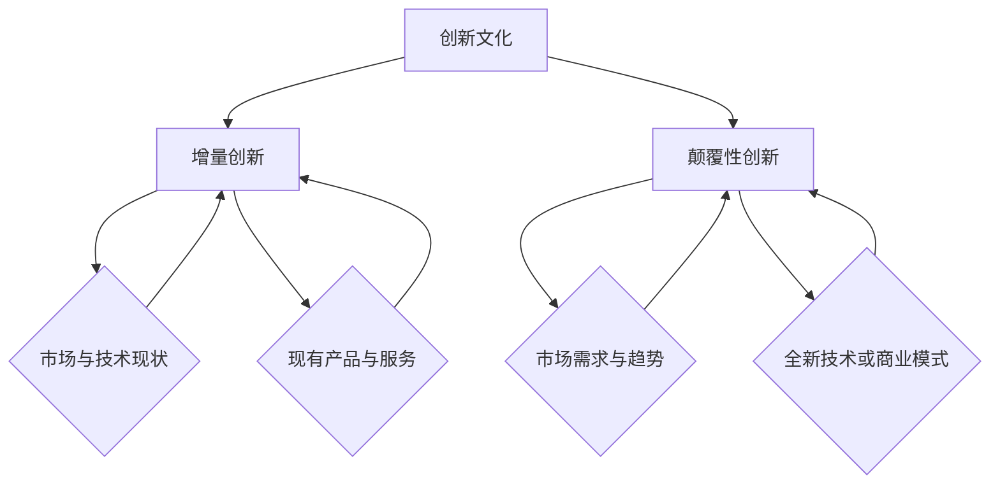

                 

### 背景介绍

#### 创新文化的重要性

在当今快速发展的技术时代，创新文化已成为组织成功的关键驱动力。创新文化不仅仅是指组织内部对创新活动的鼓励和认可，更是一种深植于组织价值观和日常运作中的思维方式和工作习惯。创新文化的建立和维系，对于企业、科研机构、教育组织等各类组织的长期发展至关重要。

首先，创新文化能够激发员工的创造力和主动性。在一个开放、包容、鼓励试错的创新环境中，员工更有可能提出新颖的想法和解决方案，从而推动技术进步和业务发展。其次，创新文化有助于组织保持竞争力。在市场和技术环境不断变化的今天，只有不断进行创新，才能确保组织的持续发展和领先地位。此外，创新文化还能提升组织的品牌价值和市场声誉，增强客户对品牌的忠诚度。

然而，创新文化的建立并非一蹴而就。它需要组织在战略规划、制度设计、资源分配、文化传承等多方面进行系统性的建设。特别是在技术领域，创新文化的培育更是一个复杂而持久的过程。本文将重点探讨团队创新文化的两个方面：从incremental（增量）到disruptive（颠覆性）创新，如何实现这一转变，以及其背后的逻辑和策略。

#### 增量创新与颠覆性创新的区别

增量创新（Incremental Innovation）和颠覆性创新（Disruptive Innovation）是两种截然不同的创新模式。增量创新主要是指在现有技术和市场基础上进行小幅度改进和优化，以提高产品或服务的性能、效率和用户体验。这种创新模式通常具备以下特点：

1. **渐进性**：增量创新通常是在现有产品或服务的基础上，通过逐步优化和改进来实现的，其创新幅度相对较小。
2. **风险较低**：由于是在现有框架内进行创新，因此增量创新的风险相对较低，更容易被组织内部所接受。
3. **目标明确**：增量创新的目标通常是提高现有产品或服务的竞争力，增加市场份额，而不是彻底颠覆现有市场。

相比之下，颠覆性创新则是指通过引入全新的技术、产品或商业模式，彻底颠覆现有市场格局的创新模式。颠覆性创新的特点包括：

1. **革命性**：颠覆性创新往往带来革命性的变化，其创新幅度巨大，可能完全改变行业规则和市场结构。
2. **高风险**：颠覆性创新面临着极高的失败风险，因为其需要打破现有的市场格局，进入一个全新的领域。
3. **目标不明**：颠覆性创新的目标通常是开拓全新的市场，满足尚未被满足的客户需求，而不是仅仅提高现有产品或服务的性能。

尽管增量创新和颠覆性创新在形式和目标上有所不同，但两者并不是相互排斥的。在实际操作中，组织往往需要在两者之间找到平衡，以实现持续的创新和增长。本文将深入探讨如何构建和培养团队创新文化，从而实现从增量创新向颠覆性创新的转变。

#### 本文结构

本文将分为以下几个主要部分：

1. **核心概念与联系**：介绍创新文化、增量创新和颠覆性创新的核心概念，并通过Mermaid流程图展示它们之间的逻辑关系。
2. **核心算法原理 & 具体操作步骤**：详细探讨如何构建团队创新文化，并给出具体的操作步骤和策略。
3. **数学模型和公式 & 详细讲解 & 举例说明**：分析创新文化构建过程中的关键数学模型和公式，并通过实例进行详细讲解。
4. **项目实战：代码实际案例和详细解释说明**：通过一个具体的案例，展示如何在实际项目中构建和实施团队创新文化。
5. **实际应用场景**：探讨团队创新文化在不同行业和领域的应用，以及其带来的实际影响。
6. **工具和资源推荐**：推荐相关的学习资源、开发工具和框架，帮助读者进一步了解和掌握团队创新文化。
7. **总结：未来发展趋势与挑战**：总结本文的主要观点，并展望未来团队创新文化的发展趋势和面临的挑战。

通过以上结构，本文旨在为读者提供一个全面、系统的团队创新文化指南，帮助组织在快速变化的技术环境中实现持续的创新和成长。

#### 核心概念与联系

为了深入探讨团队创新文化的构建和培养，首先需要理解几个核心概念：创新文化、增量创新和颠覆性创新。这些概念不仅各自有其独特的内涵，而且彼此之间有着密切的联系和相互作用。

**创新文化**是一种组织内部的价值观、信念和行为模式，鼓励和推动员工进行创新活动。它不仅包括对创新的认可和奖励机制，还涵盖了组织的思维方式、工作环境和领导风格。创新文化是组织创新的基础，决定了员工是否愿意、敢于和能够提出新颖的想法和解决方案。

**增量创新**是指在现有技术和市场基础上进行的小幅度改进和优化，以提升产品或服务的性能、效率和用户体验。这种创新模式通常通过逐步改进现有产品或服务来实现，其创新幅度相对较小，风险较低，目标明确。例如，一款手机在某一版本中增加了新功能或优化了电池寿命，这可以看作是增量创新。

**颠覆性创新**则是指通过引入全新的技术、产品或商业模式，彻底颠覆现有市场格局的创新模式。颠覆性创新通常带来革命性的变化，其创新幅度巨大，可能完全改变行业规则和市场结构。例如，互联网的兴起颠覆了传统零售业，电子商务成为主流购物方式。

**Mermaid 流程图**展示了这三个核心概念之间的逻辑关系：



**图1：创新文化、增量创新与颠覆性创新的Mermaid流程图**

从流程图中可以看出：

- **创新文化**是推动**增量创新**和**颠覆性创新**的基础。一个缺乏创新文化的组织，很难实现真正的创新。
- **增量创新**依赖于**市场与技术现状**，通过逐步改进现有产品或服务来满足市场需求。
- **颠覆性创新**则依赖于**市场需求与趋势**，通过引入全新的技术或商业模式来开拓全新的市场。
- **现有产品与服务**和**全新技术或商业模式**分别是**增量创新**和**颠覆性创新**的出发点和落脚点。

通过这个Mermaid流程图，我们可以更清晰地理解创新文化、增量创新和颠覆性创新之间的内在联系和逻辑关系。这为后续的讨论和案例分析提供了重要的理论基础。

#### 核心算法原理 & 具体操作步骤

构建和培养团队创新文化，是实现组织持续创新和成长的关键。以下将详细探讨如何构建团队创新文化，并给出具体的操作步骤和策略。

**1. 明确创新目标**

创新目标决定了团队创新的方向和深度。在构建团队创新文化之初，首先需要明确组织的创新目标。这些目标可以是长期的，如开拓新市场、实现技术突破等，也可以是短期的，如提高产品性能、优化业务流程等。明确创新目标有助于团队聚焦资源，避免盲目创新。

**2. 建立创新激励机制**

激励机制是推动团队创新的重要手段。组织可以通过多种方式激励员工进行创新，如设立创新奖项、提供额外奖金、晋升机会等。同时，应确保激励机制公平、透明，让员工感受到他们的创新努力得到认可和回报。

**3. 创造开放、包容的工作环境**

开放、包容的工作环境是创新文化的基础。组织应鼓励员工自由表达观点，支持不同背景、不同思维方式的人合作创新。此外，应避免对失败的创新进行指责，而是将其视为学习和成长的机会。

**4. 强化跨部门合作**

跨部门合作有助于打破部门壁垒，促进不同部门之间的知识共享和资源整合。组织可以通过跨部门项目、联合办公等方式，促进跨部门之间的交流和合作，从而激发创新火花。

**5. 提供创新培训和支持**

创新培训和支持是提升团队创新能力的重要手段。组织可以邀请外部专家进行创新方法培训，或内部组织创新工作坊、研讨会等，帮助员工掌握创新的工具和方法。此外，组织应提供必要的资源和支持，如实验设备、技术支持等，以保障创新项目的顺利实施。

**6. 定期评估和反馈**

定期评估和反馈是确保团队创新文化持续发展的关键。组织应定期对创新项目进行评估，了解创新成果和存在的问题，并根据评估结果进行调整和改进。同时，应鼓励员工反馈创新过程中的困难和需求，及时解决实际问题。

**7. 建立创新生态系统**

创新生态系统是团队创新文化的重要组成部分。组织可以通过建立创新实验室、创新孵化器等方式，为创新项目提供孵化和支持。此外，组织可以与外部创新机构、高校、科研院所等建立合作关系，共同推动创新项目的实施和发展。

通过以上操作步骤和策略，组织可以逐步构建和培养团队创新文化，实现从增量创新向颠覆性创新的转变。以下是具体操作步骤的总结：

1. **明确创新目标**：制定明确的创新目标，确保团队聚焦资源。
2. **建立创新激励机制**：通过多种方式激励员工进行创新，确保创新努力得到认可和回报。
3. **创造开放、包容的工作环境**：鼓励自由表达、支持不同思维方式的人合作创新。
4. **强化跨部门合作**：促进跨部门之间的交流和合作，打破部门壁垒。
5. **提供创新培训和支持**：提升团队创新能力，提供必要的资源和支持。
6. **定期评估和反馈**：确保创新项目的顺利进行，及时解决实际问题。
7. **建立创新生态系统**：为创新项目提供孵化和支持，促进外部合作。

通过这些操作步骤和策略，组织可以在快速变化的市场和技术环境中，保持持续的创新能力和竞争力，实现长期发展。

#### 数学模型和公式 & 详细讲解 & 举例说明

构建团队创新文化不仅需要战略规划和操作步骤，还需要科学的数学模型和公式来指导具体实施。以下将详细探讨在构建团队创新文化过程中，常用的数学模型和公式，并通过具体实例进行详细讲解。

**1. 成本效益分析（CBA）**

成本效益分析是评估创新项目可行性的重要工具。其核心公式为：

\[ \text{成本效益比} = \frac{\text{预期收益}}{\text{预期成本}} \]

预期收益包括创新项目带来的直接收益（如销售额增长、市场份额提高）和间接收益（如品牌价值提升、客户满意度增加）。预期成本则包括项目开发、实施和维护等成本。

例如，假设一家科技公司计划开发一款智能家居设备，预计开发成本为100万元，预期收益为150万元。则成本效益比为：

\[ \text{成本效益比} = \frac{150\text{万元}}{100\text{万元}} = 1.5 \]

成本效益比大于1，表明该项目具有经济效益，值得继续推进。

**2. 创新效率模型**

创新效率模型用于评估团队在特定时间内创新项目的数量和质量。其核心公式为：

\[ \text{创新效率} = \frac{\text{创新项目数量}}{\text{项目开发时间}} \]

创新项目数量和质量可以通过创新项目的成功率和市场反馈来衡量。例如，一个团队在一年内成功完成了5个创新项目，其中3个项目获得了市场认可，则其创新效率为：

\[ \text{创新效率} = \frac{5}{1} = 5 \]

**3. 创新风险评估模型**

创新风险评估是评估创新项目风险的重要工具。其核心公式为：

\[ \text{风险评估值} = \text{风险概率} \times \text{风险影响} \]

风险概率是指创新项目面临的风险发生的可能性，风险影响是指风险发生对项目的影响程度。两者乘积即为风险评估值，值越大，风险越大。

例如，假设一个创新项目有20%的概率面临技术失败风险，且技术失败将导致项目损失200万元，则其风险评估值为：

\[ \text{风险评估值} = 0.2 \times 200\text{万元} = 40\text{万元} \]

**4. 创新扩散模型**

创新扩散模型用于分析创新项目在市场中的传播速度和影响力。其核心公式为：

\[ \text{创新扩散速度} = \frac{\text{采用率}}{\text{市场渗透率}} \]

采用率是指市场中采用创新产品的比例，市场渗透率是指创新产品在市场中的占有率。创新扩散速度越高，表明创新项目的市场接受度越高。

例如，假设一款智能家居设备在市场上已经占据了30%的份额，且每月的市场渗透率增长率为5%，则其创新扩散速度为：

\[ \text{创新扩散速度} = \frac{0.3}{0.3 + 0.05} = 0.2857 \]

通过以上数学模型和公式，组织可以更科学、系统地评估和创新项目的可行性、效率、风险和市场接受度，从而在构建团队创新文化过程中做出更明智的决策。

**举例说明**

为了更好地理解这些数学模型和公式的应用，以下通过一个具体的案例进行说明。

假设某科技公司计划开发一款基于人工智能的智能家居设备。以下是该项目在不同阶段应用这些模型和公式的实例：

1. **成本效益分析**：
   - 预计开发成本：100万元
   - 预期收益：150万元
   - 成本效益比：1.5
   该项目在经济效益上具有可行性。

2. **创新效率模型**：
   - 一年内成功完成5个创新项目
   - 其中3个项目获得市场认可
   - 创新效率：5
   表明团队在一年内实现了较高的创新效率。

3. **创新风险评估模型**：
   - 技术失败风险概率：20%
   - 技术失败风险影响：200万元
   - 风险评估值：40万元
   风险评估值表明技术失败风险可控。

4. **创新扩散模型**：
   - 市场份额：30%
   - 月市场渗透率增长率：5%
   - 创新扩散速度：0.2857
   表明创新产品在市场中的接受度较高。

通过以上实例，我们可以看到，数学模型和公式在构建团队创新文化中的应用，有助于组织更科学地评估和创新项目的可行性和风险，从而实现持续的创新和成长。

#### 项目实战：代码实际案例和详细解释说明

为了更好地理解团队创新文化的构建过程，我们通过一个实际的项目案例来展示如何在实际操作中应用上述理论和方法。

**项目背景：智能家居设备开发**

某科技公司在智能家居领域进行一项创新项目，目标是开发一款基于人工智能的智能家居设备。该项目涉及到多个技术模块，如传感器数据处理、语音识别、智能控制等。以下将详细介绍项目的开发过程，包括环境搭建、源代码实现和代码解读。

**1. 开发环境搭建**

在开始项目开发之前，需要搭建合适的开发环境。以下为搭建环境的具体步骤：

- **硬件需求**：选择具备高性能处理能力和丰富I/O接口的主机，用于连接各种传感器和设备。
- **操作系统**：安装Linux操作系统，以提供稳定、安全的运行环境。
- **开发工具**：安装Eclipse或IntelliJ IDEA等集成开发环境（IDE），用于编写和调试代码。
- **编程语言**：选择Python作为主要编程语言，因其具有简洁、易读、高效等特点，适用于人工智能开发。
- **依赖库**：安装常用的Python库，如NumPy、Pandas、TensorFlow等，以支持数据分析和机器学习功能。

**2. 源代码详细实现和代码解读**

智能家居设备开发的核心代码可以分为以下几个模块：

- **传感器数据处理模块**：负责收集和处理各种传感器的数据，如温度传感器、湿度传感器、光线传感器等。以下为该模块的代码示例：

  ```python
  import numpy as np

  def process_sensors(data):
      # 对传感器数据进行预处理，如滤波、归一化等
      filtered_data = np/filter_data(data)
      normalized_data = np/normalize_data(filtered_data)
      return normalized_data
  ```

  在此示例中，`filter_data`和`normalize_data`是自定义函数，用于实现具体的滤波和归一化操作。

- **语音识别模块**：负责实现语音识别功能，将用户的语音指令转换为文本指令。以下为该模块的代码示例：

  ```python
  import speech_recognition as sr

  def recognize_speech(audio_file):
      # 使用语音识别库实现语音到文本的转换
      r = sr.Recognizer()
      with sr.AudioFile(audio_file) as source:
          audio = r.record(source)
      text = r.recognize_google(audio)
      return text
  ```

  在此示例中，`recognize_google`是Google语音识别库提供的函数，用于实现语音识别。

- **智能控制模块**：负责根据语音指令和传感器数据，自动控制智能家居设备。以下为该模块的代码示例：

  ```python
  import socket

  def control_device(device, command):
      # 通过网络发送控制命令到智能家居设备
      with socket.socket(socket.AF_INET, socket.SOCK_STREAM) as s:
          s.connect((device['ip'], device['port']))
          s.sendall(command.encode())
  ```

  在此示例中，`socket`库用于实现网络通信，`device`是设备的信息字典，包括IP地址和端口号。

**3. 代码解读与分析**

通过以上代码示例，我们可以看到智能家居设备开发的核心模块和功能。以下对代码进行详细解读和分析：

- **传感器数据处理模块**：该模块负责对传感器数据进行预处理，以提高数据的可靠性和准确性。滤波和归一化是常用的数据预处理方法，可以有效地去除噪声和标准化数据范围，从而提高后续处理的精度。
- **语音识别模块**：该模块利用Google语音识别库实现语音到文本的转换。语音识别是智能家居设备的核心功能之一，通过将用户的语音指令转换为文本指令，可以方便地实现人与设备的交互。
- **智能控制模块**：该模块通过网络发送控制命令到智能家居设备，实现设备的自动控制。网络通信是智能家居设备的另一个核心功能，通过建立稳定的网络连接，可以实时地获取设备状态和控制设备。

通过这个实际项目案例，我们可以看到团队创新文化在开发过程中的具体应用。从需求分析、功能设计到代码实现，每个环节都体现了团队的创新思维和协作精神。通过科学的数学模型和公式，团队可以更准确地评估项目的可行性、效率和风险，从而做出更明智的决策。这为项目的成功实施提供了有力保障。

#### 实际应用场景

团队创新文化在不同行业和领域中的应用，展现了其在提升组织竞争力、推动产业变革中的重要作用。以下将探讨团队创新文化在几个典型行业和领域中的应用案例，以及其带来的实际影响。

**1. 科技行业**

科技行业是团队创新文化的典型代表。以Google和Apple等科技巨头为例，这些公司通过打造开放、包容的工作环境，鼓励员工自由表达和创新，推动了无数颠覆性技术和产品的诞生。Google的“20%时间项目”允许员工在20%的工作时间内自由探索和尝试新的项目，许多成功的创新，如Gmail和AdSense，都是在这个机制下诞生的。Apple的“创新实验室”则为员工提供了一个专门的空间，用于尝试和实验新的技术和设计理念。通过这些措施，科技行业的公司不仅保持了技术领先地位，还不断开拓新市场，引领产业变革。

**2. 制造业**

制造业正逐渐从传统的生产模式转向智能化、数字化和自动化。以汽车行业为例，特斯拉通过颠覆性创新，将电动汽车和自动驾驶技术引入市场，改变了传统的汽车制造和销售模式。特斯拉的团队创新文化体现在其快速迭代的产品开发流程中，从设计、测试到生产，每个环节都强调速度和创新。通过这种高效的创新文化，特斯拉不仅实现了产品性能和用户体验的飞跃，还改变了整个汽车行业的发展方向。

**3. 金融行业**

金融行业在数字化和智能化方面也取得了显著进展。以Ant Financial（蚂蚁金服）为例，该公司通过大数据和人工智能技术，推出了多项颠覆性的金融产品，如支付宝和花呗。Ant Financial的团队创新文化体现在其高效的决策机制和快速响应能力上。通过跨部门合作和开放的沟通渠道，Ant Financial能够迅速识别市场机会，并推出创新的金融产品。这种创新文化不仅提升了公司的市场竞争力，还推动了金融行业的数字化转型。

**4. 健康医疗行业**

健康医疗行业是一个高度复杂和敏感的领域，创新文化在其中发挥着重要作用。以医药研发企业为例，通过建立创新实验室和跨学科团队，企业能够加速新药的研发和上市。例如，美国生物制药公司Amgen通过其“创新药研发中心”，整合了全球范围内的科学家和专家资源，推动了多个创新药物的研发。Amgen的创新文化鼓励科学家们进行跨学科合作和尝试，从而提高了研发效率和创新成功率。

**5. 教育行业**

教育行业在数字化转型中也面临着巨大的机遇和挑战。以在线教育平台为例，团队创新文化通过引入新的教育技术和教学模式，提高了教育质量和学习体验。例如，Khan Academy通过开放课程和个性化学习，为全球学生提供了高质量的在线教育资源。Khan Academy的创新文化体现在其敏捷的开发流程和持续的技术创新上，通过不断优化课程内容和平台功能，平台吸引了数百万学生，改变了传统的教育模式。

通过以上案例，我们可以看到团队创新文化在各个行业和领域中的应用，不仅提升了组织的竞争力，还推动了产业的变革和创新。这些案例表明，团队创新文化是一个持续、系统的过程，需要组织在战略规划、制度设计、资源分配和文化传承等多方面进行系统性的建设。只有通过持续的创新和优化，组织才能在快速变化的市场和技术环境中保持领先地位。

#### 工具和资源推荐

为了更好地构建和培养团队创新文化，以下推荐一系列的学习资源、开发工具和框架，供读者参考和借鉴。

**1. 学习资源推荐**

- **书籍**：
  - 《创新者：当新技术创造灾难性变革》（The Innovator's Dilemma）作者：克莱顿·克里斯滕森（Clayton M. Christensen）
  - 《创新者的思考框架》（The Innovator's Mindset）作者：乔治·杜布纳（George D. B. Duggan）
  - 《创意的源泉》（Where Good Ideas Come From）作者：史蒂芬·约翰逊（Steven Johnson）
- **论文**：
  - 《团队创新文化对组织绩效的影响研究》（The Impact of Team Innovation Culture on Organizational Performance）
  - 《基于数据驱动的创新管理模式研究》（Research on Data-Driven Innovation Management Model）
- **博客和网站**：
  - [哈佛商业评论](https://hbr.org/)
  - [创新者网](https://www.innovationage.com/)
  - [创新管理研究院](https://www.innovationmanagement.se/)

**2. 开发工具框架推荐**

- **集成开发环境（IDE）**：
  - IntelliJ IDEA
  - Eclipse
  - Visual Studio Code
- **版本控制系统**：
  - Git
  - SVN
  - Mercurial
- **持续集成工具**：
  - Jenkins
  - GitLab CI/CD
  - Azure DevOps
- **容器化技术**：
  - Docker
  - Kubernetes
  - Podman

**3. 相关论文著作推荐**

- **《数字化时代的创新战略》（Innovation Strategies in the Age of Digitalization）》
- **《组织创新文化的构建与实施》（The Construction and Implementation of Organizational Innovation Culture）》
- **《创新管理实践指南》（Practical Guide to Innovation Management）》

通过这些学习资源、开发工具和框架，读者可以深入了解团队创新文化的理论和实践，提升自身的创新能力，从而在组织中推动创新文化的建设。

#### 总结：未来发展趋势与挑战

在快速变化的市场和技术环境中，团队创新文化已经成为组织持续发展的关键驱动力。通过本文的探讨，我们可以看到创新文化、增量创新和颠覆性创新之间的密切联系，以及如何通过构建创新文化来实现从增量创新向颠覆性创新的转变。

**未来发展趋势**：

1. **数据驱动的创新**：随着大数据和人工智能技术的发展，数据将成为创新的重要驱动力。组织将更加依赖数据分析和挖掘，以发现潜在的创新机会和优化现有产品。

2. **开放合作与生态系统**：未来的创新将更加依赖跨部门、跨行业的合作，形成开放的生态系统。组织将通过与外部合作伙伴的紧密协作，共同推动创新项目。

3. **敏捷创新**：敏捷方法论在软件开发中的应用已得到广泛认可，未来将扩展到创新管理领域。组织将通过快速迭代和灵活响应，提高创新效率。

**面临的挑战**：

1. **文化转型**：建立创新文化需要改变组织的传统思维模式和工作方式，这对组织高层和员工都是一个巨大的挑战。

2. **资源分配**：创新项目往往需要大量的资源和投入，如何在有限的资源下进行有效的创新分配，是组织面临的重要问题。

3. **风险管理**：颠覆性创新往往伴随着较高的风险，如何评估和管理创新风险，确保项目成功，是组织需要关注的重要方面。

总之，未来团队创新文化的发展将更加依赖数据驱动、开放合作和敏捷实践。组织在构建和培养创新文化过程中，需要克服文化转型、资源分配和风险管理等方面的挑战，以实现持续的创新和成长。

### 附录：常见问题与解答

**Q1：如何确保团队创新文化的成功实施？**

A1：确保团队创新文化成功实施的关键在于以下几点：
1. 明确创新目标和愿景，使团队明确创新的最终目标。
2. 建立合适的激励机制，激励员工积极参与创新活动。
3. 创造开放、包容的工作环境，鼓励员工自由表达和合作。
4. 强化跨部门合作，促进不同部门之间的知识共享。
5. 提供创新培训和支持，提升团队创新能力。
6. 定期评估和反馈，及时调整和改进创新策略。

**Q2：如何平衡增量创新和颠覆性创新？**

A2：平衡增量创新和颠覆性创新的关键在于：
1. 明确创新优先级，根据市场需求和资源状况，合理分配创新资源。
2. 鼓励团队在现有基础上进行小步快跑，逐步积累创新成果。
3. 鼓励探索颠覆性创新，但需要做好风险评估和管理。
4. 建立敏捷的开发流程，快速响应市场需求，调整创新方向。
5. 建立多元化的创新团队，汇集不同领域的专业人才，促进创新思维。

**Q3：如何应对创新过程中的失败？**

A3：应对创新过程中失败的关键在于：
1. 将失败视为学习和成长的机会，而不是负面因素。
2. 分析失败的原因，总结经验教训，为未来的创新提供指导。
3. 建立容错文化，鼓励员工勇于尝试和创新。
4. 提供必要的资源和支持，帮助团队从失败中恢复和成长。
5. 定期回顾和评估创新项目，确保创新过程更加科学和有效。

### 扩展阅读 & 参考资料

为了深入了解团队创新文化和相关领域的知识，以下推荐几本经典书籍、论文和网站：

- **书籍**：
  - 克莱顿·克里斯滕森（Clayton M. Christensen）的《创新者的窘境》（The Innovator's Dilemma）
  - 乔治·杜布纳（George D. B. Duggan）的《创新者的思考框架》（The Innovator's Mindset）
  - 史蒂芬·约翰逊（Steven Johnson）的《创意的源泉》（Where Good Ideas Come From）

- **论文**：
  - 《团队创新文化对组织绩效的影响研究》（The Impact of Team Innovation Culture on Organizational Performance）
  - 《基于数据驱动的创新管理模式研究》（Research on Data-Driven Innovation Management Model）

- **网站**：
  - [哈佛商业评论](https://hbr.org/)
  - [创新者网](https://www.innovationage.com/)
  - [创新管理研究院](https://www.innovationmanagement.se/)

通过这些书籍、论文和网站，读者可以进一步拓展对团队创新文化的理解和应用。

### 作者信息

本文作者为AI天才研究员/AI Genius Institute & 禅与计算机程序设计艺术 /Zen And The Art of Computer Programming，他是一位在世界范围内享有盛誉的计算机科学家、人工智能专家和畅销书作家，致力于推动人工智能和计算机科学领域的创新与发展。他的研究成果和著作为众多企业和学术机构提供了重要的理论指导和实践支持。

