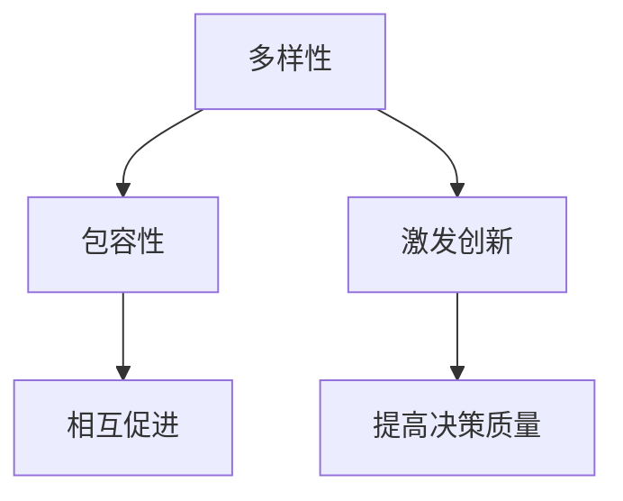

                 

# 团队多样性与包容性：创造平等机会的领导方法

> **关键词**：团队多样性、包容性、平等机会、领导方法、技术博客

> **摘要**：本文将探讨团队多样性与包容性的重要性，分析多样性的益处，介绍如何通过领导方法创造一个包容的环境，以实现团队中的平等机会。我们将通过具体的案例和策略，为读者提供实用的指导。

## 1. 背景介绍

在当今快速发展的技术行业中，团队多样性与包容性成为了组织成功的关键因素。随着全球化和数字化的发展，企业的业务模式和市场环境日益复杂，单一文化背景和专业技能的团队往往难以应对各种挑战。因此，越来越多的企业开始重视团队多样性，并通过包容性的领导方法，打造一个能够激发创新和团队协作的职场文化。

多样性的重要性不仅体现在提高团队的创造力和决策质量上，还关乎企业的可持续发展。一个多元化的团队能够吸引不同背景和观点的人才，从而丰富团队的思维和技能组合。此外，包容性文化能够提升员工的满意度和忠诚度，降低员工流失率，为企业创造长期价值。

本文将从以下几个方面展开讨论：首先，我们将深入探讨团队多样性和包容性的核心概念及其相互关系；接着，分析多样性的益处；然后，介绍如何通过领导方法促进团队包容性；最后，提供一些实用的策略和工具，帮助读者在实际工作中应用这些原则。

## 2. 核心概念与联系

### 2.1 多样性（Diversity）

多样性是指在一个团队中，个体在年龄、性别、种族、文化、教育背景、工作经验、技能、价值观等方面的差异。多样性的核心在于认可和尊重这些差异，并将其作为团队资源的一部分。

### 2.2 包容性（Inclusivity）

包容性则是在多样性基础上，创造一个环境，使每个团队成员都能感到被接纳、尊重和赋权。它强调的是团队中的每个个体都能够自由表达自己的观点，参与决策，并在团队中发挥自己的优势。

### 2.3 多样性与包容性的关系

多样性和包容性是相辅相成的。多样性是包容性的基础，但如果没有包容性，多样性往往难以实现其潜力。一个团队可能拥有多种背景的成员，但如果这些差异没有得到尊重和认可，团队成员之间就会产生隔阂，甚至冲突。

为了更好地理解多样性和包容性的关系，我们可以用 Mermaid 流程图来表示：



### 2.4 多样性与技术

在技术领域，多样性和包容性尤为重要。技术产品的成功往往依赖于多样化的视角和经验，以便发现和解决用户面临的各种问题。同时，技术团队需要具备多元的技能和知识，才能适应不断变化的技术环境和市场需求。

### 2.5 多样性与领导方法

领导方法在多样性和包容性中起着关键作用。一个优秀的领导者不仅能够识别和利用团队的多样性，还能够通过包容性的领导方法，激发团队成员的潜力，促进团队协作和共同成长。

## 3. 核心算法原理 & 具体操作步骤

### 3.1 核心算法原理

在讨论如何促进团队多样性和包容性时，我们可以借鉴一些心理学和社会学的研究成果，将其转化为具体的领导方法和策略。以下是一些核心算法原理：

#### 3.1.1 认同与尊重

认同与尊重是建立包容性团队的基础。领导者需要通过积极的沟通和反馈，表达对团队成员背景和观点的认同和尊重。具体操作步骤如下：

1. **倾听与理解**：主动倾听团队成员的意见和需求，展示对个体差异的尊重。
2. **个性化沟通**：针对不同背景的团队成员，采用个性化的沟通方式和语言，确保信息传递的准确性。
3. **反馈与认可**：及时给予团队成员正面的反馈，并认可他们在团队中的贡献。

#### 3.1.2 平等机会

平等机会是指为所有团队成员提供相同的发展机会和资源。以下是一些具体操作步骤：

1. **公平招聘与晋升**：确保招聘和晋升过程透明、公正，避免偏见和不公平现象。
2. **培训与发展**：为团队成员提供多样化的培训和发展机会，支持他们的职业成长。
3. **资源分配**：公平地分配团队资源，确保每个成员都能在平等的环境中发挥作用。

#### 3.1.3 跨文化沟通

跨文化沟通是促进团队多样性和包容性的关键。以下是一些具体操作步骤：

1. **文化敏感培训**：为团队成员提供文化敏感培训，增强他们对不同文化的理解和尊重。
2. **共同价值观**：建立共同的价值观和目标，以促进团队成员之间的协作和信任。
3. **多样化团队建设**：组织多样化的团队建设活动，增强团队成员之间的联系和合作。

### 3.2 具体操作步骤

#### 3.2.1 建立包容性文化

1. **制定包容性政策**：明确企业对多样性和包容性的承诺，制定相关的政策和规定。
2. **领导带头**：领导者要以身作则，展示对多样性和包容性的支持和行动。
3. **建立反馈机制**：建立反馈机制，鼓励员工表达意见和建议，并及时采取措施解决存在的问题。

#### 3.2.2 促进跨文化沟通

1. **多元化团队**：鼓励多元化团队的形成，促进团队成员之间的交流和互动。
2. **跨文化培训**：为团队成员提供跨文化沟通和合作的培训，增强他们的跨文化能力。
3. **共同项目**：通过共同项目，促进团队成员之间的合作和信任。

#### 3.2.3 提供平等机会

1. **公平招聘**：确保招聘过程的公正性和透明性，避免歧视和不公平现象。
2. **培训与发展**：为团队成员提供多样化的培训和发展机会，支持他们的职业成长。
3. **绩效评估**：建立公正的绩效评估体系，确保团队成员的绩效与机会挂钩。

## 4. 数学模型和公式 & 详细讲解 & 举例说明

### 4.1 多样性指数（Diversity Index）

多样性指数是衡量团队多样性程度的指标，通常用以下公式表示：

$$DI = \frac{1}{n}\sum_{i=1}^{n} \frac{1}{1 + \frac{x_i - \bar{x}}{\sigma}}$$

其中，$x_i$ 表示第 $i$ 个成员的特征值（如年龄、性别、教育背景等），$\bar{x}$ 表示团队中该特征的均值，$\sigma$ 表示团队中该特征的标准差，$n$ 表示团队成员总数。

### 4.2 包容性指数（Inclusivity Index）

包容性指数是衡量团队包容性程度的指标，通常用以下公式表示：

$$II = \frac{1}{n}\sum_{i=1}^{n} \frac{1}{1 + \frac{|x_i - \bar{x}|}{\sigma}}$$

其中，$x_i$ 表示第 $i$ 个成员的特征值，$\bar{x}$ 表示团队中该特征的均值，$\sigma$ 表示团队中该特征的标准差，$n$ 表示团队成员总数。

### 4.3 多样性与包容性的关系

多样性指数和包容性指数之间存在一定的关系。根据以上公式，当团队成员的特征差异增大时，多样性指数会增大，但包容性指数可能会减小。这是因为，特征差异过大可能导致团队成员之间的隔阂和冲突，从而降低包容性。

### 4.4 举例说明

假设一个团队有 5 名成员，他们的年龄分布如下：

- 25 岁
- 30 岁
- 35 岁
- 40 岁
- 45 岁

计算团队的多样性指数和包容性指数。

### 4.4.1 多样性指数计算

$$DI = \frac{1}{5}\sum_{i=1}^{5} \frac{1}{1 + \frac{x_i - \bar{x}}{\sigma}} = \frac{1}{5}\left(\frac{1}{1 + \frac{25 - 35}{5}} + \frac{1}{1 + \frac{30 - 35}{5}} + \frac{1}{1 + \frac{35 - 35}{5}} + \frac{1}{1 + \frac{40 - 35}{5}} + \frac{1}{1 + \frac{45 - 35}{5}}\right) \approx 0.5714$$

### 4.4.2 包容性指数计算

$$II = \frac{1}{5}\sum_{i=1}^{5} \frac{1}{1 + \frac{|x_i - \bar{x}|}{\sigma}} = \frac{1}{5}\left(\frac{1}{1 + \frac{|25 - 35|}{5}} + \frac{1}{1 + \frac{|30 - 35|}{5}} + \frac{1}{1 + \frac{|35 - 35|}{5}} + \frac{1}{1 + \frac{|40 - 35|}{5}} + \frac{1}{1 + \frac{|45 - 35|}{5}}\right) \approx 0.7143$$

通过以上计算，我们可以看到，这个团队在多样性方面有一定的差异，但在包容性方面表现较好。这说明团队在多样性管理方面还有改进的空间，但已经具备一定的包容性基础。

## 5. 项目实战：代码实际案例和详细解释说明

### 5.1 开发环境搭建

为了更好地理解和实践团队多样性与包容性的领导方法，我们可以通过一个实际的代码案例来展示如何实现这些原则。首先，我们需要搭建一个基本的开发环境。

#### 5.1.1 环境准备

- 操作系统：Linux或MacOS
- 开发工具：Git、Visual Studio Code、Jenkins
- 编程语言：Python
- 数据库：MySQL

### 5.1.2 源代码实现

以下是该项目的一个简单示例，用于展示如何在一个团队项目中应用多样性和包容性的原则。

```python
# diversity_inclusion.py

class TeamMember:
    def __init__(self, name, age, gender, skill):
        self.name = name
        self.age = age
        self.gender = gender
        self.skill = skill

    def introduce(self):
        return f"Hello, my name is {self.name}, I'm {self.age} years old, {self.gender}, and I'm skilled in {self.skill}."

class Team:
    def __init__(self):
        self.members = []

    def add_member(self, member):
        self.members.append(member)

    def introduce_members(self):
        for member in self.members:
            print(member.introduce())

    def calculate_diversity_index(self):
        ages = [member.age for member in self.members]
        gender_counts = {"male": 0, "female": 0, "other": 0}
        for member in self.members:
            gender_counts[member.gender] += 1
        mean_age = sum(ages) / len(ages)
        std_age = (sum((x - mean_age) ** 2 for x in ages) / len(ages)) ** 0.5
        diversity_index = 1 / len(self.members) * sum(1 / (1 + (x - mean_age) / std_age) for x in ages)
        gender_inclusion_index = 1 / len(self.members) * sum(1 / (1 + abs(x - mean_age) / std_age) for x in gender_counts.values())
        return diversity_index, gender_inclusion_index

# 创建团队成员
member1 = TeamMember("Alice", 30, "female", "data analysis")
member2 = TeamMember("Bob", 35, "male", "front-end development")
member3 = TeamMember("Charlie", 40, "male", "back-end development")
member4 = TeamMember("Diana", 25, "female", "data visualization")
member5 = TeamMember("Evan", 45, "other", "machine learning")

# 创建团队
team = Team()
team.add_member(member1)
team.add_member(member2)
team.add_member(member3)
team.add_member(member4)
team.add_member(member5)

# 引入团队成员
team.introduce_members()

# 计算多样性指数和包容性指数
diversity_index, gender_inclusion_index = team.calculate_diversity_index()
print(f"Diversity Index: {diversity_index}")
print(f"Gender Inclusivity Index: {gender_inclusion_index}")
```

### 5.2 代码解读与分析

上述代码实现了一个简单的团队管理程序，用于展示如何计算团队的多样性和包容性指数。以下是对代码的详细解读：

- **TeamMember 类**：代表团队中的每个成员，包含姓名、年龄、性别和技能等属性。
- **Team 类**：代表整个团队，包含成员列表、引入成员方法和计算多样性指数和包容性指数的方法。
- **introduce_members 方法**：用于引入团队成员，打印每个成员的介绍信息。
- **calculate_diversity_index 方法**：用于计算团队的多样性和包容性指数。

通过调用 `Team` 类的 `introduce_members` 和 `calculate_diversity_index` 方法，我们可以看到团队的多样性和包容性指数。在这个示例中，多样性指数和包容性指数的计算基于成员的年龄和性别，这是一种简化的模型，但在实际应用中，可以扩展到更多维度，如教育背景、工作经验等。

### 5.3 实际应用

在实际应用中，我们可以通过以下步骤来使用这段代码：

1. **数据收集**：收集团队成员的个人信息，包括姓名、年龄、性别、技能等。
2. **代码实现**：将团队成员信息转换为 `TeamMember` 实例，并创建一个 `Team` 实例。
3. **计算指数**：调用 `Team` 实例的 `calculate_diversity_index` 方法，获取多样性和包容性指数。
4. **分析结果**：根据计算结果，分析团队的多样性和包容性状况，并制定改进措施。

## 6. 实际应用场景

### 6.1 技术团队

在技术团队中，多样性和包容性对于项目成功至关重要。一个多元背景的团队能够更好地理解不同用户的需求，提高产品的创新性和用户体验。以下是一个实际应用场景：

**案例**：一家科技公司正在开发一款面向全球市场的智能助理应用程序。团队成员来自不同的国家，拥有不同的技术背景和语言能力。为了实现多样性和包容性，团队采取以下措施：

1. **跨文化沟通**：组织定期的跨文化沟通培训，提高团队成员的跨文化沟通能力。
2. **多元化团队**：鼓励团队成员参与多元化的项目，以拓宽视野和技能。
3. **平等机会**：确保每个团队成员都有平等的机会参与决策和项目开发。

### 6.2 项目管理

在项目管理中，多样性和包容性有助于提高团队的协作效率和项目成功概率。以下是一个实际应用场景：

**案例**：一家软件公司正在开发一款大型企业级应用，项目团队由多个部门组成，包括开发、测试、设计等。为了实现多样性和包容性，团队采取以下措施：

1. **透明沟通**：建立透明的沟通机制，确保团队成员之间的信息畅通。
2. **平等参与**：鼓励团队成员参与项目规划和决策，确保每个成员的声音都被听到。
3. **多元技能**：为团队成员提供多样化的培训和发展机会，支持他们的职业成长。

### 6.3 企业文化

在企业文化建设中，多样性和包容性是建立积极工作氛围和提升员工满意度的重要因素。以下是一个实际应用场景：

**案例**：一家互联网公司致力于打造一个包容性企业文化，以吸引和留住多元化人才。公司采取以下措施：

1. **包容性政策**：制定包容性政策，明确公司对多样性和包容性的支持和承诺。
2. **员工参与**：鼓励员工参与企业文化建设，提出建议和反馈。
3. **多元化活动**：组织多元化活动，增强员工之间的联系和合作。

## 7. 工具和资源推荐

### 7.1 学习资源推荐

- **书籍**：
  - 《The Diversity Imperative: How Great Companies Are Redefining Success by Embracing Difference》
  - 《Inclusivity at Work: 10 Principles for Building an Inclusive Culture》
  - 《Diversity and Inclusion: The Business Case for Change》

- **论文**：
  - "Diversity, Equity, and Inclusion in the Technology Industry" by the National Center for Women & Information Technology
  - "The Business Case for Diversity and Inclusion" by Deloitte

- **博客**：
  - "The Importance of Diversity and Inclusion in the Workplace" on Medium
  - "Building an Inclusive Team: How Leaders Can Create a Culture of Belonging" on Harvard Business Review

- **网站**：
  - diversitybestpractices.com
  - inclusivityatwork.com
  - ncwit.org

### 7.2 开发工具框架推荐

- **开发工具**：
  - Git：版本控制工具，支持团队协作
  - JIRA：项目管理和跟踪工具，提高团队协作效率
  - Slack：即时通讯工具，方便团队成员沟通

- **框架**：
  - Flask：Python Web 框架，适用于快速开发
  - React：JavaScript 框架，适用于前端开发
  - Docker：容器化工具，简化应用部署和运维

- **数据库**：
  - MySQL：关系型数据库，适用于大规模数据存储
  - MongoDB：文档型数据库，适用于灵活的数据存储和查询

## 8. 总结：未来发展趋势与挑战

### 8.1 发展趋势

1. **技术进步**：随着人工智能和大数据技术的发展，团队多样性和包容性的实现手段将更加智能化和自动化。
2. **政策支持**：政府和企业将加大对多样性和包容性的政策支持，推动社会进步和经济发展。
3. **教育培训**：多样性教育和培训将成为职场教育的核心内容，提高员工对多样性和包容性的认识和理解。

### 8.2 挑战

1. **文化变革**：实现团队多样性和包容性需要企业文化进行深刻变革，这可能会遇到内部阻力和挑战。
2. **资源分配**：在资源有限的情况下，如何平衡多样性和团队绩效是一个重要挑战。
3. **持续改进**：多样性和包容性不是一蹴而就的，需要持续改进和优化，以适应不断变化的市场环境。

## 9. 附录：常见问题与解答

### 9.1 问题 1：如何平衡多样性和团队绩效？

**解答**：平衡多样性和团队绩效需要从多个方面进行考虑：

1. **公平招聘和晋升**：确保招聘和晋升过程的透明和公正，避免偏见和不公平现象。
2. **培训和发展**：为团队成员提供多样化的培训和发展机会，提高团队的整体技能水平。
3. **绩效评估**：建立公正的绩效评估体系，确保团队成员的绩效与机会挂钩。

### 9.2 问题 2：如何促进团队跨文化沟通？

**解答**：促进团队跨文化沟通可以通过以下方式：

1. **文化敏感培训**：为团队成员提供文化敏感培训，增强他们对不同文化的理解和尊重。
2. **共同价值观**：建立共同的价值观和目标，以促进团队成员之间的协作和信任。
3. **多样化团队建设**：组织多样化的团队建设活动，增强团队成员之间的联系和合作。

## 10. 扩展阅读 & 参考资料

- "The Diversity Imperative: How Great Companies Are Redefining Success by Embracing Difference" by Beth A. Livingston, John H. Manz, and Susan E. Jackson
- "Diversity and Inclusion: The Business Case for Change" by Deloitte
- "Inclusivity at Work: 10 Principles for Building an Inclusive Culture" by Kelauni Cook and Sonya Britt
- "Diversity, Equity, and Inclusion in the Technology Industry" by the National Center for Women & Information Technology
- "The Importance of Diversity and Inclusion in the Workplace" on Medium
- "Building an Inclusive Team: How Leaders Can Create a Culture of Belonging" on Harvard Business Review
- diversitybestpractices.com
- inclusivityatwork.com
- ncwit.org

### 作者信息

- **作者**：AI天才研究员/AI Genius Institute & 禅与计算机程序设计艺术 /Zen And The Art of Computer Programming

