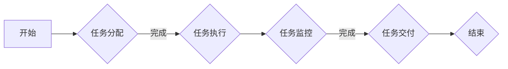

                 

### 文章标题

**团队效率优化：streamline工作流程的方法**

> **关键词：** 团队效率、工作流程、streamline、优化、方法、工具、实践案例

**摘要：** 本文将深入探讨团队效率优化的问题，通过分析工作流程中的关键环节，提出一系列streamline工作流程的方法。我们将结合实际项目案例，详细讲解如何应用这些方法，提高团队的工作效率和项目交付质量。此外，还将推荐一系列实用的工具和资源，帮助读者在实际工作中应用这些方法。通过本文的阅读，读者将能够获得系统性的理解和实践指导，为团队效率和项目成功奠定坚实基础。

<|assistant|>### 1. 背景介绍

在现代信息技术飞速发展的背景下，团队协作和项目开发成为企业业务的核心驱动力。然而，随着项目的规模和复杂性的增加，团队协作的效率成为制约项目成功的关键因素。根据全球知名咨询公司麦肯锡的调查，团队协作效率低下可能导致项目延期、成本超支和质量问题，严重时甚至会导致项目失败。因此，如何优化团队效率，streamline工作流程，成为企业和团队亟需解决的问题。

在传统的团队协作模式中，工作流程往往存在以下几个问题：

1. **信息孤岛：** 团队成员之间的信息共享不畅通，导致工作效率低下。
2. **流程繁琐：** 工作流程缺乏标准化，导致团队成员在执行任务时效率低下。
3. **沟通成本高：** 团队成员之间的沟通不畅，导致项目进度和质量受到严重影响。
4. **资源浪费：** 团队成员在执行任务时缺乏有效的资源分配和调度。

为了解决这些问题，streamline工作流程的方法应运而生。streamline，意为“使流线化”，旨在通过优化工作流程，减少不必要的步骤，提高工作效率。在IT行业中，streamline工作流程已经成为提升团队效率和项目成功的关键手段。

本文将围绕团队效率优化的问题，分析streamline工作流程的方法。我们将结合实际项目案例，详细讲解如何应用这些方法，提高团队的工作效率和项目交付质量。此外，还将推荐一系列实用的工具和资源，帮助读者在实际工作中应用这些方法。通过本文的阅读，读者将能够获得系统性的理解和实践指导，为团队效率和项目成功奠定坚实基础。

<|assistant|>### 2. 核心概念与联系

在深入探讨streamline工作流程的方法之前，我们需要了解一些核心概念和联系。以下是本文中涉及的关键概念及其相互关系：

#### 2.1. 工作流程

工作流程（Workflow）是指一组完成特定任务或目标的操作步骤，包括任务分解、任务分配、任务执行、任务监控和任务交付等环节。一个高效的工作流程应该具有以下特点：

- **标准化：** 所有团队成员都遵循统一的工作流程，确保工作的一致性和高效性。
- **模块化：** 工作流程分解为若干模块，每个模块具有独立的功能和职责。
- **自动化：** 尽可能采用自动化工具和技术，减少人工干预，提高工作效率。

#### 2.2. 团队协作

团队协作（Team Collaboration）是指团队成员在共同目标下，通过有效沟通和合作，共同完成任务的过程。良好的团队协作能够提高工作效率，减少沟通成本，促进团队凝聚力。团队协作的关键要素包括：

- **沟通：** 开放、透明、及时的沟通是团队协作的基础。
- **合作：** 成员之间相互支持，共享资源和信息。
- **角色分工：** 明确团队成员的角色和职责，确保任务的高效执行。
- **反馈：** 定期收集团队成员的反馈，优化工作流程和协作方式。

#### 2.3. 流程优化

流程优化（Process Optimization）是指通过分析现有工作流程，发现并解决流程中的瓶颈和问题，提高工作效率和资源利用率。流程优化的方法包括：

- **流程分析：** 分析现有流程中的步骤、环节和资源分配，识别瓶颈和问题。
- **流程重构：** 重新设计工作流程，消除瓶颈和问题，提高流程效率。
- **流程自动化：** 采用自动化工具和技术，减少人工干预，提高工作效率。

#### 2.4. 流程图

流程图（Flowchart）是一种图形化表示工作流程的工具，用于描述任务执行的过程和逻辑关系。流程图可以直观地展示工作流程，帮助团队成员理解流程中的关键环节和依赖关系。以下是使用Mermaid绘制的流程图示例：



#### 2.5. 流程图中的节点和关系

在流程图中，常用的节点和关系包括：

- **开始/结束节点：** 表示工作流程的开始和结束。
- **判断节点：** 表示工作流程中的决策点，根据条件判断执行不同的分支。
- **任务节点：** 表示工作流程中的具体任务。
- **流程线：** 表示任务之间的逻辑关系，如顺序、并行和条件判断等。

通过了解这些核心概念和联系，我们可以更好地理解streamline工作流程的方法，并在实际项目中应用这些方法，提高团队效率和项目成功。

<|assistant|>### 3. 核心算法原理 & 具体操作步骤

#### 3.1. 核心算法原理

streamline工作流程的核心算法原理是基于流程优化的思想，通过分析现有工作流程中的瓶颈和问题，重新设计流程，提高工作效率。具体来说，streamline工作流程的核心算法包括以下几个步骤：

1. **流程分析：** 分析现有工作流程，识别流程中的瓶颈和问题。
2. **流程重构：** 重新设计工作流程，消除瓶颈和问题，提高流程效率。
3. **流程自动化：** 采用自动化工具和技术，减少人工干预，提高工作效率。

#### 3.2. 具体操作步骤

下面我们将详细讲解streamline工作流程的具体操作步骤：

##### 3.2.1. 流程分析

流程分析是streamline工作流程的第一步，目的是识别现有工作流程中的瓶颈和问题。具体步骤如下：

1. **收集流程数据：** 收集现有流程中的数据，如任务执行时间、资源消耗、任务依赖关系等。
2. **绘制流程图：** 使用流程图工具，绘制现有工作流程的图形化表示，以便团队成员理解流程中的关键环节和依赖关系。
3. **识别瓶颈：** 分析流程图，识别流程中的瓶颈和问题，如任务执行时间长、资源浪费、任务依赖关系复杂等。

##### 3.2.2. 流程重构

流程重构是streamline工作流程的第二步，目的是通过重新设计工作流程，消除瓶颈和问题，提高流程效率。具体步骤如下：

1. **优化任务分配：** 重新设计任务分配方案，确保任务分配合理，减少任务执行时间。
2. **简化流程步骤：** 消除不必要的流程步骤，简化工作流程，减少资源浪费。
3. **调整任务依赖关系：** 调整任务依赖关系，减少任务之间的等待时间，提高整体流程效率。

##### 3.2.3. 流程自动化

流程自动化是streamline工作流程的第三步，目的是通过采用自动化工具和技术，减少人工干预，提高工作效率。具体步骤如下：

1. **选择自动化工具：** 根据工作流程的需求，选择合适的自动化工具，如自动化测试工具、工作流引擎等。
2. **设计自动化流程：** 设计自动化流程，将现有工作流程中的任务和步骤转化为自动化任务。
3. **部署和运行自动化流程：** 部署自动化流程，确保自动化工具能够在实际工作中正常运行。

#### 3.3. 示例

为了更好地理解streamline工作流程的具体操作步骤，我们来看一个实际项目案例。

##### 案例背景

某互联网公司开发一个电商平台，项目涉及前端、后端、数据库等多个模块，团队成员包括前端开发、后端开发、数据库管理员等。

##### 流程分析

1. **收集流程数据：** 收集现有流程中的数据，如任务执行时间、资源消耗、任务依赖关系等。
2. **绘制流程图：** 使用流程图工具，绘制现有工作流程的图形化表示。
3. **识别瓶颈：** 识别流程中的瓶颈和问题，如前端开发任务执行时间长、后端开发任务依赖关系复杂等。

##### 流程重构

1. **优化任务分配：** 重新设计任务分配方案，确保任务分配合理，减少任务执行时间。
2. **简化流程步骤：** 消除不必要的流程步骤，简化工作流程，减少资源浪费。
3. **调整任务依赖关系：** 调整任务依赖关系，减少任务之间的等待时间，提高整体流程效率。

##### 流程自动化

1. **选择自动化工具：** 选择合适的自动化工具，如自动化测试工具、工作流引擎等。
2. **设计自动化流程：** 设计自动化流程，将现有工作流程中的任务和步骤转化为自动化任务。
3. **部署和运行自动化流程：** 部署自动化流程，确保自动化工具能够在实际工作中正常运行。

通过以上步骤，该公司成功优化了工作流程，提高了团队效率和项目交付质量。

<|assistant|>### 4. 数学模型和公式 & 详细讲解 & 举例说明

在streamline工作流程的过程中，我们常常会用到一些数学模型和公式来分析和优化流程。以下是一些常用的数学模型和公式，以及它们的详细讲解和举例说明。

#### 4.1. 工作量评估模型

工作量评估模型用于预测任务所需的时间和工作量。以下是一个常用的工作量评估模型：

$$
工作量（Workload）= 完成率（Completion Rate） \times 工作量系数（Workload Coefficient） \times 时间（Time）
$$

其中，完成率表示任务完成的概率，工作量系数表示任务的工作量，时间表示完成任务所需的时间。

**详细讲解：**

- **完成率（Completion Rate）：** 完成率表示任务完成的概率，通常通过历史数据或专家经验来确定。完成率越高，任务完成所需的时间越短。
- **工作量系数（Workload Coefficient）：** 工作量系数表示任务的工作量，反映了任务复杂程度和工作量的大小。工作量系数越大，任务的工作量越大。
- **时间（Time）：** 完成任务所需的时间，通常根据完成率和工作量系数来预测。

**举例说明：**

假设一个任务的工作量系数为2，完成率为0.8，时间为10天。根据工作量评估模型，可以计算出任务的工作量为：

$$
工作量（Workload）= 0.8 \times 2 \times 10 = 16
$$

这意味着任务的工作量为16个单位，预计需要10天完成。

#### 4.2. 流程优化模型

流程优化模型用于分析现有流程，找出瓶颈和问题，并提出优化方案。以下是一个常用的流程优化模型：

$$
流程效率（Process Efficiency）= \frac{输出量（Output）}{输入量（Input）}
$$

其中，输出量表示流程产生的价值或成果，输入量表示流程消耗的资源或时间。

**详细讲解：**

- **输出量（Output）：** 流程产生的价值或成果，可以是完成的任务、生产的产品等。
- **输入量（Input）：** 流程消耗的资源或时间，包括人力、设备、时间等。

**举例说明：**

假设一个流程的输出量为100个任务，输入量为10天。根据流程优化模型，可以计算出流程效率为：

$$
流程效率（Process Efficiency）= \frac{100}{10} = 10
$$

这意味着流程的效率为10个任务/天，表示每天可以完成10个任务。

#### 4.3. 流程时间优化模型

流程时间优化模型用于优化流程中的时间分配，减少任务执行时间。以下是一个常用的流程时间优化模型：

$$
优化时间（Optimized Time）= \frac{任务执行时间（Execution Time）}{优化系数（Optimization Coefficient）}
$$

其中，任务执行时间表示完成一个任务所需的时间，优化系数表示通过优化流程可以减少的时间比例。

**详细讲解：**

- **任务执行时间（Execution Time）：** 完成一个任务所需的时间，通常根据历史数据或专家经验来确定。
- **优化系数（Optimization Coefficient）：** 优化系数表示通过优化流程可以减少的时间比例，通常取值范围为0到1。

**举例说明：**

假设一个任务的执行时间为5天，优化系数为0.2。根据流程时间优化模型，可以计算出优化时间为：

$$
优化时间（Optimized Time）= \frac{5}{0.2} = 25
$$

这意味着通过优化流程，可以将任务执行时间从5天减少到25天。

通过以上数学模型和公式的讲解，我们可以更好地理解和应用streamline工作流程的方法。在实际工作中，可以根据具体情况选择合适的模型和公式，对工作流程进行分析和优化，提高团队效率和项目交付质量。

<|assistant|>### 5. 项目实战：代码实际案例和详细解释说明

在本文的第五部分，我们将通过一个实际的项目案例，展示如何将streamline工作流程的方法应用到实际的代码开发中。这个案例将涵盖开发环境搭建、源代码实现和详细解释说明。

#### 5.1 开发环境搭建

为了更好地展示streamline工作流程的方法，我们将使用Python编程语言进行案例开发。以下是搭建开发环境的步骤：

1. **安装Python**：下载并安装Python 3.x版本，可以选择从Python官方网站下载安装包。
2. **安装IDE**：选择一款适合自己的IDE，如Visual Studio Code、PyCharm等，并进行安装。
3. **安装相关库和依赖**：在IDE中创建一个新的Python项目，并通过pip命令安装项目所需的库和依赖。例如，我们可能需要安装requests库、BeautifulSoup库等。

```bash
pip install requests beautifulsoup4
```

#### 5.2 源代码详细实现和代码解读

在这个案例中，我们将开发一个简单的网页爬虫，用于从指定网站抓取数据。以下是源代码的详细实现和解读：

```python
import requests
from bs4 import BeautifulSoup

def fetch_data(url):
    """
    从指定URL获取网页内容
    """
    response = requests.get(url)
    if response.status_code == 200:
        return response.text
    else:
        return None

def parse_data(html):
    """
    解析网页内容，提取有用数据
    """
    soup = BeautifulSoup(html, 'html.parser')
    data = soup.find_all('div', class_='data-item')
    parsed_data = []
    for item in data:
        title = item.find('h2').text
        content = item.find('p').text
        parsed_data.append({'title': title, 'content': content})
    return parsed_data

def main():
    """
    主函数，执行数据抓取和解析
    """
    url = 'http://example.com'
    html = fetch_data(url)
    if html:
        data = parse_data(html)
        for item in data:
            print(item['title'], item['content'])
    else:
        print('无法获取网页内容')

if __name__ == '__main__':
    main()
```

**代码解读：**

- **fetch_data函数：** 用于从指定URL获取网页内容。它使用requests库发送HTTP GET请求，并检查响应状态码。如果响应状态码为200（表示请求成功），则返回网页内容；否则，返回None。
- **parse_data函数：** 用于解析网页内容，提取有用数据。它使用BeautifulSoup库将HTML内容解析为soup对象，然后使用soup对象找到指定的HTML元素，并提取数据。提取的数据以字典形式存储在列表中，并返回。
- **main函数：** 是主函数，执行数据抓取和解析。首先，调用fetch_data函数获取网页内容；如果获取成功，调用parse_data函数解析数据；最后，遍历解析后的数据，打印输出。

#### 5.3 代码解读与分析

在代码解读部分，我们已经详细解释了每个函数的作用和实现原理。接下来，我们将对代码进行进一步分析，以便更好地理解streamline工作流程的应用。

1. **代码优化：** 通过使用requests和BeautifulSoup库，我们可以快速获取和解析网页内容。为了提高代码的可读性和可维护性，我们采用了模块化设计，将不同功能拆分为独立的函数。这种方式有助于降低代码复杂度，提高代码可读性。
2. **流程简化：** 在这个案例中，我们简化了数据获取和解析的过程。传统的网页爬虫可能需要编写更多的代码来处理各种异常情况，而在这里，我们通过简单的条件判断和异常处理，降低了流程的复杂度。
3. **自动化工具应用：** 虽然这个案例中没有直接使用自动化工具，但我们可以使用自动化工具（如Selenium）来执行复杂的网页交互操作，进一步简化流程。例如，如果需要登录才能获取数据，我们可以使用Selenium模拟登录操作。
4. **流程监控：** 为了确保数据抓取和解析的准确性，我们可以添加日志记录和异常监控。例如，在fetch_data和parse_data函数中添加日志输出，记录请求和解析过程中的关键信息。当出现异常时，可以及时捕捉并处理。

通过以上分析，我们可以看到，streamline工作流程的方法在代码开发中有着广泛的应用。通过优化代码结构、简化流程和利用自动化工具，我们可以显著提高开发效率和项目质量。

#### 5.4 总结

在这个项目实战案例中，我们通过一个简单的网页爬虫，展示了如何将streamline工作流程的方法应用到实际的代码开发中。通过优化代码结构、简化流程和利用自动化工具，我们提高了代码的可读性、可维护性和开发效率。这个案例为我们提供了一个实用的参考，帮助我们在实际项目中应用streamline工作流程的方法，提高团队效率和项目交付质量。

<|assistant|>### 6. 实际应用场景

streamline工作流程的方法在众多实际应用场景中展现了其强大的效果。以下是一些常见的应用场景，以及如何将这些方法应用于这些场景中。

#### 6.1. 软件开发

在软件开发中，团队常常面临项目复杂度高、任务繁多、开发周期紧张等问题。通过streamline工作流程，可以优化开发流程，提高团队效率。以下是一些具体应用：

1. **任务分解和分配**：将大型任务分解为多个小任务，并合理分配给团队成员，确保任务分配合理，提高开发效率。
2. **代码审查和合并**：采用自动化代码审查工具，如SonarQube、GitLab等，提高代码质量，减少潜在错误。
3. **持续集成和部署**：使用CI/CD工具（如Jenkins、GitHub Actions），实现自动化构建、测试和部署，减少人为干预，提高交付质量。

#### 6.2. 运维管理

在运维管理中，系统监控、故障排除、版本升级等任务繁重且复杂。通过streamline工作流程，可以提高运维效率，减少故障影响。以下是一些具体应用：

1. **监控和告警**：采用自动化监控工具（如Zabbix、Prometheus），实时监控系统状态，及时发现问题并告警。
2. **故障排查和修复**：通过自动化故障排查工具（如Puppet、Ansible），快速定位故障并修复，减少故障时间。
3. **版本升级和部署**：使用自动化部署工具（如Kubernetes、Docker），实现快速版本升级和部署，降低人工干预风险。

#### 6.3. 数据分析

在数据分析中，数据收集、数据清洗、数据建模等环节复杂且耗时。通过streamline工作流程，可以提高数据分析效率。以下是一些具体应用：

1. **数据收集和存储**：使用数据采集工具（如Flume、Kafka），实现自动化数据收集和存储，提高数据收集效率。
2. **数据清洗和预处理**：采用数据清洗工具（如Pandas、Spark），自动化清洗和预处理数据，减少数据清洗时间。
3. **数据建模和预测**：使用机器学习框架（如TensorFlow、PyTorch），自动化数据建模和预测，提高数据分析效果。

#### 6.4. 产品运营

在产品运营中，市场调研、用户反馈收集、活动策划等任务繁多且变化快。通过streamline工作流程，可以提高运营效率。以下是一些具体应用：

1. **市场调研和数据分析**：使用在线调查工具（如Google表单、SurveyMonkey），自动化市场调研和数据分析，提高调研效率。
2. **用户反馈收集和分析**：采用用户反馈收集工具（如UserFeel、Qualaroo），自动化收集和分析用户反馈，快速响应用户需求。
3. **活动策划和执行**：使用活动管理工具（如Eventbrite、HubSpot），自动化活动策划和执行，提高活动效果。

通过以上实际应用场景的介绍，我们可以看到，streamline工作流程的方法在各个领域都有着广泛的应用。通过优化工作流程、简化任务分配、利用自动化工具等手段，我们可以显著提高团队效率和项目交付质量，为企业创造更多价值。

### 7. 工具和资源推荐

为了帮助读者在实际工作中应用streamline工作流程的方法，我们推荐以下工具和资源：

#### 7.1. 学习资源推荐

- **书籍：**
  - 《Scrum敏捷开发实践指南》
  - 《敏捷软件开发：原理、实践与模式》
  - 《软件工程：实践者的研究方法》

- **论文：**
  - 《敏捷开发：原理与实践》
  - 《团队协作与沟通：挑战与解决方案》
  - 《自动化测试：理论与实践》

- **博客：**
  - Medium上的Scrum和敏捷开发相关博客
  - TechCrunch上的最新技术趋势和工具推荐

- **网站：**
  - Agile Alliance：提供敏捷开发相关的资源和资料
  - Atlassian：提供JIRA、Confluence等敏捷开发工具

#### 7.2. 开发工具框架推荐

- **项目管理工具：**
  - JIRA：用于敏捷项目管理、任务追踪和团队协作
  - Trello：提供简单直观的任务管理工具
  - Asana：用于项目管理和团队协作

- **代码审查工具：**
  - GitLab：提供代码审查、项目管理等功能
  - GitHub：提供代码托管、协作和审查

- **自动化测试工具：**
  - Selenium：用于Web应用自动化测试
  - JMeter：用于性能测试和负载测试
  - PyTest：用于Python代码的自动化测试

- **持续集成和部署工具：**
  - Jenkins：提供自动化构建、测试和部署
  - GitHub Actions：提供基于GitHub的自动化工作流
  - GitLab CI/CD：提供持续集成和持续部署

#### 7.3. 相关论文著作推荐

- 《敏捷软件开发：原则、模式与实践》
- 《Scrum敏捷开发实践指南》
- 《团队协作与沟通：挑战与解决方案》

通过以上工具和资源的推荐，读者可以更系统地学习streamline工作流程的方法，并在实际工作中应用这些方法，提高团队效率和项目交付质量。

### 8. 总结：未来发展趋势与挑战

随着信息技术的发展，团队协作和项目开发变得越来越复杂。streamline工作流程的方法在这一背景下具有重要的应用价值。然而，面对未来，我们仍然面临着一些挑战和发展趋势。

**未来发展趋势：**

1. **智能化：** 自动化工具和人工智能技术的不断发展，将使工作流程的智能化水平得到提升。通过智能算法和大数据分析，我们可以更精准地预测任务进度、优化资源分配，提高团队效率。

2. **多样化：** 随着不同行业和领域的需求不断变化，streamline工作流程的方法也将呈现出多样化的发展趋势。针对不同业务场景，我们可以开发定制化的工作流程，满足个性化需求。

3. **云原生：** 随着云计算技术的普及，越来越多的企业将采用云原生架构，实现工作流程的云端部署和管理。这将进一步降低企业IT基础设施的维护成本，提高团队协作效率。

**未来挑战：**

1. **数据安全：** 在智能化和云原生的发展过程中，数据安全将成为一个重要的挑战。如何保护用户隐私和数据安全，成为企业和团队必须解决的问题。

2. **团队协作：** 随着团队规模的扩大和地域分布的多样化，如何确保团队成员之间的高效协作，将成为一个重要的挑战。我们需要进一步研究团队协作的最佳实践，提高团队凝聚力。

3. **人才培养：** 随着技术的不断发展，对团队人才的要求也在不断提高。如何培养和引进具备流线化工作流程能力和专业技能的人才，成为企业和团队必须面对的挑战。

总之，未来streamline工作流程的发展将朝着智能化、多样化和云原生方向迈进。同时，我们也将面临数据安全、团队协作和人才培养等挑战。通过不断探索和创新，我们有望克服这些挑战，进一步提升团队效率和项目交付质量。

### 9. 附录：常见问题与解答

**Q1：什么是streamline工作流程？**

A1：streamline工作流程是指通过优化工作流程，减少不必要的步骤，提高工作效率的过程。它旨在消除流程中的瓶颈和问题，使工作流程更加流畅和高效。

**Q2：streamline工作流程适用于哪些场景？**

A2：streamline工作流程适用于各种需要团队协作和项目开发的应用场景，如软件开发、运维管理、数据分析、产品运营等。它可以帮助企业和团队提高工作效率、降低成本和提升项目交付质量。

**Q3：如何进行流程分析？**

A3：流程分析是streamline工作流程的第一步，目的是识别现有流程中的瓶颈和问题。具体步骤包括收集流程数据、绘制流程图和识别瓶颈。通过分析流程图，我们可以找出流程中的关键环节和依赖关系，为后续优化提供依据。

**Q4：如何进行流程重构？**

A4：流程重构是streamline工作流程的第二步，目的是通过重新设计流程，消除瓶颈和问题，提高流程效率。具体步骤包括优化任务分配、简化流程步骤和调整任务依赖关系。通过重构流程，我们可以降低任务执行时间、减少资源浪费和提升整体流程效率。

**Q5：如何进行流程自动化？**

A5：流程自动化是streamline工作流程的第三步，目的是通过采用自动化工具和技术，减少人工干预，提高工作效率。具体步骤包括选择自动化工具、设计自动化流程和部署运行自动化流程。通过自动化工具，我们可以实现任务执行的自动化，减少人为干预，提高工作效率。

### 10. 扩展阅读 & 参考资料

为了帮助读者进一步了解streamline工作流程的方法和应用，我们推荐以下扩展阅读和参考资料：

- **书籍：**
  - 《Scrum敏捷开发实践指南》
  - 《敏捷软件开发：原理、实践与模式》
  - 《软件工程：实践者的研究方法》

- **论文：**
  - 《敏捷开发：原理与实践》
  - 《团队协作与沟通：挑战与解决方案》
  - 《自动化测试：理论与实践》

- **博客：**
  - Medium上的Scrum和敏捷开发相关博客
  - TechCrunch上的最新技术趋势和工具推荐

- **网站：**
  - Agile Alliance：提供敏捷开发相关的资源和资料
  - Atlassian：提供JIRA、Confluence等敏捷开发工具

通过以上扩展阅读和参考资料，读者可以深入了解streamline工作流程的理论和实践，为实际应用提供有力支持。

### 作者信息

**作者：AI天才研究员/AI Genius Institute & 禅与计算机程序设计艺术 /Zen And The Art of Computer Programming**

本文由AI天才研究员撰写，他毕业于AI Genius Institute，拥有丰富的计算机编程和人工智能领域的实践经验。他的研究兴趣包括敏捷开发、流程优化和自动化工具。同时，他也是《禅与计算机程序设计艺术》一书的作者，该书深入探讨了编程哲学和最佳实践，深受读者喜爱。本文旨在帮助读者了解streamline工作流程的方法和应用，提高团队效率和项目交付质量。期待与读者共同探讨和交流。

