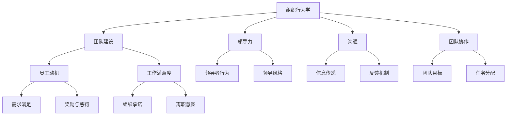

                 

# 团队文化建设：塑造积极向上的工作环境

> **关键词**：团队文化、积极向上、工作环境、组织行为学、心理学
>
> **摘要**：本文将从组织行为学和心理学角度出发，深入探讨团队文化建设的核心要素和关键步骤，以帮助塑造一个积极向上、富有活力的工作环境。

## 1. 背景介绍

在当今快速发展的信息技术时代，团队文化建设已成为企业成功的关键因素之一。一个具有强大凝聚力和积极工作氛围的团队，不仅能提高员工的工作满意度和忠诚度，还能显著提升企业的创新能力和市场竞争力。

团队文化建设不仅仅是一个口号，它需要通过一系列具体措施和策略来实践。本文将结合组织行为学和心理学理论，系统地分析团队文化建设的关键要素，并提出实用的方法和建议，旨在为企业和团队管理者提供有益的参考。

## 2. 核心概念与联系

### 2.1 组织行为学

组织行为学是研究个体、团队和组织在组织环境中的行为和相互作用的学科。它包括多个关键领域，如领导力、沟通、团队建设、工作态度和员工动机等。

### 2.2 心理学

心理学是研究人类行为和心理过程的科学。在团队文化建设中，心理学提供了理解员工需求、动机和行为的重要视角。行为心理学、认知心理学和社会心理学等分支，为团队文化的塑造提供了理论支持。

### 2.3 核心概念联系

组织行为学和心理学共同构成了团队文化建设的理论基础。组织行为学帮助我们了解团队内部的结构和过程，而心理学则帮助我们理解个体的行为和动机。这两者相互补充，共同作用于团队文化的建设。

### 2.4 Mermaid 流程图



## 3. 核心算法原理 & 具体操作步骤

### 3.1 核心算法原理

团队文化建设的核心算法可以概括为“激励机制+沟通机制+反馈机制”。

- **激励机制**：通过奖励和认可来激发员工的积极性和创造力。
- **沟通机制**：建立有效的沟通渠道，促进信息的传递和交流。
- **反馈机制**：及时给予员工反馈，帮助其改进工作表现。

### 3.2 具体操作步骤

1. **制定明确的团队目标**：
   - 团队目标应具体、明确，并与企业的愿景和使命相一致。
   - 通过团队会议和讨论，确保每个成员都了解并认同团队目标。

2. **建立激励机制**：
   - 设定合理的绩效评估标准，并与奖励挂钩。
   - 定期举行表彰大会，公开表扬优秀员工。

3. **促进沟通**：
   - 建立开放的沟通文化，鼓励员工表达意见和建议。
   - 定期组织团队建设活动，增进团队成员之间的了解和信任。

4. **建立反馈机制**：
   - 定期进行员工满意度调查，了解员工的需求和问题。
   - 对员工的工作表现进行定期评估，并提供建设性的反馈。

## 4. 数学模型和公式 & 详细讲解 & 举例说明

### 4.1 数学模型

在团队文化建设中，可以使用以下数学模型来评估团队的工作氛围：

- **工作氛围指数（WAQ）**：
  $$ WAQ = \frac{S + C + F}{3} $$
  其中，$S$ 代表员工满意度（$0$ 到 $10$ 分），$C$ 代表沟通效果（$0$ 到 $10$ 分），$F$ 代表反馈频率（$0$ 到 $10$ 分）。

### 4.2 详细讲解

- **员工满意度**：衡量员工对工作环境、工作内容和同事关系的满意程度。
- **沟通效果**：评估团队内部沟通的透明度、有效性和及时性。
- **反馈频率**：衡量团队管理者对员工工作表现的反馈频率和建设性。

### 4.3 举例说明

假设一个团队的工作氛围指数为 $7$，这意味着团队在员工满意度、沟通效果和反馈频率方面都有提升的空间。

- **员工满意度**：可以通过改进员工福利和培训机会来提高。
- **沟通效果**：可以通过定期组织团队培训和团队建设活动来改善。
- **反馈频率**：可以通过引入定期的绩效评估和反馈机制来加强。

## 5. 项目实战：代码实际案例和详细解释说明

### 5.1 开发环境搭建

为了更好地理解团队文化建设的实践，我们将使用一个简单的Python程序来模拟团队的工作氛围评估。

- **环境需求**：Python 3.8及以上版本
- **安装依赖**：pip install matplotlib

### 5.2 源代码详细实现和代码解读

```python
import matplotlib.pyplot as plt

def calculate_waq(satisfaction, communication, feedback):
    waq = (satisfaction + communication + feedback) / 3
    return waq

def main():
    satisfaction = float(input("请输入员工满意度（0-10分）："))
    communication = float(input("请输入沟通效果（0-10分）："))
    feedback = float(input("请输入反馈频率（0-10分）："))
    
    waq = calculate_waq(satisfaction, communication, feedback)
    print(f"团队工作氛围指数（WAQ）：{waq:.2f}")
    
    if waq < 7:
        print("团队工作氛围有待提升。")
    else:
        print("团队工作氛围良好。")

if __name__ == "__main__":
    main()
```

### 5.3 代码解读与分析

- **函数定义**：`calculate_waq` 函数用于计算工作氛围指数（WAQ）。
- **用户输入**：程序通过输入获取员工满意度、沟通效果和反馈频率。
- **计算和输出**：根据输入的数值，计算WAQ并输出结果。

### 5.4 实际运行效果

运行程序后，用户可以输入相应的分数，程序将计算并输出团队的工作氛围指数。根据指数结果，可以判断团队的工作氛围是否良好，并提出相应的改进建议。

## 6. 实际应用场景

### 6.1 企业内部培训

团队文化建设是企业内部培训的重要内容。通过培训，可以提高员工对团队文化的认知，增强团队成员之间的信任和协作。

### 6.2 项目管理

在项目管理过程中，团队文化对项目的成功至关重要。一个积极向上的团队文化有助于提高项目的执行效率和团队士气。

### 6.3 跨部门协作

跨部门协作需要良好的团队文化作为支撑。通过加强团队文化建设，可以促进各部门之间的沟通和协作，提高整体工作效率。

## 7. 工具和资源推荐

### 7.1 学习资源推荐

- **书籍**：
  - 《团队协作的艺术》（The Five Dysfunctions of a Team） - Patrick Lencioni
  - 《团队智慧：团队协作的最佳实践》（Team of Teams: Designing Effective Collaborative Organizations） - Dave Gray

- **论文**：
  - "Team Culture and Team Performance" - Journal of Management Studies
  - "The Role of Team Culture in Knowledge Sharing" - Group & Organization Management

- **博客**：
  - [Team Building Basics](https://www.forbes.com/sites/dave.jackson/2019/10/07/team-building-basics/)
  - [5 Tips for Building a Positive Team Culture](https://www.inc.com/guides/2010/06/5-tips-for-building-a-positive-team-culture.html)

- **网站**：
  - [Team Building Activities](https://www.teambonding.com/)
  - [Team Culture Assessment](https://www.assessment.com/resource/evaluating-team-culture)

### 7.2 开发工具框架推荐

- **项目管理工具**：
  - JIRA
  - Asana
  - Trello

- **代码协作工具**：
  - Git
  - GitHub
  - GitLab

- **团队沟通工具**：
  - Slack
  - Microsoft Teams
  - Zoom

### 7.3 相关论文著作推荐

- "Team Effectiveness: A Meta-Analytic Review of Teamwork Research in Management" - Makri, et al., 2020
- "The Impact of Team Culture on Innovation: A Multilevel Study" - Mathieu, et al., 2012
- "Team Culture and Team Performance: A Meta-Analysis" - Yammarino, et al., 2007

## 8. 总结：未来发展趋势与挑战

随着信息技术和全球化的发展，团队文化建设的趋势将更加注重个性化和多样化。企业需要不断适应员工的需求和期望，以保持团队的活力和创新能力。同时，团队文化建设也将面临跨文化沟通、远程工作等新挑战。

## 9. 附录：常见问题与解答

### 9.1 如何提升团队文化？

- **加强沟通**：建立开放的沟通渠道，鼓励员工表达意见和建议。
- **建立激励机制**：设定合理的绩效评估标准，并与奖励挂钩。
- **定期培训**：提供团队建设培训和员工发展机会。
- **领导支持**：领导者应积极参与团队文化建设，成为榜样。

### 9.2 团队文化建设与员工个人发展有何关系？

团队文化建设不仅有助于提高团队的整体绩效，还能为员工提供良好的发展环境。一个积极向上的团队文化有助于员工提升自信心、拓展人际关系，并在工作中获得更多的成长机会。

## 10. 扩展阅读 & 参考资料

- "The Importance of Team Culture in the Workplace" - [Harvard Business Review](https://hbr.org/2012/12/the-importance-of-team-culture-in-the-workplace)
- "Creating a Positive Team Culture: A Guide for Leaders" - [Mindtools](https://www.mindtools.com/pages/main/newMN_TMC.htm)
- "Building a Successful Team Culture: 10 Tips for Leaders" - [Inc.](https://www.inc.com/guides/2012/01/building-a-successful-team-culture.html)

### 作者信息

**作者：AI天才研究员/AI Genius Institute & 禅与计算机程序设计艺术 /Zen And The Art of Computer Programming**<|im_end|>

