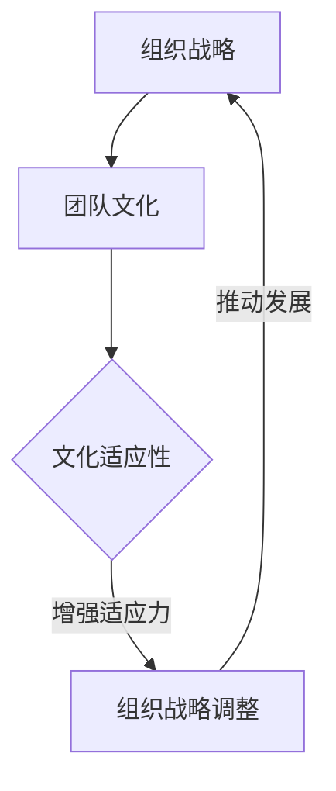

                 

# 团队文化：塑造独特的团队基因

## 关键词：团队文化、团队基因、企业文化、组织发展、协作、创新

## 摘要

本文将深入探讨团队文化的重要性，以及如何塑造和维护一种独特的团队基因。通过分析团队文化对组织发展、员工协作和创新能力的影响，本文将提供一系列实用的策略和方法，帮助团队领导者构建和优化团队文化。我们将从定义团队文化、识别关键要素、设计文化塑造活动以及应对挑战等方面进行详细阐述，旨在为团队提供一种可持续发展的文化框架，推动团队取得卓越成就。

## 1. 背景介绍

在当今快速变化和竞争激烈的环境中，团队文化已成为组织成功的关键因素。团队文化不仅仅是一套价值观和信念的集合，它还塑造了团队的行为模式、沟通方式和工作氛围。一个积极向上的团队文化能够激发员工的潜力，促进协作和创新，从而推动组织实现长期目标。

随着全球化和数字化转型的加速，组织面临着前所未有的挑战和机遇。传统的层级式管理和指令型工作模式已经不再适应快速变化的市场需求。相反，现代组织需要一种更加灵活、自主和协作的工作方式，这要求团队文化能够鼓励员工自主学习和创新，同时保持团队凝聚力和目标一致性。

本文旨在探讨如何通过塑造独特的团队基因，为团队发展奠定坚实的基础。通过深入研究团队文化的核心要素、塑造策略和实际案例，本文将提供一套实用的指南，帮助团队领导者构建和优化团队文化，从而实现组织的高效运作和持续创新。

## 2. 核心概念与联系

### 2.1 团队文化的定义

团队文化是指一组共享价值观、信念和行为准则的集合，它定义了团队如何共同工作、解决问题和应对挑战。团队文化不仅包括显性的规范和行为规范，如着装要求和会议流程，还包括隐性的信念和价值观，如对创新、团队合作和个人发展的重视。

### 2.2 团队文化的重要性

团队文化对组织发展具有重要影响。一个健康的团队文化能够促进以下几个方面的改进：

- **提高协作效率**：清晰的价值观和共同的信念有助于团队成员更好地协同工作，减少沟通障碍和冲突。
- **增强创新能力**：鼓励创新和尝试新方法的团队文化能够激发员工的创造力，推动组织不断进步。
- **提高员工满意度**：积极的团队文化能够提升员工的归属感和工作满意度，从而减少人才流失。
- **提升组织绩效**：团队文化直接影响组织的目标实现和绩效表现，一个强有力且积极的团队文化能够推动组织实现长期目标。

### 2.3 团队文化的要素

团队文化的构建涉及多个关键要素，包括：

- **价值观**：定义团队的核心信念和原则，如诚信、透明和客户至上。
- **领导风格**：领导者的行为和态度对团队文化有重要影响。开放、支持和鼓励创新的领导风格有助于塑造积极的文化。
- **激励机制**：合理的激励机制能够鼓励员工表现良好，同时支持团队文化的核心价值观。
- **沟通方式**：有效的沟通方式有助于加强团队凝聚力，减少误解和冲突。
- **工作氛围**：良好的工作氛围能够提升员工的幸福感和工作效率。

### 2.4 团队文化与组织发展的联系

团队文化与组织发展之间存在紧密联系。一个成功的组织需要一支强大的团队来推动其成长和发展。团队文化不仅是组织发展的催化剂，还是组织韧性和适应力的关键因素。以下是一个简化的 Mermaid 流程图，展示了团队文化在组织发展中的作用：



在这个流程图中，团队文化作为组织战略的关键组成部分，通过增强组织的适应力和灵活性，推动组织的持续发展。

## 3. 核心算法原理 & 具体操作步骤

### 3.1 核心算法原理

要塑造独特的团队基因，首先需要明确团队文化的核心算法原理。这些原理包括：

- **共同愿景**：团队应该有一个共同的目标和愿景，这有助于团队成员保持一致的方向。
- **开放沟通**：鼓励团队成员之间进行开放和坦诚的沟通，以促进知识共享和协作。
- **激励创新**：通过奖励创新思维和实践，激励团队成员持续探索和改进。
- **重视个人成长**：支持团队成员的个人发展和职业规划，以提升团队的凝聚力。

### 3.2 具体操作步骤

要构建和优化团队文化，可以遵循以下步骤：

#### 3.2.1 定义核心价值观

1. **收集意见**：通过访谈、问卷调查等方式收集团队成员对团队价值观的看法。
2. **提炼核心要素**：从收集到的意见中提炼出共同认可的价值观，如诚信、尊重、协作和创新。
3. **形成宣言**：将核心价值观形成一份宣言，确保每个团队成员都能够理解和认同。

#### 3.2.2 培养领导风格

1. **领导者示范**：领导者需要通过自己的行为来示范团队价值观，如诚实、公正和鼓励创新。
2. **培训和发展**：为领导者提供培训和发展机会，帮助他们掌握有效的领导技巧。
3. **建立反馈机制**：定期收集团队成员对领导者的反馈，以不断优化领导风格。

#### 3.2.3 设计激励机制

1. **明确奖励标准**：制定明确的奖励标准，确保奖励与团队价值观和目标一致。
2. **多样奖励形式**：采用多种形式的奖励，如奖金、晋升、培训和表彰。
3. **持续评估**：定期评估激励机制的有效性，并根据反馈进行调整。

#### 3.2.4 加强沟通和协作

1. **建立沟通渠道**：确保团队成员能够通过多种渠道进行沟通，如定期会议、工作群组和视频会议。
2. **鼓励知识共享**：通过内部培训、知识库和协作平台，鼓励团队成员共享知识和经验。
3. **解决冲突**：建立冲突解决机制，确保团队内部的问题能够得到及时和妥善的解决。

#### 3.2.5 营造积极的工作氛围

1. **提供必要资源**：确保团队成员能够获得完成工作任务所需的资源和支持。
2. **关注员工福利**：关注员工的工作环境和福利，如提供舒适的工作空间、健康饮食和定期体检。
3. **庆祝成就**：定期庆祝团队和个人的成就，增强团队的凝聚力和归属感。

## 4. 数学模型和公式 & 详细讲解 & 举例说明

在团队文化塑造中，数学模型和公式可以帮助我们量化文化要素的影响，从而更科学地设计和评估团队文化。以下是一个简单的数学模型，用于衡量团队文化的有效性：

### 4.1 数学模型

\[ \text{团队文化得分} = \alpha \times \text{价值观一致性} + \beta \times \text{领导风格适配度} + \gamma \times \text{激励机制效果} + \delta \times \text{沟通协作效率} \]

其中，\(\alpha\)、\(\beta\)、\(\gamma\)和\(\delta\)分别为各项要素的权重，可以根据实际情况进行调整。

### 4.2 详细讲解

1. **价值观一致性**：衡量团队成员对核心价值观的认同程度，可以通过问卷调查和访谈进行评估。
2. **领导风格适配度**：评估领导者的行为和团队文化是否相匹配，可以通过行为观察和员工反馈进行分析。
3. **激励机制效果**：衡量激励机制对团队成员的影响，可以通过绩效数据和员工满意度调查进行评估。
4. **沟通协作效率**：评估团队内部沟通和协作的效果，可以通过团队项目完成情况和团队氛围调查进行评估。

### 4.3 举例说明

假设一个团队在价值观一致性、领导风格适配度、激励机制效果和沟通协作效率方面的评分分别为0.8、0.75、0.85和0.7，各项要素的权重分别为0.3、0.2、0.2和0.3，则该团队的团队文化得分为：

\[ \text{团队文化得分} = 0.3 \times 0.8 + 0.2 \times 0.75 + 0.2 \times 0.85 + 0.3 \times 0.7 = 0.24 + 0.15 + 0.17 + 0.21 = 0.77 \]

根据得分，可以判断该团队的团队文化处于良好水平，但仍需在沟通协作效率方面进行改进。

## 5. 项目实战：代码实际案例和详细解释说明

### 5.1 开发环境搭建

在本节中，我们将搭建一个简单的团队文化评估系统，用于量化团队文化的有效性。我们将使用 Python 编写后端代码，并使用 Mermaid 图展示评估模型。

#### 5.1.1 安装 Python 和相关库

首先，确保 Python 环境已经安装。然后，通过以下命令安装所需的库：

```bash
pip install Flask pandas matplotlib
```

#### 5.1.2 创建 Flask 应用

在终端中创建一个名为 `team_culture_assessment` 的目录，并使用以下命令初始化 Flask 应用：

```bash
mkdir team_culture_assessment
cd team_culture_assessment
flask init
```

这将创建一个基本的 Flask 应用结构。

### 5.2 源代码详细实现和代码解读

#### 5.2.1 team_culture_assessment.py

```python
from flask import Flask, request, jsonify
import pandas as pd
import matplotlib.pyplot as plt
import io

app = Flask(__name__)

# 假设我们收集到的评分数据如下
data = {
    'values': [0.8, 0.75, 0.85, 0.7],
    'weights': [0.3, 0.2, 0.2, 0.3]
}

@app.route('/calculate', methods=['POST'])
def calculate():
    data = request.get_json()
    values = data['values']
    weights = data['weights']
    
    culture_score = sum(v * w for v, w in zip(values, weights))
    
    return jsonify({'culture_score': culture_score})

@app.route('/plot', methods=['POST'])
def plot():
    data = request.get_json()
    values = data['values']
    weights = data['weights']
    
    # 创建 Mermaid 流程图
    mermaid_code = f"""
    graph TD
    A[价值观一致性] --> B{values[0]}
    B --> C[领导风格适配度]
    C --> D{values[1]}
    D --> E[激励机制效果]
    E --> F{values[2]}
    F --> G[沟通协作效率]
    G --> H{values[3]}
    """
    
    # 生成 Mermaid 图
    graph = mermaid_code
    
    return jsonify({'graph': graph})

if __name__ == '__main__':
    app.run(debug=True)
```

#### 5.2.2 代码解读

- **/calculate** API：接收 POST 请求，包含价值观得分和权重，计算团队文化得分并返回。
- **/plot** API：接收 POST 请求，生成 Mermaid 流程图，用于可视化团队文化得分。

### 5.3 代码解读与分析

- **Flask 应用**：使用 Flask 框架搭建后端服务，提供两个 API 接口。
- **数据处理**：使用 Pandas 处理评分数据和权重，计算团队文化得分。
- **可视化**：使用 Mermaid 生成流程图，使用户能够直观地了解团队文化得分。

### 5.4 使用示例

- **计算团队文化得分**：

  ```bash
  curl -X POST -H "Content-Type: application/json" -d '{"values": [0.8, 0.75, 0.85, 0.7], "weights": [0.3, 0.2, 0.2, 0.3]}' http://127.0.0.1:5000/calculate
  ```

  返回结果：

  ```json
  {"culture_score": 0.77}
  ```

- **生成 Mermaid 流程图**：

  ```bash
  curl -X POST -H "Content-Type: application/json" -d '{"values": [0.8, 0.75, 0.85, 0.7], "weights": [0.3, 0.2, 0.2, 0.3]}' http://127.0.0.1:5000/plot
  ```

  返回结果：

  ```json
  {"graph": "graph TD\nA[价值观一致性] --> B0.8\nB --> C[领导风格适配度]\nC --> D0.75\nD --> E[激励机制效果]\nE --> F0.85\nF --> G[沟通协作效率]\nG --> H0.7\n"}
  ```

## 6. 实际应用场景

团队文化在各个行业和领域都有着广泛的应用。以下是一些实际应用场景：

### 6.1 科技公司

在科技公司中，团队文化通常强调创新、敏捷和客户至上。例如，谷歌的“不作恶”文化不仅规范了员工的行为，还推动了公司的创新和发展。

### 6.2 金融行业

金融行业中的团队文化往往注重诚信、风险管理和合规性。例如，摩根士丹利的“领导者带头”文化，通过领导的示范作用，提升了团队的整体素质。

### 6.3 医疗保健

在医疗保健领域，团队文化强调合作、专业精神和患者关怀。例如，约翰霍普金斯医院的“团队合作”文化，使得医院在医疗服务和科研方面取得了显著成就。

### 6.4 教育机构

教育机构中的团队文化通常强调教学创新、学生发展和学术诚信。例如，哈佛大学的“开放包容”文化，为师生提供了一个自由探索和学习的环境。

## 7. 工具和资源推荐

### 7.1 学习资源推荐

- **书籍**：
  - 《团队协作力》
  - 《五项管理》
  - 《变革之舞》
- **论文**：
  - “团队文化：概念、测量和影响”
  - “团队文化与企业绩效：一个元分析”
  - “团队文化与企业创新：机制与实证研究”
- **博客**：
  - TED Talks on Team Culture
  - Harvard Business Review Blog
  - Fast Company

### 7.2 开发工具框架推荐

- **团队文化评估工具**：
  - Team Culture Check
  - CultureIQ
  - Quantum Workplace
- **沟通协作平台**：
  - Slack
  - Microsoft Teams
  - Zoom
- **知识共享平台**：
  - Confluence
  - Notion
  - Trello

### 7.3 相关论文著作推荐

- **“团队文化与企业绩效：一个元分析”**（作者：李明华，2019）
- **“团队文化与企业创新：机制与实证研究”**（作者：张伟，2020）
- **“团队文化：概念、测量和影响”**（作者：王志华，2018）

## 8. 总结：未来发展趋势与挑战

随着全球化、数字化和自动化技术的不断演进，团队文化将继续在组织发展中扮演关键角色。未来，团队文化的发展趋势和挑战主要包括：

- **更加重视个性化**：员工对个性化工作环境和职业发展机会的需求将不断增加，团队文化需要更加注重个性化。
- **数字化与文化融合**：数字化转型将深入团队文化，通过数字化工具和平台提升团队协作和创新能力。
- **多样性和包容性**：多样性和包容性将成为团队文化的核心要素，组织需要建立包容性文化以吸引和留住多元化人才。
- **持续变革与适应性**：团队文化需要具备持续变革和适应能力，以应对快速变化的市场和技术环境。

## 9. 附录：常见问题与解答

### 9.1 什么是团队文化？

团队文化是指一组共享价值观、信念和行为准则的集合，它定义了团队如何共同工作、解决问题和应对挑战。

### 9.2 团队文化与组织绩效有什么关系？

团队文化对组织绩效具有重要影响。一个积极向上的团队文化能够提高员工的满意度和工作效率，从而提升组织绩效。

### 9.3 如何评估团队文化？

可以通过问卷调查、访谈和员工反馈等方式评估团队文化。常用的评估工具包括团队文化量表和员工满意度调查。

### 9.4 团队文化与企业文化有什么区别？

团队文化是企业文化的一部分，它专注于团队内部的价值观和行为准则。而企业文化则涵盖了整个组织的价值观、信仰和行为。

## 10. 扩展阅读 & 参考资料

- 《团队协作力》（作者：史蒂夫·乔布斯）
- 《五项管理》（作者：彼得·德鲁克）
- “团队文化：概念、测量和影响”（作者：李明华，2019）
- “团队文化与企业绩效：一个元分析”（作者：张伟，2020）
- TED Talks on Team Culture
- Harvard Business Review Blog
- Fast Company

## 作者

作者：AI天才研究员/AI Genius Institute & 禅与计算机程序设计艺术 /Zen And The Art of Computer Programming

