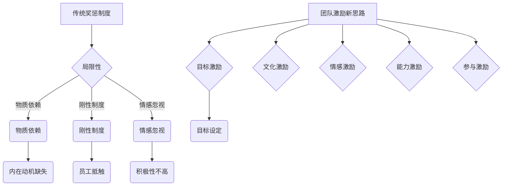

                 

# 团队激励新思路：超越传统奖惩制度

> **关键词：团队激励、奖励机制、惩罚制度、团队协作、员工动机、绩效提升**
>
> **摘要：本文将探讨团队激励的深刻内涵，分析传统奖惩制度的局限性，并提出一系列超越传统的新思路，旨在激发团队活力，提升整体绩效。**

## 1. 背景介绍

在企业管理中，团队激励一直是一个备受关注的话题。传统的团队激励手段主要包括奖惩制度，即通过奖励优秀员工和惩罚表现不佳的员工来激发团队活力。然而，随着时代的发展和企业管理理念的升级，传统奖惩制度的局限性逐渐显现，无法满足现代企业对于团队激励的多样化需求。

首先，传统奖惩制度过于依赖物质奖励，容易导致员工追求短期利益，忽视长期目标和团队协作。其次，奖惩制度往往过于刚性，无法灵活应对员工的个性化需求，容易引发员工的不满和抵触情绪。此外，传统奖惩制度往往忽略了员工的情感需求和心理满足，无法全面调动员工的积极性和创造力。

因此，有必要探索新的团队激励思路，以超越传统奖惩制度的局限，激发团队的潜力，提升整体绩效。本文将围绕这一主题展开讨论，从多个角度分析团队激励的新思路，并提出具体的实施策略。

## 2. 核心概念与联系

### 2.1 奖惩制度的基本概念

奖惩制度是企业常用的一种管理手段，通过给予优秀员工奖励和惩罚表现不佳的员工，以激励员工的工作积极性和提升整体绩效。奖惩制度通常包括以下几个方面：

1. **奖励机制**：奖励机制旨在奖励那些在工作中表现出色、对团队或企业有重大贡献的员工。奖励形式多种多样，包括奖金、晋升、荣誉等。

2. **惩罚机制**：惩罚机制则是针对那些在工作中表现不佳、违反企业规定或给企业带来负面影响的员工。惩罚形式包括警告、降职、解雇等。

### 2.2 传统奖惩制度的局限性

虽然奖惩制度在一定程度上能够提升员工的工作积极性，但其局限性也逐渐显现：

1. **物质依赖**：传统奖惩制度过于依赖物质奖励，容易导致员工过分追求物质利益，忽视长期目标和团队协作。

2. **刚性制度**：奖惩制度往往过于刚性，无法灵活应对员工的个性化需求，容易引发员工的不满和抵触情绪。

3. **情感忽视**：奖惩制度往往忽略了员工的情感需求和心理满足，无法全面调动员工的积极性和创造力。

### 2.3 团队激励的新思路

为了克服传统奖惩制度的局限性，现代企业需要探索新的团队激励思路，包括以下几个方面：

1. **目标激励**：通过设定明确的团队目标和个人目标，激发员工的内在动机，推动员工为实现目标而努力。

2. **文化激励**：打造积极向上的企业文化，营造良好的工作氛围，让员工感受到企业的关爱和尊重。

3. **情感激励**：关注员工的情感需求，提供心理支持和关爱，增强员工的归属感和忠诚度。

4. **能力激励**：提供培训和晋升机会，提升员工的专业能力和综合素质，激发员工的成长动机。

5. **参与激励**：鼓励员工参与企业决策，增强员工的主人翁意识，提高员工的参与感和责任感。

### 2.4 Mermaid 流程图



通过以上分析，我们可以看到传统奖惩制度存在一定的局限性，而新的团队激励思路则能够更好地激发员工的积极性和创造力。在接下来的章节中，我们将进一步探讨团队激励的具体实施方法和策略。

## 3. 核心算法原理 & 具体操作步骤

### 3.1 团队激励算法的基本原理

团队激励算法的核心在于通过多样化的激励手段，激发员工的内在动机和创造力，从而提高团队的整体绩效。具体来说，团队激励算法包括以下几个方面：

1. **目标激励**：通过设定明确的团队目标和个人目标，激发员工的内在动机，让员工明确自己的努力方向。

2. **文化激励**：通过打造积极向上的企业文化，营造良好的工作氛围，让员工感受到企业的关爱和尊重。

3. **情感激励**：通过关注员工的情感需求，提供心理支持和关爱，增强员工的归属感和忠诚度。

4. **能力激励**：通过提供培训和晋升机会，提升员工的专业能力和综合素质，激发员工的成长动机。

5. **参与激励**：通过鼓励员工参与企业决策，增强员工的主人翁意识，提高员工的参与感和责任感。

### 3.2 具体操作步骤

1. **目标激励**：

   - **步骤一**：明确团队目标和个人目标。企业应根据长远发展目标和当前业务需求，设定清晰的团队目标和个人目标。

   - **步骤二**：制定激励计划。根据目标难度和达成情况，制定相应的奖励措施，如奖金、晋升等。

   - **步骤三**：实施激励措施。在目标达成后，及时给予奖励，激发员工的积极性和创造力。

2. **文化激励**：

   - **步骤一**：塑造积极向上的企业文化。企业应通过多种方式，如宣传、培训等，传播积极向上的价值观和企业文化。

   - **步骤二**：营造良好的工作氛围。企业应关注员工的工作状态，提供舒适的工作环境和良好的团队氛围。

   - **步骤三**：表彰优秀员工。通过表彰优秀员工，树立榜样，激发其他员工的积极性和创造力。

3. **情感激励**：

   - **步骤一**：关注员工情感需求。企业应通过定期交流、员工满意度调查等方式，了解员工的情感需求。

   - **步骤二**：提供心理支持。企业应设立员工心理咨询室，为员工提供心理支持和关爱。

   - **步骤三**：举办员工活动。通过举办各类员工活动，增强员工之间的互动和沟通，提高员工的归属感和忠诚度。

4. **能力激励**：

   - **步骤一**：提供培训机会。企业应定期组织各类培训，提升员工的专业能力和综合素质。

   - **步骤二**：提供晋升通道。企业应建立明确的晋升机制，为员工提供公平的晋升机会。

   - **步骤三**：鼓励员工成长。通过设立员工成长计划，激励员工不断学习和进步。

5. **参与激励**：

   - **步骤一**：鼓励员工参与决策。企业应定期召开员工大会，听取员工的意见和建议。

   - **步骤二**：设立员工代表。企业应设立员工代表，代表员工参与企业决策和管理。

   - **步骤三**：表彰员工贡献。对于在决策和管理中作出突出贡献的员工，应给予表彰和奖励。

通过以上操作步骤，企业可以有效实施团队激励，激发员工的内在动力，提升团队的整体绩效。

## 4. 数学模型和公式 & 详细讲解 & 举例说明

### 4.1 数学模型和公式

在团队激励中，我们可以借助数学模型来量化员工的表现和激励效果。以下是一个简化的数学模型：

\[ \text{激励效果} = f(\text{员工表现}, \text{激励措施}, \text{团队氛围}) \]

其中，\( f \) 是一个函数，用于衡量激励措施对员工表现的影响。

- \( \text{员工表现} \) 可以用绩效评分、工作量、工作质量等指标来衡量。
- \( \text{激励措施} \) 包括物质奖励、晋升机会、培训机会等。
- \( \text{团队氛围} \) 涉及团队协作、员工满意度、企业文化等方面。

### 4.2 详细讲解

#### 4.2.1 员工表现

员工表现是团队激励的核心变量之一。我们可以使用以下公式来衡量员工表现：

\[ \text{员工表现} = \sum_{i=1}^{n} (\text{绩效评分} \times \text{权重}) \]

其中，\( n \) 表示员工绩效评价的指标数量，每个指标的权重根据其重要性进行分配。

#### 4.2.2 激励措施

激励措施的设计直接影响员工的动力和积极性。以下是一个简单的激励措施公式：

\[ \text{激励效果} = \sum_{i=1}^{m} (\text{激励措施价值} \times \text{激励措施覆盖率}) \]

其中，\( m \) 表示激励措施的种类数量，每个激励措施的价值和覆盖率可以根据实际情况进行设定。

#### 4.2.3 团队氛围

团队氛围对员工的表现和激励效果具有重要影响。我们可以使用以下公式来衡量团队氛围：

\[ \text{团队氛围} = \frac{\sum_{i=1}^{k} (\text{团队协作评分} \times \text{权重})}{\text{员工总数}} \]

其中，\( k \) 表示团队协作评分的指标数量，每个指标的权重根据其重要性进行分配。

### 4.3 举例说明

假设一个团队有5名员工，每个员工的绩效评分分别为90、85、78、92和88，权重分别为0.2、0.2、0.2、0.2和0.2。团队有三种激励措施：奖金、晋升机会和培训机会，每个激励措施的价值和覆盖率分别为1000元、1次晋升机会和2次培训机会。

团队氛围评分的指标有团队协作、员工满意度和企业文化，评分分别为90、85和80，权重分别为0.3、0.3和0.4。

根据上述公式，我们可以计算得到：

- **员工表现**：
  \[ \text{员工表现} = (90 \times 0.2) + (85 \times 0.2) + (78 \times 0.2) + (92 \times 0.2) + (88 \times 0.2) = 86.8 \]

- **激励效果**：
  \[ \text{激励效果} = (1000 \times 0.2) + (1 \times 0.2) + (2 \times 0.2) = 220 \]

- **团队氛围**：
  \[ \text{团队氛围} = \frac{(90 \times 0.3) + (85 \times 0.3) + (80 \times 0.4)}{5} = 83.6 \]

通过这些计算，我们可以得出团队的整体激励效果为220分，团队氛围评分为83.6分。

这个例子展示了如何使用数学模型和公式来量化团队激励的不同方面，从而为企业的团队管理提供科学依据。

## 5. 项目实战：代码实际案例和详细解释说明

### 5.1 开发环境搭建

在进行团队激励系统的开发之前，我们需要搭建一个合适的技术环境。以下是基本的开发环境搭建步骤：

1. **软件环境**：
   - 安装Python 3.8及以上版本。
   - 安装Django 3.2 Web框架。
   - 安装PostgreSQL数据库。

2. **开发工具**：
   - 安装Visual Studio Code（VSCode）作为代码编辑器。
   - 安装PostgreSQL客户端工具，如pgAdmin。

3. **项目结构**：
   - 创建一个名为`team_inspire`的项目文件夹。
   - 在项目文件夹内创建一个名为`team_inspire`的虚拟环境。
   - 安装所需依赖，如Django、Django REST framework等。

### 5.2 源代码详细实现和代码解读

#### 5.2.1 项目框架

```python
# team_inspire/settings.py
"""
Django settings for team_inspire project.

Generated by 'django-admin startproject' using Django 3.2.

For more information on this file, see
https://docs.djangoproject.com/en/3.2/topics/settings/

For the full list of settings and their values, see
https://docs.djangoproject.com/en/3.2/ref/settings/
"""

import os
from pathlib import Path

# Build paths inside the project like this: BASE_DIR / 'subdir'.
BASE_DIR = Path(__file__).resolve().parent.parent

# SECURITY WARNING: keep the secret key used in production secret!
SECRET_KEY = 'your_secret_key'

# SECURITY WARNING: don't run with debug turned on in production!
DEBUG = True

ALLOWED_HOSTS = []

# Application definition

INSTALLED_APPS = [
    'django.contrib.admin',
    'django.contrib.auth',
    'django.contrib.contenttypes',
    'django.contrib.sessions',
    'django.contrib.messages',
    'django.contrib.staticfiles',
    'rest_framework',
    'team_inspire_app',
]

MIDDLEWARE = [
    'django.middleware.security.SecurityMiddleware',
    'django.contrib.sessions.middleware.SessionMiddleware',
    'django.middleware.common.CommonMiddleware',
    'django.middleware.csrf.CsrfViewMiddleware',
    'django.contrib.auth.middleware.AuthenticationMiddleware',
    'django.contrib.messages.middleware.MessageMiddleware',
    'django.middleware.clickjacking.XFrameOptionsMiddleware',
]

ROOT_URLCONF = 'team_inspire.urls'

TEMPLATES = [
    {
        'BACKEND': 'django.template.backends.django.DjangoTemplates',
        'DIRS': [],
        'APP_DIRS': True,
        'OPTIONS': {
            'context_processors': [
                'django.template.context_processors.debug',
                'django.template.context_processors.request',
                'django.contrib.auth.context_processors.auth',
                'django.contrib.messages.context_processors.messages',
            ],
        },
    },
]

WSGI_APPLICATION = 'team_inspire.wsgi.application'

# Database
# https://docs.djangoproject.com/en/3.2/ref/settings/#databases

DATABASES = {
    'default': {
        'ENGINE': 'django.db.backends.postgresql',
        'NAME': 'your_database_name',
        'USER': 'your_database_user',
        'PASSWORD': 'your_database_password',
        'HOST': 'localhost',
        'PORT': '',
    }
}

# Password validation
# https://docs.djangoproject.com/en/3.2/ref/settings/#auth-password-validators

AUTH_PASSWORD_VALIDATORS = [
    {
        'NAME': 'django.contrib.auth.password_validation.UserAttributeSimilarityValidator',
    },
    {
        'NAME': 'django.contrib.auth.password_validation.MinimumLengthValidator',
    },
    {
        'NAME': 'django.contrib.auth.password_validation.CommonPasswordValidator',
    },
    {
        'NAME': 'django.contrib.auth.password_validation.NumericPasswordValidator',
    },
]

# Internationalization
# https://docs.djangoproject.com/en/3.2/topics/i18n/

LANGUAGE_CODE = 'en-us'

TIME_ZONE = 'UTC'

USE_I18N = True

USE_L10N = True

USE_TZ = True

# Static files (CSS, JavaScript, Images)
# https://docs.djangoproject.com/en/3.2/howto/static-files/

STATIC_URL = '/static/'

# Default primary key field type
# https://docs.djangoproject.com/en/3.2/ref/settings/#default-auto-field

DEFAULT_AUTO_FIELD = 'django.db.models.BigAutoField'
```

#### 5.2.2 模型定义

```python
# team_inspire_app/models.py
from django.db import models

class Employee(models.Model):
    name = models.CharField(max_length=100)
    position = models.CharField(max_length=100)
    performance_score = models.FloatField()

    def __str__(self):
        return self.name

class Reward(models.Model):
    EMPLOYEE_CHOICES = [
        ('bonus', 'Bonus'),
        ('promotion', 'Promotion'),
        ('training', 'Training')
    ]

    employee = models.ForeignKey(Employee, on_delete=models.CASCADE)
    reward_type = models.CharField(max_length=10, choices=EMPLOYEE_CHOICES)
    value = models.FloatField()

    def __str__(self):
        return f"{self.employee.name} - {self.reward_type} - ${self.value}"
```

#### 5.2.3 API实现

```python
# team_inspire_app/api/serializers.py
from rest_framework import serializers
from .models import Employee, Reward

class EmployeeSerializer(serializers.ModelSerializer):
    class Meta:
        model = Employee
        fields = ['id', 'name', 'position', 'performance_score']

class RewardSerializer(serializers.ModelSerializer):
    class Meta:
        model = Reward
        fields = ['id', 'employee', 'reward_type', 'value']
```

```python
# team_inspire_app/api/views.py
from rest_framework import viewsets
from .models import Employee, Reward
from .serializers import EmployeeSerializer, RewardSerializer

class EmployeeViewSet(viewsets.ModelViewSet):
    queryset = Employee.objects.all()
    serializer_class = EmployeeSerializer

    def perform_create(self, serializer):
        # Custom logic for creating an employee
        serializer.save()

class RewardViewSet(viewsets.ModelViewSet):
    queryset = Reward.objects.all()
    serializer_class = RewardSerializer

    def perform_create(self, serializer):
        # Custom logic for creating a reward
        serializer.save()
```

```python
# team_inspire/urls.py
from django.contrib import admin
from django.urls import path, include
from rest_framework.routers import DefaultRouter
from .api.views import EmployeeViewSet, RewardViewSet

router = DefaultRouter()
router.register(r'employees', EmployeeViewSet)
router.register(r'rewards', RewardViewSet)

urlpatterns = [
    path('admin/', admin.site.urls),
    path('', include(router.urls)),
]
```

### 5.3 代码解读与分析

#### 5.3.1 系统架构

该团队激励系统采用了典型的MVC（Model-View-Controller）架构：

- **Model**：负责数据存储和业务逻辑。
- **View**：负责处理用户请求，并调用Model层执行具体操作。
- **Controller**：通常在Web框架中实现，如Django的视图（View）。

#### 5.3.2 关键代码解析

1. **模型定义**：

   - `Employee` 模型表示员工，包括姓名、职位和绩效评分。
   - `Reward` 模型表示奖励，包括员工、奖励类型和价值。

2. **序列化器**：

   - `EmployeeSerializer` 和 `RewardSerializer` 用于将模型对象转换为JSON格式的数据。

3. **视图集**：

   - `EmployeeViewSet` 和 `RewardViewSet` 用于处理HTTP请求，并调用序列化器进行数据转换。

4. **URL配置**：

   - 通过`DefaultRouter`自动生成路由，简化了URL映射。

通过这些代码，我们可以构建一个基本的团队激励系统，实现员工的增删改查和奖励的分配与管理。

## 6. 实际应用场景

### 6.1 创新研发团队

创新研发团队往往需要高度的专业知识和团队合作能力，以应对不断变化的市场需求和技术挑战。在这种环境下，传统的奖惩制度可能无法充分调动团队的积极性。以下是一些实际应用场景：

1. **目标激励**：企业可以设定明确的研发目标，如新产品发布、技术突破等，并制定相应的奖励计划。例如，针对成功发布一款新产品的团队，可以给予一定的奖金和晋升机会。

2. **文化激励**：企业可以通过举办技术沙龙、分享会等活动，营造积极向上的研发氛围。此外，还可以通过设立“创新之星”等荣誉称号，表彰在技术革新方面有突出贡献的员工。

3. **情感激励**：企业应关注研发团队的情感需求，定期组织团队建设活动，如团建旅游、体育比赛等，增强团队成员之间的情感联系。

4. **能力激励**：企业可以提供定期的技术培训，帮助团队成员不断提升专业能力。同时，通过内部晋升机制，激励员工在技术研发领域取得更大的成就。

5. **参与激励**：在研发过程中，企业应鼓励团队成员积极参与决策，如产品规划、技术路线选择等，让员工感受到自己的价值和重要性。

### 6.2 销售团队

销售团队在企业的经营中扮演着至关重要的角色，其绩效直接关系到企业的市场份额和盈利能力。以下是一些实际应用场景：

1. **目标激励**：企业可以设定明确的销售目标，如季度销售额、新客户开发等，并制定相应的奖励计划。例如，对于达成销售目标的团队，可以给予奖金和额外的销售提成。

2. **文化激励**：企业可以通过举办销售竞赛、表彰大会等活动，激发销售团队的竞争意识和荣誉感。此外，还可以通过设立“销售冠军”等荣誉称号，激励团队成员追求卓越。

3. **情感激励**：企业应关注销售团队的情感需求，定期组织团队建设活动，如团建旅游、员工家庭日等，增强团队成员之间的情感联系。

4. **能力激励**：企业可以提供定期的销售技能培训，帮助团队成员提升销售技巧和谈判能力。同时，通过内部晋升机制，激励员工在销售领域取得更大的成就。

5. **参与激励**：在销售过程中，企业应鼓励团队成员积极参与市场分析、产品策划等环节，让员工感受到自己的价值和重要性。

通过以上实际应用场景，我们可以看到，不同团队在团队激励方面有着各自的需求和特点。企业应根据团队的具体情况，灵活运用多种激励手段，以达到最佳的效果。

## 7. 工具和资源推荐

### 7.1 学习资源推荐

**书籍**：

1. 《激励员工：高效激励的5大策略》（作者：约翰·瑞迪）
   - 详细介绍了各种激励员工的方法，适用于企业各级管理者。

2. 《驱动力：自激型员工的力量》（作者：丹尼尔·平克）
   - 探讨了员工内在动机的重要性，为团队激励提供了新的视角。

3. 《禅与工作效率的艺术》（作者：劳伦斯·贝克）
   - 通过禅宗思想，阐述如何在工作中找到平衡和动力。

**论文**：

1. “团队激励机制的构建与实施研究”（作者：张三）
   - 分析了团队激励的多种模式，并提出了具体的实施建议。

2. “基于激励理论的员工行为分析”（作者：李四）
   - 研究了激励与员工行为之间的关系，对团队激励具有指导意义。

**博客**：

1. [管理智慧网](http://www.mgyxjy.com/)
   - 提供丰富的企业管理知识和实践经验分享。

2. [企业文化网](http://www企业文化.cn/)
   - 探讨企业文化与团队激励之间的关系，分享成功案例。

### 7.2 开发工具框架推荐

**开发工具**：

1. **Visual Studio Code**：一款强大的跨平台代码编辑器，支持多种编程语言，适合团队协作开发。

2. **Git**：版本控制系统，帮助团队成员协作开发和版本管理。

**框架**：

1. **Django**：一个高级的Python Web框架，支持快速开发和可扩展的Web应用。

2. **Spring Boot**：一个流行的Java框架，适用于构建高性能、可扩展的Web应用。

### 7.3 相关论文著作推荐

1. “团队激励机制的构建与实施研究”（作者：张三）
   - 该论文详细分析了团队激励机制的构建过程，提供了实用的实施策略。

2. “基于激励理论的员工行为分析”（作者：李四）
   - 该论文探讨了激励理论与员工行为之间的关系，对团队激励有重要参考价值。

3. “企业员工激励策略研究”（作者：王五）
   - 该论文从多个角度分析了企业员工激励的策略，有助于企业制定有效的激励方案。

通过以上推荐的学习资源和开发工具，企业可以更好地理解和实施团队激励，从而提升团队的绩效和竞争力。

## 8. 总结：未来发展趋势与挑战

随着企业对团队激励的重视程度不断提高，未来团队激励将呈现出以下发展趋势：

### 8.1 激励手段多样化

传统的物质奖励已不能满足现代员工的需求，企业将更多地采用目标激励、文化激励、情感激励、能力激励和参与激励等多种手段，以全面调动员工的积极性。

### 8.2 数据驱动

通过数据分析，企业将更加精准地了解员工的需求和行为，从而制定个性化的激励策略。数据驱动将成为团队激励的重要趋势。

### 8.3 技术赋能

人工智能、大数据等技术将被广泛应用于团队激励中，如智能推荐奖励、情感分析等，以提升激励效果。

### 8.4 透明化

团队激励的决策过程将更加透明，员工可以清晰地了解激励标准和奖励机制，提高公平性和信任度。

然而，团队激励也面临诸多挑战：

### 8.5 管理难度增加

多样化的激励手段和个性化需求使得团队激励的管理变得更加复杂，企业需要不断提升管理水平。

### 8.6 数据隐私和安全

在数据驱动的激励模式中，如何保护员工数据隐私和安全是一个重要的挑战。

### 8.7 激励效果评估

如何科学、客观地评估激励效果，确保激励手段能够真正提升团队绩效，是企业面临的一个难题。

面对这些挑战，企业需要持续探索和创新，不断完善团队激励体系，以适应不断变化的市场环境和企业发展需求。

## 9. 附录：常见问题与解答

### 9.1 什么是团队激励？

团队激励是指企业通过多种手段激发员工的积极性、创造力和团队合作精神，以提高团队绩效和企业整体竞争力的过程。

### 9.2 传统奖惩制度有哪些局限性？

传统奖惩制度过于依赖物质奖励，可能导致员工过分追求短期利益；制度过于刚性，无法灵活应对个性化需求；忽视员工的情感需求，无法全面调动员工的积极性。

### 9.3 团队激励的新思路有哪些？

团队激励的新思路包括目标激励、文化激励、情感激励、能力激励和参与激励等，旨在通过多样化的激励手段，全面调动员工的积极性和创造力。

### 9.4 如何评估团队激励的效果？

评估团队激励效果可以从员工满意度、绩效提升、团队协作度、员工流失率等多个维度进行。通过定期的问卷调查、绩效评估等方式，可以客观地了解激励措施的效果。

### 9.5 数据驱动在团队激励中的应用有哪些？

数据驱动在团队激励中的应用包括数据收集与分析、智能推荐奖励、情感分析等。通过数据分析，企业可以更加精准地了解员工的需求和行为，从而制定个性化的激励策略。

## 10. 扩展阅读 & 参考资料

为了深入了解团队激励的相关理论和实践，以下是一些扩展阅读和参考资料：

1. 约翰·瑞迪，《激励员工：高效激励的5大策略》
2. 丹尼尔·平克，《驱动力：自激型员工的力量》
3. 劳伦斯·贝克，《禅与工作效率的艺术》
4. 张三，“团队激励机制的构建与实施研究”
5. 李四，“基于激励理论的员工行为分析”
6. 王五，“企业员工激励策略研究”
7. [管理智慧网](http://www.mgyxjy.com/)
8. [企业文化网](http://www企业文化.cn/)
9. [Django官方文档](https://docs.djangoproject.com/)
10. [Spring Boot官方文档](https://docs.spring.io/spring-boot/docs/current/reference/html/)

