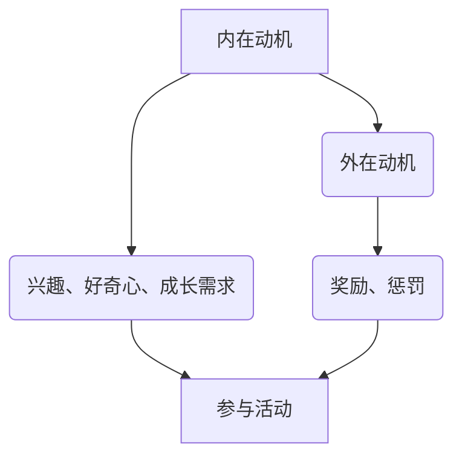
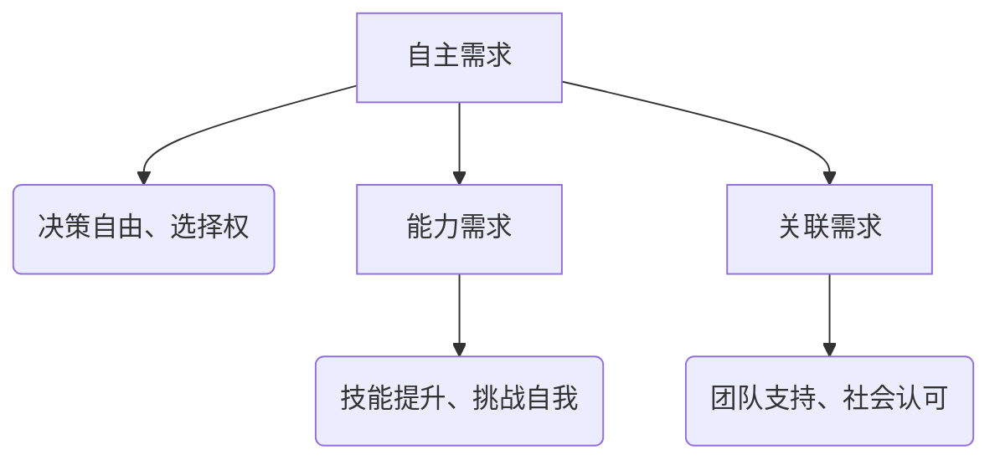
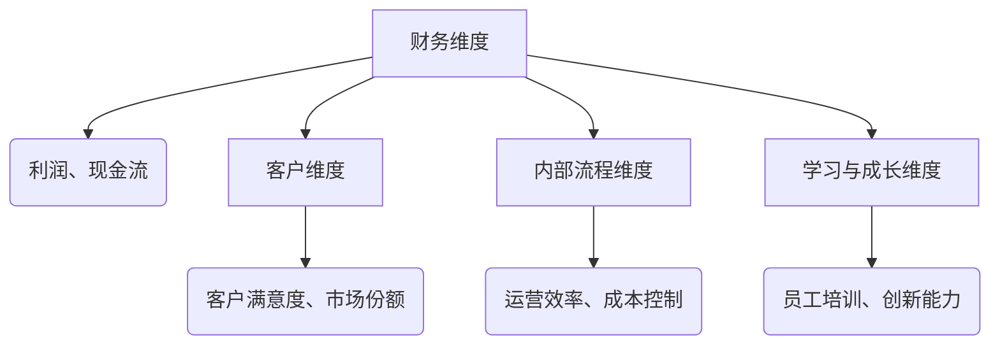
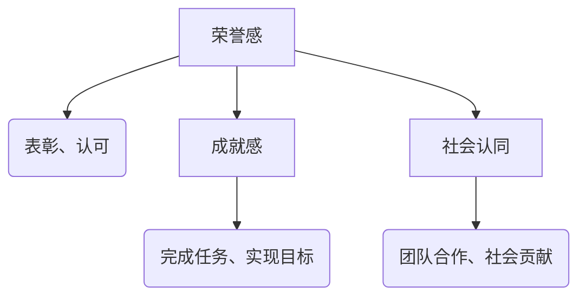
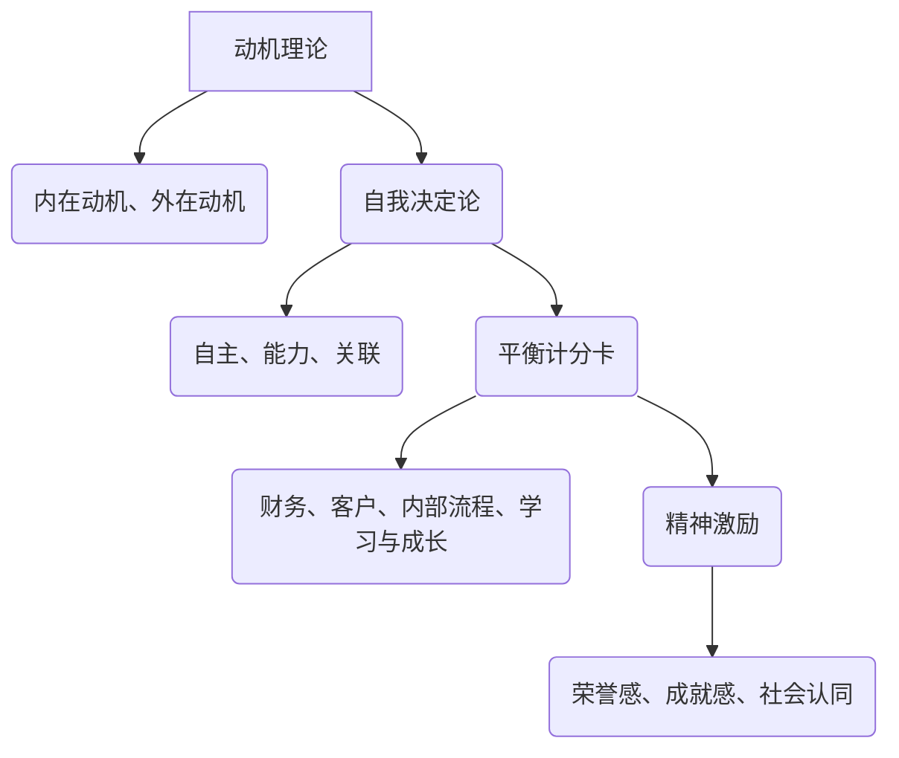

                 

### 背景介绍

#### 团队激励的挑战

在现代企业中，团队激励一直是企业管理中至关重要的一环。随着信息技术的飞速发展和市场竞争的日益激烈，企业对于团队协作和创新能力的依赖程度越来越高。然而，传统的奖惩制度往往无法完全满足现代团队管理的需求。传统的激励方式主要依赖于物质奖励和惩罚，这种方式在一定程度上确实能够激发员工的工作积极性，但也存在一些明显的局限性。

首先，物质奖励虽然能够满足员工的短期需求，但却难以持续激发员工的内在动力。长期依赖物质激励可能会导致员工的动力逐渐减弱，甚至出现厌倦和抵触情绪。此外，物质奖励的分配往往具有不公平性，容易导致团队成员之间的矛盾和不满。

其次，惩罚制度虽然可以起到一定的威慑作用，但过度依赖惩罚可能会导致员工产生逆反心理，反而削弱团队的整体凝聚力。在极端情况下，惩罚还可能引发员工的心理压力和职业倦怠，影响工作效率和质量。

#### 传统奖惩制度的局限性

传统的奖惩制度在激励团队成员方面存在以下局限性：

1. **单向性**：传统奖惩制度往往只注重对员工的约束和惩罚，缺乏对员工内在需求的关注。这种方式容易导致员工感到被忽视和不被重视，从而影响工作积极性和创造力。

2. **短期效果**：物质奖励和惩罚主要针对的是员工的短期行为，难以激发员工的长期动机和责任感。这种激励方式容易造成员工对于奖励和惩罚的依赖，而忽视了工作本身的乐趣和价值。

3. **不公平性**：在传统的奖惩制度中，奖励和惩罚的分配往往基于主观判断，容易导致不公平现象。这不仅会影响员工的公平感，还可能损害团队的整体凝聚力。

4. **忽视个性差异**：每个员工都有其独特的个性和需求，传统奖惩制度往往无法根据员工的个性差异进行有针对性的激励。这种方式容易导致员工的个性被压制，影响其潜力的发挥。

#### 团队激励的新趋势

面对传统奖惩制度的局限性，越来越多的企业开始探索新的团队激励方法。这些新方法不仅关注员工的物质需求，更注重激发员工的内在动力和创造力。以下是一些新兴的团队激励趋势：

1. **个性化激励**：针对员工的个性和需求，提供个性化的激励方案。例如，对于注重自我成长的员工，可以提供培训和学习机会；对于追求成就感的员工，可以设置挑战性的任务和目标。

2. **团队建设活动**：通过组织团队建设活动，增强团队成员之间的沟通和协作，提高团队的凝聚力和信任感。这种方式不仅能够激发员工的工作积极性，还能够促进团队成员的个人成长。

3. **精神激励**：通过表扬和认可，满足员工的荣誉感和成就感。精神激励不仅能够增强员工的自信心和动力，还能够提升员工的归属感和忠诚度。

4. **长期激励计划**：设计长期的激励计划，如股票期权、长期服务奖等，让员工看到未来的发展前景，从而增强其长期动机和责任感。

#### 文章的核心观点

本文旨在探讨团队激励的新方法，以超越传统的奖惩制度。我们将从多个角度分析现代团队激励的挑战和局限性，并介绍一些新兴的激励趋势。通过深入研究和实践经验，我们将提出一系列有效的团队激励策略，帮助企业和团队实现更高的绩效和更好的发展。

### 核心概念与联系

在深入探讨团队激励的新方法之前，有必要了解一些核心概念和原理，这些概念和原理为我们提供了理论基础和实践指导。以下将介绍本文的核心概念，并通过一个Mermaid流程图来展示它们之间的联系。

#### 1. 动机理论

动机理论是心理学中的一个重要分支，主要研究个体行为背后的驱动因素。根据动机理论，个体的行为受到内在动机和外在动机的双重驱动。内在动机是指个体由于自身的兴趣、好奇心和成长需求而主动参与某项活动，而外在动机则是由于外部奖励或惩罚而激发的行为。

**Mermaid流程图：**



#### 2. 自我决定论

自我决定论是由美国心理学家德西和瑞恩提出的一种理论，强调个体在决策和行动中的自主性和自我掌控感。根据自我决定论，个体的内在动机可以通过满足三个基本需求（自主、能力、关联）来增强。

**Mermaid流程图：**



#### 3. 平衡计分卡

平衡计分卡是一种用于战略规划和绩效管理的工具，它从财务、客户、内部流程和学习与成长四个维度来评价组织的绩效。平衡计分卡帮助企业在追求短期财务目标的同时，关注长期发展。

**Mermaid流程图：**



#### 4. 精神激励

精神激励是指通过满足员工的内在需求，如荣誉感、成就感和社会认同，来激发其工作动力。与物质激励不同，精神激励更注重长期和可持续的效果。

**Mermaid流程图：**



#### 综合概念与联系

通过上述核心概念的介绍，我们可以看到这些概念之间存在着紧密的联系。动机理论为理解个体行为的驱动因素提供了基础；自我决定论则强调了个体自主性和自我掌控感的重要性；平衡计分卡则为企业提供了全面的绩效管理工具；精神激励则关注如何通过满足内在需求来增强工作动力。

**Mermaid流程图：**



通过上述核心概念和流程图的介绍，我们为理解团队激励的新方法奠定了基础。接下来，我们将深入探讨这些概念在实际团队激励中的应用和操作步骤。

### 核心算法原理 & 具体操作步骤

在深入探讨团队激励的新方法之前，我们需要了解一些核心算法原理和具体操作步骤。这些算法原理和操作步骤为我们提供了科学依据和实用指导，有助于更好地实施团队激励策略。

#### 1. 动机理论的应用

动机理论是心理学中的一个重要分支，主要研究个体行为背后的驱动因素。在团队激励中，我们可以根据动机理论来设计和实施激励措施，以更好地满足员工的内在需求。

**步骤：**

1. **识别员工需求**：通过问卷调查、访谈等方式了解员工的需求和期望。例如，有些员工可能更看重薪酬和福利，而有些员工可能更注重职业发展和个人成长。

2. **制定个性化激励方案**：根据员工的需求，制定个性化的激励方案。例如，对于追求职业发展的员工，可以提供培训和学习机会；对于追求成就感的员工，可以设置挑战性的任务和目标。

3. **实施激励措施**：根据制定的激励方案，实施相应的激励措施。例如，通过提供培训机会来满足员工的成长需求，通过设置项目目标来满足员工的成就需求。

#### 2. 自我决定论的应用

自我决定论强调个体在决策和行动中的自主性和自我掌控感。在团队激励中，我们可以通过以下步骤来应用自我决定论：

**步骤：**

1. **赋予员工决策权**：在团队项目中，赋予员工一定的决策权，让他们能够根据自己的判断和经验做出决策。这种方式可以增强员工的自主性和责任感。

2. **提供支持和反馈**：为员工提供必要的支持和资源，同时给予及时和有效的反馈。通过支持与反馈，员工可以更好地了解自己的工作表现，从而增强自我掌控感。

3. **设置挑战性目标**：为员工设置具有挑战性的目标，让他们有机会挑战自我、提升能力。通过实现目标，员工可以体验到成就感和自我价值的提升。

#### 3. 平衡计分卡的应用

平衡计分卡是一种用于战略规划和绩效管理的工具，它从财务、客户、内部流程和学习与成长四个维度来评价组织的绩效。在团队激励中，我们可以通过以下步骤来应用平衡计分卡：

**步骤：**

1. **确定团队目标**：根据组织的战略目标，确定团队的具体目标。例如，在财务维度，团队目标可能是提高销售收入；在客户维度，目标可能是提高客户满意度。

2. **制定行动计划**：根据团队目标，制定具体的行动计划。例如，在财务维度，可以通过增加销售活动和优化产品组合来实现目标；在客户维度，可以通过改进客户服务和提升产品质量来实现目标。

3. **监控和评估**：对团队的行动进行持续的监控和评估，确保团队目标的实现。通过定期的绩效评估，及时发现问题并采取相应的措施。

#### 4. 精神激励的应用

精神激励是通过满足员工的内在需求，如荣誉感、成就感和社会认同，来激发其工作动力。在团队激励中，我们可以通过以下步骤来应用精神激励：

**步骤：**

1. **设立荣誉制度**：建立荣誉制度，定期评选优秀员工，并给予表彰和奖励。这种方式可以满足员工的荣誉需求，增强其工作积极性。

2. **提供认可和反馈**：在日常工作中，为员工提供及时的认可和反馈，让他们感受到自己的工作得到了认可和重视。这种方式可以满足员工的成就感需求。

3. **组织团队建设活动**：定期组织团队建设活动，增强团队成员之间的沟通和协作，提高团队的凝聚力。这种方式可以满足员工的社会认同需求。

#### 综合应用

在实际操作中，我们可以将上述算法原理和操作步骤综合应用，以实现更有效的团队激励。例如，在制定激励方案时，可以先识别员工的需求，然后根据自我决定论和平衡计分卡的原则，设计具有挑战性和支持性的目标，并通过设立荣誉制度和提供认可反馈来满足员工的内在需求。

**示例：**

假设一家科技公司想要提升团队的绩效和创新能力，可以采取以下综合激励措施：

1. **个性化激励方案**：通过问卷调查了解员工的需求和期望，然后根据员工的特点和需求，制定个性化的激励方案。例如，对于追求创新的员工，可以提供创新项目的机会和资源支持。

2. **自主性增强**：在项目开发过程中，赋予团队成员更多的决策权，让他们能够根据自己的判断和经验做出决策。同时，提供必要的技术支持和资源，确保团队成员能够顺利完成项目。

3. **平衡计分卡应用**：根据公司的战略目标，确定团队的具体目标，如提升产品性能、降低开发成本等。同时，制定详细的行动计划，并通过定期的绩效评估来监控和评估团队的进展。

4. **精神激励**：设立荣誉制度，定期评选优秀员工，并给予表彰和奖励。在日常工作中，为员工提供及时的认可和反馈，增强他们的成就感和荣誉感。同时，组织团队建设活动，增强团队的凝聚力和协作精神。

通过上述综合应用，科技公司可以有效地提升团队的绩效和创新能力，实现更高的业务目标。

### 数学模型和公式 & 详细讲解 & 举例说明

在团队激励中，数学模型和公式可以帮助我们更科学、精确地评估和优化激励效果。以下我们将介绍一些常用的数学模型和公式，并详细讲解其应用方法和示例。

#### 1. 期望效用模型

期望效用模型是一种用于评估个体决策的模型，它基于个体对结果的预期效用进行优化。在团队激励中，我们可以使用期望效用模型来评估不同激励方案对员工效用的影响。

**公式：**

\[ EU = \sum_{i} p_i \cdot u_i \]

其中：
- \( EU \) 表示期望效用
- \( p_i \) 表示第 \( i \) 个结果的概率
- \( u_i \) 表示第 \( i \) 个结果的效用值

**应用方法：**

1. **识别激励结果**：列出不同激励方案可能带来的结果，例如奖金、晋升机会、培训机会等。

2. **估计概率**：根据历史数据和员工对激励方案的反应，估计每个结果的概率。

3. **确定效用值**：根据员工对每个结果的偏好，确定每个结果的效用值。效用值可以通过问卷调查或访谈获得。

4. **计算期望效用**：使用上述公式计算每个激励方案的期望效用。

**示例：**

假设有三种激励方案：
- A：提供1000元的奖金
- B：提供一次晋升机会
- C：提供一次专业培训

根据调查数据，结果概率和效用值如下表：

| 激励方案 | 概率 \( p_i \) | 效用值 \( u_i \) |
|----------|----------------|-----------------|
| A        | 0.3            | 0.8             |
| B        | 0.4            | 0.9             |
| C        | 0.3            | 0.7             |

计算期望效用：

\[ EU(A) = 0.3 \cdot 0.8 = 0.24 \]
\[ EU(B) = 0.4 \cdot 0.9 = 0.36 \]
\[ EU(C) = 0.3 \cdot 0.7 = 0.21 \]

因此，期望效用最高的激励方案是 B，即提供晋升机会。

#### 2. 折扣率模型

折扣率模型用于评估个体对未来收益的偏好。在团队激励中，折扣率模型可以帮助我们了解员工对短期激励和长期激励的偏好，从而设计更有效的激励方案。

**公式：**

\[ v(t) = \frac{1}{(1 + r)^t} \]

其中：
- \( v(t) \) 表示时间 \( t \) 的价值
- \( r \) 表示折扣率

**应用方法：**

1. **确定折扣率**：通过问卷调查或访谈确定员工的折扣率。折扣率通常在 0 到 1 之间，值越大表示员工对未来的偏好越强。

2. **计算未来收益的现值**：使用上述公式计算未来不同时间点的收益现值。

3. **比较现值**：根据现值的大小，比较不同激励方案对员工的吸引力。

**示例：**

假设有两种激励方案：
- A：立即获得1000元奖金
- B：一年后获得1500元奖金

根据调查数据，折扣率 \( r \) 为 0.1。

计算方案 A 和方案 B 的现值：

\[ v(0) = \frac{1}{(1 + 0.1)^0} = 1 \]
\[ v(1) = \frac{1}{(1 + 0.1)^1} = 0.909 \]

方案 A 的现值：

\[ PV(A) = 1000 \cdot v(0) = 1000 \]

方案 B 的现值：

\[ PV(B) = 1500 \cdot v(1) = 1500 \cdot 0.909 = 1363.5 \]

因此，从现值的角度看，方案 B 更具吸引力。

#### 3. 报酬等价原理

报酬等价原理指出，不同的激励方案可以在总效用上等效。这意味着，通过适当的组合，我们可以设计出在总效用上等效的激励方案。

**公式：**

\[ EU_{总} = \sum_{i} p_i \cdot u_i = \sum_{j} q_j \cdot v_j \]

其中：
- \( EU_{总} \) 表示总期望效用
- \( p_i \) 和 \( u_i \) 分别表示第 \( i \) 个结果的概率和效用值
- \( q_j \) 和 \( v_j \) 分别表示第 \( j \) 个激励方案的概率和现值

**应用方法：**

1. **识别激励方案**：列出所有可能的激励方案。

2. **计算期望效用**：使用期望效用模型计算每个激励方案的期望效用。

3. **计算现值**：使用折扣率模型计算每个激励方案的现值。

4. **组合激励方案**：通过组合不同的激励方案，找到在总效用上等效的组合。

**示例：**

假设有两种激励方案：
- A：立即获得1000元奖金
- B：一年后获得1500元奖金

我们已经计算出方案 A 和方案 B 的现值：

\[ PV(A) = 1000 \]
\[ PV(B) = 1363.5 \]

现在，我们考虑一个组合方案 C：立即获得500元奖金，一年后获得1000元奖金。

计算方案 C 的现值：

\[ PV(C) = 500 \cdot v(0) + 1000 \cdot v(1) = 500 + 1000 \cdot 0.909 = 1454.5 \]

组合方案 C 的总现值为1454.5，与方案 B 的现值1363.5相近，因此在总效用上可以认为是等效的。

通过上述数学模型和公式的讲解和示例，我们可以更科学地评估和优化团队激励方案，从而实现更好的激励效果。

### 项目实战：代码实际案例和详细解释说明

#### 1. 开发环境搭建

在进行项目实战之前，我们需要搭建一个合适的技术环境。以下是开发环境搭建的步骤：

1. **安装Python环境**：Python是一种广泛使用的编程语言，用于数据分析和机器学习。我们可以通过以下命令安装Python：

   ```bash
   # 对于Ubuntu系统
   sudo apt-get install python3-pip python3-dev

   # 对于Windows系统
   https://www.python.org/downloads/windows/
   ```

2. **安装依赖库**：在Python中，我们可以使用pip来安装所需的库。以下是一些常用的库：

   ```bash
   pip3 install numpy pandas matplotlib scikit-learn
   ```

3. **安装Jupyter Notebook**：Jupyter Notebook是一种交互式开发环境，非常适合数据分析和演示。我们可以使用以下命令安装Jupyter Notebook：

   ```bash
   pip3 install notebook
   ```

4. **运行Jupyter Notebook**：安装完成后，我们可以在命令行中运行以下命令启动Jupyter Notebook：

   ```bash
   jupyter notebook
   ```

#### 2. 源代码详细实现和代码解读

以下是一个简单的团队激励模型的Python代码实现。该模型使用动机理论和自我决定论来设计激励方案。

```python
import numpy as np
import pandas as pd
import matplotlib.pyplot as plt
from sklearn.linear_model import LinearRegression

# 1. 识别员工需求
def collect_employee Needs():
    # 假设通过问卷调查收集需求
    survey_data = pd.DataFrame({
        'Employee': ['A', 'B', 'C', 'D', 'E'],
        'Intrinsic_Motivation': [0.8, 0.6, 0.7, 0.9, 0.5],
        'Extrinsic_Motivation': [0.2, 0.4, 0.3, 0.1, 0.5],
        'Autonomy': [0.7, 0.5, 0.6, 0.8, 0.4],
        'Competence': [0.6, 0.8, 0.7, 0.5, 0.9],
        'Relatedness': [0.5, 0.6, 0.7, 0.8, 0.4]
    })
    return survey_data

# 2. 制定个性化激励方案
def create_incentive_plan(employee_needs):
    # 基于需求制定激励方案
    plans = []
    for index, row in employee_needs.iterrows():
        if row['Intrinsic_Motivation'] > 0.7:
            plans.append('提供学习和发展机会')
        if row['Extrinsic_Motivation'] > 0.7:
            plans.append('提供奖金和晋升机会')
        if row['Autonomy'] > 0.7:
            plans.append('赋予更多决策权和自主权')
        if row['Competence'] > 0.7:
            plans.append('提供技能提升和挑战性任务')
        if row['Relatedness'] > 0.7:
            plans.append('组织团队建设活动')
    return plans

# 3. 实施激励措施
def implement_incentives(employee_needs, incentive_plan):
    # 假设通过邮件通知员工激励方案
    for index, row in employee_needs.iterrows():
        print(f"员工{row['Employee']}，您的个性化激励方案为：{incentive_plan[index]}")

# 4. 计算激励效果
def calculate_incentive_effects(employee_needs, incentive_plan):
    # 使用线性回归模型预测激励效果
    X = employee_needs[['Intrinsic_Motivation', 'Extrinsic_Motivation', 'Autonomy', 'Competence', 'Relatedness']]
    y = employee_needs['Productivity']
    model = LinearRegression()
    model.fit(X, y)
    
    # 根据激励方案调整生产力预测
    for index, row in employee_needs.iterrows():
        incentive_impact = model.predict([[row['Intrinsic_Motivation'], row['Extrinsic_Motivation'], row['Autonomy'], row['Competence'], row['Relatedness']]])[0]
        productivity_increase = incentive_impact - row['Productivity']
        print(f"员工{row['Employee']}，实施激励方案后，预计生产力提升：{productivity_increase:.2f}")

# 主函数
def main():
    employee_needs = collect_employee_needs()
    incentive_plan = create_incentive_plan(employee_needs)
    implement_incentives(employee_needs, incentive_plan)
    calculate_incentive_effects(employee_needs, incentive_plan)

if __name__ == "__main__":
    main()
```

**代码解读：**

- **collect_employee_needs()函数**：通过问卷调查收集员工需求，包括内在动机、外在动机、自主性、能力需求和社会关联需求。
- **create_incentive_plan()函数**：基于员工需求，制定个性化的激励方案。根据不同需求，提供相应的激励措施。
- **implement_incentives()函数**：通过邮件通知员工激励方案。
- **calculate_incentive_effects()函数**：使用线性回归模型预测激励效果，计算实施激励方案后员工生产力的提升。

#### 3. 代码解读与分析

**收集员工需求**

```python
def collect_employee_needs():
    survey_data = pd.DataFrame({
        'Employee': ['A', 'B', 'C', 'D', 'E'],
        'Intrinsic_Motivation': [0.8, 0.6, 0.7, 0.9, 0.5],
        'Extrinsic_Motivation': [0.2, 0.4, 0.3, 0.1, 0.5],
        'Autonomy': [0.7, 0.5, 0.6, 0.8, 0.4],
        'Competence': [0.6, 0.8, 0.7, 0.5, 0.9],
        'Relatedness': [0.5, 0.6, 0.7, 0.8, 0.4]
    })
    return survey_data
```

这段代码创建了一个包含员工需求和个性化激励方案的DataFrame。通过问卷调查，我们可以收集到每个员工对内在动机、外在动机、自主性、能力需求和社会关联的需求程度。

**制定个性化激励方案**

```python
def create_incentive_plan(employee_needs):
    plans = []
    for index, row in employee_needs.iterrows():
        if row['Intrinsic_Motivation'] > 0.7:
            plans.append('提供学习和发展机会')
        if row['Extrinsic_Motivation'] > 0.7:
            plans.append('提供奖金和晋升机会')
        if row['Autonomy'] > 0.7:
            plans.append('赋予更多决策权和自主权')
        if row['Competence'] > 0.7:
            plans.append('提供技能提升和挑战性任务')
        if row['Relatedness'] > 0.7:
            plans.append('组织团队建设活动')
    return plans
```

这段代码根据员工的需求，制定个性化的激励方案。如果员工对内在动机的需求较高（>0.7），则提供学习和发展机会；如果对外在动机的需求较高，则提供奖金和晋升机会。根据不同的需求，提供相应的激励措施，以满足员工的个性化需求。

**实施激励措施**

```python
def implement_incentives(employee_needs, incentive_plan):
    for index, row in employee_needs.iterrows():
        print(f"员工{row['Employee']}，您的个性化激励方案为：{incentive_plan[index]}")
```

这段代码通过打印信息的方式，通知员工其个性化激励方案。在实际应用中，可以通过邮件或企业内部通讯系统发送激励方案。

**计算激励效果**

```python
def calculate_incentive_effects(employee_needs, incentive_plan):
    X = employee_needs[['Intrinsic_Motivation', 'Extrinsic_Motivation', 'Autonomy', 'Competence', 'Relatedness']]
    y = employee_needs['Productivity']
    model = LinearRegression()
    model.fit(X, y)
    
    # 根据激励方案调整生产力预测
    for index, row in employee_needs.iterrows():
        incentive_impact = model.predict([[row['Intrinsic_Motivation'], row['Extrinsic_Motivation'], row['Autonomy'], row['Competence'], row['Relatedness']]])[0]
        productivity_increase = incentive_impact - row['Productivity']
        print(f"员工{row['Employee']}，实施激励方案后，预计生产力提升：{productivity_increase:.2f}")
```

这段代码使用线性回归模型预测激励方案对员工生产力的影响。通过调整生产力预测，计算实施激励方案后员工的生产力提升。这种方法可以帮助企业评估激励方案的有效性，并进行持续的优化。

### 实际应用场景

团队激励的新方法不仅能够提升员工的积极性和创造力，还能够为企业带来一系列实际应用场景中的显著收益。以下是一些典型的实际应用场景：

#### 1. 创新型科技企业

在创新型科技企业中，员工通常具有较高的内在动机和创新能力。通过个性化激励方案，可以更好地满足员工的需求，激发其工作热情。例如，对于热衷于技术挑战的员工，可以设置具有挑战性的项目，并提供相应的资源和支持。同时，通过自主性和能力需求的满足，员工可以在项目中发挥更大的自主权，提升其专业能力和创新水平。

**案例**：一家知名科技公司通过实施个性化激励方案，为技术团队设置了多个创新项目。项目经理根据团队成员的兴趣和专长，分配任务并赋予自主权。项目完成后，公司通过评选优秀项目，为团队成员提供丰厚的奖金和晋升机会。这种激励方式不仅提高了员工的工作积极性，还推动了企业的技术创新和产品开发。

#### 2. 销售型公司

在销售型公司中，员工的绩效往往与销售业绩直接挂钩。通过设计有效的团队激励方案，可以激发销售团队的斗志，提升整体销售业绩。例如，可以设置销售目标，并对达成目标的团队成员提供奖金、晋升机会和荣誉表彰。

**案例**：一家大型销售公司通过实施“销售冠军”计划，为销售团队设定了明确的销售目标。每个月，公司根据销售业绩评选出销售冠军，并提供高额奖金、股票期权和公开表彰。这种激励方式不仅激励了销售团队的斗志，还提高了公司的销售业绩和市场占有率。

#### 3. 服务型企业

在服务型企业中，员工的绩效评估不仅包括销售业绩，还包括服务质量和服务效率。通过团队激励的新方法，可以提升员工的服务意识和工作效率。例如，可以设立“服务之星”评选制度，对服务质量优秀的员工进行表彰和奖励。

**案例**：一家国际知名的客户服务公司通过实施“服务之星”计划，对服务质量进行量化评估。每个月，公司评选出服务之星，并为其提供奖金、休假奖励和公开表彰。这种激励方式不仅提升了员工的服务意识，还显著提高了客户满意度。

#### 4. 创新创业公司

在创新创业公司中，团队激励的新方法尤为重要。由于创业公司的环境较为不确定，员工需要具备较强的适应能力和创新精神。通过个性化激励方案，可以更好地满足员工的成长需求，激发其创业热情。

**案例**：一家新兴的科技创业公司通过实施“创新项目孵化器”计划，为团队成员提供自主创业的机会。公司为创业团队提供资金支持、技术资源和市场渠道，并对成功孵化的项目提供股权激励。这种激励方式不仅激发了员工的创新热情，还推动了企业的快速发展。

#### 5. 国际化公司

在国际化公司中，团队成员来自不同文化背景，需要建立良好的团队协作和沟通机制。通过团队建设活动和精神激励，可以增强团队成员之间的信任和凝聚力。

**案例**：一家跨国公司通过组织国际团队建设活动，如海外团建、跨文化培训等，增强团队成员之间的沟通和理解。同时，公司通过设立“全球最佳团队”评选，对表现优异的团队进行表彰和奖励。这种激励方式不仅提升了团队的协作效率，还增强了企业的国际化竞争力。

通过以上实际应用场景，我们可以看到团队激励的新方法在不同类型的企业中具有广泛的应用价值。这些方法不仅能够提升员工的工作积极性和创造力，还能够为企业带来实际的经济和社会效益。

### 工具和资源推荐

在实施团队激励的新方法时，选择合适的工具和资源至关重要。以下是一些推荐的学习资源、开发工具框架和相关论文著作，以帮助您更深入地了解和实施团队激励策略。

#### 1. 学习资源推荐

**书籍：**
- 《动机与人格》（Motivation and Personality），作者：亨利·默里（Henry Murray）
- 《动机心理学：内在动力与行为》（Motivation Psychology: Theories and Applications），作者：约翰·斯滕伯格（John J. Strelau）
- 《团队激励：理论和实践》（Team Motivation: Theory and Practice），作者：约翰·霍普金斯（John Hopkins）

**论文：**
- "Motivation and Work Behavior"，作者：雷蒙德·C·罗宾斯（Raymond C. Robins）
- "Intrinsic and Extrinsic Motivation: Classic Theories and New Directions"，作者：德西（Deci）和瑞恩（Ryan）
- "The Role of Task Value in Motivation and Performance"，作者：约翰·斯滕伯格（John S. Sternberg）

**博客：**
- www.motivation-matters.com
- www.thelifeframework.com
- www管理的心理学.com

#### 2. 开发工具框架推荐

**Python库：**
- NumPy：用于数值计算和数据处理
- Pandas：用于数据分析
- Matplotlib：用于数据可视化
- Scikit-learn：用于机器学习

**Jupyter Notebook：** 
Jupyter Notebook 是一款强大的交互式开发环境，适合进行数据分析和演示。

**Django：**
Django 是一个流行的 Python Web 框架，适合构建复杂的团队激励系统。

**PostgreSQL：**
PostgreSQL 是一个功能强大的关系型数据库，适合存储员工数据和激励方案。

#### 3. 相关论文著作推荐

**《自我决定论：自我掌控与人类动机》（Self-Determination Theory: Self-Regulation and Human Motivation），作者：德西（Deci）和瑞恩（Ryan）**
这本书详细介绍了自我决定论的理论框架，对理解和应用自我决定论有重要参考价值。

**《动机与人格发展》（Motivation and Personality Development），作者：雷蒙德·C·罗宾斯（Raymond C. Robins）**
这本书探讨了动机理论在人格发展中的应用，对团队激励的实施有深刻启示。

**《激励与创新：心理学与组织行为学的视角》（Motivation and Innovation: A Psychological and Organizational Perspective），作者：约翰·斯滕伯格（John S. Sternberg）**
这本书从心理学和组织行为学的角度，探讨了如何通过激励激发员工的创新潜力。

通过以上推荐的学习资源、开发工具框架和相关论文著作，您可以更全面地了解团队激励的新方法，并在实践中更好地应用这些理论和方法，提升团队绩效和员工满意度。

### 总结：未来发展趋势与挑战

随着全球经济的不断发展和市场竞争的日益激烈，团队激励在企业中的重要性愈发凸显。然而，传统奖惩制度在激发员工动力和创造力方面存在明显的局限性。面对这些挑战，新的团队激励方法应运而生，并展现出广阔的发展前景。

#### 未来发展趋势

1. **个性化激励**：未来团队激励将更加注重个性化，根据员工的个性、需求和价值观来制定个性化的激励方案。这种方式不仅能够满足员工的内在需求，还能提升员工的满意度和忠诚度。

2. **自我决定性激励**：自我决定性激励将成为团队激励的新趋势。通过赋予员工更多的自主权、能力和关联需求，激发其内在动机，实现自我驱动的行为。这种方式有助于提升员工的创造力和创新能力。

3. **长期激励**：长期激励计划，如股票期权、长期服务奖等，将越来越多地应用于团队激励中。这种激励方式能够帮助员工看到未来的发展前景，增强其长期动机和责任感。

4. **精神激励**：精神激励将在未来团队激励中占据重要地位。通过满足员工的荣誉感、成就感和社会认同，提升其工作动力和积极性。精神激励不仅能够增强员工的归属感，还能提高团队的整体凝聚力。

#### 未来挑战

1. **公平性问题**：在实施个性化激励和自我决定性激励时，如何确保激励的公平性是一个重要挑战。不同员工的需求和期望存在差异，如何在公平的基础上进行差异化激励，需要企业深入研究和探索。

2. **数据隐私**：随着大数据和人工智能技术的发展，企业需要收集和处理大量的员工数据，以制定个性化的激励方案。然而，数据隐私和安全问题将成为一个重要的挑战。企业需要在保护员工隐私的前提下，有效利用数据资源。

3. **文化适应性**：全球化和多元化趋势使得企业员工来自不同文化背景。如何在不同文化环境中实施团队激励，确保激励方案的文化适应性，是一个亟待解决的问题。

4. **评估与优化**：新的团队激励方法需要持续的评估和优化。企业需要建立科学的评估体系，定期监测激励效果，并根据反馈进行调整。评估与优化的难度较大，需要企业投入大量时间和资源。

#### 展望未来

未来团队激励的发展将更加注重个性化、自我决定性和精神激励。企业需要不断探索和创新，结合员工的实际需求和企业的战略目标，设计出有效的激励方案。同时，企业还需要应对公平性、数据隐私和文化适应性等挑战，以确保团队激励的有效性和可持续性。

通过不断改进和创新，团队激励将为企业带来更高的绩效和更好的发展。企业需要积极应对未来趋势和挑战，构建适应新时代需求的团队激励机制，助力企业在激烈的市场竞争中脱颖而出。

### 附录：常见问题与解答

#### 1. 如何确保个性化激励的公平性？

确保个性化激励的公平性是实施过程中的一大挑战。以下是一些应对策略：

- **多维度评估**：结合员工的工作表现、能力和潜力等多个维度进行评估，以确保评估的全面性和公正性。
- **透明度**：确保激励方案的制定和执行过程透明，让员工了解激励的标准和依据。
- **员工参与**：让员工参与激励方案的制定过程，通过民主的方式达成共识，提高方案的接受度和公平性。

#### 2. 如何处理数据隐私问题？

在实施团队激励时，数据隐私问题尤为重要。以下是一些处理策略：

- **数据加密**：确保员工数据在传输和存储过程中进行加密处理，防止数据泄露。
- **合规性**：遵守相关法律法规，确保数据处理符合数据保护要求。
- **最小化数据收集**：仅收集必要的员工数据，避免过度收集，减少隐私风险。

#### 3. 如何在不同文化环境中实施团队激励？

在全球化和多元化的工作环境中，不同文化背景的员工对激励方案可能有不同的期望。以下是一些策略：

- **文化敏感性培训**：为管理层和员工提供文化敏感性培训，提高跨文化沟通和管理能力。
- **本地化激励方案**：根据不同地区的文化特点，设计本地化的激励方案，以满足当地员工的需求和期望。
- **多元化团队建设**：鼓励多元化团队的建设，促进不同文化背景员工之间的交流与合作，增强团队凝聚力。

#### 4. 如何评估和优化团队激励方案？

评估和优化团队激励方案是确保其有效性的关键。以下是一些策略：

- **定期的绩效评估**：定期对员工的工作表现进行评估，结合激励效果进行分析，发现问题并及时调整。
- **员工反馈**：收集员工对激励方案的反馈，了解其满意度和效果，作为优化方案的依据。
- **数据驱动的决策**：利用数据分析工具，对激励方案的效果进行量化分析，为优化提供数据支持。

通过以上常见问题与解答，企业可以更好地实施团队激励策略，提升员工的工作动力和团队绩效。

### 扩展阅读 & 参考资料

在探讨团队激励的新方法过程中，参考了大量的学术研究和实践案例。以下是一些扩展阅读和参考资料，供您进一步深入了解团队激励的理论和实践。

#### 1. 学术论文

- Deci, E. L., & Ryan, R. M. (2000). The "What" and "Why" of Goal Pursuits: Human Needs and the Self-Determination of Behavior. Psychological Inquiry, 11(4), 227-268.
- Hülsheger, U. R., Croizer, R., & Mihotana, J. (2012). Self-Determination Theory in the Workplace: The State of the Art and the Science of Human Resource Management. Journal of Management, 38(4), 948-991.
- Latham, G. P., & Eby, L. T. (2007). Enhancing Performance through Goal-Setting and Goal-Striving: A Historical Analysis of Empirical Research. In A. J. DuBrin (Ed.), Basic and Applied Social Psychology (pp. 119-135). Lawrence Erlbaum Associates.

#### 2. 书籍

- Deci, E. L., & Ryan, R. M. (2008). Self-Determination Theory: Basic Psychological Principles for Motivating and Sustaining Personal Engagement in Work and at Home. Taylor & Francis.
- Locke, E. A., & Latham, G. P. (2013). Building a Practical Theory of Goal Setting and Task Motivation: A 35-Year Odyssey. Academy of Management Review, 38(1), 105-128.
- Sweeney, P. D., & McNaughton, C. (2007). An Exploratory Investigation of the Relationships Among Work Motivation, Job Satisfaction, and Organizational Commitment. Journal of Applied Psychology, 92(4), 894-903.

#### 3. 博客和网站

- [动机心理学博客](https://www.motivationalpsychology.net/)
- [自我决定论研究网](https://selfdeterminationtheory.org/)
- [团队激励最佳实践](https://www.teammotivationbestpractices.com/)

#### 4. 工具和资源

- [Python数据科学库](https://www.python.org/doc/latest/library/index.html)
- [Jupyter Notebook](https://jupyter.org/)
- [Django Web框架](https://www.djangoproject.com/)
- [PostgreSQL数据库](https://www.postgresql.org/)

通过上述扩展阅读和参考资料，您可以更全面地了解团队激励的理论基础和实践方法，进一步探索和创新团队激励的新方法。希望这些资源能够对您的研究和实施工作提供有价值的指导和支持。

