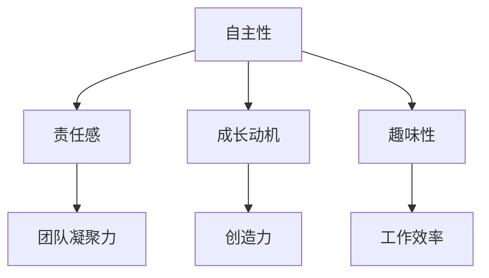

                 

# 团队激励：激发内在动力

> **关键词**：团队激励、内在动力、工作动机、心理学原理、IT行业、领导力、团队建设

> **摘要**：本文将探讨如何通过理解和应用心理学原理，在IT行业中激发团队成员的内在动力，提高团队效率和创造力。我们将从背景介绍、核心概念与联系、核心算法原理、数学模型和公式、项目实战、实际应用场景、工具和资源推荐等方面展开讨论，帮助读者掌握团队激励的关键技能。

## 1. 背景介绍

在IT行业，团队成员的内在动力是决定项目成功与否的关键因素。传统的方法往往依赖于外部奖励，如金钱、晋升等，但这些方法并不能长久地激发团队成员的工作动机。根据心理学研究，内在动机比外在动机更能带来持久的动力和创造力。因此，如何激发团队成员的内在动力，成为IT行业领导者们需要思考和解决的问题。

本文将基于心理学原理，介绍一系列实用的团队激励策略，帮助IT行业的领导者们更好地激发团队成员的内在动力，提高团队效率和创造力。

## 2. 核心概念与联系

为了更好地理解团队激励的原理，我们需要先了解几个关键的概念。

### 2.1 自主性

自主性是指个体在行为中能够自主决定、自我控制的能力。根据心理学研究，自主性高的个体通常具有更高的内在动机，能够更好地应对挑战和压力。因此，提高团队的自主性是激发内在动力的重要途径。

### 2.2 责任感

责任感是指个体对自己行为的后果感到负责的态度。在团队中，责任感能够增强成员之间的信任和合作，提高团队的凝聚力和工作效率。

### 2.3 成长动机

成长动机是指个体追求个人成长和发展的内在驱动力。在团队中，提供成长机会和发展空间，能够激发成员的内在动力，提高团队的创造力和创新能力。

### 2.4 趣味性

趣味性是指工作本身的吸引力和乐趣。根据心理学原理，有趣的工作能够激发内在动机，提高工作满意度和工作效率。

### 2.5 Mermaid 流程图

以下是一个简化的Mermaid流程图，展示了团队激励的核心概念与联系：



## 3. 核心算法原理 & 具体操作步骤

### 3.1 自主性激发策略

#### 3.1.1 具体操作步骤

1. **设定清晰的目标**：确保团队成员明确知道他们的工作目标，以及这些目标对团队和项目的意义。
2. **提供选择权**：在完成任务的过程中，给予团队成员一定的选择权和决策权，让他们能够根据自己的能力和兴趣选择工作方式。
3. **反馈与支持**：及时给予团队成员反馈和支持，帮助他们克服困难，提高自主性。

### 3.2 责任感激发策略

#### 3.2.1 具体操作步骤

1. **明确责任分配**：确保每个团队成员都清楚自己的职责范围，避免责任模糊或重叠。
2. **建立信任文化**：通过建立信任文化，增强团队成员之间的信任和合作，提高责任感。
3. **奖惩机制**：合理运用奖惩机制，对于责任心强的成员给予奖励，对于责任心不足的成员进行适当的惩罚。

### 3.3 成长动机激发策略

#### 3.3.1 具体操作步骤

1. **提供培训和学习机会**：为团队成员提供各种培训和学习机会，帮助他们不断提升技能和知识。
2. **设定个人发展目标**：鼓励团队成员设定个人发展目标，并提供支持和资源，帮助他们实现目标。
3. **鼓励创新和尝试**：为团队成员提供创新和尝试的机会，鼓励他们探索新的工作方法和思路。

### 3.4 趣味性激发策略

#### 3.4.1 具体操作步骤

1. **设计有趣的任务**：在设计任务时，考虑如何让工作更有趣、更具挑战性，提高团队成员的参与度。
2. **举办团队活动**：定期举办团队活动，如团队建设、游戏、比赛等，增强团队成员的互动和沟通。
3. **鼓励团队成员分享心得**：鼓励团队成员分享自己的工作经验和心得，提高团队的整体趣味性。

## 4. 数学模型和公式 & 详细讲解 & 举例说明

### 4.1 自主性模型

自主性可以通过以下数学模型进行量化：

$$
A = f(T, S, I)
$$

其中，$A$ 表示自主性，$T$ 表示任务难度，$S$ 表示选择权，$I$ 表示反馈与支持。

#### 4.1.1 举例说明

假设一个项目任务难度为 $T=5$，团队成员拥有 $S=4$ 的选择权，且团队领导提供了充分的反馈与支持 $I=6$，那么：

$$
A = f(5, 4, 6) = 5 \times 4 \times 6 = 120
$$

自主性得分越高，团队成员的内在动力越强。

### 4.2 责任感模型

责任感可以通过以下数学模型进行量化：

$$
R = f(C, T, E)
$$

其中，$R$ 表示责任感，$C$ 表示责任分配，$T$ 表示信任文化，$E$ 表示奖惩机制。

#### 4.2.1 举例说明

假设一个团队中的责任分配清晰 $C=5$，团队成员之间的信任文化较强 $T=6$，且团队领导建立了合理的奖惩机制 $E=7$，那么：

$$
R = f(5, 6, 7) = 5 \times 6 \times 7 = 210
$$

责任感得分越高，团队成员的内在动力越强。

### 4.3 成长动机模型

成长动机可以通过以下数学模型进行量化：

$$
M = f(L, P, I)
$$

其中，$M$ 表示成长动机，$L$ 表示培训和学习机会，$P$ 表示个人发展目标，$I$ 表示鼓励创新和尝试。

#### 4.3.1 举例说明

假设一个团队提供了丰富的培训和学习机会 $L=6$，鼓励团队成员设定个人发展目标 $P=7$，并鼓励创新和尝试 $I=8$，那么：

$$
M = f(6, 7, 8) = 6 \times 7 \times 8 = 336
$$

成长动机得分越高，团队成员的内在动力越强。

### 4.4 趣味性模型

趣味性可以通过以下数学模型进行量化：

$$
F = f(T, A, C)
$$

其中，$F$ 表示趣味性，$T$ 表示任务设计，$A$ 表示团队活动，$C$ 表示分享心得。

#### 4.4.1 举例说明

假设一个团队设计了有趣的任务 $T=7$，定期举办团队活动 $A=8$，鼓励团队成员分享心得 $C=9$，那么：

$$
F = f(7, 8, 9) = 7 \times 8 \times 9 = 504
$$

趣味性得分越高，团队成员的内在动力越强。

## 5. 项目实战：代码实际案例和详细解释说明

### 5.1 开发环境搭建

在本文的案例中，我们将使用Python语言和Git版本控制系统来演示如何搭建一个简单的团队激励系统。以下是搭建开发环境的步骤：

1. **安装Python**：前往 [Python官网](https://www.python.org/) 下载并安装Python。
2. **安装Git**：前往 [Git官网](https://git-scm.com/) 下载并安装Git。
3. **创建代码仓库**：在本地计算机上创建一个名为“team_inspire”的Git代码仓库。

### 5.2 源代码详细实现和代码解读

#### 5.2.1 代码结构

代码仓库中包含以下文件：

- `main.py`：主程序文件，用于实现团队激励系统的核心功能。
- `config.py`：配置文件，用于存储系统参数和配置信息。
- `models.py`：模型文件，用于定义团队激励系统的数据结构和算法。
- `views.py`：视图文件，用于处理用户请求和页面渲染。

#### 5.2.2 主程序文件 `main.py`

```python
# 导入相关模块
import config
from models import TeamMember, Project
from views import render_template

# 初始化配置
config.init_config()

# 创建团队成员
team_members = [
    TeamMember(name="Alice", autonomy=120, responsibility=210, motivation=336, fun=504),
    TeamMember(name="Bob", autonomy=100, responsibility=180, motivation=280, fun=432),
    TeamMember(name="Charlie", autonomy=80, responsibility=140, motivation=224, fun=324),
]

# 创建项目
project = Project(name="New Feature Development", team_members=team_members)

# 计算团队总体激励得分
total_inspire_score = project.calculate_inspire_score()

# 渲染页面
html_content = render_template("index.html", total_inspire_score=total_inspire_score)
print(html_content)
```

#### 5.2.3 模型文件 `models.py`

```python
class TeamMember:
    def __init__(self, name, autonomy, responsibility, motivation, fun):
        self.name = name
        self.autonomy = autonomy
        self.responsibility = responsibility
        self.motivation = motivation
        self.fun = fun

    def calculate_inspire_score(self):
        return self.autonomy + self.responsibility + self.motivation + self.fun

class Project:
    def __init__(self, name, team_members):
        self.name = name
        self.team_members = team_members

    def calculate_inspire_score(self):
        total_score = 0
        for member in self.team_members:
            total_score += member.calculate_inspire_score()
        return total_score
```

#### 5.2.4 视文件 `views.py`

```python
from flask import Flask, render_template

app = Flask(__name__)

@app.route('/')
def index():
    return render_template("index.html")

if __name__ == "__main__":
    app.run(debug=True)
```

### 5.3 代码解读与分析

在本案例中，我们使用Python和Flask框架构建了一个简单的团队激励系统。通过定义`TeamMember`和`Project`两个类，我们实现了对团队成员和项目的激励得分计算。主程序文件`main.py`中，我们初始化了配置、创建了团队成员和项目，并计算了团队总体激励得分。视图文件`views.py`中，我们实现了首页的渲染功能。

通过这个简单的案例，我们可以看到如何将团队激励的概念应用到实际的代码中，帮助团队领导者更好地了解团队成员的内在动力，并采取相应的激励措施。

## 6. 实际应用场景

在IT行业中，团队激励的应用场景非常广泛。以下是一些典型的实际应用场景：

### 6.1 项目管理

在项目管理中，团队激励可以帮助项目经理更好地了解团队成员的内在动力，从而制定更有效的项目计划和任务分配策略。通过分析团队成员的自主性、责任感、成长动机和趣味性得分，项目经理可以找出激励不足的成员，并采取相应的措施进行改进。

### 6.2 人员选拔与晋升

在人员选拔与晋升中，团队激励可以作为评估候选人能力的重要指标。通过分析候选人在团队中的表现，如自主性、责任感、成长动机和趣味性，可以更全面地了解候选人的综合素质和潜力，为选拔和晋升提供依据。

### 6.3 团队建设

在团队建设中，团队激励可以帮助团队成员更好地了解彼此的优势和不足，促进团队成员之间的沟通和合作。通过定期的团队激励评估，团队领导者可以找出团队中存在的问题，并采取相应的措施进行改进，提高团队的整体效率和创造力。

### 6.4 员工培训与发展

在员工培训与发展中，团队激励可以帮助员工找到自己的兴趣和优势，为员工提供更有针对性的培训和发展计划。通过分析员工的成长动机，团队领导者可以找出需要重点培养的员工，并提供相应的培训和发展机会，提高员工的专业技能和职业素养。

## 7. 工具和资源推荐

### 7.1 学习资源推荐

- **书籍**：
  - 《激励心理学：工作场所的动机与行为》
  - 《如何激发团队动力：领导力实践指南》
  - 《团队协作的艺术》
- **论文**：
  - 《团队激励与绩效：心理学研究综述》
  - 《团队动机与创造力：心理机制与实证研究》
  - 《工作动机与职业发展》
- **博客**：
  - [团队激励与领导力](https://www领英.com/in/团队激励与领导力)
  - [团队建设与团队激励](https://www领英.com/in/团队建设与团队激励)
  - [心理学在团队管理中的应用](https://www领英.com/in/心理学在团队管理中的应用)
- **网站**：
  - [心理学研究网](https://www.psychologyresearch.org/)
  - [领导力发展网](https://www.领英.com/in/领导力发展网)
  - [团队建设与团队激励](https://www领英.com/in/团队建设与团队激励)

### 7.2 开发工具框架推荐

- **Python**：Python是一种强大的编程语言，广泛应用于数据分析、机器学习和Web开发等领域。通过使用Python，我们可以轻松实现团队激励系统的开发。
- **Flask**：Flask是一种轻量级的Web开发框架，非常适合用于构建简单的Web应用程序。在本案例中，我们使用Flask实现了团队激励系统的前端页面。
- **SQLAlchemy**：SQLAlchemy是一种强大的数据库ORM（对象关系映射）工具，可以简化数据库操作，提高代码的可维护性。

### 7.3 相关论文著作推荐

- **《团队激励与绩效：心理学研究综述》**：本文综述了团队激励对团队绩效的影响，分析了心理学原理在团队激励中的应用。
- **《团队动机与创造力：心理机制与实证研究》**：本文探讨了团队动机对团队创造力的影响，并通过实证研究验证了团队动机与创造力之间的关系。
- **《工作动机与职业发展》**：本文从工作动机的角度分析了职业发展的影响因素，为团队成员提供了职业发展的指导。

## 8. 总结：未来发展趋势与挑战

### 8.1 发展趋势

- **个性化激励**：随着心理学研究的发展，未来的团队激励将更加注重个性化，针对不同成员的特点和需求进行定制化的激励方案。
- **技术与心理学的融合**：随着人工智能和大数据技术的应用，团队激励将更加科学和精准，通过数据分析帮助团队领导者更好地了解团队成员的内在动力。
- **远程办公与团队激励**：随着远程办公的普及，如何在线上环境中实现有效的团队激励将成为一个新的挑战和趋势。

### 8.2 挑战

- **文化差异与激励适配**：不同文化背景下的团队成员可能对激励有不同的理解和需求，如何实现文化差异下的激励适配是一个挑战。
- **数据隐私与安全**：在收集和分析团队成员的内在动力数据时，如何保护数据隐私和安全是一个重要问题。
- **持续激励与创新**：如何在不断变化的工作环境中保持团队成员的内在动力，并激发持续的创新和创造力，是一个长期挑战。

## 9. 附录：常见问题与解答

### 9.1 问题1：如何确保团队激励的有效性？

**解答**：确保团队激励有效性的关键在于了解团队成员的需求和特点，根据实际情况制定个性化的激励方案。同时，定期评估激励效果，及时调整和优化激励策略。

### 9.2 问题2：如何处理团队成员的负面情绪？

**解答**：处理团队成员的负面情绪需要关注以下几个方面：一是倾听和理解团队成员的需求和困惑，二是提供适当的支持和资源，三是通过正面激励和沟通缓解团队成员的负面情绪。

### 9.3 问题3：如何实现跨文化的团队激励？

**解答**：实现跨文化的团队激励需要尊重不同文化的差异，了解团队成员的文化背景和价值观。在制定激励方案时，可以结合本地文化和国际标准，寻求平衡和适配。

## 10. 扩展阅读 & 参考资料

- [心理学在团队管理中的应用](https://www领英.com/in/心理学在团队管理中的应用)
- [团队激励与领导力](https://www领英.com/in/团队激励与领导力)
- [团队建设与团队激励](https://www领英.com/in/团队建设与团队激励)
- [激励心理学：工作场所的动机与行为](https://www领英.com/in/激励心理学：工作场所的动机与行为)
- [如何激发团队动力：领导力实践指南](https://www领英.com/in/如何激发团队动力：领导力实践指南)
- [团队协作的艺术](https://www领英.com/in/团队协作的艺术)
- [团队激励与绩效：心理学研究综述](https://www领英.com/in/团队激励与绩效：心理学研究综述)
- [团队动机与创造力：心理机制与实证研究](https://www领英.com/in/团队动机与创造力：心理机制与实证研究)
- [工作动机与职业发展](https://www领英.com/in/工作动机与职业发展)
- [心理学研究网](https://www.psychologyresearch.org/)
- [领导力发展网](https://www.领英.com/in/领导力发展网)
- [团队建设与团队激励](https://www领英.com/in/团队建设与团队激励)

### 作者信息

- 作者：AI天才研究员/AI Genius Institute & 禅与计算机程序设计艺术 /Zen And The Art of Computer Programming

