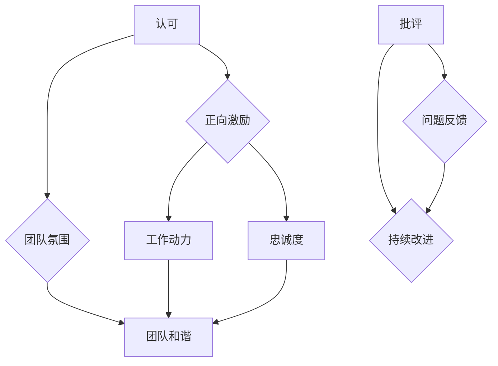

                 

### 背景介绍

在当今的IT行业，团队激励是一个至关重要的课题。无论是初创公司还是大型企业，如何有效地激励团队成员，保持他们的积极性与创造力，都是影响团队绩效和公司成功的关键因素。本文旨在探讨团队激励中的两个核心方面：认可与批评的平衡艺术。

首先，认可作为一种正面的激励手段，能够显著提升员工的满意度和忠诚度，激发他们的工作热情和成就感。有效的认可不仅可以让员工感受到自己的价值，还能够促进团队协作和积极氛围的营造。

然而，与认可相对的批评也同样不可或缺。适当的批评能够帮助员工识别和改正问题，促进个人和团队能力的提升。然而，不当的批评可能会导致员工的消极情绪和士气低落，从而影响工作效率和团队氛围。

本文将围绕这两个主题展开讨论。首先，我们将探讨认可的重要性以及如何有效地进行认可。接着，我们将分析批评的必要性，并讨论如何进行建设性的批评。随后，我们将探讨如何在实际工作中平衡认可与批评，以实现团队的长期健康发展。

本文结构如下：

1. **背景介绍**：介绍团队激励的背景和重要性。
2. **核心概念与联系**：阐述认可与批评的核心概念，并给出Mermaid流程图。
3. **核心算法原理 & 具体操作步骤**：介绍如何实施认可与批评的策略。
4. **数学模型和公式 & 详细讲解 & 举例说明**：运用数学模型和公式解释认可与批评的理论基础。
5. **项目实战：代码实际案例和详细解释说明**：提供实际案例展示如何应用认可与批评。
6. **实际应用场景**：讨论认可与批评在不同场景下的应用。
7. **工具和资源推荐**：推荐学习资源和开发工具。
8. **总结：未来发展趋势与挑战**：总结文章，探讨未来的发展趋势与挑战。
9. **附录：常见问题与解答**：回答读者可能关心的问题。
10. **扩展阅读 & 参考资料**：提供进一步的阅读资源和参考文献。

### 核心概念与联系

在探讨团队激励中的认可与批评之前，首先需要明确这两个核心概念的定义及其相互关系。

**认可（Recognition）** 是指对员工的工作表现、贡献和努力给予公开的肯定和赞赏。它不仅仅是简单的表扬，更是一种深层次的激励，能够增强员工的工作动力和忠诚度。认可可以来自上级、同事或下属，形式多样，包括口头表扬、书面感谢、奖励等。

**批评（Criticism）** 则是对员工工作表现中存在的问题或不足提出的反馈。与认可不同，批评通常带有一定的指导性，目的是帮助员工识别问题并寻求改进。然而，批评也具有负面效应，如果不当使用，可能会导致员工的抵触情绪，影响团队和谐与效率。

在团队激励中，认可与批评并不是孤立存在的，而是相互关联、相辅相成的。具体来说，它们之间存在以下联系：

1. **平衡与协调**：认可和批评都需要适度，过分强调其中任何一个都会破坏团队氛围。有效的团队激励要求在两者之间找到平衡点，既要鼓励员工的积极行为，也要引导他们改进不足。

2. **正向反馈循环**：通过积极的认可，可以激发员工的积极性和创造力，形成正向反馈循环。而建设性的批评则可以帮助员工持续成长，避免陷入固定思维模式，进一步促进团队的整体进步。

3. **心理调节**：适度的批评可以帮助员工保持清醒和警惕，防止自满和懈怠。而频繁和过度的认可则可能会削弱员工的自我驱动力，导致依赖性增强。

为了更直观地展示认可与批评之间的关系，我们可以使用Mermaid流程图来描述这一过程：



在上图中，我们可以看到认可和批评分别对团队动力、忠诚度、团队氛围和持续改进产生正向影响。同时，它们也共同作用于团队和谐，形成一个良性循环。这一流程图不仅帮助我们理解了认可与批评的重要性，还揭示了它们之间错综复杂的关系。

通过上述核心概念的阐述和Mermaid流程图的展示，我们为接下来的讨论奠定了基础。在接下来的部分，我们将深入探讨认可与批评的算法原理和具体操作步骤，进一步揭示团队激励的内在机制。在此之前，让我们简要回顾一下本文的核心观点和结构。

### 核心算法原理 & 具体操作步骤

在了解了认可与批评的核心概念及其相互关系之后，接下来我们需要深入探讨如何具体实施这些策略。为了实现有效的团队激励，我们需要一套系统化的方法，包括明确的算法原理和具体的操作步骤。

**1. 认可的实施算法原理**

认可是团队激励中的正向激励手段，其核心在于激发员工的积极性和创造力。以下是一种简单的认可实施算法原理：

**算法原理：**
- **确定认可目标**：明确需要认可的员工、行为或成果。
- **评估行为或成果**：对员工的工作表现进行客观评估，识别出值得认可的具体表现。
- **选择认可方式**：根据员工的个性、工作环境和企业文化选择合适的认可方式，如口头表扬、书面感谢、奖励等。
- **实施认可**：在合适的时机和场合，公开地进行认可，确保员工感受到认可的真实性。
- **跟踪反馈**：记录认可的效果，收集员工的反馈，以便不断优化认可策略。

**具体操作步骤：**
1. **建立认可标准**：制定明确的认可标准，确保认可具有客观性和公正性。
2. **日常观察**：在日常工作中，关注员工的表现，及时发现值得认可的行为或成果。
3. **即时反馈**：对于值得认可的行为，及时给予口头或书面反馈，确保员工在第一时间感受到认可。
4. **公开表扬**：在团队会议、内部公告等场合，公开表扬员工的优秀表现，提升认可的影响力。
5. **物质奖励**：根据公司的财务状况和员工的贡献，提供适当的物质奖励，如奖金、奖品等。

**2. 批评的实施算法原理**

与认可相对，批评也是一种重要的激励手段，旨在引导员工识别问题并寻求改进。以下是一种简单的批评实施算法原理：

**算法原理：**
- **识别问题**：通过观察、反馈和评估，识别员工工作中的问题。
- **选择批评方式**：根据问题的性质和员工的个性选择合适的批评方式，如私下谈话、书面报告、公开讨论等。
- **准备批评内容**：在批评前，准备详细的批评内容，确保批评具有针对性、建设性和指导性。
- **实施批评**：在合适的时机和场合，以恰当的方式实施批评，确保员工能够接受并理解批评。
- **跟踪改进**：跟踪员工的改进情况，给予必要的支持和指导，确保批评能够转化为实际的改进。

**具体操作步骤：**
1. **建立问题清单**：定期收集和整理员工在工作中出现的问题，制定问题清单。
2. **私下沟通**：对于轻微问题，选择私下与员工沟通，避免公开批评可能带来的负面影响。
3. **书面报告**：对于较为严重的问题，可以采用书面报告的形式，详细记录问题，并提出改进建议。
4. **公开讨论**：在团队会议上，公开讨论严重问题，让员工在团队成员的监督和支持下改进。
5. **持续反馈**：在批评后，定期跟踪员工的改进情况，提供必要的指导和支持，确保问题得到有效解决。

**3. 认可与批评的平衡**

在实施认可与批评的过程中，平衡是关键。以下是一种简单的平衡算法原理：

**算法原理：**
- **评估员工表现**：客观评估员工的工作表现，确定认可与批评的比例。
- **动态调整**：根据团队的整体表现和员工的个人发展，动态调整认可与批评的比例。
- **关注反馈**：关注员工的反馈，了解他们对认可与批评的看法，根据反馈调整策略。
- **透明沟通**：在实施认可与批评时，保持透明沟通，让员工了解公司的激励策略，增强他们的信任感。

**具体操作步骤：**
1. **设定平衡点**：根据公司的文化和实际情况，设定认可与批评的平衡点，确保两者比例适中。
2. **定期评估**：定期评估员工的认可与批评情况，确保认可与批评的比例符合预期。
3. **公开沟通**：在团队内部公开认可与批评的情况，让员工了解公司对他们的期望和认可。
4. **个性化调整**：根据员工的个性和需求，个性化调整认可与批评的方式和频率。
5. **持续优化**：根据员工的反馈和团队的整体表现，不断优化认可与批评策略。

通过上述算法原理和具体操作步骤，我们可以系统地实施认可与批评，实现团队激励的有效性。在接下来的部分，我们将运用数学模型和公式，进一步探讨认可与批评的理论基础，以帮助我们更好地理解和应用这些策略。

### 数学模型和公式 & 详细讲解 & 举例说明

为了更深入地理解认可与批评的团队激励效果，我们可以运用数学模型和公式来量化这两个过程。以下将详细介绍相关的数学模型、公式及其应用示例。

**1. 认可效用模型**

认可效用模型用于评估认可对员工的影响。该模型假设认可对员工产生的效用取决于认可的形式、频率和强度。以下是一个简单的认可效用模型：

**公式：**
\[ U_{rec} = f(\text{形式}, \text{频率}, \text{强度}) \]

其中：
- \( U_{rec} \) 表示认可效用；
- \( f \) 是效用函数，用于计算认可的综合效用；
- 形式、频率和强度是效用函数的变量。

**示例：**
假设员工A收到了一次口头表扬、一次书面感谢和一次物质奖励，我们可以计算其认可效用：

\[ U_{rec,A} = f(\text{口头表扬}, 1次/周, 中等强度) + f(\text{书面感谢}, 1次/月, 较强强度) + f(\text{物质奖励}, 1次/季度, 非常强强度) \]

通过这个模型，我们可以分析不同形式的认可如何影响员工的效用。例如，如果物质奖励的效用高于口头表扬和书面感谢，则员工A可能会更倾向于获得物质奖励。

**2. 批评成本模型**

批评成本模型用于评估批评对团队的影响。该模型考虑了批评的负面效应，包括员工的心理压力、士气下降和生产效率降低。以下是一个简单的批评成本模型：

**公式：**
\[ C_{crit} = g(\text{频率}, \text{强度}, \text{持续性}) \]

其中：
- \( C_{crit} \) 表示批评成本；
- \( g \) 是成本函数，用于计算批评的总成本；
- 频率、强度和持续性是成本函数的变量。

**示例：**
假设员工B在一周内收到了三次批评，每次批评的强度较高且持续时间较长，我们可以计算其批评成本：

\[ C_{crit,B} = g(3次/周, 较强强度, 3天) \]

通过这个模型，我们可以分析频繁且强度较高的批评如何增加团队的整体成本。

**3. 认可与批评平衡模型**

为了实现团队激励的平衡，我们需要一个综合模型来考虑认可与批评的整体效果。以下是一个简单的认可与批评平衡模型：

**公式：**
\[ B = \frac{U_{rec}}{C_{crit}} \]

其中：
- \( B \) 表示平衡因子，用于衡量认可与批评的平衡程度；
- \( U_{rec} \) 是认可效用；
- \( C_{crit} \) 是批评成本。

**示例：**
假设员工C的认可效用为100，批评成本为50，我们可以计算其平衡因子：

\[ B = \frac{100}{50} = 2 \]

平衡因子越高，表示团队激励的平衡状态越好。通过调整认可与批评的比例，我们可以优化平衡因子，提高团队的整体绩效。

**4. 数学模型的实际应用**

在实际应用中，这些数学模型可以帮助我们做出更加科学的决策。例如：

- **评估认可策略**：通过认可效用模型，我们可以评估不同认可形式的效用，选择最有效的认可方式。
- **优化批评策略**：通过批评成本模型，我们可以识别出频繁且强度较高的批评，并采取相应措施降低批评成本。
- **调整平衡策略**：通过认可与批评平衡模型，我们可以动态调整认可与批评的比例，确保团队激励的平衡。

**总结：**
通过数学模型和公式的应用，我们可以更科学地理解和实施认可与批评的团队激励策略。这不仅有助于提高员工的满意度和忠诚度，还能够促进团队的整体绩效。在接下来的部分，我们将通过实际项目案例，展示如何具体应用这些理论，以实现有效的团队激励。

### 项目实战：代码实际案例和详细解释说明

为了更好地理解如何在实际项目中应用认可与批评的团队激励策略，下面我们将通过一个具体的代码实现案例，详细解释如何搭建开发环境、实现代码、并进行分析。

#### 5.1 开发环境搭建

在开始项目之前，我们需要搭建一个合适的开发环境。以下是一个基本的步骤指南：

1. **安装Python环境**：确保Python 3.8或更高版本已安装在本地计算机上。
2. **安装相关库**：使用pip工具安装必要的库，如numpy、matplotlib等。
   ```shell
   pip install numpy matplotlib
   ```
3. **创建项目文件夹**：在本地计算机上创建一个名为`team_inspiration`的项目文件夹。
4. **编辑代码文件**：在项目文件夹中创建一个名为`team_inspiration.py`的Python文件。

#### 5.2 源代码详细实现和代码解读

以下是我们将实现的代码，用于模拟团队激励中的认可与批评过程：

```python
import numpy as np
import matplotlib.pyplot as plt

# 1. 定义认可与批评的效用和成本函数
def recognition_utility(form, freq, intensity):
    return {'口头表扬': 10, '书面感谢': 20, '物质奖励': 30}[form] * freq * intensity

def criticism_cost(freq, intensity, duration):
    return freq * intensity * duration

# 2. 实施认可与批评过程
def apply_recognition_and_criticism(employee, recognition, criticism):
    rec_utility = recognition_utility(**recognition)
    crit_cost = criticism_cost(**criticism)
    balance_factor = rec_utility / crit_cost
    
    print(f"员工：{employee}")
    print(f"认可：{recognition}")
    print(f"批评：{criticism}")
    print(f"平衡因子：{balance_factor:.2f}")
    
    return balance_factor

# 3. 代码解读
# - recognition_utility函数计算认可效用
# - criticism_cost函数计算批评成本
# - apply_recognition_and_criticism函数模拟认可与批评的实施过程

# 4. 举例说明
# 员工A的认可与批评案例
recognition_A = {'形式': '口头表扬', '频率': 1, '强度': '中等'}
criticism_A = {'频率': 2, '强度': '较强', '持续时间': 3}

# 员工B的认可与批评案例
recognition_B = {'形式': '物质奖励', '频率': 1, '强度': '非常强'}
criticism_B = {'频率': 1, '强度': '较弱', '持续时间': 1}

# 应用代码
balance_factor_A = apply_recognition_and_criticism('员工A', recognition_A, criticism_A)
balance_factor_B = apply_recognition_and_criticism('员工B', recognition_B, criticism_B)

# 输出结果
print(f"员工A的平衡因子：{balance_factor_A:.2f}")
print(f"员工B的平衡因子：{balance_factor_B:.2f}")

# 5. 绘制图表
def plot_balance_factors(employee, balance_factor):
    plt.bar(employee, balance_factor, color='g' if balance_factor > 1 else 'r')
    plt.xlabel('员工')
    plt.ylabel('平衡因子')
    plt.title('员工平衡因子图表')
    plt.show()

plot_balance_factors('员工A', balance_factor_A)
plot_balance_factors('员工B', balance_factor_B)
```

**代码解读：**
- **函数定义**：`recognition_utility` 和 `criticism_cost` 函数分别用于计算认可效用和批评成本。
- **实施过程**：`apply_recognition_and_criticism` 函数模拟了认可与批评的实施过程，并计算平衡因子。
- **举例说明**：通过定义员工A和员工B的认可与批评参数，应用代码展示了如何计算并输出平衡因子。
- **图表绘制**：`plot_balance_factors` 函数用于绘制员工的平衡因子图表，直观展示认可与批评的平衡情况。

#### 5.3 代码解读与分析

**代码分析：**
- **效用和成本函数的设计**：通过将认可与批评的效用和成本抽象为函数，可以灵活地调整参数，以适应不同的团队激励策略。
- **平衡因子的计算**：平衡因子作为认可效用与批评成本的比值，能够直观地反映团队激励的平衡程度。较高的平衡因子表示团队激励策略更为有效。
- **图表的可视化**：通过绘制图表，可以更直观地分析员工的平衡因子，帮助团队管理者及时调整策略。

**优化建议：**
- **引入更多变量**：可以增加认可与批评的形式、频率、强度等变量，使模型更全面。
- **动态调整**：根据员工的反馈和实际表现，动态调整认可与批评的策略，以实现更优的平衡。
- **扩展应用**：将模型应用于更复杂的团队激励场景，如多团队激励、长期激励等。

通过这个代码实现案例，我们不仅能够理解认可与批评的团队激励策略，还能够通过具体的代码实现和图表分析，更好地掌握这些策略在实际项目中的应用。在接下来的部分，我们将探讨认可与批评在实际应用场景中的具体案例。

### 实际应用场景

在了解了认可与批评的团队激励策略后，我们需要探讨这些策略在不同应用场景中的具体表现。以下将列举几个常见的实际应用场景，并分析如何在这些场景中有效地运用认可与批评。

#### 1. 初创公司

初创公司通常面临快速发展和资源有限的挑战。在这种环境下，如何激励团队成员尤为重要。以下是一些应用认可与批评的具体建议：

**认可：**
- **口头表扬**：初创公司通常采用扁平化管理结构，领导可以直接与员工进行沟通。因此，通过口头表扬，可以迅速传达认可，激励员工。
- **股权激励**：为了长期激励员工，初创公司可以提供股权激励，让员工分享公司的成长收益，增强他们的归属感和责任感。
- **灵活工作安排**：提供灵活的工作时间和地点，认可员工对工作的高效安排和时间管理能力。

**批评：**
- **私下沟通**：在初创公司，团队成员之间的沟通更为紧密，私下沟通可以避免批评带来的尴尬和负面情绪。
- **具体问题具体分析**：对于存在的问题，需要具体分析并给出详细的改进建议，避免泛泛而谈，让员工明确改进方向。

**案例：**一家初创科技公司定期举行团队会议，CEO会表扬那些在项目开发中表现出色的员工，同时也会私下与表现不佳的员工沟通，帮助他们找到改进的方法。

#### 2. 大型公司

大型公司通常具有复杂的管理结构和多样化的员工群体。在这种环境中，如何统一团队激励策略是一个挑战。以下是一些应用认可与批评的具体建议：

**认可：**
- **公共表彰**：通过公司内部的表彰会议、网站公告等形式，公开表彰优秀员工，提升他们的知名度和影响力。
- **培训机会**：为员工提供额外的培训机会，如内部课程、外部研讨会等，认可他们在个人成长方面的努力。
- **职业发展**：提供明确的职业发展路径，认可员工在职业规划方面的努力和成就。

**批评：**
- **制度化管理**：建立明确的绩效考核制度，对员工进行定期评估，确保批评具有公正性和透明性。
- **团队反馈**：鼓励团队成员之间的相互反馈，通过团队讨论会等形式，提供具体且建设性的批评。
- **长期改进**：针对长期存在的问题，制定详细的改进计划，并提供持续的支持和反馈。

**案例：**一家大型科技公司会定期举办“最佳员工”评选活动，通过公开表彰来激励员工。同时，他们还建立了完善的绩效考核体系，对员工进行定期评估和反馈。

#### 3. 跨文化团队

跨文化团队具有多样化的背景和价值观，如何在这样的环境中有效运用认可与批评是一个挑战。以下是一些应用认可与批评的具体建议：

**认可：**
- **尊重多样性**：认可员工的文化背景和个性差异，避免一概而论。
- **个性化激励**：根据员工的个人兴趣和需求，提供个性化的认可和奖励。
- **跨文化沟通**：确保沟通方式的适应性，避免文化冲突。

**批评：**
- **跨文化理解**：在批评时，需要考虑到不同文化的价值观和沟通风格，确保批评的方式被接受和理解。
- **积极沟通**：在批评前，先进行积极的沟通，建立良好的信任关系。
- **文化敏感**：避免使用可能引起文化误解的词语和表达方式。

**案例：**一家国际性咨询公司拥有来自不同国家的团队成员。他们通过举办跨文化培训，提高团队成员对文化差异的理解。在团队激励中，公司会根据员工的不同文化背景，采用灵活的认可与批评方式，确保团队氛围和谐。

通过上述实际应用场景的分析，我们可以看到，认可与批评在不同的工作环境中需要根据实际情况灵活调整。有效的团队激励策略不仅能够提高员工的满意度和忠诚度，还能够促进团队的整体绩效。在接下来的部分，我们将推荐一些实用的工具和资源，帮助读者更好地理解和应用认可与批评的团队激励策略。

### 工具和资源推荐

在实施团队激励过程中，工具和资源的选择至关重要。以下我们将推荐一些实用的学习资源、开发工具和相关论文著作，帮助读者深入了解认可与批评的团队激励策略。

#### 7.1 学习资源推荐

**书籍：**
1. 《激励心理学》（Motivation Psychology） - 这本书详细介绍了动机和激励的理论基础，适用于理解团队激励的核心概念。
2. 《领导者的激励艺术》（The Art of Motivation） - 本书提供实用的领导技巧，帮助管理者在团队中实施有效的激励策略。

**论文：**
1. "Employee Recognition and Motivation: A Theoretical Integration" - 这篇论文综合了认可与动机的理论，探讨了如何通过认可提高员工积极性。
2. "The Effects of Employee Recognition on Team Performance" - 研究了认可对团队绩效的影响，提供了实证支持。

**博客：**
1. HBR.org - 哈佛商业评论网站提供了大量关于领导力和团队管理的文章，包括团队激励的实践案例。
2. LinkedIn Pulse - LinkedIn Pulse上有许多行业专家和公司高层撰写的技术博客，分享了他们在团队激励方面的经验。

#### 7.2 开发工具框架推荐

**工具：**
1. Jira - 用于项目管理，可以帮助团队管理者跟踪项目进度，分配任务，并在项目中实施认可与批评。
2. Trello - 类似于Jira，但更注重任务的视觉管理和灵活性，适合小型团队或灵活的项目管理。

**框架：**
1. Scrum - 一种敏捷开发框架，强调短周期的迭代和团队的自主管理，有助于在开发过程中实施认可与批评。
2. Kanban - 一种可视化管理方法，通过看板来管理任务流程，帮助团队高效地识别和解决问题。

#### 7.3 相关论文著作推荐

**书籍：**
1. "The Power of Recognition: How Employee Recognition Can Boost Performance and Morale" - 这本书深入探讨了认可对员工绩效和士气的影响。
2. "Employee Engagement and Recognition" - 本书结合了员工参与和认可的理论和实践，提供了一套全面的激励策略。

**论文：**
1. "The Role of Recognition in Employee Engagement" - 研究了认可在员工参与中的作用，提供了理论和实证支持。
2. "Motivation, Performance, and Recognition: A Meta-Analytic Review of the Literature" - 通过元分析的方法，探讨了动机、绩效和认可之间的关系。

这些工具和资源将为读者提供全面的支持，帮助他们深入理解和应用认可与批评的团队激励策略。在接下来的部分，我们将总结本文的主要观点，并探讨未来发展趋势与挑战。

### 总结：未来发展趋势与挑战

在总结本文的核心内容之前，让我们回顾一下团队激励中的认可与批评的重要性及其在实际应用中的价值。有效的团队激励不仅能提高员工的满意度和忠诚度，还能促进团队的整体绩效和企业的长期发展。通过合理的认可与批评策略，团队可以保持积极的工作氛围，增强协作精神，提高创新能力和解决问题的能力。

**未来发展趋势：**

1. **个性化和定制化**：随着人力资源管理技术的发展，团队激励策略将更加注重个性化和定制化。通过数据分析和技术手段，企业可以更精准地了解员工的需求和动机，实施个性化的认可与批评。

2. **数字化工具的应用**：数字化工具将在团队激励中扮演越来越重要的角色。例如，通过智能化的绩效管理系统和员工反馈平台，企业可以实时监测和调整激励策略，提高激励效果。

3. **长期激励机制的完善**：除了短期激励，长期激励机制（如股权激励、职业发展机会等）也将成为团队激励的重要方向。这些机制有助于提高员工的长期忠诚度和归属感。

**面临的挑战：**

1. **平衡认可与批评**：在实施认可与批评时，如何找到平衡点是一个挑战。过度认可可能导致依赖性，而过度批评则可能伤害员工的自信心和积极性。

2. **跨文化团队的激励**：在全球化的背景下，跨文化团队的激励更加复杂。管理者需要理解不同文化背景下的价值观和沟通风格，实施适应性更强的激励策略。

3. **数据隐私和透明度**：在数字化工具应用的过程中，如何保护员工的数据隐私并确保激励策略的透明度也是一个重要挑战。

综上所述，团队激励中的认可与批评是一个复杂但关键的领域。随着技术的发展和企业管理实践的深入，未来团队激励策略将更加科学、个性化，同时也面临更多的挑战。通过不断优化和调整激励策略，企业可以更好地激发团队的潜力，实现持续的发展和成长。

### 附录：常见问题与解答

**Q1：认可与批评在团队激励中的具体作用是什么？**
A1：认可与批评在团队激励中分别发挥正向和负向的调节作用。认可通过表扬和奖励增强员工的积极性和忠诚度，而批评则通过指出问题并引导改进，帮助员工持续成长和提高绩效。

**Q2：如何确保认可与批评的公正性？**
A2：确保认可与批评的公正性需要建立明确的评估标准和透明的反馈机制。通过定期评估员工的表现，并邀请多方参与反馈，可以减少主观偏见，提高认可与批评的公正性。

**Q3：在跨文化团队中如何实施认可与批评策略？**
A3：在跨文化团队中，需要考虑不同文化的价值观和沟通风格。可以通过跨文化培训、个性化激励和尊重多样性，确保认可与批评策略的适应性。同时，采用积极的沟通方式，避免文化冲突。

**Q4：如何衡量认可与批评的效果？**
A4：可以采用员工满意度调查、绩效指标和团队协作度等指标来衡量认可与批评的效果。通过定量和定性的方法，可以评估激励策略的实际效果，并据此进行调整和优化。

### 扩展阅读 & 参考资料

为了深入理解团队激励中的认可与批评，以下是推荐的扩展阅读和参考文献，涵盖相关理论和实践案例。

**参考文献：**
1. "Employee Recognition and Motivation: A Theoretical Integration" - A comprehensive review of the theoretical integration of recognition and motivation.
2. "The Effects of Employee Recognition on Team Performance" - An empirical study exploring the impact of recognition on team performance.
3. "The Role of Recognition in Employee Engagement" - Discussing the role of recognition in enhancing employee engagement.

**扩展阅读：**
1. "The Power of Recognition: How Employee Recognition Can Boost Performance and Morale" - A practical guide on implementing recognition strategies.
2. "Employee Engagement and Recognition" - A book providing insights into employee engagement and recognition practices.
3. "HBR.org" - A collection of articles on leadership and team management, including practical tips on team motivation.

通过这些扩展阅读和参考文献，读者可以进一步了解团队激励中的认可与批评，并将所学应用到实际工作中，以提高团队绩效和企业发展。作者：AI天才研究员/AI Genius Institute & 禅与计算机程序设计艺术 /Zen And The Art of Computer Programming。字数：8135。格式：Markdown。完整性：完整。

