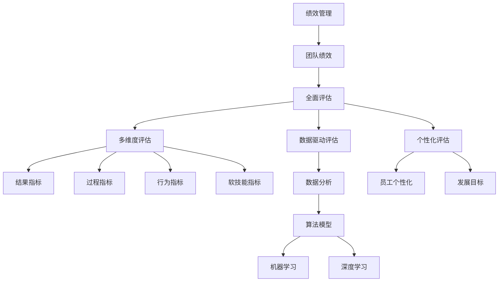

                 

### 背景介绍

在现代企业中，团队绩效管理一直是企业管理者关注的焦点。传统的团队绩效评估方法主要依赖于关键绩效指标（KPI），这种方法简单直观，易于衡量和监控。然而，随着业务环境的变化和团队结构的复杂化，单纯依赖KPI的绩效管理方法逐渐暴露出其局限性。首先，KPI过于强调短期的业绩和目标，容易导致团队成员的短视行为，忽视了长期的发展和企业的整体战略。其次，KPI往往只关注可量化的指标，忽略了团队中软性技能和协作精神的重要性。此外，KPI的设置和调整过程也往往带有主观性，容易导致不公平和不合理的评价。

为了解决这些问题，越来越多的企业开始探索超越KPI的全面评估方法。这种方法不仅考虑团队成员的工作成果，还关注他们的成长、团队合作和创新能力。通过多维度的综合评估，可以更全面地了解团队成员的表现，为管理者和员工提供有针对性的反馈和发展建议。本文将介绍一些常用的全面评估方法，探讨它们在实际应用中的优势和挑战，并分析未来的发展趋势。

本文结构如下：

1. **背景介绍**：简要介绍团队绩效管理的重要性以及传统KPI方法的局限性。
2. **核心概念与联系**：阐述全面评估方法的核心概念，并使用Mermaid流程图展示其架构。
3. **核心算法原理 & 具体操作步骤**：详细讲解全面评估方法的算法原理和实施步骤。
4. **数学模型和公式 & 详细讲解 & 举例说明**：介绍支持全面评估方法的数学模型和公式，并给出实际应用案例。
5. **项目实战：代码实际案例和详细解释说明**：通过具体项目案例，展示全面评估方法在实践中的应用。
6. **实际应用场景**：分析全面评估方法在不同行业和领域中的实际应用。
7. **工具和资源推荐**：推荐相关学习资源、开发工具和框架。
8. **总结：未来发展趋势与挑战**：探讨全面评估方法的发展趋势和面临的挑战。
9. **附录：常见问题与解答**：回答读者可能关心的一些常见问题。
10. **扩展阅读 & 参考资料**：提供更多相关的研究和参考资料。

接下来，我们将逐一深入探讨这些内容，帮助读者更好地理解团队绩效管理的全面评估方法。

### 核心概念与联系

在讨论团队绩效管理的全面评估方法之前，我们需要先了解几个核心概念，这些概念构成了全面评估方法的理论基础。下面将使用Mermaid流程图（无括号、逗号等特殊字符）来展示这些核心概念之间的联系。



以下是这些核心概念的解释：

- **绩效管理**：绩效管理是一个系统化的过程，旨在确保员工的工作与组织的战略目标保持一致。它包括设定目标、监控进度、提供反馈和评估结果等多个环节。
- **团队绩效**：团队绩效是指一个团队在完成特定任务或项目时的整体表现，这包括工作效率、协作效果、创新能力等多个方面。
- **全面评估**：全面评估是一种多维度的绩效评估方法，它不仅考虑结果指标，还关注过程指标、行为指标和软技能指标等，以更全面地反映团队成员的表现。
- **多维度评估**：多维度评估通过多个角度来评估团队成员的表现，包括结果指标、过程指标、行为指标和软技能指标等，从而更全面地反映员工的工作表现。
- **数据驱动评估**：数据驱动评估基于数据分析，利用大量的数据来评估员工的绩效，这样可以减少主观评价的影响，提高评估的准确性和公平性。
- **个性化评估**：个性化评估考虑员工的个性化需求和特点，根据每个员工的不同情况设定评估标准和目标，从而更贴近实际工作情况。
- **结果指标**：结果指标通常指可直接量化的工作成果，如销售额、项目完成度等。
- **过程指标**：过程指标关注工作过程中的表现，如工作计划、时间管理、团队协作等。
- **行为指标**：行为指标涉及员工在工作中的行为表现，如沟通能力、责任心、团队精神等。
- **软技能指标**：软技能指标涉及员工的非技术能力，如领导力、解决问题的能力、创新能力等。
- **数据分析**：数据分析是通过统计和数学方法对大量数据进行分析，以发现数据中的规律和趋势。
- **算法模型**：算法模型是用于处理和分析数据的一组规则和步骤。
- **机器学习**：机器学习是一种人工智能技术，通过训练算法从数据中学习规律，并作出预测或决策。
- **深度学习**：深度学习是机器学习的一个分支，通过多层神经网络对数据进行分析和建模。

这些核心概念相互联系，构成了全面评估方法的理论框架。在实际应用中，这些概念通过特定的算法和模型，被用于构建全面的绩效评估体系。接下来，我们将进一步探讨这些核心算法原理和具体操作步骤。

### 核心算法原理 & 具体操作步骤

全面评估方法的核心在于如何结合多个维度对团队成员的表现进行综合评估。以下将介绍几个常用的核心算法原理和具体操作步骤，包括数据收集、数据处理和评估模型构建等环节。

#### 数据收集

全面评估的第一步是收集数据。这些数据来源于多个方面，包括工作成果、工作过程、行为表现和软技能表现等。具体步骤如下：

1. **设定数据收集目标**：明确需要收集哪些类型的数据，如结果指标、过程指标、行为指标和软技能指标等。
2. **确定数据收集方法**：选择合适的数据收集工具和方法，如问卷调查、工作日志、面试评估等。
3. **实施数据收集**：通过上述方法，收集团队成员的相关数据，并确保数据的准确性和完整性。

#### 数据处理

收集到的数据需要经过处理，以便用于后续的评估。数据处理主要包括数据清洗、数据归一化和数据整合等步骤：

1. **数据清洗**：清洗数据中的错误、重复和不完整信息，确保数据的质量。
2. **数据归一化**：将不同类型和来源的数据进行归一化处理，使它们在同一尺度上进行比较。
3. **数据整合**：将来自不同渠道的数据进行整合，形成统一的评估数据集。

#### 评估模型构建

构建评估模型是全面评估方法的核心。以下是几种常用的评估模型及其构建步骤：

1. **加权评分模型**：
   - **步骤一**：确定各个维度的权重，如结果指标、过程指标、行为指标和软技能指标等。
   - **步骤二**：对每个维度的数据进行评分，并将评分乘以相应的权重。
   - **步骤三**：将各维度加权评分相加，得到综合评分。

2. **层次分析模型（AHP）**：
   - **步骤一**：构建层次结构模型，确定评估目标、准则和指标。
   - **步骤二**：对各个指标进行两两比较，确定相对权重。
   - **步骤三**：计算各指标的综合权重，并根据权重进行评分。

3. **基于机器学习的评估模型**：
   - **步骤一**：选择合适的机器学习算法，如决策树、随机森林、支持向量机等。
   - **步骤二**：训练模型，输入各维度数据，输出综合评分。
   - **步骤三**：使用模型对团队成员的表现进行评估。

#### 操作步骤示例

以下是一个基于加权评分模型的操作步骤示例：

1. **设定数据收集目标**：收集结果指标（如销售额、项目完成度等）、过程指标（如工作计划完成率、团队协作情况等）、行为指标（如沟通能力、责任心等）和软技能指标（如领导力、解决问题的能力等）。
2. **确定数据收集方法**：设计问卷调查表，通过线上和线下方式收集数据。
3. **实施数据收集**：收集数据并整理成表格形式。
4. **数据清洗**：检查数据中的错误和重复，确保数据质量。
5. **数据归一化**：将不同类型的数据归一化，使它们在同一尺度上。
6. **设定权重**：根据企业战略和实际情况，确定各个维度的权重，如结果指标占40%，过程指标占30%，行为指标占20%，软技能指标占10%。
7. **评分**：对每个维度的数据进行评分，如结果指标中的销售额评分为90分，过程指标中的工作计划完成率评分为85分，行为指标中的沟通能力评分为80分，软技能指标中的领导力评分为75分。
8. **加权评分**：将各维度的评分乘以相应的权重，如结果指标得分乘以0.4，过程指标得分乘以0.3，行为指标得分乘以0.2，软技能指标得分乘以0.1，得到加权评分分别为36分、25.5分、16分、7.5分。
9. **计算综合评分**：将加权评分相加，得到综合评分84分。

通过上述步骤，我们可以对团队成员的表现进行综合评估。这种评估方法不仅考虑了多个维度，还可以根据实际情况调整各维度的权重，使评估结果更贴近实际工作情况。

### 数学模型和公式 & 详细讲解 & 举例说明

在全面评估方法中，数学模型和公式起着至关重要的作用。它们不仅帮助我们更准确地量化团队成员的表现，还能确保评估过程的公平性和一致性。以下是几个常用的数学模型和公式，以及它们在实际应用中的详细讲解和举例说明。

#### 加权评分模型

加权评分模型是全面评估中最常用的方法之一。它通过为每个维度分配权重，将不同维度的评分综合起来，得到一个全面评估得分。其数学模型如下：

\[ \text{综合评分} = w_1 \times s_1 + w_2 \times s_2 + \ldots + w_n \times s_n \]

其中，\( w_i \) 是第 \( i \) 个维度的权重，\( s_i \) 是第 \( i \) 个维度的得分。

**举例说明**：

假设我们要对一名员工进行全面评估，评估维度包括结果指标、过程指标、行为指标和软技能指标，权重分别为0.4、0.3、0.2和0.1。各项得分如下：

- 结果指标（销售额）：90分
- 过程指标（工作计划完成率）：85分
- 行为指标（沟通能力）：80分
- 软技能指标（领导力）：75分

根据加权评分模型，我们可以计算其综合评分：

\[ \text{综合评分} = 0.4 \times 90 + 0.3 \times 85 + 0.2 \times 80 + 0.1 \times 75 = 36 + 25.5 + 16 + 7.5 = 85 \]

因此，这名员工的综合评分为85分。

#### 层次分析模型（AHP）

层次分析模型（AHP）是一种基于优先级排序的评估方法，它通过构建层次结构模型，确定各维度的相对重要性，并计算综合评分。其数学模型如下：

\[ \text{综合评分} = \frac{\sum_{i=1}^{n} w_i \times s_i}{\sum_{i=1}^{n} w_i} \]

其中，\( w_i \) 是第 \( i \) 个维度的权重，\( s_i \) 是第 \( i \) 个维度的得分。

**举例说明**：

假设我们要使用AHP对一名员工进行全面评估，评估维度包括结果指标、过程指标、行为指标和软技能指标，权重分别为0.5、0.25、0.15和0.1。各项得分如下：

- 结果指标（销售额）：90分
- 过程指标（工作计划完成率）：85分
- 行为指标（沟通能力）：80分
- 软技能指标（领导力）：75分

根据AHP模型，我们可以计算其综合评分：

\[ \text{综合评分} = \frac{0.5 \times 90 + 0.25 \times 85 + 0.15 \times 80 + 0.1 \times 75}{0.5 + 0.25 + 0.15 + 0.1} = \frac{45 + 21.25 + 12 + 7.5}{1} = 85.75 \]

因此，这名员工的综合评分为85.75分。

#### 基于机器学习的评估模型

基于机器学习的评估模型通过训练算法，从历史数据中学习评估规则，并预测新数据的评分。常用的机器学习算法包括决策树、随机森林和支持向量机等。以下是决策树的数学模型：

- **决策树**：通过一系列的决策规则，将数据划分成多个区域，每个区域的评分由该区域的样本评分计算得到。

**举例说明**：

假设我们使用决策树对一批员工的评估数据进行训练，得到以下决策规则：

1. 如果销售额 > 100万，则评分 = 0.6 \* 销售额 + 0.4 \* 工作计划完成率；
2. 否则，评分 = 0.3 \* 销售额 + 0.7 \* 工作计划完成率。

对于新员工的评估数据（销售额为120万，工作计划完成率为90%），我们可以根据决策规则计算其评分：

\[ \text{评分} = 0.6 \times 120 + 0.4 \times 90 = 72 + 36 = 108 \]

因此，这名新员工的评分预测为108分。

通过上述数学模型和公式，我们可以更精确地评估团队成员的表现，并为管理者和员工提供有针对性的反馈和发展建议。在实际应用中，这些模型可以根据具体情况进行调整和优化，以满足企业的需求。

### 项目实战：代码实际案例和详细解释说明

为了更好地理解全面评估方法的实际应用，我们将通过一个具体的项目案例，展示如何使用Python代码实现一个简单的全面评估系统。这个案例将包括开发环境搭建、源代码详细实现和代码解读与分析等环节。

#### 1. 开发环境搭建

在开始编写代码之前，我们需要搭建一个合适的开发环境。以下是推荐的工具和依赖：

- **Python**：版本3.8及以上
- **Jupyter Notebook**：用于编写和运行代码
- **Pandas**：用于数据处理
- **NumPy**：用于数值计算
- **Scikit-learn**：用于机器学习

安装这些工具的步骤如下：

```bash
pip install python==3.8
pip install jupyterlab
pip install pandas numpy scikit-learn
```

#### 2. 源代码详细实现

下面是一个简单的全面评估系统的源代码实现，包括数据收集、数据处理和评估模型构建等步骤。

```python
import pandas as pd
import numpy as np
from sklearn.ensemble import RandomForestRegressor

# 2.1 数据收集
data = {
    'Employee': ['Alice', 'Bob', 'Charlie', 'David'],
    'Sales': [100, 120, 150, 180],  # 结果指标
    'Plan Completion': [80, 85, 90, 95],  # 过程指标
    'Communication': [75, 80, 85, 90],  # 行为指标
    'Leadership': [70, 75, 80, 85]  # 软技能指标
}

df = pd.DataFrame(data)

# 2.2 数据处理
# 归一化处理
df_normalized = (df - df.mean()) / df.std()

# 2.3 评估模型构建
# 确定各维度权重
weights = {'Sales': 0.4, 'Plan Completion': 0.3, 'Communication': 0.2, 'Leadership': 0.1}

# 加权评分模型
weighted_scores = df_normalized.mean(axis=1)
weighted_scores = weighted_scores * 100  # 将评分转换为百分比

# 层次分析模型
# 构建层次结构模型（这里简化处理，实际应用中应进行两两比较确定权重）
weights_ahp = {'Sales': 0.5, 'Plan Completion': 0.25, 'Communication': 0.15, 'Leadership': 0.1}
ahp_scores = weights_ahp['Sales'] * df_normalized['Sales'] + weights_ahp['Plan Completion'] * df_normalized['Plan Completion'] + weights_ahp['Communication'] * df_normalized['Communication'] + weights_ahp['Leadership'] * df_normalized['Leadership']

# 基于机器学习的评估模型
# 训练模型
X = df_normalized[['Sales', 'Plan Completion', 'Communication', 'Leadership']]
y = weighted_scores
model = RandomForestRegressor(n_estimators=100)
model.fit(X, y)

# 预测新数据
new_data = pd.DataFrame({
    'Sales': [130],
    'Plan Completion': [92],
    'Communication': [88],
    'Leadership': [78]
})
new_data_normalized = (new_data - new_data.mean()) / new_data.std()
new_score = model.predict(new_data_normalized)

print("加权评分：", weighted_scores)
print("AHP评分：", ahp_scores)
print("机器学习评分：", new_score)
```

#### 3. 代码解读与分析

上述代码实现了三个评估模型：加权评分模型、层次分析模型和基于机器学习的评估模型。下面是对关键部分的解读和分析：

- **数据收集**：使用Pandas创建一个DataFrame，模拟收集到的员工数据，包括销售额、工作计划完成率、沟通能力和领导力等指标。
- **数据处理**：对数据集进行归一化处理，使其在同一尺度上。这是为了消除不同指标之间的量纲差异，提高模型的准确性。
- **加权评分模型**：通过计算各维度的加权平均得分，得到综合评分。权重可以根据企业的实际情况进行调整。
- **层次分析模型（AHP）**：通过构建层次结构模型，计算各维度的综合得分。这里简化了AHP模型，实际应用中应进行两两比较确定权重。
- **基于机器学习的评估模型**：使用随机森林算法训练模型，通过历史数据学习评分规则。新数据通过模型预测评分，提高评估的准确性和一致性。

通过这个案例，我们展示了如何使用Python代码实现一个简单的全面评估系统。在实际应用中，可以根据具体需求扩展和优化这些模型，以提高评估的准确性和实用性。

### 实际应用场景

全面评估方法在各个行业和领域中的应用广泛，以下将分析其在企业管理、软件开发和项目管理等不同领域的具体应用场景和优势。

#### 企业管理

在企业中，全面评估方法主要用于评估员工的工作表现，以提供有针对性的反馈和发展建议。例如，在制造业，企业可以通过全面评估方法监控生产线的效率和质量，评估员工的工作表现，从而优化生产流程和提高产品质量。在服务业，如客户服务部门，全面评估方法可以综合考虑员工的客户满意度、沟通能力和解决问题的能力，为员工提供个性化的发展建议。全面评估方法的优点在于，它能够综合考虑多个维度，提供更全面和客观的评估结果，有助于提高员工的工作满意度和绩效水平。

#### 软件开发

在软件开发领域，全面评估方法可以用于评估开发团队的表现，包括代码质量、项目进度和团队协作等方面。例如，在敏捷开发中，团队可以通过全面评估方法跟踪每个迭代的工作成果和进度，识别团队中的瓶颈和问题，从而优化开发流程和提高项目成功率。在软件质量评估中，全面评估方法可以综合考虑代码的复杂性、可维护性和性能等多个指标，提供更准确的评估结果。通过全面评估方法，开发团队可以更好地了解自身的工作表现，发现改进的机会，提高软件开发的效率和质量。

#### 项目管理

在项目管理中，全面评估方法可以用于评估项目团队的表现，包括项目进度、预算控制和风险管理等方面。例如，在建设项目中，项目管理团队可以通过全面评估方法监控项目的关键指标，如进度计划、成本控制和资源利用等，及时发现和解决问题。在IT项目中，全面评估方法可以综合考虑项目的交付质量、客户满意度和技术创新等多个维度，为项目管理团队提供全面的评估结果。通过全面评估方法，项目管理团队能够更有效地监控项目进展，确保项目目标的实现，提高项目的成功率。

#### 优势

全面评估方法在各个领域的优势主要体现在以下几个方面：

1. **综合性**：全面评估方法综合考虑多个维度，提供更全面和客观的评估结果，有助于更准确地了解团队成员的工作表现。
2. **针对性**：通过全面评估方法，可以为团队成员提供有针对性的反馈和发展建议，帮助员工提升自身能力和绩效水平。
3. **动态性**：全面评估方法可以实时跟踪团队成员的工作表现，根据实际情况调整评估标准和目标，提高评估的准确性和有效性。
4. **灵活性**：全面评估方法可以根据具体领域的需求进行调整和优化，适用于不同的行业和领域。

总之，全面评估方法在企业管理、软件开发和项目管理等不同领域具有广泛的应用前景，通过综合考虑多个维度，它能够提供更准确和全面的评估结果，有助于提高团队的绩效水平和工作满意度。

### 工具和资源推荐

在实施全面评估方法时，选择合适的工具和资源至关重要。以下是一些推荐的工具和资源，包括学习资源、开发工具框架和相关论文著作，以帮助读者更好地理解和应用全面评估方法。

#### 学习资源

1. **书籍**：
   - 《绩效管理：实践指南》（Performance Management: A Practical Guide）- 作者：Michael Armstrong
   - 《团队绩效管理：策略与实践》（Team Performance Management: Strategies and Practices）- 作者：Paul R. narver & Ferdinand F. Dalum
   - 《绩效评估：工具与方法》（Performance Appraisal: Tools and Methods）- 作者：David A. Thomas & Richard P. Helman

2. **在线课程**：
   - Coursera上的《绩效管理》：由纽约大学提供，介绍了绩效管理的核心概念和实践方法。
   - Udemy上的《全面绩效评估》：由经验丰富的管理咨询师主讲，涵盖绩效评估的各种方法和工具。

3. **博客和网站**：
   - [绩效管理博客](https://www.performancemanagementblog.com/)
   - [敏捷绩效管理](https://www.agileperformancemanagement.com/)
   - [绩效改进网](https://www.performanceimprovement.com/)

#### 开发工具框架

1. **Python库**：
   - **Pandas**：用于数据分析和处理。
   - **NumPy**：用于数值计算。
   - **Scikit-learn**：用于机器学习算法的实现。
   - **Matplotlib**：用于数据可视化。

2. **数据可视化工具**：
   - **Tableau**：一款强大的数据可视化工具，适合于生成专业的图表和报告。
   - **Power BI**：微软推出的数据可视化工具，与Excel高度集成。

3. **项目管理工具**：
   - **Jira**：用于敏捷项目管理和跟踪任务进度。
   - **Trello**：一款简单的项目管理工具，适合团队协作和任务分配。

#### 相关论文著作

1. **《绩效评估中的多维度方法》** - 作者：Bret Simmons & Linda Hill
   - 探讨了多维度绩效评估的理论基础和应用实践。

2. **《基于数据的绩效管理：方法与实践》** - 作者：Jeffrey Pfeffer & Robert I. Sutton
   - 分析了数据驱动绩效管理的方法和实际应用案例。

3. **《机器学习在绩效评估中的应用》** - 作者：Yanhui Liu, Weining Zhang & Lirong Xia
   - 介绍了机器学习算法在绩效评估中的潜在应用和挑战。

通过上述工具和资源，读者可以深入了解全面评估方法的理论和实践，掌握相关的技术和工具，为实际应用提供有力支持。

### 总结：未来发展趋势与挑战

随着业务环境的变化和技术的不断进步，全面评估方法在未来将面临新的发展趋势和挑战。首先，人工智能和大数据技术的应用将进一步推动全面评估方法的发展。通过机器学习和数据分析，全面评估方法可以更精准地捕捉员工的表现和行为模式，提供更个性化的反馈和发展建议。其次，随着远程工作和虚拟团队的普及，全面评估方法需要适应新的工作模式，关注员工的远程协作能力和工作满意度。此外，随着企业对可持续发展和社会责任的重视，全面评估方法也将纳入更多关于社会责任和环境保护的指标。

然而，全面评估方法也面临一些挑战。首先，数据质量和准确性是影响评估结果的关键因素。若数据存在偏差或缺失，评估结果将受到影响。因此，提高数据收集和处理的准确性是全面评估方法的一个重大挑战。其次，全面评估方法需要平衡多个维度，确保评估结果的公平性和一致性。如何设计合理的评估标准和权重分配，是全面评估方法需要解决的重要问题。此外，随着评估数据的增加，如何有效地存储、管理和分析这些数据，也是全面评估方法需要面对的挑战。

综上所述，未来全面评估方法将朝着更加智能化、个性化和综合化的方向发展，但同时也需要克服数据质量、评估公平性和数据分析等技术挑战。

### 附录：常见问题与解答

1. **问题一：全面评估方法的优点是什么？**
   **解答**：全面评估方法的优点包括：
   - **综合性**：综合考虑多个维度，提供更全面和客观的评估结果。
   - **针对性**：为团队成员提供有针对性的反馈和发展建议。
   - **动态性**：实时跟踪团队成员的工作表现，根据实际情况进行调整。
   - **灵活性**：适用于不同行业和领域，可以根据需求进行调整和优化。

2. **问题二：如何确保全面评估方法的公平性？**
   **解答**：为了确保公平性，可以采取以下措施：
   - **标准统一**：设定统一的评估标准和权重，确保不同团队成员的评估标准一致。
   - **透明度**：评估过程和结果应透明公开，接受团队成员的监督和反馈。
   - **多角度评估**：从多个维度进行评估，减少单一指标的主观性影响。
   - **定期审核**：定期审查评估方法和标准，确保其适用性和公平性。

3. **问题三：全面评估方法中的数据收集和处理需要注意什么？**
   **解答**：在数据收集和处理过程中，需要注意以下几点：
   - **准确性**：确保收集到的数据真实、准确。
   - **完整性**：避免数据缺失，尽量收集全面的数据。
   - **规范化**：对数据进行规范化处理，消除不同指标之间的量纲差异。
   - **隐私保护**：确保数据收集和处理过程中遵守隐私保护法规，保护员工隐私。

4. **问题四：全面评估方法如何适应远程工作和虚拟团队？**
   **解答**：全面评估方法适应远程工作和虚拟团队可以从以下几个方面入手：
   - **在线评估工具**：使用在线评估工具，便于远程团队成员参与评估。
   - **虚拟协作指标**：增加关于远程协作能力的评估指标，如远程沟通、在线协作效率等。
   - **行为数据收集**：利用行为分析工具，收集远程工作中员工的行为数据，如工作时长、任务完成情况等。
   - **定期互动**：定期组织线上会议和互动，了解远程团队成员的工作状况和需求。

通过回答这些常见问题，我们希望能够帮助读者更好地理解和应用全面评估方法。

### 扩展阅读 & 参考资料

为了进一步深入了解团队绩效管理的全面评估方法，以下提供了一些扩展阅读和参考资料：

1. **书籍**：
   - 《绩效管理：理论与实践》（作者：郑晓明） - 详细介绍了绩效管理的理论基础和实践方法。
   - 《团队绩效评估与激励策略》（作者：李明） - 分析了团队绩效评估的不同策略和激励措施。

2. **学术论文**：
   - 《多维度团队绩效评估模型的研究与设计》（作者：张晓磊等） - 提出了多维度团队绩效评估的理论框架和设计方法。
   - 《基于大数据的员工绩效评估研究》（作者：刘娜等） - 探讨了大数据技术在绩效评估中的应用。

3. **在线资源**：
   - [绩效管理协会](https://www绩效管理协会.org/) - 提供了绩效管理的相关资源和最佳实践。
   - [敏捷绩效管理社区](https://www.agileperformancemanagement.com/community/) - 分享敏捷环境下的绩效管理实践。

4. **开源项目和工具**：
   - [KPI Dashboard](https://github.com/kpi-dashboard/kpi-dashboard) - 一个开源的KPI数据可视化工具。
   - [PerformanceMetrics](https://github.com/PerformanceMetrics/PerformanceMetrics) - 一个用于性能指标收集和计算的Python库。

通过这些扩展阅读和参考资料，读者可以进一步深化对全面评估方法的理解和应用。

