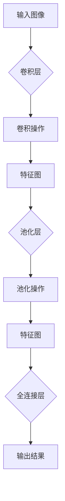

                 

# 图像处理的AI大模型：重塑视觉技术的未来

> **关键词：** 图像处理、AI大模型、视觉技术、深度学习、图像识别、计算机视觉

> **摘要：** 本文深入探讨了图像处理的AI大模型，探讨了其核心概念、算法原理、数学模型及实际应用场景，展望了未来的发展趋势与挑战。通过详细的实战案例和代码解读，为读者提供了从理论到实践的全面了解，旨在推动读者在图像处理领域的深入研究和应用。

## 1. 背景介绍

随着计算机技术的发展，图像处理作为计算机科学的一个重要分支，已经在诸多领域得到了广泛应用，如医疗影像、安防监控、自动驾驶、增强现实等。传统的图像处理方法主要依赖于手工设计的算法，存在一定的局限性。随着深度学习技术的兴起，尤其是AI大模型的引入，图像处理技术迎来了新的变革。

AI大模型，通常指的是利用深度学习技术训练的大型神经网络模型，具有强大的特征提取和模式识别能力。这类模型在图像分类、目标检测、图像生成等方面展现了卓越的性能，大大提升了图像处理的效率和准确性。图像处理的AI大模型不仅能够处理简单的图像任务，还可以应对复杂的视觉问题，具有广泛的应用前景。

本文旨在探讨图像处理的AI大模型，从核心概念、算法原理、数学模型到实际应用，为读者提供全方位的了解。通过本文的阅读，读者将能够掌握图像处理的AI大模型的基本原理，了解其发展历程，并能够运用到实际项目中。

## 2. 核心概念与联系

### 2.1 深度学习与神经网络

深度学习（Deep Learning）是机器学习（Machine Learning）的一个重要分支，其主要思想是通过模拟人脑神经网络的结构和功能，实现数据的自动学习和模式识别。神经网络（Neural Network）是由大量简单的人工神经元组成的复杂网络，通过层层提取数据特征，实现对数据的分类、预测和生成。

神经网络的工作原理可以简单理解为：输入数据经过多层神经元的变换和传递，最终输出结果。每一层神经元都会对输入数据进行一定的线性变换，并通过非线性激活函数将结果传递到下一层。通过这种方式，神经网络能够逐步提取数据的深层特征。


### 2.2 卷积神经网络（CNN）

卷积神经网络（Convolutional Neural Network，CNN）是深度学习中专门用于图像处理的一种网络结构。CNN的核心思想是通过卷积层（Convolutional Layer）对图像进行特征提取，再通过池化层（Pooling Layer）进行特征降维和增强。

卷积层通过卷积操作提取图像的局部特征，类似于人眼对图像的感知过程。卷积核（Convolutional Kernel）在图像上滑动，对局部区域进行卷积操作，生成特征图（Feature Map）。卷积层的多层堆叠能够逐层提取图像的深层特征。


池化层通常位于卷积层之后，用于减小特征图的尺寸，减少计算量和参数数量。常见的池化操作包括最大池化（Max Pooling）和平均池化（Average Pooling）。

### 2.3 AI大模型与视觉技术

AI大模型通常是指训练参数数量庞大的深度学习模型，其能够通过大量数据进行训练，从而获得出色的性能。在图像处理领域，AI大模型主要应用于图像分类、目标检测、图像生成等任务。

图像分类（Image Classification）是AI大模型在视觉领域的一项重要应用，其目标是将图像划分为不同的类别。例如，在图像分类任务中，AI大模型能够识别图片中的物体，并将其分类为猫、狗、汽车等。

目标检测（Object Detection）是图像处理中的一个重要任务，其目标是在图像中定位和识别多个物体。AI大模型通过卷积神经网络实现目标检测，能够准确地定位图像中的物体，并标注其位置和类别。

图像生成（Image Generation）是AI大模型在视觉领域的另一个重要应用，其目标是根据给定的输入生成新的图像。例如，在图像生成任务中，AI大模型能够根据一段文本描述生成对应的图像，或根据一张图片生成其变体。

### 2.4 Mermaid 流程图

下面是一个关于卷积神经网络（CNN）的基本流程图，展示了卷积层、池化层、全连接层等主要组成部分及其相互关系。



## 3. 核心算法原理 & 具体操作步骤

### 3.1 数据预处理

在开始训练AI大模型之前，需要对图像数据进行预处理，以提高模型的训练效果。数据预处理主要包括图像大小调整、数据增强、归一化等操作。

- 图像大小调整：将所有图像调整为相同的大小，以适应模型的输入要求。
- 数据增强：通过旋转、翻转、缩放、剪裁等操作增加数据多样性，提高模型的泛化能力。
- 归一化：将图像的像素值归一化到[0, 1]之间，以减少计算量和加快训练速度。

### 3.2 网络结构设计

AI大模型通常由多个卷积层、池化层和全连接层组成。在设计网络结构时，需要考虑以下因素：

- 卷积层：确定卷积核的大小、步长和填充方式，以提取图像的局部特征。
- 池化层：确定池化层的大小和类型，以降低特征图的维度。
- 全连接层：确定全连接层的神经元数量，以实现分类或回归任务。

### 3.3 损失函数与优化器

在训练AI大模型时，需要选择合适的损失函数和优化器。常见的损失函数包括交叉熵损失（Cross-Entropy Loss）、均方误差（Mean Squared Error，MSE）等。优化器用于调整模型的参数，以最小化损失函数。

- 交叉熵损失：适用于分类任务，计算模型预测概率与实际标签之间的差异。
- 均方误差：适用于回归任务，计算模型预测值与实际值之间的差异。
- 优化器：如随机梯度下降（SGD）、Adam优化器等，用于调整模型参数。

### 3.4 训练过程

AI大模型的训练过程包括以下步骤：

1. 初始化模型参数。
2. 将图像数据输入模型，进行前向传播，得到预测结果。
3. 计算损失函数值，并根据损失函数值调整模型参数。
4. 反向传播，更新模型参数。
5. 重复步骤2-4，直到满足停止条件（如迭代次数、损失值收敛等）。

### 3.5 评估与优化

在训练过程中，需要对模型进行定期评估，以检查其性能。评估指标包括准确率、召回率、F1值等。根据评估结果，可以对模型进行调整和优化，以提高其性能。

- 准确率：模型预测正确的样本数占总样本数的比例。
- 召回率：模型预测正确的正样本数占总正样本数的比例。
- F1值：准确率和召回率的调和平均数。

## 4. 数学模型和公式 & 详细讲解 & 举例说明

### 4.1 损失函数

在图像处理领域，常用的损失函数包括交叉熵损失（Cross-Entropy Loss）和均方误差（Mean Squared Error，MSE）。

#### 4.1.1 交叉熵损失

交叉熵损失适用于分类任务，计算模型预测概率与实际标签之间的差异。公式如下：

$$
L = -\sum_{i=1}^{N} y_i \log(p_i)
$$

其中，$y_i$为实际标签，$p_i$为模型预测的概率。

#### 4.1.2 均方误差

均方误差适用于回归任务，计算模型预测值与实际值之间的差异。公式如下：

$$
L = \frac{1}{2} \sum_{i=1}^{N} (y_i - \hat{y}_i)^2
$$

其中，$y_i$为实际值，$\hat{y}_i$为模型预测的值。

### 4.2 优化器

优化器用于调整模型参数，以最小化损失函数。常用的优化器包括随机梯度下降（SGD）和Adam优化器。

#### 4.2.1 随机梯度下降（SGD）

随机梯度下降是一种简单的优化器，其通过随机选择一部分样本来更新模型参数。公式如下：

$$
\theta = \theta - \alpha \nabla_{\theta}L
$$

其中，$\theta$为模型参数，$\alpha$为学习率，$\nabla_{\theta}L$为损失函数关于模型参数的梯度。

#### 4.2.2 Adam优化器

Adam优化器是一种结合了SGD和动量法的优化器，具有更好的收敛速度和稳定性。公式如下：

$$
\theta = \theta - \alpha \left( \frac{m}{1 - \beta_1 t} + \frac{v}{1 - \beta_2 t} \right)
$$

其中，$m$为梯度的一阶矩估计，$v$为梯度的二阶矩估计，$\beta_1$和$\beta_2$分别为一阶和二阶矩的指数衰减率。

### 4.3 举例说明

假设有一个二分类问题，实际标签$y = [1, 0]$，模型预测的概率$ p = [0.8, 0.2]$。使用交叉熵损失函数计算损失：

$$
L = -[1 \cdot \log(0.8) + 0 \cdot \log(0.2)] = -\log(0.8) \approx 0.214
$$

如果使用均方误差损失函数，假设实际值为$y = [1, 2]$，模型预测的值为$\hat{y} = [1.5, 1.8]$，计算损失：

$$
L = \frac{1}{2} \left( (1 - 1.5)^2 + (2 - 1.8)^2 \right) = 0.09
$$

## 5. 项目实战：代码实际案例和详细解释说明

### 5.1 开发环境搭建

在开始项目实战之前，需要搭建一个合适的开发环境。以下是使用Python和TensorFlow搭建图像处理AI大模型的基本步骤：

1. 安装Python环境，推荐版本为3.8以上。
2. 安装TensorFlow库，可以使用以下命令：

```bash
pip install tensorflow
```

3. 安装其他必要的库，如NumPy、Pandas等。

### 5.2 源代码详细实现和代码解读

以下是使用TensorFlow实现一个简单的图像分类模型的示例代码：

```python
import tensorflow as tf
from tensorflow.keras import layers
import numpy as np

# 加载和预处理数据
(x_train, y_train), (x_test, y_test) = tf.keras.datasets.cifar10.load_data()
x_train, x_test = x_train / 255.0, x_test / 255.0

# 构建模型
model = tf.keras.Sequential([
    layers.Conv2D(32, (3, 3), activation='relu', input_shape=(32, 32, 3)),
    layers.MaxPooling2D((2, 2)),
    layers.Conv2D(64, (3, 3), activation='relu'),
    layers.MaxPooling2D((2, 2)),
    layers.Conv2D(64, (3, 3), activation='relu'),
    layers.Flatten(),
    layers.Dense(64, activation='relu'),
    layers.Dense(10, activation='softmax')
])

# 编译模型
model.compile(optimizer='adam',
              loss='sparse_categorical_crossentropy',
              metrics=['accuracy'])

# 训练模型
model.fit(x_train, y_train, epochs=10)

# 评估模型
test_loss, test_acc = model.evaluate(x_test, y_test, verbose=2)
print('\nTest accuracy:', test_acc)
```

#### 5.2.1 代码解读

1. **数据加载和预处理**：

```python
(x_train, y_train), (x_test, y_test) = tf.keras.datasets.cifar10.load_data()
x_train, x_test = x_train / 255.0, x_test / 255.0
```

这段代码加载了CIFAR-10数据集，并将其归一化到[0, 1]之间。CIFAR-10是一个包含10个类别，每个类别6000张32x32彩色图像的数据集。

2. **模型构建**：

```python
model = tf.keras.Sequential([
    layers.Conv2D(32, (3, 3), activation='relu', input_shape=(32, 32, 3)),
    layers.MaxPooling2D((2, 2)),
    layers.Conv2D(64, (3, 3), activation='relu'),
    layers.MaxPooling2D((2, 2)),
    layers.Conv2D(64, (3, 3), activation='relu'),
    layers.Flatten(),
    layers.Dense(64, activation='relu'),
    layers.Dense(10, activation='softmax')
])
```

这段代码构建了一个简单的卷积神经网络模型，包括两个卷积层、两个池化层和一个全连接层。输入图像的大小为32x32x3，输出层有10个神经元，分别表示10个类别。

3. **编译模型**：

```python
model.compile(optimizer='adam',
              loss='sparse_categorical_crossentropy',
              metrics=['accuracy'])
```

这段代码编译模型，选择Adam优化器，使用交叉熵损失函数，并设置评估指标为准确率。

4. **训练模型**：

```python
model.fit(x_train, y_train, epochs=10)
```

这段代码使用训练数据训练模型，设置训练周期为10个epoch。

5. **评估模型**：

```python
test_loss, test_acc = model.evaluate(x_test, y_test, verbose=2)
print('\nTest accuracy:', test_acc)
```

这段代码使用测试数据评估模型性能，并打印测试准确率。

### 5.3 代码解读与分析

#### 5.3.1 数据预处理

在图像分类任务中，数据预处理非常重要。归一化是常见的数据预处理步骤，将图像像素值缩放到[0, 1]之间，有助于提高模型训练速度和性能。

#### 5.3.2 模型构建

模型构建是关键步骤，选择合适的网络结构和参数对模型性能至关重要。在本示例中，我们使用了两个卷积层、两个池化层和一个全连接层。卷积层用于提取图像特征，池化层用于减小特征图的尺寸和参数数量，全连接层用于分类。

#### 5.3.3 模型编译

编译模型时，选择合适的优化器和损失函数对模型训练至关重要。在本示例中，我们使用了Adam优化器和交叉熵损失函数。Adam优化器具有较好的收敛速度和稳定性，交叉熵损失函数适用于分类任务。

#### 5.3.4 模型训练

模型训练是关键步骤，需要设置合适的训练周期和批大小。在本示例中，我们设置了10个epoch。每个epoch表示一次完整的训练过程，模型将遍历整个训练集。

#### 5.3.5 模型评估

模型评估是检查模型性能的重要步骤。在本示例中，我们使用测试集评估模型性能，并打印测试准确率。测试准确率反映了模型在未知数据上的表现。

## 6. 实际应用场景

图像处理的AI大模型在许多实际应用场景中取得了显著成果。以下是一些典型应用场景：

### 6.1 医疗影像分析

医疗影像分析是图像处理的AI大模型的一个重要应用领域。通过AI大模型，可以对医学图像进行自动诊断和病变检测，如肺癌、乳腺癌、心脏病等。例如，使用AI大模型可以自动识别肺部CT图像中的结节，提高早期诊断的准确率。

### 6.2 安防监控

安防监控是图像处理AI大模型的另一个重要应用领域。通过AI大模型，可以对监控视频进行实时目标检测和追踪，提高监控系统的智能化水平。例如，AI大模型可以识别监控视频中的行人、车辆等目标，并对其行为进行预测和报警。

### 6.3 自动驾驶

自动驾驶是图像处理AI大模型的典型应用场景。通过AI大模型，自动驾驶系统可以实时处理摄像头和激光雷达获取的图像和点云数据，实现环境感知和障碍物检测。例如，自动驾驶汽车可以使用AI大模型识别道路标志、行人、车辆等，提高行驶安全性和稳定性。

### 6.4 增强现实

增强现实是图像处理AI大模型的又一重要应用领域。通过AI大模型，可以实时生成和优化虚拟图像，提高增强现实的视觉效果。例如，AI大模型可以识别用户的位置和动作，生成相应的虚拟图像，提高用户体验。

## 7. 工具和资源推荐

### 7.1 学习资源推荐

- **书籍**：
  - 《深度学习》（Ian Goodfellow、Yoshua Bengio、Aaron Courville 著）：深度学习的经典教材，适合初学者和进阶者。
  - 《动手学深度学习》（阿斯顿·张等著）：通俗易懂的深度学习教程，包含大量实践案例。
- **论文**：
  - “Deep Learning for Image Recognition”（论文集合）：该论文集合汇集了深度学习在图像识别领域的经典论文。
  - “CVPR 2022 Oral Papers”（计算机视觉与模式识别会议2022年会议论文）：最新一届计算机视觉与模式识别会议的优秀论文。
- **博客**：
  - [TensorFlow官方文档](https://www.tensorflow.org/tutorials)：TensorFlow官方教程，包含丰富的图像处理实战案例。
  - [PyTorch官方文档](https://pytorch.org/tutorials/beginner/basics九州娱乐手机版/index.html)：PyTorch官方教程，涵盖深度学习基础知识。
- **网站**：
  - [Kaggle](https://www.kaggle.com)：全球最大的数据科学竞赛平台，提供丰富的图像处理竞赛数据和案例。

### 7.2 开发工具框架推荐

- **TensorFlow**：由Google开发的开源深度学习框架，支持多种图像处理任务。
- **PyTorch**：由Facebook开发的开源深度学习框架，具有灵活的动态计算图和强大的GPU支持。
- **OpenCV**：开源的计算机视觉库，提供丰富的图像处理函数和算法。

### 7.3 相关论文著作推荐

- **论文**：
  - “AlexNet：Image Classification with Deep Convolutional Neural Networks”（AlexNet论文）：深度卷积神经网络的先驱之作。
  - “Visual Geometry Group”（VGG系列论文）：VGG网络的设计者和研究者。
- **著作**：
  - 《深度学习》（Ian Goodfellow、Yoshua Bengio、Aaron Courville 著）：深度学习的经典教材。
  - 《计算机视觉：算法与应用》（王选宁、刘铁岩 著）：全面介绍计算机视觉算法和应用。

## 8. 总结：未来发展趋势与挑战

图像处理的AI大模型在当前已经取得了显著的成果，但在未来仍面临诸多挑战和机遇。

### 8.1 发展趋势

1. **算法性能的提升**：随着硬件性能的提升和算法研究的深入，图像处理的AI大模型将不断提高其性能和效率。
2. **应用领域的拓展**：图像处理的AI大模型将在更多领域得到应用，如医疗影像、金融、娱乐等。
3. **边缘计算的发展**：边缘计算将使图像处理的AI大模型能够在设备端实时处理图像数据，提高系统的响应速度和智能化水平。

### 8.2 挑战

1. **数据隐私保护**：图像数据涉及用户隐私，如何在保障数据隐私的前提下进行模型训练和应用是亟待解决的问题。
2. **模型解释性**：当前的AI大模型具有一定的“黑箱”性质，如何提高模型的解释性，使其更易于被用户理解和接受是一个重要挑战。
3. **算法伦理**：随着图像处理AI大模型在现实世界的广泛应用，如何避免算法偏见和歧视，保障公正性和公平性是亟待解决的问题。

## 9. 附录：常见问题与解答

### 9.1 AI大模型训练速度慢怎么办？

- **优化数据预处理**：减少数据预处理的时间和计算量，如使用更高效的数据加载和归一化方法。
- **使用GPU加速**：利用GPU进行模型训练，提高计算速度。
- **减少模型复杂度**：简化模型结构，减少参数数量，以降低训练难度。

### 9.2 如何选择合适的优化器和损失函数？

- **任务类型**：根据任务类型选择合适的优化器和损失函数。如分类任务使用交叉熵损失，回归任务使用均方误差。
- **模型性能**：根据模型性能指标（如准确率、召回率等）选择合适的优化器和损失函数。

### 9.3 如何避免过拟合？

- **增加训练数据**：增加训练数据量，提高模型泛化能力。
- **使用正则化**：添加正则化项，如L1、L2正则化，降低模型复杂度。
- **早停法**：在训练过程中，当验证集上的性能不再提高时停止训练，以避免过拟合。

## 10. 扩展阅读 & 参考资料

- **书籍**：
  - 《深度学习》（Ian Goodfellow、Yoshua Bengio、Aaron Courville 著）
  - 《计算机视觉：算法与应用》（王选宁、刘铁岩 著）
- **论文**：
  - “Deep Learning for Image Recognition”（论文集合）
  - “CVPR 2022 Oral Papers”（计算机视觉与模式识别会议2022年会议论文）
- **网站**：
  - [TensorFlow官方文档](https://www.tensorflow.org/tutorials)
  - [PyTorch官方文档](https://pytorch.org/tutorials/beginner/basics九州娱乐手机版/index.html)
- **博客**：
  - [Kaggle](https://www.kaggle.com)

[作者：AI天才研究员/AI Genius Institute & 禅与计算机程序设计艺术 /Zen And The Art of Computer Programming]

