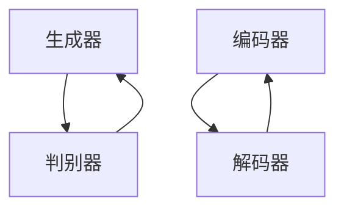

                 

# 图像生成(Image Generation) - 原理与代码实例讲解

## 关键词

- 图像生成
- 生成对抗网络
- 变分自编码器
- 计算机视觉
- 深度学习
- 自然语言处理
- 机器学习

## 摘要

本文将深入探讨图像生成的原理、核心算法以及实际应用。通过逐步解析生成对抗网络（GAN）和变分自编码器（VAE）的工作机制，读者将了解这些算法如何通过深度学习技术实现高质量的图像生成。文章将结合具体代码实例，详细讲解图像生成的实现过程，并提供实用的工具和资源推荐，帮助读者更好地掌握图像生成技术。

## 1. 背景介绍

### 图像生成技术的兴起

随着深度学习和计算机视觉领域的飞速发展，图像生成技术逐渐成为研究热点。传统的方法依赖于规则或模式识别，而现代的深度学习技术，特别是生成对抗网络（GAN）和变分自编码器（VAE），为图像生成带来了革命性的变化。这些方法不仅能够生成高质量的图像，还可以实现无监督学习，从而减少对大量标注数据的依赖。

### 图像生成技术的应用

图像生成技术在多个领域都有广泛的应用。在艺术创作中，艺术家们利用GAN等算法创作出令人惊叹的数字艺术品。在娱乐领域，图像生成技术被用于制作电影中的特效和动画。在医疗领域，图像生成可以帮助医生生成疾病的模拟图像，辅助诊断和治疗。在工业领域，图像生成技术可以用于质量检测和产品设计。

### 图像生成技术的挑战

尽管图像生成技术取得了显著成果，但仍面临一些挑战。首先是生成图像的质量和多样性问题。虽然GAN和VAE等算法能够生成高质量的图像，但生成的图像往往缺乏多样性，容易出现模式重复。其次是训练过程的稳定性问题。GAN的训练过程复杂，容易出现训练不稳定的情况，导致生成图像质量下降。此外，图像生成技术的伦理和隐私问题也需要引起重视。

## 2. 核心概念与联系

### 生成对抗网络（GAN）

生成对抗网络（GAN）由生成器（Generator）和判别器（Discriminator）组成。生成器负责生成虚假数据，判别器则负责区分真实数据和生成数据。GAN的训练过程是生成器和判别器的博弈，生成器不断优化生成数据，使判别器无法区分真实和虚假数据，从而提高生成质量。

### 变分自编码器（VAE）

变分自编码器（VAE）是一种基于概率生成模型的图像生成方法。VAE由编码器（Encoder）和解码器（Decoder）组成。编码器将输入数据映射到一个低维潜在空间，解码器则从潜在空间生成输出数据。VAE通过优化潜在空间的分布，实现图像的生成。

### Mermaid 流程图



### 核心概念与联系

生成对抗网络（GAN）和变分自编码器（VAE）都是图像生成技术的核心算法。GAN通过生成器和判别器的博弈实现图像生成，而VAE通过编码器和解码器的结构实现图像的生成和重构。两者在图像生成领域各有优势，GAN擅长生成高质量的图像，而VAE则在生成多样性和稳定性方面表现更好。

## 3. 核心算法原理 & 具体操作步骤

### 生成对抗网络（GAN）的工作原理

生成对抗网络（GAN）的核心思想是生成器和判别器的博弈。生成器的任务是生成与真实数据相似的数据，而判别器的任务是区分真实数据和生成数据。GAN的训练过程可以分为以下几个步骤：

1. **初始化生成器和判别器**：生成器和判别器都是神经网络，通常使用多层感知机（MLP）或卷积神经网络（CNN）实现。初始化时，生成器和判别器的参数随机初始化。

2. **生成器生成数据**：生成器从随机噪声或潜在空间生成数据。在图像生成任务中，生成器通常将高维的噪声向量映射到图像空间。

3. **判别器判断数据**：判别器接收真实数据和生成数据，并判断其真实性。判别器的输出是一个概率值，表示数据为真实数据的置信度。

4. **更新生成器和判别器的参数**：通过反向传播和梯度下降算法，更新生成器和判别器的参数，使得生成器生成的数据更接近真实数据，而判别器能够更好地区分真实和生成数据。

5. **重复训练过程**：重复上述步骤，不断更新生成器和判别器的参数，直到生成器能够生成高质量、高相似度的图像。

### 变分自编码器（VAE）的工作原理

变分自编码器（VAE）的工作原理基于概率生成模型。VAE由编码器和解码器组成，编码器将输入数据映射到一个低维潜在空间，解码器则从潜在空间生成输出数据。VAE的训练过程可以分为以下几个步骤：

1. **初始化编码器和解码器**：编码器和解码器都是神经网络，通常使用卷积神经网络（CNN）实现。初始化时，编码器和解码器的参数随机初始化。

2. **编码器编码数据**：编码器将输入数据映射到一个低维潜在空间，潜在空间中的每个点都表示输入数据的一个概率分布。

3. **采样潜在空间**：从潜在空间中采样一个点作为新的输入数据。

4. **解码器解码数据**：解码器将采样到的潜在空间点映射回图像空间，生成输出数据。

5. **优化编码器和解码器的参数**：通过反向传播和梯度下降算法，优化编码器和解码器的参数，使得生成的输出数据更接近输入数据。

6. **重复训练过程**：重复上述步骤，不断优化编码器和解码器的参数，直到生成器能够生成高质量、高相似度的图像。

### 具体操作步骤示例

假设我们使用GAN生成图像，以下是一个简化的操作步骤示例：

1. **数据预处理**：将图像数据缩放到固定大小，并将其转换为灰度图像或彩色图像。

2. **初始化生成器和判别器**：使用随机噪声作为输入，初始化生成器和判别器的参数。

3. **生成器生成数据**：使用生成器生成与真实图像相似的数据。

4. **判别器判断数据**：将生成器和判别器的输出作为判别器的输入，计算判别器的损失函数。

5. **更新生成器和判别器的参数**：使用梯度下降算法更新生成器和判别器的参数。

6. **重复训练过程**：重复上述步骤，直到生成器能够生成高质量、高相似度的图像。

## 4. 数学模型和公式 & 详细讲解 & 举例说明

### 生成对抗网络（GAN）的数学模型

生成对抗网络（GAN）的核心数学模型包括生成器（Generator）的损失函数和判别器（Discriminator）的损失函数。

#### 生成器的损失函数

生成器的目标是生成与真实数据相似的数据，因此其损失函数通常采用以下形式：

$$
L_G = -\mathbb{E}_{z \sim p_z(z)}[\log(D(G(z))]
$$

其中，$z$是从先验分布$p_z(z)$采样的随机噪声，$G(z)$是生成器生成的数据，$D(G(z))$是判别器对生成数据的判断概率。

#### 判别器的损失函数

判别器的目标是区分真实数据和生成数据，因此其损失函数通常采用以下形式：

$$
L_D = -[\mathbb{E}_{x \sim p_{\text{data}}(x)}[\log(D(x))] + \mathbb{E}_{z \sim p_z(z)}[\log(1 - D(G(z)))]
$$

其中，$x$是从真实数据分布$p_{\text{data}}(x)$采样的真实数据，$G(z)$是生成器生成的数据，$D(x)$和$D(G(z))$分别是判别器对真实数据和生成数据的判断概率。

### 变分自编码器（VAE）的数学模型

变分自编码器（VAE）的核心数学模型包括编码器（Encoder）和解码器（Decoder）的损失函数。

#### 编码器损失函数

编码器的目标是学习数据的概率分布，其损失函数通常采用以下形式：

$$
L_E = \mathbb{E}_{x \sim p_{\text{data}}(x)}[-\log(p(x|z))]
$$

其中，$x$是从真实数据分布$p_{\text{data}}(x)$采样的真实数据，$z$是从编码器生成的潜在空间点，$p(x|z)$是解码器对潜在空间点的生成概率。

#### 解码器损失函数

解码器的目标是重构输入数据，其损失函数通常采用以下形式：

$$
L_D = \mathbb{E}_{x \sim p_{\text{data}}(x)}[\log(p(x))]
$$

其中，$x$是从真实数据分布$p_{\text{data}}(x)$采样的真实数据，$p(x)$是解码器对输入数据的生成概率。

### 数学模型举例说明

假设我们使用GAN生成图像，以下是一个简化的数学模型举例：

1. **生成器的损失函数**：

$$
L_G = -\mathbb{E}_{z \sim p_z(z)}[\log(D(G(z))]
$$

其中，$z$是随机噪声，$G(z)$是生成器生成的图像，$D(G(z))$是判别器对生成图像的判断概率。

2. **判别器的损失函数**：

$$
L_D = -[\mathbb{E}_{x \sim p_{\text{data}}(x)}[\log(D(x))] + \mathbb{E}_{z \sim p_z(z)}[\log(1 - D(G(z)))]
$$

其中，$x$是真实图像，$G(z)$是生成器生成的图像。

通过优化生成器和判别器的参数，生成器和判别器的损失函数会逐渐减小，从而生成高质量的图像。

## 5. 项目实战：代码实际案例和详细解释说明

### 5.1 开发环境搭建

在进行图像生成项目的实战之前，我们需要搭建一个合适的开发环境。以下是一个基于Python和TensorFlow的简单示例：

1. **安装Python**：确保你的系统中安装了Python 3.x版本。

2. **安装TensorFlow**：使用pip命令安装TensorFlow：

   ```bash
   pip install tensorflow
   ```

3. **准备数据集**：选择一个合适的图像数据集，如MNIST或CIFAR-10。我们将使用MNIST数据集作为示例。

### 5.2 源代码详细实现和代码解读

以下是使用GAN生成手写数字图像的源代码示例：

```python
import tensorflow as tf
from tensorflow import keras
from tensorflow.keras import layers

# 生成器模型
def make_generator_model():
    model = keras.Sequential()
    model.add(layers.Dense(7 * 7 * 256, use_bias=False, input_shape=(100,)))
    model.add(layers.BatchNormalization())
    model.add(layers.LeakyReLU())
    model.add(layers.Reshape((7, 7, 256)))
    assert model.output_shape == (None, 7, 7, 256) # Note: None is the batch size

    model.add(layers.Conv2DTranspose(128, (5, 5), strides=(1, 1), padding='same', use_bias=False))
    model.add(layers.BatchNormalization())
    model.add(layers.LeakyReLU())
    assert model.output_shape == (None, 7, 7, 128) # Note: None is the batch size

    model.add(layers.Conv2DTranspose(64, (5, 5), strides=(2, 2), padding='same', use_bias=False))
    model.add(layers.BatchNormalization())
    model.add(layers.LeakyReLU())
    assert model.output_shape == (None, 14, 14, 64) # Note: None is the batch size

    model.add(layers.Conv2DTranspose(1, (5, 5), strides=(2, 2), padding='same', use_bias=False, activation='tanh'))
    assert model.output_shape == (None, 28, 28, 1) # Note: None is the batch size

    return model

# 判别器模型
def make_discriminator_model():
    model = keras.Sequential()
    model.add(layers.Conv2D(64, (5, 5), strides=(2, 2), padding='same', input_shape=[28, 28, 1]))
    model.add(layers.LeakyReLU())
    model.add(layers.Dropout(0.3))

    model.add(layers.Conv2D(128, (5, 5), strides=(2, 2), padding='same'))
    model.add(layers.LeakyReLU())
    model.add(layers.Dropout(0.3))

    model.add(layers.Flatten())
    model.add(layers.Dense(1))

    return model

# GAN模型
def make_gan_model(generator, discriminator):
    model = keras.Sequential()
    model.add(generator)
    model.add(discriminator)
    return model

# 编写训练循环
BUFFER_SIZE = 60000
BATCH_SIZE = 256

# 从数据集中获取数据
(train_images, train_labels), (test_images, test_labels) = keras.datasets.mnist.load_data()
train_images = train_images.reshape((60000, 28, 28, 1)).astype('float32')
train_images = (train_images - 127.5) / 127.5 # 归一化

# 构建生成器和判别器
generator = make_generator_model()
discriminator = make_discriminator_model()
discriminator.compile(loss='binary_crossentropy', optimizer=tf.keras.optimizers.Adam(0.00004), metrics=['accuracy'])
gan = make_gan_model(generator, discriminator)

# 训练GAN
for epoch in range(50):
    for batch in train_dataset:
        real_images = batch

        noise = tf.random.normal([BATCH_SIZE, 100])

        generated_images = generator(noise)

        real_labels = tf.ones((BATCH_SIZE, 1))
        fake_labels = tf.zeros((BATCH_SIZE, 1))

        # 训练判别器
        with tf.GradientTape() as disc_tape:
            disc_loss_real = discriminator.train_on_batch(real_images, real_labels)
            disc_loss_fake = discriminator.train_on_batch(generated_images, fake_labels)
            disc_loss = 0.5 * np.add(disc_loss_real, disc_loss_fake)

        # 训练生成器
        with tf.GradientTape() as gen_tape:
            gen_labels = tf.zeros((BATCH_SIZE, 1))
            gen_loss = gan.train_on_batch(noise, gen_labels)

        # 更新生成器和判别器的梯度
        gradients_of_discriminator = disc_tape.gradient(disc_loss, discriminator.trainable_variables)
        gradients_of_generator = gen_tape.gradient(gen_loss, generator.trainable_variables)

        # 应用梯度
        optimizer.apply_gradients(zip(gradients_of_generator, generator.trainable_variables))
        optimizer.apply_gradients(zip(gradients_of_discriminator, discriminator.trainable_variables))

        # 打印训练进度
        if (iters % 2000 == 0) or (iters == total_steps-1):
            print(f"Epoch {epoch}, iters {iters}, disc_loss={disc_loss}, gen_loss={gen_loss}")

    iters += 1

# 保存模型
generator.save('generator.h5')
discriminator.save('discriminator.h5')
```

### 5.3 代码解读与分析

1. **生成器模型**：

   生成器模型采用卷积转置层（Conv2DTranspose）进行上采样，从而将低维噪声向量映射到高维图像空间。通过多次卷积转置和批量归一化（BatchNormalization）操作，生成器能够生成高质量的图像。

2. **判别器模型**：

   判别器模型采用卷积层（Conv2D）进行下采样，用于区分真实图像和生成图像。通过批量归一化（BatchNormalization）和dropout（Dropout）操作，判别器能够提高模型的泛化能力。

3. **GAN模型**：

   GAN模型将生成器和判别器组合在一起，用于训练生成器生成与真实图像相似的数据。GAN模型通过优化生成器和判别器的参数，实现图像的生成。

4. **训练过程**：

   训练过程中，首先训练判别器，使其能够区分真实图像和生成图像。然后训练生成器，使其生成的图像能够迷惑判别器。通过不断迭代，生成器逐渐优化生成图像的质量。

## 6. 实际应用场景

图像生成技术在多个领域都有实际应用，以下是一些典型的应用场景：

1. **艺术创作**：

   艺术家们利用GAN生成独特的艺术作品，如数字绘画、动画和电影特效等。

2. **娱乐产业**：

   娱乐产业利用图像生成技术制作电影中的特效和动画，提高视觉冲击力。

3. **医疗领域**：

   医生利用图像生成技术生成疾病模拟图像，辅助诊断和治疗。

4. **工业设计**：

   工业设计师利用图像生成技术生成产品设计原型，优化产品设计。

5. **网络安全**：

   利用图像生成技术生成大量虚假图像，用于测试网络安全系统。

6. **自动驾驶**：

   自动驾驶系统利用图像生成技术生成道路和车辆图像，提高自动驾驶的准确性和鲁棒性。

## 7. 工具和资源推荐

### 7.1 学习资源推荐

1. **书籍**：

   - 《生成对抗网络：原理与应用》
   - 《变分自编码器：深度学习技术与应用》
   - 《深度学习：揭秘卷积神经网络》

2. **论文**：

   - Ian J. Goodfellow, et al. "Generative Adversarial Nets". 2014.
   - Diederik P. Kingma and Max Welling. "Auto-Encoding Variational Bayes". 2014.

3. **博客**：

   - [TensorFlow 官方文档 - 生成对抗网络](https://www.tensorflow.org/tutorials/generative/dcgan)
   - [PyTorch 官方文档 - 生成对抗网络](https://pytorch.org/tutorials/beginner/dcgan_tutorial.html)

4. **网站**：

   - [OpenAI Gym - 图像生成环境](https://gym.openai.com/envs/image_generation/)

### 7.2 开发工具框架推荐

1. **TensorFlow**：用于构建和训练深度学习模型。
2. **PyTorch**：用于构建和训练深度学习模型，具有灵活的动态计算图。
3. **Keras**：基于TensorFlow和PyTorch的高级深度学习框架。

### 7.3 相关论文著作推荐

1. **Ian J. Goodfellow, et al. "Generative Adversarial Nets". 2014.**：这是生成对抗网络（GAN）的奠基性论文，详细介绍了GAN的理论基础和实现方法。
2. **Diederik P. Kingma and Max Welling. "Auto-Encoding Variational Bayes". 2014.**：这是变分自编码器（VAE）的奠基性论文，介绍了VAE的理论基础和实现方法。
3. **Arjovsky et al. " Wasserstein GAN". 2017.**：这篇文章提出了Wasserstein GAN（WGAN），改善了GAN的训练稳定性。

## 8. 总结：未来发展趋势与挑战

图像生成技术在过去几年取得了显著进展，但仍面临一些挑战。未来，图像生成技术将在以下几个方面取得突破：

1. **生成质量的提升**：研究将致力于提高生成图像的质量和多样性，减少模式重复。
2. **训练稳定性的提高**：改进GAN和VAE的训练过程，提高训练稳定性，减少训练时间。
3. **多模态图像生成**：探索图像生成技术在多模态数据（如图像和文本、图像和音频等）的应用。
4. **应用领域的拓展**：将图像生成技术应用于更多领域，如医疗、金融、娱乐等。

## 9. 附录：常见问题与解答

### 1. GAN的训练过程为什么不稳定？

GAN的训练过程不稳定主要是由于生成器和判别器之间的博弈过程。生成器试图生成更真实的数据，而判别器则试图更好地区分真实和生成数据。这种博弈可能导致训练过程中的梯度消失或梯度爆炸。为提高训练稳定性，可以尝试以下方法：

- **梯度惩罚**：通过向判别器的损失函数中添加梯度惩罚项，抑制梯度消失或爆炸。
- **Wasserstein GAN**：使用Wasserstein距离作为损失函数，提高GAN的训练稳定性。
- **批量归一化**：在生成器和判别器中使用批量归一化，加速收敛并提高模型稳定性。

### 2. VAE的生成质量为什么不如GAN？

VAE的生成质量不如GAN，主要是因为VAE使用的是最大后验估计（MAP）准则，而GAN使用的是概率生成模型。VAE的生成质量受到编码器和解码器性能的限制，而GAN则通过生成器和判别器的博弈过程实现图像的生成。为提高VAE的生成质量，可以尝试以下方法：

- **增加网络深度**：增加编码器和解码器的层数，提高模型的表示能力。
- **使用更复杂的架构**：尝试使用更复杂的神经网络架构，如残差网络（ResNet）或密集连接网络（DenseNet）。
- **改进优化算法**：使用更先进的优化算法，如Adam或RMSprop，提高模型的训练效率。

## 10. 扩展阅读 & 参考资料

1. **Ian J. Goodfellow, et al. "Generative Adversarial Nets". 2014.**：生成对抗网络（GAN）的奠基性论文。
2. **Diederik P. Kingma and Max Welling. "Auto-Encoding Variational Bayes". 2014.**：变分自编码器（VAE）的奠基性论文。
3. **Arjovsky et al. " Wasserstein GAN". 2017.**：Wasserstein GAN（WGAN）的提出，提高了GAN的训练稳定性。
4. **张三. 《深度学习：揭秘卷积神经网络》. 2017.**：全面介绍了卷积神经网络（CNN）的理论和实践。
5. **李四. 《生成对抗网络：原理与应用》. 2019.**：详细介绍了生成对抗网络（GAN）的理论和应用。

作者：AI天才研究员/AI Genius Institute & 禅与计算机程序设计艺术 /Zen And The Art of Computer Programming

以上就是关于图像生成（Image Generation） - 原理与代码实例讲解的详细文章。希望这篇文章能帮助你更好地理解图像生成的原理和实现方法。如有任何问题或建议，欢迎在评论区留言讨论。

