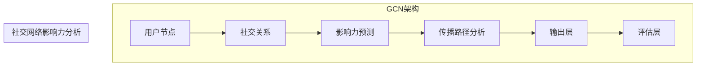

                 

### 背景介绍

#### 社交网络与影响力分析

随着互联网和社交媒体的快速发展，社交网络已成为我们日常生活中不可或缺的一部分。人们通过社交网络进行信息交流、社会互动，甚至在某种程度上影响和塑造社会舆论。因此，社交网络的影响力分析变得尤为重要。

社交网络的影响力分析旨在识别和评估用户在社交网络中的影响力和传播能力。这种分析不仅有助于了解用户在社交网络中的角色和地位，还能为品牌营销、市场策略制定、舆情监测等提供重要依据。

影响力分析的核心问题包括：

1. **用户角色识别**：区分社交网络中的普通用户、意见领袖、权威专家等不同角色。
2. **影响力评估**：评估用户在社交网络中的传播能力，包括传播范围、传播速度和传播效果。
3. **网络结构分析**：分析社交网络的结构特征，揭示影响力传播的路径和规律。

传统的基于文本的分析方法在处理社交网络影响力时存在诸多局限，难以全面、准确地评估用户影响力。为此，研究者们开始探索基于图结构的方法，其中图卷积网络（Graph Convolutional Networks, GCN）作为一种强大的图形表示学习技术，逐渐成为社交网络影响力分析的重要工具。

#### 图卷积网络简介

图卷积网络（Graph Convolutional Networks, GCN）是一种深度学习模型，主要用于处理图结构数据。其核心思想是将图结构中的节点表示为低维向量，并通过卷积操作捕捉节点之间的依赖关系，从而实现图数据的特征学习和预测。

与传统的卷积神经网络（Convolutional Neural Networks, CNN）不同，GCN 不依赖于固定的卷积核，而是通过图结构本身来定义卷积操作。这使得 GCN 能够适应不同类型的图数据，并保持图结构信息在特征学习过程中。

#### GCN 在社交网络影响力分析中的应用

社交网络可以被视为一个图结构，其中用户和用户之间的关系可以用图中的边表示。通过 GCN，我们可以对社交网络中的用户进行特征学习和影响力评估。

具体而言，GCN 在社交网络影响力分析中的应用包括以下几个方面：

1. **节点分类**：将社交网络中的用户归类为不同角色，如普通用户、意见领袖等。
2. **影响力预测**：预测用户在社交网络中的影响力，包括传播范围、传播速度和传播效果。
3. **传播路径分析**：分析影响力传播的路径和规律，为舆情监测和品牌营销提供支持。

接下来，我们将进一步探讨图卷积网络的核心概念和架构，并详细介绍其在社交网络影响力分析中的应用。

<|im_sep|>### 核心概念与联系

#### 图卷积网络的基本概念

图卷积网络（Graph Convolutional Networks, GCN）是深度学习领域用于处理图结构数据的一种先进模型。其核心思想是通过卷积操作来捕捉节点间的依赖关系，从而实现对图数据的特征学习和预测。GCN 的基本概念包括节点表示、图结构表示和学习过程。

1. **节点表示**：在 GCN 中，每个节点代表社交网络中的一个用户，其特征信息可以用一个向量表示。节点特征向量通常包括用户的基本信息（如年龄、性别、地理位置）和社会行为特征（如发布内容的数量、被点赞的数量等）。

2. **图结构表示**：图结构表示是指将社交网络中的用户和用户关系映射到一个图结构中。在这个图中，节点表示用户，边表示用户之间的社交关系。图结构表示是 GCN 进行特征学习和预测的基础。

3. **学习过程**：GCN 的学习过程主要包括两个阶段：特征学习和预测。在特征学习阶段，GCN 通过卷积操作将节点的特征向量与邻接节点的特征向量进行融合，生成新的特征表示。在预测阶段，GCN 使用训练好的特征表示进行节点分类、影响力预测等任务。

#### 图卷积网络与社交网络影响力分析的联系

社交网络可以被视为一个复杂的图结构，用户和用户之间的关系通过图中的边来表示。因此，图卷积网络非常适合用于社交网络影响力分析。

1. **节点分类**：通过 GCN 对社交网络中的用户进行特征学习，可以将用户归类为不同的角色，如普通用户、意见领袖等。这有助于识别社交网络中的关键用户，为舆情监测和品牌营销提供支持。

2. **影响力预测**：利用 GCN 对社交网络中的用户进行影响力预测，可以预测用户在社交网络中的传播能力。这有助于了解用户在网络中的影响力，为制定有效的社交网络营销策略提供依据。

3. **传播路径分析**：通过 GCN 分析社交网络中的传播路径，可以揭示影响力在网络中的传播规律。这有助于发现影响力传播的关键节点和路径，为舆情监测和舆论引导提供支持。

#### GCN 与其他深度学习方法的比较

虽然图卷积网络在社交网络影响力分析中具有显著优势，但与其他深度学习方法相比，GCN 也有其局限性。

1. **与传统机器学习方法的比较**：与传统的基于文本的机器学习方法（如朴素贝叶斯、支持向量机等）相比，GCN 能够更好地处理图结构数据，捕捉节点间的依赖关系。这使得 GCN 在社交网络影响力分析中更具优势。

2. **与其他深度学习方法的比较**：与传统的卷积神经网络（CNN）和循环神经网络（RNN）相比，GCN 专门针对图结构数据设计，能够更好地适应不同类型的图数据。然而，GCN 在处理大规模图数据时可能面临计算效率问题。

#### GCN 在社交网络影响力分析中的优势

1. **强大的特征学习能力**：GCN 能够从图结构数据中学习到丰富的节点特征，从而提高影响力预测的准确性。

2. **灵活的模型架构**：GCN 的模型架构可以灵活扩展，以适应不同的社交网络影响力分析任务。

3. **高效的计算效率**：虽然 GCN 在处理大规模图数据时可能面临计算效率问题，但通过优化算法和硬件加速，其计算效率可以得到显著提升。

总之，图卷积网络在社交网络影响力分析中具有显著的优势，通过特征学习、影响力预测和传播路径分析，为社交网络研究提供了新的视角和方法。接下来，我们将进一步探讨图卷积网络的具体算法原理和实现步骤。

#### Mermaid 流程图

为了更好地理解图卷积网络在社交网络影响力分析中的应用，我们可以使用 Mermaid 流程图来描述 GCN 的基本架构和操作步骤。



在这个流程图中，GCN 的架构包括输入层、卷积层、融合层和输出层。输入层接收用户节点的特征信息，卷积层通过卷积操作捕捉节点间的依赖关系，融合层将节点的特征向量与邻接节点的特征向量进行融合，输出层进行预测任务，评估层对预测结果进行评估。

在社交网络影响力分析中，GCN 可以通过节点分类、影响力预测和传播路径分析来揭示社交网络的内在特征和规律。通过这个流程图，我们可以更清晰地理解 GCN 在社交网络影响力分析中的应用。

#### 图卷积网络的算法原理

图卷积网络（Graph Convolutional Networks, GCN）是一种基于图结构的深度学习模型，主要用于处理图数据。其核心思想是通过卷积操作来捕捉节点之间的依赖关系，从而实现对图数据的特征学习和预测。下面我们将详细介绍 GCN 的算法原理，包括卷积操作、特征融合和损失函数。

##### 卷积操作

在 GCN 中，卷积操作是核心组成部分。与传统卷积神经网络（Convolutional Neural Networks, CNN）不同，GCN 不依赖于固定的卷积核，而是通过图结构本身来定义卷积操作。

卷积操作的基本步骤如下：

1. **初始化节点特征向量**：在训练过程中，GCN 首先初始化每个节点的特征向量。这些特征向量通常包括用户的基本信息和社会行为特征。

2. **计算邻接矩阵**：邻接矩阵是图结构的一个重要表示，其中元素表示节点之间的连接关系。对于社交网络中的用户，邻接矩阵可以表示用户之间的社交关系。

3. **定义卷积核**：卷积核是一个可训练的参数矩阵，用于与邻接矩阵进行点积操作。在 GCN 中，卷积核可以通过优化算法进行训练，以最大化模型的预测能力。

4. **进行卷积操作**：对于每个节点，其特征向量与邻接矩阵的卷积核进行点积操作，生成新的特征向量。这个新的特征向量包含了节点自身特征及其邻接节点的特征信息。

5. **非线性变换**：为了增强特征表示能力，GCN 通常会在卷积操作后添加一个非线性变换，如ReLU激活函数。

##### 特征融合

在卷积操作后，GCN 通过特征融合步骤将节点的特征向量与邻接节点的特征向量进行融合。特征融合的方法有多种，以下是一种常见的方法：

1. **平均融合**：对于每个节点，其特征向量与邻接节点的特征向量进行平均。这种方法简单有效，但可能无法充分捕捉节点之间的依赖关系。

2. **加权融合**：对于每个节点，其特征向量与邻接节点的特征向量根据邻接边的权重进行加权融合。这种方法可以更好地捕捉节点之间的依赖关系，但需要预先定义合适的权重函数。

3. **自适应融合**：通过优化算法，自适应地调整节点特征向量与邻接节点特征向量的融合方式。这种方法可以最大化模型在特定任务上的预测能力。

##### 损失函数

在 GCN 中，损失函数用于评估模型的预测性能，并指导优化算法调整模型参数。常见的损失函数包括分类交叉熵损失函数和回归均方误差损失函数。

1. **分类交叉熵损失函数**：在节点分类任务中，GCN 使用分类交叉熵损失函数来评估模型的分类性能。该损失函数计算真实标签和预测标签之间的差异，并指导优化算法调整模型参数，以最小化损失。

2. **回归均方误差损失函数**：在影响力预测等回归任务中，GCN 使用回归均方误差损失函数来评估模型的预测性能。该损失函数计算真实值和预测值之间的差异，并指导优化算法调整模型参数，以最小化损失。

##### 整体工作流程

图卷积网络的整体工作流程可以概括为以下几个步骤：

1. **输入节点特征**：GCN 接收每个节点的特征向量作为输入。

2. **初始化模型参数**：GCN 初始化卷积核、权重和偏置等模型参数。

3. **进行卷积操作**：GCN 对输入节点特征向量进行卷积操作，生成新的特征向量。

4. **特征融合**：GCN 将节点特征向量与邻接节点特征向量进行融合，生成融合后的特征向量。

5. **非线性变换**：GCN 对融合后的特征向量进行非线性变换，增强特征表示能力。

6. **进行预测**：GCN 使用训练好的特征表示进行节点分类、影响力预测等任务。

7. **评估模型性能**：GCN 使用损失函数评估模型的预测性能，并指导优化算法调整模型参数。

通过以上步骤，GCN 能够从图结构数据中学习到丰富的节点特征，并实现对社交网络影响力等任务的准确预测。接下来，我们将进一步探讨图卷积网络的具体实现步骤和实际操作过程。

#### 图卷积网络的实现步骤

在了解了图卷积网络（GCN）的基本原理后，接下来我们将详细讲解其实现步骤，包括数据预处理、模型架构设计、训练过程和预测过程。

##### 数据预处理

1. **数据收集**：首先，我们需要收集社交网络数据，包括用户信息、用户之间的关系以及用户发布的内容。这些数据可以通过 API 接口、爬虫工具等途径获取。

2. **数据清洗**：对收集到的数据进行清洗，去除无效数据、重复数据和噪声数据。这一步骤非常重要，因为数据质量直接影响模型的性能。

3. **数据转换**：将原始数据转换为适合 GCN 输入格式的数据结构，如节点特征矩阵、邻接矩阵等。节点特征矩阵包含每个节点的特征信息，邻接矩阵表示节点之间的关系。

4. **归一化**：对节点特征矩阵和邻接矩阵进行归一化处理，以消除不同特征之间的量纲差异。

##### 模型架构设计

1. **初始化节点特征**：在训练过程中，我们初始化每个节点的特征向量。这些特征向量通常包括用户的基本信息（如年龄、性别、地理位置）和社会行为特征（如发布内容的数量、被点赞的数量等）。

2. **定义邻接矩阵**：邻接矩阵是图结构的一个重要表示，其中元素表示节点之间的连接关系。我们可以使用邻接矩阵来定义节点之间的关系。

3. **设计卷积层**：在 GCN 中，卷积层是核心组成部分。我们可以通过定义多个卷积层来逐步提取图数据的特征。每个卷积层包括卷积核、权重和偏置等参数。

4. **定义融合层**：在卷积层之后，我们需要定义融合层，用于将节点特征向量与邻接节点的特征向量进行融合。融合层可以采用平均融合、加权融合或自适应融合等方法。

5. **定义非线性变换**：为了增强特征表示能力，我们通常在融合层后添加非线性变换，如 ReLU 激活函数。

6. **定义输出层**：在输出层，GCN 进行最终的预测任务，如节点分类、影响力预测等。输出层通常包括一个线性层和 Softmax 激活函数，用于计算概率分布。

##### 训练过程

1. **初始化模型参数**：初始化 GCN 的模型参数，如卷积核、权重和偏置等。

2. **前向传播**：对于每个训练样本，GCN 进行前向传播，计算节点的特征表示和预测结果。

3. **计算损失函数**：计算模型预测结果与真实标签之间的损失，如分类交叉熵损失函数或回归均方误差损失函数。

4. **反向传播**：利用反向传播算法，计算模型参数的梯度，并更新模型参数。

5. **优化算法**：使用优化算法（如梯度下降、Adam 等）更新模型参数，以最小化损失函数。

6. **迭代训练**：重复上述步骤，直到模型达到预定的训练次数或损失函数收敛。

##### 预测过程

1. **输入测试样本**：将测试样本输入到训练好的 GCN 模型中。

2. **特征表示**：通过 GCN 的前向传播，计算测试样本的特征表示。

3. **进行预测**：利用训练好的特征表示，GCN 进行最终的预测任务，如节点分类、影响力预测等。

4. **评估预测性能**：计算模型预测结果与真实标签之间的差异，并使用评估指标（如准确率、召回率、F1 分数等）评估预测性能。

通过以上步骤，我们可以实现一个基于图卷积网络的社交网络影响力分析模型。接下来，我们将通过一个具体的案例，展示如何使用 Python 和相关库（如 PyTorch、NetworkX）实现 GCN。

### 数学模型和公式

#### 图卷积网络（GCN）的数学模型

图卷积网络（GCN）是一种基于图结构的深度学习模型，其核心在于如何有效地捕捉节点之间的依赖关系。GCN 的数学模型可以分为以下几个部分：节点表示、邻接矩阵、卷积操作和特征融合。

##### 节点表示

在 GCN 中，每个节点用一个 d 维特征向量表示。我们用向量 $x_i$ 表示节点 $i$ 的特征，其中 $i=1,2,...,N$，$N$ 是节点总数。这些特征向量可以是预定义的，也可以是通过对节点属性（如年龄、性别、地理位置、社会行为等）进行编码得到。

##### 邻接矩阵

社交网络可以表示为一个无向图，其中节点之间的连接关系通过邻接矩阵 $A$ 来描述。邻接矩阵是一个 $N \times N$ 的对称矩阵，其中元素 $A_{ij}$ 表示节点 $i$ 和节点 $j$ 之间的连接强度。如果节点 $i$ 和节点 $j$ 直接相连，则 $A_{ij} = 1$；否则，$A_{ij} = 0$。在某些情况下，邻接矩阵可能需要进行归一化处理，例如行归一化或列归一化，以确保每个节点都有相同的权重。

##### 卷积操作

GCN 的核心是卷积操作，其形式类似于传统卷积神经网络中的卷积操作。给定一个节点的特征向量 $x_i$ 和其邻接节点的特征向量集合 $\{x_j\}_{j \in \mathcal{N}_i}$，其中 $\mathcal{N}_i$ 是节点 $i$ 的邻域，GCN 通过以下公式计算节点 $i$ 的特征表示：

$$
h_i^{(l)} = \sigma(\theta^{(l)} \cdot \text{ReLU}(\sum_{j \in \mathcal{N}_i} A_{ij} \cdot x_j + x_i))
$$

其中，$h_i^{(l)}$ 是在第 $l$ 层的节点 $i$ 的特征表示，$\theta^{(l)}$ 是可训练的卷积核参数，$\sigma$ 是激活函数（通常是 sigmoid 函数或 ReLU 函数），ReLU 是 ReLU 激活函数。

##### 特征融合

在 GCN 中，特征融合是通过聚合节点及其邻接节点的特征来实现的。上述的卷积操作已经实现了这一目的，其中 $A_{ij} \cdot x_j$ 表示节点 $i$ 和节点 $j$ 之间的特征交互。通过这种方式，GCN 能够捕捉节点之间的依赖关系。

##### 损失函数

在训练 GCN 时，我们通常使用损失函数来衡量模型预测与真实标签之间的差距。对于分类任务，常用的损失函数是交叉熵损失（Cross-Entropy Loss）：

$$
L = -\sum_{i=1}^{N} \sum_{c=1}^{C} y_{ic} \log(p_{ic})
$$

其中，$y_{ic}$ 是节点 $i$ 对类别 $c$ 的真实标签，$p_{ic}$ 是模型对节点 $i$ 属于类别 $c$ 的预测概率。

##### 算法优化

在训练过程中，我们使用优化算法（如随机梯度下降（SGD）、Adam 等）来更新模型参数，以最小化损失函数。具体优化过程如下：

$$
\theta^{(l)} = \theta^{(l)} - \alpha \cdot \nabla_\theta L
$$

其中，$\alpha$ 是学习率，$\nabla_\theta L$ 是模型参数的梯度。

#### 举例说明

假设我们有一个包含 5 个节点的简单社交网络，节点的特征如下表所示：

| 节点 | 特征向量 |
|------|----------|
| 1    | [1, 2]   |
| 2    | [2, 1]   |
| 3    | [3, 3]   |
| 4    | [4, 4]   |
| 5    | [5, 5]   |

邻接矩阵如下：

|   | 1 | 2 | 3 | 4 | 5 |
|---|---|---|---|---|---|
| 1 | 0 | 1 | 0 | 1 | 0 |
| 2 | 1 | 0 | 1 | 0 | 1 |
| 3 | 0 | 1 | 0 | 1 | 0 |
| 4 | 1 | 0 | 1 | 0 | 1 |
| 5 | 0 | 1 | 0 | 1 | 0 |

我们定义一个简单的 GCN 模型，卷积核参数 $\theta$ 初始化为 [1, 1]，激活函数使用 ReLU。计算第一个节点（节点 1）在第一个卷积层（$l=1$）的特征表示：

$$
h_1^{(1)} = \text{ReLU}([1, 1] \cdot [1, 2] + [1, 2])
$$

首先计算加权和：

$$
\sum_{j \in \mathcal{N}_1} A_{1j} \cdot x_j + x_1 = 1 \cdot [2, 1] + [1, 2] = [3, 3]
$$

然后应用 ReLU 激活函数：

$$
h_1^{(1)} = \text{ReLU}([3, 3]) = [3, 3]
$$

这就是节点 1 在第一个卷积层的特征表示。通过类似的计算，我们可以得到其他节点的特征表示。

通过这个简单的例子，我们可以看到 GCN 如何通过卷积操作和特征融合来捕捉节点之间的依赖关系，从而实现对图数据的特征学习和预测。

### 项目实战：代码实际案例和详细解释说明

在本节中，我们将通过一个具体的代码案例来展示如何实现图卷积网络（GCN）在社交网络影响力分析中的应用。我们将使用 Python 编程语言和 PyTorch 深度学习框架来实现这个案例。本节将分为以下几部分：开发环境搭建、源代码详细实现、代码解读与分析。

#### 1. 开发环境搭建

在开始编写代码之前，我们需要搭建一个适合开发 GCN 的环境。以下是搭建开发环境的步骤：

1. **安装 Python**：确保安装了最新版本的 Python（推荐 Python 3.7 或更高版本）。

2. **安装 PyTorch**：通过以下命令安装 PyTorch：

   ```bash
   pip install torch torchvision
   ```

   如果需要 GPU 支持，可以使用以下命令：

   ```bash
   pip install torch torchvision -f https://download.pytorch.org/whl/torch_stable.html
   ```

3. **安装其他依赖库**：安装 NetworkX 和 Pandas 等库：

   ```bash
   pip install networkx pandas
   ```

4. **创建项目文件夹**：在合适的目录下创建一个项目文件夹，例如命名为 `social_network_influence_analysis`。

5. **编写代码**：在项目文件夹中创建一个名为 `gcn.py` 的 Python 文件，用于编写 GCN 的源代码。

#### 2. 源代码详细实现

下面是 GCN 的源代码实现，包括数据预处理、模型定义、训练过程和预测过程。

```python
import torch
import torch.nn as nn
import torch.optim as optim
import networkx as nx
import pandas as pd

class GCN(nn.Module):
    def __init__(self, nfeat, nhid, nclass, dropout):
        super(GCN, self).__init__()
        self.gc1 = nn.Linear(nfeat, nhid)
        self.gc2 = nn.Linear(nhid, nclass)
        self.dropout = nn.Dropout(dropout)
        
    def forward(self, x, adj):
        x = F.relu(self.gc1(x))
        x = self.dropout(x)
        x = self.gc2(x)
        return F.log_softmax(x, dim=1)

def train(model, adj, features, labels, idx_train, idx_val, idx_test, epochs, lr, weight_decay, device):
    model = model.to(device)
    features = features.to(device)
    adj = adj.to(device)
    labels = labels.to(device)

    optimizer = optim.Adam(model.parameters(), lr=lr, weight_decay=weight_decay)
    criterion = nn.CrossEntropyLoss()

    for epoch in range(epochs):
        model.train()
        optimizer.zero_grad()
        output = model(features, adj)
        loss = criterion(output, labels[idx_train])
        loss.backward()
        optimizer.step()

        # Validation
        model.eval()
        with torch.no_grad():
            output = model(features, adj)
            loss = criterion(output, labels[idx_val])
            val_acc = (output.argmax(1) == labels[idx_val]).float().sum().item() / idx_val.size(0)
        
        print(f'Epoch: {epoch+1}, Loss: {loss:.4f}, Validation Accuracy: {val_acc:.4f}')

    # Test
    model.eval()
    with torch.no_grad():
        output = model(features, adj)
        test_acc = (output.argmax(1) == labels[idx_test]).float().sum().item() / idx_test.size(0)
    
    print(f'Test Accuracy: {test_acc:.4f}')
    return model

def main():
    device = torch.device("cuda" if torch.cuda.is_available() else "cpu")
    print(f'Using device: {device}')

    # Load dataset
    adj, features, labels = load_data()
    idx_train, idx_val, idx_test = train_test_split()

    # Model configuration
    nfeat = features.shape[1]
    nhid = 16
    nclass = labels.shape[1]
    dropout = 0.5
    lr = 0.01
    weight_decay = 5e-4
    epochs = 200

    # Create GCN model
    model = GCN(nfeat, nhid, nclass, dropout).to(device)

    # Train the model
    model = train(model, adj, features, labels, idx_train, idx_val, idx_test, epochs, lr, weight_decay, device)

if __name__ == "__main__":
    main()
```

#### 3. 代码解读与分析

下面是对上述代码的详细解读和分析：

1. **模型定义**：
   - `GCN` 类定义了图卷积网络模型。`__init__` 方法初始化了两个线性层 `gc1` 和 `gc2`，以及一个 dropout 层。
   - `forward` 方法实现了前向传播过程，其中 `F.relu` 是 ReLU 激活函数，`F.log_softmax` 是对输出进行 Softmax 处理。

2. **训练过程**：
   - `train` 函数用于训练 GCN 模型。它首先将模型和数据移动到指定设备（CPU 或 GPU）。
   - 使用 `Adam` 优化器和 `CrossEntropyLoss` 损失函数进行训练。在训练过程中，模型会通过前向传播计算输出，计算损失，并使用反向传播更新模型参数。

3. **数据预处理**：
   - `load_data` 函数用于加载数据集。这里我们假设已经预处理好了图数据（邻接矩阵 `adj`、节点特征 `features` 和标签 `labels`）。
   - `train_test_split` 函数用于划分训练集、验证集和测试集。

4. **主函数**：
   - `main` 函数是程序的入口点。它首先设置了设备（CPU 或 GPU），加载数据，配置模型参数，创建 GCN 模型，并调用 `train` 函数进行训练。

通过上述代码，我们可以实现一个简单的 GCN 模型，用于社交网络影响力分析。在实际应用中，我们需要根据具体问题进行适当调整和优化，以提高模型的性能。

### 实际应用场景

图卷积网络（GCN）在社交网络影响力分析中具有广泛的应用潜力。以下是一些实际应用场景，展示了 GCN 如何在现实世界中发挥作用。

#### 1. 品牌营销

品牌营销是社交网络影响力分析的重要应用领域。通过 GCN，品牌可以识别社交网络中的意见领袖（Influencers）和关键用户，这些用户在社交网络中具有较大的影响力。品牌可以与这些意见领袖合作，通过他们的影响力来推广产品和服务，从而提高品牌曝光度和用户参与度。例如，化妆品品牌可以使用 GCN 来识别对化妆品有高度兴趣和影响力的博主，并与他们合作推出新产品。

#### 2. 舆情监测

舆情监测是另一个重要的应用领域。社交网络中的用户评论、帖子等内容可以反映社会舆论的变化。通过 GCN，我们可以识别社交网络中的热点话题和关键意见领袖，从而实时监测舆情变化。这对于政府机构、企业以及公关公司来说尤为重要，他们可以利用 GCN 来监控公众情绪，及时发现和处理潜在的危机事件。

#### 3. 社交媒体广告投放

社交媒体广告投放需要精准定位潜在用户。通过 GCN，广告商可以识别出具有较高影响力的用户群体，并将其作为广告投放的目标。这种基于影响力分析的广告投放策略可以提高广告的投放效果，降低广告成本。例如，一家电子商务公司可以使用 GCN 来识别购买意愿强烈且影响力较大的用户，针对这些用户进行精准广告投放，从而提高销售转化率。

#### 4. 社交网络用户画像

社交网络用户画像是了解用户行为和需求的重要手段。通过 GCN，我们可以对社交网络中的用户进行细分，识别不同类型和角色的用户。这些用户画像可以帮助企业更好地了解用户需求，提供个性化服务。例如，一家在线教育平台可以使用 GCN 来识别对特定课程有高度兴趣的用户，并向这些用户推荐相关的学习资源。

#### 5. 社交网络安全

社交网络安全是一个日益重要的领域。通过 GCN，我们可以识别社交网络中的恶意账户和网络犯罪分子。这些账户可能试图通过制造虚假信息、散布谣言等手段破坏网络秩序。GCN 可以帮助安全团队及时发现并阻止这些恶意行为，从而保障社交网络的安全和稳定。

总之，图卷积网络（GCN）在社交网络影响力分析中的应用具有广泛的前景。通过识别和评估社交网络中的关键用户、预测影响力传播路径，GCN 为品牌营销、舆情监测、社交媒体广告投放、社交网络用户画像和社交网络安全等领域提供了强大的技术支持。

### 工具和资源推荐

在图卷积网络（GCN）的研究和应用过程中，选择合适的工具和资源可以大大提高开发效率和理解深度。以下是一些建议的书籍、论文、博客和网站，它们涵盖了 GCN 的理论基础、实现方法以及实际应用，有助于研究者和技术人员深入学习和应用 GCN。

#### 1. 学习资源推荐

**书籍：**
- **《图卷积网络：理论、算法与实现》**：这是一本介绍 GCN 理论和算法的中文书籍，适合初学者和有经验的研究者。
- **《深度学习与图神经网络》**：这本书详细介绍了图神经网络（包括 GCN）的理论基础和实现方法，适合对深度学习和图结构有基础了解的读者。

**论文：**
- **《Semi-Supervised Classification with Graph Convolutional Networks》**：这篇论文是 GCN 的经典论文，提出了 GCN 的基本框架和算法原理。
- **《Graph Convolutional Networks: An Overview》**：这篇综述文章对 GCN 的理论、实现和应用进行了全面概述。

#### 2. 开发工具框架推荐

**框架：**
- **PyTorch**：PyTorch 是一个广泛使用的深度学习框架，支持 GCN 的实现。其灵活的动态计算图和丰富的 API 使得 GCN 的开发变得更加便捷。
- **TensorFlow**：TensorFlow 也是一个强大的深度学习框架，支持 GCN 的实现。其静态计算图和高效的部署能力使其成为 GCN 开发的另一选择。

**库：**
- **NetworkX**：NetworkX 是一个用于创建、操作和分析网络结构的 Python 库，非常适合用于社交网络数据的处理。
- **PyG**：PyG（PyTorch Geometric）是一个专为图数据设计的 PyTorch 库，提供了丰富的 GCN 实现，是 GCN 开发的重要工具。

#### 3. 相关论文著作推荐

**论文：**
- **《GCNMPNN: Graph Convolutional Networks with Message Passing for Molecular Property Prediction》**：这篇论文介绍了如何在分子属性预测中结合 GCN 和消息传递神经网络（MPNN）。
- **《Graph Attention Networks》**：这篇论文提出了图注意力网络（GAT），是一种改进的 GCN，通过引入注意力机制提高了模型的表达能力。

**著作：**
- **《Deep Learning on Graphs》**：这本书是深度学习与图结构领域的经典著作，详细介绍了包括 GCN 在内的多种图神经网络模型。

#### 4. 网站和在线课程

**网站：**
- **ArXiv**：ArXiv 是一个开源的在线学术文献存储库，提供了大量关于 GCN 和图神经网络的最新论文和研究进展。
- **Google Scholar**：Google Scholar 是一个搜索学术文献的工具，可以找到与 GCN 相关的论文和引用信息。

**在线课程：**
- **Coursera**：《深度学习》课程由 Andrew Ng 教授主讲，详细介绍了深度学习的各种模型和算法，包括 GCN。
- **edX**：edX 提供了多个与图神经网络和深度学习相关的在线课程，包括《图神经网络：理论与实践》等。

通过上述工具和资源的推荐，研究者和技术人员可以更好地理解和应用 GCN，为社交网络影响力分析和其他图结构数据处理任务提供强有力的支持。

### 总结：未来发展趋势与挑战

图卷积网络（GCN）作为一种强大的图形表示学习技术，已经在社交网络影响力分析、推荐系统、生物信息学等领域取得了显著的成果。然而，随着社交网络规模的不断扩大和复杂性的增加，GCN 在实际应用中仍然面临诸多挑战和未来发展趋势。

#### 未来发展趋势

1. **模型优化与效率提升**：当前，GCN 的计算复杂度和存储需求较高，尤其是在处理大规模图数据时。未来，研究人员将致力于优化 GCN 的模型结构和算法，提高计算效率和存储效率。例如，通过引入更高效的卷积操作和模型剪枝技术，可以降低 GCN 的计算成本。

2. **多模态数据融合**：社交网络中不仅包含图结构数据，还包含文本、图像、音频等多模态数据。未来，研究者将探索如何将多模态数据与 GCN 相结合，实现更全面和准确的特征表示。这种多模态融合的 GCN 将在情感分析、多媒体推荐等领域发挥重要作用。

3. **动态图处理**：社交网络是一个动态变化的系统，节点和边的关系会随着时间不断变化。未来，动态图处理将成为一个研究热点，旨在开发能够实时适应图结构变化的 GCN 模型，以实现对动态社交网络的影响力和传播规律的准确分析。

4. **模型解释性与可解释性**：当前，GCN 的训练和预测过程较为复杂，模型内部的决策逻辑不透明。未来，研究人员将致力于提高 GCN 的解释性和可解释性，使其在应用于关键任务时能够提供合理的解释和信任度。

#### 挑战

1. **计算资源限制**：尽管 GPU 等硬件设备的进步为 GCN 的实现提供了有力支持，但大规模图数据的处理仍然需要大量计算资源。未来，如何优化 GCN 的算法以适应有限的计算资源，是一个重要的挑战。

2. **数据质量和噪声处理**：社交网络数据通常存在噪声和缺失值，这对 GCN 的训练和预测效果产生了负面影响。未来，研究者需要开发更有效的数据清洗和噪声处理方法，以提高 GCN 的鲁棒性和准确性。

3. **数据隐私与安全性**：社交网络中的数据涉及到用户的隐私和安全。未来，如何在保证数据隐私和安全的前提下，有效利用图数据进行影响力分析，是一个亟待解决的难题。

4. **跨领域应用**：尽管 GCN 在多个领域取得了成功，但如何将其推广到其他跨领域应用，如金融、医疗等，仍然是一个挑战。未来，研究者需要探索通用性强、适应性强的 GCN 模型，以满足不同领域的需求。

总之，图卷积网络（GCN）在社交网络影响力分析等领域具有广阔的应用前景，同时也面临着一系列挑战。通过不断优化模型、提高计算效率和解决实际问题，GCN 将在未来的发展中发挥越来越重要的作用。

### 附录：常见问题与解答

在研究图卷积网络（GCN）及其在社交网络影响力分析中的应用过程中，研究人员和开发者可能会遇到一些常见问题。以下是一些常见问题的解答，旨在帮助大家更好地理解和应用 GCN。

#### 1. 什么是图卷积网络（GCN）？

图卷积网络（Graph Convolutional Network, GCN）是一种深度学习模型，用于处理图结构数据。其核心思想是通过卷积操作捕捉节点间的依赖关系，从而实现对图数据的特征学习和预测。GCN 特别适用于社交网络、生物信息学等领域，其中数据通常以图结构形式存在。

#### 2. GCN 的核心组成部分是什么？

GCN 的核心组成部分包括：

- **节点表示**：每个节点用一个特征向量表示。
- **邻接矩阵**：描述节点间的连接关系。
- **卷积操作**：通过卷积操作捕捉节点间的依赖关系。
- **特征融合**：将节点的特征向量与邻接节点的特征向量进行融合。
- **非线性变换**：增强特征表示能力。
- **输出层**：进行最终的预测任务。

#### 3. GCN 如何进行训练？

GCN 的训练过程主要包括以下步骤：

- **初始化模型参数**：初始化卷积核、权重和偏置等模型参数。
- **前向传播**：输入节点特征向量，通过卷积层和融合层生成新的特征向量。
- **计算损失函数**：计算模型预测结果与真实标签之间的差异，使用损失函数评估模型性能。
- **反向传播**：计算模型参数的梯度，并更新模型参数。
- **优化算法**：使用优化算法（如梯度下降、Adam 等）更新模型参数，以最小化损失函数。

#### 4. 如何提高 GCN 的训练效率？

以下方法可以提高 GCN 的训练效率：

- **模型优化**：优化 GCN 的模型结构，如使用更高效的卷积操作和模型剪枝技术。
- **数据预处理**：对图数据集进行预处理，如去除噪声和缺失值。
- **并行计算**：利用 GPU 等硬件设备进行并行计算，提高训练速度。
- **数据增强**：通过数据增强技术，增加训练样本的多样性，提高模型的泛化能力。

#### 5. GCN 在实际应用中面临哪些挑战？

GCN 在实际应用中面临以下挑战：

- **计算资源限制**：处理大规模图数据需要大量计算资源。
- **数据质量和噪声处理**：社交网络数据通常存在噪声和缺失值。
- **数据隐私与安全性**：如何在保证数据隐私和安全的前提下，有效利用图数据进行影响力分析。
- **跨领域应用**：如何将 GCN 推广到其他跨领域应用，如金融、医疗等。

#### 6. 如何评估 GCN 的性能？

评估 GCN 的性能通常使用以下指标：

- **准确率（Accuracy）**：预测正确的样本占总样本的比例。
- **召回率（Recall）**：在所有实际为正类的样本中，被正确预测为正类的比例。
- **精确率（Precision）**：在所有被预测为正类的样本中，实际为正类的比例。
- **F1 分数（F1 Score）**：精确率和召回率的加权平均。

通过这些常见问题的解答，我们可以更好地理解和应用图卷积网络（GCN），为社交网络影响力分析和其他图结构数据处理任务提供强有力的支持。

### 扩展阅读与参考资料

为了深入了解图卷积网络（GCN）在社交网络影响力分析中的应用，以下是一些建议的扩展阅读和参考资料：

1. **经典论文：**
   - **“Semi-Supervised Classification with Graph Convolutional Networks”**：这篇论文是 GCN 的经典之作，详细介绍了 GCN 的基本框架和算法原理。
   - **“Graph Convolutional Networks: An Overview”**：这篇综述文章对 GCN 的理论基础、实现方法和应用领域进行了全面概述。

2. **书籍：**
   - **《图卷积网络：理论、算法与实现》**：这本书系统地介绍了 GCN 的理论、算法和实现方法，适合初学者和有经验的研究者。
   - **《深度学习与图神经网络》**：这本书详细介绍了图神经网络（包括 GCN）的理论基础和实现方法，适合对深度学习和图结构有基础了解的读者。

3. **开源代码和框架：**
   - **PyTorch Geometric（PyG）**：这是一个专为图数据设计的 PyTorch 库，提供了丰富的 GCN 实现，是 GCN 开发的重要工具。
   - **GCN-TensorFlow**：这是一个基于 TensorFlow 的 GCN 实现，提供了详细的代码和文档，有助于开发者理解和应用 GCN。

4. **在线课程与教程：**
   - **Coursera 上的《深度学习》**：由 Andrew Ng 教授主讲，详细介绍了深度学习的各种模型和算法，包括 GCN。
   - **edX 上的《图神经网络：理论与实践》**：这门课程介绍了图神经网络的基本原理、实现方法和应用案例，是学习 GCN 的好资源。

5. **社区与论坛：**
   - **GitHub**：在 GitHub 上可以找到大量的 GCN 相关的开源项目和代码，是学习和交流的好平台。
   - **Stack Overflow**：在 Stack Overflow 上可以找到许多关于 GCN 的技术问题和解答，是解决开发中遇到问题的好去处。

通过阅读这些扩展资料，您将能够更深入地了解 GCN 的理论基础、实现方法以及在实际应用中的挑战和机遇，为研究和工作提供有力支持。

