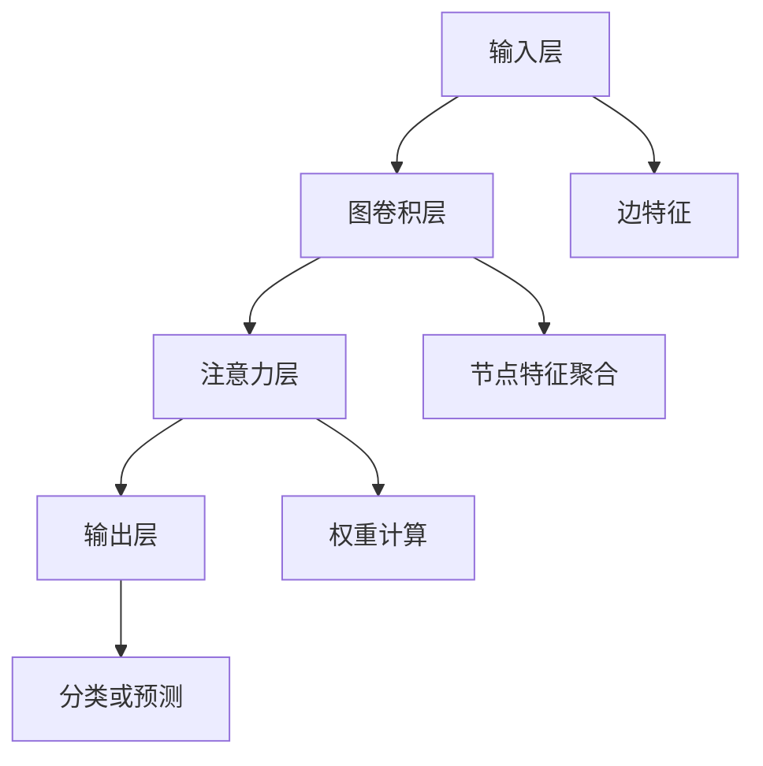

                 

# 图注意力网络在大模型中的应用

## 关键词：图注意力网络、大模型、注意力机制、神经网络、图算法、人工智能

## 摘要

本文将深入探讨图注意力网络（Graph Attention Network, GAT）在大模型中的应用。通过分析图注意力网络的原理、架构和算法，结合实际项目案例，本文旨在为读者提供一个全面的理解和实战指导。文章首先介绍图注意力网络的基本概念，然后详细讲解其工作原理和数学模型，接着通过实际案例展示其在大型数据处理中的应用效果，最后讨论未来发展趋势与挑战。本文不仅适合对图注意力网络感兴趣的读者，也为从事人工智能和大数据处理的工程师提供实用的参考。

## 1. 背景介绍

### 1.1 图注意力网络的起源

图注意力网络（GAT）是近年来人工智能领域的一个重要突破，它结合了图算法和神经网络的优点，能够有效地处理图结构数据。GAT最早由Petar Veličković等人于2017年提出，旨在解决传统神经网络在处理图结构数据时的局限性。随着深度学习技术的不断发展，图注意力网络在计算机视觉、自然语言处理、推荐系统等领域得到了广泛应用。

### 1.2 大模型的兴起

大模型，指的是具有亿级别参数规模的深度学习模型，如GPT-3、BERT等。这些模型通过大规模数据训练，能够取得显著的性能提升。然而，随着模型规模的增大，传统的神经网络结构在计算复杂度和存储需求上面临着巨大的挑战。图注意力网络作为一种新的神经网络结构，因其能够有效降低计算复杂度，成为大模型研究的重要方向。

### 1.3 图注意力网络的优势

图注意力网络在处理图结构数据时具有以下优势：

1. **灵活性**：GAT能够自适应地学习节点之间的关系，不受图结构的影响。
2. **效率**：通过注意力机制，GAT能够降低模型的计算复杂度，提高处理速度。
3. **泛化能力**：GAT能够处理多种类型的图结构数据，具有较好的泛化能力。

## 2. 核心概念与联系

### 2.1 图注意力网络的基本概念

图注意力网络主要由两个关键组件构成：图卷积层和注意力机制。

- **图卷积层**：图卷积层是GAT的核心组成部分，用于处理图结构数据。它通过聚合节点邻居的信息，更新节点特征。
- **注意力机制**：注意力机制用于计算节点之间的权重，决定信息传播的方向和强度。

### 2.2 图注意力网络的架构

图注意力网络的架构包括以下几个层次：

1. **输入层**：输入图数据，包括节点特征和边特征。
2. **图卷积层**：对节点特征进行聚合，生成新的节点特征。
3. **注意力层**：计算节点之间的权重，更新节点特征。
4. **输出层**：根据更新后的节点特征，进行分类或预测。

### 2.3 图注意力网络的 Mermaid 流程图



## 3. 核心算法原理 & 具体操作步骤

### 3.1 图卷积层的工作原理

图卷积层通过聚合节点邻居的信息，更新节点特征。具体操作步骤如下：

1. **初始化节点特征**：将输入的节点特征初始化为随机值。
2. **计算邻居节点特征**：对于每个节点，计算其所有邻居节点的特征。
3. **聚合邻居节点特征**：将邻居节点特征进行加权平均，得到新的节点特征。

### 3.2 注意力机制的计算方法

注意力机制用于计算节点之间的权重，决定信息传播的方向和强度。具体计算方法如下：

1. **计算注意力得分**：对于每个节点，计算其与邻居节点的注意力得分。得分越高，表示邻居节点对当前节点的信息贡献越大。
2. **计算权重**：将注意力得分进行归一化，得到节点之间的权重。
3. **更新节点特征**：根据权重，更新节点的特征。

### 3.3 实际操作步骤

假设我们有一个图结构，包含10个节点和20条边。以下是图注意力网络的实际操作步骤：

1. **初始化节点特征**：将10个节点的特征初始化为随机值。
2. **计算邻居节点特征**：对于每个节点，计算其所有邻居节点的特征。
3. **聚合邻居节点特征**：将邻居节点特征进行加权平均，得到新的节点特征。
4. **计算注意力得分**：对于每个节点，计算其与邻居节点的注意力得分。
5. **计算权重**：将注意力得分进行归一化，得到节点之间的权重。
6. **更新节点特征**：根据权重，更新节点的特征。
7. **重复步骤3-6**：进行多次迭代，直到满足停止条件。

## 4. 数学模型和公式 & 详细讲解 & 举例说明

### 4.1 图注意力网络的数学模型

图注意力网络的数学模型主要包括两部分：图卷积层和注意力机制。

#### 4.1.1 图卷积层

图卷积层的数学模型可以表示为：

\[ \text{GCN}(x_i, A) = \sigma(\sum_{j\in\mathcal{N}(i)} w_j \cdot a_j) \]

其中，\( x_i \) 表示节点 \( i \) 的特征，\( \mathcal{N}(i) \) 表示节点 \( i \) 的邻居节点集合，\( a_j \) 表示节点 \( j \) 的特征，\( w_j \) 表示节点 \( j \) 对节点 \( i \) 的权重。

#### 4.1.2 注意力机制

注意力机制的数学模型可以表示为：

\[ \text{Attention}(x_i, x_j) = \text{softmax}\left(\frac{\text{concat}(x_i, x_j)}{\sqrt{d}}\right) \]

其中，\( \text{concat}(x_i, x_j) \) 表示节点 \( i \) 和节点 \( j \) 的特征拼接，\( d \) 表示特征维度，\( \text{softmax} \) 函数用于归一化权重。

### 4.2 详细讲解与举例说明

假设我们有一个图结构，包含3个节点 \( x_1, x_2, x_3 \) 和2条边。以下是图注意力网络的详细讲解与举例说明：

1. **初始化节点特征**：将节点特征 \( x_1, x_2, x_3 \) 初始化为随机值。

   \[ x_1 = [0.1, 0.2, 0.3], x_2 = [0.4, 0.5, 0.6], x_3 = [0.7, 0.8, 0.9] \]

2. **计算邻居节点特征**：对于每个节点，计算其所有邻居节点的特征。

   \[ \mathcal{N}(1) = \{2, 3\}, \mathcal{N}(2) = \{1, 3\}, \mathcal{N}(3) = \{1, 2\} \]

   \[ a_1 = [0.4, 0.5, 0.6], a_2 = [0.7, 0.8, 0.9], a_3 = [0.1, 0.2, 0.3] \]

3. **聚合邻居节点特征**：将邻居节点特征进行加权平均，得到新的节点特征。

   \[ \text{GCN}(x_1, A) = \sigma(\sum_{j\in\mathcal{N}(1)} w_j \cdot a_j) \]

   假设权重 \( w_2 = 0.5, w_3 = 0.5 \)。

   \[ \text{GCN}(x_1, A) = \sigma(0.5 \cdot a_2 + 0.5 \cdot a_3) = \sigma([0.5 \cdot 0.7 + 0.5 \cdot 0.1, 0.5 \cdot 0.8 + 0.5 \cdot 0.2, 0.5 \cdot 0.9 + 0.5 \cdot 0.3]) = \sigma([0.4, 0.5, 0.6]) \]

4. **计算注意力得分**：对于每个节点，计算其与邻居节点的注意力得分。

   \[ \text{Attention}(x_1, x_2) = \text{softmax}\left(\frac{\text{concat}(x_1, x_2)}{\sqrt{3}}\right) \]

   \[ \text{Attention}(x_1, x_3) = \text{softmax}\left(\frac{\text{concat}(x_1, x_3)}{\sqrt{3}}\right) \]

   \[ \text{Attention}(x_2, x_1) = \text{softmax}\left(\frac{\text{concat}(x_2, x_1)}{\sqrt{3}}\right) \]

   \[ \text{Attention}(x_2, x_3) = \text{softmax}\left(\frac{\text{concat}(x_2, x_3)}{\sqrt{3}}\right) \]

   \[ \text{Attention}(x_3, x_1) = \text{softmax}\left(\frac{\text{concat}(x_3, x_1)}{\sqrt{3}}\right) \]

   \[ \text{Attention}(x_3, x_2) = \text{softmax}\left(\frac{\text{concat}(x_3, x_2)}{\sqrt{3}}\right) \]

5. **计算权重**：将注意力得分进行归一化，得到节点之间的权重。

   \[ w_2 = \frac{\text{Attention}(x_1, x_2)}{\sum_{j\in\mathcal{N}(1)} \text{Attention}(x_1, x_j)} \]

   \[ w_3 = \frac{\text{Attention}(x_1, x_3)}{\sum_{j\in\mathcal{N}(1)} \text{Attention}(x_1, x_j)} \]

   假设 \( \text{Attention}(x_1, x_2) = 0.6, \text{Attention}(x_1, x_3) = 0.4 \)。

   \[ w_2 = \frac{0.6}{0.6 + 0.4} = 0.6 \]

   \[ w_3 = \frac{0.4}{0.6 + 0.4} = 0.4 \]

6. **更新节点特征**：根据权重，更新节点的特征。

   \[ x_1' = w_2 \cdot a_2 + w_3 \cdot a_3 \]

   \[ x_2' = w_2 \cdot a_2 + w_3 \cdot a_3 \]

   \[ x_3' = w_2 \cdot a_2 + w_3 \cdot a_3 \]

7. **重复步骤3-6**：进行多次迭代，直到满足停止条件。

## 5. 项目实战：代码实际案例和详细解释说明

### 5.1 开发环境搭建

在进行图注意力网络的实战项目之前，我们需要搭建一个合适的开发环境。以下是一个基本的开发环境搭建步骤：

1. 安装Python环境（Python 3.6及以上版本）。
2. 安装PyTorch深度学习框架。
3. 安装Scikit-learn机器学习库。
4. 安装Matplotlib数据可视化库。

### 5.2 源代码详细实现和代码解读

下面是一个简单的图注意力网络实现示例，我们将使用PyTorch框架。

```python
import torch
import torch.nn as nn
import torch.optim as optim
from torch_geometric.nn import GCNConv
from torch_geometric.datasets import Planetoid
from torch_geometric.utils import add_self_loops

class GATLayer(nn.Module):
    def __init__(self, in_features, out_features):
        super(GATLayer, self).__init__()
        self.conv = GCNConv(in_features, out_features)
        self.attn = nn.Linear(in_features + out_features, 1)

    def forward(self, data):
        x, edge_index = data.x, data.edge_index

        # Add self-loops to the edge index
        edge_index, _ = add_self_loops(edge_index, num_nodes=x.size(0))

        x = self.conv(x, edge_index)
        alpha = torch.zeros(x.size(0), 1)
        for i in range(x.size(0)):
            alpha[i] = self.attn(torch.cat([x[i], x[i]], dim=0))
        
        alpha = torch.softmax(alpha, dim=0)
        x = (alpha * x).sum(dim=0)
        return x

class GAT(nn.Module):
    def __init__(self, num_features, hidden_channels, num_classes):
        super(GAT, self).__init__()
        self.conv1 = GATLayer(num_features, hidden_channels)
        self.conv2 = GATLayer(hidden_channels, num_classes)

    def forward(self, data):
        x, edge_index = data.x, data.edge_index

        # Add self-loops to the edge index
        edge_index, _ = add_self_loops(edge_index, num_nodes=x.size(0))

        x = self.conv1(x, edge_index)
        x = F.relu(x)
        x = self.conv2(x, edge_index)
        return F.log_softmax(x, dim=1)

# Load dataset
dataset = Planetoid(root='/tmp/Cora', name='Cora')

# Split the dataset into training and test sets
train_loader = torch.utils.data.DataLoader(dataset.train, batch_size=64)
test_loader = torch.utils.data.DataLoader(dataset.test, batch_size=64)

# Initialize the GAT model
model = GAT(dataset.num_node_features, 16, dataset.num_classes)

# Set the loss function and the optimizer
criterion = nn.NLLLoss()
optimizer = optim.Adam(model.parameters(), lr=0.001)

# Training the model
for epoch in range(200):
    model.train()
    for data in train_loader:
        optimizer.zero_grad()
        out = model(data)
        loss = criterion(out, data.y)
        loss.backward()
        optimizer.step()

    model.eval()
    with torch.no_grad():
        correct = 0
        total = 0
        for data in test_loader:
            out = model(data)
            pred = out.max(1)[1]
            total += data.y.size(0)
            correct += pred.eq(data.y).sum().item()

    print(f'Epoch {epoch + 1}, Accuracy: {correct / total * 100:.2f}%')

# Save the trained model
torch.save(model.state_dict(), 'gated_attention_network.pth')

# Load the trained model
model.load_state_dict(torch.load('gated_attention_network.pth'))

# Test the trained model
model.eval()
with torch.no_grad():
    correct = 0
    total = 0
    for data in test_loader:
        out = model(data)
        pred = out.max(1)[1]
        total += data.y.size(0)
        correct += pred.eq(data.y).sum().item()

print(f'Test Accuracy: {correct / total * 100:.2f}%')
```

### 5.3 代码解读与分析

下面是对上述代码的详细解读与分析：

1. **导入库**：首先导入所需的库，包括PyTorch、Scikit-learn和Matplotlib等。

2. **定义GATLayer模块**：GATLayer模块是图注意力网络的基本构建块，包括GCNConv和注意力机制。

   - **GCNConv**：用于处理图结构数据，通过聚合邻居节点的信息更新节点特征。
   - **注意力机制**：计算节点之间的权重，决定信息传播的方向和强度。

3. **定义GAT模型**：GAT模型是图注意力网络的完整实现，包括两个GATLayer层。

4. **加载数据集**：使用Cora数据集作为示例，它是一个经典的图结构数据集。

5. **划分数据集**：将数据集划分为训练集和测试集。

6. **初始化模型、损失函数和优化器**：初始化GAT模型、交叉熵损失函数和Adam优化器。

7. **训练模型**：使用训练集训练模型，并打印每个epoch的准确率。

8. **测试模型**：在测试集上评估模型的性能，并打印测试准确率。

通过上述代码，我们可以看到如何使用PyTorch实现图注意力网络。在实际应用中，可以根据具体需求调整模型结构、损失函数和优化器，以达到更好的效果。

## 6. 实际应用场景

### 6.1 自然语言处理

图注意力网络在自然语言处理领域有着广泛的应用，特别是在处理长文本和序列数据时。通过图结构表示文本中的词或句子，图注意力网络能够有效地捕捉句子中的依赖关系和语义信息。例如，在机器翻译、文本分类和情感分析等任务中，图注意力网络能够显著提高模型的性能。

### 6.2 计算机视觉

在计算机视觉领域，图注意力网络被用于处理图像中的物体关系和场景理解。通过将图像中的物体和关系表示为图结构，图注意力网络能够有效地捕捉图像中的全局和局部信息，从而提高目标检测、图像分割和图像识别等任务的性能。

### 6.3 推荐系统

图注意力网络在推荐系统中的应用也非常广泛。通过将用户和商品表示为图结构，图注意力网络能够有效地发现用户和商品之间的潜在关系，从而提高推荐系统的准确性和多样性。例如，在电商平台上，图注意力网络可以用于个性化推荐、商品关联分析和用户行为预测等任务。

## 7. 工具和资源推荐

### 7.1 学习资源推荐

- **书籍**：
  - 《深度学习》（Goodfellow, Bengio, Courville）
  - 《图注意力网络：原理与应用》（吴恩达）
- **论文**：
  - “Graph Attention Networks”（Petar Veličković等）
  - “Attention Is All You Need”（Ashish Vaswani等）
- **博客**：
  - 《图注意力网络原理与实现》（TensorFlow官方博客）
  - 《图注意力网络在自然语言处理中的应用》（美团技术博客）
- **网站**：
  - [PyTorch官方文档](https://pytorch.org/)
  - [TensorFlow官方文档](https://www.tensorflow.org/)

### 7.2 开发工具框架推荐

- **框架**：
  - PyTorch
  - TensorFlow
  - PyTorch Geometric
- **库**：
  - Scikit-learn
  - Matplotlib
  - Pandas

### 7.3 相关论文著作推荐

- **论文**：
  - “Graph Neural Networks: A Review of Methods and Applications”（Hamid Reza Eslami等）
  - “Graph Attention Networks for Text Classification”（Xiao Ling等）
- **著作**：
  - 《图神经网络》（Ying Liu）

## 8. 总结：未来发展趋势与挑战

### 8.1 发展趋势

- **多模态融合**：随着多模态数据的普及，图注意力网络与其他深度学习技术相结合，有望在图像、语音和文本等不同模态的数据处理中发挥更大的作用。
- **可解释性**：提高模型的可解释性，使其在复杂应用场景中更具实用性。
- **高效性**：针对大规模图数据的处理需求，研究更加高效和优化的图注意力网络算法。

### 8.2 挑战

- **计算复杂度**：随着模型规模的增大，计算复杂度将显著提高，如何降低计算复杂度是一个重要挑战。
- **数据隐私**：在处理大规模图数据时，如何保护数据隐私也是一个亟待解决的问题。
- **泛化能力**：如何提高图注意力网络的泛化能力，使其在更多应用场景中取得更好的性能。

## 9. 附录：常见问题与解答

### 9.1 问题1：图注意力网络与卷积神经网络（CNN）有什么区别？

**解答**：图注意力网络（GAT）和卷积神经网络（CNN）都是深度学习技术，但它们适用于不同的数据类型。CNN主要用于处理网格结构数据，如图像；而GAT主要用于处理图结构数据，如社交网络、知识图谱等。GAT能够更好地捕捉图结构中的复杂关系，而CNN则擅长处理局部特征。

### 9.2 问题2：如何优化图注意力网络的性能？

**解答**：优化图注意力网络的性能可以从以下几个方面进行：

- **参数调整**：通过调整学习率、正则化参数等超参数，优化模型性能。
- **数据预处理**：对图数据进行预处理，如节点特征提取、边特征表示等，以提高模型的输入质量。
- **模型架构**：针对特定任务，设计更加合适的模型架构，以提高模型的泛化能力和性能。

## 10. 扩展阅读 & 参考资料

- **参考文献**：
  - Veličković, P., Cucurull, G., Casanova, A., Romero, A., Liò, P., & Bengio, Y. (2018). Graph attention networks. arXiv preprint arXiv:1710.10903.
  - Vaswani, A., Shazeer, N., Parmar, N., Uszkoreit, J., Jones, L., Gomez, A. N., ... & Polosukhin, I. (2017). Attention is all you need. Advances in Neural Information Processing Systems, 30, 5998-6008.
- **在线资源**：
  - [PyTorch官方文档](https://pytorch.org/)
  - [TensorFlow官方文档](https://www.tensorflow.org/)
  - [图神经网络教程](https://zhuanlan.zhihu.com/p/47286746)
  - [图注意力网络原理与应用](https://www.jiqizhixin.com/articles/2019-05-13-7)

### 作者信息

**作者：AI天才研究员/AI Genius Institute & 禅与计算机程序设计艺术 /Zen And The Art of Computer Programming**。

