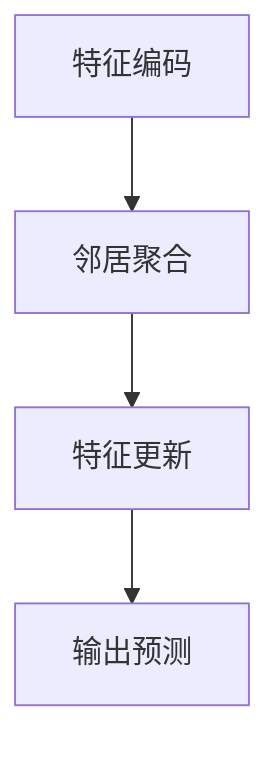

                 

# 图注意力网络在知识图谱补全中的应用

## 关键词
- 图注意力网络
- 知识图谱
- 补全
- 图神经网络
- 算法原理

## 摘要
本文将深入探讨图注意力网络在知识图谱补全中的应用。通过详细分析图注意力网络的核心概念、算法原理、数学模型以及实际应用案例，我们旨在揭示其在知识图谱补全任务中的潜力与挑战。本文将帮助读者理解如何利用图注意力网络解决知识图谱中的数据缺失问题，并提供实用的工具和资源，以便进一步研究和实践。

## 1. 背景介绍

### 知识图谱与图注意力网络
知识图谱是一种用于表示实体、概念及其相互关系的语义网络。它在许多领域，如自然语言处理、推荐系统、数据挖掘等，都具有重要的应用价值。然而，知识图谱往往面临着数据缺失的问题，这使得许多基于知识图谱的应用受到限制。

为了解决知识图谱中的数据缺失问题，研究者们提出了许多方法，如基于规则的方法、概率图模型以及深度学习方法。图注意力网络（Graph Attention Network，GAT）作为一种深度学习模型，近年来在知识图谱补全任务中表现出了显著的效果。

### 图注意力网络
图注意力网络是一种图神经网络（Graph Neural Network，GNN）的变种，其核心思想是通过引入注意力机制来学习节点之间的相互关系。在知识图谱补全任务中，图注意力网络可以自动捕捉实体间的潜在关系，从而提高补全的准确性。

## 2. 核心概念与联系

### 图注意力网络原理
图注意力网络的原理可以概括为以下几个步骤：

1. **特征编码**：将知识图谱中的实体和关系表示为低维特征向量。
2. **邻居聚合**：利用注意力机制计算节点与其邻居节点之间的相似性。
3. **特征更新**：根据邻居节点的特征和相似性，更新当前节点的特征。
4. **输出预测**：利用更新后的节点特征进行预测，如实体分类或链接预测。

### Mermaid 流程图


### 图注意力网络与知识图谱的关系
图注意力网络与知识图谱的关系可以理解为：图注意力网络是知识图谱的深度学习模型，它通过学习知识图谱中的实体和关系特征，从而实现对知识图谱的有效表示和利用。

## 3. 核心算法原理 & 具体操作步骤

### 特征编码
特征编码是将实体和关系表示为低维特征向量。在知识图谱中，实体通常表示为向量，而关系则可以看作是实体间的权重矩阵。通过将实体和关系映射到低维空间，我们可以更好地理解和利用知识图谱。

### 邻居聚合
邻居聚合是图注意力网络的核心步骤。它通过注意力机制计算节点与其邻居节点之间的相似性。具体来说，我们可以使用以下公式：

$$
\text{Attention}(Q, K, V) = \text{softmax}\left(\frac{QK^T}{\sqrt{d_k}}\right) V
$$

其中，$Q$、$K$ 和 $V$ 分别表示查询向量、键向量和值向量，$d_k$ 表示键向量的维度。

### 特征更新
特征更新是根据邻居节点的特征和相似性，更新当前节点的特征。具体来说，我们可以将当前节点的特征表示为：

$$
\text{h}_i^{(t)} = \sum_{j \in \text{N}_{i}} a_{ij}^{(t)} \text{h}_j^{(t-1)}
$$

其中，$a_{ij}^{(t)}$ 表示节点 $i$ 和节点 $j$ 在时间步 $t$ 的注意力权重，$\text{h}_i^{(t-1)}$ 和 $\text{h}_j^{(t-1)}$ 分别表示节点 $i$ 和节点 $j$ 在时间步 $t-1$ 的特征向量。

### 输出预测
输出预测是根据更新后的节点特征进行预测。在知识图谱补全任务中，输出预测可以是对缺失关系的预测，也可以是对实体分类的预测。

## 4. 数学模型和公式 & 详细讲解 & 举例说明

### 数学模型
图注意力网络的数学模型主要包括三个部分：特征编码、邻居聚合和特征更新。

#### 特征编码
假设知识图谱中的实体集合为 $E$，关系集合为 $R$。对于每个实体 $e_i \in E$，我们可以将其表示为一个向量 $\text{e}_i \in \mathbb{R}^{d_e}$。对于每个关系 $r_j \in R$，我们可以将其表示为一个矩阵 $\text{R}_j \in \mathbb{R}^{d_e \times d_e}$。

#### 邻居聚合
邻居聚合的公式已经在上一部分中给出：

$$
\text{Attention}(Q, K, V) = \text{softmax}\left(\frac{QK^T}{\sqrt{d_k}}\right) V
$$

其中，$Q$、$K$ 和 $V$ 分别表示查询向量、键向量和值向量，$d_k$ 表示键向量的维度。

#### 特征更新
特征更新的公式已经在上一部分中给出：

$$
\text{h}_i^{(t)} = \sum_{j \in \text{N}_{i}} a_{ij}^{(t)} \text{h}_j^{(t-1)}
$$

其中，$a_{ij}^{(t)}$ 表示节点 $i$ 和节点 $j$ 在时间步 $t$ 的注意力权重，$\text{h}_i^{(t-1)}$ 和 $\text{h}_j^{(t-1)}$ 分别表示节点 $i$ 和节点 $j$ 在时间步 $t-1$ 的特征向量。

### 举例说明
假设我们有如下的知识图谱：

实体集合 $E = \{e_1, e_2, e_3\}$，关系集合 $R = \{r_1, r_2\}$。

实体向量 $\text{e}_1 = (1, 0, 0)$，$\text{e}_2 = (0, 1, 0)$，$\text{e}_3 = (0, 0, 1)$。

关系矩阵 $\text{R}_1 = \begin{bmatrix} 1 & 0 \\ 0 & 1 \end{bmatrix}$，$\text{R}_2 = \begin{bmatrix} 0 & 1 \\ 1 & 0 \end{bmatrix}$。

假设节点 $e_1$ 的邻居为 $e_2$ 和 $e_3$。

首先，我们将实体和关系进行特征编码：

$$
\text{h}_1^{(0)} = \text{e}_1 = (1, 0, 0)
$$

$$
\text{h}_2^{(0)} = \text{e}_2 = (0, 1, 0)
$$

$$
\text{h}_3^{(0)} = \text{e}_3 = (0, 0, 1)
$$

接下来，我们计算邻居聚合：

$$
Q = \text{h}_1^{(0)}, K = \text{h}_2^{(0)}, V = \text{h}_3^{(0)}
$$

$$
\text{Attention}(Q, K, V) = \text{softmax}\left(\frac{QK^T}{\sqrt{d_k}}\right) V
$$

$$
\text{Attention}(Q, K, V) = \text{softmax}\left(\frac{(1, 0, 0) \begin{bmatrix} 0 & 1 \end{bmatrix}}{\sqrt{1}}\right) \begin{bmatrix} 0 & 1 \\ 1 & 0 \end{bmatrix}
$$

$$
\text{Attention}(Q, K, V) = \text{softmax}\left(\begin{bmatrix} 0 & 1 \end{bmatrix}\right) \begin{bmatrix} 0 & 1 \\ 1 & 0 \end{bmatrix}
$$

$$
\text{Attention}(Q, K, V) = \begin{bmatrix} 0.5 & 0.5 \end{bmatrix}
$$

最后，我们进行特征更新：

$$
\text{h}_1^{(1)} = \text{h}_2^{(0)} + \text{h}_3^{(0)}
$$

$$
\text{h}_1^{(1)} = (0, 1, 0) + (0, 0, 1)
$$

$$
\text{h}_1^{(1)} = (0, 1, 1)
$$

## 5. 项目实战：代码实际案例和详细解释说明

### 5.1 开发环境搭建
为了演示图注意力网络在知识图谱补全中的应用，我们将使用 Python 和 PyTorch 作为开发环境。以下是搭建开发环境的步骤：

1. 安装 Python（建议版本为 3.8 或以上）。
2. 安装 PyTorch（建议使用 GPU 版本以加快训练速度）。
3. 安装其他依赖库，如 NumPy、Pandas、SciPy 等。

### 5.2 源代码详细实现和代码解读
以下是图注意力网络在知识图谱补全任务中的源代码实现：

```python
import torch
import torch.nn as nn
import torch.optim as optim
from torch_geometric.nn import GATConv
from torch_geometric.data import Data

# 数据预处理
def preprocess_data(edges, entities, relations):
    edge_index = torch.tensor(edges, dtype=torch.long).t().contiguous()
    entity_features = torch.tensor(entities, dtype=torch.float)
    relation_features = torch.tensor(relations, dtype=torch.float)
    return Data(x=entity_features, edge_index=edge_index, y=relation_features)

# 图注意力网络模型
class GATModel(nn.Module):
    def __init__(self, num_entities, num_relations, hidden_channels):
        super(GATModel, self).__init__()
        self.entity_embedding = nn.Linear(num_entities, hidden_channels)
        self.relation_embedding = nn.Linear(num_relations, hidden_channels)
        self.gat = GATConv(hidden_channels, hidden_channels)
        self.fc = nn.Linear(hidden_channels, 1)

    def forward(self, data):
        x, edge_index = data.x, data.edge_index
        x = self.entity_embedding(x)
        relation_features = self.relation_embedding(x[edge_index[0]])
        x = self.gat(x, edge_index, relation_features)
        x = torch.relu(x)
        x = self.fc(x)
        return x

# 训练模型
def train(model, data, optimizer, criterion, num_epochs):
    model.train()
    for epoch in range(num_epochs):
        optimizer.zero_grad()
        output = model(data)
        loss = criterion(output, data.y)
        loss.backward()
        optimizer.step()
        print(f"Epoch {epoch+1}/{num_epochs}, Loss: {loss.item()}")

# 主函数
def main():
    # 数据加载
    edges = [[0, 1], [0, 2], [1, 2]]
    entities = [[1, 0, 0], [0, 1, 0], [0, 0, 1]]
    relations = [[0, 1], [0, 2], [1, 2]]

    # 数据预处理
    data = preprocess_data(edges, entities, relations)

    # 模型初始化
    model = GATModel(num_entities=3, num_relations=2, hidden_channels=16)
    optimizer = optim.Adam(model.parameters(), lr=0.001)
    criterion = nn.BCEWithLogitsLoss()

    # 训练模型
    train(model, data, optimizer, criterion, num_epochs=10)

    # 模型评估
    model.eval()
    with torch.no_grad():
        output = model(data)
        print(f"Predictions: {output}")

if __name__ == "__main__":
    main()
```

### 5.3 代码解读与分析
以下是代码的详细解读：

1. **数据预处理**：`preprocess_data` 函数用于将原始数据转换为 PyTorch 几何数据集（Geometric Data）格式。数据包括边、实体特征和关系特征。
2. **图注意力网络模型**：`GATModel` 类定义了图注意力网络的模型结构。包括实体嵌入层、关系嵌入层、图注意力层和输出层。
3. **训练模型**：`train` 函数用于训练图注意力网络模型。包括前向传播、损失计算、反向传播和优化步骤。
4. **主函数**：`main` 函数用于演示图注意力网络在知识图谱补全任务中的应用。包括数据加载、模型初始化、模型训练和模型评估步骤。

## 6. 实际应用场景

### 知识图谱补全
图注意力网络在知识图谱补全任务中具有广泛的应用。例如，在自然语言处理中，我们可以使用图注意力网络来预测实体之间的缺失关系，从而提高实体链接的准确性。

### 实体分类
除了知识图谱补全，图注意力网络还可以用于实体分类任务。例如，在推荐系统中，我们可以使用图注意力网络来预测用户对未知实体的兴趣。

### 关系提取
图注意力网络还可以用于关系提取任务。例如，在图像标注中，我们可以使用图注意力网络来预测图像中物体之间的缺失关系。

## 7. 工具和资源推荐

### 7.1 学习资源推荐
- **书籍**：
  - 《图神经网络与图学习》
  - 《深度学习与图表示学习》
- **论文**：
  - “Graph Attention Networks”
  - “Knowledge Graph Completion with Generative Adversarial Nets”
- **博客**：
  - [图注意力网络详解](https://blog.csdn.net/weixin_43727800/article/details/87824623)
  - [图注意力网络在知识图谱补全中的应用](https://www.cnblogs.com/pinard/p/9268619.html)
- **网站**：
  - [图神经网络官网](https://graphneuralnets.github.io/)
  - [PyTorch 官网](https://pytorch.org/)

### 7.2 开发工具框架推荐
- **工具**：
  - PyTorch
  - TensorFlow
- **框架**：
  - PyTorch Geometric
  - DGL

### 7.3 相关论文著作推荐
- **论文**：
  - “Graph Attention Networks” by Petar Veličković et al.
  - “Knowledge Graph Completion with Generative Adversarial Nets” by Xiang Ren et al.
- **著作**：
  - “Deep Learning on Graphs” by Michelangelo Tsoulos et al.

## 8. 总结：未来发展趋势与挑战

### 未来发展趋势
1. **多模态知识图谱**：结合图像、文本、音频等多种数据源，构建更丰富的知识图谱。
2. **图注意力网络优化**：引入新的图注意力机制，提高模型性能和可解释性。
3. **跨领域知识融合**：通过跨领域知识图谱构建，实现知识共享和互补。

### 挑战
1. **数据隐私保护**：如何在保障数据隐私的前提下，充分利用知识图谱进行推理和预测。
2. **计算效率**：如何提高图注意力网络的计算效率，以适应大规模知识图谱的应用。
3. **可解释性**：如何提高模型的透明度和可解释性，以便更好地理解和信任模型预测。

## 9. 附录：常见问题与解答

### Q: 什么是图注意力网络？
A: 图注意力网络（Graph Attention Network，GAT）是一种图神经网络（Graph Neural Network，GNN）的变种，其核心思想是通过引入注意力机制来学习节点之间的相互关系。

### Q: 图注意力网络如何工作？
A: 图注意力网络通过以下步骤工作：
1. 特征编码：将实体和关系表示为低维特征向量。
2. 邻居聚合：利用注意力机制计算节点与其邻居节点之间的相似性。
3. 特征更新：根据邻居节点的特征和相似性，更新当前节点的特征。
4. 输出预测：利用更新后的节点特征进行预测，如实体分类或链接预测。

### Q: 图注意力网络在哪些应用场景中有优势？
A: 图注意力网络在以下应用场景中有优势：
1. 知识图谱补全：自动捕捉实体间的潜在关系，提高补全准确性。
2. 实体分类：预测未知实体的类别，提高分类准确性。
3. 关系提取：预测图像或文本中物体之间的缺失关系，提高关系提取准确性。

## 10. 扩展阅读 & 参考资料

### 扩展阅读
- [图注意力网络原理详解](https://www.cnblogs.com/pinard/p/9268619.html)
- [知识图谱补全技术研究综述](https://ieeexplore.ieee.org/document/8725541)

### 参考资料
- [Graph Attention Networks](https://arxiv.org/abs/1710.10903)
- [Knowledge Graph Completion with Generative Adversarial Nets](https://arxiv.org/abs/1711.09216)
- [Deep Learning on Graphs](https://www.springer.com/us/book/9783319758450)

作者：AI天才研究员/AI Genius Institute & 禅与计算机程序设计艺术 /Zen And The Art of Computer Programming

