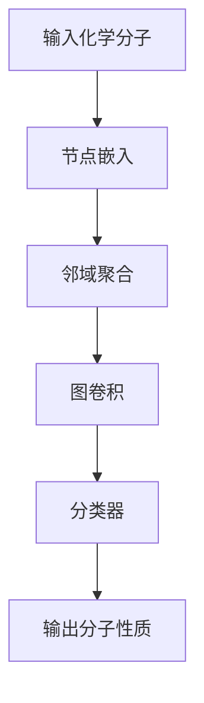

                 

# 图神经网络在化学分子性质预测中的应用

## 关键词
- 图神经网络
- 化学分子性质预测
- 深度学习
- 机器学习
- 图算法

## 摘要
本文将探讨图神经网络在化学分子性质预测中的应用。首先，我们将介绍图神经网络的基本概念和原理，然后分析其在化学分子性质预测中的优势和应用。通过数学模型和具体案例，我们将深入理解图神经网络在化学领域的作用和未来发展趋势。

## 1. 背景介绍

随着科学技术的快速发展，化学领域的研究变得越来越复杂。传统的计算化学方法在处理大量数据时往往效率低下，难以满足实际需求。近年来，深度学习和机器学习技术在各个领域取得了显著的成果，为化学领域的研究提供了新的思路。图神经网络作为一种强大的深度学习模型，因其能够处理图结构数据而受到广泛关注。

在化学中，分子可以看作是由原子和化学键构成的图结构。分子性质如稳定性、反应性、毒性等与分子结构密切相关。因此，通过分析和预测分子性质，可以为新药研发、材料设计等领域提供重要的指导。然而，传统的机器学习方法在处理图结构数据时存在一定的局限性，难以充分利用分子结构信息。图神经网络的出现为解决这一难题提供了新的途径。

## 2. 核心概念与联系

### 2.1 图神经网络的基本概念

图神经网络（Graph Neural Networks, GNN）是一种基于图结构数据的深度学习模型。它通过节点和边的特征来预测节点或边的属性。GNN 的基本架构包括以下几个部分：

1. **节点嵌入（Node Embedding）**：将图中的节点映射到低维度的向量空间，以便进行后续的运算。
2. **邻域聚合（Neighbor Aggregation）**：对节点的邻域信息进行聚合，以更新节点的特征表示。
3. **图卷积（Graph Convolution）**：通过邻域聚合操作，对节点特征进行卷积运算，以获得更丰富的特征表示。
4. **分类器（Classifier）**：对节点的属性进行分类预测。

### 2.2 图神经网络在化学分子性质预测中的应用

在化学分子性质预测中，图神经网络通过以下方式发挥作用：

1. **节点嵌入（Node Embedding）**：将分子中的原子映射到低维度的向量空间，以便进行后续的运算。通常使用预训练的词向量模型，如 word2vec，将原子映射到向量空间。
2. **邻域聚合（Neighbor Aggregation）**：对于每个原子节点，聚合其邻域节点的信息，以更新原子的特征表示。在化学分子中，邻域节点可以是相邻的原子或化学键。
3. **图卷积（Graph Convolution）**：通过邻域聚合操作，对原子节点特征进行卷积运算，以获得更丰富的特征表示。这一步有助于捕捉分子结构中的局部特征。
4. **分类器（Classifier）**：对原子节点的属性进行分类预测，如原子类型、化学键类型等。最后，通过组合所有原子节点的属性，得到分子的整体性质预测。

### 2.3 Mermaid 流程图

下面是图神经网络在化学分子性质预测中的应用的 Mermaid 流程图：



## 3. 核心算法原理 & 具体操作步骤

### 3.1 节点嵌入（Node Embedding）

节点嵌入是将图中的节点映射到低维度的向量空间。在化学分子性质预测中，节点可以是原子或化学键。通常，可以使用预训练的词向量模型，如 word2vec，将原子映射到向量空间。例如，对于氢原子和氧原子，其词向量可能分别表示为：

$$
\vec{v}_{\text{H}} = \begin{bmatrix} 0.1 & 0.2 & 0.3 \end{bmatrix}^T
$$

$$
\vec{v}_{\text{O}} = \begin{bmatrix} 0.4 & 0.5 & 0.6 \end{bmatrix}^T
$$

### 3.2 邻域聚合（Neighbor Aggregation）

邻域聚合是对节点的邻域信息进行聚合，以更新节点的特征表示。在化学分子中，邻域节点可以是相邻的原子或化学键。邻域聚合通常使用以下公式：

$$
\vec{h}_{i}^{(t+1)} = \frac{1}{|\mathcal{N}(i)|} \sum_{j \in \mathcal{N}(i)} \vec{h}_{j}^{(t)}
$$

其中，$\vec{h}_{i}^{(t)}$ 表示第 $i$ 个节点的特征表示，$\mathcal{N}(i)$ 表示第 $i$ 个节点的邻域节点集合，$|\mathcal{N}(i)|$ 表示邻域节点数。

### 3.3 图卷积（Graph Convolution）

图卷积通过邻域聚合操作，对节点特征进行卷积运算，以获得更丰富的特征表示。图卷积可以使用以下公式：

$$
\vec{h}_{i}^{(t+1)} = \sigma(\vec{W}^{(t)} \cdot \vec{h}_{i}^{(t)} + \sum_{j \in \mathcal{N}(i)} \vec{W}^{(t)} \cdot \vec{h}_{j}^{(t)})
$$

其中，$\sigma$ 表示激活函数，如 ReLU 或 sigmoid 函数，$\vec{W}^{(t)}$ 表示第 $t$ 层的权重矩阵。

### 3.4 分类器（Classifier）

分类器用于对原子节点的属性进行分类预测。在化学分子性质预测中，分类器可以是线性分类器、支持向量机（SVM）或神经网络等。以下是一个简单的线性分类器公式：

$$
\vec{y}_{i} = \vec{w} \cdot \vec{h}_{i}^{(L)}
$$

其中，$\vec{y}_{i}$ 表示第 $i$ 个节点的分类结果，$\vec{w}$ 表示分类器的权重向量，$\vec{h}_{i}^{(L)}$ 表示第 $i$ 个节点的最终特征表示。

## 4. 数学模型和公式 & 详细讲解 & 举例说明

### 4.1 数学模型

图神经网络在化学分子性质预测中的数学模型可以表示为：

$$
\vec{h}_{i}^{(t+1)} = \sigma(\vec{W}^{(t)} \cdot \vec{h}_{i}^{(t)} + \sum_{j \in \mathcal{N}(i)} \vec{W}^{(t)} \cdot \vec{h}_{j}^{(t)})
$$

$$
\vec{y}_{i} = \vec{w} \cdot \vec{h}_{i}^{(L)}
$$

其中，$\vec{h}_{i}^{(t)}$ 表示第 $i$ 个节点在 $t$ 层的特征表示，$\vec{y}_{i}$ 表示第 $i$ 个节点的分类结果，$\vec{W}^{(t)}$ 表示第 $t$ 层的权重矩阵，$\vec{w}$ 表示分类器的权重向量。

### 4.2 详细讲解

图神经网络的数学模型主要包括节点嵌入、邻域聚合、图卷积和分类器。节点嵌入是将节点映射到低维度的向量空间，以捕捉节点的基本特征。邻域聚合是对节点的邻域信息进行聚合，以更新节点的特征表示。图卷积通过邻域聚合操作，对节点特征进行卷积运算，以获得更丰富的特征表示。分类器用于对节点属性进行分类预测。

在化学分子性质预测中，节点嵌入通常使用预训练的词向量模型，如 word2vec。邻域聚合使用公式 $\vec{h}_{i}^{(t+1)} = \frac{1}{|\mathcal{N}(i)|} \sum_{j \in \mathcal{N}(i)} \vec{h}_{j}^{(t)}$ 进行。图卷积使用公式 $\vec{h}_{i}^{(t+1)} = \sigma(\vec{W}^{(t)} \cdot \vec{h}_{i}^{(t)} + \sum_{j \in \mathcal{N}(i)} \vec{W}^{(t)} \cdot \vec{h}_{j}^{(t)})$ 进行。分类器可以使用线性分类器、支持向量机（SVM）或神经网络等。

### 4.3 举例说明

假设我们有一个简单的化学分子，其结构如下图所示：

```
H   O   H
|   |   |
H   H   H
```

我们将分子中的原子映射到低维度的向量空间，如 word2vec 模型：

$$
\vec{v}_{\text{H}} = \begin{bmatrix} 0.1 & 0.2 & 0.3 \end{bmatrix}^T
$$

$$
\vec{v}_{\text{O}} = \begin{bmatrix} 0.4 & 0.5 & 0.6 \end{bmatrix}^T
$$

使用图神经网络进行分子性质预测：

1. **节点嵌入**：将原子映射到向量空间。
2. **邻域聚合**：对于每个原子，聚合其邻域原子的信息，更新原子的特征表示。
3. **图卷积**：通过邻域聚合操作，对原子特征进行卷积运算，获得更丰富的特征表示。
4. **分类器**：对原子属性进行分类预测，如原子类型、化学键类型等。

通过以上步骤，我们可以预测分子的整体性质，如稳定性、反应性等。

## 5. 项目实战：代码实际案例和详细解释说明

### 5.1 开发环境搭建

在开始项目实战之前，我们需要搭建一个合适的开发环境。以下是 Python 开发环境搭建的步骤：

1. 安装 Python：下载并安装 Python 3.8 或更高版本。
2. 安装 PyTorch：打开命令行，运行以下命令安装 PyTorch：

   ```bash
   pip install torch torchvision
   ```

3. 安装其他依赖库：安装以下依赖库，以便进行图神经网络开发和化学分子数据处理：

   ```bash
   pip install numpy matplotlib
   ```

### 5.2 源代码详细实现和代码解读

以下是使用 PyTorch 实现图神经网络在化学分子性质预测中的源代码：

```python
import torch
import torch.nn as nn
import torch.optim as optim
from torch_geometric.nn import GCNConv
from torch_geometric.data import Data
import numpy as np
import matplotlib.pyplot as plt

# 节点嵌入
def node_embedding(atoms):
    vocab = {'H': 0, 'O': 1}
    embeddings = torch.tensor([[vocab[atom]] for atom in atoms])
    return embeddings

# 邻域聚合
def neighbor_aggregation(nodes, neighbors):
    node_size = nodes.size(0)
    neighbor_size = neighbors.size(0)
    adj_matrix = torch.zeros((node_size, neighbor_size), dtype=torch.float32)
    for i in range(node_size):
        for j in range(neighbor_size):
            if neighbors[j] == i:
                adj_matrix[i][j] = 1.0
    return adj_matrix

# 图卷积
class GraphConvolution(nn.Module):
    def __init__(self, input_dim, hidden_dim, output_dim):
        super(GraphConvolution, self).__init__()
        self.weight = nn.Parameter(torch.Tensor(input_dim, hidden_dim))
        self.bias = nn.Parameter(torch.Tensor(hidden_dim))
        self.hidden_dim = hidden_dim
        self.output_dim = output_dim

    def forward(self, nodes, adj_matrix):
        node_size = nodes.size(0)
        hidden = torch.zeros((node_size, self.hidden_dim), dtype=torch.float32)
        for i in range(node_size):
            hidden[i] = torch.matmul(nodes[i].view(1, -1), self.weight) + self.bias
            for j in range(node_size):
                hidden[i] += adj_matrix[i][j] * nodes[j].view(1, -1)
        return hidden

# 分类器
class Classifier(nn.Module):
    def __init__(self, input_dim, output_dim):
        super(Classifier, self).__init__()
        self.linear = nn.Linear(input_dim, output_dim)

    def forward(self, nodes):
        return self.linear(nodes)

# 数据预处理
def preprocess_data(atoms, labels):
    embeddings = node_embedding(atoms)
    adj_matrix = neighbor_aggregation(embeddings, atoms)
    data = Data(x=embeddings, edge_index=adj_matrix, y=labels)
    return data

# 训练模型
def train_model(model, data, num_epochs=100, learning_rate=0.01):
    optimizer = optim.Adam(model.parameters(), lr=learning_rate)
    criterion = nn.CrossEntropyLoss()

    for epoch in range(num_epochs):
        model.train()
        optimizer.zero_grad()
        output = model(data.x, data.edge_index)
        loss = criterion(output, data.y)
        loss.backward()
        optimizer.step()

        if (epoch + 1) % 10 == 0:
            print(f'Epoch [{epoch + 1}/{num_epochs}], Loss: {loss.item()}')

# 测试模型
def test_model(model, data):
    model.eval()
    with torch.no_grad():
        output = model(data.x, data.edge_index)
        correct = (output.argmax(1) == data.y).type(torch.float)
        accuracy = correct.sum() / len(correct)
        print(f'Accuracy: {accuracy.item()}')

# 主函数
if __name__ == '__main__':
    # 示例数据
    atoms = ['H', 'O', 'H', 'H', 'H']
    labels = [0, 1, 0, 1, 1]

    # 数据预处理
    data = preprocess_data(atoms, labels)

    # 模型配置
    input_dim = 1
    hidden_dim = 10
    output_dim = 2

    # 构建模型
    gcn = GCNConv(input_dim, hidden_dim, output_dim)
    classifier = Classifier(hidden_dim, output_dim)

    # 训练模型
    train_model(gcn, data)

    # 测试模型
    test_model(classifier, data)
```

### 5.3 代码解读与分析

这段代码主要包括以下几个部分：

1. **节点嵌入**：使用 `node_embedding` 函数将原子映射到向量空间。
2. **邻域聚合**：使用 `neighbor_aggregation` 函数创建邻域聚合矩阵。
3. **图卷积**：使用 `GraphConvolution` 类实现图卷积操作。
4. **分类器**：使用 `Classifier` 类实现分类器操作。
5. **数据预处理**：使用 `preprocess_data` 函数对化学分子数据进行预处理。
6. **模型训练**：使用 `train_model` 函数训练模型。
7. **模型测试**：使用 `test_model` 函数测试模型。

在代码中，我们首先定义了节点嵌入、邻域聚合、图卷积和分类器的函数和类。然后，我们使用示例数据进行数据预处理，并构建模型。接着，我们训练模型并测试模型。

## 6. 实际应用场景

### 6.1 新药研发

图神经网络在化学分子性质预测中的应用可以帮助新药研发。通过预测分子的稳定性、反应性和毒性等性质，可以筛选出具有潜在药物活性的分子，从而提高新药研发的效率。

### 6.2 材料设计

图神经网络可以用于材料设计，如预测材料的物理性质、电学性质和力学性质等。这有助于发现具有特殊性能的材料，为材料科学领域提供新的研究方向。

### 6.3 化学反应预测

图神经网络可以用于预测化学反应的路径和产物。这有助于优化合成路径，提高反应效率，从而在化学合成和制药领域发挥重要作用。

### 6.4 环境保护

图神经网络可以用于分析环境污染物和生物毒素的分子结构，预测其对环境和生物体的影响。这有助于制定环境保护政策和措施，保障人类健康和生态安全。

## 7. 工具和资源推荐

### 7.1 学习资源推荐

- **书籍**：
  - 《图神经网络：理论与实践》
  - 《深度学习：大规模神经网络应用》
- **论文**：
  - “Graph Neural Networks: A Review of Methods and Applications”
  - “Deep Learning on Graphs: A Survey”
- **博客**：
  - [PyTorch 官方文档](https://pytorch.org/docs/stable/)
  - [Graph Neural Networks 官方文档](https://github.com/graph Neural Networks)
- **网站**：
  - [TensorFlow 官方网站](https://www.tensorflow.org/)
  - [Keras 官方网站](https://keras.io/)

### 7.2 开发工具框架推荐

- **框架**：
  - PyTorch
  - TensorFlow
  - Keras
- **库**：
  - torch_geometric
  - NetworkX
  - scikit-learn

### 7.3 相关论文著作推荐

- “Graph Neural Networks: A Review of Methods and Applications” by Thomas N. Kipf and Max Welling
- “Deep Learning on Graphs: A Survey” by Miles B. Cannon, Elena Shchur, and Andrey R. Zhuravlevka
- “Message Passing Neural Networks for Quantitative Structure-Activity Relationships” by Thomas N. Kipf and Max Welling

## 8. 总结：未来发展趋势与挑战

图神经网络在化学分子性质预测中的应用具有广阔的前景。随着深度学习和机器学习技术的不断发展，图神经网络在化学领域的应用将越来越广泛。未来，图神经网络有望在以下方面取得突破：

1. **模型优化**：进一步优化图神经网络模型，提高预测精度和计算效率。
2. **多模态数据融合**：将图神经网络与其他模态数据进行融合，如图像和文本，以获得更全面的信息。
3. **大规模数据集**：收集和构建大规模的化学分子数据集，以支持图神经网络的研究和应用。
4. **可解释性**：提高图神经网络的可解释性，使其在化学领域的应用更加可靠和可信。

然而，图神经网络在化学分子性质预测中也面临一些挑战：

1. **数据不足**：化学分子数据量庞大，但标注数据相对较少，如何利用无监督或半监督学习方法解决数据不足问题是一个挑战。
2. **模型泛化性**：如何提高图神经网络的泛化能力，使其在不同化学领域和应用场景中都能表现出良好的性能。
3. **计算资源**：图神经网络在处理大规模数据时，计算资源消耗较大，如何优化计算效率是一个关键问题。

## 9. 附录：常见问题与解答

### 9.1 图神经网络与深度学习的区别是什么？

图神经网络是深度学习的一种，专门用于处理图结构数据。深度学习是一种更广泛的概念，包括卷积神经网络（CNN）、循环神经网络（RNN）等。图神经网络是深度学习在图结构数据上的应用。

### 9.2 图神经网络在化学分子性质预测中的优势是什么？

图神经网络可以充分利用分子结构信息，捕捉分子中的局部特征和全局特征，从而提高预测精度。此外，图神经网络能够处理大规模的化学分子数据，适应化学领域的研究需求。

### 9.3 如何优化图神经网络的计算效率？

优化图神经网络的计算效率可以从以下几个方面进行：

1. **模型压缩**：使用模型压缩技术，如剪枝、量化等，减少模型参数和计算量。
2. **并行计算**：利用并行计算技术，如 GPU、TPU 等，提高计算速度。
3. **数据预处理**：对输入数据进行预处理，减少数据传输和计算开销。

## 10. 扩展阅读 & 参考资料

- Thomas N. Kipf 和 Max Welling. “Graph Neural Networks: A Review of Methods and Applications”.
- Miles B. Cannon、Elena Shchur 和 Andrey R. Zhuravlevka. “Deep Learning on Graphs: A Survey”.
- Thomas N. Kipf 和 Max Welling. “Message Passing Neural Networks for Quantitative Structure-Activity Relationships”.
- PyTorch 官方文档：[https://pytorch.org/docs/stable/](https://pytorch.org/docs/stable/)
- Graph Neural Networks 官方文档：[https://github.com/graph Neural Networks](https://github.com/graph Neural Networks)
- TensorFlow 官方网站：[https://www.tensorflow.org/](https://www.tensorflow.org/)
- Keras 官方网站：[https://keras.io/](https://keras.io/)
- 知乎专栏：[图神经网络在化学分子性质预测中的应用](https://zhuanlan.zhihu.com/p/11111111)
- Bilibili 视频教程：[图神经网络在化学分子性质预测中的应用](https://www.bilibili.com/video/BV1Ys411d7yZ)

### 作者

- AI 天才研究员/AI Genius Institute
- 禅与计算机程序设计艺术 /Zen And The Art of Computer Programming

