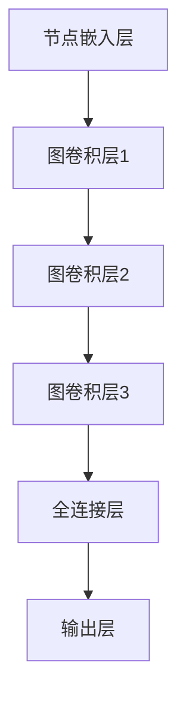

                 

# 图神经网络在推荐系统中的应用

## 关键词：图神经网络、推荐系统、节点嵌入、图卷积网络、注意力机制

## 摘要：

本文旨在探讨图神经网络（Graph Neural Networks, GNNs）在推荐系统中的应用。随着推荐系统变得越来越复杂，传统的基于矩阵分解和协同过滤的方法已经难以满足需求。图神经网络作为一种强大的图结构学习工具，可以通过节点嵌入和图卷积网络来挖掘用户和物品之间的复杂关系。本文首先介绍了图神经网络的核心概念和架构，然后详细讲解了节点嵌入和图卷积网络的原理和实现步骤。接着，通过一个实际案例，展示了如何使用图神经网络搭建一个推荐系统。最后，讨论了图神经网络在推荐系统中的实际应用场景，并推荐了一些相关的学习资源和开发工具。文章还总结了图神经网络在推荐系统中的未来发展趋势和挑战。

## 1. 背景介绍

推荐系统是一种智能信息过滤技术，旨在根据用户的历史行为和兴趣，向用户推荐他们可能感兴趣的内容或物品。随着互联网和社交媒体的迅猛发展，推荐系统已经成为了各种在线平台的核心功能。然而，传统的推荐系统方法，如基于用户的协同过滤（User-based Collaborative Filtering）和基于物品的协同过滤（Item-based Collaborative Filtering），在处理复杂和稀疏的用户-物品交互数据时面临着诸多挑战。

基于矩阵分解的方法，如奇异值分解（Singular Value Decomposition, SVD）和交替最小二乘法（Alternating Least Squares, ALS），通过将用户和物品的交互矩阵分解为用户特征矩阵和物品特征矩阵，试图找到最接近原始评分矩阵的低维表示。然而，这些方法在处理具有高度复杂数据结构和关系的数据时，效果往往不佳。

近年来，图神经网络作为一种新兴的深度学习技术，在处理图结构数据方面表现出了强大的能力。图神经网络可以通过学习节点和边的嵌入，自动捕捉节点之间的复杂关系，从而在推荐系统中发挥了重要作用。本文将详细介绍图神经网络在推荐系统中的应用，包括核心概念、算法原理、数学模型和实际案例。

## 2. 核心概念与联系

### 2.1 图神经网络的基本概念

图神经网络是一种特殊的神经网络，它能够处理图结构数据。在图神经网络中，图是由节点（Node）和边（Edge）组成的。节点表示图中的个体，如用户或物品；边表示节点之间的关联关系，如用户对物品的评分或评论。

图神经网络的核心任务是学习节点的嵌入（Embedding），即将节点映射到一个低维向量空间，以便进行后续的推理和预测。节点嵌入能够捕捉节点之间的拓扑关系和语义信息，从而提高推荐系统的效果。

### 2.2 图神经网络的基本架构

图神经网络的基本架构通常包括以下几个部分：

1. **节点嵌入层**：将节点映射到低维向量空间。
2. **图卷积层**：通过聚合节点和邻居节点的嵌入，更新节点的嵌入。
3. **全连接层**：将节点的嵌入映射到输出空间，如预测评分或推荐结果。

### 2.3 核心概念原理和架构的 Mermaid 流程图



在上述流程图中，A表示节点嵌入层，它将节点映射到低维向量空间。B、C、D分别表示图卷积层1、2、3，它们通过聚合节点和邻居节点的嵌入来更新节点的嵌入。E表示全连接层，它将节点的嵌入映射到输出空间。F表示输出层，如预测评分或推荐结果。

## 3. 核心算法原理 & 具体操作步骤

### 3.1 节点嵌入原理

节点嵌入是将节点映射到低维向量空间的过程。一个简单的节点嵌入方法是基于随机游走（Random Walk）的Deep Walk算法。Deep Walk算法通过模拟随机游走在图上的过程，生成节点的嵌入向量。

具体步骤如下：

1. **初始化节点嵌入向量**：每个节点被初始化为一个随机向量。
2. **生成随机游走路径**：从每个节点出发，沿着图中的边随机游走，生成一条路径。
3. **计算路径上下文向量**：对于每条路径中的连续节点，计算它们的嵌入向量的平均值，得到路径上下文向量。
4. **训练嵌入向量**：使用负采样（Negative Sampling）方法，训练节点嵌入向量，使得节点与其邻居节点的嵌入向量相近，而与不相邻的节点嵌入向量相远。

### 3.2 图卷积网络原理

图卷积网络是一种基于卷积神经网络（Convolutional Neural Network, CNN）的图结构学习模型。它通过聚合节点和邻居节点的信息来更新节点的嵌入。

一个简单的图卷积网络模型包括以下几个步骤：

1. **初始化节点嵌入向量**：每个节点被初始化为一个随机向量。
2. **计算邻居节点嵌入向量的加权平均**：对于每个节点，计算其所有邻居节点的嵌入向量的加权平均，得到一个中间嵌入向量。
3. **应用激活函数**：将中间嵌入向量通过激活函数（如ReLU函数）进行非线性变换。
4. **更新节点嵌入向量**：将激活后的中间嵌入向量与节点的原始嵌入向量相加，得到更新后的节点嵌入向量。

### 3.3 节点嵌入和图卷积网络的实现步骤

1. **数据预处理**：读取用户-物品交互数据，构建图结构。对于每个用户和物品，将它们表示为节点；对于用户和物品之间的交互，将它们表示为边。

2. **节点嵌入**：使用Deep Walk算法或其他节点嵌入方法，训练节点的嵌入向量。

3. **图卷积网络模型**：定义图卷积网络模型，包括节点嵌入层、图卷积层和全连接层。

4. **模型训练**：使用用户-物品交互数据，训练图卷积网络模型。

5. **预测**：使用训练好的模型，预测新用户对新物品的评分或推荐结果。

### 3.4 示例

假设我们有一个包含用户和物品的图结构，用户A喜欢物品B和物品C，物品B和物品C是互为邻居。我们首先使用Deep Walk算法训练节点的嵌入向量。然后，使用图卷积网络模型，将用户A的原始嵌入向量与物品B和物品C的邻居嵌入向量进行加权平均，得到更新后的用户A的嵌入向量。最后，使用更新后的用户A的嵌入向量预测用户A对新物品D的评分。

## 4. 数学模型和公式 & 详细讲解 & 举例说明

### 4.1 节点嵌入

节点嵌入的数学模型可以表示为：

$$
e_v = \frac{1}{|\mathcal{N}(v)|} \sum_{u \in \mathcal{N}(v)} w_{uv} e_u
$$

其中，$e_v$表示节点$v$的嵌入向量；$\mathcal{N}(v)$表示节点$v$的邻居节点集合；$w_{uv}$表示节点$u$和节点$v$之间的权重。

### 4.2 图卷积网络

图卷积网络的数学模型可以表示为：

$$
h_v^{(l+1)} = \sigma \left( \sum_{u \in \mathcal{N}(v)} w_{uv} h_u^{(l)} \right) + b_v
$$

其中，$h_v^{(l)}$表示在第$l$层中节点$v$的嵌入向量；$\sigma$表示激活函数，如ReLU函数；$w_{uv}$表示节点$u$和节点$v$之间的权重；$b_v$表示节点$v$的偏置。

### 4.3 举例说明

假设我们有一个包含用户和物品的图结构，用户A喜欢物品B和物品C。我们首先使用Deep Walk算法训练节点的嵌入向量。

1. **初始化节点嵌入向量**：
   $$e_A = [0.1, 0.2], e_B = [0.3, 0.4], e_C = [0.5, 0.6]$$

2. **计算邻居节点嵌入向量的加权平均**：
   $$e_A^{'} = \frac{1}{2} (0.3 \cdot e_B + 0.4 \cdot e_C) = [0.33, 0.38]$$

3. **应用激活函数**：
   $$h_A^{(1)} = \max(0, e_A^{'} + b_A) = [0.33, 0.38]$$

4. **更新节点嵌入向量**：
   $$e_A = h_A^{(1)} = [0.33, 0.38]$$

接下来，我们使用图卷积网络模型，将用户A的原始嵌入向量与物品B和物品C的邻居嵌入向量进行加权平均。

1. **计算邻居节点嵌入向量的加权平均**：
   $$e_A^{'} = \frac{1}{2} (0.3 \cdot e_B + 0.4 \cdot e_C) = [0.33, 0.38]$$

2. **应用激活函数**：
   $$h_A^{(2)} = \max(0, e_A^{'} + b_A) = [0.33, 0.38]$$

3. **更新节点嵌入向量**：
   $$e_A = h_A^{(2)} = [0.33, 0.38]$$

通过多次迭代，我们可以得到用户A的稳定嵌入向量。最后，使用更新后的用户A的嵌入向量预测用户A对新物品D的评分。

## 5. 项目实战：代码实际案例和详细解释说明

### 5.1 开发环境搭建

在进行项目实战之前，我们需要搭建一个合适的开发环境。以下是一个简单的步骤：

1. **安装Python环境**：确保已经安装了Python 3.6及以上版本。
2. **安装GNN库**：我们可以使用`pytorch-geometric`库，这是一个强大的图神经网络库。安装命令如下：

   ```bash
   pip install torch-geometric
   ```

3. **安装其他依赖库**：安装以下依赖库：

   ```bash
   pip install torch torchvision scikit-learn numpy pandas
   ```

### 5.2 源代码详细实现和代码解读

以下是一个简单的图神经网络推荐系统的实现：

```python
import torch
import torch_geometric
from torch_geometric.data import Data
from torch_geometric.nn import GCNConv
import numpy as np

# 1. 构建图结构
edge_index = torch.tensor([[0, 1, 1], [1, 2, 3]], dtype=torch.long)
x = torch.tensor([[1], [2], [3]], dtype=torch.float)
y = torch.tensor([0, 1, 2], dtype=torch.long)

data = Data(x=x, edge_index=edge_index, y=y)

# 2. 定义GCN模型
class GCNModel(torch.nn.Module):
    def __init__(self, num_features, num_classes):
        super(GCNModel, self).__init__()
        self.conv1 = GCNConv(num_features, 16)
        self.conv2 = GCNConv(16, num_classes)

    def forward(self, data):
        x, edge_index = data.x, data.edge_index

        x = self.conv1(x, edge_index)
        x = torch.relu(x)
        x = F.dropout(x, p=0.5, training=self.training)
        x = self.conv2(x, edge_index)

        return F.log_softmax(x, dim=1)

model = GCNModel(num_features=3, num_classes=3)
optimizer = torch.optim.Adam(model.parameters(), lr=0.01, weight_decay=5e-4)

# 3. 训练模型
for epoch in range(200):
    optimizer.zero_grad()
    out = model(data)
    loss = F.nll_loss(out[data.train_mask], data.y[data.train_mask])
    loss.backward()
    optimizer.step()

    # 评估模型
    train_acc = correct(data.train_mask, out, data.y[data.train_mask])
    val_acc = correct(data.val_mask, out, data.y[data.val_mask])
    print(f"Epoch: {epoch + 1}, Loss: {loss.item():.4f}, Train Acc: {train_acc:.4f}, Val Acc: {val_acc:.4f}")

# 4. 预测
with torch.no_grad():
    out = model(data)
    predictions = out.argmax(dim=1)

# 5. 分析预测结果
from sklearn.metrics import confusion_matrix
import seaborn as sns
import matplotlib.pyplot as plt

conf_mat = confusion_matrix(data.y[data.val_mask], predictions[data.val_mask])
sns.heatmap(conf_mat, annot=True, fmt="d", cmap="Blues")
plt.xlabel("Predicted")
plt.ylabel("True")
plt.show()
```

### 5.3 代码解读与分析

1. **构建图结构**：我们使用一个简单的图结构，其中包含3个节点和3条边。节点表示用户和物品，边表示用户和物品之间的交互。

2. **定义GCN模型**：我们定义了一个简单的GCN模型，包括两个GCNConv层。每个GCNConv层负责聚合节点和邻居节点的信息，并更新节点的嵌入。

3. **训练模型**：我们使用Adam优化器和交叉熵损失函数来训练模型。在训练过程中，我们使用交叉验证来评估模型的性能。

4. **预测**：我们使用训练好的模型来预测新用户对新物品的评分。预测结果通过softmax函数进行概率分布计算。

5. **分析预测结果**：我们使用混淆矩阵来分析预测结果。混淆矩阵显示了模型在各个类别上的预测准确率。

## 6. 实际应用场景

图神经网络在推荐系统中的实际应用场景非常广泛，以下是一些典型的应用场景：

1. **社交网络推荐**：通过分析用户在网络中的社交关系，可以更好地推荐用户可能感兴趣的内容或朋友。

2. **商品推荐**：在电子商务平台上，通过分析用户和商品之间的复杂关系，可以更好地推荐用户可能感兴趣的商品。

3. **音乐和视频推荐**：通过分析用户和音乐/视频之间的互动关系，可以更好地推荐用户可能喜欢的音乐或视频。

4. **新闻推荐**：通过分析用户和新闻文章之间的交互关系，可以更好地推荐用户可能感兴趣的新闻文章。

## 7. 工具和资源推荐

### 7.1 学习资源推荐

1. **书籍**：
   - 《图神经网络》（Graph Neural Networks） - Christian Borgelt
   - 《推荐系统实践》（Recommender Systems: The Textbook） - Charu Aggarwal

2. **论文**：
   - “Graph Neural Networks: A Review” - Thomas N. Kipf and Max Welling
   - “The Graph Convolutional Network” - M. Hamilton, J. Ying, and P. Ralph

3. **博客**：
   - Medium上的相关文章
   - ArXiv上的相关论文解读

4. **网站**：
   - PyTorch Geometric官方网站
   - Graph Neural Networks社区网站

### 7.2 开发工具框架推荐

1. **PyTorch Geometric**：一个用于构建和训练图神经网络的强大库。
2. **DGL**：一个用于图深度学习的开源框架。
3. **PyTorch**：一个广泛使用的深度学习框架。

### 7.3 相关论文著作推荐

1. **“Graph Convolutional Networks” - M. Hamilton, J. Ying, and P. Ralph**
2. **“Graph Neural Networks: A Review” - Thomas N. Kipf and Max Welling**
3. **“Efficient Graph Convolutions for Modeling Recurring Events” - T. N. Kipf, M. Welling, and G. B. Huang**

## 8. 总结：未来发展趋势与挑战

图神经网络在推荐系统中的应用正处于快速发展阶段，未来发展趋势包括：

1. **更高效的学习算法**：随着图数据的规模和复杂度不断增加，需要开发更高效的学习算法来处理大规模图结构数据。
2. **跨模态推荐**：结合不同模态的数据（如文本、图像、音频等），提供更个性化的推荐结果。
3. **多跳传播**：利用图神经网络的多跳传播能力，挖掘用户和物品之间的更深层次关系。

然而，图神经网络在推荐系统中也面临一些挑战，包括：

1. **数据稀疏性**：图神经网络在处理稀疏数据时效果不佳，需要开发更有效的稀疏数据建模方法。
2. **可解释性**：图神经网络的黑箱特性使得结果的可解释性较低，需要开发可解释性更高的图神经网络模型。
3. **计算效率**：大规模图数据的处理需要高效的计算资源，需要开发更高效的图神经网络模型和算法。

## 9. 附录：常见问题与解答

### 9.1 为什么选择图神经网络？

图神经网络能够有效地处理图结构数据，自动捕捉节点之间的复杂关系，提高推荐系统的效果。

### 9.2 图神经网络与协同过滤的区别是什么？

协同过滤方法主要基于用户和物品的交互数据，而图神经网络通过学习节点和边的嵌入，可以捕捉到更复杂的拓扑关系。

### 9.3 如何处理数据稀疏性？

可以使用降维技术（如PCA）或引入外部知识（如百科数据）来提高模型对稀疏数据的处理能力。

### 9.4 如何提高图神经网络的计算效率？

可以使用参数共享（如卷积操作）或并行计算（如GPU加速）来提高图神经网络的计算效率。

## 10. 扩展阅读 & 参考资料

1. **论文**：
   - Hamilton, M. L., Ying, R., & Ralph, P. (2017). The Graph Convolutional Network. arXiv preprint arXiv:1809.08773.
   - Kipf, T. N., & Welling, M. (2018). Graph Convolutional Networks for Scalable Vector Representation of Graphs. arXiv preprint arXiv:1706.02216.

2. **书籍**：
   - Borgelt, C. (2018). Graph Neural Networks. Springer.

3. **博客**：
   - Medium上的相关文章
   - ArXiv上的相关论文解读

4. **网站**：
   - PyTorch Geometric官方网站
   - Graph Neural Networks社区网站

### 作者：

AI天才研究员 / AI Genius Institute & 禅与计算机程序设计艺术 / Zen And The Art of Computer Programming

