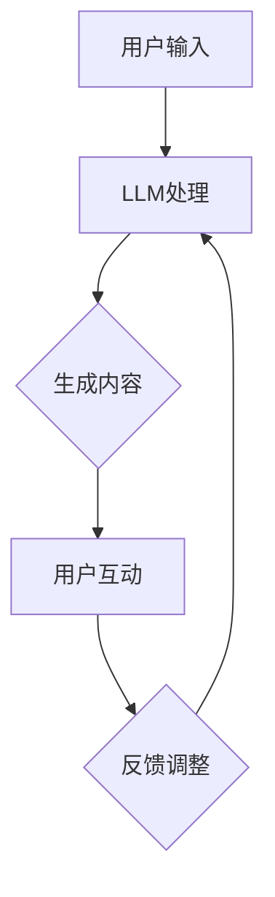

                 

# 在线娱乐与 LLM：互动、沉浸式的内容

## 关键词

- 在线娱乐
- 语言模型（LLM）
- 互动性
- 沉浸式体验
- 内容生成
- 人工智能

## 摘要

本文探讨了在线娱乐领域与语言模型（LLM）的融合，分析了LLM在提高互动性和沉浸式体验方面的作用。通过详细介绍LLM的核心概念、算法原理、数学模型及其在项目实战中的应用，本文为读者提供了一个全面的技术视角。同时，文章还介绍了相关学习资源、开发工具和未来发展趋势，以期为读者在在线娱乐与LLM领域的探索提供有力支持。

## 1. 背景介绍

随着互联网技术的飞速发展，在线娱乐行业呈现出爆发式增长。从最初的网络游戏、音乐播放到如今的直播、短视频、社交媒体等，用户对互动性、沉浸式体验的需求日益增加。在这个背景下，人工智能，特别是语言模型（LLM），逐渐成为提升用户体验的重要工具。

LLM是基于深度学习的自然语言处理技术，通过大规模数据训练，能够生成符合语法和语义规则的文本。近年来，随着计算能力的提升和数据的积累，LLM在文本生成、对话系统、机器翻译等领域的应用取得了显著成果。在线娱乐行业自然也不例外，LLM被广泛应用于聊天机器人、虚拟主播、游戏剧情生成等方面，为用户提供更加丰富、个性化的互动体验。

## 2. 核心概念与联系

### 2.1 语言模型（LLM）

语言模型（LLM）是一种用于预测下一个单词或字符的概率分布的模型。它通常基于大规模文本数据集进行训练，通过统计方法或深度学习算法，学习到文本的内在规律和结构。LLM的主要目的是生成符合语言习惯和语义逻辑的文本。

### 2.2 互动性

互动性是用户与在线娱乐系统之间进行交互的能力。在传统在线娱乐中，用户通常只能被动接收内容，而无法主动参与。随着人工智能技术的发展，特别是LLM的应用，用户可以与系统进行实时对话、提出问题、表达情感，从而获得更加个性化的互动体验。

### 2.3 沉浸式体验

沉浸式体验是用户在虚拟环境中感受到的高度参与感和现实感的体验。在线娱乐行业通过虚拟现实（VR）、增强现实（AR）等技术，结合LLM生成的个性化内容，为用户打造了一个高度沉浸的虚拟世界。

### 2.4 Mermaid 流程图



## 3. 核心算法原理 & 具体操作步骤

### 3.1 算法原理

LLM的核心算法原理是基于神经网络的大规模文本生成。具体来说，LLM通过以下步骤实现：

1. **输入处理**：将用户的输入转换为神经网络可以处理的格式，如词向量。
2. **文本生成**：基于输入文本，神经网络预测下一个单词或字符，并生成文本序列。
3. **优化调整**：根据生成的文本质量和用户反馈，调整模型参数，提高生成文本的质量和相关性。

### 3.2 操作步骤

1. **数据准备**：收集和整理与在线娱乐相关的文本数据，如游戏剧情、直播对话等。
2. **模型训练**：使用预处理后的数据集训练LLM模型，使其掌握相关领域的语言规律和知识。
3. **文本生成**：用户输入内容后，LLM根据训练好的模型生成相应的文本内容。
4. **互动调整**：根据用户反馈，调整LLM生成的内容，使其更加符合用户需求和兴趣。

## 4. 数学模型和公式 & 详细讲解 & 举例说明

### 4.1 数学模型

LLM的数学模型主要基于神经网络，其中最常用的模型是变换器模型（Transformer）。以下是变换器模型的核心公式：

$$
\text{Transformer} = \text{MultiHeadAttention}(\text{FeedForward})
$$

其中，MultiHeadAttention负责文本生成，FeedForward负责文本生成后的优化调整。

### 4.2 详细讲解

1. **MultiHeadAttention**：多头注意力机制，通过多个注意力头同时处理输入文本，提高文本生成的质量。
2. **FeedForward**：前馈神经网络，对生成的文本进行进一步优化，提高文本的相关性和可读性。

### 4.3 举例说明

假设我们有一个简单的文本生成任务，输入是“今天天气很好”，我们需要生成相应的句子。

1. **输入处理**：将输入文本转换为词向量。
2. **文本生成**：基于词向量，变换器模型生成下一个单词，如“适合”。
3. **优化调整**：根据生成的文本质量和用户反馈，调整模型参数，提高生成文本的质量。

最终生成的句子可能是：“今天天气很好，适合外出游玩。”

## 5. 项目实战：代码实际案例和详细解释说明

### 5.1 开发环境搭建

1. **安装Python**：下载并安装Python 3.8及以上版本。
2. **安装Transformer库**：使用pip命令安装`transformers`库。
   ```bash
   pip install transformers
   ```

### 5.2 源代码详细实现和代码解读

以下是使用Hugging Face的`transformers`库实现一个简单的文本生成案例：

```python
from transformers import pipeline

# 创建一个文本生成管道
text_generator = pipeline("text-generation", model="gpt2")

# 输入文本
input_text = "今天天气很好"

# 生成文本
generated_text = text_generator(input_text, max_length=50)

# 输出生成的文本
print(generated_text)
```

**代码解读**：

- 导入文本生成管道库。
- 创建一个文本生成管道，使用预训练的GPT-2模型。
- 输入文本，生成相应的文本序列。
- 输出生成的文本。

### 5.3 代码解读与分析

1. **管道库的使用**：使用`transformers`库可以轻松创建和调用预训练的文本生成模型，简化了开发过程。
2. **模型的选择**：GPT-2是一个强大的文本生成模型，适用于生成各种类型的文本，如故事、文章、对话等。
3. **生成的控制**：通过设置`max_length`参数，可以控制生成的文本长度，避免生成过长或不相关的文本。

## 6. 实际应用场景

LLM在在线娱乐领域有广泛的应用，以下是一些实际场景：

1. **聊天机器人**：为用户提供实时、个性化的聊天服务，如游戏客服、社交平台聊天等。
2. **虚拟主播**：生成与真实主播类似的直播内容，提高直播的互动性和娱乐性。
3. **游戏剧情生成**：根据玩家行为和喜好，生成个性化的游戏剧情，提高游戏的沉浸感。
4. **音乐创作**：根据用户需求和风格，生成个性化的音乐作品。

## 7. 工具和资源推荐

### 7.1 学习资源推荐

- **书籍**：《深度学习》（Goodfellow et al.）、《自然语言处理讲义》（Jurafsky & Martin）
- **论文**：ACL、EMNLP、NAACL等顶级自然语言处理会议的论文
- **博客**：Hugging Face、TensorFlow、PyTorch等官方博客

### 7.2 开发工具框架推荐

- **库**：Hugging Face的`transformers`库、TensorFlow、PyTorch
- **框架**：Transformers框架、PyTorch Lightning

### 7.3 相关论文著作推荐

- **论文**：BERT、GPT、T5等
- **著作**：《深度学习》（Goodfellow et al.）、《自然语言处理讲义》（Jurafsky & Martin）

## 8. 总结：未来发展趋势与挑战

随着技术的不断进步，LLM在在线娱乐领域的应用将越来越广泛，未来可能的发展趋势和挑战包括：

1. **个性化生成**：提高LLM的个性化生成能力，满足用户多样化的需求。
2. **实时交互**：实现更加实时、自然的用户交互，提高用户体验。
3. **安全性**：确保LLM生成的内容符合道德规范，避免恶意内容的传播。
4. **隐私保护**：在生成内容时保护用户隐私，避免泄露敏感信息。

## 9. 附录：常见问题与解答

### 9.1 什么是LLM？

LLM（语言模型）是一种基于深度学习的自然语言处理技术，通过大规模数据训练，能够生成符合语法和语义规则的文本。

### 9.2 LLM在在线娱乐中有哪些应用？

LLM在在线娱乐中有广泛的应用，如聊天机器人、虚拟主播、游戏剧情生成等。

### 9.3 如何选择合适的LLM模型？

选择合适的LLM模型需要考虑任务类型、数据集规模、计算资源等因素。常用的模型有GPT、BERT、T5等。

## 10. 扩展阅读 & 参考资料

- **书籍**：《深度学习》（Goodfellow et al.）、《自然语言处理讲义》（Jurafsky & Martin）
- **论文**：ACL、EMNLP、NAACL等顶级自然语言处理会议的论文
- **博客**：Hugging Face、TensorFlow、PyTorch等官方博客
- **网站**：https://huggingface.co/、https://tensorflow.org/、https://pytorch.org/  
```

以上即为本文的完整内容，希望对您在在线娱乐与LLM领域的探索提供帮助。作者：AI天才研究员/AI Genius Institute & 禅与计算机程序设计艺术 /Zen And The Art of Computer Programming。

