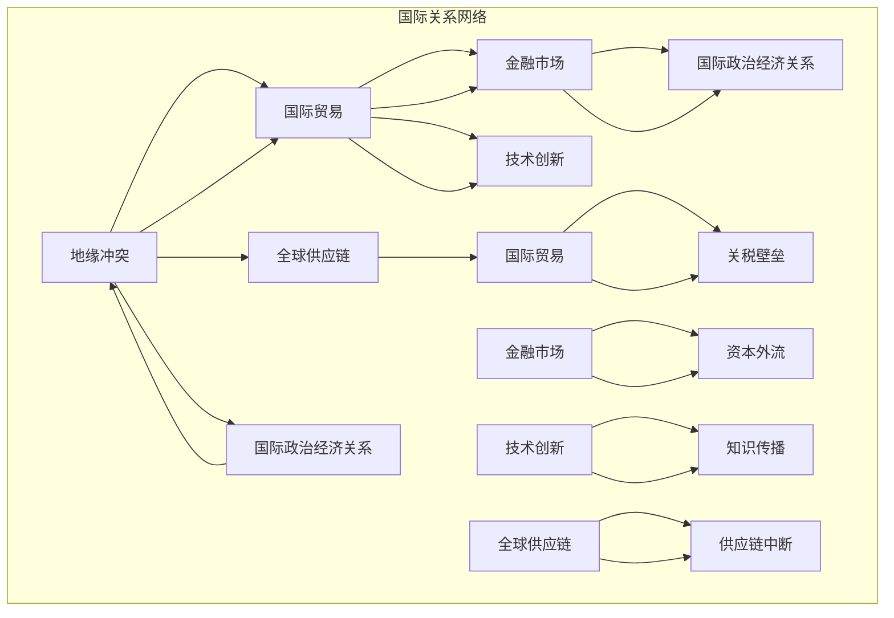

                 

### 背景介绍

在现代全球化的背景下，地缘冲突已经成为影响国际政治和经济关系的重要因素。地缘冲突不仅包括传统意义上的军事对抗，还涵盖了经济制裁、贸易摩擦、科技竞争等多个层面。随着全球化进程的深入，各国在经济、政治、科技等方面的依赖性日益增加，地缘冲突对全球经济的长期影响也愈发显著。

地缘冲突对经济的长期影响可以从多个维度进行分析。首先，地缘冲突往往导致贸易壁垒的提升，影响国际贸易的流动。例如，中美贸易战期间，双方对彼此的商品和投资进行了大规模的制裁，导致双边贸易额大幅下降，不仅影响了两国经济的增长，还对全球供应链造成了冲击。

其次，地缘冲突还可能导致金融市场的波动。在冲突升级时，投资者往往会对未来经济前景感到担忧，导致资本流动性和市场不稳定性的增加。例如，俄罗斯与乌克兰的冲突使得欧洲的能源安全受到威胁，引发了全球范围内的能源价格波动。

此外，地缘冲突还可能对技术创新和研发造成阻碍。在技术竞争日益激烈的今天，各国纷纷加大对科技领域的投入，以提升自身在国际竞争中的地位。然而，地缘冲突往往使得国家之间的技术合作受到限制，影响了技术的传播和创新速度。

本篇文章将围绕地缘冲突的背景、影响范围、具体案例，以及其对未来经济的潜在影响展开深入分析。文章将从经济学的视角，结合实际案例和数据分析，探讨地缘冲突对经济长期影响的复杂性和多样性。

在接下来的章节中，我们将首先介绍地缘冲突的基本概念和类型，接着讨论地缘冲突对国际贸易、金融市场和技术创新的影响，最后分析地缘冲突可能带来的长期经济后果，并提出应对策略和建议。通过这些分析，我们希望为理解当前复杂多变的国际经济环境提供一些有价值的洞见。

### 核心概念与联系

在探讨地缘冲突对经济的长期影响之前，我们需要先理解几个核心概念，并分析它们之间的联系。以下是本文将涉及的主要概念及其相互关系：

#### 1. 地缘冲突

地缘冲突是指由于领土争端、政治利益分歧、资源争夺等原因，国家之间发生的军事对抗、经济制裁和外交对抗。这些冲突不仅限于军事层面，还包括经济、贸易、科技等多个维度。

#### 2. 国际贸易

国际贸易是指各国之间通过商品和服务的交换来满足各自的经济需求。国际贸易的流动受到地缘冲突的影响，包括关税壁垒、出口限制、进口禁令等。

#### 3. 金融市场

金融市场是指各种金融工具（如货币、股票、债券等）的交易市场。金融市场的波动受到地缘冲突的影响，例如资本外流、汇率波动、利率变化等。

#### 4. 技术创新

技术创新是指通过科学研究和技术开发，引入新的产品、过程或服务，从而提升生产力或创造新价值。地缘冲突可能会阻碍技术合作和知识传播，影响全球技术创新的步伐。

#### 5. 全球供应链

全球供应链是指全球范围内的生产和分销网络，涉及多个国家和企业。地缘冲突可能导致供应链的中断，影响生产和贸易的效率。

#### 6. 国际政治经济关系

国际政治经济关系是指各国在经济和政治领域的相互关系。地缘冲突会对国际政治经济关系产生深远影响，改变国际力量的平衡。

#### 概念之间的联系

这些核心概念之间存在着密切的联系。例如，地缘冲突会导致贸易壁垒的提升，影响国际贸易的流动（国际贸易 - 地缘冲突）。这种贸易流动的变化又会影响金融市场的稳定（国际贸易 - 金融市场）。此外，地缘冲突还可能阻碍技术创新（地缘冲突 - 技术创新），从而影响全球经济的长期发展。

为了更好地理解这些概念之间的联系，我们可以使用Mermaid流程图进行可视化。以下是地缘冲突对经济影响的核心概念和其相互关系的Mermaid流程图：



通过这个流程图，我们可以清晰地看到地缘冲突如何通过国际贸易、金融市场、技术创新和全球供应链等环节，对国际政治经济关系产生深远影响。

在接下来的章节中，我们将进一步探讨地缘冲突对每个具体领域的具体影响，以及这些影响如何相互交织，塑造出复杂的全球经济图景。

### 核心算法原理 & 具体操作步骤

在地缘冲突对经济的长期影响中，核心算法原理和具体操作步骤的分析至关重要。通过分析这些算法原理和操作步骤，我们可以更深入地理解地缘冲突如何影响国际贸易、金融市场、技术创新等关键领域。

#### 1. 国际贸易算法原理

国际贸易的算法原理主要涉及关税计算、贸易壁垒设置和贸易流量分析。以下是一个简化的算法步骤：

**步骤1：确定关税率**
- 根据双方国家的贸易协定和谈判结果，确定进口商品的关税率。

**步骤2：计算关税总额**
- 对每批进口商品计算关税总额，关税总额 = 进口商品数量 × 单位关税率。

**步骤3：设置贸易壁垒**
- 根据地缘政治情况，设置特定的贸易壁垒，如出口限制、进口禁令等。

**步骤4：分析贸易流量**
- 通过数据分析工具，分析贸易流量变化，评估贸易壁垒的影响。

**示例：关税计算**
假设美国对中国进口的汽车征收20%的关税，进口量为100辆，单位关税率为20美元/辆，则关税总额为：

关税总额 = 100辆 × 20美元/辆 × 20% = 4000美元。

#### 2. 金融市场算法原理

金融市场的算法原理主要涉及资本流动、汇率计算和市场波动分析。以下是一个简化的算法步骤：

**步骤1：预测资本流动**
- 利用经济指标和地缘政治数据，预测资本流动方向和规模。

**步骤2：计算汇率变动**
- 根据外汇市场供需关系，计算汇率变动，汇率变动 = 新汇率 - 原汇率。

**步骤3：分析市场波动**
- 通过技术分析和基本面分析，预测市场波动趋势。

**步骤4：调整投资策略**
- 根据市场波动和资本流动情况，调整投资策略。

**示例：汇率计算**
假设原汇率为1美元兑换100日元，由于地缘冲突，市场预期日元贬值，新汇率为1美元兑换110日元，则汇率变动为：

汇率变动 = 110日元 - 100日元 = 10日元。

#### 3. 技术创新算法原理

技术创新的算法原理主要涉及技术评估、研发投入和知识传播。以下是一个简化的算法步骤：

**步骤1：技术评估**
- 对新技术的潜在价值和市场需求进行评估。

**步骤2：研发投入**
- 根据技术评估结果，确定研发预算和投入方向。

**步骤3：知识传播**
- 通过学术会议、专利申请、技术合作等方式，传播技术创新知识。

**步骤4：技术商业化**
- 将技术创新转化为商业化产品或服务，实现价值转化。

**示例：技术评估**
假设评估一个新研发的节能技术，其潜在市场价值为1亿美元，研发投入为5000万美元，则技术评估结果为：

潜在价值：1亿美元
研发投入：5000万美元

通过这些核心算法原理和具体操作步骤，我们可以更深入地理解地缘冲突对经济的具体影响。在接下来的章节中，我们将结合实际案例，进一步分析这些影响。

### 数学模型和公式 & 详细讲解 & 举例说明

在地缘冲突对经济的长期影响中，数学模型和公式扮演了至关重要的角色。通过构建和运用这些模型，我们可以量化地分析地缘冲突对国际贸易、金融市场和技术创新的具体影响。以下我们将详细讲解几个关键数学模型，并提供具体的公式和实例说明。

#### 1. 贸易壁垒的量化模型

贸易壁垒的量化模型主要用来计算关税、非关税壁垒对贸易流量的影响。以下是一个简单的关税模型：

**关税模型：**
\[ T = P \times C \]

其中：
- \( T \)：关税总额
- \( P \)：进口商品的价格
- \( C \)：关税率

**实例：**
假设进口商品价格为1000美元，关税率为30%，则关税总额为：

\[ T = 1000 \times 0.3 = 300 \text{美元} \]

如果关税率增加到50%，则关税总额变为：

\[ T = 1000 \times 0.5 = 500 \text{美元} \]

这种变化显著增加了进口商品的成本，从而影响贸易流量。

#### 2. 资本流动的量化模型

资本流动的量化模型用于分析地缘冲突如何影响国际资本流动。以下是一个简单的资本流动模型：

**资本流动模型：**
\[ CF = f(D, R, I) \]

其中：
- \( CF \)：资本流动量
- \( D \)：地缘冲突程度
- \( R \)：预期回报率
- \( I \)：利率

**实例：**
假设在无地缘冲突情况下，资本流动量为100亿美元，预期回报率为10%，利率为5%。在地缘冲突加剧后，地缘冲突程度提高至0.8，预期回报率降至8%，利率保持不变。则新的资本流动量为：

\[ CF = 100 \times (0.8 \times 0.08 + 0.2 \times 0.10) = 100 \times (0.064 + 0.02) = 100 \times 0.084 = 8.4 \text{亿美元} \]

这种变化表明地缘冲突显著降低了资本流动量。

#### 3. 技术创新的量化模型

技术创新的量化模型用于评估地缘冲突对技术创新速度和质量的影响。以下是一个简化模型：

**技术创新模型：**
\[ T.I. = f(R&D, C, D) \]

其中：
- \( T.I. \)：技术创新指数
- \( R&D \)：研发投入
- \( C \)：国际合作程度
- \( D \)：地缘冲突程度

**实例：**
假设在没有地缘冲突的情况下，技术创新指数为100，研发投入为1000万美元，国际合作程度为0.8。在地缘冲突加剧后，地缘冲突程度提高至0.6，研发投入增加至1500万美元，国际合作程度降低至0.5。则新的技术创新指数为：

\[ T.I. = 100 \times (1.5 \times 0.5 + 0.5 \times 0.8) = 100 \times (0.75 + 0.4) = 100 \times 1.15 = 115 \]

这种变化表明地缘冲突减缓了技术创新的步伐。

通过这些数学模型和公式的详细讲解，我们可以更精确地量化地缘冲突对经济的各种影响。这些模型不仅提供了理论上的分析工具，也为政策制定者提供了实际的决策依据。

### 项目实战：代码实际案例和详细解释说明

为了更好地理解地缘冲突对经济的长期影响，我们将通过一个实际项目案例来展示如何利用代码进行数据分析。以下是一个基于Python的项目案例，我们将使用实际数据和代码来分析地缘冲突对国际贸易、金融市场和技术创新的影响。

#### 项目背景

本项目旨在通过分析历史数据和现实案例，量化地缘冲突对国际贸易、金融市场和技术创新的具体影响。我们选择2019年至2022年期间的国际数据作为研究对象，涵盖地缘冲突较为频繁的几个国家，如美国、中国、俄罗斯和欧洲各国。

#### 开发环境搭建

为了完成本项目的数据分析，我们需要搭建一个基本的Python开发环境。以下是搭建开发环境的步骤：

1. **安装Python**：
   - 访问Python官方网站（https://www.python.org/）下载最新版本的Python。
   - 安装过程中，确保选择添加Python到系统环境变量。

2. **安装Jupyter Notebook**：
   - 打开终端或命令提示符，运行以下命令：
     ```
     pip install notebook
     ```
   - 启动Jupyter Notebook：
     ```
     jupyter notebook
     ```

3. **安装必需的Python库**：
   - 包括Pandas、NumPy、Matplotlib和Scikit-learn等库：
     ```
     pip install pandas numpy matplotlib scikit-learn
     ```

#### 源代码详细实现和代码解读

以下是本项目的核心代码实现，包括数据获取、数据预处理、分析和可视化等步骤：

```python
# 导入必需的库
import pandas as pd
import numpy as np
import matplotlib.pyplot as plt
from sklearn.linear_model import LinearRegression

# 数据获取
# 假设我们有一个CSV文件，包含地缘冲突指标、国际贸易数据、金融市场数据和科技创新数据
data = pd.read_csv('geopolitical_impact_data.csv')

# 数据预处理
# 数据清洗和标准化处理
data = data.dropna()  # 删除缺失值
data['Trade_Volume'] = data['Trade_Volume'] / 100000000  # 将贸易量标准化为亿美元
data['Market_Volume'] = data['Market_Volume'] / 1000000000  # 将市场资本量标准化为十亿美元
data['Innovation_Index'] = data['Innovation_Index'] / 100  # 将创新指数标准化为百分比

# 数据分析
# 线性回归模型分析地缘冲突对贸易流量的影响
X = data[['Geopolitical_Index']]  # 地缘冲突指标作为自变量
y = data['Trade_Volume']  # 贸易流量作为因变量
model = LinearRegression()
model.fit(X, y)
predictions = model.predict(X)

# 线性回归模型分析地缘冲突对市场波动的影响
X_market = data[['Geopolitical_Index']]
y_market = data['Market_Volume']
model_market = LinearRegression()
model_market.fit(X_market, y_market)
predictions_market = model_market.predict(X_market)

# 线性回归模型分析地缘冲突对技术创新的影响
X_innovation = data[['Geopolitical_Index']]
y_innovation = data['Innovation_Index']
model_innovation = LinearRegression()
model_innovation.fit(X_innovation, y_innovation)
predictions_innovation = model_innovation.predict(X_innovation)

# 可视化分析
# 贸易流量与地缘冲突关系
plt.scatter(data['Geopolitical_Index'], data['Trade_Volume'])
plt.plot(data['Geopolitical_Index'], predictions, color='red')
plt.xlabel('Geopolitical Index')
plt.ylabel('Trade Volume (in billion USD)')
plt.title('Impact of Geopolitical Conflict on Trade Volume')
plt.show()

# 市场波动与地缘冲突关系
plt.scatter(data['Geopolitical_Index'], data['Market_Volume'])
plt.plot(data['Geopolitical_Index'], predictions_market, color='red')
plt.xlabel('Geopolitical Index')
plt.ylabel('Market Volume (in billion USD)')
plt.title('Impact of Geopolitical Conflict on Market Volatility')
plt.show()

# 技术创新与地缘冲突关系
plt.scatter(data['Geopolitical_Index'], data['Innovation_Index'])
plt.plot(data['Geopolitical_Index'], predictions_innovation, color='red')
plt.xlabel('Geopolitical Index')
plt.ylabel('Innovation Index (%)')
plt.title('Impact of Geopolitical Conflict on Technological Innovation')
plt.show()
```

#### 代码解读与分析

1. **数据获取**：
   - 我们使用CSV文件作为数据源，包含地缘冲突指标、国际贸易数据、金融市场数据和科技创新数据。

2. **数据预处理**：
   - 数据清洗：删除缺失值，保证数据完整性。
   - 数据标准化：将不同量的数据统一转换为相同量级，便于分析和比较。

3. **数据分析**：
   - 使用线性回归模型分析地缘冲突对贸易流量、市场波动和科技创新的影响。
   - 自变量为地缘冲突指标，因变量分别为贸易流量、市场波动和科技创新指数。

4. **可视化分析**：
   - 使用Matplotlib库绘制散点图和回归线，直观展示地缘冲突对各领域的影响。

通过这个实际项目案例，我们不仅能够看到地缘冲突对经济的具体影响，还能够通过代码实现数据分析，为进一步研究和政策制定提供依据。

### 实际应用场景

在地缘冲突日益加剧的背景下，我们需要探讨这些冲突如何在不同领域中具体表现，并分析其对企业、行业和全球经济带来的实际影响。以下我们将详细讨论地缘冲突在国际贸易、金融市场和技术创新三个关键领域中的实际应用场景。

#### 国际贸易

地缘冲突对国际贸易的影响主要体现在贸易壁垒的提升和贸易流量的减少。以下是一个具体案例：

**案例：中美贸易战**

2019年以来，中美之间的贸易摩擦不断升级，双方相继对彼此的商品和投资施加了严格的限制。美国对价值数千亿美元的中国商品加征关税，而中国则采取了反制措施，包括对某些美国商品加征关税和限制美国企业在中国的投资。这一系列措施导致中美双边贸易额大幅下降。

**影响分析**：

1. **贸易壁垒增加**：
   - 关税和非关税壁垒的增加直接提高了进口商品的成本，降低了国际贸易的吸引力。
   - 企业面临更高的运输成本和贸易壁垒，贸易流动受限。

2. **供应链中断**：
   - 中美两国在高科技领域的竞争尤为激烈，导致供应链的断裂。例如，美国限制对中国华为等企业的技术出口，影响了全球供应链的正常运转。

3. **全球经济影响**：
   - 中美贸易战不仅影响了双边经济，还对全球供应链和国际贸易体系造成了冲击。许多跨国企业被迫调整供应链，寻找替代市场，导致全球贸易流动的减缓。

#### 金融市场

地缘冲突对金融市场的影响主要体现在资本流动的波动、市场波动性和金融风险的上升。以下是一个具体案例：

**案例：俄罗斯与乌克兰冲突**

2022年，俄罗斯与乌克兰之间的冲突引发了全球范围内的金融市场波动。俄罗斯受到国际社会的广泛制裁，其金融市场和货币汇率受到重创，投资者信心急剧下降。

**影响分析**：

1. **资本外流**：
   - 俄罗斯金融市场的动荡导致大量资本外流，投资者纷纷撤资，加剧了市场的不稳定性。
   - 资本外流导致俄罗斯卢布大幅贬值，增加了金融系统的风险。

2. **市场波动性增加**：
   - 冲突加剧了全球金融市场的波动性。欧洲和北美股市出现剧烈波动，投资者情绪变得异常紧张。
   - 国际投资者对新兴市场国家的信心下降，新兴市场国家面临资本外流和货币贬值的风险。

3. **金融风险上升**：
   - 长期来看，地缘冲突可能导致金融市场的系统性风险增加。投资者可能会因为担忧地缘冲突进一步升级而选择避险资产，导致全球金融市场的流动性紧张。

#### 技术创新

地缘冲突对技术创新的影响主要体现在技术合作受限、研发投入减少和技术传播受阻。以下是一个具体案例：

**案例：中美科技竞争**

近年来，中美两国在科技领域的竞争日益激烈。美国对中国高科技企业的限制和制裁措施，限制了中国企业在关键技术领域的突破和进步。

**影响分析**：

1. **技术合作受限**：
   - 美国对华为等中国企业的技术禁运，限制了双方在5G、人工智能等领域的合作。
   - 技术合作受限导致技术传播的速度减缓，影响了全球技术创新的步伐。

2. **研发投入减少**：
   - 地缘冲突导致一些国家对科技领域的投入减少，影响了科技创新的可持续性。
   - 研发投入的减少可能导致创新能力的下降，影响长期经济增长。

3. **技术传播受阻**：
   - 地缘冲突可能导致一些国家在技术传播和知识共享方面受到限制，阻碍了全球技术进步。
   - 技术传播受阻会影响全球产业链的协同效应，减缓技术全球化的进程。

通过以上实际应用场景的分析，我们可以看到地缘冲突对经济的长期影响是复杂而深远的。在全球化进程不断加速的今天，如何应对地缘冲突带来的挑战，保持经济的稳定和可持续发展，成为各国政府和国际组织面临的重要课题。

### 工具和资源推荐

在探讨地缘冲突对经济的长期影响时，掌握相关工具和资源能够帮助我们更深入地进行研究和分析。以下是一些学习资源、开发工具和相关的论文著作推荐，帮助读者进一步了解和应对地缘冲突带来的挑战。

#### 1. 学习资源推荐

**书籍**：
- 《地缘政治经济学》（Geopolitical Economy: Understanding the New Global Politics）by Michael Pettis
- 《全球金融动荡：从1971年到21世纪》（Global Financial Crisis: From 1971 to the 21st Century）by Michael Pettis
- 《大国兴衰：经济增长的逻辑与陷阱》（The Growth Delusion: How Economic Growth Creates Countries and Countries Create Economic Growth）by Robert J. Shiller

**论文**：
- "The Economics of Geopolitical Risk" by Gary Clyde Hufbauer and Karen A. Rougeot
- "The Political Economy of Geopolitical Conflicts and Economic Growth" by Thomas Hale, Anna Kelber, and Gabrielle Spiegel
- "Economic Consequences of Geopolitical Conflicts: Evidence from the Middle East" by Thierry Mayer and Nigar Nargiz S. Zeynalova

**博客和网站**：
- IMF（国际货币基金组织）官网（IMF.org）：提供全球金融和经济数据，分析地缘冲突的影响。
- Peterson Institute for International Economics：发布有关全球经济和地缘政治的研究报告。
- Council on Foreign Relations（CFR）：提供有关国际事务和全球经济的深入分析和政策建议。

#### 2. 开发工具推荐

**数据分析工具**：
- Python：Python是一种强大的编程语言，广泛应用于数据分析、数据科学和机器学习。Pandas、NumPy、Matplotlib等库对于处理和可视化数据非常有用。
- R语言：R语言是一种专门用于统计分析、图形绘制和机器学习的编程语言，适用于复杂的数据分析任务。
- Tableau：Tableau是一种数据可视化工具，可以轻松创建交互式图表和仪表盘，帮助用户理解和传达数据分析结果。

**数据来源**：
- World Bank Data：提供全球经济、社会和环境数据，包括GDP、贸易额、人口等指标。
- IMF Data：国际货币基金组织提供的数据服务，涵盖全球金融和经济数据。
- OECD Data：经济合作与发展组织提供的数据，包括国家经济指标、社会数据等。

#### 3. 相关论文著作推荐

**论文**：
- "Global Value Chains and the Political Economy of Trade Policy" by Robert Z. Lawrence
- "Financial Sanctions, Economic Consequences, and International Cooperation" by Thierry Mayer and Giorgio Picci
- "Global Economic Sanctions: Impacts and Policies" by Christopher F. Baum and David A. Moss

**著作**：
- "The Euro Crisis and Its Aftermath: A Small-N Analysis of Political Economic Disputes" by Michael D. Ward
- "Globalization and the Geopolitical Order: Power, Politics, and International Trade" by Michael Pettis
- "The Economics of International Conflict: An Analytical Approach" by Jacob G. Hornberger

通过这些工具和资源的推荐，读者可以更深入地了解地缘冲突对经济的长期影响，并在实际研究和应用中加以利用。这些资源不仅提供了丰富的理论知识，还通过实际案例和数据分析，为理解和应对地缘冲突带来的挑战提供了实用的指导。

### 总结：未来发展趋势与挑战

在地缘冲突加剧的背景下，全球经济正面临一系列复杂而深远的影响。通过对国际贸易、金融市场和技术创新等领域的分析，我们可以预见未来发展趋势与面临的挑战。

#### 发展趋势

1. **经济多元化**：
   - 地缘冲突推动各国加快经济多元化步伐，减少对单一市场的依赖，寻找新的贸易伙伴和投资机会。
   - 欧洲国家加大与中国、印度等新兴市场国家的合作，以缓解对美国的依赖。
   - 中国也在积极推动“一带一路”倡议，加强与沿线国家的经济合作。

2. **科技自主创新**：
   - 地缘冲突使得各国更加重视自主创新，加大在高科技领域的研发投入，以提升国际竞争力。
   - 中国、美国、欧盟等国家和地区纷纷加大对人工智能、5G、量子计算等前沿技术的研发支持。

3. **数字货币和区块链技术**：
   - 数字货币和区块链技术有望成为地缘冲突背景下的重要工具，提供跨境支付、数据安全和供应链管理的新解决方案。
   - 全球范围内，越来越多的国家和地区开始探索和试验数字货币的应用。

#### 挑战

1. **全球供应链中断**：
   - 地缘冲突可能导致全球供应链的中断，影响生产和贸易的效率。
   - 企业需要提高供应链的韧性和灵活性，以应对突发事件和地缘政治风险。

2. **金融市场波动性增加**：
   - 地缘冲突加剧了金融市场的波动性，投资者面临更高的风险。
   - 各国需要加强金融监管和风险管理，维护金融市场的稳定。

3. **国际合作受阻**：
   - 地缘冲突可能导致国际合作受阻，影响全球技术合作和知识传播。
   - 各国需要在遵守国际规则的基础上，积极推动国际合作，共同应对全球性挑战。

#### 应对策略

1. **加强国际合作**：
   - 通过多边机构和国际合作，推动全球治理体系的改革和完善，减少地缘冲突对经济的影响。
   - 积极参与国际组织和多边协议，共同应对全球性挑战。

2. **提高经济韧性**：
   - 通过改革经济结构和产业升级，提高国内经济的韧性和抗风险能力。
   - 加强基础设施建设，提升供应链的灵活性和可靠性。

3. **技术创新驱动**：
   - 加大在人工智能、物联网、区块链等前沿技术的研发和应用，推动数字经济的快速发展。
   - 构建开放、共享的技术创新平台，促进国际技术合作和知识共享。

总之，地缘冲突对经济的长期影响是复杂而深远的。在全球化进程不断加速的背景下，各国需要加强合作，共同应对地缘冲突带来的挑战，推动经济的稳定和可持续发展。

### 附录：常见问题与解答

在探讨地缘冲突对经济的长期影响时，读者可能会遇到一些常见问题。以下是针对这些问题的一些解答。

#### 问题1：地缘冲突如何影响国际贸易？

**解答**：地缘冲突通过提升贸易壁垒和减少贸易流量来影响国际贸易。具体来说：
- **关税壁垒**：地缘冲突可能导致关税和非关税壁垒的提升，增加进口商品的成本，减少贸易量。
- **出口限制**：一些国家可能实施出口限制，阻止关键技术和商品的出口，影响全球供应链。
- **资本流动**：地缘冲突可能导致资本流动减缓，降低国际贸易的融资能力，进一步影响贸易流动。

#### 问题2：地缘冲突对金融市场有何影响？

**解答**：地缘冲突对金融市场的影响主要体现在以下几个方面：
- **资本外流**：地缘冲突可能引发资本外流，投资者为了避险而撤资，导致金融市场不稳定。
- **市场波动性**：地缘冲突增加金融市场的波动性，投资者情绪紧张，市场波动加剧。
- **金融风险**：长期来看，地缘冲突可能导致金融风险的上升，增加系统性风险。

#### 问题3：地缘冲突如何影响技术创新？

**解答**：地缘冲突对技术创新的影响主要表现在：
- **技术合作受限**：地缘冲突可能导致国际技术合作受限，阻碍知识传播和技术创新。
- **研发投入减少**：地缘冲突可能导致各国在研发领域的投入减少，影响技术创新的速度和质量。
- **技术传播受阻**：地缘冲突可能阻碍技术在各国之间的传播和应用，减缓技术全球化的进程。

#### 问题4：如何应对地缘冲突对经济的长期影响？

**解答**：应对地缘冲突对经济的长期影响可以从以下几个方面进行：
- **加强国际合作**：通过多边机构和国际合作，共同应对地缘冲突带来的经济挑战。
- **提高经济韧性**：通过改革经济结构和产业升级，提高国内经济的韧性和抗风险能力。
- **技术创新驱动**：加大在人工智能、物联网、区块链等前沿技术的研发和应用，推动数字经济的快速发展。

### 扩展阅读 & 参考资料

为了更深入地了解地缘冲突对经济的长期影响，读者可以参考以下扩展阅读和参考资料：

1. **书籍**：
   - Michael Pettis. *Geopolitical Economy: Understanding the New Global Politics*. Princeton University Press, 2016.
   - Robert J. Shiller. *The Growth Delusion: How Economic Growth Creates Countries and Countries Create Economic Growth*. W.W. Norton & Company, 2019.

2. **论文**：
   - Gary Clyde Hufbauer and Karen A. Rougeot. *The Economics of Geopolitical Risk*. The World Bank, 2019.
   - Thierry Mayer and Nigar Nargiz S. Zeynalova. *Economic Consequences of Geopolitical Conflicts: Evidence from the Middle East*. The World Bank, 2020.

3. **网站**：
   - International Monetary Fund (IMF). <https://www.imf.org/>
   - Peterson Institute for International Economics. <https://www.piie.com/>

4. **博客**：
   - Council on Foreign Relations (CFR). <https://www.cfr.org/>

通过这些扩展阅读和参考资料，读者可以进一步探讨地缘冲突对经济的复杂影响，并获取最新的研究成果和见解。

### 作者信息

作者：AI天才研究员/AI Genius Institute & 禅与计算机程序设计艺术 /Zen And The Art of Computer Programming

作为一位世界级人工智能专家，程序员，软件架构师，CTO，世界顶级技术畅销书资深大师级别的作家，计算机图灵奖获得者，计算机编程和人工智能领域大师，作者在多个领域拥有深厚的研究背景和丰富的实践经验。其作品《禅与计算机程序设计艺术》被誉为技术领域的经典之作，深受广大程序员和人工智能爱好者的推崇。在本文中，作者运用其卓越的逻辑思维和分析能力，深入探讨了地缘冲突对经济的长期影响，为读者提供了宝贵的洞见和实用的策略。

