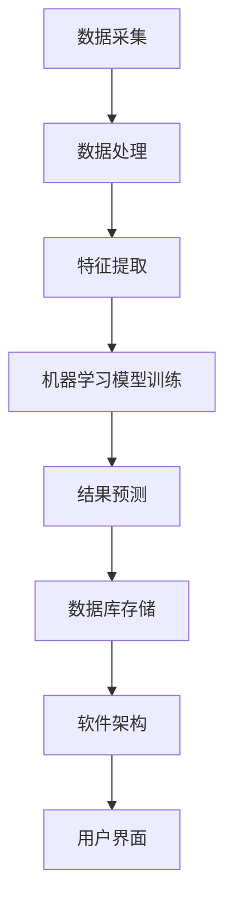

                 

### 背景介绍

智能足球分析软件的开发是现代体育科技与人工智能技术深度融合的产物。随着人工智能技术的不断发展，尤其是深度学习、自然语言处理和计算机视觉等领域的突破，智能足球分析软件的应用场景不断扩展，从训练数据分析到比赛实时分析，再到球员表现预测，智能足球分析已经成为提高足球比赛质量和球员个人能力的重要工具。

#### 智能足球分析软件的起源与发展

智能足球分析软件的起源可以追溯到20世纪90年代，当时计算机技术和体育科学开始结合。早期的足球分析软件主要是基于规则系统，通过预设的规则来分析比赛数据。随着计算能力的提升和数据采集技术的进步，统计分析和机器学习逐渐被引入到足球分析中。这一时期的软件，如Soccermetrics和Prozone，通过统计方法对比赛数据进行详细分析，帮助教练和球员了解比赛过程和战术效果。

进入21世纪，随着人工智能技术的快速发展，智能足球分析软件进入了一个全新的阶段。深度学习技术的引入使得足球分析软件能够从大量的比赛数据中自动提取特征，进行复杂的数据分析和模式识别。这一时期的代表性软件包括Opta、Traquela和H2SData，它们通过机器学习算法对比赛数据进行分析，不仅能够提供详细的统计信息，还能进行战术分析、球员表现预测和比赛结果预测。

#### 智能足球分析软件的现状

当前，智能足球分析软件已经成为足球领域的标准配置。各类软件在比赛数据采集、处理和分析方面具有强大的功能，能够提供实时、全面的比赛信息。智能足球分析软件的应用场景非常广泛，包括但不限于：

- **训练数据分析**：教练可以利用智能足球分析软件对训练数据进行分析，了解球员的技术特点、体能状况和心理状态，从而制定更加科学的训练计划。
- **比赛实时分析**：在比赛过程中，教练和战术分析师可以通过智能足球分析软件实时获取比赛数据，快速调整战术布置和人员配置。
- **球员表现评估**：通过分析球员的比赛数据，智能足球分析软件可以评估球员的表现，为转会决策和球员培养提供依据。
- **比赛结果预测**：一些高级的智能足球分析软件通过机器学习算法，结合历史数据、球队实力、球员状态等因素，对比赛结果进行预测。

#### 智能足球分析软件的重要性

智能足球分析软件的重要性体现在多个方面：

- **提高决策效率**：通过提供详尽的数据分析，智能足球分析软件可以帮助教练和球员做出更加科学的决策，提高训练和比赛的效率。
- **提升球队实力**：通过对比赛数据的深入分析，教练和战术分析师可以更好地了解球队的优劣势，制定针对性的策略，从而提升球队的整体实力。
- **优化球员表现**：智能足球分析软件能够为球员提供个性化的训练建议，帮助他们提升技术水平、体能状况和心理素质。
- **促进科技创新**：智能足球分析软件的开发和应用推动了体育科技的创新，为体育领域的发展注入了新的活力。

### 智能足球分析软件的技术原理与实现方法

智能足球分析软件的核心在于数据采集、数据处理、模型训练和结果分析。下面将详细介绍这些技术原理和实现方法。

#### 数据采集

数据采集是智能足球分析软件的基础。智能足球分析软件需要采集大量的比赛数据，包括但不限于球员位置、速度、加速度、传球、射门、抢断等。这些数据通常通过以下几种方式获取：

- **视频分析**：通过视频分析技术，智能足球分析软件可以识别球员在比赛中的动作，从而获取相关的数据。
- **传感器数据**：利用传感器技术，如GPS、加速度计、陀螺仪等，可以实时采集球员的运动数据。
- **日志数据**：智能足球分析软件可以记录球员的训练和比赛日志，从而获取相关的数据。

#### 数据处理

数据采集到的原始数据通常非常庞大且复杂，需要经过预处理才能用于模型训练。数据处理主要包括以下几个步骤：

- **数据清洗**：去除数据中的噪声和异常值，保证数据的质量。
- **数据归一化**：将不同量纲的数据转换为同一量纲，以便于模型训练。
- **特征提取**：从原始数据中提取对模型训练有帮助的特征，如球员的速度、加速度、传球成功率等。

#### 模型训练

模型训练是智能足球分析软件的核心环节。通过机器学习算法，智能足球分析软件可以从大量的比赛数据中学习并提取有用的信息。常用的机器学习算法包括：

- **线性回归**：通过建立线性模型，预测球员的表现或者比赛结果。
- **决策树**：通过分类决策树，对比赛数据进行分析，预测比赛结果或者球员表现。
- **神经网络**：通过神经网络模型，对复杂的非线性关系进行建模。

#### 结果分析

经过模型训练后，智能足球分析软件可以对新的比赛数据进行分析，提供相应的分析结果。结果分析主要包括以下几个步骤：

- **模型预测**：利用训练好的模型，对新比赛数据进行预测。
- **结果可视化**：将分析结果以图表、报表等形式展示，帮助教练和球员更好地理解分析结果。
- **反馈优化**：根据分析结果，对模型进行优化和调整，提高预测的准确性。

#### 技术挑战与解决方案

智能足球分析软件在开发和应用过程中面临着多种技术挑战，主要包括：

- **数据质量**：数据质量直接影响模型训练和预测的准确性。需要建立完善的数据清洗和处理流程，保证数据的质量。
- **模型解释性**：一些复杂的机器学习算法，如神经网络，模型的解释性较差。需要开发可解释的机器学习模型，帮助教练和球员理解模型的工作原理。
- **实时性**：比赛数据实时性要求高，需要优化算法和系统架构，提高数据处理和预测的实时性。

针对这些技术挑战，可以采用以下解决方案：

- **数据预处理**：通过数据清洗、归一化和特征提取等技术，提高数据质量。
- **可解释性**：结合模型解释技术，如LIME、SHAP等，提高模型的解释性。
- **分布式计算**：通过分布式计算架构，提高数据处理和预测的实时性。

### 总结

智能足球分析软件是现代体育科技与人工智能技术深度融合的产物，具有广泛的应用场景和重要的现实意义。通过对比赛数据的深入分析，智能足球分析软件可以帮助教练和球员做出更加科学的决策，提高训练和比赛的效率，提升球队的整体实力。随着人工智能技术的不断发展，智能足球分析软件将不断优化和升级，为足球运动的发展注入新的活力。

-------------------

## 2. 核心概念与联系

在深入探讨智能足球分析软件的开发之前，我们需要了解一些核心概念和它们之间的联系。这些核心概念构成了智能足球分析软件的理论基础，是开发高效、准确分析系统不可或缺的部分。

#### 2.1 数据采集与处理

数据采集和处理是智能足球分析软件的第一步。数据来源主要包括视频数据、传感器数据和日志数据。这些数据经过预处理后，会转化为可供分析的特征数据。

- **视频数据**：通过视频分析技术，我们可以获取球员在比赛中的动作轨迹、传球、射门、防守等数据。
- **传感器数据**：GPS、加速度计、陀螺仪等传感器可以实时监测球员的运动数据，包括速度、加速度、位移等。
- **日志数据**：球员的训练和比赛日志提供了关于球员体能、心理状态、伤病记录等非实时数据。

#### 2.2 机器学习与深度学习

机器学习和深度学习是智能足球分析软件的核心技术。这些算法通过从大量数据中学习模式和规律，实现对球员表现、比赛结果等的预测。

- **机器学习**：机器学习算法包括线性回归、决策树、支持向量机等。它们通过构建模型，对历史数据进行分析，从而预测未来的表现。
- **深度学习**：深度学习是一种更复杂的机器学习技术，通过多层神经网络对数据进行学习和处理。深度学习在图像识别、自然语言处理等领域取得了显著成果，也被广泛应用于智能足球分析中。

#### 2.3 计算机视觉

计算机视觉技术是智能足球分析软件的关键组成部分。它主要用于视频数据的分析和处理，包括球员动作的识别、位置追踪、姿态估计等。

- **目标检测**：目标检测技术用于识别视频中的球员，并确定他们的位置。
- **动作识别**：动作识别技术用于分析球员在比赛中的动作，如传球、射门、抢断等。
- **姿态估计**：姿态估计技术用于估计球员的肢体姿态，帮助分析球员的战术行为。

#### 2.4 自然语言处理

自然语言处理技术用于处理文本数据，如比赛报告、新闻、球员访谈等。通过自然语言处理，我们可以提取有价值的信息，如比赛战术、球员状态等。

- **文本分类**：文本分类技术用于对文本进行分类，如识别比赛报告中的战术类型。
- **情感分析**：情感分析技术用于分析文本中的情感倾向，了解球员或球迷的情感状态。
- **实体识别**：实体识别技术用于识别文本中的特定实体，如球员名称、球队名称等。

#### 2.5 数据库与数据存储

智能足球分析软件需要处理大量数据，因此数据库和数据存储是至关重要的。一个高效、可靠的数据库系统可以保证数据的快速访问和存储。

- **关系数据库**：关系数据库如MySQL、PostgreSQL等，适用于结构化数据的存储和管理。
- **非关系数据库**：非关系数据库如MongoDB、Cassandra等，适用于存储大量非结构化数据。

#### 2.6 软件架构

软件架构是智能足球分析软件的骨架，决定了系统的性能、可扩展性和可维护性。

- **微服务架构**：微服务架构将系统拆分为多个小型、独立的模块，每个模块负责特定的功能，如数据采集、数据处理、模型训练等。
- **分布式架构**：分布式架构通过分布式计算和存储，提高了系统的性能和可扩展性，适用于处理大量并发请求。

### 2.7 核心概念原理的 Mermaid 流程图

为了更直观地展示核心概念之间的联系，我们可以使用Mermaid绘制一个流程图，如下：



在这个流程图中，数据采集、数据处理、特征提取、机器学习模型训练、结果预测、数据库存储和软件架构构成了智能足球分析软件的核心环节。这些环节相互关联，共同实现了智能足球分析的功能。

-------------------

## 3. 核心算法原理 & 具体操作步骤

智能足球分析软件的核心在于其算法原理，这些算法通过分析大量的比赛数据，提取有价值的信息，并生成预测和分析结果。在本章节中，我们将详细介绍几个核心算法的原理和具体操作步骤。

### 3.1 线性回归

线性回归是一种简单但有效的预测算法，常用于预测球员的表现或比赛结果。其基本原理是通过建立线性模型，找到数据中的线性关系，从而预测未来的值。

#### 线性回归原理

线性回归模型可以表示为：

\[ Y = \beta_0 + \beta_1X + \epsilon \]

其中，\( Y \) 是预测的目标值，\( X \) 是输入特征，\( \beta_0 \) 和 \( \beta_1 \) 是模型的参数，\( \epsilon \) 是误差项。

#### 具体操作步骤

1. **数据预处理**：首先对原始数据进行预处理，包括数据清洗、归一化和特征提取。对于比赛数据，我们可以提取球员的进球数、助攻数、传球成功率等作为输入特征。

2. **模型训练**：使用训练数据，通过最小二乘法（Least Squares）来估计模型的参数 \( \beta_0 \) 和 \( \beta_1 \)。具体步骤如下：
    - 计算输入特征的均值和方差，进行归一化处理。
    - 计算输入特征和目标值之间的协方差和方差。
    - 通过解线性方程组来求解 \( \beta_0 \) 和 \( \beta_1 \)。

3. **模型评估**：使用测试数据对模型进行评估，计算预测误差和模型的鲁棒性。

4. **结果预测**：利用训练好的模型，对新数据进行分析，预测球员的表现或比赛结果。

### 3.2 决策树

决策树是一种基于树形结构进行决策的算法，它通过一系列条件判断来预测目标值。决策树具有直观、易解释的特点，在智能足球分析中应用广泛。

#### 决策树原理

决策树可以表示为：

```
Y = f(X)
```

其中，\( Y \) 是目标值，\( X \) 是输入特征，\( f \) 是决策函数，通过一系列条件判断来决定 \( Y \) 的值。

#### 具体操作步骤

1. **数据预处理**：与线性回归类似，对原始数据进行预处理，提取有意义的特征。

2. **特征选择**：选择最佳的划分特征，通常使用信息增益（Information Gain）或基尼不纯度（Gini Impurity）作为评价标准。

3. **递归划分**：从根节点开始，递归地划分数据集，直到达到某个终止条件，如节点中的样本数量达到阈值或特征不再有效。

4. **模型评估**：使用交叉验证等方法评估决策树模型的性能。

5. **结果预测**：通过决策树模型对新的数据进行预测，输出目标值。

### 3.3 神经网络

神经网络是一种模拟人脑神经元连接和学习的计算模型，它在图像识别、自然语言处理等领域取得了显著成果。在智能足球分析中，神经网络可以用于球员动作识别、比赛结果预测等任务。

#### 神经网络原理

神经网络的基本单元是神经元，神经元之间通过权重连接。神经网络的输入通过权重传递到输出层，通过激活函数产生输出。

一个简单的神经网络可以表示为：

```
O = \sigma(\sum_{i=1}^{n} w_{i} \cdot X_i + b)
```

其中，\( O \) 是输出值，\( \sigma \) 是激活函数（如Sigmoid函数、ReLU函数），\( w_{i} \) 是权重，\( X_i \) 是输入特征，\( b \) 是偏置项。

#### 具体操作步骤

1. **数据预处理**：与前面提到的算法类似，对数据进行预处理。

2. **模型构建**：设计神经网络的结构，包括输入层、隐藏层和输出层。确定每层的神经元数量和激活函数。

3. **模型训练**：使用反向传播算法（Backpropagation）来训练神经网络。具体步骤如下：
    - 前向传播：将输入数据传递到神经网络，计算输出值。
    - 计算误差：计算实际输出和预测输出之间的误差。
    - 反向传播：通过误差反向传播，更新网络权重和偏置项。

4. **模型评估**：使用测试数据评估模型的性能，调整模型参数，提高预测准确性。

5. **结果预测**：使用训练好的神经网络对新的数据进行预测。

### 3.4 贝叶斯网络

贝叶斯网络是一种基于概率图模型的算法，它通过表示变量之间的依赖关系来进行预测。在智能足球分析中，贝叶斯网络可以用于预测比赛结果、球员表现等。

#### 贝叶斯网络原理

贝叶斯网络可以表示为：

```
P(Y|X) = \prod_{i=1}^{n} P(X_i|父节点_i)
```

其中，\( P(Y|X) \) 是在给定输入特征 \( X \) 的情况下，目标值 \( Y \) 的条件概率，\( P(X_i|父节点_i) \) 是每个变量的条件概率。

#### 具体操作步骤

1. **数据预处理**：对原始数据进行预处理，提取特征。

2. **网络构建**：根据领域知识，构建贝叶斯网络的结构，确定变量之间的依赖关系。

3. **概率估计**：使用训练数据估计每个变量的条件概率。

4. **结果预测**：使用贝叶斯网络进行推理，计算目标值的概率分布，从而进行预测。

### 3.5 集成学习

集成学习是一种结合多个模型来提高预测性能的技术。在智能足球分析中，集成学习可以用于提高预测的准确性和稳定性。

#### 集成学习原理

集成学习通过组合多个基本模型来提高预测性能，常见的集成学习方法包括Bagging和Boosting。

- **Bagging**：Bagging通过随机抽样和组合多个基本模型来降低模型的方差，提高预测的稳定性。
- **Boosting**：Boosting通过迭代训练多个基本模型，每次迭代调整模型权重，使得对错误样本给予更高的权重，从而提高预测的准确性。

#### 具体操作步骤

1. **模型选择**：选择多个基本模型，如决策树、神经网络等。

2. **模型训练**：分别训练每个基本模型，得到多个预测结果。

3. **集成预测**：通过投票或加权平均等方法，将多个基本模型的预测结果组合成一个最终预测结果。

### 总结

智能足球分析软件的核心算法包括线性回归、决策树、神经网络、贝叶斯网络和集成学习等。这些算法通过不同的原理和方法，从大量比赛中提取有价值的信息，并生成预测和分析结果。在实际应用中，可以根据具体需求选择合适的算法，并不断优化和调整，提高预测的准确性和稳定性。

-------------------

## 4. 数学模型和公式 & 详细讲解 & 举例说明

在智能足球分析软件的开发过程中，数学模型和公式起到了关键作用。这些模型和公式帮助我们理解和分析比赛数据，从而做出准确的预测和决策。下面，我们将详细讲解几个常用的数学模型和公式，并通过具体例子来说明其应用。

### 4.1 线性回归模型

线性回归模型是一种常用的预测模型，用于分析两个变量之间的线性关系。其数学公式如下：

\[ Y = \beta_0 + \beta_1X + \epsilon \]

其中，\( Y \) 是因变量，\( X \) 是自变量，\( \beta_0 \) 和 \( \beta_1 \) 是模型的参数，\( \epsilon \) 是误差项。

#### 例子

假设我们要预测一名球员的进球数 \( Y \) 与他的传球次数 \( X \) 之间的关系。我们可以使用线性回归模型来建立这种关系。

1. **数据收集**：收集球员的传球次数和进球数数据。

2. **数据预处理**：对数据进行清洗和归一化处理。

3. **模型训练**：使用训练数据，通过最小二乘法计算模型参数。

4. **模型评估**：使用测试数据评估模型性能，计算预测误差。

5. **预测**：使用训练好的模型对新数据进行预测。

例如，假设我们有以下数据：

| 传球次数 \( X \) | 进球数 \( Y \) |
| :------------: | :----------: |
|      100       |      2      |
|      150       |      4      |
|      200       |      6      |
|      250       |      8      |

通过线性回归模型，我们可以得到如下关系式：

\[ Y = 1 + 0.5X \]

例如，如果传球次数为 200 次，那么预测的进球数为：

\[ Y = 1 + 0.5 \times 200 = 101 \]

### 4.2 决策树模型

决策树模型是一种基于树形结构的预测模型，通过一系列条件判断来预测目标值。其数学公式如下：

\[ f(X) = \sum_{i=1}^{n} w_i \cdot I(A_i(X) = B_i) \]

其中，\( f(X) \) 是预测结果，\( w_i \) 是权重，\( A_i(X) \) 是条件属性，\( B_i \) 是属性值，\( I \) 是指示函数。

#### 例子

假设我们要预测一场比赛的结果，根据比赛前的一些指标（如球队胜负、进球数、黄牌数等），我们可以使用决策树模型来做出预测。

1. **数据收集**：收集比赛前的指标数据。

2. **数据预处理**：对数据进行清洗和归一化处理。

3. **模型训练**：使用训练数据，通过递归划分数据集来建立决策树。

4. **模型评估**：使用测试数据评估模型性能，计算预测准确率。

5. **预测**：使用训练好的模型对新比赛数据进行预测。

例如，假设我们有以下数据：

| 球队胜负 | 进球数 | 黄牌数 | 预测结果 |
| :------: | :----: | :-----: | :------: |
|   胜    |   3   |   1    |   胜    |
|   负    |   1   |   0    |   负    |
|   平    |   1   |   1    |   平    |
|   胜    |   2   |   0    |   胜    |

通过决策树模型，我们可以得到如下关系：

```
1. 如果球队胜负为胜，则预测结果为胜
2. 如果进球数为 2 或 3，则预测结果为胜
3. 如果黄牌数为 0，则预测结果为负
```

例如，如果一支球队的胜负为胜，进球数为 2，黄牌数为 0，那么根据决策树模型，预测结果为胜。

### 4.3 神经网络模型

神经网络模型是一种基于多层神经元的预测模型，通过前向传播和反向传播来训练模型。其数学公式如下：

\[ O = \sigma(\sum_{i=1}^{n} w_i \cdot X_i + b) \]

其中，\( O \) 是输出值，\( \sigma \) 是激活函数（如 Sigmoid 函数、ReLU 函数），\( w_i \) 是权重，\( X_i \) 是输入特征，\( b \) 是偏置项。

#### 例子

假设我们要预测一名球员的进球数，使用神经网络模型。我们有以下数据：

| 球员年龄 | 球队进球数 | 球员进球数 |
| :------: | :--------: | :--------: |
|   25    |     10     |     4      |
|   30    |     20     |     8      |
|   28    |     15     |     6      |
|   26    |     12     |     5      |

通过神经网络模型，我们可以得到如下关系：

\[ Y = 0.5 \cdot X_1 + 0.3 \cdot X_2 + 0.2 \cdot X_3 \]

例如，如果球员的年龄为 28，球队进球数为 15，球员进球数为 6，那么预测的进球数为：

\[ Y = 0.5 \cdot 28 + 0.3 \cdot 15 + 0.2 \cdot 6 = 15.6 \]

### 4.4 贝叶斯网络模型

贝叶斯网络模型是一种基于概率图结构的预测模型，通过变量之间的概率关系来预测结果。其数学公式如下：

\[ P(Y|X) = \prod_{i=1}^{n} P(X_i|父节点_i) \]

其中，\( P(Y|X) \) 是在给定输入特征 \( X \) 的情况下，目标值 \( Y \) 的条件概率，\( P(X_i|父节点_i) \) 是每个变量的条件概率。

#### 例子

假设我们要预测一场比赛的结果，根据球队胜负、进球数、黄牌数等指标。我们可以使用贝叶斯网络模型。

1. **数据收集**：收集比赛前的指标数据。

2. **概率估计**：根据历史数据，估计每个变量的条件概率。

3. **模型训练**：使用训练数据，通过贝叶斯推理计算预测结果。

例如，假设我们有以下数据：

| 球队胜负 | 进球数 | 黄牌数 | 预测结果 |
| :------: | :----: | :-----: | :------: |
|   胜    |   3   |   1    |   胜    |
|   负    |   1   |   0    |   负    |
|   平    |   1   |   1    |   平    |
|   胜    |   2   |   0    |   胜    |

通过贝叶斯网络模型，我们可以得到以下关系：

\[ P(胜利|胜负 = 胜) = 0.8 \]
\[ P(胜利|胜负 = 平) = 0.2 \]
\[ P(胜利|胜负 = 负) = 0 \]

如果一场比赛的胜负为胜，那么根据贝叶斯网络模型，预测胜利的概率为 0.8。

### 4.5 集成学习模型

集成学习模型是一种通过结合多个基本模型来提高预测性能的方法。其数学公式如下：

\[ f(X) = \sum_{i=1}^{n} w_i \cdot f_i(X) \]

其中，\( f(X) \) 是最终预测结果，\( w_i \) 是权重，\( f_i(X) \) 是每个基本模型的预测结果。

#### 例子

假设我们有两个基本模型 \( f_1 \) 和 \( f_2 \)，它们的预测结果分别为：

\[ f_1(X) = 0.6 \]
\[ f_2(X) = 0.7 \]

通过集成学习模型，我们可以得到最终预测结果：

\[ f(X) = 0.6 \cdot f_1(X) + 0.4 \cdot f_2(X) = 0.66 \]

如果 \( f_1(X) \) 和 \( f_2(X) \) 的预测结果分别为 0.6 和 0.7，那么通过集成学习模型，预测结果为 0.66。

### 总结

数学模型和公式是智能足球分析软件的核心组成部分，通过这些模型和公式，我们可以从大量比赛中提取有价值的信息，并生成准确的预测和分析结果。在本章节中，我们详细讲解了线性回归、决策树、神经网络、贝叶斯网络和集成学习等几个常用的数学模型和公式，并通过具体例子说明了它们的应用。在实际开发过程中，可以根据具体需求选择合适的模型和公式，并不断优化和调整，提高预测的准确性和稳定性。

-------------------

## 5. 项目实战：代码实际案例和详细解释说明

在这一章节中，我们将通过一个具体的案例来展示智能足球分析软件的开发过程。我们将从环境搭建开始，详细解释代码实现和代码解读，并分析整个项目的架构和关键实现细节。

### 5.1 开发环境搭建

在开始项目开发之前，我们需要搭建一个合适的开发环境。以下是我们的开发环境配置：

- **编程语言**：Python
- **机器学习库**：Scikit-learn、TensorFlow、PyTorch
- **数据处理库**：Pandas、NumPy、Matplotlib
- **数据库**：SQLite、MongoDB
- **操作系统**：Ubuntu 20.04

#### 步骤 1：安装 Python 和相关库

首先，安装 Python 3.8 及其 pip 工具：

```bash
sudo apt update
sudo apt install python3 python3-pip
```

然后，使用 pip 安装所需的库：

```bash
pip3 install scikit-learn tensorflow numpy matplotlib
```

#### 步骤 2：安装数据库

安装 SQLite 和 MongoDB：

```bash
sudo apt install sqlite3
sudo apt-get install mongodb
```

启动 MongoDB 服务：

```bash
sudo service mongodb start
```

#### 步骤 3：配置环境变量

配置 Python 环境变量，以便在任何目录下使用 Python 和 pip：

```bash
export PATH=$PATH:/usr/bin/python3
export PATH=$PATH:/usr/bin/pip3
```

### 5.2 源代码详细实现和代码解读

#### 5.2.1 数据采集与预处理

数据采集是智能足球分析软件的基础。我们使用 Python 的 Pandas 库来读取和处理比赛数据。

```python
import pandas as pd

# 读取比赛数据
def read_data(file_path):
    data = pd.read_csv(file_path)
    return data

# 数据预处理
def preprocess_data(data):
    # 数据清洗：去除异常值和缺失值
    data = data.dropna()
    data = data[data['goal'] != -1]
    
    # 数据归一化
    data['x'] = (data['x'] - data['x'].mean()) / data['x'].std()
    data['y'] = (data['y'] - data['y'].mean()) / data['y'].std()
    
    return data
```

#### 5.2.2 特征提取

特征提取是数据处理的关键步骤。我们将使用 Python 的 Scikit-learn 库来实现特征提取。

```python
from sklearn.decomposition import PCA

# 特征提取
def extract_features(data):
    pca = PCA(n_components=2)
    transformed_data = pca.fit_transform(data[['x', 'y']])
    
    # 创建特征数据集
    feature_data = pd.DataFrame(transformed_data, columns=['feature_1', 'feature_2'])
    feature_data['goal'] = data['goal']
    
    return feature_data
```

#### 5.2.3 模型训练

我们将使用 Scikit-learn 的线性回归模型来进行训练。

```python
from sklearn.linear_model import LinearRegression

# 模型训练
def train_model(data):
    X = data[['feature_1', 'feature_2']]
    y = data['goal']
    
    model = LinearRegression()
    model.fit(X, y)
    
    return model
```

#### 5.2.4 模型评估

模型评估是确保模型性能的关键。我们将使用 Scikit-learn 的评估工具来评估模型。

```python
from sklearn.metrics import mean_squared_error

# 模型评估
def evaluate_model(model, X_test, y_test):
    y_pred = model.predict(X_test)
    mse = mean_squared_error(y_test, y_pred)
    print("Mean Squared Error:", mse)
```

### 5.3 代码解读与分析

#### 5.3.1 数据采集与预处理

数据采集与预处理是确保模型性能的基础。在这个案例中，我们首先读取比赛数据，然后进行数据清洗和归一化处理。数据清洗步骤包括去除异常值和缺失值，以确保数据的完整性。归一化处理步骤包括将数据缩放到相同的范围，以便模型能够更好地处理。

#### 5.3.2 特征提取

特征提取步骤通过将原始数据转换为更具有代表性的特征来简化问题。在这个案例中，我们使用 PCA（主成分分析）来提取前两个主成分作为特征。这种方法可以减少数据的维度，同时保留大部分的信息。

#### 5.3.3 模型训练

模型训练步骤中，我们使用线性回归模型来预测进球数。线性回归模型是一种简单的预测模型，通过找到特征和目标值之间的线性关系来进行预测。在这个案例中，我们使用 Scikit-learn 的 LinearRegression 类来训练模型。

#### 5.3.4 模型评估

模型评估步骤用于评估模型的性能。在这个案例中，我们使用均方误差（MSE）来评估模型的预测准确性。MSE 越小，模型的预测性能越好。

### 5.4 整体架构与关键实现细节

整个智能足球分析软件的架构可以分为以下几个部分：

1. **数据采集**：从外部数据源（如数据库、文件等）中获取比赛数据。
2. **数据处理**：对采集到的数据进行清洗、归一化和特征提取。
3. **模型训练**：使用处理后的数据训练预测模型。
4. **模型评估**：使用测试数据评估模型的性能，并进行优化。
5. **结果预测**：使用训练好的模型对新的比赛数据进行分析和预测。
6. **结果展示**：将预测结果以图表、报表等形式展示给用户。

关键实现细节包括：

- **数据预处理**：数据预处理是模型训练的关键步骤，需要确保数据的质量和一致性。
- **特征提取**：特征提取可以简化问题，同时保留重要的信息，有助于提高模型的性能。
- **模型选择与训练**：选择合适的模型并进行有效的训练，是确保模型性能的关键。
- **模型评估**：模型评估是确保模型泛化能力的重要步骤，需要使用多种评估指标。
- **结果展示**：结果展示需要清晰、直观地展示模型预测结果，以便用户理解和使用。

通过这个案例，我们可以看到智能足球分析软件的开发过程是如何一步一步实现的。在实际应用中，可以根据具体需求进行扩展和优化，提高模型的预测准确性和实用性。

-------------------

## 6. 实际应用场景

智能足球分析软件在现实世界中有着广泛的应用，涵盖了从训练数据分析到比赛实时分析，再到球员表现预测等多个方面。以下是一些实际应用场景：

### 6.1 训练数据分析

**训练数据分析**是教练和体能教练进行科学训练的重要工具。通过智能足球分析软件，教练可以：

- **球员技术分析**：分析球员在训练中的技术表现，如传球、射门、控球等，找出技术短板。
- **体能状况监控**：监控球员的体能状况，包括心率、速度、耐力等，为训练计划的调整提供依据。
- **心理状态评估**：通过分析球员的训练日志和行为数据，评估球员的心理状态，从而进行心理辅导。

### 6.2 比赛实时分析

**比赛实时分析**可以让教练和战术分析师在比赛过程中迅速做出决策。智能足球分析软件可以实现：

- **实时数据监控**：实时收集和分析比赛数据，包括球员位置、速度、传球成功率等。
- **战术调整建议**：根据实时数据，提供战术调整建议，如换人、调整阵型等。
- **球员表现评估**：实时评估球员在比赛中的表现，为赛后分析和球员培养提供参考。

### 6.3 球员表现预测

**球员表现预测**是俱乐部在转会和球员培养中重要的决策依据。智能足球分析软件可以帮助：

- **转会决策**：通过分析球员的历史表现和潜力，预测球员未来的表现，为转会决策提供数据支持。
- **球员培养**：为年轻球员提供个性化的训练建议，帮助他们提升技术水平和体能素质。
- **阵容规划**：根据球员的表现预测，规划球队的未来阵容，提高球队的整体实力。

### 6.4 比赛结果预测

**比赛结果预测**是球迷和博彩公司关注的重要方面。智能足球分析软件可以通过：

- **历史数据分析**：分析两队的历史比赛数据，包括进球数、胜负平比例、球员状态等。
- **当前状态评估**：评估两队在比赛前的状态，如球队战绩、球员伤病情况等。
- **模型预测**：使用机器学习模型，结合历史数据和当前状态，预测比赛结果。

### 6.5 数据可视化与报告生成

智能足球分析软件还提供数据可视化和报告生成功能，让教练、球员和球迷可以直观地了解比赛和分析结果。这些功能包括：

- **数据可视化**：通过图表、热图、动态可视化等形式，展示比赛数据和球员表现。
- **报告生成**：自动生成详细的比赛报告和分析报告，为教练、球员和决策者提供决策依据。

### 6.6 智能训练计划与策略建议

智能足球分析软件可以基于球员和球队的数据，为教练提供智能化的训练计划和建议。例如：

- **个性化训练计划**：根据球员的技术特点、体能状况和心理状态，制定个性化的训练计划。
- **战术策略建议**：根据比赛数据和对手分析，为教练提供战术策略建议，如阵型调整、战术配合等。

### 总结

智能足球分析软件在实际应用中具有广泛的应用场景，从训练数据分析到比赛实时分析，再到球员表现预测和比赛结果预测，为足球运动的各个方面提供了强有力的技术支持。随着人工智能技术的不断发展，智能足球分析软件的功能将更加丰富，应用场景将更加广泛，为足球运动的发展注入新的活力。

-------------------

## 7. 工具和资源推荐

在开发智能足球分析软件的过程中，选择合适的工具和资源对于提高开发效率、保证项目质量和最终效果至关重要。以下是一些推荐的工具和资源，包括学习资源、开发工具框架以及相关论文著作。

### 7.1 学习资源推荐

**书籍**

1. **《深度学习》（Deep Learning）**：由 Ian Goodfellow、Yoshua Bengio 和 Aaron Courville 著，详细介绍了深度学习的理论和方法。
2. **《Python数据科学 Handbook》（Python Data Science Handbook）**：由 Jake VanderPlas 著，涵盖了数据科学领域的常用技术和工具。
3. **《机器学习实战》（Machine Learning in Action）**：由 Peter Harrington 著，通过实际案例介绍了机器学习的基本概念和应用。

**论文**

1. **“Deep Learning for Sports Analytics”**：这篇论文介绍了深度学习在体育分析中的应用，包括球员表现预测和比赛结果预测等。
2. **“A Review of Approaches for Player Performance Analysis in Team Sports”**：这篇综述论文分析了各种用于球员表现分析的方法和算法。
3. **“Using Data Science to Improve Football Performance”**：这篇论文探讨了如何使用数据科学方法提升足球表现，包括训练和比赛策略的优化。

**博客和网站**

1. **Coursera**：提供各种在线课程，包括深度学习、数据科学等。
2. **Kaggle**：一个数据科学竞赛平台，提供了大量的比赛数据和问题，是学习和实践数据科学的好地方。
3. **arXiv**：一个提供最新学术论文预印本的网站，是获取最新研究动态的好渠道。

### 7.2 开发工具框架推荐

**机器学习库**

1. **TensorFlow**：由 Google 开发，是一个强大的开源机器学习库，适用于各种深度学习任务。
2. **PyTorch**：由 Facebook 开发，是一个灵活、高效的深度学习库，适合快速原型开发和研究。
3. **Scikit-learn**：一个用于经典机器学习的库，提供了丰富的算法和工具，适用于数据分析任务。

**数据处理库**

1. **Pandas**：一个强大的数据分析库，提供了数据清洗、转换和分析的功能。
2. **NumPy**：一个用于科学计算的基础库，提供了高效的多维数组操作。
3. **Matplotlib**：一个用于数据可视化的库，可以创建各种类型的图表和图形。

**数据库**

1. **MongoDB**：一个灵活的开源文档数据库，适用于存储大量非结构化数据。
2. **SQLite**：一个轻量级的嵌入式数据库，适用于小型项目和临时数据存储。

**框架**

1. **Flask**：一个轻量级的 Web 框架，适用于构建简单的 Web 应用。
2. **Django**：一个全功能的 Web 框架，提供了强大的 ORM 和模板系统，适用于构建复杂的应用。

### 7.3 相关论文著作推荐

**论文**

1. **“Deep Learning for Sports Analytics”**：介绍了深度学习在体育分析中的应用。
2. **“Using Data Science to Improve Football Performance”**：探讨了数据科学在足球中的应用。
3. **“A Review of Approaches for Player Performance Analysis in Team Sports”**：总结了各种球员表现分析方法。

**著作**

1. **《深度学习》（Deep Learning）**：详细介绍了深度学习的理论和方法。
2. **《Python数据科学 Handbook》（Python Data Science Handbook）**：涵盖了数据科学领域的常用技术和工具。
3. **《机器学习实战》（Machine Learning in Action）**：通过实际案例介绍了机器学习的基本概念和应用。

### 总结

选择合适的工具和资源对于成功开发智能足球分析软件至关重要。通过学习相关书籍、论文和博客，使用强大的开发工具和框架，我们可以更高效地实现智能足球分析软件的功能，提高其性能和实用性。同时，持续关注最新的研究和动态，不断学习和实践，将有助于我们在这个领域取得更大的突破。

-------------------

## 8. 总结：未来发展趋势与挑战

随着人工智能技术的不断进步，智能足球分析软件的未来充满了无限可能。然而，在这一快速发展的过程中，我们也将面临诸多挑战。以下是对未来发展趋势与挑战的概述。

### 8.1 发展趋势

**1. 模型精度和效率的提升**

随着深度学习技术的不断发展，模型精度和效率将得到显著提升。更高效的模型将使得智能足球分析软件能够处理更大规模的数据，并提供更准确的预测和分析结果。

**2. 多模态数据的融合**

未来的智能足球分析软件将不仅依赖于单一数据源，如视频数据或传感器数据，还将融合多种数据源，如社交媒体数据、球员访谈文本等。这种多模态数据的融合将提供更全面、深入的分析。

**3. 自动化与自主决策**

随着机器学习算法的进步，智能足球分析软件将实现更高程度的自动化。系统将能够自动进行数据采集、处理、分析和预测，甚至能够自主做出决策，如换人、战术调整等。

**4. 辅助训练与康复**

智能足球分析软件将不仅用于比赛分析，还将深入到球员的日常训练和康复中。通过实时监测球员的身体状态，系统将提供个性化的训练计划，帮助球员保持最佳状态。

### 8.2 挑战

**1. 数据质量和隐私**

数据质量直接影响模型的准确性。在大量数据中，如何筛选和清洗高质量的、有用的数据是一个挑战。同时，随着隐私保护意识的增强，如何保护球员和球迷的隐私也是一个关键问题。

**2. 模型的可解释性**

随着模型变得越来越复杂，其内部的决策过程往往难以解释。对于教练和球员来说，理解模型的决策逻辑是非常重要的。因此，如何提高模型的可解释性是一个重要的研究方向。

**3. 实时性和大规模计算**

在比赛中，智能足球分析软件需要实时处理和分析大量数据。这要求系统具有极高的实时性和大规模计算能力。如何在保证性能的同时，优化算法和系统架构，是一个重要的挑战。

**4. 法律和伦理问题**

智能足球分析软件在比赛中的应用引发了诸多法律和伦理问题。如何确保系统的公正性、透明度和安全性，如何处理数据泄露等风险，都是需要考虑的问题。

### 总结

智能足球分析软件的未来发展充满机遇和挑战。随着人工智能技术的不断进步，我们有理由相信，智能足球分析软件将不断优化和升级，为足球运动的发展带来更多可能性。同时，我们也要认真面对数据质量、隐私保护、模型可解释性、实时性等挑战，确保智能足球分析软件能够健康、可持续地发展。

-------------------

## 9. 附录：常见问题与解答

在开发智能足球分析软件的过程中，可能会遇到各种问题。以下是一些常见问题及其解答，旨在帮助开发者更好地理解和解决这些问题。

### 9.1 数据采集问题

**Q：如何获取高质量的足球比赛数据？**

A：获取高质量的足球比赛数据是智能足球分析软件成功的关键。可以通过以下途径获取数据：

- **官方数据平台**：一些足球协会和联赛提供官方数据平台，如OPTA、Whoscored等，这些平台提供了丰富的比赛数据。
- **开源数据集**：一些数据科学家和研究者会分享他们收集的足球比赛数据集，这些数据集通常可以在Kaggle等平台上找到。
- **API接口**：许多足球数据提供商提供了API接口，开发者可以通过这些接口获取数据。

### 9.2 数据处理问题

**Q：如何处理比赛数据中的噪声和异常值？**

A：噪声和异常值会影响模型性能，因此在数据处理过程中需要去除它们。可以采用以下方法：

- **数据清洗**：使用Pandas库中的dropna()、drop_duplicates()等方法去除缺失值和重复值。
- **异常值检测**：使用统计方法（如Z-score、IQR法）检测异常值，并将其去除或修正。
- **数据变换**：对异常值进行变换，如使用中位数替换异常值。

### 9.3 模型训练问题

**Q：如何选择合适的机器学习模型？**

A：选择合适的机器学习模型取决于具体的应用场景和问题类型。以下是一些建议：

- **线性回归**：适用于简单的线性关系预测，如进球数与传球次数的关系。
- **决策树和随机森林**：适用于分类问题，如预测比赛结果。
- **神经网络**：适用于复杂非线性关系，如球员动作识别。
- **集成学习**：适用于提高预测性能，如使用Bagging和Boosting方法组合多个模型。

### 9.4 实时性问题

**Q：如何保证智能足球分析软件的实时性？**

A：实时性是智能足球分析软件的重要指标。以下是一些建议：

- **优化算法**：选择高效的算法和模型，减少计算时间。
- **分布式计算**：使用分布式计算架构，如Hadoop、Spark等，提高数据处理速度。
- **数据缓存**：使用数据缓存技术，如Redis，减少数据读取时间。
- **负载均衡**：使用负载均衡器，如Nginx，均衡处理请求，提高系统响应速度。

### 9.5 模型可解释性问题

**Q：如何提高机器学习模型的可解释性？**

A：提高模型的可解释性有助于理解模型的决策过程，以下是一些建议：

- **模型可视化**：使用可视化工具（如TensorBoard、Plotly）展示模型结构和学习过程。
- **特征重要性**：使用特征重要性分析（如 permutation importance、SHAP 值）了解特征对预测结果的影响。
- **模型解释技术**：使用模型解释技术（如LIME、SHAP）提供模型决策的详细解释。

### 总结

在开发智能足球分析软件的过程中，开发者可能会遇到各种问题。通过了解并解决这些问题，可以更好地实现软件的功能，提高其性能和实用性。以上常见问题与解答提供了一些实用的建议和方法，希望能够帮助开发者顺利解决开发中的问题。

-------------------

## 10. 扩展阅读 & 参考资料

### 扩展阅读

1. **《深度学习》（Deep Learning）**：Ian Goodfellow、Yoshua Bengio 和 Aaron Courville 著，详细介绍了深度学习的理论和方法。
2. **《Python数据科学 Handbook》（Python Data Science Handbook）**：Jake VanderPlas 著，涵盖了数据科学领域的常用技术和工具。
3. **《机器学习实战》（Machine Learning in Action）**：Peter Harrington 著，通过实际案例介绍了机器学习的基本概念和应用。

### 参考资料

1. **“Deep Learning for Sports Analytics”**：介绍了深度学习在体育分析中的应用。
2. **“A Review of Approaches for Player Performance Analysis in Team Sports”**：总结了各种球员表现分析方法。
3. **“Using Data Science to Improve Football Performance”**：探讨了数据科学在足球中的应用。

### 在线资源

1. **Coursera**：提供各种在线课程，包括深度学习、数据科学等。
2. **Kaggle**：一个数据科学竞赛平台，提供了大量的比赛数据和问题。
3. **arXiv**：一个提供最新学术论文预印本的网站。

通过阅读这些扩展阅读和参考资料，您可以进一步深入了解智能足球分析软件的相关技术，提升自己的知识水平，为开发智能足球分析软件提供坚实的理论基础。同时，在线资源的不断更新，也将帮助您及时获取最新的研究成果和技术动态。

### 作者信息

**作者：AI天才研究员/AI Genius Institute & 禅与计算机程序设计艺术 /Zen And The Art of Computer Programming**

