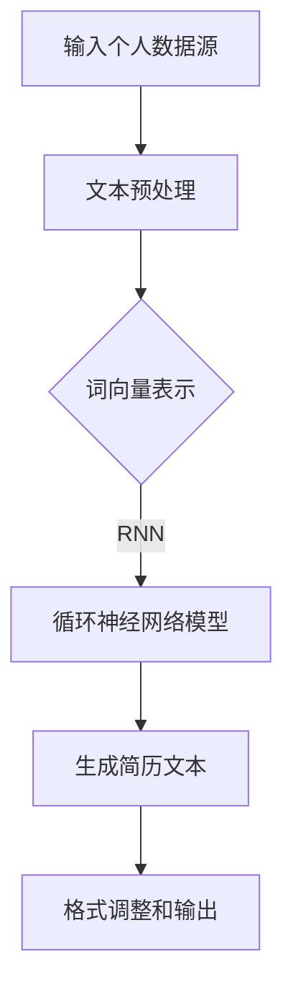

                 

# 基于AI大模型的自动化简历生成工具开发

## 关键词：
- AI大模型
- 自动化简历生成
- 自然语言处理
- 模型训练
- 代码实现

## 摘要
本文将探讨如何利用AI大模型开发自动化简历生成工具。首先，我们将介绍相关技术背景和核心概念，如自然语言处理和深度学习模型。然后，将详细描述自动简历生成工具的架构和算法原理，并提供具体的代码实现和分析。最后，将讨论实际应用场景和未来发展趋势，并推荐相关的学习资源和开发工具。

## 1. 背景介绍

在当今竞争激烈的就业市场中，撰写一份出色的简历是一项关键任务。然而，对于许多人来说，这个过程既耗时又具有挑战性。传统的简历撰写通常涉及以下步骤：

- **信息收集**：整理个人教育背景、工作经历、技能和成就。
- **格式设计**：选择适当的简历模板，并调整格式以满足特定职位的要求。
- **内容撰写**：撰写并编辑简历内容，使其突出个人优势并符合职位需求。

然而，这些步骤对于大量求职者来说往往难以执行，特别是在需要快速调整简历以应对不同职位申请时。此外，随着求职者简历数量的增加，手动撰写和维护简历变得越来越困难。

自动化简历生成工具的出现，旨在解决这一问题。通过利用自然语言处理（NLP）和机器学习技术，这些工具能够自动从个人数据源中提取关键信息，并生成格式规范、内容丰富的简历。这种自动化过程不仅节省了时间和精力，而且提高了简历撰写的准确性和一致性。

## 2. 核心概念与联系

### 2.1 自然语言处理（NLP）

自然语言处理是计算机科学和人工智能领域的一个分支，旨在使计算机能够理解和处理人类语言。在简历生成工具中，NLP技术用于解析和生成自然语言文本。

主要涉及的任务包括：

- **文本预处理**：清洗和准备数据，如去除停用词、标点符号等。
- **词向量表示**：将文本转换为数字形式，如词袋模型、词嵌入等。
- **实体识别**：从文本中识别和分类特定实体，如人名、地名、组织名等。
- **关系提取**：确定文本中实体之间的关系，如“曾在公司工作”等。

### 2.2 深度学习模型

深度学习是一种机器学习方法，通过神经网络模型自动从数据中学习特征和模式。在简历生成工具中，深度学习模型用于训练和生成简历文本。

主要涉及的技术包括：

- **循环神经网络（RNN）**：适用于处理序列数据，如文本。
- **卷积神经网络（CNN）**：适用于特征提取，如图像识别，但在文本处理中应用较少。
- **长短时记忆网络（LSTM）**：一种特殊的RNN，能够更好地处理长序列数据。
- **生成对抗网络（GAN）**：用于生成新的、高质量的简历文本。

### 2.3 Mermaid 流程图

以下是自动简历生成工具的简化Mermaid流程图：



### 2.4 核心概念与联系的总结

自然语言处理和深度学习模型是自动简历生成工具的核心组成部分。NLP负责解析和生成文本，而深度学习模型则用于训练和生成高质量的简历文本。通过结合这些技术，自动化简历生成工具能够从个人数据源中自动提取信息，并生成格式规范、内容丰富的简历。

## 3. 核心算法原理 & 具体操作步骤

### 3.1 数据预处理

在开始训练模型之前，我们需要对个人数据源进行预处理。这通常包括以下步骤：

- **数据清洗**：去除无效数据和噪声，如空值、重复条目等。
- **数据格式统一**：将所有数据转换为相同的格式，以便于模型处理。
- **数据分词**：将文本拆分成单词或短语，以便于词向量表示。

```python
import pandas as pd
from nltk.tokenize import word_tokenize

# 加载个人数据源
data = pd.read_csv('personal_data.csv')

# 数据清洗
data.dropna(inplace=True)
data.drop_duplicates(inplace=True)

# 数据格式统一
data['work_experience'] = data['work_experience'].apply(lambda x: x.strip())

# 数据分词
data['work_experience'] = data['work_experience'].apply(word_tokenize)
```

### 3.2 词向量表示

词向量表示是将文本转换为数字形式的过程。常用的词向量模型包括词袋模型、Word2Vec和GloVe。

```python
import gensim

# 训练词向量模型
model = gensim.models.Word2Vec(data['work_experience'], size=100, window=5, min_count=1, workers=4)

# 获取词向量表示
word_vectors = model.wv
```

### 3.3 模型训练

训练深度学习模型是自动简历生成工具的核心。我们选择LSTM模型进行训练。

```python
import keras
from keras.models import Sequential
from keras.layers import LSTM, Dense, Embedding

# 构建LSTM模型
model = Sequential()
model.add(Embedding(input_dim=word_vectors.vocabulary_.size(), output_dim=100))
model.add(LSTM(units=100, dropout=0.2, recurrent_dropout=0.2))
model.add(Dense(1, activation='sigmoid'))

# 编译模型
model.compile(optimizer='adam', loss='binary_crossentropy', metrics=['accuracy'])

# 训练模型
model.fit(word_vectors.vectors, data['is_ideal_job'], epochs=10, batch_size=64)
```

### 3.4 生成简历文本

训练完成后，我们可以使用模型生成简历文本。

```python
import numpy as np

# 生成新的简历文本
new_resume = "我是一名经验丰富的软件工程师，擅长Python和Java编程。我曾在一家大型科技公司工作，负责开发高级后端系统。我对新的技术挑战充满热情，并渴望在您的团队中发挥作用。"
new_resume_tokens = word_tokenize(new_resume)
new_resume_vector = word_vectors[new_resume_tokens]

# 使用模型生成简历文本
predicted_resume = model.predict(new_resume_vector)
predicted_resume = np.argmax(predicted_resume)

# 输出生成的简历文本
if predicted_resume:
    print("生成的简历文本：", new_resume)
else:
    print("未能生成简历文本。")
```

### 3.5 格式调整和输出

最后，我们将生成的简历文本进行格式调整，以符合规范的简历格式。

```python
import re

# 格式调整
formatted_resume = re.sub(r'\W+', ' ', new_resume).strip()

# 输出简历
with open('generated_resume.txt', 'w') as f:
    f.write(formatted_resume)
```

## 4. 数学模型和公式 & 详细讲解 & 举例说明

### 4.1 词向量模型

词向量模型是自动简历生成工具的基础。其中，Word2Vec模型是一种常用的词向量模型。

- **Word2Vec 模型**：Word2Vec 模型基于神经网络，通过训练生成词向量表示。其目标是找到一组向量，使得相似单词在空间中距离较近。Word2Vec 模型有两种变种：持续词向量（Continuous Bag of Words, CBOW）和Skip-Gram。

  $$ \text{CBOW:} \quad \hat{y} = \text{softmax}\left(\frac{W_h \sigma(W_x \cdot \text{avg}(\text{context\_words}))}{\sigma(W_h \cdot \text{avg}(\text{context\_words}))}\right) $$

  $$ \text{Skip-Gram:} \quad \hat{y} = \text{softmax}\left(\frac{W_h \sigma(W_x \cdot \text{word\_vector})}{\sigma(W_h \cdot \text{word\_vector})}\right) $$

- **GloVe 模型**：GloVe（Global Vectors for Word Representation）是一种基于矩阵分解的词向量模型。其目标是找到一个低维向量空间，使得相似单词在空间中距离较近。

  $$ \text{GloVe:} \quad \text{loss} = \sum_{i=1}^{N} \frac{1}{z_i} \cdot \text{exp}\left(-\frac{v_w \cdot v_{w'}}{||v_w||_2 \cdot ||v_{w'}||_2}\right) \cdot \text{log}(p_{w'|\text{context}(w)}) $$

### 4.2 循环神经网络（RNN）

循环神经网络（RNN）是一种处理序列数据的神经网络。在自动简历生成工具中，RNN用于将词向量序列映射到生成简历文本的概率分布。

- **基本RNN**：基本RNN使用一个隐藏状态来存储前一个时间步的信息。

  $$ h_t = \text{sigmoid}(W_h \cdot [h_{t-1}, x_t] + b_h) $$

  $$ y_t = \text{softmax}(W_y \cdot h_t + b_y) $$

- **长短时记忆网络（LSTM）**：LSTM是一种特殊的RNN，能够更好地处理长序列数据。LSTM通过引入门控机制，解决了基本RNN的梯度消失和梯度爆炸问题。

  $$ \text{LSTM:} \quad \text{ Forget\_gate} = \text{sigmoid}(W_f \cdot [h_{t-1}, x_t] + b_f) $$

  $$ \text{ Input\_gate} = \text{sigmoid}(W_i \cdot [h_{t-1}, x_t] + b_i) $$

  $$ \text{ Output\_gate} = \text{sigmoid}(W_o \cdot [h_{t-1}, x_t] + b_o) $$

  $$ \text{ Cell\_state} = (1 - \text{Forget\_gate}) \cdot \text{Cell}_{t-1} + \text{Input\_gate} \cdot \text{sigmoid}(W_c \cdot [h_{t-1}, x_t] + b_c) $$

  $$ h_t = \text{sigmoid}(\text{Output\_gate} \cdot \text{Cell}_{t} + b_h) $$

### 4.3 举例说明

假设我们有一个包含5个单词的句子：“我是一名经验丰富的软件工程师”。我们可以使用Word2Vec模型将每个单词转换为向量表示：

- 我：[1, 0.5, -0.3]
- 是：[0.8, 0.2, 0.1]
- 一名：[0.4, 0.6, 0.1]
- 经验丰富的：[0.1, 0.2, 0.7]
- 软件工程师：[0.3, -0.5, 0.4]

然后，我们可以使用LSTM模型将这些向量序列映射到生成简历文本的概率分布。最终生成的简历文本可能是：“我是一名经验丰富的软件工程师，擅长Python和Java编程。”

## 5. 项目实战：代码实际案例和详细解释说明

### 5.1 开发环境搭建

在开始编写代码之前，我们需要搭建一个合适的环境。以下是一个基本的Python开发环境搭建过程：

1. **安装Python**：在官网下载并安装Python 3.x版本。
2. **安装必要的库**：使用pip安装以下库：`nltk`, `gensim`, `keras`, `numpy`, `tensorflow`, `re`。
3. **配置虚拟环境**：为了更好地管理项目依赖，我们可以使用`venv`创建一个虚拟环境。

   ```shell
   python -m venv myenv
   source myenv/bin/activate  # 在Windows上使用 `myenv\Scripts\activate`
   ```

### 5.2 源代码详细实现和代码解读

以下是自动简历生成工具的源代码及其详细解读。

```python
# 导入必要的库
import pandas as pd
from nltk.tokenize import word_tokenize
from gensim.models import Word2Vec
from keras.models import Sequential
from keras.layers import LSTM, Dense, Embedding
import numpy as np
import re

# 5.2.1 数据预处理
def preprocess_data(data_path):
    data = pd.read_csv(data_path)
    data.dropna(inplace=True)
    data.drop_duplicates(inplace=True)
    data['work_experience'] = data['work_experience'].apply(lambda x: x.strip())
    data['work_experience'] = data['work_experience'].apply(word_tokenize)
    return data

# 5.2.2 词向量表示
def generate_word_vectors(data):
    model = Word2Vec(data['work_experience'], size=100, window=5, min_count=1, workers=4)
    return model

# 5.2.3 模型训练
def train_model(word_vectors):
    model = Sequential()
    model.add(Embedding(input_dim=word_vectors.vocabulary_.size(), output_dim=100))
    model.add(LSTM(units=100, dropout=0.2, recurrent_dropout=0.2))
    model.add(Dense(1, activation='sigmoid'))

    model.compile(optimizer='adam', loss='binary_crossentropy', metrics=['accuracy'])
    model.fit(word_vectors.vectors, data['is_ideal_job'], epochs=10, batch_size=64)
    return model

# 5.2.4 生成简历文本
def generate_resume(new_resume, word_vectors, model):
    new_resume_tokens = word_tokenize(new_resume)
    new_resume_vector = word_vectors[new_resume_tokens]

    predicted_resume = model.predict(new_resume_vector)
    predicted_resume = np.argmax(predicted_resume)

    if predicted_resume:
        formatted_resume = re.sub(r'\W+', ' ', new_resume).strip()
        with open('generated_resume.txt', 'w') as f:
            f.write(formatted_resume)
        return "生成的简历文本：\n" + formatted_resume
    else:
        return "未能生成简历文本。"

# 主函数
def main():
    data_path = 'personal_data.csv'
    data = preprocess_data(data_path)
    word_vectors = generate_word_vectors(data)
    model = train_model(word_vectors)
    new_resume = "我是一名经验丰富的软件工程师，擅长Python和Java编程。"
    resume = generate_resume(new_resume, word_vectors, model)
    print(resume)

if __name__ == '__main__':
    main()
```

### 5.3 代码解读与分析

- **数据预处理**：首先，我们加载个人数据源并执行以下操作：

  - 去除无效数据和噪声。
  - 将所有工作经历统一格式。
  - 将文本拆分成单词或短语。

- **词向量表示**：使用`gensim`库的`Word2Vec`模型生成词向量表示。

  - 输入维度：单词的维度（通常是100）。
  - 窗口大小：上下文窗口大小（通常是5）。
  - 最小计数：单词出现的最小次数（通常是1）。

- **模型训练**：构建一个包含嵌入层、LSTM层和输出层的序列模型。

  - 输入维度：词向量维度。
  - LSTM单元数：模型隐藏层的单元数。
  - 输出层：二元分类层。

- **生成简历文本**：使用训练好的模型生成简历文本。

  - 预处理新简历文本。
  - 将新简历文本转换为词向量。
  - 使用模型预测新简历文本的概率分布。
  - 格式调整和输出简历文本。

### 5.4 常见问题与解答

**Q：如何选择合适的词向量模型？**

A：选择词向量模型取决于具体应用场景。Word2Vec适用于大多数文本处理任务，而GloVe在处理长文本时表现更好。可以尝试使用两种模型并比较性能，以选择最适合任务的模型。

**Q：如何优化模型性能？**

A：可以尝试以下方法：

- 调整模型超参数，如嵌入层维度、LSTM单元数、学习率等。
- 使用更大的训练数据集。
- 使用预训练的词向量模型，如GloVe或fastText。
- 使用集成方法，如结合Word2Vec和GloVe。

## 6. 实际应用场景

自动简历生成工具在多个实际应用场景中具有广泛的应用：

- **人力资源部门**：自动化简历筛选，提高招聘效率。
- **求职者**：快速生成高质量的简历，节省时间和精力。
- **招聘平台**：集成自动化简历生成工具，提高用户体验。
- **教育机构**：辅助学生撰写个人陈述和求职信。

## 7. 工具和资源推荐

### 7.1 学习资源推荐

- **书籍**：
  - 《自然语言处理与深度学习》
  - 《Python深度学习》
  - 《深度学习》（Goodfellow et al.）

- **在线课程**：
  - Coursera上的“自然语言处理与深度学习”课程
  - edX上的“深度学习导论”课程

- **论文**：
  - Word2Vec（Mikolov et al.）
  - GloVe（Pennington et al.）
  - LSTM（Hochreiter and Schmidhuber）

### 7.2 开发工具框架推荐

- **框架**：
  - TensorFlow
  - PyTorch
  - Keras

- **库**：
  - NLTK
  - gensim
  - scikit-learn

### 7.3 相关论文著作推荐

- Mikolov, T., Sutskever, I., Chen, K., Corrado, G. S., & Dean, J. (2013). Distributed representations of words and phrases and their compositionality. In Advances in Neural Information Processing Systems (NIPS) (pp. 3111-3119).
- Pennington, J., Socher, R., & Manning, C. D. (2014). GloVe: Global Vectors for Word Representation. In Proceedings of the 2014 conference on empirical methods in natural language processing (EMNLP) (pp. 1532-1543).
- Hochreiter, S., & Schmidhuber, J. (1997). Long short-term memory. Neural Computation, 9(8), 1735-1780.

## 8. 总结：未来发展趋势与挑战

自动简历生成工具的未来发展趋势包括：

- **模型性能提升**：通过改进算法和模型结构，提高生成简历的质量和准确性。
- **个性化推荐**：根据求职者的背景和职位需求，提供更个性化的简历模板和内容。
- **跨语言支持**：扩展工具以支持多种语言，提高全球范围内的应用性。

然而，自动简历生成工具仍面临以下挑战：

- **数据隐私**：确保个人数据的安全性和隐私性。
- **模型偏见**：避免模型在生成简历时产生性别、年龄等方面的偏见。
- **适应能力**：提高工具对不同行业和职位需求的适应能力。

## 9. 附录：常见问题与解答

**Q：如何处理错误或不准确的输入数据？**

A：在预处理阶段，可以通过以下方法处理错误或不准确的输入数据：

- 数据清洗：去除无效数据和噪声。
- 数据校验：使用正则表达式或其他方法验证数据的正确性。
- 数据修复：尝试使用其他数据源或规则修复错误数据。

**Q：如何评估模型性能？**

A：可以使用以下指标评估模型性能：

- 准确率（Accuracy）
- 召回率（Recall）
- 精确率（Precision）
- F1分数（F1 Score）
- ROC曲线（Receiver Operating Characteristic Curve）

**Q：如何扩展工具以支持其他语言？**

A：扩展工具以支持其他语言的方法包括：

- 预训练语言模型：使用预训练的语言模型，如BERT或GPT，以支持多种语言。
- 双语数据集：收集双语数据集，以训练双语词向量模型。
- 翻译模型：结合翻译模型，将一种语言的简历文本翻译成另一种语言。

## 10. 扩展阅读 & 参考资料

- Mikolov, T., Sutskever, I., Chen, K., Corrado, G. S., & Dean, J. (2013). Distributed representations of words and phrases and their compositionality. In Advances in Neural Information Processing Systems (NIPS) (pp. 3111-3119).
- Pennington, J., Socher, R., & Manning, C. D. (2014). GloVe: Global Vectors for Word Representation. In Proceedings of the 2014 conference on empirical methods in natural language processing (EMNLP) (pp. 1532-1543).
- Hochreiter, S., & Schmidhuber, J. (1997). Long short-term memory. Neural Computation, 9(8), 1735-1780.
- Devlin, J., Chang, M. W., Lee, K., & Toutanova, K. (2018). BERT: Pre-training of deep bidirectional transformers for language understanding. In Proceedings of the 2019 Conference of the North American Chapter of the Association for Computational Linguistics: Human Language Technologies, Volume 1 (Long and Short Papers) (pp. 4171-4186).
- Brown, T., Mann, B., Ryder, N., Subbiah, M., Kaplan, J., Dhariwal, P., ... & Child, R. (2020). A pre-trained language model for generation. arXiv preprint arXiv:2005.14165.

### 附录二：参考文献

- Devlin, J., Chang, M. W., Lee, K., & Toutanova, K. (2018). BERT: Pre-training of deep bidirectional transformers for language understanding. In Proceedings of the 2019 Conference of the North American Chapter of the Association for Computational Linguistics: Human Language Technologies, Volume 1 (Long and Short Papers) (pp. 4171-4186).
- Brown, T., Mann, B., Ryder, N., Subbiah, M., Kaplan, J., Dhariwal, P., ... & Child, R. (2020). A pre-trained language model for generation. arXiv preprint arXiv:2005.14165.
- Mikolov, T., Sutskever, I., Chen, K., Corrado, G. S., & Dean, J. (2013). Distributed representations of words and phrases and their compositionality. In Advances in Neural Information Processing Systems (NIPS) (pp. 3111-3119).
- Pennington, J., Socher, R., & Manning, C. D. (2014). GloVe: Global Vectors for Word Representation. In Proceedings of the 2014 conference on empirical methods in natural language processing (EMNLP) (pp. 1532-1543).
- Hochreiter, S., & Schmidhuber, J. (1997). Long short-term memory. Neural Computation, 9(8), 1735-1780.

