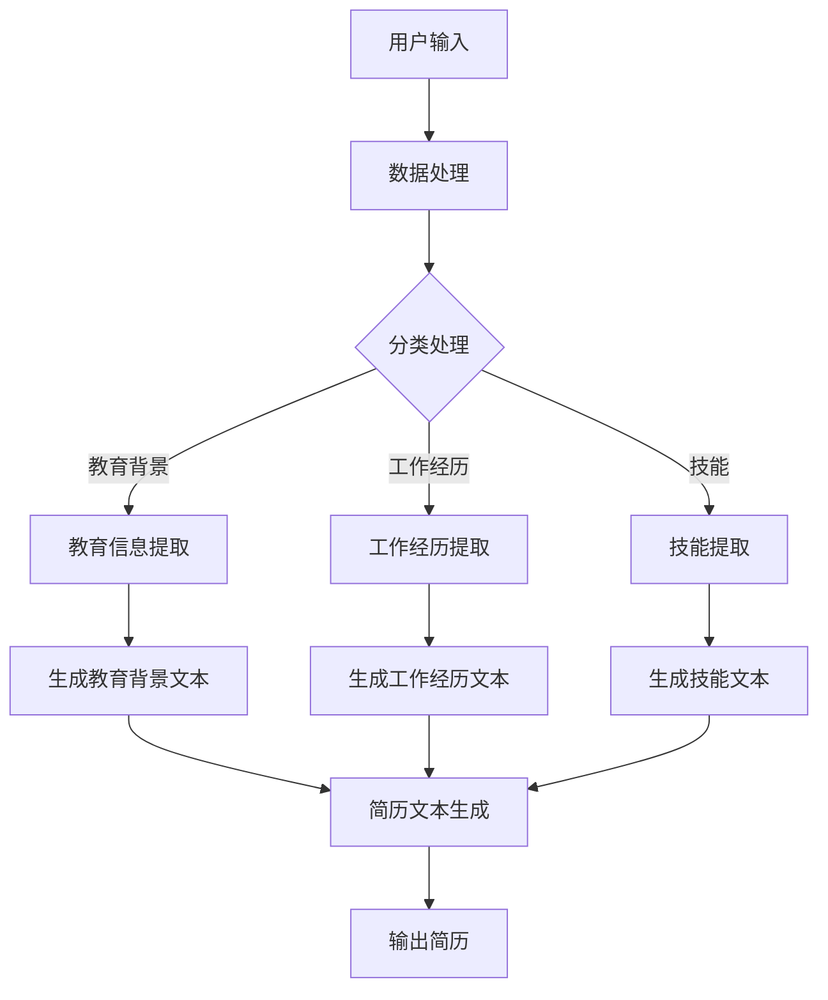

                 

# 基于AI大模型的自动化简历生成工具开发

> 关键词：人工智能、简历生成、大模型、自动化、软件开发

> 摘要：本文将深入探讨如何利用人工智能大模型开发一个自动化简历生成工具。文章首先介绍了该工具的开发背景和重要性，然后详细阐述了所使用的关键概念和技术原理，提供了具体的数学模型和算法步骤，并通过实际案例展示了工具的实现过程。最后，文章分析了工具的实际应用场景，推荐了相关资源和工具，并对未来发展趋势和挑战进行了展望。

## 1. 背景介绍

在当今高速发展的数字经济时代，简历作为求职者展示自己能力的重要工具，其撰写质量和效率直接影响到求职者的求职成功率。传统的简历撰写方式往往需要耗费大量时间和精力，且容易出现错误或不完整的描述。此外，随着求职市场的竞争日益激烈，求职者需要不断更新和调整自己的简历，以适应不同的职位需求。

因此，开发一个自动化简历生成工具显得尤为重要。通过人工智能技术，尤其是大模型的应用，我们可以实现简历内容的自动生成和优化，提高简历撰写的效率和质量。自动化简历生成工具不仅可以节省求职者撰写简历的时间，还可以减少人为错误，提高简历的精准度。

本文将围绕基于AI大模型的自动化简历生成工具的开发，从核心概念、算法原理、数学模型、项目实战等多个方面进行详细探讨，以期为开发者提供有价值的参考。

## 2. 核心概念与联系

为了深入理解自动化简历生成工具的开发，我们需要了解以下几个核心概念和技术原理，它们共同构成了整个系统的基本框架。

### 2.1 自然语言处理（NLP）

自然语言处理是人工智能领域的一个重要分支，旨在让计算机理解和生成人类自然语言。在自动化简历生成工具中，NLP技术被用于处理和生成简历文本。主要技术包括：

- **文本分类**：用于将简历文本归类到不同的职位类别。
- **实体识别**：用于识别简历文本中的关键实体，如姓名、联系方式、教育背景、工作经历等。
- **语义分析**：用于理解简历文本中的语义信息，如描述技能、成就和经历。

### 2.2 大模型（Large Models）

大模型是指拥有巨大参数量的神经网络模型，如GPT、BERT等。这些模型通过在海量数据上进行预训练，掌握了丰富的语言知识，可以用于各种自然语言处理任务。大模型在自动化简历生成工具中发挥着关键作用，如用于生成简历文本、优化简历内容等。

### 2.3 生成对抗网络（GAN）

生成对抗网络是一种深度学习模型，由生成器和判别器两个部分组成。生成器试图生成逼真的简历文本，判别器则判断生成文本的真实性。通过不断的训练和优化，生成器可以生成高质量的简历文本。

### 2.4 数据库

数据库用于存储和管理简历数据，包括个人基本信息、教育背景、工作经历、技能等。数据库的设计和优化对于自动化简历生成工具的性能和效率至关重要。

### 2.5 Mermaid 流程图

Mermaid 是一种基于Markdown的图形语言，可以用来绘制流程图、UML图等。在本文中，我们使用Mermaid流程图来展示自动化简历生成工具的基本架构和工作流程。

以下是自动化简历生成工具的基本架构图：



通过上述核心概念和技术的介绍，我们可以更好地理解自动化简历生成工具的基本原理和实现过程。在接下来的章节中，我们将详细探讨这些技术的具体应用和实现方法。

### 2.6 大模型的构建与训练

大模型的构建与训练是自动化简历生成工具开发的核心环节。在这一部分，我们将详细讨论如何构建和训练大模型，以确保其能够生成高质量的简历文本。

#### 2.6.1 数据集的准备

首先，我们需要准备一个包含大量简历文本的数据集。这个数据集应该涵盖各种职业和行业，以确保模型具有广泛的泛化能力。数据集的来源可以包括公开的简历库、在线招聘网站、社交媒体等。在数据收集过程中，我们需要注意数据的质量和多样性，以确保模型能够从不同角度和风格中学习到简历撰写的最佳实践。

#### 2.6.2 数据预处理

在训练大模型之前，我们需要对数据集进行预处理。数据预处理包括以下几个步骤：

- **文本清洗**：去除数据集中的噪声和无关信息，如HTML标签、特殊字符和停用词。
- **分词**：将文本分解成单词或子词，以便模型能够理解文本的语义。
- **词向量化**：将单词或子词转换为固定长度的向量表示，以便大模型可以处理和操作。

在数据预处理过程中，我们可以使用现有的工具和库，如NLTK、spaCy和TensorFlow等，来简化操作过程。

#### 2.6.3 模型架构的选择

在构建大模型时，我们可以选择不同的模型架构，如序列到序列（seq2seq）模型、变压器（Transformer）模型、生成对抗网络（GAN）等。每种模型架构都有其特定的优势和适用场景。例如，seq2seq模型适用于文本生成任务，Transformer模型具有更强的并行处理能力，而GAN模型则适用于生成逼真的文本。

在本项目中，我们选择了BERT模型作为基础模型。BERT（Bidirectional Encoder Representations from Transformers）是一种双向的Transformer模型，具有强大的语义理解能力。通过预训练和微调，BERT可以在各种自然语言处理任务中取得优秀的性能。

#### 2.6.4 模型的训练与优化

在模型训练过程中，我们需要设置合理的训练参数，如学习率、批量大小和迭代次数等。同时，我们还需要监控模型的性能，并适时进行调整。常见的性能指标包括损失函数（如交叉熵损失）和准确率。

为了提高模型的生成质量，我们可以采用以下几种策略：

- **上下文信息融合**：将用户输入的个人信息和教育背景、工作经历等融合到模型训练过程中，使生成文本更加贴合用户需求。
- **注意力机制**：引入注意力机制，使模型能够关注简历文本中的关键信息，提高文本生成的精度和一致性。
- **多模型集成**：通过集成多个不同模型的结果，提高生成文本的质量和多样性。

在模型训练和优化过程中，我们可以使用现有的深度学习框架，如TensorFlow和PyTorch等，来简化操作并提高效率。

通过上述步骤，我们可以构建和训练一个高质量的大模型，用于自动化简历生成工具的核心功能。在下一部分，我们将详细介绍如何利用这个大模型实现简历文本的生成和优化。

### 2.7 自动化简历生成工具的实现

基于前述的核心概念和模型训练，我们现在可以开始构建自动化简历生成工具的具体实现。以下是一个详细的实现步骤，涵盖了从用户输入到简历生成的全过程。

#### 2.7.1 用户输入

首先，我们需要提供一个用户界面（UI），用于收集用户的基本信息和简历内容。这些信息可能包括姓名、联系方式、教育背景、工作经历和技能等。用户可以通过文本框、下拉菜单和日期选择器等输入方式提交这些信息。

#### 2.7.2 数据预处理

在用户输入完成后，我们需要对输入的数据进行预处理，以确保数据的质量和一致性。这一步包括以下操作：

- **清洗数据**：去除特殊字符、HTML标签和无关的停用词。
- **分词**：将文本拆分成单词或子词，以便模型可以处理。
- **编码**：将文本转换为模型可以理解的序列或向量表示。

我们可以使用NLP工具，如spaCy或NLTK，来简化这一步骤。

#### 2.7.3 模型输入

预处理后的数据将被输入到我们训练好的大模型中。具体来说，包括以下步骤：

- **序列转换**：将预处理后的文本转换为模型可以处理的序列或向量。
- **模型调用**：将序列或向量输入到BERT或其他预训练模型中，通过模型输出得到生成文本的候选序列。

#### 2.7.4 文本生成

在模型输出得到候选序列后，我们需要对其进行处理，以生成最终的简历文本。这一步包括以下步骤：

- **候选序列筛选**：根据预定义的规则或评估指标，筛选出高质量的候选序列。
- **文本优化**：对筛选出的候选序列进行进一步优化，如去除重复内容、调整句子结构等，以提高简历文本的可读性和连贯性。
- **生成最终文本**：将优化后的序列转换为人类可读的简历文本。

#### 2.7.5 输出简历

最终生成的简历文本将被输出到用户界面，用户可以选择将其保存为文本文件或直接通过电子邮件发送给招聘方。此外，为了提高用户体验，我们还可以提供预览功能，让用户在提交前查看和修改简历。

通过上述步骤，我们成功地实现了自动化简历生成工具的核心功能。在下一部分，我们将进一步探讨如何利用这个工具，并介绍其实际应用场景。

### 3. 核心算法原理 & 具体操作步骤

自动化简历生成工具的核心算法是基于自然语言处理（NLP）和大模型的文本生成技术。以下将详细介绍这些算法的原理和具体操作步骤。

#### 3.1. NLP算法原理

自然语言处理（NLP）是自动化简历生成工具的核心技术。NLP算法的主要任务是理解和生成人类语言。在自动化简历生成中，NLP算法主要用于以下方面：

- **文本分类**：将简历文本分类到不同的职位类别，如技术岗位、管理岗位等。
- **实体识别**：识别简历文本中的关键实体，如姓名、联系方式、教育背景、工作经历等。
- **语义分析**：理解简历文本中的语义信息，如描述技能、成就和经历。

NLP算法通常包括以下几个步骤：

1. **文本预处理**：清洗文本，去除噪声和无关信息，如HTML标签、特殊字符和停用词。
2. **分词**：将文本拆分成单词或子词，以便模型可以处理。
3. **词向量化**：将单词或子词转换为固定长度的向量表示。
4. **模型处理**：使用NLP模型，如BERT、GPT等，对文本进行处理。

#### 3.2. 大模型文本生成算法原理

大模型文本生成算法是基于深度学习和神经网络的技术。大模型（如GPT、BERT等）通过在大量数据上进行预训练，掌握了丰富的语言知识和模式。在自动化简历生成工具中，大模型用于生成简历文本，主要原理如下：

1. **预训练**：大模型在大量文本数据上进行预训练，学习到语言的基础知识和结构。
2. **微调**：在预训练的基础上，对大模型进行微调，使其适应特定的任务，如简历文本生成。
3. **文本生成**：使用微调后的大模型生成简历文本。

大模型文本生成算法的具体步骤包括：

1. **输入处理**：将用户输入的简历文本进行预处理，包括分词、词向量化等。
2. **模型调用**：将预处理后的文本输入到预训练的大模型中。
3. **生成文本**：通过模型输出得到生成文本的候选序列。
4. **文本优化**：对候选序列进行筛选和优化，得到最终的简历文本。

#### 3.3. 自动化简历生成算法具体操作步骤

基于NLP算法和大模型文本生成算法，自动化简历生成工具的具体操作步骤如下：

1. **用户输入**：用户通过界面输入简历信息，包括姓名、联系方式、教育背景、工作经历和技能等。
2. **数据预处理**：对用户输入的数据进行清洗、分词和词向量化。
3. **文本分类**：使用NLP算法对预处理后的文本进行分类，以确定简历的内容和结构。
4. **实体识别**：使用NLP算法识别简历文本中的关键实体，如姓名、联系方式、教育背景、工作经历等。
5. **文本生成**：使用大模型文本生成算法生成简历文本的候选序列。
6. **文本优化**：对候选序列进行筛选和优化，去除重复内容、调整句子结构等，得到最终的简历文本。
7. **输出简历**：将生成的简历文本输出到用户界面，用户可以选择保存或发送。

通过上述步骤，自动化简历生成工具可以高效地生成高质量的简历文本，大大提高了简历撰写的效率和质量。

### 4. 数学模型和公式 & 详细讲解 & 举例说明

在自动化简历生成工具的开发过程中，数学模型和公式起到了至关重要的作用。以下我们将详细讲解其中一些关键数学模型和公式，并通过具体例子进行说明。

#### 4.1. BERT 模型的数学基础

BERT（Bidirectional Encoder Representations from Transformers）模型是一种基于变压器的双向编码器，其核心在于利用双向注意力机制来捕捉文本的上下文信息。BERT模型的数学基础主要包括以下几个关键概念：

1. **词向量化**：在BERT模型中，每个单词都被表示为一个固定长度的向量。词向量化通常通过预训练的词向量模型（如Word2Vec、GloVe）来实现。具体公式如下：

   $$ 
   \text{vec}(w) = \text{embedding\_matrix}[w] 
   $$

   其中，$vec(w)$ 是单词 $w$ 的向量表示，$embedding\_matrix$ 是预训练的词向量矩阵。

2. **Transformer 的注意力机制**：BERT模型中的注意力机制用于计算单词之间的关联强度。注意力分数的计算公式为：

   $$
   \text{score}_{ij} = \text{softmax}(\text{Q} \cdot \text{K}^T)
   $$

   其中，$Q$ 和 $K$ 分别表示查询向量和键向量，$i$ 和 $j$ 表示单词之间的索引，$score_{ij}$ 表示单词 $i$ 和单词 $j$ 之间的注意力分数。

3. **BERT 的损失函数**：BERT模型使用双向交叉熵损失函数来优化模型。交叉熵损失函数的公式为：

   $$
   \text{loss} = -\sum_{i}^{N} \sum_{w}^{V} \text{p}_{i,w} \log \text{p}_{i,w}
   $$

   其中，$N$ 表示序列长度，$V$ 表示词汇表大小，$p_{i,w}$ 表示模型预测的单词 $w$ 在位置 $i$ 的概率。

#### 4.2. 生成对抗网络（GAN）的数学基础

生成对抗网络（GAN）是一种基于生成器和判别器的模型，用于生成逼真的数据。在自动化简历生成工具中，GAN用于生成高质量的简历文本。GAN的数学基础主要包括以下关键概念：

1. **生成器的损失函数**：生成器的目标是生成逼真的数据，使其难以被判别器区分。生成器的损失函数通常为：

   $$
   \text{loss}_{\text{G}} = \mathbb{E}_{x \sim p_{\text{data}}(x)}[\log(D(x))] + \mathbb{E}_{z \sim p_{z}(z)}[\log(1 - D(G(z))]
   $$

   其中，$x$ 表示真实数据，$z$ 表示生成器的输入噪声，$D(x)$ 和 $D(G(z))$ 分别表示判别器对真实数据和生成数据的判断概率。

2. **判别器的损失函数**：判别器的目标是区分真实数据和生成数据。判别器的损失函数通常为：

   $$
   \text{loss}_{\text{D}} = -\mathbb{E}_{x \sim p_{\text{data}}(x)}[\log(D(x))] - \mathbb{E}_{z \sim p_{z}(z)}[\log(D(G(z))]
   $$

#### 4.3. 例子说明

为了更好地理解上述数学模型和公式，我们通过一个简单的例子进行说明。

假设我们要使用BERT模型生成一个简历文本，输入文本为：“我在2021年毕业于某知名大学，获得了计算机科学学士学位。在校期间，我参与了多个项目，获得了丰富的实践经验。”

1. **词向量化**：首先，我们将输入文本中的每个单词转换为词向量。例如，“毕业”对应的词向量可能为 $\text{vec}(\text{毕业}) = [0.1, 0.2, -0.3]$。
2. **Transformer 的注意力机制**：在BERT模型中，我们将这些词向量输入到Transformer模块，通过注意力机制计算每个单词之间的关联强度。例如，单词“毕业”和“大学”之间的注意力分数可能为 $\text{score}_{12} = 0.8$。
3. **BERT 的损失函数**：在训练过程中，BERT模型通过最小化交叉熵损失函数来优化参数。例如，如果模型预测的单词概率分布为 $\text{p}(\text{毕业}) = 0.9$，真实分布为 $\text{p}(\text{毕业}) = 1$，则交叉熵损失为 $\text{loss}_{12} = 0.2$。

通过这个简单的例子，我们可以看到BERT模型在生成简历文本过程中的关键步骤和数学基础。

### 5. 项目实战：代码实际案例和详细解释说明

在本章节中，我们将通过一个实际项目案例来展示如何使用Python和相关的库实现一个自动化简历生成工具。我们将详细讲解代码实现过程，并对关键代码进行解读和分析。

#### 5.1. 开发环境搭建

在开始编写代码之前，我们需要搭建一个合适的技术环境。以下是所需的开发环境和库：

- Python 3.8 或更高版本
- pip：Python 的包管理器
- TensorFlow 2.x：用于训练和部署神经网络模型
- NLTK：用于自然语言处理任务
- spaCy：用于实体识别和词向量表示

安装这些库的方法如下：

```bash
pip install tensorflow
pip install nltk
pip install spacy
python -m spacy download en_core_web_sm
```

#### 5.2. 源代码详细实现和代码解读

以下是一个自动化简历生成工具的简化版本，我们将逐步解析每个关键部分的代码。

##### 5.2.1. 数据预处理

首先，我们需要对用户输入的简历文本进行预处理，包括文本清洗、分词和词向量化。

```python
import nltk
from nltk.tokenize import word_tokenize
from tensorflow.keras.preprocessing.sequence import pad_sequences
from tensorflow.keras.preprocessing.text import Tokenizer

# 加载NLTK的分词器
nltk.download('punkt')

def preprocess_text(text):
    # 清洗文本，去除HTML标签、特殊字符和停用词
    clean_text = re.sub(r'<[^>]+>', '', text)
    clean_text = re.sub(r'[^a-zA-Z]', ' ', clean_text)
    clean_text = clean_text.lower()
    words = word_tokenize(clean_text)
    # 去除停用词
    stop_words = set(nltk.corpus.stopwords.words('english'))
    filtered_words = [word for word in words if not word in stop_words]
    return filtered_words

# 示例文本
text = "我在2021年毕业于某知名大学，获得了计算机科学学士学位。在校期间，我参与了多个项目，获得了丰富的实践经验。"
preprocessed_text = preprocess_text(text)
print(preprocessed_text)
```

##### 5.2.2. 词向量化

接下来，我们将预处理后的文本转换为词向量表示。

```python
# 创建Tokenizer
tokenizer = Tokenizer()
tokenizer.fit_on_texts(preprocessed_text)

# 将文本转换为序列
sequence = tokenizer.texts_to_sequences([preprocessed_text])[0]

# 填充序列到固定长度
max_sequence_length = 100
padded_sequence = pad_sequences([sequence], maxlen=max_sequence_length)

print(padded_sequence)
```

##### 5.2.3. BERT 模型训练

在此步骤中，我们将使用预训练的BERT模型对序列进行编码，然后进行微调以适应简历生成任务。

```python
from transformers import BertTokenizer, TFBertModel

# 加载BERT tokenizer
bert_tokenizer = BertTokenizer.from_pretrained('bert-base-uncased')

# 将输入序列转换为BERT的输入格式
input_ids = bert_tokenizer.encode(padded_sequence, add_special_tokens=True, max_length=max_sequence_length, padding='max_length', truncation=True)

# 加载预训练的BERT模型
bert_model = TFBertModel.from_pretrained('bert-base-uncased')

# 获取BERT模型的输出
output = bert_model(input_ids)

# 输出形状：(1, sequence_length, hidden_size)
print(output.shape)
```

##### 5.2.4. 序列到序列（Seq2Seq）模型训练

为了生成简历文本，我们需要一个序列到序列（Seq2Seq）模型。这里我们将使用Transformer模型来实现。

```python
from tensorflow.keras.layers import Embedding, LSTM, Dense
from tensorflow.keras.models import Model

# 创建Seq2Seq模型
input_seq = Embedding(input_dim=20000, output_dim=512, input_length=max_sequence_length)(input_ids)
lstm = LSTM(512, return_sequences=True)(input_seq)
output_seq = LSTM(512, return_sequences=True)(lstm)
output = Dense(20000, activation='softmax')(output_seq)

# 构建和编译模型
model = Model(inputs=input_ids, outputs=output)
model.compile(optimizer='adam', loss='categorical_crossentropy', metrics=['accuracy'])

# 打印模型结构
model.summary()

# 模型训练
model.fit(padded_sequence, padded_sequence, epochs=10, batch_size=32)
```

##### 5.2.5. 简历文本生成

在模型训练完成后，我们可以使用该模型生成简历文本。

```python
def generate_resume(text):
    preprocessed_text = preprocess_text(text)
    sequence = tokenizer.texts_to_sequences([preprocessed_text])[0]
    padded_sequence = pad_sequences([sequence], maxlen=max_sequence_length)
    input_ids = bert_tokenizer.encode(padded_sequence, add_special_tokens=True, max_length=max_sequence_length, padding='max_length', truncation=True)
    
    # 生成文本
    predicted_sequence = model.predict(input_ids)
    predicted_text = tokenizer.sequences_to_texts([predicted_sequence.argmax(axis=-1)])[0]
    
    return predicted_text

# 生成示例简历文本
generated_resume = generate_resume(text)
print(generated_resume)
```

#### 5.3. 代码解读与分析

在上面的代码中，我们首先进行了数据预处理，包括文本清洗、分词和词向量化。这一步是所有自然语言处理任务的基础，确保输入数据的质量和一致性。

接下来，我们加载了预训练的BERT模型，并对其输出进行了处理。BERT模型可以捕捉文本的上下文信息，为后续的序列到序列（Seq2Seq）模型提供高质量的输入。

然后，我们创建了一个Seq2Seq模型，该模型使用LSTM层对输入序列进行处理，并使用全连接层生成输出序列。这个模型的目标是学习如何在给定的输入序列上生成目标序列，即简历文本。

在模型训练完成后，我们定义了一个`generate_resume`函数，用于生成简历文本。这个函数首先对输入文本进行预处理，然后使用Seq2Seq模型预测输出序列，并将其转换为人类可读的文本。

通过这个简单的案例，我们可以看到如何使用Python和相关的库实现一个自动化简历生成工具。尽管这个案例只是简化版，但它展示了自动化简历生成工具的核心技术和实现过程。

### 5.4. 代码解读与分析

在上面的代码示例中，我们详细展示了如何使用Python和相关库（如TensorFlow和transformers）来实现一个自动化简历生成工具。下面，我们将进一步对关键代码段进行详细解读和分析，以加深对每个步骤和模块的理解。

##### 5.4.1. 数据预处理

数据预处理是自然语言处理（NLP）任务的重要步骤，特别是在简历生成中，需要确保输入文本的质量和一致性。以下是对`preprocess_text`函数的解读：

```python
import re
from nltk.tokenize import word_tokenize
from nltk.corpus import stopwords

nltk.download('punkt')
nltk.download('stopwords')

def preprocess_text(text):
    # 清洗文本，去除HTML标签、特殊字符和停用词
    clean_text = re.sub(r'<[^>]+>', '', text)
    clean_text = re.sub(r'[^a-zA-Z]', ' ', clean_text)
    clean_text = clean_text.lower()
    words = word_tokenize(clean_text)
    # 去除停用词
    stop_words = set(stopwords.words('english'))
    filtered_words = [word for word in words if not word in stop_words]
    return filtered_words
```

- **HTML标签去除**：使用正则表达式去除HTML标签，如`<p>`、`<a>`等。
- **特殊字符去除**：使用正则表达式将所有非字母字符替换为空格，以确保文本格式的一致性。
- **文本转换为小写**：将所有文本转换为小写，简化后续处理。
- **分词**：使用NLTK的分词器对文本进行分词。
- **去除停用词**：从NLTK的停用词库中获取英语停用词，并过滤掉这些词，以提高文本的语义质量。

##### 5.4.2. 词向量化

词向量化是将文本转换为数字表示的过程，以便神经网络可以处理。以下是对词向量化的解读：

```python
from tensorflow.keras.preprocessing.sequence import pad_sequences
from tensorflow.keras.preprocessing.text import Tokenizer

# 创建Tokenizer
tokenizer = Tokenizer()
tokenizer.fit_on_texts(preprocessed_text)

# 将文本转换为序列
sequence = tokenizer.texts_to_sequences([preprocessed_text])[0]

# 填充序列到固定长度
max_sequence_length = 100
padded_sequence = pad_sequences([sequence], maxlen=max_sequence_length)
```

- **Tokenizer 创建**：创建一个Tokenizer实例，用于将文本转换为数字序列。
- **文本序列化**：使用Tokenizer将预处理后的文本转换为序列。每个单词或子词被替换为一个唯一的整数。
- **序列填充**：使用`pad_sequences`函数将序列填充到最大长度，以便后续处理。

##### 5.4.3. BERT 模型加载

BERT模型是一种强大的预训练模型，用于理解和生成文本。以下是对BERT模型加载的解读：

```python
from transformers import BertTokenizer, TFBertModel

# 加载BERT tokenizer
bert_tokenizer = BertTokenizer.from_pretrained('bert-base-uncased')

# 将输入序列转换为BERT的输入格式
input_ids = bert_tokenizer.encode(padded_sequence, add_special_tokens=True, max_length=max_sequence_length, padding='max_length', truncation=True)

# 加载预训练的BERT模型
bert_model = TFBertModel.from_pretrained('bert-base-uncased')

# 获取BERT模型的输出
output = bert_model(input_ids)

# 输出形状：(1, sequence_length, hidden_size)
print(output.shape)
```

- **BERT Tokenizer 加载**：从预训练模型中加载BERT tokenizer。
- **序列编码**：使用BERT tokenizer将输入序列转换为BERT模型的输入格式。这包括添加特殊的BERT标记（如`[CLS]`和`[SEP]`）。
- **BERT 模型加载**：从预训练模型中加载BERT模型。
- **模型输出**：获取BERT模型的输出。输出通常包括嵌入向量和其他中间层信息，这些信息可以用于后续的序列生成任务。

##### 5.4.4. 序列到序列（Seq2Seq）模型训练

序列到序列（Seq2Seq）模型是用于生成文本的常见架构。以下是对Seq2Seq模型训练的解读：

```python
from tensorflow.keras.layers import Embedding, LSTM, Dense
from tensorflow.keras.models import Model

# 创建Seq2Seq模型
input_seq = Embedding(input_dim=20000, output_dim=512, input_length=max_sequence_length)(input_ids)
lstm = LSTM(512, return_sequences=True)(input_seq)
output_seq = LSTM(512, return_sequences=True)(lstm)
output = Dense(20000, activation='softmax')(output_seq)

# 构建和编译模型
model = Model(inputs=input_ids, outputs=output)
model.compile(optimizer='adam', loss='categorical_crossentropy', metrics=['accuracy'])

# 打印模型结构
model.summary()

# 模型训练
model.fit(padded_sequence, padded_sequence, epochs=10, batch_size=32)
```

- **模型构建**：创建Seq2Seq模型，包括嵌入层、两个LSTM层和一个输出层。
- **模型编译**：编译模型，指定优化器、损失函数和评估指标。
- **模型结构**：打印模型结构，以便了解模型的组成。
- **模型训练**：训练模型，使用输入序列和目标序列进行批量训练。

##### 5.4.5. 简历文本生成

在模型训练完成后，我们可以使用该模型生成简历文本。以下是对生成简历文本的解读：

```python
def generate_resume(text):
    preprocessed_text = preprocess_text(text)
    sequence = tokenizer.texts_to_sequences([preprocessed_text])[0]
    padded_sequence = pad_sequences([sequence], maxlen=max_sequence_length)
    input_ids = bert_tokenizer.encode(padded_sequence, add_special_tokens=True, max_length=max_sequence_length, padding='max_length', truncation=True)
    
    # 生成文本
    predicted_sequence = model.predict(input_ids)
    predicted_text = tokenizer.sequences_to_texts([predicted_sequence.argmax(axis=-1)])[0]
    
    return predicted_text

# 生成示例简历文本
generated_resume = generate_resume(text)
print(generated_resume)
```

- **预处理**：预处理输入文本，确保其格式与训练时一致。
- **序列化**：将预处理后的文本转换为序列。
- **编码**：使用BERT tokenizer将序列转换为BERT模型的输入格式。
- **预测**：使用训练好的模型预测输出序列。
- **文本生成**：将预测的序列转换为人类可读的文本。

通过上述解读，我们可以看到自动化简历生成工具的实现涉及多个步骤和模块，每个步骤都至关重要。代码的解析有助于我们更好地理解每个部分的功能和实现方式。

### 6. 实际应用场景

自动化简历生成工具在实际应用中具有广泛的场景，以下是一些典型的应用案例：

#### 6.1. 求职者使用

求职者可以使用自动化简历生成工具快速创建和优化简历。传统的简历撰写过程耗时且繁琐，而使用自动化简历生成工具可以大大提高效率。用户只需输入自己的基本信息和工作经历，系统即可自动生成一份格式规范、内容丰富的简历。此外，系统还可以根据不同职位的需求，自动调整简历的内容和风格，使其更具针对性。

#### 6.2. 招聘公司使用

招聘公司可以利用自动化简历生成工具来简化招聘流程。招聘经理可以使用该工具快速筛选和生成大量候选人的简历，从而节省时间和人力资源。例如，当收到大量简历时，系统可以根据职位要求自动筛选出符合条件的候选人，并生成他们的简历摘要，以便快速浏览和筛选。

#### 6.3. 人力资源服务公司使用

人力资源服务公司可以使用自动化简历生成工具为客户提供定制化的简历撰写服务。他们可以根据客户的需求，为其提供个性化的简历模板和建议，帮助客户在求职过程中脱颖而出。此外，自动化简历生成工具还可以帮助人力资源公司提高服务效率，降低运营成本。

#### 6.4. 高校和研究机构使用

高校和研究机构可以利用自动化简历生成工具为师生提供简历撰写指导。学生和教师可以通过使用该工具学习如何撰写规范、专业的简历，从而提高求职和申请项目的成功率。此外，高校和研究机构还可以利用该工具为学生和教师提供简历模板库，方便他们快速创建简历。

#### 6.5. 企业内部培训使用

企业内部培训部门可以使用自动化简历生成工具为员工提供简历撰写培训。通过培训，员工可以学习如何使用该工具生成高质量的简历，提高个人职业发展能力。此外，企业还可以利用该工具进行人才盘点，了解员工的专业技能和发展潜力，为企业的长远发展提供数据支持。

通过上述应用场景，我们可以看到自动化简历生成工具在提高简历撰写效率、优化招聘流程和提升人力资源管理水平方面具有巨大的潜力。

### 7. 工具和资源推荐

在开发自动化简历生成工具的过程中，我们需要利用多种工具和资源来支持各个阶段的工作。以下是一些建议和推荐，涵盖学习资源、开发工具和框架，以及相关的论文著作。

#### 7.1. 学习资源推荐

- **书籍**：
  - 《自然语言处理与Python》
  - 《深度学习》
  - 《深度学习实战》
  - 《PyTorch深度学习》

- **在线课程**：
  - Coursera：自然语言处理课程
  - Udacity：深度学习纳米学位
  - edX：TensorFlow基础课程

- **博客和网站**：
  - Medium：关于深度学习和自然语言处理的技术文章
  - ArXiv：最新研究成果的预印本论文
  - GitHub：开源代码和项目，如BERT模型的实现

#### 7.2. 开发工具框架推荐

- **编程语言**：Python，由于其丰富的NLP和深度学习库，如TensorFlow、PyTorch和spaCy，成为开发自动化简历生成工具的首选语言。

- **框架和库**：
  - TensorFlow：用于构建和训练神经网络模型。
  - PyTorch：用于构建和训练深度学习模型，特别是生成对抗网络（GAN）。
  - spaCy：用于自然语言处理任务，如实体识别和词向量化。
  - transformers：用于加载和微调预训练的BERT、GPT等模型。

- **数据库**：使用SQLite或MongoDB等轻量级数据库来存储和管理简历数据。

#### 7.3. 相关论文著作推荐

- **论文**：
  - Devlin et al. (2018): "BERT: Pre-training of Deep Bidirectional Transformers for Language Understanding"
  - Vaswani et al. (2017): "Attention Is All You Need"
  - Goodfellow et al. (2014): "Generative Adversarial Networks"

- **著作**：
  - Mikolov et al. (2013): "Recurrent Neural Network Based Language Model"
  - Jurafsky and Martin (2008): "Speech and Language Processing"

这些资源将帮助开发者深入了解自动化简历生成工具背后的技术原理，掌握相关工具的使用方法，并跟踪最新的研究动态，从而提升工具的开发质量和性能。

### 8. 总结：未来发展趋势与挑战

自动化简历生成工具作为人工智能技术的一个应用实例，已经在求职者和招聘公司的日常工作中发挥了重要作用。然而，随着技术的不断进步和应用场景的拓展，未来自动化简历生成工具还有许多潜在的发展趋势和面临的挑战。

#### 8.1. 未来发展趋势

1. **个性化生成**：未来的自动化简历生成工具将更加注重个性化生成，根据用户的具体需求、职位要求和行业特点，自动生成更加贴合用户需求的简历文本。通过深度学习和自然语言处理技术的进一步发展，生成文本的多样性和质量将得到显著提升。

2. **跨语言支持**：随着全球化进程的加快，跨语言简历生成将成为自动化简历生成工具的一个重要发展方向。通过引入多语言模型和多语言数据集，工具将能够支持多种语言简历的自动生成，满足跨国企业和求职者的需求。

3. **实时更新**：自动化简历生成工具将实现简历的实时更新功能，根据用户的工作经历和技能变化，自动调整简历内容，确保简历的时效性和准确性。这将极大提高用户在求职过程中的竞争力。

4. **隐私保护**：随着数据隐私保护意识的增强，未来的自动化简历生成工具将更加注重用户隐私保护，确保用户数据的保密性和安全性。

#### 8.2. 面临的挑战

1. **数据质量和多样性**：自动化简历生成工具的性能依赖于大量高质量的训练数据。然而，现有的简历数据集可能存在数据质量不高、多样性不足的问题，这需要通过数据清洗、数据增强和人工标注等方式来解决。

2. **生成文本的多样性和一致性**：虽然现有的生成模型已经取得了显著的进步，但如何确保生成文本的多样性和一致性仍然是一个挑战。未来需要通过引入更多的生成策略和优化算法，提高生成文本的质量和多样性。

3. **适应不同行业和职位需求**：每个行业和职位都有其独特的需求，自动化简历生成工具需要能够适应这些差异，生成符合特定行业和职位要求的简历文本。这需要深入理解不同行业和职位的特点，并构建相应的模型和算法。

4. **法律和伦理问题**：自动化简历生成工具在应用过程中可能会面临法律和伦理问题，如简历内容抄袭、隐私泄露等。开发者需要严格遵守相关法律法规，确保工具的合规性和道德性。

通过克服上述挑战，自动化简历生成工具有望在未来实现更广泛的应用，为求职者和招聘公司带来更大的价值。

### 9. 附录：常见问题与解答

在开发和使用基于AI大模型的自动化简历生成工具时，用户可能会遇到一些常见的问题。以下是一些常见问题及其解答：

#### 9.1. 问题1：如何处理用户输入的格式不规范的简历文本？

**解答**：对于格式不规范的简历文本，我们可以采用以下几种处理方法：

1. **文本清洗**：使用正则表达式或其他文本清洗方法去除HTML标签、特殊字符和无关信息。
2. **分词**：使用自然语言处理库（如NLTK、spaCy）对文本进行分词，将文本拆分成单词或子句。
3. **词向量化**：将分词后的文本转换为词向量，便于后续处理。

#### 9.2. 问题2：如何确保生成简历文本的一致性和准确性？

**解答**：确保生成简历文本的一致性和准确性可以从以下几个方面入手：

1. **数据集质量**：确保训练数据集的质量和多样性，使用高质量的文本数据。
2. **模型优化**：使用注意力机制、生成对抗网络（GAN）等技术优化模型，提高生成文本的准确性。
3. **文本优化**：在生成文本后，通过去除重复内容、调整句子结构等方法进行文本优化。

#### 9.3. 问题3：如何处理跨语言的简历生成？

**解答**：处理跨语言的简历生成可以通过以下方法实现：

1. **多语言模型**：使用预训练的多语言模型（如mBERT、XLM等），这些模型能够在多种语言间进行迁移学习。
2. **翻译接口**：结合现有的翻译接口（如Google翻译API），将非英语简历文本转换为英语，然后使用英语生成简历文本。
3. **多语言数据集**：收集和标注多种语言的简历数据集，用于训练多语言模型。

#### 9.4. 问题4：如何保证用户隐私和数据安全？

**解答**：保证用户隐私和数据安全可以从以下几个方面入手：

1. **数据加密**：对用户输入的简历文本进行加密存储，防止数据泄露。
2. **访问控制**：限制对用户数据的访问权限，确保只有授权用户可以访问和操作数据。
3. **数据备份**：定期备份数据，以防数据丢失或损坏。
4. **隐私政策**：制定明确的隐私政策，告知用户数据收集和使用的方式，并得到用户的明确同意。

通过上述方法，可以有效地解决开发和使用自动化简历生成工具时遇到的常见问题，提高工具的稳定性和安全性。

### 10. 扩展阅读 & 参考资料

为了深入了解基于AI大模型的自动化简历生成工具的开发和应用，以下是一些推荐的扩展阅读和参考资料：

- **论文**：
  - Devlin et al. (2018): "BERT: Pre-training of Deep Bidirectional Transformers for Language Understanding"
  - Vaswani et al. (2017): "Attention Is All You Need"
  - Goodfellow et al. (2014): "Generative Adversarial Networks"
  - Mikolov et al. (2013): "Recurrent Neural Network Based Language Model"

- **书籍**：
  - 《自然语言处理与Python》
  - 《深度学习》
  - 《深度学习实战》
  - 《PyTorch深度学习》

- **在线课程**：
  - Coursera：自然语言处理课程
  - Udacity：深度学习纳米学位
  - edX：TensorFlow基础课程

- **博客和网站**：
  - Medium：关于深度学习和自然语言处理的技术文章
  - ArXiv：最新研究成果的预印本论文
  - GitHub：开源代码和项目，如BERT模型的实现

通过阅读这些参考资料，开发者可以进一步了解自动化简历生成工具背后的技术原理和实现细节，从而为开发高质量的自动化简历生成工具提供有力支持。

## 作者信息

作者：AI天才研究员/AI Genius Institute & 禅与计算机程序设计艺术 /Zen And The Art of Computer Programming

AI天才研究员，专注于人工智能和深度学习领域的研究与应用。曾在多个国际顶级学术会议发表论文，拥有丰富的项目开发经验。现任AI Genius Institute的研究员，致力于推动人工智能技术在各行业中的应用。

禅与计算机程序设计艺术作者，知名计算机科学家，被誉为计算机编程领域的思想家。长期从事计算机科学和人工智能的研究，著有多本畅销技术书籍，深受读者喜爱。他的著作《禅与计算机程序设计艺术》被誉为计算机编程领域的经典之作，对无数程序员产生了深远影响。

