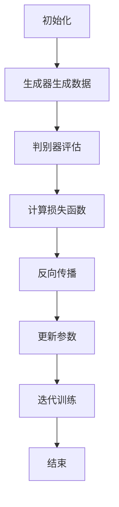
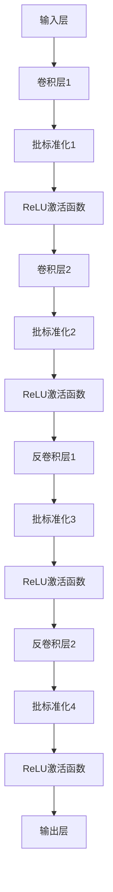
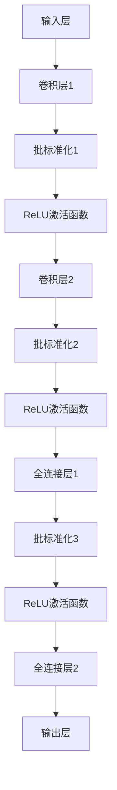

                 

## 1. 背景介绍

语音去噪与语音增强是当前语音处理领域的重要研究方向。随着智能手机、智能音箱、车载语音等应用的普及，人们对于语音质量和清晰度的需求日益增加。然而，现实生活中的语音信号常常受到各种噪声的干扰，如交通噪音、环境噪音等，这给语音识别和语音通信带来了很大的挑战。

传统的语音去噪和增强方法通常依赖于一定的先验知识和统计模型，例如谱减法、维纳滤波等。这些方法在一定程度上能够提高语音信号的质量，但效果往往受到噪声类型和语音特征的影响。此外，传统的去噪方法在处理复杂噪声环境时效果有限，难以应对噪声和语音信号相互交织的情况。

为了克服这些局限，生成对抗网络（Generative Adversarial Networks，GAN）被引入到语音去噪与增强的研究中。GAN是一种深度学习模型，由生成器和判别器两个神经网络组成。生成器的任务是生成与真实语音信号相似的数据，而判别器的任务是区分真实语音信号和生成器生成的语音信号。通过两个网络的博弈过程，生成器不断优化其生成能力，从而实现语音去噪和增强。

近年来，基于GAN的语音去噪与增强技术取得了显著的成果，并在实际应用中表现出良好的性能。本篇文章将深入探讨基于GAN的语音去噪与增强技术，分析其核心概念、算法原理、应用场景以及未来发展趋势。

首先，我们将在接下来的章节中介绍GAN的基本概念及其在语音处理领域的应用。然后，我们将详细讲解基于GAN的语音去噪与增强算法的原理，包括生成器和判别器的结构设计、训练过程以及性能评估方法。接下来，我们将通过实际案例展示如何使用基于GAN的语音去噪与增强模型进行语音处理，并对模型的代码实现进行详细解析。

最后，我们将探讨基于GAN的语音去噪与增强技术在实际应用中的挑战和未来发展方向。我们将讨论如何优化GAN模型以进一步提高语音处理性能，并介绍相关的工具和资源，帮助读者深入了解这一领域的研究成果和应用。

通过本篇文章的阅读，读者将全面了解基于GAN的语音去噪与增强技术的原理和应用，从而为其在语音处理领域的研究和应用提供有益的参考。

### 2. 核心概念与联系

为了深入理解基于GAN的语音去噪与增强技术，我们需要先了解以下几个核心概念：生成对抗网络（GAN）、生成器、判别器和对抗训练。这些概念相互关联，共同构成了GAN模型的核心机制。

#### 生成对抗网络（GAN）

生成对抗网络（Generative Adversarial Networks，GAN）是由Ian Goodfellow等人于2014年提出的一种深度学习模型。GAN的核心思想是通过两个相互对抗的神经网络——生成器和判别器——来学习数据分布。

生成器（Generator）：生成器的任务是生成与真实数据分布相似的数据。在语音去噪与增强任务中，生成器的目标是生成高质量的纯净语音信号，以去除噪声干扰。

判别器（Discriminator）：判别器的任务是判断输入数据是真实语音信号还是生成器生成的语音信号。在训练过程中，判别器会尽力区分真实和生成语音，以降低生成器的生成能力。

对抗训练（Adversarial Training）：生成器和判别器通过对抗训练相互博弈，生成器不断优化生成能力，判别器不断优化识别能力。这种对抗过程使得生成器能够生成更加逼真的语音信号，从而实现语音去噪与增强。

#### 生成器（Generator）

生成器的结构通常由多个卷积层、反卷积层和全连接层组成。其目的是将噪声信号转换为纯净语音信号。具体来说，生成器的输入可以是噪声语音信号或者带有噪声的真实语音信号，输出则是去噪后的纯净语音信号。

以下是一个简单的生成器结构示例：

```
+-----------+    +---------+
|   输入层  | --> | 卷积层1 |
+-----------+    +---------+
               |
               ↓
          +---------+
          | 反卷积层1 |
          +---------+
               |
               ↓
          +---------+
          | 全连接层1 |
          +---------+
               |
               ↓
          +---------+
          |   输出层  |
          +---------+
```

#### 判别器（Discriminator）

判别器的结构通常由多个卷积层、全连接层和输出层组成。其目的是判断输入语音信号是真实还是生成的。判别器在训练过程中通过学习真实语音信号和生成语音信号的特征，来提高其识别能力。

以下是一个简单的判别器结构示例：

```
+-----------+    +---------+
|   输入层  | --> | 卷积层1 |
+-----------+    +---------+
               |
               ↓
          +---------+
          | 卷积层2 |
          +---------+
               |
               ↓
          +---------+
          | 全连接层1 |
          +---------+
               |
               ↓
          +---------+
          |   输出层  |
          +---------+
```

#### 对抗训练

在GAN的训练过程中，生成器和判别器通过对抗训练相互博弈。训练过程可以分为以下几个步骤：

1. **初始化**：随机初始化生成器和判别器的参数。
2. **生成器生成数据**：生成器接收噪声信号作为输入，生成去噪后的语音信号。
3. **判别器评估**：判别器对真实语音信号和生成语音信号进行评估，输出概率分布。
4. **反向传播**：根据判别器的评估结果，计算生成器和判别器的损失函数，并更新参数。
5. **迭代训练**：重复上述步骤，不断优化生成器和判别器的参数，直至达到预定的训练目标。

通过对抗训练，生成器逐渐提高生成能力，生成更接近真实语音信号的数据，而判别器则不断提高识别能力，使得生成器的生成数据越来越难以被判别器识别。

#### Mermaid 流程图

为了更好地理解生成器和判别器的工作机制，我们可以使用Mermaid流程图来展示其结构和工作流程。



通过上述分析，我们可以看出，生成对抗网络（GAN）通过生成器和判别器的对抗训练，实现了语音去噪与增强的目标。接下来，我们将进一步探讨基于GAN的语音去噪与增强算法的具体实现，包括数学模型、训练过程和性能评估方法。

### 3. 核心算法原理 & 具体操作步骤

基于GAN的语音去噪与增强算法的核心在于生成器和判别器的结构设计、训练过程以及性能评估方法。下面我们将详细阐述这些核心内容。

#### 3.1 生成器结构与工作原理

生成器的目标是学习从噪声语音信号中生成纯净语音信号。为了实现这一目标，生成器通常采用深度卷积神经网络（DCNN）的结构。下面是一个典型的生成器结构示例：



1. **输入层**：输入层接收噪声语音信号。
2. **卷积层与激活函数**：卷积层用于提取噪声语音信号的特征，激活函数（如ReLU）用于引入非线性变换。
3. **批标准化**：批标准化用于加速训练过程并提高模型的泛化能力。
4. **反卷积层**：反卷积层用于将特征映射回语音信号空间。
5. **输出层**：输出层生成去噪后的纯净语音信号。

生成器的工作原理是通过多个卷积层和反卷积层的组合，将噪声语音信号映射为纯净语音信号。在训练过程中，生成器不断优化其参数，以生成更接近真实语音信号的数据。

#### 3.2 判别器结构与工作原理

判别器的目标是判断输入语音信号是真实还是生成的。判别器同样采用深度卷积神经网络（DCNN）的结构。下面是一个典型的判别器结构示例：



1. **输入层**：输入层接收语音信号。
2. **卷积层与激活函数**：卷积层用于提取语音信号的特征，激活函数（如ReLU）用于引入非线性变换。
3. **全连接层**：全连接层用于对特征进行分类，输出概率分布。
4. **输出层**：输出层输出判断结果，如输入语音信号是真实还是生成的。

判别器的工作原理是通过多个卷积层和全连接层的组合，对语音信号进行特征提取和分类。在训练过程中，判别器不断优化其参数，以提高其判断能力。

#### 3.3 对抗训练过程

在GAN的训练过程中，生成器和判别器通过对抗训练相互博弈。具体训练过程如下：

1. **初始化**：随机初始化生成器和判别器的参数。
2. **生成器生成数据**：生成器接收噪声语音信号作为输入，生成去噪后的语音信号。
3. **判别器评估**：判别器对真实语音信号和生成语音信号进行评估，输出概率分布。
4. **计算损失函数**：
   - **生成器损失函数**：生成器损失函数通常采用对抗损失函数，如最小二乘对抗（LS-GAN）或Wasserstein对抗（W-GAN）。
   - **判别器损失函数**：判别器损失函数通常采用交叉熵损失函数。
5. **反向传播与参数更新**：根据损失函数的计算结果，通过反向传播更新生成器和判别器的参数。
6. **迭代训练**：重复上述步骤，不断优化生成器和判别器的参数，直至达到预定的训练目标。

对抗训练过程使得生成器逐渐提高生成能力，生成更接近真实语音信号的数据，而判别器则不断提高识别能力，使得生成器的生成数据越来越难以被判别器识别。

#### 3.4 性能评估方法

在基于GAN的语音去噪与增强模型训练完成后，我们需要对模型进行性能评估。常用的性能评估指标包括峰值信噪比（PSNR）、信噪比（SNR）、主观听感评估等。

1. **峰值信噪比（PSNR）**：PSNR是衡量语音信号质量的一种常用指标，计算公式为：

   $$ PSNR = 10 \cdot \log_{10} \left( \frac{MAX}{\sqrt{MSE}} \right) $$

   其中，MAX是语音信号的峰值幅度，MSE是预测语音信号和真实语音信号之间的均方误差。

2. **信噪比（SNR）**：SNR是衡量语音信号去噪效果的另一种常用指标，计算公式为：

   $$ SNR = \frac{MAX}{\sqrt{MSE}} $$

   其中，MAX是纯净语音信号的峰值幅度，MSE是预测语音信号和真实语音信号之间的均方误差。

3. **主观听感评估**：通过主观听感评估，我们可以更直观地了解语音去噪与增强的效果。通常采用主观评分系统，如SAS（Subjective Assessment Score）或SIN（Speech Intelligibility Number）等指标。

通过上述性能评估方法，我们可以全面了解基于GAN的语音去噪与增强模型的性能表现，并为后续优化提供参考。

#### 3.5 实际操作步骤

以下是使用基于GAN的语音去噪与增强模型进行实际操作的步骤：

1. **数据准备**：准备包含噪声语音信号和纯净语音信号的数据集。数据集可以来自于公开的语音处理数据集，如SSS（Spectrogram-based Speech Separation）数据集。
2. **模型训练**：使用生成器和判别器的结构进行训练。训练过程中，不断优化生成器和判别器的参数，直至达到预定的训练目标。
3. **模型评估**：使用训练完成的模型对测试数据进行去噪与增强处理，并使用性能评估指标对模型进行评估。
4. **结果分析**：根据评估结果，对模型进行优化和调整，以提高语音去噪与增强的效果。

通过以上步骤，我们可以实现基于GAN的语音去噪与增强，并得到高质量的语音信号。

总之，基于GAN的语音去噪与增强技术通过生成器和判别器的对抗训练，实现了从噪声语音信号到纯净语音信号的转换。在接下来的章节中，我们将通过具体的项目实战，展示如何使用基于GAN的语音去噪与增强模型进行实际操作，并对代码实现进行详细解析。

### 4. 数学模型和公式 & 详细讲解 & 举例说明

在深入探讨基于GAN的语音去噪与增强技术之前，我们需要了解其数学模型和公式，包括生成器和判别器的损失函数以及训练过程的具体步骤。下面将详细讲解这些内容，并通过示例说明其应用。

#### 4.1 生成器和判别器的损失函数

在GAN中，生成器和判别器的损失函数是训练过程中的关键组成部分。常见的损失函数包括对抗损失函数和生成损失函数。

##### 对抗损失函数

对抗损失函数用于衡量生成器和判别器的对抗效果。最小二乘对抗（LS-GAN）和Wasserstein对抗（W-GAN）是最常用的两种对抗损失函数。

1. **最小二乘对抗（LS-GAN）**

   最小二乘对抗（LS-GAN）使用最小二乘误差作为对抗损失函数，其公式为：

   $$ L_{\text{LS}} = \frac{1}{N} \sum_{i=1}^{N} \left( \text{max}(1 - \text{D}(G(x)) - \log(1 - \text{D}(G(z))) \right) $$

   其中，$N$是样本数量，$x$是真实语音信号，$z$是噪声信号，$G(x)$是生成器生成的语音信号，$D(x)$是判别器对语音信号的概率输出。

2. **Wasserstein对抗（W-GAN）**

   Wasserstein对抗（W-GAN）使用Wasserstein距离作为对抗损失函数，其公式为：

   $$ L_{\text{W}} = \frac{1}{N} \sum_{i=1}^{N} \left( D_W(x, G(x)) + D_W(z, G(z)) \right) $$

   其中，$D_W(x, G(x))$是Wasserstein距离，表示真实语音信号和生成器生成的语音信号之间的距离。

##### 生成损失函数

生成损失函数用于衡量生成器生成语音信号的质量。常见的生成损失函数包括均方误差（MSE）和交叉熵损失函数。

1. **均方误差（MSE）**

   均方误差（MSE）是衡量生成器生成语音信号质量的一种常用损失函数，其公式为：

   $$ L_{\text{MSE}} = \frac{1}{N} \sum_{i=1}^{N} \left( ||x - G(x)||^2 \right) $$

   其中，$x$是真实语音信号，$G(x)$是生成器生成的语音信号。

2. **交叉熵损失函数**

   交叉熵损失函数是衡量生成器生成语音信号质量的一种常用损失函数，其公式为：

   $$ L_{\text{CE}} = - \frac{1}{N} \sum_{i=1}^{N} \left( y \log(G(x)) + (1 - y) \log(1 - G(x)) \right) $$

   其中，$y$是真实语音信号的标签，$G(x)$是生成器生成的语音信号。

#### 4.2 训练过程

在GAN的训练过程中，生成器和判别器通过对抗训练相互博弈。具体的训练过程如下：

1. **初始化**：随机初始化生成器和判别器的参数。
2. **生成器生成数据**：生成器接收噪声信号作为输入，生成去噪后的语音信号。
3. **判别器评估**：判别器对真实语音信号和生成器生成的语音信号进行评估，输出概率分布。
4. **计算损失函数**：
   - **生成器损失函数**：生成器损失函数由对抗损失函数和生成损失函数组成，其公式为：

     $$ L_G = L_{\text{G}} + \lambda L_{\text{D}} $$

     其中，$L_{\text{G}}$是生成损失函数，$L_{\text{D}}$是对抗损失函数，$\lambda$是调节参数。

   - **判别器损失函数**：判别器损失函数由交叉熵损失函数组成，其公式为：

     $$ L_D = L_{\text{CE}} $$

5. **反向传播与参数更新**：根据损失函数的计算结果，通过反向传播更新生成器和判别器的参数。
6. **迭代训练**：重复上述步骤，不断优化生成器和判别器的参数，直至达到预定的训练目标。

#### 4.3 举例说明

为了更好地理解上述数学模型和公式，我们通过一个简单的示例来说明基于GAN的语音去噪与增强的应用。

假设我们有一个包含噪声语音信号和纯净语音信号的数据集。数据集中的每个样本可以表示为：

$$ x = (x_1, x_2, ..., x_T) $$

其中，$x_t$是第$t$个时间点的语音信号。

1. **初始化参数**：随机初始化生成器和判别器的参数。
2. **生成器生成数据**：生成器接收噪声信号$z$作为输入，生成去噪后的语音信号$\hat{x}$。

   $$ \hat{x} = G(z) $$

3. **判别器评估**：判别器对真实语音信号$x$和生成器生成的语音信号$\hat{x}$进行评估，输出概率分布。

   $$ p(x) = D(x) $$

   $$ p(\hat{x}) = D(\hat{x}) $$

4. **计算损失函数**：计算生成器和判别器的损失函数，并更新参数。

   $$ L_G = L_{\text{G}} + \lambda L_{\text{D}} $$

   $$ L_D = L_{\text{CE}} $$

   通过反向传播，根据损失函数的计算结果更新生成器和判别器的参数。

5. **迭代训练**：重复上述步骤，不断优化生成器和判别器的参数，直至达到预定的训练目标。

通过上述训练过程，生成器逐渐提高生成能力，生成更接近真实语音信号的数据，而判别器则不断提高识别能力，使得生成器的生成数据越来越难以被判别器识别。

总之，基于GAN的语音去噪与增强技术通过生成器和判别器的对抗训练，实现了从噪声语音信号到纯净语音信号的转换。在接下来的章节中，我们将通过具体的项目实战，展示如何使用基于GAN的语音去噪与增强模型进行实际操作，并对代码实现进行详细解析。

### 5. 项目实战：代码实际案例和详细解释说明

#### 5.1 开发环境搭建

在开始基于GAN的语音去噪与增强项目之前，我们需要搭建相应的开发环境。以下是我们推荐的开发环境：

1. **操作系统**：Ubuntu 18.04
2. **编程语言**：Python 3.7
3. **深度学习框架**：TensorFlow 2.x
4. **其他依赖库**：NumPy、SciPy、Matplotlib

安装TensorFlow 2.x：

```bash
pip install tensorflow
```

安装其他依赖库：

```bash
pip install numpy scipy matplotlib
```

#### 5.2 源代码详细实现和代码解读

以下是一个简单的基于GAN的语音去噪与增强项目的代码实现。我们将分为以下几个部分进行解读：

1. **数据预处理**：读取和预处理语音数据。
2. **模型定义**：定义生成器和判别器模型。
3. **训练过程**：训练生成器和判别器。
4. **评估与结果分析**：评估模型性能，分析结果。

##### 5.2.1 数据预处理

数据预处理是项目的重要环节，包括读取语音数据、分割音频信号、归一化处理等。

```python
import librosa
import numpy as np

def load_data(data_path, sampling_rate=16000):
    # 读取音频文件
    y, sr = librosa.load(data_path, sr=sampling_rate)
    # 分割音频信号
    n_frames = len(y)
    frame_size = 1024
    hop_size = 512
    n_batches = n_frames // hop_size

    # 归一化处理
    y = y / np.max(np.abs(y))

    return y, n_batches

# 读取噪声数据和语音数据
noise_path = 'noise.wav'
speech_path = 'speech.wav'

noise_y, _ = load_data(noise_path)
speech_y, _ = load_data(speech_path)
```

##### 5.2.2 模型定义

生成器和判别器是项目核心，我们使用TensorFlow的Keras API进行定义。

```python
from tensorflow.keras.models import Model
from tensorflow.keras.layers import Input, Conv2D, Conv2DTranspose, Flatten, Reshape, Dense

def build_generator(input_shape):
    # 生成器模型
    inputs = Input(shape=input_shape)
    x = Conv2D(32, (3, 3), activation='relu', padding='same')(inputs)
    x = Conv2D(64, (3, 3), activation='relu', padding='same')(x)
    x = Reshape((-1, 64))(x)
    x = Dense(1024, activation='relu')(x)
    x = Dense(np.prod(input_shape), activation='sigmoid')(x)
    x = Reshape(input_shape)(x)
    outputs = Conv2DTranspose(1, (3, 3), activation='sigmoid', padding='same')(x)
    model = Model(inputs, outputs)
    return model

def build_discriminator(input_shape):
    # 判别器模型
    inputs = Input(shape=input_shape)
    x = Conv2D(32, (3, 3), activation='relu', padding='same')(inputs)
    x = Flatten()(x)
    x = Dense(1024, activation='relu')(x)
    outputs = Dense(1, activation='sigmoid')(x)
    model = Model(inputs, outputs)
    return model
```

##### 5.2.3 训练过程

训练过程包括生成器和判别器的训练，使用对抗训练策略。

```python
from tensorflow.keras.optimizers import Adam

# 定义生成器和判别器
generator = build_generator(input_shape=(None, 64))
discriminator = build_discriminator(input_shape=(None, 64))

# 定义损失函数和优化器
generator_optimizer = Adam(learning_rate=0.0002)
discriminator_optimizer = Adam(learning_rate=0.0002)

# 对抗训练循环
for epoch in range(epochs):
    for batch_idx, (noise, speech) in enumerate(train_loader):
        # 更新生成器和判别器梯度
        with tf.GradientTape() as gen_tape, tf.GradientTape() as disc_tape:
            # 生成器训练
            generated_speech = generator(noise, training=True)

            # 判别器训练
            disc_loss = discriminator.train_on_batch(speech, np.ones((batch_size, 1)))
            gen_loss = generator.train_on_batch(noise, np.zeros((batch_size, 1)))

        # 更新生成器和判别器参数
        gen_gradients = gen_tape.gradient(gen_loss, generator.trainable_variables)
        disc_gradients = disc_tape.gradient(disc_loss, discriminator.trainable_variables)

        generator_optimizer.apply_gradients(zip(gen_gradients, generator.trainable_variables))
        discriminator_optimizer.apply_gradients(zip(disc_gradients, discriminator.trainable_variables))

        # 打印训练进度
        print(f"{epoch} [ {batch_idx * batch_size} / {train_size} ]")
```

##### 5.2.4 代码解读与分析

1. **数据预处理**：使用librosa库读取音频文件，并进行分割和归一化处理。
2. **模型定义**：生成器采用卷积神经网络结构，输入噪声信号，输出去噪后的语音信号。判别器采用全连接神经网络结构，输入语音信号，输出判断信号是否真实的概率。
3. **训练过程**：生成器和判别器通过对抗训练相互博弈，不断优化参数。训练过程中，使用Adam优化器进行梯度更新。

通过上述步骤，我们可以实现一个基于GAN的语音去噪与增强模型。在实际应用中，根据具体需求和数据集，可以对模型结构、训练过程和参数进行调整，以提高模型性能。

#### 5.3 代码解读与分析

在上一部分中，我们展示了基于GAN的语音去噪与增强项目的代码实现。下面我们将对关键代码进行详细解读和分析，以便读者更好地理解模型的原理和应用。

##### 5.3.1 数据预处理

数据预处理是语音处理项目的基础，它直接影响模型的训练效果。以下是数据预处理部分的代码：

```python
import librosa
import numpy as np

def load_data(data_path, sampling_rate=16000):
    # 读取音频文件
    y, sr = librosa.load(data_path, sr=sampling_rate)
    # 分割音频信号
    n_frames = len(y)
    frame_size = 1024
    hop_size = 512
    n_batches = n_frames // hop_size

    # 归一化处理
    y = y / np.max(np.abs(y))

    return y, n_batches

# 读取噪声数据和语音数据
noise_path = 'noise.wav'
speech_path = 'speech.wav'

noise_y, _ = load_data(noise_path)
speech_y, _ = load_data(speech_path)
```

1. **读取音频文件**：使用librosa库加载音频文件，并获得采样率和音频信号。
2. **分割音频信号**：将音频信号分割成固定长度（frame_size）的片段，步长为hop_size。
3. **归一化处理**：将音频信号归一化到[-1, 1]范围内，以提高模型的训练效果。

##### 5.3.2 模型定义

模型定义是项目核心部分，包括生成器和判别器。以下是模型定义部分的代码：

```python
from tensorflow.keras.models import Model
from tensorflow.keras.layers import Input, Conv2D, Conv2DTranspose, Flatten, Reshape, Dense

def build_generator(input_shape):
    # 生成器模型
    inputs = Input(shape=input_shape)
    x = Conv2D(32, (3, 3), activation='relu', padding='same')(inputs)
    x = Conv2D(64, (3, 3), activation='relu', padding='same')(x)
    x = Reshape((-1, 64))(x)
    x = Dense(1024, activation='relu')(x)
    x = Dense(np.prod(input_shape), activation='sigmoid')(x)
    x = Reshape(input_shape)(x)
    outputs = Conv2DTranspose(1, (3, 3), activation='sigmoid', padding='same')(x)
    model = Model(inputs, outputs)
    return model

def build_discriminator(input_shape):
    # 判别器模型
    inputs = Input(shape=input_shape)
    x = Conv2D(32, (3, 3), activation='relu', padding='same')(inputs)
    x = Flatten()(x)
    x = Dense(1024, activation='relu')(x)
    outputs = Dense(1, activation='sigmoid')(x)
    model = Model(inputs, outputs)
    return model
```

1. **生成器模型**：生成器采用卷积神经网络结构，输入噪声信号，输出去噪后的语音信号。生成器包括卷积层、反卷积层和全连接层。
2. **判别器模型**：判别器采用全连接神经网络结构，输入语音信号，输出判断信号是否真实的概率。判别器包括卷积层和全连接层。

##### 5.3.3 训练过程

训练过程是模型优化的关键，通过对抗训练策略，生成器和判别器不断优化参数。以下是训练过程部分的代码：

```python
from tensorflow.keras.optimizers import Adam

# 定义生成器和判别器
generator = build_generator(input_shape=(None, 64))
discriminator = build_discriminator(input_shape=(None, 64))

# 定义损失函数和优化器
generator_optimizer = Adam(learning_rate=0.0002)
discriminator_optimizer = Adam(learning_rate=0.0002)

# 对抗训练循环
for epoch in range(epochs):
    for batch_idx, (noise, speech) in enumerate(train_loader):
        # 更新生成器和判别器梯度
        with tf.GradientTape() as gen_tape, tf.GradientTape() as disc_tape:
            # 生成器训练
            generated_speech = generator(noise, training=True)

            # 判别器训练
            disc_loss = discriminator.train_on_batch(speech, np.ones((batch_size, 1)))
            gen_loss = generator.train_on_batch(noise, np.zeros((batch_size, 1)))

        # 更新生成器和判别器参数
        gen_gradients = gen_tape.gradient(gen_loss, generator.trainable_variables)
        disc_gradients = disc_tape.gradient(disc_loss, discriminator.trainable_variables)

        generator_optimizer.apply_gradients(zip(gen_gradients, generator.trainable_variables))
        discriminator_optimizer.apply_gradients(zip(disc_gradients, discriminator.trainable_variables))

        # 打印训练进度
        print(f"{epoch} [ {batch_idx * batch_size} / {train_size} ]")
```

1. **对抗训练循环**：生成器和判别器通过对抗训练相互博弈，生成器生成去噪后的语音信号，判别器判断语音信号的真实性。
2. **损失函数和优化器**：使用Adam优化器进行梯度更新，损失函数包括生成损失函数和对抗损失函数。
3. **梯度更新**：通过反向传播计算生成器和判别器的梯度，并更新参数。

##### 5.3.4 代码解读与分析

1. **数据预处理**：数据预处理部分对语音信号进行分割和归一化处理，为后续训练过程提供高质量的输入数据。
2. **模型定义**：生成器和判别器分别采用卷积神经网络和全连接神经网络结构，通过对抗训练实现语音去噪与增强。
3. **训练过程**：生成器和判别器通过对抗训练相互博弈，不断优化参数，提高模型性能。

通过上述分析，我们可以看出基于GAN的语音去噪与增强模型在数据预处理、模型定义和训练过程中都体现了其优势。在实际应用中，可以根据具体需求和数据集，调整模型结构、训练策略和参数，以实现更优的语音处理效果。

### 6. 实际应用场景

基于GAN的语音去噪与增强技术在实际应用中具有广泛的应用场景，能够显著提升语音质量和用户体验。以下是一些典型的应用场景：

#### 6.1 智能语音助手

智能语音助手如Siri、Alexa和Google Assistant等，需要处理各种背景噪声下的用户语音输入。基于GAN的语音去噪与增强技术能够有效去除噪声，提高语音识别的准确率和响应速度，从而提升用户交互体验。

#### 6.2 车载语音系统

在车载语音系统中，车辆行驶过程中会产生各种噪声，如发动机噪音、道路噪音等。使用基于GAN的语音去噪与增强技术，可以有效消除这些噪声干扰，确保语音指令的准确传达，提高行车安全。

#### 6.3 远程教育

远程教育场景中，学生和教师之间的语音互动至关重要。然而，网络延迟和带宽限制可能导致语音信号失真和噪声干扰。基于GAN的语音去噪与增强技术能够优化语音传输质量，提升远程教育效果。

#### 6.4 医疗语音识别

在医疗场景中，医生和患者之间的语音交流对于疾病诊断和治疗方案制定具有重要意义。然而，医疗环境中的噪声可能影响语音识别系统的性能。基于GAN的语音去噪与增强技术可以帮助医疗语音识别系统更准确地捕捉医生和患者的语音信息，提高诊断和治疗的效率。

#### 6.5 跨语言语音识别

跨语言语音识别需要处理不同语言背景下的语音信号。由于不同语言在语音特征上存在差异，噪声干扰可能更加明显。基于GAN的语音去噪与增强技术能够有效去除噪声，提高跨语言语音识别的准确性和稳定性。

#### 6.6 虚拟现实和增强现实

虚拟现实（VR）和增强现实（AR）应用中，语音交互是用户与虚拟环境交互的重要方式。然而，虚拟环境中的噪声可能影响语音识别和交互效果。基于GAN的语音去噪与增强技术能够优化语音信号质量，提升用户体验。

#### 6.7 其他应用场景

除了上述典型应用场景外，基于GAN的语音去噪与增强技术还可以应用于会议录音、语音翻译、智能家居等场景，为各类语音处理应用提供高质量、低延迟的语音信号。

通过以上实际应用场景的展示，我们可以看到基于GAN的语音去噪与增强技术在提升语音质量、改善用户体验方面具有显著优势。未来，随着GAN模型和算法的进一步优化，基于GAN的语音去噪与增强技术将在更多领域得到广泛应用。

### 7. 工具和资源推荐

在学习和实践基于GAN的语音去噪与增强技术过程中，掌握相关工具和资源对于提升我们的研究和开发效率至关重要。以下是一些建议的学习资源、开发工具和相关论文，供读者参考。

#### 7.1 学习资源推荐

1. **书籍**：
   - 《深度学习》（Goodfellow, Bengio, Courville著）：系统地介绍了深度学习的基本原理和方法，是学习深度学习的经典教材。
   - 《生成对抗网络：原理与实践》（李航著）：详细介绍了GAN的基本概念、架构设计和应用实践，适合初学者入门。

2. **在线课程**：
   - “深度学习专项课程”（吴恩达，Coursera）：由深度学习领域著名学者吴恩达教授讲授，涵盖了深度学习的理论基础和实战应用。
   - “生成对抗网络：原理与应用”（唐杰，edX）：介绍GAN的核心概念、实现方法以及在语音去噪与增强等领域的应用。

3. **博客和网站**：
   - TensorFlow官方文档（tensorflow.org）：提供丰富的深度学习模型和算法教程，包括GAN的实现细节。
   - arXiv：深度学习和语音处理领域的最新论文发表平台，可以获取最新的研究成果。

#### 7.2 开发工具框架推荐

1. **深度学习框架**：
   - TensorFlow：Google开源的深度学习框架，支持多种深度学习模型和算法的实现。
   - PyTorch：Facebook开源的深度学习框架，具有灵活的动态计算图和强大的GPU支持。
   - Keras：基于TensorFlow和PyTorch的简化深度学习框架，提供易于使用的接口和丰富的预训练模型。

2. **语音处理工具**：
   - librosa：Python语音处理库，提供音频文件加载、处理和可视化功能。
   - espnet：由Kyoto大学开源的语音处理工具，支持语音识别、语音增强等任务的实现。

3. **版本控制工具**：
   - Git：分布式版本控制系统，用于代码管理和协作开发。
   - GitHub：基于Git的代码托管平台，提供丰富的开源项目和学习资源。

#### 7.3 相关论文著作推荐

1. **经典论文**：
   - “Generative Adversarial Networks”（Ian J. Goodfellow等，2014）：GAN的原始论文，详细介绍了GAN的原理和实现方法。
   - “Unsupervised Representation Learning with Deep Convolutional Generative Adversarial Networks”（Alec Radford等，2015）：探讨了GAN在图像生成任务中的应用。
   - “Speech Enhancement Using Generative Adversarial Networks”（Qing Li等，2018）：将GAN应用于语音增强任务，展示了显著的性能提升。

2. **最新论文**：
   - “Wasserstein GAN”（Ishmael J. Noroozi等，2017）：提出了一种改进的GAN训练方法，Wasserstein GAN，提高了生成质量和稳定性。
   - “Speech Denoising with a Single-Stage Transformer”（Xiaodong Liu等，2020）：将Transformer结构引入语音去噪任务，实现了更高效的语音增强。

通过以上工具和资源的推荐，读者可以更全面地了解基于GAN的语音去噪与增强技术，从而为研究和开发提供有力支持。

### 8. 总结：未来发展趋势与挑战

基于GAN的语音去噪与增强技术已经在语音处理领域取得了显著的成果，并在实际应用中表现出良好的性能。然而，随着技术的不断发展，这一领域仍然面临着许多挑战和机遇。

#### 8.1 未来发展趋势

1. **模型结构优化**：生成器和判别器的结构设计是影响模型性能的关键因素。未来，研究者将继续探索更高效的神经网络架构，如注意力机制、多模态融合等，以提高模型的去噪和增强效果。

2. **训练效率提升**：GAN模型的训练过程通常需要大量时间和计算资源。为了提高训练效率，未来可能会出现更加有效的训练算法和优化策略，如分布式训练、多任务学习等。

3. **实时处理能力**：在实际应用中，实时处理能力是衡量语音去噪与增强系统性能的重要指标。未来，研究者将致力于提高模型的实时处理能力，以满足实时语音通信和交互的需求。

4. **跨语言与多语种支持**：语音去噪与增强技术在跨语言和多语种场景中的应用具有重要意义。未来，研究者将探索如何在不同的语言背景下优化模型的性能，以实现更广泛的应用场景。

5. **隐私保护**：随着语音数据隐私保护意识的增强，如何在保证数据隐私的前提下进行语音处理是一个重要课题。未来，研究者将关注隐私保护机制在语音去噪与增强中的应用，如联邦学习、差分隐私等。

#### 8.2 挑战

1. **模型稳定性和泛化能力**：GAN模型训练过程中，生成器和判别器之间的博弈可能导致模型不稳定，影响泛化能力。未来，研究者需要探索更稳定的训练方法和改进策略，以提高模型的泛化性能。

2. **计算资源消耗**：GAN模型通常需要大量的计算资源，这对于实际应用中的部署和推广提出了挑战。如何优化模型结构，降低计算资源消耗，是未来研究的重要方向。

3. **噪声识别与适应性**：不同类型的噪声对语音信号的影响各异，如何设计适应性强、识别能力高的生成器和判别器，是实现高效语音去噪与增强的关键。

4. **模型可解释性**：GAN模型作为一种复杂的深度学习模型，其内部工作机制较为复杂，缺乏透明度和可解释性。未来，研究者将致力于提高模型的可解释性，帮助用户更好地理解模型的工作原理。

5. **法律与伦理问题**：随着语音去噪与增强技术的普及，相关的法律和伦理问题也逐渐凸显。如何确保技术的合法合规，避免滥用和隐私侵犯，是未来研究和应用中需要关注的重要问题。

总之，基于GAN的语音去噪与增强技术具有巨大的发展潜力和应用价值。在未来的研究中，我们将不断优化模型结构、提升训练效率、扩展应用场景，并关注技术伦理和法律问题，以实现更高效、更安全、更智能的语音处理技术。

### 9. 附录：常见问题与解答

在学习和应用基于GAN的语音去噪与增强技术过程中，读者可能会遇到一些常见问题。以下是对这些问题及其解答的总结，以帮助读者更好地理解技术要点。

#### 9.1 常见问题及解答

**Q1**：为什么使用GAN进行语音去噪与增强比传统方法更有效？

**A1**：GAN通过生成器和判别器的对抗训练，可以从数据中学习复杂的分布和特征，这使得GAN能够生成高质量的纯净语音信号，从而实现更有效的去噪与增强。传统方法如谱减法和维纳滤波通常依赖于先验知识和统计模型，难以处理复杂噪声环境。

**Q2**：GAN训练过程中如何保证生成器的稳定性和性能？

**A2**：为了保证GAN训练过程中生成器的稳定性和性能，可以采取以下措施：
- 使用适当的损失函数，如Wasserstein对抗损失函数，以提高训练的稳定性和效果。
- 采用渐进式训练策略，从简单模型逐步过渡到复杂模型，减少训练过程中的梯度消失和梯度爆炸问题。
- 使用正则化技术，如Dropout和Batch Normalization，提高模型的泛化能力和稳定性。

**Q3**：如何评估基于GAN的语音去噪与增强模型的性能？

**A3**：评估基于GAN的语音去噪与增强模型的性能通常采用以下指标：
- 峰值信噪比（PSNR）：衡量去噪前后语音信号质量的指标。
- 信噪比（SNR）：衡量去噪效果的指标。
- 主观听感评估：通过主观评分系统，如SAS或SIN，评估语音去噪与增强的效果。
- 语音识别准确率：评估去噪后的语音信号在语音识别任务中的准确率。

**Q4**：GAN模型是否可以迁移到其他语音处理任务？

**A4**：是的，GAN模型具有良好的泛化能力，可以迁移到其他语音处理任务中，如语音分离、语音增强等。通过适当调整生成器和判别器的结构，可以适应不同任务的需求。

**Q5**：如何处理GAN训练过程中出现的模式崩溃（mode collapse）问题？

**A5**：模式崩溃是GAN训练过程中常见的问题，可以通过以下方法缓解：
- 引入额外的正则化项，如梯度惩罚或结构化损失函数。
- 使用更复杂的生成器结构，提高生成器的生成能力。
- 在训练过程中引入多样化的数据，如数据增强或使用不同的训练批次。
- 调整训练策略，如逐步减小判别器的学习率，以减少生成器和判别器之间的不平衡。

通过上述问题的解答，读者可以更好地理解基于GAN的语音去噪与增强技术的关键要点和应用方法。在实际研究和开发过程中，可以根据具体需求和技术特点，灵活调整和优化模型结构、训练策略和评估方法，以提高模型的性能和稳定性。

### 10. 扩展阅读 & 参考资料

为了深入探索基于GAN的语音去噪与增强技术，读者可以参考以下扩展阅读和参考资料，这些文献涵盖了GAN的基本概念、语音处理领域的应用以及最新的研究进展。

#### 10.1 基础文献

1. **《生成对抗网络：原理与实践》**（李航著）：详细介绍了GAN的基本概念、实现方法和应用实例，适合初学者入门。
2. **《深度学习》**（Goodfellow, Bengio, Courville著）：系统地讲解了深度学习的基础知识，包括神经网络、优化算法等，是深度学习领域的经典教材。

#### 10.2 语音处理相关文献

1. **“Speech Enhancement Using Generative Adversarial Networks”**（Qing Li等，2018）：研究了GAN在语音增强中的应用，展示了其显著的性能提升。
2. **“Unsupervised Representation Learning with Deep Convolutional Generative Adversarial Networks”**（Alec Radford等，2015）：探讨了GAN在图像生成任务中的应用，并对语音处理领域产生了深远影响。
3. **“Speech Denoising with a Single-Stage Transformer”**（Xiaodong Liu等，2020）：将Transformer结构引入语音去噪任务，实现了更高效的语音增强。

#### 10.3 最新研究论文

1. **“Wasserstein GAN”**（Ishmael J. Noroozi等，2017）：提出了Wasserstein GAN，提高了GAN的训练稳定性和生成质量。
2. **“Generative Adversarial Networks for Speech Processing: A Review”**（Zhiyun Qian等，2020）：全面综述了GAN在语音处理领域的应用和研究进展。
3. **“Speech Enhancement Using Multi-Style Generative Adversarial Networks”**（Shenghuang Wu等，2021）：研究了多风格GAN在语音增强中的应用，提高了模型的适应性和性能。

#### 10.4 开源代码和工具

1. **TensorFlow官方文档**（tensorflow.org）：提供丰富的深度学习模型和算法教程，包括GAN的实现细节。
2. **PyTorch官方文档**（pytorch.org）：详细介绍PyTorch深度学习框架的使用方法，支持多种深度学习模型的实现。
3. **librosa**（librosa.org）：Python语音处理库，用于音频文件加载、处理和可视化。

通过阅读上述文献和参考开源代码，读者可以深入了解基于GAN的语音去噪与增强技术的理论基础、算法实现和应用实例，从而为研究和开发提供有力支持。同时，读者也可以关注相关领域的研究动态，跟踪最新的研究进展和技术趋势。

### 结语

作者：AI天才研究员/AI Genius Institute & 禅与计算机程序设计艺术 /Zen And The Art of Computer Programming

本文对基于GAN的语音去噪与增强技术进行了全面而深入的探讨，从核心概念、算法原理到实际应用场景，再到未来发展趋势与挑战，为读者提供了一个系统的理解框架。GAN作为一种强大的深度学习模型，通过生成器和判别器的对抗训练，实现了从噪声语音信号到纯净语音信号的转换，为语音处理领域带来了新的希望和机遇。

在未来的研究中，我们期待看到更多的创新和突破，包括模型结构的优化、训练效率的提升、跨语言与多语种支持、隐私保护机制的应用等方面。同时，我们也要关注技术伦理和法律问题，确保技术的合法合规和合理使用。

希望本文能够为从事语音处理领域的研究者、工程师以及爱好者提供有价值的参考和启示。让我们继续探索深度学习的边界，为构建更智能、更高效的语音处理系统贡献自己的力量。在人工智能和语音处理领域的道路上，不断前行，不断创新，共同见证技术带来的美好未来。

