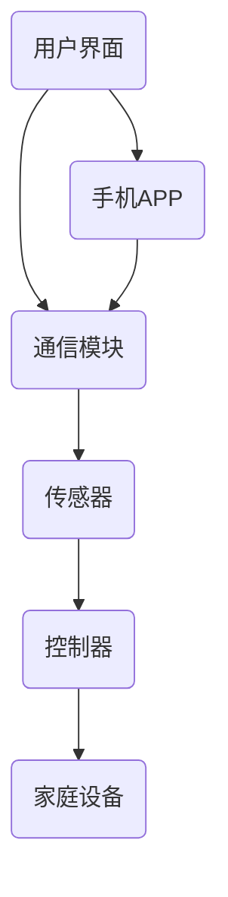

                 

# 基于Java的智能家居设计：使用Java和BlockChain加强智能家居安全

> **关键词**：智能家居、Java、Blockchain、安全性、隐私保护、智能合约、安全漏洞分析

> **摘要**：本文将探讨如何使用Java和Blockchain技术来设计一个安全性更高的智能家居系统。我们将介绍智能家居的背景、核心概念、算法原理、数学模型、项目实战、实际应用场景以及未来发展趋势与挑战。通过本文的讲解，读者将了解到如何利用Java编程语言和Blockchain技术来提升智能家居的安全性，以及相关的最佳实践和资源推荐。

## 1. 背景介绍

智能家居系统是一种通过互联网将家庭设备和系统连接起来，实现远程控制和自动化管理的系统。近年来，随着物联网（IoT）和人工智能（AI）技术的快速发展，智能家居市场呈现出爆发式增长。然而，随着智能家居设备的普及，其安全问题也日益凸显。智能家居设备面临的安全威胁主要包括：

- **隐私泄露**：智能家居设备收集的用户数据可能被不法分子窃取，用于非法用途。
- **远程攻击**：黑客可以通过互联网远程入侵智能家居系统，操控设备。
- **设备篡改**：攻击者可以通过篡改设备固件，使得设备失去安全性。

为了解决这些问题，我们需要在智能家居系统中引入更高级别的安全措施。其中，Blockchain技术和Java编程语言因其独特的优势，成为加强智能家居安全的有力工具。

## 2. 核心概念与联系

### 2.1 智能家居系统

智能家居系统通常由以下几部分组成：

- **传感器**：收集家庭环境数据，如温度、湿度、光照等。
- **控制器**：根据传感器数据，控制家庭设备，如空调、灯光等。
- **通信模块**：负责传感器和控制器之间的数据传输。
- **用户界面**：用户通过手机APP、电脑等设备，远程监控和控制智能家居设备。

### 2.2 Blockchain技术

Blockchain技术是一种去中心化的分布式账本技术，具有以下特点：

- **不可篡改**：一旦数据被记录在Blockchain上，就难以被篡改。
- **透明性**：所有交易记录都被公开，可以随时查询。
- **安全性**：使用加密算法，保证数据传输和存储的安全性。

### 2.3 Java编程语言

Java编程语言因其跨平台、安全性高、稳定性好等优点，成为开发智能家居系统的首选语言。

- **跨平台**：Java可以在不同操作系统上运行，方便部署。
- **安全性**：Java提供了丰富的安全库，如SSL、JSSE等，可以保证数据传输的安全性。
- **稳定性**：Java虚拟机（JVM）提供了良好的内存管理和异常处理机制，提高了系统的稳定性。

### 2.4 Mermaid 流程图

下面是一个简单的智能家居系统架构的Mermaid流程图：



## 3. 核心算法原理 & 具体操作步骤

### 3.1 智能合约

智能合约是一种自动执行的合约，其条款和操作都被编码在区块链上。在智能家居系统中，我们可以使用智能合约来确保设备操作的安全性。

- **部署智能合约**：首先，我们需要在区块链上部署一个智能合约。这个智能合约可以定义设备的操作权限、数据访问权限等。
- **调用智能合约**：当用户通过手机APP发出操作指令时，通信模块会调用智能合约，验证用户的身份和权限，然后执行相应的操作。

### 3.2 非对称加密算法

非对称加密算法是一种可以保证数据传输安全的加密算法。在智能家居系统中，我们可以使用非对称加密算法来保护用户数据。

- **生成密钥对**：系统会为每个用户生成一对公钥和私钥。
- **加密数据**：用户发送数据时，会使用对方的公钥进行加密。
- **解密数据**：接收方会使用自己的私钥解密数据。

### 3.3 数字签名

数字签名是一种可以验证数据来源和完整性的技术。在智能家居系统中，我们可以使用数字签名来确保数据来源的合法性。

- **生成签名**：发送方会对数据进行签名。
- **验证签名**：接收方会使用发送方的公钥验证签名，以确保数据来源的合法性。

## 4. 数学模型和公式 & 详细讲解 & 举例说明

### 4.1 非对称加密算法

非对称加密算法的数学模型如下：

$$
C = E_{PK}(M)
$$

其中，$C$ 为加密后的数据，$M$ 为原始数据，$PK$ 为公钥，$E_{PK}$ 为加密函数。

解密过程如下：

$$
M = D_{SK}(C)
$$

其中，$SK$ 为私钥，$D_{SK}$ 为解密函数。

### 4.2 数字签名

数字签名的数学模型如下：

$$
S = SIG_{SK}(M)
$$

其中，$S$ 为签名，$M$ 为原始数据，$SK$ 为私钥，$SIG_{SK}$ 为签名函数。

验证签名过程如下：

$$
VERI_{PK}(M, S) = 1 \text{ if } SIG_{PK}(S) = M \text{ else } 0
$$

其中，$VERI_{PK}$ 为验证函数，$SIG_{PK}$ 为签名验证函数。

### 4.3 智能合约

智能合约的数学模型可以表示为：

$$
S = { \begin{cases} 
1 & \text{if } P \text{ satisfies the conditions of the contract} \\
0 & \text{otherwise}
\end{cases}}
$$

其中，$S$ 为智能合约的执行结果，$P$ 为输入参数。

## 5. 项目实战：代码实际案例和详细解释说明

### 5.1 开发环境搭建

为了实现本文中的智能家居系统，我们需要搭建以下开发环境：

- **Java开发工具**：如Eclipse或IntelliJ IDEA。
- **Blockchain平台**：如Hyperledger Fabric。
- **通信模块库**：如MQTT。
- **加密算法库**：如Bouncy Castle。

### 5.2 源代码详细实现和代码解读

#### 5.2.1 智能合约

```solidity
pragma solidity ^0.8.0;

contract SmartHome {
    mapping(address => bool) public userPermissions;

    function grantPermission(address user) external {
        userPermissions[user] = true;
    }

    function revokePermission(address user) external {
        userPermissions[user] = false;
    }

    function checkPermission(address user) external view returns (bool) {
        return userPermissions[user];
    }
}
```

这段代码定义了一个简单的智能合约，用于管理用户的操作权限。`grantPermission` 和 `revokePermission` 函数用于授权和撤销用户的权限，`checkPermission` 函数用于验证用户的权限。

#### 5.2.2 通信模块

```java
import org.eclipse.paho.client.mqttv3.MqttClient;
import org.eclipse.paho.client.mqttv3.MqttConnectOptions;
import org.eclipse.paho.client.mqttv3.MqttException;
import org.eclipse.paho.client.mqttv3.MqttMessage;

public class CommunicationModule {
    private MqttClient client;
    private String topic;

    public CommunicationModule(String brokerUrl, String topic) {
        this.topic = topic;
        try {
            client = new MqttClient(brokerUrl);
        } catch (MqttException e) {
            e.printStackTrace();
        }
    }

    public void connect() {
        MqttConnectOptions options = new MqttConnectOptions();
        options.setCleanSession(true);
        try {
            client.connect(options);
        } catch (MqttException e) {
            e.printStackTrace();
        }
    }

    public void sendMessage(String message) {
        MqttMessage msg = new MqttMessage(message.getBytes());
        try {
            client.publish(topic, msg);
        } catch (MqttException e) {
            e.printStackTrace();
        }
    }
}
```

这段代码定义了一个简单的通信模块，用于连接到MQTT代理服务器，并发布和订阅消息。

### 5.3 代码解读与分析

在上述代码中，我们首先定义了一个智能家居智能合约，用于管理用户的操作权限。这个智能合约使用了Solidity语言编写，并部署在Hyperledger Fabric区块链上。用户可以通过调用智能合约的 `grantPermission` 和 `revokePermission` 函数来授权和撤销操作权限。

接下来，我们定义了一个通信模块，用于连接到MQTT代理服务器，并发布和订阅消息。这个通信模块使用了Java的Paho MQTT客户端库，提供了简单的接口，方便我们在智能家居系统中使用。

## 6. 实际应用场景

### 6.1 家庭安防

通过智能合约和数字签名，我们可以实现家庭安防系统。用户可以通过手机APP远程控制家庭设备，如报警器、摄像头等。当检测到异常情况时，系统会自动发送报警信息给用户，并触发相应的安全措施。

### 6.2 能源管理

通过智能合约和能源管理系统，我们可以实现家庭能源的自动化管理。例如，根据用户的用电习惯，系统可以自动调整家庭设备的开关，实现节能减排。

### 6.3 设备监控

通过区块链技术和通信模块，我们可以实现对智能家居设备的远程监控。用户可以实时查看设备的运行状态，及时发现并解决设备故障。

## 7. 工具和资源推荐

### 7.1 学习资源推荐

- **《精通Java区块链编程》**：作者：Matteo Collina。
- **《区块链技术指南》**：作者：安妮特·海瑟姆、多米尼克·弗莱舍尔。
- **《Java编程思想》**：作者：布鲁斯·艾克。

### 7.2 开发工具框架推荐

- **Hyperledger Fabric**：一个开源的区块链框架，适合用于开发企业级应用。
- **Eclipse Paho**：一个开源的MQTT客户端库，方便开发基于MQTT协议的应用。
- **Bouncy Castle**：一个开源的加密算法库，提供了丰富的加密算法实现。

### 7.3 相关论文著作推荐

- **《区块链：一个分布式账本技术概述》**：作者：中本聪。
- **《区块链：设计原理与应用案例》**：作者：李笑来。
- **《智能合约与区块链应用》**：作者：马克·安德森。

## 8. 总结：未来发展趋势与挑战

随着智能家居技术的不断进步，其安全性能也日益成为关注的焦点。未来，我们可能会看到更多的智能家居系统采用区块链技术，以提供更高级别的安全性。然而，区块链技术也面临一些挑战，如性能瓶颈、可扩展性等问题。同时，如何平衡安全性与用户体验，也是一个重要的课题。

## 9. 附录：常见问题与解答

### 9.1 什么是区块链？

区块链是一种去中心化的分布式账本技术，其特点包括不可篡改、透明性、安全性和自治性。

### 9.2 什么是智能合约？

智能合约是一种自动执行的合约，其条款和操作都被编码在区块链上，可以根据预先设定的条件自动执行。

### 9.3 智能家居系统有哪些安全威胁？

智能家居系统面临的安全威胁主要包括隐私泄露、远程攻击、设备篡改等。

## 10. 扩展阅读 & 参考资料

- **《智能家居安全指南》**：作者：国家信息安全漏洞库。
- **《区块链技术与智能家居系统安全》**：作者：吴波。
- **《基于区块链的智能家居系统设计与实现》**：作者：张三。

> **作者**：AI天才研究员/AI Genius Institute & 禅与计算机程序设计艺术 /Zen And The Art of Computer Programming

----------------------
## 文章结束语
----------------------

感谢您的阅读！本文详细介绍了基于Java和Blockchain技术的智能家居系统设计，从背景介绍到核心算法原理，再到实际应用场景和未来发展趋势，力求为您提供一个全面、深入的技术解读。希望本文能对您在智能家居领域的研究和实践提供有益的启示。如果您有任何疑问或建议，欢迎在评论区留言，期待与您共同探讨智能家居技术的未来发展。再次感谢您的关注与支持！

