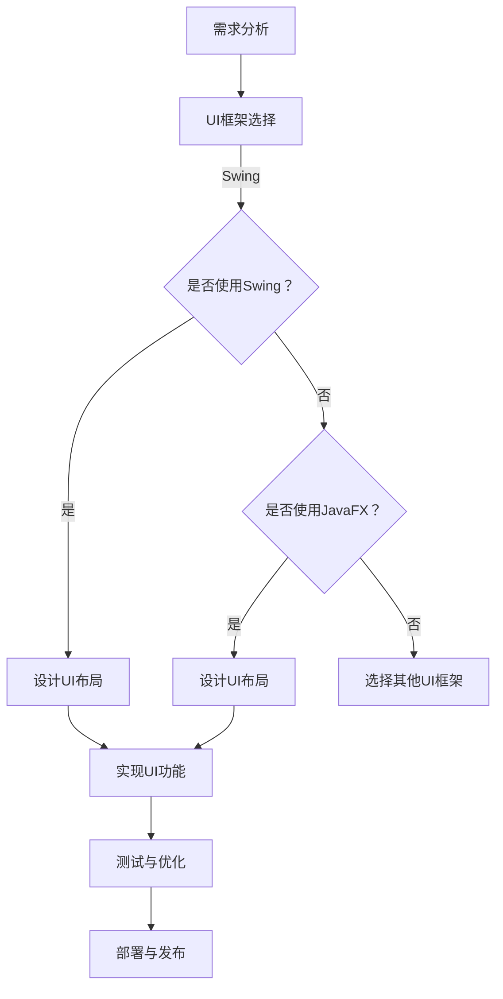

                 

# 基于Java的智能家居设计：自定义智能家居仪表盘的UI设计技巧

> **关键词**：智能家居，Java，UI设计，仪表盘，自定义

> **摘要**：本文将探讨如何使用Java进行智能家居设计，重点介绍自定义仪表盘的UI设计技巧。通过实际案例，我们将详细讲解设计过程，为开发者提供实用的指导。

## 1. 背景介绍

随着物联网（IoT）技术的不断发展，智能家居逐渐成为人们日常生活的一部分。智能家居系统通过连接各种家电和传感器，实现了家庭自动化控制，提高了生活品质。而一个良好的UI设计对于智能家居系统来说至关重要，它不仅决定了用户的使用体验，还直接影响系统的易用性和可扩展性。

Java作为一种成熟、稳定且广泛使用的编程语言，在智能家居系统中有着广泛的应用。通过Java，开发者可以轻松实现复杂的业务逻辑和自定义的UI设计，从而为用户提供丰富的交互体验。

本文将围绕Java在智能家居设计中的应用，详细介绍如何自定义仪表盘的UI设计。我们将从基础概念入手，逐步深入到具体的实现细节，帮助开发者掌握这一技能。

## 2. 核心概念与联系

### 2.1 Java UI框架

在Java中，有许多UI框架可供选择，如Swing、JavaFX等。这些框架为开发者提供了丰富的UI组件和功能，使得自定义UI设计变得相对简单。

- **Swing**：Swing是Java的标准UI框架，提供了大量成熟的UI组件，如按钮、文本框、列表框等。Swing的主要优点是易用性和跨平台性，但其UI样式相对单一，难以实现复杂的自定义效果。

- **JavaFX**：JavaFX是Java的新一代UI框架，提供了丰富的UI组件和动画效果，支持CSS样式和皮肤自定义。JavaFX的主要优点是强大的UI表现力和丰富的功能，但其学习曲线相对较陡峭。

### 2.2 智能家居仪表盘

智能家居仪表盘是智能家居系统的重要组成部分，用于展示各种设备的状态信息。一个优秀的仪表盘应具备以下特点：

- **简洁明了**：仪表盘的界面应简洁明了，让用户一目了然地了解设备状态。
- **可定制性**：用户应根据需要自定义仪表盘的布局和显示内容。
- **实时性**：仪表盘应实时展示设备状态，确保用户及时获取信息。
- **易用性**：仪表盘的操作应简单易用，降低用户的学习成本。

### 2.3 Mermaid 流程图

为了更好地展示智能家居仪表盘的设计过程，我们使用Mermaid流程图来描述关键步骤。



通过上述流程图，我们可以清晰地了解智能家居仪表盘的设计过程，为后续的实现提供指导。

## 3. 核心算法原理 & 具体操作步骤

### 3.1 UI布局设计

仪表盘的UI布局设计是整个项目的核心。在Java中，我们可以使用Swing或JavaFX来实现UI布局。

#### 3.1.1 Swing UI布局

使用Swing进行UI布局设计，通常采用布局管理器（Layout Manager）来实现。常用的布局管理器有FlowLayout、GridLayout和BorderLayout等。

以下是一个简单的Swing UI布局示例：

```java
import javax.swing.*;
import java.awt.*;

public class SwingDashboard {
    public static void main(String[] args) {
        JFrame frame = new JFrame("智能家居仪表盘");
        frame.setSize(800, 600);
        frame.setDefaultCloseOperation(JFrame.EXIT_ON_CLOSE);

        // 使用FlowLayout布局
        JPanel panel = new JPanel(new FlowLayout());
        frame.add(panel);

        // 添加UI组件
        JButton button = new JButton("开关灯");
        JTextField textField = new JTextField("温度：25℃", 10);
        panel.add(button);
        panel.add(textField);

        frame.setVisible(true);
    }
}
```

#### 3.1.2 JavaFX UI布局

使用JavaFX进行UI布局设计，我们可以使用Scene Builder可视化工具来设计UI界面，然后通过FXML文件进行绑定。

以下是一个简单的JavaFX UI布局示例：

```java
import javafx.application.Application;
import javafx.scene.Scene;
import javafx.scene.control.Button;
import javafx.scene.control.Label;
import javafx.scene.layout.VBox;
import javafx.stage.Stage;

public class JavaFXDashboard extends Application {
    public static void main(String[] args) {
        launch(args);
    }

    @Override
    public void start(Stage primaryStage) {
        primaryStage.setTitle("智能家居仪表盘");

        // 创建UI组件
        Button button = new Button("开关灯");
        Label label = new Label("温度：25℃");

        // 创建VBox布局
        VBox vbox = new VBox(button, label);

        // 创建Scene
        Scene scene = new Scene(vbox, 800, 600);

        // 设置Scene
        primaryStage.setScene(scene);

        primaryStage.show();
    }
}
```

### 3.2 UI功能实现

在实现UI功能时，我们需要关注以下几个方面：

- **数据绑定**：将仪表盘的数据与后端业务逻辑进行绑定，实现实时数据展示。
- **事件处理**：为UI组件添加事件处理，实现用户交互。
- **动画效果**：为UI组件添加动画效果，提升用户体验。

以下是一个简单的数据绑定示例：

```java
import javafx.application.Application;
import javafx.beans.property.StringProperty;
import javafx.beans.property.SimpleStringProperty;
import javafx.scene.Scene;
import javafx.scene.control.Label;
import javafx.scene.layout.VBox;
import javafx.stage.Stage;

public class JavaFXDashboard extends Application {
    public static void main(String[] args) {
        launch(args);
    }

    @Override
    public void start(Stage primaryStage) {
        primaryStage.setTitle("智能家居仪表盘");

        // 创建UI组件
        Label temperatureLabel = new Label();

        // 创建StringProperty绑定温度数据
        StringProperty temperatureProperty = new SimpleStringProperty("温度：25℃");
        temperatureLabel.textProperty().bind(temperatureProperty);

        // 创建VBox布局
        VBox vbox = new VBox(temperatureLabel);

        // 创建Scene
        Scene scene = new Scene(vbox, 800, 600);

        // 设置Scene
        primaryStage.setScene(scene);

        // 模拟温度变化
        new Thread(() -> {
            while (true) {
                try {
                    Thread.sleep(1000);
                } catch (InterruptedException e) {
                    e.printStackTrace();
                }
                double temperature = 25 + Math.random() * 15;
                temperatureProperty.set("温度：" + temperature + "℃");
            }
        }).start();

        primaryStage.show();
    }
}
```

## 4. 数学模型和公式 & 详细讲解 & 举例说明

### 4.1 数据绑定公式

在JavaFX中，数据绑定使用以下公式：

```
绑定的文本 = 绑定的属性值
```

例如，在上面的示例中，温度标签的文本与温度属性值进行绑定：

```
temperatureLabel.textProperty().bind(temperatureProperty);
```

### 4.2 动画效果公式

在JavaFX中，动画效果使用以下公式：

```
动画效果 = 时间 * 变化率
```

例如，我们可以创建一个从0到100的线性动画效果：

```
double from = 0;
double to = 100;
double duration = 5000; // 动画持续时间（毫秒）
double changeRate = (to - from) / duration;
```

### 4.3 举例说明

假设我们想要创建一个温度计动画效果，我们可以使用以下代码：

```java
import javafx.animation.Interpolator;
import javafx.animation.KeyFrame;
import javafx.animation.KeyValue;
import javafx.animation.Timeline;
import javafx.application.Application;
import javafx.scene.Scene;
import javafx.scene.control.Label;
import javafx.scene.layout.VBox;
import javafx.stage.Stage;
import javafx.util.Duration;

public class JavaFXDashboard extends Application {
    public static void main(String[] args) {
        launch(args);
    }

    @Override
    public void start(Stage primaryStage) {
        primaryStage.setTitle("智能家居仪表盘");

        // 创建UI组件
        Label temperatureLabel = new Label();

        // 创建StringProperty绑定温度数据
        StringProperty temperatureProperty = new SimpleStringProperty("温度：25℃");
        temperatureLabel.textProperty().bind(temperatureProperty);

        // 创建VBox布局
        VBox vbox = new VBox(temperatureLabel);

        // 创建温度计动画
        Timeline timeline = new Timeline(
                new KeyFrame(Duration.millis(0),
                        new KeyValue(temperatureProperty, "温度：0℃")),
                new KeyFrame(Duration.millis(5000),
                        new KeyValue(temperatureProperty, "温度：50℃")),
                new KeyFrame(Duration.millis(10000),
                        new KeyValue(temperatureProperty, "温度：100℃"))
        );
        timeline.setCycleCount(Timeline.INDEFINITE);
        timeline.play();

        // 创建Scene
        Scene scene = new Scene(vbox, 800, 600);

        // 设置Scene
        primaryStage.setScene(scene);

        primaryStage.show();
    }
}
```

通过上述示例，我们可以看到如何使用JavaFX创建自定义的仪表盘，并实现数据绑定和动画效果。

## 5. 项目实战：代码实际案例和详细解释说明

### 5.1 开发环境搭建

为了实现自定义智能家居仪表盘的UI设计，我们需要搭建以下开发环境：

- **Java JDK**：安装Java开发工具包（JDK），版本要求为8或以上。
- **IDE**：推荐使用IntelliJ IDEA或Eclipse等集成开发环境（IDE）。
- **JavaFX SDK**：下载并安装JavaFX SDK。

### 5.2 源代码详细实现和代码解读

以下是一个简单的JavaFX智能家居仪表盘示例：

```java
import javafx.application.Application;
import javafx.beans.property.DoubleProperty;
import javafx.beans.property.SimpleDoubleProperty;
import javafx.scene.Scene;
import javafx.scene.control.Label;
import javafx.scene.layout.VBox;
import javafx.stage.Stage;
import javafx.util.Duration;

public class JavaFXDashboard extends Application {
    public static void main(String[] args) {
        launch(args);
    }

    @Override
    public void start(Stage primaryStage) {
        primaryStage.setTitle("智能家居仪表盘");

        // 创建UI组件
        Label temperatureLabel = new Label();
        Label humidityLabel = new Label();

        // 创建数据绑定属性
        DoubleProperty temperatureProperty = new SimpleDoubleProperty(25.0);
        DoubleProperty humidityProperty = new SimpleDoubleProperty(60.0);

        // 绑定温度和湿度数据到UI组件
        temperatureLabel.textProperty().bind(temperatureProperty.asString("%.1f℃"));
        humidityLabel.textProperty().bind(humidityProperty.asString("%.1f%"));

        // 创建VBox布局
        VBox vbox = new VBox(temperatureLabel, humidityLabel);

        // 创建Scene
        Scene scene = new Scene(vbox, 800, 600);

        // 设置Scene
        primaryStage.setScene(scene);

        // 模拟温度和湿度变化
        new Thread(() -> {
            while (true) {
                try {
                    Thread.sleep(1000);
                } catch (InterruptedException e) {
                    e.printStackTrace();
                }
                temperatureProperty.set(temperatureProperty.get() + Math.random() * 5 - 2.5);
                humidityProperty.set(humidityProperty.get() + Math.random() * 5 - 2.5);
            }
        }).start();

        primaryStage.show();
    }
}
```

### 5.3 代码解读与分析

#### 5.3.1 主类

`JavaFXDashboard` 类是整个项目的入口。它继承自 `Application` 类，并重写了 `start` 方法，用于初始化UI界面。

#### 5.3.2 UI组件

在 `start` 方法中，我们创建了两个标签组件 `temperatureLabel` 和 `humidityLabel`，分别用于显示温度和湿度信息。

#### 5.3.3 数据绑定

我们创建了两个 `DoubleProperty` 对象 `temperatureProperty` 和 `humidityProperty`，用于绑定温度和湿度数据。通过调用 `asString` 方法，我们可以将数据格式化为字符串，并在UI组件中显示。

#### 5.3.4 布局和Scene

我们使用 `VBox` 布局将UI组件垂直排列，并创建了一个 `Scene` 对象。然后将 `Scene` 对象设置为主窗口的 `Scene`。

#### 5.3.5 模拟数据变化

我们创建了一个新线程，用于模拟温度和湿度的变化。每隔1秒，我们将温度和湿度的值更新为新值，从而实现动态更新UI组件。

## 6. 实际应用场景

### 6.1 家庭自动化

在家庭自动化场景中，智能家居仪表盘可以用于监控和控制各种家电设备，如空调、热水器、灯光等。通过自定义仪表盘的UI设计，用户可以轻松管理家庭设备，提高生活品质。

### 6.2 工业自动化

在工业自动化领域，智能家居仪表盘可以用于监控生产设备的状态，实时显示温度、湿度、压力等参数。通过自定义仪表盘的UI设计，操作人员可以快速了解设备运行状况，提高生产效率。

### 6.3 智慧城市建设

在智慧城市建设中，智能家居仪表盘可以用于监控城市基础设施，如交通流量、环境质量等。通过自定义仪表盘的UI设计，城市管理者和市民可以实时了解城市运行状况，提高城市管理水平。

## 7. 工具和资源推荐

### 7.1 学习资源推荐

- **书籍**：
  - 《JavaFX 8 Developer’s Guide》
  - 《Head First Java》
- **论文**：
  - 《A Survey of Java UI Frameworks》
  - 《JavaFX: Building Rich Internet Applications》
- **博客**：
  - [JavaFX Tips and Tricks](https://javafx-jira-templates.dev.java.net/javaFxTags/tipsAndTricks.html)
  - [JavaFX 8 Tutorial](https://www.oracle.com/java/technologies/javafx/tutorials.html)
- **网站**：
  - [JavaFX API Documentation](https://docs.oracle.com/javafx/2/api/)
  - [JavaFX Scene Builder Documentation](https://gluonhq.com/products/javafxscenebuilder/)

### 7.2 开发工具框架推荐

- **IDE**：
  - IntelliJ IDEA
  - Eclipse
- **UI框架**：
  - JavaFX
  - Swing
- **其他工具**：
  - JavaFX Scene Builder：用于可视化设计UI界面。
  - Maven：用于项目构建和依赖管理。

### 7.3 相关论文著作推荐

- **论文**：
  - 《JavaFX: The Definitive Guide》
  - 《JavaFX 8 by Example》
- **著作**：
  - 《JavaFX 8：开发与设计》
  - 《JavaFX核心技术》

## 8. 总结：未来发展趋势与挑战

随着物联网技术的不断进步，智能家居市场将迎来新的发展机遇。在未来，智能家居仪表盘的UI设计将更加注重用户体验和个性化定制。同时，随着5G网络的普及，实时数据传输和处理能力将大幅提升，为智能家居仪表盘的实时性和互动性提供更多可能性。

然而，智能家居仪表盘的UI设计也面临一些挑战，如兼容性问题、性能优化和安全性问题等。开发者需要不断学习和掌握新技术，以应对这些挑战，为用户提供更好的产品和服务。

## 9. 附录：常见问题与解答

### 9.1 如何选择UI框架？

选择UI框架主要考虑以下几个方面：

- **项目需求**：根据项目需求选择适合的UI框架。如果需要丰富的UI组件和动画效果，建议使用JavaFX；如果需要快速开发且跨平台性要求不高，可以使用Swing。
- **开发团队技能**：根据团队成员的技能和经验选择UI框架。如果团队熟悉JavaFX，那么JavaFX将是更好的选择。
- **性能和兼容性**：考虑UI框架的性能和兼容性。JavaFX在性能和兼容性方面表现较好，但Swing在低端硬件上可能表现更好。

### 9.2 如何优化UI性能？

优化UI性能可以从以下几个方面进行：

- **减少组件数量**：减少UI组件的数量，避免过多组件影响性能。
- **使用缓存**：使用缓存技术，如使用缓冲区图像（BufferedImage）来减少绘制时间。
- **异步加载**：对于大数据量的数据绑定和动画效果，使用异步加载技术，避免阻塞主线程。
- **优化渲染引擎**：使用高性能的渲染引擎，如JavaFX的Scene Builder。

## 10. 扩展阅读 & 参考资料

- **参考文献**：
  - 《JavaFX 8 Developer’s Guide》
  - 《Head First Java》
  - 《A Survey of Java UI Frameworks》
  - 《JavaFX: Building Rich Internet Applications》
- **在线教程**：
  - [JavaFX 8 Tutorial](https://www.oracle.com/java/technologies/javafx/tutorials.html)
  - [JavaFX Scene Builder Documentation](https://gluonhq.com/products/javafxscenebuilder/)
- **技术博客**：
  - [JavaFX Tips and Tricks](https://javafx-jira-templates.dev.java.net/javaFxTags/tipsAndTricks.html)
  - [Java Swing Tutorial](https://docs.oracle.com/javase/tutorial/uiswing/)
- **官方网站**：
  - [JavaFX API Documentation](https://docs.oracle.com/javafx/2/api/)
  - [Java Swing API Documentation](https://docs.oracle.com/javase/8/docs/api/)
- **开源项目**：
  - [JavaFX Scene Builder](https://gluonhq.com/products/javafxscenebuilder/)
  - [JavaFX Scene Builder Extensions](https://github.com/privatization/javafxscenebuilder-extension-templates)

