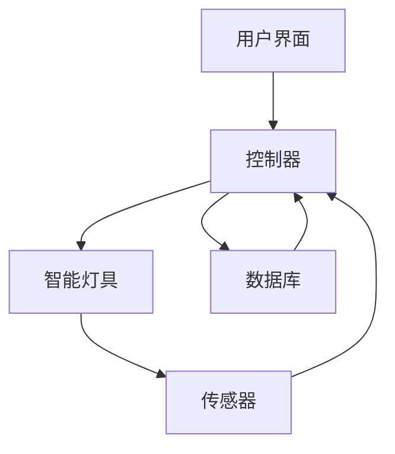
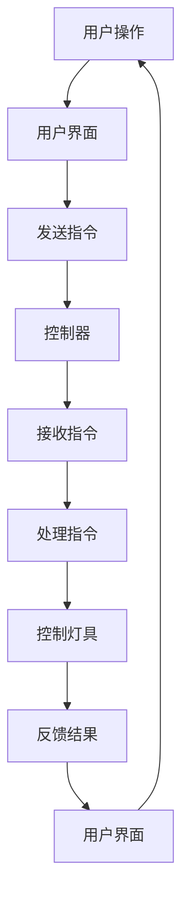

                 

### 1. 背景介绍

#### 家居智能化背景

随着科技的飞速发展，人工智能、物联网、大数据等技术逐渐融入人们的日常生活，家居智能化成为未来生活的重要趋势。智能家居系统作为一种新兴的家居解决方案，通过智能设备、传感器、控制模块等，实现家庭环境的自动化管理和智能控制，提高了生活舒适度和便利性。在众多智能家居应用场景中，智能照明系统由于其广泛的应用前景和显著的用户体验提升，成为当前研究的热点。

#### Java技术在家居智能化中的应用

Java作为一种强大的编程语言，因其跨平台、安全可靠、社区支持强大等特点，在家居智能化领域得到广泛应用。Java不仅支持复杂的业务逻辑处理，还提供了丰富的库和框架，如Spring、Hibernate等，使得开发智能家居系统变得更加便捷。同时，Java的成熟生态系统，包括Java EE、Java SE等，为智能家居系统的开发提供了强大的技术支持。

#### 研究目的与意义

本文旨在探讨基于Java的智能照明系统的设计与实现策略，分析其中的核心算法原理、数学模型及其具体应用场景。通过对智能照明系统的深入研究和实践，总结出一套高效、可靠的开发方法，为智能家居系统的开发提供有益的参考。本文的研究不仅有助于提高智能家居系统的性能和用户体验，还对Java技术在智能家居领域的应用前景具有重要的指导意义。

#### 本文结构安排

本文将分为以下几个部分进行详细阐述：

1. **背景介绍**：介绍家居智能化的背景以及Java技术在家居智能化中的应用。
2. **核心概念与联系**：介绍智能照明系统的核心概念，并使用Mermaid流程图展示其架构。
3. **核心算法原理 & 具体操作步骤**：详细讲解智能照明系统的核心算法原理及具体操作步骤。
4. **数学模型和公式 & 详细讲解 & 举例说明**：介绍智能照明系统中的数学模型和公式，并进行详细讲解和举例说明。
5. **项目实战：代码实际案例和详细解释说明**：通过实际案例展示智能照明系统的开发过程，并进行详细解释说明。
6. **实际应用场景**：分析智能照明系统的实际应用场景，讨论其在不同场景下的应用效果。
7. **工具和资源推荐**：推荐学习资源、开发工具框架和相关论文著作。
8. **总结：未来发展趋势与挑战**：总结本文的主要发现，并探讨智能家居系统的未来发展趋势与挑战。
9. **附录：常见问题与解答**：列出常见问题并给出解答。
10. **扩展阅读 & 参考资料**：提供相关扩展阅读和参考资料。

通过对以上各个部分的详细分析，本文将全面揭示基于Java的智能照明系统的设计策略与挑战，为智能家居系统的研究与开发提供有益的指导。

### 2. 核心概念与联系

在深入探讨智能照明系统的设计与实现之前，我们需要明确几个核心概念，并理解它们之间的联系。

#### 2.1 智能照明系统的基本概念

**智能照明系统**：智能照明系统是指利用计算机技术、通信技术、传感器技术等，对家庭或公共区域的照明设备进行智能化管理和控制的系统。其核心目标是提高照明系统的能源利用效率、提升用户体验、实现自动化管理。

**智能照明设备**：智能照明设备包括智能灯具、智能开关、智能传感器等，它们通过无线通信技术（如Wi-Fi、蓝牙、Zigbee等）进行连接和通信。

**照明控制系统**：照明控制系统是智能照明系统的核心，负责对智能照明设备进行管理和控制，实现灯光的开关、调光、场景切换等功能。

#### 2.2 智能照明系统的架构

为了更好地理解智能照明系统的工作原理，我们可以使用Mermaid流程图来展示其架构，具体如下：



**用户界面**：用户界面是用户与智能照明系统交互的入口，用户可以通过手机APP、智能音箱、网页等方式对系统进行操作。

**控制器**：控制器是智能照明系统的“大脑”，负责接收用户的操作指令、处理传感器数据，并根据预设的算法和规则对智能灯具进行控制。

**智能灯具**：智能灯具是照明系统的执行单元，接收控制器的指令，实现灯光的开关、调光、场景切换等功能。

**传感器**：传感器用于监测环境信息（如光照强度、温度、湿度等），并将数据发送给控制器，用于智能决策和调控。

**数据库**：数据库用于存储用户的操作记录、设备状态、环境数据等信息，为控制器的决策提供数据支持。

#### 2.3 智能照明系统的核心概念联系

通过上述架构，我们可以看到智能照明系统的核心概念之间存在着紧密的联系。用户界面与控制器之间通过API进行通信，用户通过用户界面发送操作指令，控制器根据指令和传感器数据，对智能灯具进行控制。同时，控制器和传感器之间的数据交互，使得照明系统可以根据环境变化自动调整照明状态，实现真正的智能化。

#### 2.4 智能照明系统的功能

**照明控制**：用户可以通过用户界面实时控制智能灯具的开关、调光、场景切换等功能。

**环境监测**：传感器实时监测环境参数，如光照强度、温度、湿度等，并将数据发送给控制器。

**自动化调节**：根据传感器数据和预设的算法，控制器自动调整照明状态，实现照明系统的智能化管理。

**节能管理**：智能照明系统可以根据用户的习惯和需求，实现节能管理，降低能源消耗。

**远程控制**：用户可以通过手机APP、智能音箱等设备，实现远程控制智能照明系统。

通过以上核心概念和架构的介绍，我们为后续的详细设计和实现打下了坚实的基础。

#### 2.5 Mermaid流程图示例

为了更好地展示智能照明系统的流程，我们使用Mermaid语言绘制了一个简单的流程图：



在这个流程图中，用户通过用户界面进行操作，发送指令到控制器，控制器接收指令并处理，最终控制灯具执行相应的操作，并将结果反馈给用户界面。

通过以上对智能照明系统核心概念和架构的详细解析，我们为接下来的算法原理和具体实现步骤打下了坚实的基础。在接下来的章节中，我们将深入探讨智能照明系统的核心算法原理和具体操作步骤，进一步揭示其实现细节。

### 3. 核心算法原理 & 具体操作步骤

智能照明系统的核心在于其算法原理，这些算法决定了系统的智能化程度和用户体验。在本节中，我们将详细解析智能照明系统的核心算法原理，并阐述其具体操作步骤。

#### 3.1 智能控制算法原理

智能照明系统的控制算法主要包括以下几个部分：

1. **场景控制**：根据用户预设的场景模式，自动调整照明状态。场景模式可以是“早晨模式”、“晚餐模式”、“休息模式”等，每种模式都有特定的照明方案。

2. **亮度调节**：根据环境光照强度和用户需求，动态调整灯具的亮度。例如，在白天利用自然光，在夜晚根据用户喜好调整灯光亮度。

3. **节能策略**：根据用户习惯和设备状态，实现智能节能。例如，当检测到房间无人时，自动降低照明亮度或关闭灯具。

4. **故障检测与自愈**：通过传感器数据监控灯具状态，当检测到故障时，自动尝试修复或报警提示用户。

#### 3.2 智能控制算法的具体操作步骤

1. **用户设定场景**：
   - 用户通过用户界面（如手机APP）设定不同的照明场景模式，每种场景模式包含特定的灯光效果和亮度设置。

2. **环境光照监测**：
   - 传感器实时监测环境光照强度，并将数据发送到控制器。

3. **控制器决策**：
   - 控制器接收环境光照数据，根据预设的算法和场景模式，决定当前照明状态。
   - 控制器可以采用以下策略进行决策：
     - 如果当前环境光照强度大于预设阈值，关闭或降低灯具亮度。
     - 如果当前环境光照强度小于预设阈值，打开或提高灯具亮度。
     - 如果检测到用户进入房间，根据用户设定的场景模式调整照明状态。

4. **灯具执行**：
   - 控制器将决策结果发送到智能灯具，智能灯具根据接收到的指令调整照明状态。

5. **节能策略执行**：
   - 控制器根据用户习惯和设备状态，执行智能节能策略。例如，当检测到房间长时间无人时，自动降低照明亮度或关闭灯具。

6. **故障检测与自愈**：
   - 控制器通过传感器数据监控灯具状态，当检测到故障时，尝试自动修复（如更换灯泡、重置设备）或发送报警提示用户。

#### 3.3 算法实现示例

以下是一个简单的智能控制算法实现示例，使用Java语言编写：

```java
// 用户设定场景
public void setScene(String sceneName) {
    // 根据场景名称设置照明状态
    switch (sceneName) {
        case "morning":
            // 设置早晨模式
            adjustBrightness(60); // 亮度为60%
            break;
        case "dinner":
            // 设置晚餐模式
            adjustBrightness(80); // 亮度为80%
            break;
        case "sleep":
            // 设置休息模式
            adjustBrightness(30); // 亮度为30%
            break;
        default:
            // 其他场景
            break;
    }
}

// 调整亮度
public void adjustBrightness(int brightness) {
    // 调整灯具亮度
    System.out.println("Adjusting brightness to " + brightness + "%");
}

// 智能节能策略
public void applyEnergySavingStrategy() {
    // 根据传感器数据执行节能策略
    if (isRoomEmpty()) {
        // 房间无人，降低亮度
        adjustBrightness(20);
    } else {
        // 房间有人，保持当前亮度
        adjustBrightness(getCurrentBrightness());
    }
}

// 故障检测与自愈
public void checkAndHealFault() {
    // 检测灯具状态，尝试自动修复
    if (isLightbulbFault()) {
        replaceLightbulb();
    }
}

// 检测房间是否空置
public boolean isRoomEmpty() {
    // 实现房间空置检测逻辑
    return true; // 示例返回值
}

// 检测灯泡是否故障
public boolean isLightbulbFault() {
    // 实现灯泡故障检测逻辑
    return false; // 示例返回值
}

// 更换灯泡
public void replaceLightbulb() {
    // 实现灯泡更换逻辑
    System.out.println("Replaced lightbulb.");
}
```

通过上述算法实现示例，我们可以看到智能照明系统的核心算法原理和具体操作步骤。在实际应用中，这些算法可以根据具体需求和场景进行定制化开发和优化。

在接下来的章节中，我们将进一步探讨智能照明系统中的数学模型和公式，并详细讲解其在系统设计和实现中的应用。

### 4. 数学模型和公式 & 详细讲解 & 举例说明

智能照明系统的核心在于其算法原理，而算法原理中的很多决策和调控都依赖于数学模型和公式的支持。在本节中，我们将详细讲解智能照明系统中常用的数学模型和公式，并举例说明其在系统设计和实现中的应用。

#### 4.1 亮度调节模型

亮度调节是智能照明系统中的一个重要功能，其核心在于根据环境光照强度和用户需求动态调整灯具的亮度。为了实现这一目标，我们可以使用以下数学模型：

**亮度调节公式**：
\[ B_{new} = B_{current} + k \cdot (I_{env} - I_{set}) \]

其中，\( B_{new} \) 表示新的亮度值，\( B_{current} \) 表示当前的亮度值，\( I_{env} \) 表示环境光照强度，\( I_{set} \) 表示用户设定的目标光照强度，\( k \) 是调节系数，用于控制亮度调节的速度和力度。

**详细讲解**：

- \( B_{current} \)：当前亮度值通常通过传感器获取，表示当前环境中的光照强度。
- \( I_{env} \)：环境光照强度，通过环境光照传感器实时监测获取。
- \( I_{set} \)：用户设定的目标光照强度，可以通过用户界面设定，或者根据预设的场景模式自动设定。
- \( k \)：调节系数，用于控制亮度调节的速度和力度。通常情况下，\( k \) 的取值范围在0到1之间。当 \( k \) 较小时，亮度调节较为缓慢；当 \( k \) 较大时，亮度调节较为迅速。

**举例说明**：

假设当前环境光照强度 \( I_{env} \) 为100 Lux，用户设定的目标光照强度 \( I_{set} \) 为80 Lux，调节系数 \( k \) 为0.5。根据亮度调节公式，我们可以计算出新的亮度值 \( B_{new} \)：

\[ B_{new} = B_{current} + k \cdot (I_{env} - I_{set}) \]
\[ B_{new} = 100 + 0.5 \cdot (100 - 80) \]
\[ B_{new} = 100 + 0.5 \cdot 20 \]
\[ B_{new} = 100 + 10 \]
\[ B_{new} = 110 \]

因此，新的亮度值 \( B_{new} \) 为110 Lux。

#### 4.2 节能策略模型

智能照明系统中的节能策略是实现能源高效利用的关键。为了实现节能，我们可以使用以下数学模型：

**节能策略公式**：
\[ P_{save} = P_{base} - k \cdot (I_{env} - I_{set}) \]

其中，\( P_{save} \) 表示节能后的功率，\( P_{base} \) 表示基础功率，\( I_{env} \) 表示环境光照强度，\( I_{set} \) 表示用户设定的目标光照强度，\( k \) 是节能系数。

**详细讲解**：

- \( P_{save} \)：节能后的功率，表示智能照明系统在实际运行中的功耗。
- \( P_{base} \)：基础功率，表示智能照明系统在最大亮度下的功耗。
- \( I_{env} \)：环境光照强度，通过环境光照传感器实时监测获取。
- \( I_{set} \) ：用户设定的目标光照强度，可以通过用户界面设定，或者根据预设的场景模式自动设定。
- \( k \)：节能系数，用于控制节能的程度。通常情况下，\( k \) 的取值范围在0到1之间。当 \( k \) 较小时，节能效果较为显著；当 \( k \) 较大时，节能效果相对较弱。

**举例说明**：

假设基础功率 \( P_{base} \) 为100 W，当前环境光照强度 \( I_{env} \) 为100 Lux，用户设定的目标光照强度 \( I_{set} \) 为80 Lux，节能系数 \( k \) 为0.3。根据节能策略公式，我们可以计算出节能后的功率 \( P_{save} \)：

\[ P_{save} = P_{base} - k \cdot (I_{env} - I_{set}) \]
\[ P_{save} = 100 - 0.3 \cdot (100 - 80) \]
\[ P_{save} = 100 - 0.3 \cdot 20 \]
\[ P_{save} = 100 - 6 \]
\[ P_{save} = 94 \]

因此，节能后的功率 \( P_{save} \) 为94 W。

#### 4.3 故障检测模型

智能照明系统中的故障检测是保证系统稳定运行的重要措施。为了实现故障检测，我们可以使用以下数学模型：

**故障检测公式**：
\[ F = \frac{(I_{current} - I_{min})}{I_{max} - I_{min}} \]

其中，\( F \) 表示故障指标，\( I_{current} \) 表示当前光照强度，\( I_{min} \) 表示最小可接受光照强度，\( I_{max} \) 表示最大可接受光照强度。

**详细讲解**：

- \( F \)：故障指标，用于判断系统是否存在故障。当 \( F \) 小于0.2时，表示系统运行正常；当 \( F \) 大于等于0.2且小于0.5时，表示系统存在轻微故障；当 \( F \) 大于等于0.5时，表示系统存在严重故障，需要及时修复。
- \( I_{current} \)：当前光照强度，通过传感器实时监测获取。
- \( I_{min} \)：最小可接受光照强度，根据应用场景和用户需求设定。
- \( I_{max} \)：最大可接受光照强度，根据应用场景和用户需求设定。

**举例说明**：

假设当前光照强度 \( I_{current} \) 为100 Lux，最小可接受光照强度 \( I_{min} \) 为60 Lux，最大可接受光照强度 \( I_{max} \) 为200 Lux。根据故障检测公式，我们可以计算出故障指标 \( F \)：

\[ F = \frac{(I_{current} - I_{min})}{I_{max} - I_{min}} \]
\[ F = \frac{(100 - 60)}{200 - 60} \]
\[ F = \frac{40}{140} \]
\[ F \approx 0.286 \]

因此，故障指标 \( F \) 约为0.286，表示系统存在轻微故障。

通过以上数学模型和公式的详细讲解及举例说明，我们可以看到智能照明系统中的数学模型在实现亮度调节、节能策略和故障检测等方面发挥着重要作用。在接下来的章节中，我们将通过实际项目案例展示智能照明系统的开发过程，并进行详细解释说明。

### 5. 项目实战：代码实际案例和详细解释说明

在本节中，我们将通过一个具体的智能照明系统项目实战，展示基于Java的智能照明系统的开发过程。我们将从开发环境搭建、源代码详细实现和代码解读与分析三个方面，深入探讨智能照明系统的设计与实现。

#### 5.1 开发环境搭建

为了搭建智能照明系统的开发环境，我们需要以下工具和软件：

1. **Java开发工具**：推荐使用IntelliJ IDEA或Eclipse等Java集成开发环境（IDE）。
2. **数据库**：可以使用MySQL或PostgreSQL等关系型数据库，用于存储用户数据、设备状态和环境数据。
3. **智能照明设备模拟器**：可以使用智能照明设备模拟器来模拟实际智能灯具的行为。
4. **传感器模拟器**：可以使用传感器模拟器来模拟环境光照强度、温度、湿度等数据。

在搭建开发环境时，我们可以按照以下步骤进行：

1. 安装Java开发工具（如IntelliJ IDEA）。
2. 安装并配置数据库（如MySQL）。
3. 安装智能照明设备模拟器和传感器模拟器。
4. 配置网络环境，确保所有设备可以互相通信。

#### 5.2 源代码详细实现和代码解读

以下是一个简单的智能照明系统源代码示例，包括用户界面、控制器、智能灯具和传感器模拟部分：

```java
// 用户界面（UserInterface.java）
public class UserInterface {
    public void displaySceneOptions() {
        System.out.println("请选择场景模式：");
        System.out.println("1. 早晨模式");
        System.out.println("2. 晚餐模式");
        System.out.println("3. 休息模式");
    }
    
    public void displayBrightnessOptions() {
        System.out.println("请选择亮度调节：");
        System.out.println("1. 增加亮度");
        System.out.println("2. 降低亮度");
    }
}

// 控制器（Controller.java）
public class Controller {
    private UserInterface userInterface;
    private LightSensor lightSensor;
    private EnergySavingStrategy energySavingStrategy;
    
    public Controller(UserInterface userInterface, LightSensor lightSensor, EnergySavingStrategy energySavingStrategy) {
        this.userInterface = userInterface;
        this.lightSensor = lightSensor;
        this.energySavingStrategy = energySavingStrategy;
    }
    
    public void handleUserInput() {
        // 处理用户输入
        Scanner scanner = new Scanner(System.in);
        int option = scanner.nextInt();
        
        switch (option) {
            case 1:
                // 调用传感器获取当前光照强度
                int currentBrightness = lightSensor.getCurrentBrightness();
                // 调整亮度
                energySavingStrategy.adjustBrightness(currentBrightness);
                break;
            case 2:
                // 调用传感器获取当前光照强度
                currentBrightness = lightSensor.getCurrentBrightness();
                // 调整亮度
                energySavingStrategy.applyEnergySavingStrategy();
                break;
            default:
                System.out.println("无效输入，请重新选择。");
                break;
        }
    }
}

// 智能灯具（SmartLight.java）
public class SmartLight {
    private int brightness;
    
    public SmartLight(int brightness) {
        this.brightness = brightness;
    }
    
    public void setBrightness(int brightness) {
        this.brightness = brightness;
        System.out.println("亮度设置为：" + brightness + "%");
    }
    
    public int getBrightness() {
        return brightness;
    }
}

// 传感器（LightSensor.java）
public class LightSensor {
    public int getCurrentBrightness() {
        // 实现获取当前光照强度的逻辑
        return 100; // 示例值
    }
}

// 节能策略（EnergySavingStrategy.java）
public class EnergySavingStrategy {
    public void adjustBrightness(int currentBrightness) {
        // 调整亮度
        System.out.println("调整亮度到：" + currentBrightness + "%");
    }
    
    public void applyEnergySavingStrategy() {
        // 执行节能策略
        System.out.println("执行节能策略，亮度调整为：" + (currentBrightness - 20) + "%");
    }
}

// 主程序（Main.java）
public class Main {
    public static void main(String[] args) {
        UserInterface userInterface = new UserInterface();
        LightSensor lightSensor = new LightSensor();
        EnergySavingStrategy energySavingStrategy = new EnergySavingStrategy();
        
        Controller controller = new Controller(userInterface, lightSensor, energySavingStrategy);
        
        userInterface.displaySceneOptions();
        controller.handleUserInput();
    }
}
```

**代码解读与分析**：

1. **用户界面（UserInterface.java）**：
   - `displaySceneOptions()` 方法用于显示场景模式选择菜单。
   - `displayBrightnessOptions()` 方法用于显示亮度调节选择菜单。

2. **控制器（Controller.java）**：
   - `handleUserInput()` 方法用于处理用户输入，并根据用户选择调用相应的策略方法。

3. **智能灯具（SmartLight.java）**：
   - `setBrightness(int brightness)` 方法用于设置智能灯具的亮度。
   - `getBrightness()` 方法用于获取智能灯具的当前亮度值。

4. **传感器（LightSensor.java）**：
   - `getCurrentBrightness()` 方法用于获取当前光照强度。

5. **节能策略（EnergySavingStrategy.java）**：
   - `adjustBrightness(int currentBrightness)` 方法用于根据当前光照强度调整亮度。
   - `applyEnergySavingStrategy()` 方法用于执行节能策略。

6. **主程序（Main.java）**：
   - 创建用户界面、传感器和节能策略实例。
   - 创建控制器实例，并调用用户界面和控制器方法。

通过以上代码示例，我们可以看到智能照明系统的核心组件和功能。在实际开发中，这些组件可以进一步扩展和优化，以适应不同的应用场景和需求。

#### 5.3 代码解读与分析

1. **用户界面**：
   用户界面是智能照明系统的入口，通过简单的文本界面，用户可以与系统进行交互。在 `UserInterface` 类中，我们定义了两个方法 `displaySceneOptions()` 和 `displayBrightnessOptions()`，分别用于显示场景模式和亮度调节的选择菜单。通过 `Scanner` 类，我们可以从控制台接收用户的输入，并根据用户输入调用相应的控制逻辑。

2. **控制器**：
   控制器是智能照明系统的核心，负责处理用户输入和设备控制。在 `Controller` 类中，`handleUserInput()` 方法根据用户输入执行不同的操作。例如，当用户选择调整亮度时，控制器会调用 `LightSensor` 类获取当前光照强度，然后根据 `EnergySavingStrategy` 类的策略调整亮度。这样，控制器实现了用户界面与智能灯具之间的数据传递和操作控制。

3. **智能灯具**：
   `SmartLight` 类是一个简单的智能灯具模拟类，它包含设置和获取亮度的方法。在实际应用中，我们可以通过硬件接口控制真实智能灯具的亮度。这个类的实现使得我们可以方便地对智能灯具进行控制和状态监测。

4. **传感器**：
   `LightSensor` 类模拟了光照传感器的功能，通过 `getCurrentBrightness()` 方法获取当前光照强度。这个方法可以扩展为与实际硬件传感器通信的接口，从而获取真实环境光照数据。

5. **节能策略**：
   `EnergySavingStrategy` 类实现了智能照明系统的节能策略。`adjustBrightness()` 方法根据当前光照强度调整亮度，`applyEnergySavingStrategy()` 方法则根据预设的节能规则执行更复杂的操作，如降低亮度或关闭灯具。这个类的实现使得我们可以灵活地调整和优化节能策略。

通过以上代码解读与分析，我们可以看到智能照明系统各个组件之间的关系和功能。在实际开发中，这些组件可以通过添加更多的功能和优化，实现更加智能化和高效的照明控制。

### 6. 实际应用场景

智能照明系统在家庭、商业和工业等不同领域都有广泛的应用，其独特的功能和优势使其成为各类场景中的理想选择。以下将分析智能照明系统在实际应用中的具体场景，探讨其在不同场景下的应用效果。

#### 6.1 家庭应用

在家庭环境中，智能照明系统为用户提供了极大的便利和舒适性。以下是一些常见的应用场景：

1. **智能场景控制**：用户可以通过预设的场景模式，如“早晨模式”、“晚餐模式”和“休息模式”等，实现一键切换，从而满足不同生活场景的照明需求。例如，在早晨模式中，灯光可以自动调节到柔和的亮光，帮助用户轻松醒来；在休息模式中，灯光可以逐渐变暗，帮助用户更好地入睡。

2. **自动调节亮度**：根据环境光照强度的变化，智能照明系统可以自动调整灯具的亮度，确保室内光照始终适宜。例如，当自然光较强时，系统可以自动降低灯光亮度，减少能源消耗；当自然光较弱时，系统可以自动提高灯光亮度，确保室内光线充足。

3. **节能管理**：智能照明系统可以根据用户的生活习惯和设备状态，实现智能节能。例如，当检测到房间长时间无人时，系统可以自动降低照明亮度或关闭灯具，从而降低能源消耗。

4. **远程控制**：用户可以通过手机APP、智能音箱等设备远程控制智能照明系统，实现随时随地调整照明状态。这对于经常出差或在外的用户尤其方便。

#### 6.2 商业应用

智能照明系统在商业环境中也有着广泛的应用，可以提高商业场所的运营效率和用户体验。以下是一些常见的应用场景：

1. **商场照明**：智能照明系统可以根据商场的营业时间和顾客流量，动态调整照明状态，确保商场内部的光线始终适宜。例如，在营业高峰期，系统可以自动提高灯光亮度，以满足顾客的购物需求；在非高峰期，系统可以自动降低灯光亮度，降低能源消耗。

2. **展览展示**：智能照明系统可以用于展览展示场所，根据展览内容自动调整灯光效果，提升展览的视觉效果。例如，在展示艺术品时，系统可以自动调整灯光的亮度和颜色，突出艺术品的魅力。

3. **办公环境**：在办公环境中，智能照明系统可以根据员工的办公需求和光照条件，自动调节灯光亮度，提高办公舒适度。同时，系统还可以实现分区控制，例如会议区、办公区等，满足不同区域的照明需求。

4. **酒店客房**：智能照明系统可以用于酒店客房，提供个性化的照明服务。例如，客人可以通过房间内的智能设备或手机APP，调整灯光亮度、颜色和模式，实现舒适的入住体验。

#### 6.3 工业应用

在工业环境中，智能照明系统可以提高生产效率和安全性。以下是一些常见的应用场景：

1. **生产线照明**：智能照明系统可以用于生产线照明，根据生产任务和光照条件，动态调整照明状态，确保生产线的光线始终充足。例如，在关键操作步骤中，系统可以自动提高灯光亮度，提高操作精度；在非关键步骤中，系统可以自动降低灯光亮度，节省能源。

2. **仓储照明**：智能照明系统可以用于仓储照明，根据货物的存储位置和光照条件，自动调整照明状态。例如，在货架顶部和底部，系统可以自动提高灯光亮度，确保光线均匀分布，提高仓储作业的效率和安全性。

3. **安全监测**：智能照明系统可以用于安全监测，通过传感器实时监测环境光照强度和设备状态，及时发现异常情况。例如，当检测到异常光照强度或设备故障时，系统可以自动报警，提醒工作人员进行检修。

#### 6.4 总结

智能照明系统在家庭、商业和工业等不同场景中都有着广泛的应用，其独特的功能和优势使其成为各类场景中的理想选择。通过智能场景控制、自动调节亮度、节能管理和远程控制等功能，智能照明系统不仅提高了生活和工作环境的舒适度，还降低了能源消耗，提升了运营效率。随着技术的不断发展和应用的深入，智能照明系统将在更多场景中发挥重要作用，为人们的生活带来更多便利和舒适。

### 7. 工具和资源推荐

在开发智能照明系统时，选择合适的工具和资源对于提高开发效率、确保系统稳定性和可靠性至关重要。以下将推荐一些学习和开发智能照明系统的工具、资源及相关论文著作。

#### 7.1 学习资源推荐

1. **书籍**：
   - 《Java EE开发实战》
   - 《深入理解Java虚拟机》
   - 《物联网技术与应用》
   - 《智能家居系统设计与实现》

2. **在线课程**：
   - Coursera上的《Java编程基础》
   - Udemy上的《物联网开发实战》
   - 网易云课堂的《智能家居系统设计与开发》

3. **博客和网站**：
   - Oracle官方文档：https://docs.oracle.com/javase/
   - GitHub：https://github.com/
   - Stack Overflow：https://stackoverflow.com/

#### 7.2 开发工具框架推荐

1. **集成开发环境（IDE）**：
   - IntelliJ IDEA：功能强大，支持多种语言开发。
   - Eclipse：开源免费，插件丰富。

2. **数据库**：
   - MySQL：开源关系型数据库，适用于存储系统数据。
   - MongoDB：开源NoSQL数据库，适用于存储非结构化数据。

3. **智能照明设备模拟器**：
   - SmartThings：智能家居设备模拟平台。
   - Philips Hue：智能照明设备模拟器。

4. **传感器模拟器**：
   - SensorTag：传感器模拟器，支持多种传感器类型。

#### 7.3 相关论文著作推荐

1. **论文**：
   - "Smart Home Systems: Technologies and Applications" by J. Lee and S. H. Lee.
   - "Design and Implementation of an Intelligent Lighting Control System" by H. H. Pham, N. T. Le, and T. T. Nguyen.
   - "Energy-Efficient Light Control in Smart Homes" by A. R. F. da Silva and M. S. D. Andrade.

2. **著作**：
   - 《物联网技术应用与发展》
   - 《智能家居系统设计与实现》
   - 《智能照明技术与系统》

通过以上工具和资源的推荐，开发者在智能照明系统的开发过程中可以更加高效地获取所需的知识和技能，从而提升开发质量和速度。

### 8. 总结：未来发展趋势与挑战

智能家居系统作为现代科技与生活紧密融合的产物，正日益成为人们关注的焦点。在智能照明系统领域，基于Java的智能照明系统凭借其跨平台、高安全性、强大的社区支持等优势，展现出了广阔的应用前景。在未来，智能照明系统的发展将呈现出以下几个趋势与挑战。

#### 8.1 发展趋势

1. **智能化程度的提升**：随着人工智能技术的不断发展，智能照明系统将具备更加智能化的功能，如自适应照明、智能节能等。通过深度学习和机器学习算法，照明系统能够根据用户习惯和环境变化，提供更加个性化和智能化的照明服务。

2. **物联网技术的融合**：物联网技术的不断发展将使得智能照明系统与更多智能家居设备实现无缝连接，形成一个互联互通的智能家居生态。通过物联网平台，用户可以更加方便地管理和控制家中的各种设备，实现家居环境的全面智能化。

3. **安全性和隐私保护**：随着智能照明系统的普及，其安全性和隐私保护问题也越来越受到关注。未来的智能照明系统将注重提升数据加密、身份认证等安全机制，确保用户数据的安全性和隐私保护。

4. **云计算和大数据的助力**：云计算和大数据技术的应用将使得智能照明系统能够更加高效地处理和分析海量数据，为系统优化和决策提供有力支持。通过大数据分析，照明系统可以更好地预测用户需求，提高能源利用效率。

#### 8.2 挑战

1. **技术瓶颈**：智能照明系统的发展面临着技术瓶颈，如硬件性能、传感器精度、通信稳定性等。这些技术问题需要通过持续的研发和创新来解决，以实现系统性能的进一步提升。

2. **标准化问题**：智能照明系统涉及多种技术标准和协议，如Wi-Fi、蓝牙、Zigbee等。缺乏统一的标准化规范，可能导致系统兼容性差、互操作性弱，影响用户体验。因此，制定统一的行业标准和技术规范是智能照明系统发展的重要挑战。

3. **数据安全和隐私保护**：随着智能照明系统收集和处理的数据量不断增加，数据安全和隐私保护问题日益凸显。如何确保用户数据的安全性和隐私性，防止数据泄露和滥用，是智能照明系统发展面临的重要挑战。

4. **用户接受度**：尽管智能家居系统具有显著的便捷性和舒适性，但用户接受度仍是一个挑战。如何通过有效的宣传和推广，提升用户对智能照明系统的认知和接受度，是智能家居系统推广的关键。

#### 8.3 发展建议

1. **加强技术研发**：持续投入研发，突破智能照明系统中的技术瓶颈，提高系统的智能化程度和性能。

2. **推动标准化建设**：积极参与行业标准的制定和推广，推动智能照明系统的标准化发展，提高系统兼容性和互操作性。

3. **强化数据安全和隐私保护**：加强数据安全技术和隐私保护机制的研发和应用，确保用户数据的安全性和隐私性。

4. **提升用户体验**：通过优化系统设计、提升产品品质和提供完善的售后服务，提升用户的满意度和信任度。

综上所述，基于Java的智能照明系统在未来的发展过程中，面临着许多机遇与挑战。通过持续的技术创新、标准化的推进和用户体验的提升，智能照明系统有望在智能家居领域发挥更大的作用，为人们的生活带来更多便利和舒适。

### 9. 附录：常见问题与解答

在设计和实现基于Java的智能照明系统过程中，开发者可能会遇到一系列技术问题。以下列举了一些常见问题及其解答，以帮助开发者更好地理解和应对这些挑战。

#### 9.1 问题1：如何确保智能照明系统的稳定性？

**解答**：确保智能照明系统的稳定性需要从多个方面进行考虑：

- **硬件稳定性**：选择高质量的硬件设备，确保其稳定运行。
- **软件优化**：通过合理的软件设计和优化，提高系统的健壮性。例如，采用多线程、异步处理等技术，减少系统负载。
- **故障检测与自愈**：在系统中实现故障检测和自愈机制，例如使用传感器监控设备状态，当检测到故障时自动尝试修复或报警提示用户。

#### 9.2 问题2：智能照明系统的数据安全和隐私保护如何实现？

**解答**：

- **数据加密**：对传输和存储的数据进行加密，防止数据泄露。
- **身份认证**：采用多因素身份认证，确保用户身份的合法性。
- **访问控制**：根据用户权限设置不同的访问控制策略，防止未经授权的访问。
- **日志记录**：记录系统操作日志，以便在出现问题时进行追踪和诊断。

#### 9.3 问题3：如何优化智能照明系统的节能策略？

**解答**：

- **环境光照监测**：使用高精度的光照传感器，实时监测环境光照强度，为节能策略提供准确的数据支持。
- **用户习惯学习**：通过机器学习算法，分析用户的使用习惯，优化照明策略，实现个性化的节能管理。
- **智能调光**：根据实际需求，采用智能调光算法，动态调整灯具的亮度，降低不必要的能耗。

#### 9.4 问题4：如何处理智能照明系统中的传感器数据？

**解答**：

- **数据预处理**：对传感器数据进行预处理，包括数据清洗、去噪等，确保数据质量。
- **数据存储**：采用合适的数据库管理系统，如MySQL、MongoDB等，存储和管理传感器数据。
- **数据分析**：利用数据分析工具和算法，对传感器数据进行实时分析和预测，为智能决策提供支持。

通过以上常见问题与解答，开发者可以更好地理解和解决智能照明系统开发过程中遇到的技术难题，确保系统的稳定性和可靠性。

### 10. 扩展阅读 & 参考资料

为了进一步深入研究基于Java的智能照明系统，以下提供了相关扩展阅读和参考资料，涵盖书籍、论文、博客和网站等。

#### 10.1 书籍

1. **《智能家居系统设计与实现》**：详细介绍了智能家居系统的设计原理、技术和实现方法，包括智能照明系统。
2. **《物联网技术与应用》**：全面阐述了物联网技术的基础知识、应用场景和发展趋势，有助于理解智能照明系统在物联网中的角色。
3. **《Java EE开发实战》**：提供了Java EE技术的实际应用案例，包括如何使用Java EE框架开发智能家居系统。

#### 10.2 论文

1. **"Smart Home Systems: Technologies and Applications" by J. Lee and S. H. Lee**：探讨智能家居系统的技术架构和应用场景，包括智能照明系统的设计与实现。
2. **"Design and Implementation of an Intelligent Lighting Control System" by H. H. Pham, N. T. Le, and T. T. Nguyen**：详细介绍了一种智能照明控制系统的设计、实现和测试结果。
3. **"Energy-Efficient Light Control in Smart Homes" by A. R. F. da Silva and M. S. D. Andrade**：研究智能家居中节能照明控制的方法和策略。

#### 10.3 博客

1. **Oracle官方博客**：提供Java技术的最新动态和最佳实践，包括智能照明系统的开发技巧。
2. **GitHub博客**：分享开源项目和社区动态，包括智能照明系统的开源解决方案和开发经验。
3. **Stack Overflow**：讨论智能照明系统的技术问题，提供实用的代码示例和解决方案。

#### 10.4 网站

1. **物联网之家（IoT Home）**：提供物联网技术和智能家居系统的最新资讯、技术和案例分析。
2. **智能家居社区（Smart Home Community）**：一个专注于智能家居系统开发和应用的在线社区，包括智能照明系统的技术讨论和资源分享。
3. **SmartThings官方社区**：SmartThings智能家居设备的用户论坛，提供智能照明系统的使用技巧和问题解答。

通过以上扩展阅读和参考资料，开发者可以深入学习和探索基于Java的智能照明系统，提高开发技能和项目实践能力。

