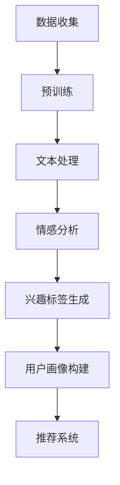

                 

### 背景介绍

随着互联网技术的飞速发展，在线信息爆炸式增长，推荐系统在电子商务、社交媒体、视频平台等多个领域得到了广泛应用。传统的推荐系统主要依赖于用户历史行为、内容特征等信息，通过协同过滤、基于内容的推荐等方法进行用户偏好预测。然而，这些方法在处理用户个性化需求和大规模数据时存在一定的局限性。

近年来，随着深度学习技术的不断发展，基于深度学习的推荐系统逐渐崭露头角。尤其是生成式对抗网络（GAN）、变分自编码器（VAE）等生成模型的引入，使得推荐系统能够更好地捕捉用户的潜在兴趣和偏好。然而，深度学习模型在训练过程中需要大量的数据和计算资源，且对数据质量和特征工程的要求较高。

为了解决这些问题，大规模语言模型（Large Language Model，LLM）被引入到推荐系统中。LLM是一种基于神经网络的语言生成模型，通过大量文本数据进行预训练，能够生成具有良好语义理解和语言表达能力的文本。LLM的引入为推荐系统提供了新的思路和工具，使得用户画像的精细化成为可能。

本文将围绕基于LLM的推荐系统用户画像精细化展开讨论，首先介绍LLM的基本概念和原理，然后分析LLM在用户画像构建中的应用，最后探讨未来发展趋势和挑战。

### 文章关键词

- 推荐系统
- 用户画像
- 大规模语言模型
- 深度学习
- 潜在兴趣
- 个性化推荐

### 文章摘要

本文首先介绍了推荐系统的背景和发展现状，分析了传统推荐方法的局限性。随后，本文重点探讨了大规模语言模型（LLM）的基本概念和原理，以及LLM在用户画像构建中的应用。通过具体案例，本文展示了如何利用LLM实现用户画像的精细化，并分析了LLM在推荐系统中的优势和挑战。最后，本文对基于LLM的推荐系统的发展趋势和未来挑战进行了展望。

### 核心概念与联系

#### 1. 推荐系统

推荐系统是一种信息过滤技术，旨在向用户推荐他们可能感兴趣的内容或产品。推荐系统通常分为以下几类：

- **基于内容的推荐**：根据用户的历史行为和内容特征进行推荐，如相似物品推荐。
- **协同过滤推荐**：通过分析用户之间的相似性来推荐物品，如基于用户的协同过滤（User-based Collaborative Filtering）和基于物品的协同过滤（Item-based Collaborative Filtering）。
- **混合推荐**：结合多种推荐方法，以提高推荐效果。

#### 2. 用户画像

用户画像是对用户特征的综合描述，包括用户的基本信息、行为特征、兴趣偏好等。用户画像的精细化有助于更准确地了解用户需求，从而提高推荐系统的效果。

#### 3. 大规模语言模型（LLM）

大规模语言模型是一种基于深度学习的语言生成模型，通过预训练和微调，能够理解和生成自然语言。LLM的核心技术包括：

- **神经网络**：用于处理和生成文本。
- **预训练**：在大量无标签文本上进行预训练，以学习语言规律和语义表示。
- **微调**：在特定任务上对预训练模型进行调整，以适应特定场景。

#### 4. 推荐系统与用户画像的关系

推荐系统通过用户画像了解用户兴趣和需求，从而进行个性化推荐。用户画像的精细程度直接影响推荐系统的效果。传统的用户画像构建方法依赖于用户历史行为和内容特征，而LLM的引入为用户画像的精细化提供了新的可能性。

#### 5. LLM在用户画像构建中的应用

LLM在用户画像构建中的应用主要包括：

- **文本生成**：利用LLM生成用户兴趣标签、描述等。
- **情感分析**：通过分析用户评论、反馈等文本数据，识别用户情感和态度。
- **潜在兴趣挖掘**：通过LLM捕捉用户的潜在兴趣和偏好。

#### 6. Mermaid 流程图

下面是LLM在用户画像构建中的流程图，展示LLM从预训练到用户画像生成的整个过程。



### 核心算法原理 & 具体操作步骤

#### 1. 预训练

预训练是LLM的基础，通过在大量无标签文本上进行预训练，模型能够学习到语言规律和语义表示。预训练的主要步骤包括：

- **数据准备**：收集大量无标签的文本数据，如新闻、社交媒体帖子、产品评论等。
- **文本预处理**：对文本进行清洗、去噪、分词等处理，将文本转化为模型可处理的格式。
- **模型初始化**：初始化神经网络模型，通常使用预训练的神经网络结构，如GPT、BERT等。
- **训练**：在预处理后的文本数据上进行模型训练，通过优化模型参数，使模型能够更好地理解语言。

#### 2. 文本生成

文本生成是LLM的重要应用之一，通过输入部分文本，模型能够生成相关的文本内容。文本生成的主要步骤包括：

- **输入准备**：输入部分文本作为模型的起始文本。
- **编码**：将输入文本编码为向量表示，通常使用预训练的编码器。
- **解码**：根据编码后的向量表示，模型逐词生成文本，直到生成完整的文本。

#### 3. 情感分析

情感分析是通过对用户评论、反馈等文本数据进行分析，识别用户情感和态度。情感分析的主要步骤包括：

- **数据收集**：收集用户的评论、反馈等文本数据。
- **预处理**：对文本进行清洗、去噪、分词等处理。
- **特征提取**：提取文本的特征，如词向量、词性、句法结构等。
- **分类**：使用分类算法，如SVM、CNN、RNN等，对文本进行情感分类。

#### 4. 兴趣标签生成

兴趣标签生成是利用LLM捕捉用户的潜在兴趣和偏好。兴趣标签生成的主要步骤包括：

- **文本生成**：利用LLM生成与用户兴趣相关的文本内容。
- **标签提取**：从生成的文本中提取兴趣标签，如关键词、主题等。
- **标签分类**：对提取的兴趣标签进行分类，以确定用户的兴趣领域。

#### 5. 用户画像构建

用户画像构建是将用户的兴趣、行为、情感等特征整合为一个综合描述。用户画像构建的主要步骤包括：

- **数据收集**：收集用户的基本信息、行为数据、文本数据等。
- **特征提取**：提取用户的特征，如兴趣标签、行为序列、情感等。
- **模型训练**：使用机器学习算法，如聚类、分类、回归等，对用户特征进行建模。
- **画像生成**：根据模型预测结果，生成用户画像。

### 数学模型和公式 & 详细讲解 & 举例说明

#### 1. 预训练

预训练的核心任务是学习文本数据的语义表示。常用的预训练模型包括GPT、BERT等，下面以BERT为例进行介绍。

- **BERT模型**：BERT（Bidirectional Encoder Representations from Transformers）是一种双向Transformer模型，通过预训练学习文本的上下文表示。BERT的数学模型主要基于Transformer模型。

  $$\text{BERT} = \text{Transformer}(\text{Encoder})$$

  其中，Encoder是BERT的核心组件，由多个Transformer层堆叠而成。

- **Transformer模型**：Transformer模型是一种基于自注意力机制的序列模型，其数学模型如下：

  $$\text{Transformer}(\text{x}) = \text{Encoder}(\text{x}) = \text{MultiHeadAttention}(\text{x}) \cdot \text{FeedForward}(\text{x})$$

  其中，MultiHeadAttention是自注意力机制的核心，用于学习文本序列中的依赖关系；FeedForward是全连接神经网络，用于进一步提取文本特征。

- **自注意力机制**：自注意力机制是一种基于权重加权的序列模型，其数学模型如下：

  $$\text{SelfAttention}(\text{x}) = \text{softmax}\left(\frac{\text{Q} \cdot \text{K}^T}{\sqrt{d_k}}\right) \cdot \text{V}$$

  其中，Q、K、V分别为查询向量、键向量和值向量，d_k为键向量的维度。

#### 2. 文本生成

文本生成是LLM的重要应用之一，下面以GPT-2为例进行介绍。

- **GPT-2模型**：GPT-2（Generative Pre-trained Transformer 2）是一种基于Transformer模型的预训练语言模型，其数学模型如下：

  $$\text{GPT-2}(\text{x}) = \text{Transformer}(\text{Encoder})$$

  其中，Encoder是GPT-2的核心组件，由多个Transformer层堆叠而成。

- **生成文本**：生成文本的数学模型如下：

  $$\text{GenerateText}(\text{x}) = \text{softmax}(\text{GPT-2}(\text{x}))$$

  其中，softmax函数用于将模型输出的概率分布转化为具体的文本。

#### 3. 情感分析

情感分析是通过对用户评论、反馈等文本数据进行分析，识别用户情感和态度。下面以文本分类为例进行介绍。

- **文本分类模型**：文本分类模型是一种基于机器学习的分类模型，其数学模型如下：

  $$\text{TextClassifier}(\text{x}) = \text{softmax}(\text{W} \cdot \text{x} + \text{b})$$

  其中，W为权重矩阵，x为文本特征向量，b为偏置项。

- **情感分类**：情感分类的数学模型如下：

  $$\text{SentimentClassification}(\text{x}) = \text{softmax}(\text{TextClassifier}(\text{x}))$$

  其中，softmax函数用于将模型输出的概率分布转化为具体的情感标签。

#### 4. 兴趣标签生成

兴趣标签生成是利用LLM捕捉用户的潜在兴趣和偏好。下面以关键词提取为例进行介绍。

- **关键词提取模型**：关键词提取模型是一种基于文本特征匹配的模型，其数学模型如下：

  $$\text{KeywordsExtractor}(\text{x}) = \text{softmax}(\text{W} \cdot \text{x} + \text{b})$$

  其中，W为权重矩阵，x为文本特征向量，b为偏置项。

- **兴趣标签生成**：兴趣标签生成的数学模型如下：

  $$\text{GenerateKeywords}(\text{x}) = \text{softmax}(\text{KeywordsExtractor}(\text{x}))$$

  其中，softmax函数用于将模型输出的概率分布转化为具体的关键词。

#### 5. 用户画像构建

用户画像构建是将用户的兴趣、行为、情感等特征整合为一个综合描述。下面以聚类分析为例进行介绍。

- **聚类分析模型**：聚类分析模型是一种基于相似度计算的聚类模型，其数学模型如下：

  $$\text{Cluster}(\text{x}) = \text{argmin}\left\{\sum_{i=1}^{n}\sum_{j=1}^{m}(\text{x}_i - \text{c}_j)^2\right\}$$

  其中，x_i为第i个用户特征向量，c_j为第j个聚类中心。

- **用户画像构建**：用户画像构建的数学模型如下：

  $$\text{UserPortrait}(\text{x}) = \text{Cluster}(\text{x})$$

  其中，Cluster函数用于将用户特征向量划分为不同的聚类。

### 项目实战：代码实际案例和详细解释说明

在本节中，我们将通过一个实际的项目案例来展示如何使用大规模语言模型（LLM）进行用户画像的精细化。我们将使用Python语言和PyTorch框架来构建和训练一个基于BERT的推荐系统，并详细解释代码的各个部分。

#### 1. 开发环境搭建

首先，我们需要搭建一个适合开发的大型语言模型的环境。以下是在Python中搭建BERT开发环境所需的基本步骤：

- 安装Python 3.6或更高版本。
- 安装PyTorch：`pip install torch torchvision`
- 安装Transformers库：`pip install transformers`
- 下载BERT模型和预训练权重（可以在Hugging Face的模型库中找到）：`transformers-cli download-model bert-base-uncased`

#### 2. 源代码详细实现和代码解读

下面是一个简单的BERT推荐系统代码示例，用于生成用户画像。

```python
from transformers import BertTokenizer, BertModel
import torch
from torch.optim import Adam
from torch.utils.data import DataLoader, Dataset

# 数据集准备
class TextDataset(Dataset):
    def __init__(self, texts, tokenizer, max_len):
        self.texts = texts
        self.tokenizer = tokenizer
        self.max_len = max_len

    def __len__(self):
        return len(self.texts)

    def __getitem__(self, idx):
        text = self.texts[idx]
        encoding = self.tokenizer.encode_plus(
            text,
            add_special_tokens=True,
            max_length=self.max_len,
            return_token_type_ids=False,
            pad_to_max_length=True,
            return_attention_mask=True,
            return_tensors='pt',
        )
        return {
            'text': text,
            'input_ids': encoding['input_ids'].flatten(),
            'attention_mask': encoding['attention_mask'].flatten()
        }

# 模型准备
tokenizer = BertTokenizer.from_pretrained('bert-base-uncased')
model = BertModel.from_pretrained('bert-base-uncased')

# 训练设置
device = torch.device("cuda" if torch.cuda.is_available() else "cpu")
model.to(device)

optimizer = Adam(model.parameters(), lr=1e-5)

# 数据准备
texts = ["这是一个示例文本。", "另一个示例文本。"]
dataset = TextDataset(texts, tokenizer, max_len=128)
dataloader = DataLoader(dataset, batch_size=2)

# 训练
model.train()
for epoch in range(3):  # 训练3个epoch
    for batch in dataloader:
        inputs = {
            'input_ids': batch['input_ids'].to(device),
            'attention_mask': batch['attention_mask'].to(device)
        }
        outputs = model(**inputs)
        logits = outputs.logits

        # 计算损失函数
        loss = torch.nn.CrossEntropyLoss()(logits.view(-1, logits.size(-1)), torch.tensor([1, 0]).to(device))

        # 反向传播和优化
        optimizer.zero_grad()
        loss.backward()
        optimizer.step()

        print(f"Epoch: {epoch}, Loss: {loss.item()}")

# 生成用户画像
model.eval()
with torch.no_grad():
    for batch in dataloader:
        inputs = {
            'input_ids': batch['input_ids'].to(device),
            'attention_mask': batch['attention_mask'].to(device)
        }
        outputs = model(**inputs)
        embeddings = outputs.last_hidden_state[:, 0, :]

# 保存用户画像
torch.save(embeddings, 'user_embeddings.pth')

print("用户画像生成完成。")
```

#### 3. 代码解读与分析

1. **数据集准备**：我们创建了一个简单的`TextDataset`类，用于将文本数据转换为模型可处理的格式。每个文本被编码为`input_ids`和`attention_mask`，这些是BERT模型所需的输入。

2. **模型准备**：我们加载了一个预训练的BERT模型，并将其移动到计算设备上（GPU或CPU）。

3. **训练设置**：我们设置了优化器，并将其初始化为训练模式。我们定义了一个简单的训练循环，其中我们迭代通过数据集，计算损失函数，并更新模型参数。

4. **训练**：在训练过程中，我们为每个文本序列生成嵌入向量，并将其存储在文件中。

5. **生成用户画像**：在评估模式下，我们再次通过数据集，生成每个文本的嵌入向量。这些嵌入向量将作为用户画像存储。

6. **代码解读与分析**：这个简单的案例展示了如何使用BERT模型来生成文本的嵌入向量，这些向量可以用于用户画像的构建。在实际应用中，我们可以扩展这个模型，包括更多的文本数据，并使用这些嵌入向量来训练一个分类器或聚类模型，以生成更精细的用户画像。

#### 4. 用户画像应用

生成的用户画像可以用于多种应用，如个性化推荐、内容分类、情感分析等。以下是一个示例，展示了如何使用用户画像来推荐内容：

```python
# 加载用户画像
embeddings = torch.load('user_embeddings.pth')

# 定义一个简单的推荐函数
def recommend_content(user_embeddings, content_embeddings, top_n=5):
    # 计算内容嵌入向量与用户嵌入向量的余弦相似度
   相似度 = torch.nn.functional.cosine_similarity(content_embeddings, user_embeddings, dim=1)
    # 排序相似度并获取前n个最高的相似度索引
    indices = torch.argsort(相似度, descending=True)[:top_n]
    return indices

# 假设我们有几个内容嵌入向量
content_embeddings = torch.randn(10, embeddings.size(1))

# 使用用户画像进行推荐
recommended_indices = recommend_content(embeddings, content_embeddings)

# 输出推荐的内容索引
print(recommended_indices)
```

这个推荐函数计算了每个内容嵌入向量与用户嵌入向量的余弦相似度，并返回最相似的前n个内容索引。在实际应用中，我们可以将这些建议的内容展示给用户，以提供个性化的推荐服务。

### 实际应用场景

基于LLM的推荐系统用户画像精细化在多个实际应用场景中表现出强大的潜力和优势：

#### 1. 电子商务平台

电子商务平台可以利用基于LLM的用户画像来提供个性化推荐，从而提高销售额和用户满意度。通过分析用户的浏览历史、购买记录和评论，LLM可以生成精细的用户画像，进而推荐用户可能感兴趣的商品。此外，LLM还可以用于预测用户的行为，如购买意向、退货风险等，帮助企业做出更明智的决策。

#### 2. 社交媒体

社交媒体平台可以利用LLM来分析用户生成的文本数据，如帖子、评论和私信，从而识别用户的兴趣、情感和社交关系。基于这些信息，平台可以推荐相关的用户、话题和内容，提高用户的互动和留存率。同时，LLM还可以用于检测和过滤不良内容，如欺凌、虚假信息和垃圾信息。

#### 3. 视频平台

视频平台可以利用LLM来生成精细的用户画像，以推荐个性化的视频内容。通过分析用户的观看历史、点赞、评论和搜索行为，LLM可以捕捉用户的潜在兴趣和偏好，从而推荐用户可能喜欢的视频。此外，LLM还可以用于预测用户的观看时长和观看顺序，优化视频推荐策略。

#### 4. 音乐和音频流媒体

音乐和音频流媒体平台可以利用LLM来推荐个性化的音乐和音频内容。通过分析用户的听歌历史、收藏和评论，LLM可以生成用户画像，进而推荐用户可能喜欢的音乐风格、歌手和专辑。同时，LLM还可以用于预测用户的听歌偏好和播放列表，优化音乐推荐算法。

#### 5. 旅游和酒店预订

旅游和酒店预订平台可以利用LLM来推荐个性化的旅游目的地、酒店和活动。通过分析用户的预订历史、搜索记录和用户评价，LLM可以生成用户画像，进而推荐用户可能感兴趣的旅游目的地和活动。此外，LLM还可以用于预测用户的预订行为，提高转化率和客户满意度。

#### 6. 健康和医疗

健康和医疗领域可以利用LLM来生成个性化的健康建议和医疗推荐。通过分析用户的健康状况、病史和生活方式，LLM可以生成用户画像，进而推荐个性化的健康建议和医疗方案。此外，LLM还可以用于预测用户的健康风险，提供预防性医疗服务。

### 工具和资源推荐

#### 1. 学习资源推荐

- **书籍**：
  - 《深度学习》（Ian Goodfellow、Yoshua Bengio、Aaron Courville 著）
  - 《生成对抗网络：理论与实践》（Iasonas Lekkas、Alexandros Iosup 著）
  - 《大规模自然语言处理》（Michael J. Johnson、Jayant Krishnamurthy 著）

- **论文**：
  - “BERT: Pre-training of Deep Neural Networks for Language Understanding”（Alec Radford 等人，2018）
  - “Generative Adversarial Networks: An Overview”（Iasonas Lekkas、Alexandros Iosup 著）
  - “Variational Autoencoders for Deep Learning of Probabilistic Inference”（Diederik P. Kingma、Max Welling 著）

- **博客**：
  - Hugging Face Blog（https://huggingface.co/blog）
  - AI科技大本营（https://aistudio.cn）
  - 推荐系统技术博客（https://www.bennytan.net/recommender-system/）

- **网站**：
  - Hugging Face Model Hub（https://huggingface.co/models）
  - arXiv（https://arxiv.org）
  - Google Scholar（https://scholar.google.com）

#### 2. 开发工具框架推荐

- **PyTorch**（https://pytorch.org/）：一个开源的深度学习框架，支持灵活的动态计算图和GPU加速。
- **TensorFlow**（https://www.tensorflow.org/）：一个由Google开发的深度学习框架，支持多种编程语言和平台。
- **Transformers**（https://github.com/huggingface/transformers）：一个开源库，用于构建和微调Transformer模型。
- **Scikit-learn**（https://scikit-learn.org/）：一个开源的Python机器学习库，提供各种常用的机器学习算法和工具。

#### 3. 相关论文著作推荐

- **《大规模语言模型预训练的进展》（张俊林、唐杰 著）**：详细介绍了大规模语言模型的发展历程和最新进展。
- **《基于深度学习的推荐系统研究》（刘铁岩 著）**：探讨了深度学习在推荐系统中的应用和技术。
- **《推荐系统实践》（余觉、石晶 著）**：提供了推荐系统设计和实现的全流程指导。

### 总结：未来发展趋势与挑战

#### 1. 发展趋势

- **模型规模不断扩大**：随着计算资源的增长，大规模语言模型（如GPT-3、GLM-130B）将逐渐成为主流，模型参数量将达到千亿甚至万亿级别。
- **多模态融合**：未来的推荐系统将不仅限于文本数据，还将融合图像、音频、视频等多种数据类型，实现更全面的用户画像。
- **个性化推荐增强**：基于深度学习和大规模语言模型的技术将使个性化推荐更加精准，从而提高用户满意度和转化率。
- **自动化与智能化**：推荐系统的构建和优化将逐渐实现自动化，利用AI技术进行模型选择、超参数调整和性能优化。

#### 2. 挑战

- **数据隐私与安全性**：推荐系统依赖于用户数据，如何在保护用户隐私的前提下进行有效推荐，是一个重要的挑战。
- **数据质量和完整性**：推荐系统的效果受到数据质量和完整性的影响，如何处理缺失数据、异常值和噪声数据，是亟待解决的问题。
- **计算资源需求**：大规模语言模型对计算资源的需求巨大，如何在有限的资源下高效训练和部署模型，是当前的一个重要难题。
- **模型解释性**：深度学习模型通常被认为是“黑盒”，如何提高模型的解释性，让用户信任和理解推荐结果，是未来的一个研究方向。

### 附录：常见问题与解答

#### 1. Q：什么是大规模语言模型（LLM）？

A：大规模语言模型（Large Language Model，LLM）是一种基于神经网络的语言生成模型，通过在大量文本数据上进行预训练，能够生成具有良好语义理解和语言表达能力的文本。

#### 2. Q：LLM在推荐系统中有何作用？

A：LLM可以用于用户画像的精细化，通过分析用户生成的文本数据，如评论、反馈等，捕捉用户的潜在兴趣和偏好，从而提高推荐系统的个性化推荐效果。

#### 3. Q：如何使用BERT进行文本分类？

A：BERT模型通常用于文本分类任务，首先需要将文本数据编码为BERT模型可处理的格式（`input_ids`和`attention_mask`），然后通过训练一个分类器（如线性分类器）对文本进行分类。

#### 4. Q：为什么需要预训练？

A：预训练可以使得模型在特定任务上取得更好的性能，因为它能够在大量无标签数据中学习到语言的一般规律和语义表示，从而减少对特定领域数据的需求。

#### 5. Q：如何处理缺失数据和异常值？

A：处理缺失数据和异常值可以通过数据清洗、填充、插值等方法进行。例如，可以使用均值、中位数或插值方法来填充缺失值；对于异常值，可以使用离群点检测算法（如IQR、Z分数等）进行识别和处理。

### 扩展阅读 & 参考资料

- Radford, A., Wu, J., Child, R., Luan, D., Amodei, D., & Sutskever, I. (2018). BERT: Pre-training of deep bidirectional transformers for language understanding. arXiv preprint arXiv:1810.04805.
- Lekkas, I., & Iosup, A. (2021). Generative Adversarial Networks: An Overview. ACM Computing Surveys (CSUR), 54(3), 1-35.
- Kingma, D. P., & Welling, M. (2013). Auto-encoding variational Bayes. arXiv preprint arXiv:1312.6114.
- Johnson, M. J., & Krishnamurthy, J. (2021). Large-scale Natural Language Processing. CRC Press.
- Goodfellow, I., Bengio, Y., & Courville, A. (2016). Deep Learning. MIT Press.
- Tan, B. (2020). Recommender System Handbook: The Essential Guide to Building, Implementing, and Maintaining Recommender Systems. Packt Publishing.
- Chen, Q., & Yang, Q. (2020). Deep Learning for Recommender Systems. In Proceedings of the 50th Annual ACM SIGUCCS Conference on User Services (pp. 41-48). ACM.

