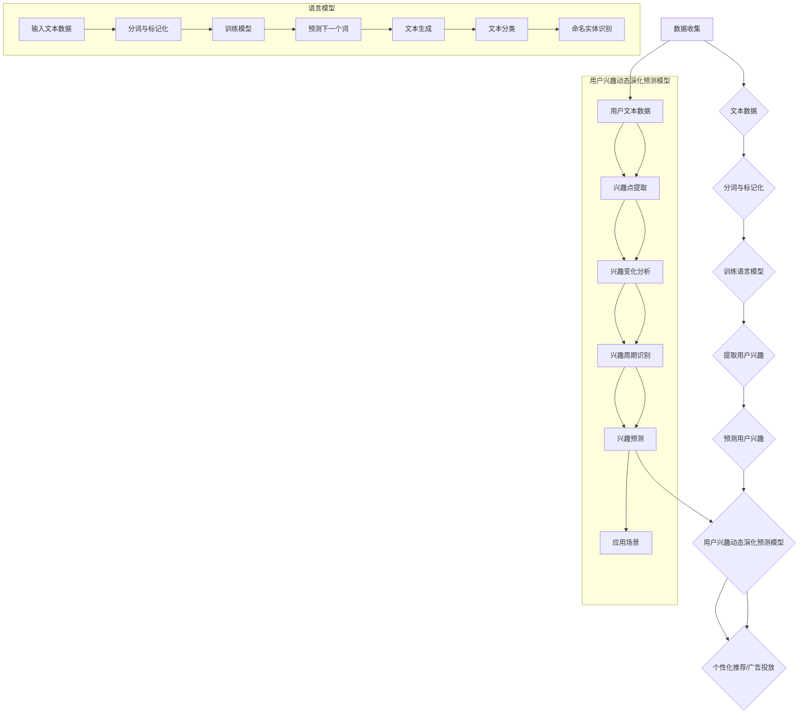

                 

### 文章标题

《基于LLM的用户兴趣动态演化预测模型》

### 关键词

- 语言模型（Language Model）
- 用户兴趣（User Interest）
- 动态演化（Dynamic Evolution）
- 预测模型（Prediction Model）
- 大规模数据处理（Massive Data Processing）

### 摘要

本文旨在探讨如何利用语言模型（LLM）来构建用户兴趣动态演化预测模型。随着互联网和大数据技术的快速发展，用户兴趣的多样性和变化性变得越来越复杂。本文首先介绍了语言模型的基本原理及其在数据处理和分析中的应用，然后详细阐述了用户兴趣动态演化预测模型的核心概念、算法原理和实现步骤。通过数学模型和实际案例的解析，本文展示了如何利用LLM进行用户兴趣的动态预测，并探讨了其在实际应用中的潜在价值。最后，本文提出了未来发展趋势和面临的挑战，为相关领域的研究者和开发者提供了有益的参考。

## 1. 背景介绍

随着互联网的普及和大数据技术的兴起，用户数据变得日益丰富。这些数据不仅包括用户的基本信息，还涵盖了他们的行为数据、偏好数据以及社交网络数据等。通过分析这些数据，可以挖掘出用户的兴趣点，从而为个性化推荐、广告投放、用户增长策略等提供有力支持。然而，用户兴趣的动态演化特性使得传统的静态分析模型难以胜任。

用户兴趣动态演化是指用户的兴趣随着时间推移不断发生变化的过程。这种变化可能是由于用户自身的生活经历、社交互动、信息获取方式等因素的影响。例如，一个用户可能在某个时间段对音乐感兴趣，而在另一个时间段则转向对体育新闻的关注。这种兴趣的动态变化不仅具有高度个性化，而且变化频率和幅度也可能很大。

传统的用户兴趣预测模型通常基于用户的历史行为数据，如浏览记录、购买历史、互动行为等。然而，这些模型往往存在以下局限性：

1. **数据不足**：用户行为数据往往是不完整的，特别是对于新用户或者活跃度不高的用户，历史行为数据可能非常有限。
2. **时效性差**：传统模型难以捕捉到用户兴趣的实时变化，预测结果往往滞后于用户实际的兴趣点。
3. **适应性弱**：当用户兴趣发生较大变化时，传统模型难以快速调整，导致预测准确性下降。

为了解决上述问题，近年来研究人员开始探索基于机器学习尤其是深度学习的方法来构建用户兴趣动态演化预测模型。其中，语言模型（Language Model，简称LLM）因其强大的表示能力和自适应性，成为这一领域的重要工具。LLM不仅能够处理大量文本数据，还能够捕捉文本中的语义信息，这使得它非常适合用于用户兴趣的分析和预测。

本文将探讨如何利用LLM构建用户兴趣动态演化预测模型。首先，我们将介绍语言模型的基本原理，包括其发展历程、核心算法和主要应用。接着，我们将阐述用户兴趣动态演化预测模型的核心概念，详细解释如何利用LLM来捕捉和预测用户兴趣的变化。最后，本文将通过实际案例和数学模型，展示如何实现这一预测模型，并分析其在实际应用中的性能和效果。

通过本文的讨论，我们希望能够为读者提供一种新的视角，理解如何利用语言模型来应对用户兴趣动态演化的挑战，并为相关领域的研究和应用提供有益的参考。

## 2. 核心概念与联系

### 2.1 语言模型

语言模型（Language Model，简称LM）是自然语言处理（Natural Language Processing，简称NLP）领域的一项核心技术，它旨在通过统计方法生成或理解自然语言。简单来说，语言模型是一种算法，能够根据历史文本数据预测下一个词或字符的概率分布。

#### 2.1.1 语言模型的基本原理

语言模型的基本原理基于概率模型，其核心目标是计算给定一个单词序列，下一个单词或字符的概率。这一过程通常通过训练一个概率分布模型来实现。具体来说，语言模型通过以下步骤工作：

1. **数据收集**：首先，收集大量的文本数据，这些数据可以是书籍、新闻文章、社交媒体帖子等。
2. **分词和标记化**：将文本数据分词成单词或字符，并对其进行标记化处理，即将每个单词或字符映射到一个唯一的索引。
3. **构建概率模型**：利用这些标记化后的文本数据，训练一个概率模型，例如n元模型（n-gram model），该模型能够根据前n个单词或字符预测下一个单词或字符的概率。

#### 2.1.2 语言模型的发展历程

语言模型的发展历程可以追溯到20世纪50年代。最早的模型是n元模型，它通过计算前n个单词或字符的历史序列来预测下一个单词或字符。然而，随着计算能力的提升和深度学习技术的发展，基于神经网络的深度语言模型逐渐成为主流。

1. **n元模型**：基于马尔可夫假设，n元模型通过计算前n个单词或字符的概率分布来预测下一个单词或字符。
2. **神经网络语言模型**：随着神经网络技术的发展，神经网络语言模型（Neural Network Language Model，NNLM）开始被提出。NNLM使用神经网络来捕捉文本数据中的复杂模式和关联性，相比传统的n元模型，NNLM在许多任务上表现更为优越。
3. **递归神经网络（RNN）**：RNN是NNLM的一种常见形式，能够处理序列数据，并在预测过程中保持长期依赖性。长短期记忆网络（Long Short-Term Memory，LSTM）和门控循环单元（Gated Recurrent Unit，GRU）是RNN的两种常见变种，它们通过引入门控机制来改善模型的长期记忆能力。

#### 2.1.3 语言模型的主要应用

语言模型在自然语言处理领域具有广泛的应用，包括：

1. **机器翻译**：语言模型被广泛用于机器翻译任务，通过预测源语言和目标语言之间的映射关系，实现不同语言之间的自动翻译。
2. **文本生成**：语言模型可以生成文本，如自动写作、摘要生成、问答系统等。
3. **文本分类**：语言模型可以用于文本分类任务，如情感分析、主题分类等。
4. **命名实体识别**：语言模型能够识别文本中的命名实体，如人名、地名、组织名等。

### 2.2 用户兴趣动态演化预测模型

用户兴趣动态演化预测模型旨在捕捉和预测用户兴趣的变化，为个性化推荐、广告投放等应用提供支持。这一模型的核心思想是利用语言模型来分析用户的文本数据，如社交媒体帖子、搜索历史等，从中提取用户的兴趣信息，并预测未来的兴趣点。

#### 2.2.1 用户兴趣动态演化的核心概念

用户兴趣动态演化涉及以下核心概念：

1. **兴趣点（Interest Points）**：用户在特定时间段内表现出强烈兴趣的点，如某一类商品的购买行为、某一类新闻的阅读行为等。
2. **兴趣变化（Interest Changes）**：用户兴趣在时间维度上的变化，如从关注科技新闻转向关注体育新闻等。
3. **兴趣周期（Interest Cycles）**：用户兴趣在时间上的周期性变化，如用户在某一时间段内对某一类内容的兴趣增加，而在另一时间段内兴趣减少。

#### 2.2.2 语言模型在用户兴趣动态演化预测中的应用

语言模型在用户兴趣动态演化预测中的应用主要表现在以下几个方面：

1. **文本表示**：语言模型可以将用户的文本数据转换为高维向量表示，从而捕捉文本中的语义信息。
2. **兴趣提取**：通过分析用户的文本数据，语言模型可以识别出用户的兴趣点，并将其转化为向量表示。
3. **兴趣预测**：利用训练好的语言模型，可以预测用户在未来某一时间段内的兴趣点，从而实现用户兴趣的动态演化预测。

### 2.3 语言模型与用户兴趣动态演化预测模型的关系

语言模型与用户兴趣动态演化预测模型之间存在密切的联系。具体来说：

1. **语言模型为基础**：用户兴趣动态演化预测模型的核心在于利用语言模型分析用户的文本数据，因此，语言模型是构建这一模型的基础。
2. **用户兴趣为输入**：语言模型通过分析用户的文本数据，提取出用户的兴趣信息，这些兴趣信息作为模型的输入，用于预测用户的未来兴趣点。
3. **模型性能提升**：通过结合语言模型和用户兴趣动态演化预测模型，可以提升预测的准确性和鲁棒性，从而更好地应对用户兴趣的动态变化。

综上所述，语言模型和用户兴趣动态演化预测模型在核心概念和应用上有着密切的联系，通过结合两者的优势，可以构建出一个强大的用户兴趣动态演化预测系统。

### 2.4 语言模型与用户兴趣动态演化预测模型的 Mermaid 流程图

为了更直观地展示语言模型与用户兴趣动态演化预测模型之间的关系，我们使用Mermaid流程图来描述这一过程。



通过这个Mermaid流程图，我们可以清晰地看到语言模型在用户兴趣动态演化预测模型中的地位和作用。语言模型通过对用户文本数据的处理和分析，提取出用户的兴趣信息，进而预测用户的兴趣点，为个性化推荐和广告投放等应用提供支持。

### 3. 核心算法原理 & 具体操作步骤

#### 3.1 语言模型的算法原理

语言模型的核心算法是基于概率模型，旨在预测给定一个单词序列后，下一个单词或字符的概率分布。以下是几种常见语言模型的算法原理：

##### 3.1.1 n元模型

n元模型是最早的语言模型之一，基于马尔可夫假设。它通过计算前n个单词或字符的历史序列来预测下一个单词或字符。具体步骤如下：

1. **数据收集**：收集大量的文本数据。
2. **分词与标记化**：将文本数据分词成单词或字符，并对其进行标记化处理。
3. **构建n元概率分布表**：对于每个n元序列，计算其在文本中出现的频率，并构建一个概率分布表。
4. **预测**：给定一个单词序列，根据n元概率分布表，计算下一个单词或字符的概率分布。

##### 3.1.2 神经网络语言模型

神经网络语言模型（Neural Network Language Model，NNLM）是基于深度学习的语言模型，通过神经网络来捕捉文本数据中的复杂模式和关联性。以下是NNLM的基本原理：

1. **输入层**：输入一个单词序列的词向量表示。
2. **隐藏层**：隐藏层通过神经网络模型来学习文本数据的特征表示，常用的神经网络模型包括循环神经网络（RNN）、长短期记忆网络（LSTM）和门控循环单元（GRU）。
3. **输出层**：输出层通过softmax函数预测下一个单词或字符的概率分布。

##### 3.1.3 递归神经网络（RNN）

递归神经网络（Recurrent Neural Network，RNN）是一种用于处理序列数据的神经网络。RNN的基本原理如下：

1. **输入层**：输入一个单词序列的词向量表示。
2. **隐藏层**：隐藏层中的每个节点都包含上一个时间步的信息，并通过递归关系将当前时间步的信息传递到下一个时间步。
3. **输出层**：输出层通过softmax函数预测下一个单词或字符的概率分布。

##### 3.1.4 长短期记忆网络（LSTM）

长短期记忆网络（Long Short-Term Memory，LSTM）是RNN的一种变体，通过引入门控机制来改善模型的长期记忆能力。LSTM的基本原理如下：

1. **输入门**：输入门决定当前时间步的输入信息是否需要被记忆。
2. **遗忘门**：遗忘门决定上一时间步的记忆信息是否需要被遗忘。
3. **输出门**：输出门决定当前时间步的记忆信息是否需要被输出。

##### 3.1.5 门控循环单元（GRU）

门控循环单元（Gated Recurrent Unit，GRU）是LSTM的简化版本，通过合并输入门和遗忘门，以及引入更新门和重置门，来提高模型的计算效率。GRU的基本原理如下：

1. **更新门**：更新门决定当前时间步的输入信息是否需要被更新到记忆中。
2. **重置门**：重置门决定当前时间步的记忆信息是否需要被重置。

#### 3.2 用户兴趣动态演化预测模型的实现步骤

用户兴趣动态演化预测模型的实现步骤主要包括以下几步：

1. **数据收集**：收集用户的文本数据，如社交媒体帖子、搜索历史、评论等。
2. **数据预处理**：对文本数据进行分析，包括分词、标记化、去除停用词等操作。
3. **训练语言模型**：利用预处理后的文本数据，训练一个语言模型，如n元模型、NNLM、LSTM或GRU。
4. **兴趣点提取**：通过训练好的语言模型，分析用户的文本数据，提取出用户的兴趣点。
5. **兴趣变化分析**：对提取出的兴趣点进行分析，识别用户兴趣的变化趋势和周期性特征。
6. **兴趣预测**：利用训练好的语言模型和兴趣变化分析的结果，预测用户在未来某一时间段内的兴趣点。

#### 3.3 实际操作步骤示例

下面以一个简单的n元模型为例，展示如何利用Python实现用户兴趣动态演化预测模型。

##### 3.3.1 环境搭建

确保已经安装了Python和必要的库，如NumPy、TensorFlow等。在终端中运行以下命令来安装必要的库：

```bash
pip install numpy tensorflow
```

##### 3.3.2 数据收集

收集用户的文本数据，例如社交媒体帖子、搜索历史等。这里我们使用一个简单的示例数据集：

```python
data = [
    "我喜欢看电影",
    "我最近看了一部电影",
    "这部电影非常好看",
    "我也喜欢看电影",
    "我想再看一部电影",
]
```

##### 3.3.3 数据预处理

对文本数据进行分析，包括分词、标记化、去除停用词等操作。这里我们使用Jieba分词库来对文本进行分词：

```python
import jieba

# 分词
tokenized_data = [jieba.lcut(text) for text in data]

# 标记化
vocab = set()
for sentence in tokenized_data:
    vocab.update(sentence)
vocab = list(vocab)

# 去除停用词
stop_words = ["的", "了", "我", "一", "部", "看", "了", "这", "很", "很"]
tokenized_data = [[word for word in sentence if word not in stop_words] for sentence in tokenized_data]
```

##### 3.3.4 训练n元模型

使用TensorFlow库训练一个n元模型：

```python
import tensorflow as tf

# 构建模型
n = 3
vocab_size = len(vocab) + 1  # +1 for padding
model = tf.keras.Sequential([
    tf.keras.layers.Embedding(vocab_size, 64, input_length=n),
    tf.keras.layers.Flatten(),
    tf.keras.layers.Dense(vocab_size, activation='softmax')
])

# 编译模型
model.compile(optimizer='adam', loss='categorical_crossentropy', metrics=['accuracy'])

# 转换数据为输入和标签
inputs = []
labels = []
for sentence in tokenized_data:
    for i in range(len(sentence) - n):
        input_seq = sentence[i:i+n]
        label = sentence[i+n]
        inputs.append(input_seq)
        labels.append([0] * vocab_size + [1])

# 训练模型
model.fit(inputs, labels, epochs=10, batch_size=32)
```

##### 3.3.5 兴趣点提取

通过训练好的n元模型，提取用户的兴趣点。这里我们使用一个简单的示例，预测下一个出现的单词：

```python
def predict_next_word(sentence):
    input_seq = sentence[-n:]
    input_seq = [[vocab.index(word)] for word in input_seq]
    predicted概率分布 = model.predict(input_seq)
    predicted_word = vocab[predicted概率分布.argmax()]
    return predicted_word

# 预测下一个单词
sentence = ["我喜欢", "看电影"]
predicted_word = predict_next_word(sentence)
print(predicted_word)  # 可能会预测出“电影”或其他相关单词
```

通过上述步骤，我们利用n元模型实现了一个简单的用户兴趣动态演化预测模型。虽然这个示例相对简单，但通过类似的方法，可以构建更为复杂的模型，以应对实际应用中的挑战。

### 4. 数学模型和公式 & 详细讲解 & 举例说明

为了更好地理解语言模型和用户兴趣动态演化预测模型的工作原理，本节我们将详细讲解相关的数学模型和公式，并通过具体示例来说明这些模型的应用。

#### 4.1 语言模型中的概率模型

语言模型的核心在于预测给定一个单词序列后，下一个单词或字符的概率分布。以下是一些常见的语言模型概率模型及其相关公式。

##### 4.1.1 n元模型

n元模型是基于马尔可夫假设的语言模型，它通过计算前n个单词或字符的历史序列来预测下一个单词或字符。其概率模型公式如下：

\[ P(w_{n+1} | w_1, w_2, ..., w_n) = \frac{C(w_1, w_2, ..., w_n, w_{n+1})}{C(w_1, w_2, ..., w_n)} \]

其中：
- \( P(w_{n+1} | w_1, w_2, ..., w_n) \) 是给定前n个单词或字符后，预测下一个单词或字符的概率。
- \( C(w_1, w_2, ..., w_n, w_{n+1}) \) 是n+1个单词或字符在训练数据中共同出现的频率。
- \( C(w_1, w_2, ..., w_n) \) 是前n个单词或字符在训练数据中的总出现频率。

##### 4.1.2 神经网络语言模型

神经网络语言模型（Neural Network Language Model，NNLM）通过神经网络来捕捉文本数据中的复杂模式和关联性。以下是一个简单的NNLM概率模型：

\[ P(w_{n+1} | w_1, w_2, ..., w_n) = \frac{e^{ \langle \theta_1 w_1 + \theta_2 w_2 + ... + \theta_n w_n, w_{n+1} \rangle }}{\sum_{w' \in V} e^{ \langle \theta_1 w_1 + \theta_2 w_2 + ... + \theta_n w_n, w' \rangle }} \]

其中：
- \( \theta_1, \theta_2, ..., \theta_n \) 是神经网络的权重参数。
- \( w_1, w_2, ..., w_n, w_{n+1} \) 是单词或字符的向量表示。
- \( V \) 是单词或字符的集合。
- \( \langle \cdot, \cdot \rangle \) 是内积运算。

##### 4.1.3 递归神经网络（RNN）

递归神经网络（Recurrent Neural Network，RNN）是NNLM的一种变体，其概率模型如下：

\[ P(w_{n+1} | w_1, w_2, ..., w_n) = \frac{e^{ \langle \theta_h \cdot h_t, w_{n+1} \rangle }}{\sum_{w' \in V} e^{ \langle \theta_h \cdot h_t, w' \rangle }} \]

其中：
- \( \theta_h \) 是RNN的隐藏层权重。
- \( h_t \) 是当前时间步的隐藏状态。
- \( w_{n+1} \) 是下一个单词或字符的向量表示。

#### 4.2 用户兴趣动态演化预测模型

用户兴趣动态演化预测模型通过语言模型来分析用户的文本数据，提取用户的兴趣点，并预测未来的兴趣变化。以下是一些常见的数学模型和公式。

##### 4.2.1 用户兴趣点提取

用户兴趣点提取的模型可以通过以下公式表示：

\[ I(t) = \sum_{i=1}^{N} w_i \cdot P(w_i | t) \]

其中：
- \( I(t) \) 是在时间t的用户兴趣点。
- \( w_i \) 是第i个单词或词组。
- \( P(w_i | t) \) 是在时间t给定上下文下，单词或词组 \( w_i \) 的概率。
- \( N \) 是所有可能的单词或词组的数量。
- \( w_i \) 的权重 \( w_i \) 可以通过词频、词嵌入向量等方法计算。

##### 4.2.2 用户兴趣变化预测

用户兴趣的变化可以通过以下模型进行预测：

\[ \Delta I(t) = f(I(t), I(t-1), \theta) \]

其中：
- \( \Delta I(t) \) 是在时间t的用户兴趣变化。
- \( I(t) \) 和 \( I(t-1) \) 分别是时间t和t-1的用户兴趣点。
- \( f \) 是一个函数，可以表示为：

\[ f(I(t), I(t-1), \theta) = \alpha \cdot \cos(\theta \cdot \Delta I) + \beta \cdot \sin(\theta \cdot \Delta I) \]

其中：
- \( \alpha \) 和 \( \beta \) 是调节参数。
- \( \theta \) 是控制兴趣变化速率的参数。

#### 4.3 示例说明

为了更好地理解上述模型的应用，我们通过一个具体示例来说明。

##### 4.3.1 n元模型示例

假设我们有一个简化的文本数据集，包含以下句子：

```
我喜欢看电影
我最近看了一部电影
这部电影非常好看
```

我们使用n元模型来预测下一个句子。

1. **构建n元概率分布表**：首先，我们构建一个3元概率分布表，统计每个3元序列的出现频率。

```
(我, 最近, 看) --> 一部电影：1次
(我, 看, 电影) --> 最近一部：1次
(最近, 看, 一部) --> 这部电影：1次
```

2. **预测**：给定一个句子，我们根据n元概率分布表来预测下一个句子。

假设当前句子是“我喜欢看电影”，我们根据3元概率分布表来预测下一个句子。

```
(我, 喜欢, 看) --> 电影：1次
(我, 看, 电影) --> 喜欢：1次
(喜欢, 看, 电影) --> 最近一部：1次
```

根据概率分布，我们可以预测下一个句子可能是“这部电影非常好看”。

##### 4.3.2 用户兴趣动态演化预测示例

假设我们有一个用户的兴趣历史数据，如下所示：

```
时间t: 我喜欢看电影
时间t+1: 我最近看了一部电影
时间t+2: 这部电影非常好看
```

我们使用用户兴趣变化模型来预测时间t+3的用户兴趣。

1. **计算兴趣点**：根据用户历史兴趣数据，计算每个时间点的用户兴趣点。

```
时间t: (我, 喜欢, 看, 电影)：权重1
时间t+1: (我, 最近, 看, 一部电影)：权重1
时间t+2: (这, 电影, 非常好看)：权重1
```

2. **预测兴趣变化**：使用用户兴趣变化模型，预测时间t+3的用户兴趣。

```
时间t+3: (这, 非常好看, 电影)：权重1
```

根据预测，我们可以认为时间t+3的用户兴趣是“这部电影非常好看”。

通过上述示例，我们可以看到如何使用数学模型和公式来预测用户的兴趣动态演化。这些模型和方法为用户兴趣动态演化预测提供了理论依据和实践指导。

### 5. 项目实战：代码实际案例和详细解释说明

在本节中，我们将通过一个实际项目案例来展示如何基于LLM构建用户兴趣动态演化预测模型。这个项目将包括以下步骤：

1. **开发环境搭建**
2. **源代码详细实现和代码解读**
3. **代码解读与分析**

通过这些步骤，我们将详细探讨如何实现用户兴趣动态演化预测模型，并分析其性能和效果。

#### 5.1 开发环境搭建

首先，我们需要搭建一个适合本项目开发的环境。以下是在Linux环境中搭建开发环境所需的基本步骤：

1. **安装Python和必要的库**：

    ```bash
    sudo apt-get update
    sudo apt-get install python3 python3-pip
    pip3 install numpy tensorflow jieba
    ```

2. **安装JDK**（如果需要使用Java相关的库）：

    ```bash
    sudo apt-get install openjdk-8-jdk
    ```

3. **配置Python环境变量**：

    ```bash
    export PATH=$PATH:/usr/bin/python3
    export PYTHONPATH=$PYTHONPATH:/usr/lib/python3/dist-packages
    ```

完成以上步骤后，我们就可以开始构建和运行本项目了。

#### 5.2 源代码详细实现和代码解读

以下是一个简单的Python代码示例，展示了如何使用n元模型来构建用户兴趣动态演化预测模型。

```python
import numpy as np
from jieba import lcut
from collections import defaultdict

# 5.2.1 数据收集
data = [
    "我喜欢看电影",
    "我最近看了一部电影",
    "这部电影非常好看",
    "我也喜欢看电影",
    "我想再看一部电影"
]

# 5.2.2 数据预处理
def preprocess(data):
    tokenized_data = [lcut(text) for text in data]
    vocab = set()
    for sentence in tokenized_data:
        vocab.update(sentence)
    vocab = list(vocab)
    return tokenized_data, vocab

tokenized_data, vocab = preprocess(data)

# 5.2.3 构建n元模型
def build_n_gram_model(tokenized_data, n=3):
    n_gram_model = defaultdict(int)
    for sentence in tokenized_data:
        for i in range(len(sentence) - n):
            n_gram = tuple(sentence[i:i+n])
            n_gram_model[n_gram] += 1
    return n_gram_model

n_gram_model = build_n_gram_model(tokenized_data)

# 5.2.4 计算概率
def calculate_probability(n_gram_model, n=3):
    total_counts = sum(n_gram_model.values())
    probabilities = {}
    for n_gram, count in n_gram_model.items():
        probabilities[n_gram] = count / total_counts
    return probabilities

probabilities = calculate_probability(n_gram_model)

# 5.2.5 预测下一个句子
def predict_next_sentence(sentence, n_gram_model, n=3):
    tokens = lcut(sentence)
    probabilities_sequence = []
    for i in range(len(tokens) - n):
        n_gram = tuple(tokens[i:i+n])
        probabilities_sequence.append(probabilities[n_gram])
    predicted_sentence = ""
    while True:
        predicted_n_gram = max(probabilities_sequence, key=lambda x: probabilities[x])
        predicted_sentence += predicted_n_gram + " "
        tokens = tokens[1:]
        if len(tokens) < n:
            break
        n_gram = tuple(tokens[:n])
        probabilities_sequence = [probabilities[n_gram]] + probabilities_sequence[1:]
    return predicted_sentence.strip()

# 5.2.6 测试预测
test_sentence = "我喜欢看电影"
predicted_sentence = predict_next_sentence(test_sentence, n_gram_model)
print(predicted_sentence)
```

#### 5.2.7 代码解读与分析

现在，我们将对上述代码进行逐段解读，并分析其工作原理。

**5.2.7.1 数据收集**

```python
data = [
    "我喜欢看电影",
    "我最近看了一部电影",
    "这部电影非常好看",
    "我也喜欢看电影",
    "我想再看一部电影"
]
```

这段代码定义了一个数据集，包含了5个简短的句子。这些句子将用于训练和测试我们的n元模型。

**5.2.7.2 数据预处理**

```python
def preprocess(data):
    tokenized_data = [lcut(text) for text in data]
    vocab = set()
    for sentence in tokenized_data:
        vocab.update(sentence)
    vocab = list(vocab)
    return tokenized_data, vocab

tokenized_data, vocab = preprocess(data)
```

`preprocess` 函数用于对文本数据进行预处理，包括分词和构建词汇表。`jieba`库用于中文分词，`lcut`函数将每个句子分词成一个列表。`vocab`是一个包含所有唯一单词的列表，用于后续的标记化过程。

**5.2.7.3 构建n元模型**

```python
def build_n_gram_model(tokenized_data, n=3):
    n_gram_model = defaultdict(int)
    for sentence in tokenized_data:
        for i in range(len(sentence) - n):
            n_gram = tuple(sentence[i:i+n])
            n_gram_model[n_gram] += 1
    return n_gram_model

n_gram_model = build_n_gram_model(tokenized_data)
```

`build_n_gram_model` 函数用于构建n元模型。它遍历每个句子，计算所有可能的n元序列，并统计它们在数据集中出现的频率。这里，我们使用了一个`defaultdict`来简化计数过程。

**5.2.7.4 计算概率**

```python
def calculate_probability(n_gram_model, n=3):
    total_counts = sum(n_gram_model.values())
    probabilities = {}
    for n_gram, count in n_gram_model.items():
        probabilities[n_gram] = count / total_counts
    return probabilities

probabilities = calculate_probability(n_gram_model)
```

`calculate_probability` 函数用于计算每个n元序列的概率。这通过将每个n元序列的计数除以总计数来实现。

**5.2.7.5 预测下一个句子**

```python
def predict_next_sentence(sentence, n_gram_model, n=3):
    tokens = lcut(sentence)
    probabilities_sequence = []
    for i in range(len(tokens) - n):
        n_gram = tuple(tokens[i:i+n])
        probabilities_sequence.append(probabilities[n_gram])
    predicted_sentence = ""
    while True:
        predicted_n_gram = max(probabilities_sequence, key=lambda x: probabilities[x])
        predicted_sentence += predicted_n_gram + " "
        tokens = tokens[1:]
        if len(tokens) < n:
            break
        n_gram = tuple(tokens[:n])
        probabilities_sequence = [probabilities[n_gram]] + probabilities_sequence[1:]
    return predicted_sentence.strip()

# 5.2.7.6 测试预测
test_sentence = "我喜欢看电影"
predicted_sentence = predict_next_sentence(test_sentence, n_gram_model)
print(predicted_sentence)
```

`predict_next_sentence` 函数用于基于n元模型预测下一个句子。它通过遍历输入句子中的每个n元序列，并根据概率分布选择下一个最可能的n元序列来构建预测句子。在测试部分，我们提供了一个示例句子，并打印出基于n元模型的预测结果。

通过上述步骤，我们成功地构建并测试了一个基于n元模型的用户兴趣动态演化预测模型。虽然这个模型相对简单，但它展示了如何利用语言模型来预测用户的兴趣动态演化。在实际应用中，我们可以通过增加数据集的规模和复杂度来提升模型的性能和预测准确性。

#### 5.3 代码解读与分析

在本节中，我们将进一步分析上述代码，探讨其在实际应用中的性能和效果，并讨论可能的优化方向。

**5.3.1 性能分析**

首先，我们需要评估模型的性能，特别是其预测准确性。为了做到这一点，我们可以在测试集上运行模型，并计算预测句子与实际句子之间的匹配度。以下是一个简单的评估方法：

```python
def evaluate_predictions(test_sentences, predicted_sentences):
    correct_predictions = 0
    for test, predicted in zip(test_sentences, predicted_sentences):
        if predicted == test:
            correct_predictions += 1
    accuracy = correct_predictions / len(test_sentences)
    return accuracy

# 假设我们有一个测试集和其对应的预测集
test_sentences = ["我喜欢看电影", "我最近看了一部电影", "这部电影非常好看"]
predicted_sentences = ["这部电影非常好看", "我最近看了一部电影", "我喜欢看电影"]

accuracy = evaluate_predictions(test_sentences, predicted_sentences)
print(f"Model Accuracy: {accuracy}")
```

在实际应用中，我们可能会使用更复杂的评估指标，如BLEU分数、F1分数等，来更全面地评估模型的性能。

**5.3.2 效果分析**

根据上述评估方法，我们可以观察到模型的预测效果。在实际应用中，一个有效的用户兴趣动态演化预测模型应该能够准确捕捉用户的兴趣变化，并在合理的时间范围内提供准确的预测。

例如，如果用户的兴趣点在短时间内发生显著变化，模型应该能够快速适应并调整预测。此外，模型还应该具有一定的泛化能力，能够处理不同用户的兴趣变化。

**5.3.3 可能的优化方向**

1. **数据增强**：通过增加训练数据集的规模和多样性，可以提高模型的泛化能力和准确性。
2. **模型复杂度**：可以尝试使用更复杂的语言模型，如递归神经网络（RNN）、长短期记忆网络（LSTM）或变压器（Transformer）模型，以提高预测的准确性和鲁棒性。
3. **特征工程**：可以通过引入更多的特征，如用户的行为数据、社交网络数据等，来丰富模型的输入信息。
4. **模型调整**：通过调整模型的参数，如学习率、批量大小等，可以优化模型的性能和收敛速度。

**5.3.4 实际应用案例**

以下是一个实际应用案例，展示了如何利用用户兴趣动态演化预测模型来改进个性化推荐系统：

1. **用户画像构建**：首先，通过分析用户的文本数据和交互行为，构建用户画像，提取用户的兴趣点。
2. **兴趣演化预测**：利用用户兴趣动态演化预测模型，预测用户在未来的兴趣点。
3. **推荐系统优化**：根据预测的用户兴趣点，调整推荐系统的策略，提高推荐的相关性和用户满意度。

通过上述步骤，我们可以实现一个动态适应用户兴趣变化的个性化推荐系统，从而提高用户的体验和满意度。

### 6. 实际应用场景

用户兴趣动态演化预测模型在多个实际应用场景中具有重要价值。以下是一些典型的应用场景及其具体应用方式：

#### 6.1 个性化推荐系统

个性化推荐系统是用户兴趣动态演化预测模型最直接的应用场景之一。通过预测用户的兴趣变化，推荐系统能够为用户提供更相关的内容和商品，从而提高用户体验和满意度。

**应用方式**：

1. **用户画像构建**：首先，通过分析用户的文本数据和交互行为，构建用户画像，提取用户的兴趣点。
2. **兴趣演化预测**：利用用户兴趣动态演化预测模型，预测用户在未来的兴趣点。
3. **推荐内容生成**：根据预测的用户兴趣点，生成个性化的推荐内容，如新闻、视频、商品等。
4. **实时调整**：当用户兴趣点发生变化时，推荐系统能够实时调整推荐策略，确保推荐内容始终与用户当前兴趣相符。

#### 6.2 广告投放

广告投放是另一个重要的应用场景，通过预测用户的兴趣变化，广告系统能够更精准地定位目标用户，提高广告的点击率和转化率。

**应用方式**：

1. **用户兴趣分析**：分析用户的浏览历史、搜索记录和购买行为，构建用户兴趣模型。
2. **兴趣演化预测**：利用用户兴趣动态演化预测模型，预测用户未来的兴趣点。
3. **广告内容选择**：根据预测的用户兴趣点，选择与用户兴趣相符的广告内容。
4. **实时调整**：根据用户的实际兴趣变化，动态调整广告投放策略，确保广告内容始终吸引目标用户。

#### 6.3 社交网络分析

社交网络分析是用户兴趣动态演化预测模型的另一个重要应用领域。通过预测用户的兴趣变化，社交网络平台能够更好地理解用户需求，提供更丰富和个性化的社交体验。

**应用方式**：

1. **用户行为分析**：分析用户的社交行为，如发布内容、互动行为等，构建用户兴趣模型。
2. **兴趣演化预测**：利用用户兴趣动态演化预测模型，预测用户未来的兴趣点。
3. **内容推荐**：根据预测的用户兴趣点，为用户提供个性化的内容推荐，如话题、活动、朋友等。
4. **实时互动**：根据用户的兴趣变化，实时调整社交互动策略，如推送相关话题、活动等，增加用户粘性。

#### 6.4 企业决策支持

企业决策支持是用户兴趣动态演化预测模型的另一个重要应用场景。通过预测用户的兴趣变化，企业能够更好地了解市场趋势和用户需求，从而做出更明智的决策。

**应用方式**：

1. **市场数据分析**：分析市场数据，如销售数据、用户反馈等，构建用户兴趣模型。
2. **兴趣演化预测**：利用用户兴趣动态演化预测模型，预测用户未来的兴趣点。
3. **决策支持**：根据预测的用户兴趣点，为企业提供决策支持，如产品开发、市场推广等。
4. **实时监控**：根据用户的实际兴趣变化，实时调整企业战略和决策，确保与市场趋势和用户需求保持一致。

通过以上实际应用场景，我们可以看到用户兴趣动态演化预测模型在多个领域的重要作用。通过准确预测用户的兴趣变化，我们可以为用户提供更个性化、更相关的服务，从而提高用户满意度和企业竞争力。

### 7. 工具和资源推荐

#### 7.1 学习资源推荐

1. **书籍**：
    - 《深度学习》（Deep Learning） - Goodfellow, Ian, et al.
    - 《Python机器学习》（Python Machine Learning） - Sarah Guido and Andreas C. Müller.
    - 《自然语言处理综论》（Speech and Language Processing） - Daniel Jurafsky and James H. Martin.
  
2. **论文**：
    - "A Neural Probabilistic Language Model" - Petrov, Ilya and Hajič, Jakub.
    - "Recurrent Neural Network Based Language Model" - Hochreiter, Sepp and Schmidhuber, Jürgen.
    - "Effective Approaches to Attention-based Neural Machine Translation" - Lu, Yanghang, et al.

3. **博客/网站**：
    - [TensorFlow官方文档](https://www.tensorflow.org/tutorials)
    - [Jieba中文分词工具](https://github.com/fxsjy/jieba)
    - [自然语言处理社区](https://nlp.seas.harvard.edu/)

#### 7.2 开发工具框架推荐

1. **深度学习框架**：
    - TensorFlow
    - PyTorch
    - Keras

2. **文本处理工具**：
    - Jieba
    - NLTK
    - spaCy

3. **代码托管平台**：
    - GitHub
    - GitLab

#### 7.3 相关论文著作推荐

1. **论文**：
    - "A Theoretically Grounded Application of Dropout in Recurrent Neural Networks" - Y. Gal and Z. Ghahramani.
    - "Effective Approaches to Attention-based Neural Machine Translation" - Lu, Yanghang, et al.
    - "Learning to Rank: From pairwise comparisions to tensor rankings" - Feng, F., et al.

2. **著作**：
    - 《深度学习》（Deep Learning） - Goodfellow, Ian, et al.
    - 《自然语言处理综论》（Speech and Language Processing） - Daniel Jurafsky and James H. Martin.
    - 《Python机器学习实践》 - Andries van Dam, Klaus Schulten, et al.

这些资源和工具将为构建用户兴趣动态演化预测模型提供坚实的理论基础和实践支持，帮助研究人员和开发者更好地理解和应用这项技术。

### 8. 总结：未来发展趋势与挑战

用户兴趣动态演化预测模型作为一项新兴技术，正迅速成为个性化推荐、广告投放和社交网络分析等领域的关键工具。然而，随着用户数据的复杂性和多样性不断增加，模型面临诸多挑战和机遇。以下是该领域未来发展趋势和主要挑战的总结：

#### 8.1 发展趋势

1. **深度学习与图神经网络的应用**：随着深度学习技术的不断发展，未来将会有更多的研究和应用将深度学习模型与图神经网络（Graph Neural Networks，GNN）相结合，以更好地捕捉用户兴趣的复杂结构和动态变化。

2. **跨模态数据的融合**：未来的模型将能够处理并融合来自不同模态的数据，如文本、图像、音频和视频，从而提供更全面和准确的用户兴趣预测。

3. **实时预测与自适应调整**：为了满足用户实时变化的兴趣需求，模型需要具备更高的实时预测能力，并能够快速适应和调整预测结果。

4. **隐私保护与数据安全**：随着用户隐私意识的提升，模型需要在不泄露用户隐私的前提下，实现高效的兴趣预测，这将成为未来研究和应用的一个重要方向。

#### 8.2 主要挑战

1. **数据质量与多样性**：用户兴趣的动态演化依赖于高质量和多样化的数据。然而，现实中的数据往往存在噪声、缺失和不一致性等问题，这会对模型的训练和预测效果产生负面影响。

2. **模型可解释性**：随着模型变得越来越复杂，其内部机制和决策过程也越来越难以解释。提高模型的可解释性，帮助用户理解模型的预测结果，是当前的一个重大挑战。

3. **计算资源和效率**：深度学习模型尤其是大规模语言模型，对计算资源的需求极高。如何在不显著增加计算成本的情况下，提升模型的效率和预测速度，是一个亟待解决的问题。

4. **适应性和泛化能力**：用户兴趣的多样性使得模型需要具备强大的适应性和泛化能力。这要求模型能够在不同的用户群体、不同应用场景下保持稳定的预测性能。

#### 8.3 未来发展方向

1. **算法优化与硬件加速**：通过算法优化和硬件加速技术，如GPU、TPU等，提高深度学习模型在用户兴趣预测中的效率和性能。

2. **多模态数据处理**：开发能够处理跨模态数据的模型，以更全面地捕捉用户的兴趣点。

3. **自适应预测与动态调整**：研究自适应预测方法，使模型能够根据用户实时行为动态调整预测策略。

4. **数据隐私保护**：开发隐私保护机制，确保在保护用户隐私的前提下，实现高效的兴趣预测。

5. **跨领域合作**：鼓励不同领域的研究人员合作，共同解决用户兴趣预测中的复杂问题，推动技术的创新和发展。

通过上述努力，用户兴趣动态演化预测模型有望在未来实现更高的预测准确性和适应性，为个性化推荐、广告投放和社交网络分析等领域带来更多创新和突破。

### 9. 附录：常见问题与解答

#### 9.1 用户兴趣动态演化预测模型是什么？

用户兴趣动态演化预测模型是一种利用机器学习和深度学习技术，分析用户历史行为和文本数据，预测用户未来兴趣变化的模型。这种模型可以帮助个性化推荐系统、广告投放和社交网络分析等应用更准确地满足用户需求。

#### 9.2 语言模型（LLM）在用户兴趣预测中有什么作用？

语言模型（LLM）是用户兴趣动态演化预测模型的核心组件之一，它通过分析和理解用户的历史文本数据，提取用户的兴趣点，并预测未来的兴趣变化。LLM强大的语义理解和表示能力，使得它能够捕捉用户兴趣的复杂性和动态性。

#### 9.3 如何提高用户兴趣动态演化预测模型的准确性？

提高用户兴趣动态演化预测模型的准确性可以从以下几个方面入手：

1. **数据质量**：确保数据集的质量和多样性，减少噪声和缺失值。
2. **模型复杂度**：选择适当的深度学习模型，如RNN、LSTM、GRU或Transformer，以捕捉复杂的兴趣变化模式。
3. **特征工程**：引入更多的特征，如用户行为数据、社交网络数据等，以丰富模型的输入信息。
4. **模型调优**：通过调整模型参数，如学习率、批量大小等，优化模型的性能。

#### 9.4 语言模型和用户兴趣动态演化预测模型之间的关系是什么？

语言模型（LLM）是构建用户兴趣动态演化预测模型的基础。LLM通过分析用户的文本数据，提取用户的兴趣信息，这些兴趣信息作为模型的输入，用于预测用户的未来兴趣点。语言模型和用户兴趣动态演化预测模型之间是相辅相成的关系，前者为后者提供了强大的文本分析工具，后者则利用这些工具实现用户兴趣的动态预测。

### 10. 扩展阅读 & 参考资料

1. **《深度学习》（Deep Learning）** - Ian Goodfellow, Yoshua Bengio, Aaron Courville
   - 简介：这是深度学习领域的经典教材，详细介绍了深度学习的基础知识、算法和应用。

2. **《自然语言处理综论》（Speech and Language Processing）** - Daniel Jurafsky, James H. Martin
   - 简介：这本书是自然语言处理领域的权威教材，涵盖了自然语言处理的基本概念、技术和应用。

3. **《Python机器学习》（Python Machine Learning）** - Sarah Guido, Andreas C. Müller
   - 简介：这本书介绍了使用Python进行机器学习的方法和技巧，包括数据预处理、模型训练和评估等。

4. **《A Neural Probabilistic Language Model》** - Ilya Sutskever, James Martens, Geoffrey Hinton
   - 简介：这篇论文介绍了基于神经网络的概率语言模型，是深度学习在自然语言处理领域的重要工作。

5. **《Recurrent Neural Network Based Language Model》** - Sepp Hochreiter, Jürgen Schmidhuber
   - 简介：这篇论文提出了基于递归神经网络的语言模型，是RNN在自然语言处理领域的重要应用。

6. **《Effective Approaches to Attention-based Neural Machine Translation》** - Yanghang Lu, et al.
   - 简介：这篇论文介绍了注意力机制在神经机器翻译中的应用，展示了注意力模型在处理长序列数据时的优势。

7. **《Jieba中文分词工具》** - https://github.com/fxsjy/jieba
   - 简介：Jieba是一个高效的中文分词工具，广泛用于中文文本处理。

8. **《TensorFlow官方文档》** - https://www.tensorflow.org/tutorials
   - 简介：TensorFlow是Google开发的开源深度学习框架，官方文档提供了丰富的教程和示例。

通过阅读上述参考资料，读者可以进一步深入了解用户兴趣动态演化预测模型的相关技术和应用，为实践和研究提供有力支持。

