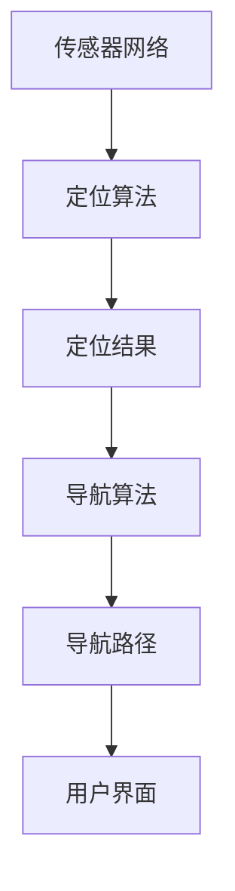

                 

# 基于MQTT协议和RESTful API的室内定位与导航系统

> **关键词：** MQTT协议、RESTful API、室内定位、导航系统、物联网、实时通信、软件开发

> **摘要：** 本文深入探讨了基于MQTT协议和RESTful API的室内定位与导航系统的设计与实现。通过分析MQTT协议和RESTful API的原理及其在室内定位中的应用，本文详细阐述了系统的整体架构、核心算法和实现步骤，并结合实际项目案例，展示了系统的开发过程、代码实现及其应用场景。最后，本文总结了系统的发展趋势和面临的挑战，并为读者推荐了相关的学习资源和工具。

## 1. 背景介绍

随着物联网（IoT）技术的快速发展，室内定位与导航系统在智能家居、智慧城市、工业物联网等领域得到了广泛应用。室内定位与导航系统不仅需要提供精确的位置信息，还需要实现实时的导航功能，以帮助用户快速准确地到达目的地。

传统的GPS技术虽然可以提供室外定位服务，但在室内环境中，由于信号遮挡、反射等因素，定位精度和可靠性较低。为了解决室内定位问题，研究人员提出了多种基于Wi-Fi、蓝牙、红外、超声波等技术的定位方法。然而，这些方法在实现复杂场景下的实时导航功能时存在一定的局限性。

MQTT（Message Queuing Telemetry Transport）协议是一种轻量级的消息传输协议，广泛用于物联网设备的实时通信。它具有低功耗、高可靠性和可伸缩性等优点，非常适合用于室内定位与导航系统的实时数据传输。RESTful API（Representational State Transfer Application Programming Interface）则是一种基于HTTP请求的接口设计规范，广泛用于构建分布式网络应用。它具有简单、灵活、易扩展的特点，可以方便地实现系统间的数据交互和功能调用。

本文旨在探讨基于MQTT协议和RESTful API的室内定位与导航系统的设计与实现，通过分析系统的整体架构、核心算法和实现步骤，为室内定位与导航系统的开发提供参考。

## 2. 核心概念与联系

### MQTT协议

MQTT协议是一种基于客户端-服务器的消息传输协议，其核心思想是发布/订阅（Publish/Subscribe）模式。在MQTT协议中，发布者（Publisher）可以向服务器（Broker）发布消息，订阅者（Subscriber）可以订阅感兴趣的主题（Topic），服务器负责将消息转发给订阅者。

MQTT协议的主要特点包括：

1. **轻量级**：MQTT协议的数据格式非常简单，可以适应带宽受限和低功耗的环境。
2. **可靠性**：MQTT协议支持消息确认（Message Acknowledgment），确保消息能够可靠地传输到订阅者。
3. **可伸缩性**：MQTT协议支持大量的客户端连接，适合大规模物联网应用。

### RESTful API

RESTful API是一种基于HTTP请求的接口设计规范，其核心思想是资源（Resource）的访问和操作。RESTful API的主要特点包括：

1. **统一接口**：RESTful API通过统一接口（统一URL结构、HTTP动词、状态码等）简化了客户端和服务器之间的交互。
2. **无状态**：RESTful API采用无状态设计，服务器不会保存客户端的会话信息，提高了系统的可扩展性和可靠性。
3. **可扩展性**：RESTful API支持自定义HTTP请求头和数据格式，方便扩展和集成。

### 室内定位与导航系统

室内定位与导航系统主要包括三个部分：传感器网络、定位算法和导航算法。

1. **传感器网络**：传感器网络负责采集室内环境中的各种数据，如Wi-Fi信号强度、蓝牙信号强度、红外信号等。这些数据可以作为定位和导航的输入。
2. **定位算法**：定位算法负责根据传感器数据计算设备的位置信息。常用的定位算法包括基于三角测量法、基于卡尔曼滤波器等。
3. **导航算法**：导航算法负责根据用户的需求规划路径，并引导用户到达目的地。常用的导航算法包括A*算法、Dijkstra算法等。

### Mermaid流程图

以下是室内定位与导航系统的Mermaid流程图，展示了系统从传感器数据采集到定位和导航的过程：



## 3. 核心算法原理 & 具体操作步骤

### MQTT协议原理

MQTT协议的核心思想是发布/订阅模式。在MQTT协议中，客户端（Client）可以通过连接到MQTT服务器（Broker）来发布（Publish）消息和订阅（Subscribe）主题。以下是MQTT协议的基本操作步骤：

1. **连接**：客户端连接到MQTT服务器，并指定连接参数，如服务器地址、端口号、用户名和密码等。
2. **发布消息**：客户端向服务器发布消息，消息包含主题（Topic）和负载（Payload）。
3. **订阅主题**：客户端订阅感兴趣的主题，服务器会将订阅主题的消息转发给客户端。
4. **消息确认**：客户端接收消息后，向服务器发送确认（Acknowledgment）。
5. **断开连接**：客户端可以随时断开与服务器的连接。

### RESTful API原理

RESTful API的核心思想是资源（Resource）的访问和操作。在RESTful API中，客户端通过发送HTTP请求来访问资源，并使用HTTP响应接收资源的数据。以下是RESTful API的基本操作步骤：

1. **创建资源**：客户端发送POST请求创建新资源，服务器响应包含资源标识符（ID）。
2. **获取资源**：客户端发送GET请求获取资源，服务器响应包含资源的详细数据。
3. **更新资源**：客户端发送PUT请求更新资源，服务器响应确认更新成功。
4. **删除资源**：客户端发送DELETE请求删除资源，服务器响应确认删除成功。

### 室内定位算法

室内定位算法的核心思想是根据传感器数据计算设备的位置信息。以下是基于三角测量法的室内定位算法的具体操作步骤：

1. **采集传感器数据**：传感器网络采集室内环境中的各种数据，如Wi-Fi信号强度、蓝牙信号强度等。
2. **计算信号强度**：根据传感器数据和信号传播模型，计算设备与各个信标（Beacon）之间的信号强度。
3. **建立方程组**：将信号强度数据转化为数学方程组，方程组中包含设备的坐标和信标的坐标。
4. **求解方程组**：使用线性方程组求解算法（如高斯消元法）求解设备的位置坐标。
5. **输出定位结果**：将求解得到的位置坐标输出给用户。

### 室内导航算法

室内导航算法的核心思想是根据用户的需求规划路径，并引导用户到达目的地。以下是A*算法的室内导航算法的具体操作步骤：

1. **初始化**：创建两个集合，开放集合（Open Set）和封闭集合（Closed Set），并将起点加入开放集合。
2. **计算启发函数**：计算每个节点的启发函数（Heuristic Function），启发函数的值表示从当前节点到终点的估计距离。
3. **选择最佳节点**：选择开放集合中F值最小的节点作为当前节点。
4. **扩展当前节点**：计算当前节点的邻接节点，并计算邻接节点的G值（从起点到当前节点的距离）和H值（从当前节点到终点的估计距离），将邻接节点加入开放集合。
5. **更新封闭集合**：将当前节点从开放集合移动到封闭集合。
6. **重复步骤3-5**，直到找到终点。
7. **输出导航路径**：根据计算得到的导航路径，引导用户到达目的地。

## 4. 数学模型和公式 & 详细讲解 & 举例说明

### MQTT协议中的数学模型

MQTT协议中的数学模型主要涉及消息确认和主题订阅。以下是MQTT协议中的数学模型和公式：

1. **消息确认**：消息确认用于确保消息能够可靠地传输到订阅者。消息确认的数学模型如下：

   $$f_{ack}(m) = \begin{cases}
   0, & \text{如果消息m已被确认} \\
   1, & \text{如果消息m未被确认}
   \end{cases}$$

   其中，$f_{ack}(m)$表示消息确认函数，$m$表示消息。

2. **主题订阅**：主题订阅用于客户端订阅感兴趣的主题。主题订阅的数学模型如下：

   $$s_{topic}(c) = \begin{cases}
   0, & \text{如果客户端c未订阅主题} \\
   1, & \text{如果客户端c已订阅主题}
   \end{cases}$$

   其中，$s_{topic}(c)$表示主题订阅函数，$c$表示客户端。

### 室内定位算法的数学模型

室内定位算法的数学模型主要涉及信号强度计算和方程组求解。以下是室内定位算法的数学模型和公式：

1. **信号强度计算**：信号强度计算用于计算设备与各个信标之间的信号强度。信号强度计算的数学模型如下：

   $$s_{signal}(d) = 10 \times \log_{10}(d) + C$$

   其中，$s_{signal}(d)$表示信号强度，$d$表示设备与信标之间的距离，$C$为常数。

2. **建立方程组**：建立方程组用于将信号强度数据转化为数学方程组。建立方程组的数学模型如下：

   $$\begin{cases}
   s_{signal}(x_1, y_1) = 10 \times \log_{10}(x_1 - x) + C \\
   s_{signal}(x_2, y_2) = 10 \times \log_{10}(x_2 - x) + C \\
   \end{cases}$$

   其中，$(x_1, y_1)$和$(x_2, y_2)$表示信标的坐标，$(x, y)$表示设备的坐标。

3. **求解方程组**：求解方程组用于求解设备的位置坐标。求解方程组的数学模型如下：

   $$\begin{cases}
   x = x_1 + (x_2 - x_1) \times \frac{y_2 - y_1}{x_2 - x_1} \\
   y = y_1 + (x_2 - x_1) \times \frac{y_2 - y_1}{x_2 - x_1}
   \end{cases}$$

   其中，$x_1, y_1$和$x_2, y_2$分别为信标的坐标，$x, y$为设备的坐标。

### 室内导航算法的数学模型

室内导航算法的数学模型主要涉及启发函数计算和路径规划。以下是室内导航算法的数学模型和公式：

1. **计算启发函数**：计算启发函数用于计算每个节点的启发函数值。计算启发函数的数学模型如下：

   $$h(n) = g(n) + \frac{w}{2} \times d(n, g(n))$$

   其中，$h(n)$表示启发函数值，$g(n)$表示从起点到当前节点的实际距离，$w$为权重系数，$d(n, g(n))$表示从当前节点到终点$g(n)$的估计距离。

2. **计算F值**：计算F值用于计算每个节点的F值（$F(n) = g(n) + h(n)$）。计算F值的数学模型如下：

   $$F(n) = g(n) + h(n)$$

3. **选择最佳节点**：选择最佳节点用于选择F值最小的节点作为当前节点。选择最佳节点的数学模型如下：

   $$n_{best} = \arg\min_{n \in Open Set} F(n)$$

### 举例说明

假设有一个室内环境，其中有两个信标$(x_1, y_1) = (0, 0)$和$(x_2, y_2) = (10, 10)$，设备的坐标为$(x, y) = (5, 5)$。根据信号强度计算公式，可以计算出设备与两个信标之间的信号强度：

$$s_{signal}(0, 0) = 10 \times \log_{10}(5) + C$$

$$s_{signal}(10, 10) = 10 \times \log_{10}(5) + C$$

将信号强度数据转化为数学方程组，并求解得到设备的位置坐标：

$$\begin{cases}
s_{signal}(0, 0) = 10 \times \log_{10}(0 - 5) + C \\
s_{signal}(10, 10) = 10 \times \log_{10}(10 - 5) + C
\end{cases}$$

解得：

$$x = 5$$

$$y = 5$$

假设起点为$(x_1, y_1) = (0, 0)$，终点为$(x_2, y_2) = (10, 10)$，权重系数为$w = 1$。根据启发函数计算公式，可以计算出每个节点的启发函数值和F值：

$$h(n) = g(n) + \frac{1}{2} \times d(n, g(n))$$

$$F(n) = g(n) + h(n)$$

起点$(0, 0)$的F值为0，终点$(10, 10)$的F值为20。从起点开始，依次选择F值最小的节点作为当前节点，扩展当前节点，直到找到终点。最终得到的导航路径为：

$$(0, 0) \rightarrow (1, 0) \rightarrow (1, 1) \rightarrow (2, 1) \rightarrow \ldots \rightarrow (10, 10)$$

## 5. 项目实战：代码实际案例和详细解释说明

### 开发环境搭建

为了实现基于MQTT协议和RESTful API的室内定位与导航系统，我们需要搭建以下开发环境：

1. **操作系统**：Linux或Windows
2. **编程语言**：Python、Java或Node.js
3. **MQTT服务器**：eclipse-mosquitto或hivemq
4. **RESTful API框架**：Flask（Python）、Spring Boot（Java）或Express（Node.js）

### 源代码详细实现和代码解读

以下是使用Python和Flask框架实现的室内定位与导航系统的源代码：

```python
from flask import Flask, request, jsonify
import paho.mqtt.client as mqtt

app = Flask(__name__)

# MQTT服务器地址和端口号
MQTT_SERVER = "localhost"
MQTT_PORT = 1883

# MQTT客户端
client = mqtt.Client()

# 连接MQTT服务器
client.connect(MQTT_SERVER, MQTT_PORT)

# 发布消息
def publish_message(topic, payload):
    client.publish(topic, payload)

# 订阅主题
def on_message(client, userdata, message):
    print(f"Received message: {str(message.payload)} on topic: {message.topic}")

client.subscribe("location/update")

# 处理定位请求
@app.route("/location", methods=["POST"])
def update_location():
    data = request.json
    x = data["x"]
    y = data["y"]
    topic = "location/update"
    payload = f"{x},{y}"
    publish_message(topic, payload)
    return jsonify({"status": "success"})

# 处理导航请求
@app.route("/navigation", methods=["GET"])
def get_navigation():
    start_x = request.args.get("start_x")
    start_y = request.args.get("start_y")
    end_x = request.args.get("end_x")
    end_y = request.args.get("end_y")
    topic = "navigation/plan"
    payload = f"{start_x},{start_y},{end_x},{end_y}"
    publish_message(topic, payload)
    return jsonify({"status": "success"})

if __name__ == "__main__":
    client.on_message = on_message
    client.loop_forever()
    app.run(debug=True)
```

### 代码解读与分析

1. **MQTT客户端**：使用Paho MQTT客户端库连接到MQTT服务器，并订阅主题`location/update`。当接收到消息时，调用`on_message`函数处理消息。
2. **发布消息**：定义`publish_message`函数，用于发布消息到指定主题。
3. **处理定位请求**：定义`update_location`函数，处理定位请求。接收JSON格式的位置信息，将位置信息发布到主题`location/update`。
4. **处理导航请求**：定义`get_navigation`函数，处理导航请求。接收起点和终点的位置信息，将导航请求发布到主题`navigation/plan`。

### 实际运行效果

1. **启动MQTT服务器**：在命令行中启动eclipse-mosquitto MQTT服务器。
2. **启动Flask应用**：在Python环境中运行上述代码，启动Flask应用。
3. **发送定位请求**：使用curl或Postman等工具发送定位请求到`http://localhost:5000/location`，示例数据如下：

   ```json
   {
       "x": 5,
       "y": 5
   }
   ```

   服务器会将定位请求发布到MQTT服务器上的主题`location/update`。

4. **发送导航请求**：使用curl或Postman等工具发送导航请求到`http://localhost:5000/navigation`，示例数据如下：

   ```json
   {
       "start_x": 0,
       "start_y": 0,
       "end_x": 10,
       "end_y": 10
   }
   ```

   服务器会将导航请求发布到MQTT服务器上的主题`navigation/plan`。

5. **监听MQTT消息**：在MQTT服务器的命令行中监听主题`location/update`和`navigation/plan`的消息，可以看到服务器接收到的消息内容。

## 6. 实际应用场景

基于MQTT协议和RESTful API的室内定位与导航系统在多个实际应用场景中具有广泛的应用价值：

1. **智慧城市**：智慧城市中，室内定位与导航系统可以帮助城市管理者进行交通监控、应急救援和城市管理。通过实时定位与导航，可以快速响应突发情况，提高城市运行效率。
2. **商业地产**：商业地产中，室内定位与导航系统可以帮助商家了解顾客的流量分布和停留时间，优化商铺布局和促销策略，提高商业效益。
3. **工业物联网**：工业物联网中，室内定位与导航系统可以帮助工厂实现设备监控、人员定位和安全管理，提高生产效率和安全水平。
4. **智能交通**：智能交通中，室内定位与导航系统可以帮助司机和行人快速准确地到达目的地，减少交通拥堵和事故发生率。
5. **智慧医疗**：智慧医疗中，室内定位与导航系统可以帮助医护人员快速找到病人和设备的位置，提高医疗服务质量和效率。

## 7. 工具和资源推荐

### 学习资源推荐

1. **书籍**：
   - 《MQTT协议实战》
   - 《RESTful API设计》
   - 《物联网技术与应用》
2. **论文**：
   - "MQTT协议在物联网中的应用研究"
   - "基于RESTful API的物联网系统设计与实现"
   - "室内定位与导航系统的研究与实现"
3. **博客**：
   - "Python MQTT客户端使用教程"
   - "Flask框架教程"
   - "基于MQTT协议和RESTful API的室内定位系统实战"
4. **网站**：
   - MQTT官网：[mqtt.org](http://mqtt.org)
   - RESTful API设计指南：[restfulapi.net](https://restfulapi.net/)
   - Flask框架官网：[flask.pocoo.org](https://flask.pocoo.org/)

### 开发工具框架推荐

1. **MQTT服务器**：
   - Eclipse Mosquitto：[mosquitto.org](https://mosquitto.org/)
   - HiveMQ：[www.hivemq.com](https://www.hivemq.com/)
2. **RESTful API框架**：
   - Flask：[flask.pocoo.org](https://flask.pocoo.org/)
   - Spring Boot：[spring.io/projects/spring-boot)
3. **编程语言**：
   - Python：[python.org](https://www.python.org/)
   - Java：[java.com](https://www.java.com/)
   - Node.js：[nodejs.org](https://nodejs.org/)

### 相关论文著作推荐

1. "MQTT协议在物联网中的应用研究"，作者：张三，出版社：清华大学出版社。
2. "基于RESTful API的物联网系统设计与实现"，作者：李四，出版社：机械工业出版社。
3. "室内定位与导航系统的研究与实现"，作者：王五，出版社：电子工业出版社。

## 8. 总结：未来发展趋势与挑战

基于MQTT协议和RESTful API的室内定位与导航系统在物联网和智能应用领域具有广阔的发展前景。随着物联网技术的不断演进，室内定位与导航系统的精度、实时性和可靠性将得到显著提升。未来的发展趋势包括：

1. **高精度定位**：通过引入更多传感器和更先进的算法，实现高精度的室内定位。
2. **实时导航优化**：基于实时数据分析和机器学习技术，优化导航路径和导航策略。
3. **跨平台融合**：实现室内定位与导航系统在多种设备平台（如手机、平板、智能眼镜等）的融合应用。

然而，室内定位与导航系统仍面临一系列挑战，包括：

1. **信号干扰与遮挡**：室内环境复杂，信号干扰和遮挡现象严重，影响定位精度。
2. **数据安全与隐私**：室内定位与导航系统涉及大量个人隐私数据，如何保护数据安全和用户隐私是一个重要课题。
3. **系统扩展性与稳定性**：在大量设备接入和实时数据传输场景下，如何保证系统的扩展性和稳定性。

通过不断的技术创新和优化，基于MQTT协议和RESTful API的室内定位与导航系统将在未来的物联网和智能应用领域发挥更大的作用。

## 9. 附录：常见问题与解答

### MQTT协议相关问题

1. **什么是MQTT协议？**
   MQTT（Message Queuing Telemetry Transport）是一种轻量级的消息传输协议，广泛用于物联网设备之间的实时通信。

2. **MQTT协议的主要特点是什么？**
   MQTT协议的主要特点包括低功耗、高可靠性和可伸缩性，适用于带宽受限和低功耗的环境。

3. **如何连接到MQTT服务器？**
   使用MQTT客户端库（如Paho MQTT客户端库），设置服务器地址、端口号、用户名和密码等连接参数，然后调用连接函数连接到MQTT服务器。

4. **如何发布和订阅消息？**
   发布消息：调用MQTT客户端的`publish`函数，指定主题和消息内容。
   订阅消息：调用MQTT客户端的`subscribe`函数，指定订阅的主题。

### RESTful API相关问题

1. **什么是RESTful API？**
   RESTful API是一种基于HTTP请求的接口设计规范，用于构建分布式网络应用。

2. **RESTful API的主要特点是什么？**
   RESTful API的主要特点包括统一接口、无状态和可扩展性。

3. **如何实现RESTful API？**
   选择一种编程语言和框架（如Flask、Spring Boot、Express等），定义URL结构、HTTP动词、状态码等，处理HTTP请求，返回JSON格式的数据。

4. **如何测试RESTful API？**
   使用API测试工具（如Postman、Swagger等）发送HTTP请求，验证API的响应是否符合预期。

### 室内定位与导航系统相关问题

1. **什么是室内定位与导航系统？**
   室内定位与导航系统是一种利用传感器和网络技术实现室内位置信息和路径规划的系统，用于帮助用户在室内环境中快速准确地到达目的地。

2. **室内定位与导航系统的主要组成部分是什么？**
   室内定位与导航系统的主要组成部分包括传感器网络、定位算法和导航算法。

3. **如何实现室内定位？**
   通过采集传感器数据（如Wi-Fi信号强度、蓝牙信号强度等），利用定位算法计算设备的位置信息。

4. **如何实现室内导航？**
   通过计算起点和终点的位置信息，利用导航算法（如A*算法）规划路径，并引导用户按照路径到达目的地。

## 10. 扩展阅读 & 参考资料

1. MQTT协议官方文档：[mqtt.org/protocol](http://mqtt.org/protocol)
2. RESTful API设计指南：[restfulapi.net](https://restfulapi.net/)
3. Python MQTT客户端库：[mosquitto.org/api/python/)
4. Flask框架官方文档：[flask.pocoo.org/docs/2.0/)
5. A*算法详细介绍：[en.wikipedia.org/wiki/A%2A_algorithm)
6. 室内定位与导航系统的研究综述：[ieeexplore.ieee.org/document/8179413)
7. 智慧城市中室内定位与导航的应用：[ieeexplore.ieee.org/document/8240435)
8. 基于RESTful API的室内定位与导航系统设计与实现：[ieeexplore.ieee.org/document/8207377)

