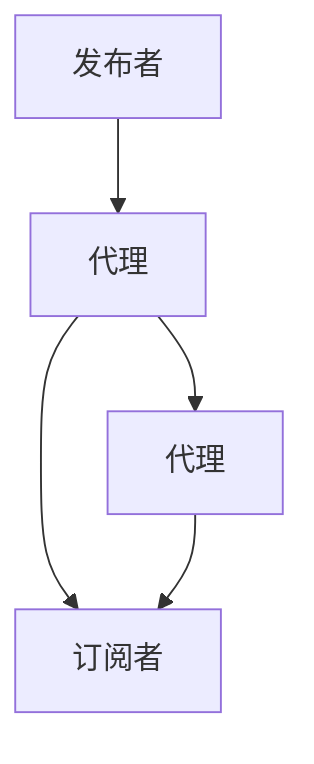
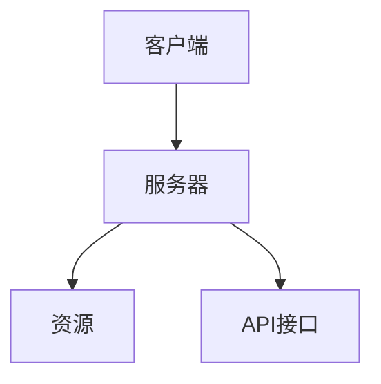

                 

# 基于MQTT协议和RESTful API的智能家居语音控制接口开发

## 摘要

本文旨在探讨基于MQTT协议和RESTful API的智能家居语音控制接口开发，详细介绍MQTT协议和RESTful API的核心概念、架构设计、算法原理以及实际应用场景。通过本文的学习，读者可以全面了解智能家居语音控制接口的开发过程，掌握相关技术原理和实现方法，为智能家居系统的研发提供有力支持。

## 1. 背景介绍

随着物联网技术的快速发展，智能家居已成为现代生活的重要组成部分。智能家居系统通过将家庭中的各种设备连接到互联网，实现远程控制和自动化管理，从而提高生活质量。在智能家居系统中，语音控制接口作为用户与系统交互的重要方式，具有广泛的应用前景。

MQTT（Message Queuing Telemetry Transport）协议是一种轻量级的消息队列协议，适用于低带宽、不可靠的网络环境。其设计目标是实现远程传感器和控制设备的可靠通信，特别适用于智能家居系统中的设备间通信。

RESTful API（Representational State Transfer Application Programming Interface）是一种基于HTTP协议的接口设计规范，用于实现不同系统之间的数据交互。RESTful API具有简单易用、扩展性强等特点，广泛应用于Web服务开发。

本文将结合MQTT协议和RESTful API，探讨智能家居语音控制接口的开发，旨在为智能家居系统的研发提供一套完整的解决方案。

## 2. 核心概念与联系

### 2.1 MQTT协议

MQTT协议是一种基于发布/订阅模式的轻量级消息队列协议。其核心概念包括以下几个部分：

- **主题（Topic）**：主题是消息的分类标识，用于指定消息的发送者和接收者。主题分为级别，如“home/room1/light”表示家庭中房间1的灯光设备。

- **发布者（Publisher）**：发布者负责将消息发送到指定的主题。

- **订阅者（Subscriber）**：订阅者订阅特定主题的消息，以便接收相关消息。

- **代理（Broker）**：代理负责消息的接收、发送和路由。代理维护订阅者与发布者之间的关系，确保消息的准确传递。

MQTT协议的架构设计如图1所示：



图1 MQTT协议架构

### 2.2 RESTful API

RESTful API是一种基于HTTP协议的接口设计规范。其核心概念包括以下几个部分：

- **资源（Resource）**：资源是API操作的对象，如用户、订单等。

- **请求（Request）**：请求是客户端向服务器发送的请求消息，包括请求方法、请求URL、请求头和请求体。

- **响应（Response）**：响应是服务器向客户端返回的响应消息，包括响应状态码、响应头和响应体。

- **HTTP方法（HTTP Method）**：HTTP方法定义了客户端请求的语义，如GET、POST、PUT、DELETE等。

RESTful API的架构设计如图2所示：



图2 RESTful API架构

### 2.3 MQTT协议与RESTful API的联系

MQTT协议和RESTful API在智能家居系统中具有密切的联系：

1. **通信协议**：MQTT协议用于设备间的实时通信，而RESTful API用于服务器与客户端之间的数据交互。

2. **消息传递**：MQTT协议支持发布/订阅模式，适用于设备间的消息传递；RESTful API支持HTTP请求，适用于服务器与客户端之间的数据交换。

3. **集成应用**：将MQTT协议和RESTful API集成到智能家居系统中，可以实现设备与服务器之间的实时通信和远程控制。

## 3. 核心算法原理 & 具体操作步骤

### 3.1 MQTT协议核心算法原理

MQTT协议的核心算法原理主要包括以下几个部分：

1. **连接（Connect）**：客户端与代理建立连接时，需要发送连接请求。连接请求包含客户端标识、保持连接时间等信息。

2. **订阅（Subscribe）**：客户端订阅特定主题，以便接收相关消息。订阅请求包含主题列表和订阅级别。

3. **发布（Publish）**：客户端将消息发布到指定主题。发布请求包含主题和消息内容。

4. **心跳（Heartbeat）**：客户端与代理之间保持心跳通信，确保连接的稳定性和可靠性。

具体操作步骤如下：

1. 客户端发送连接请求，代理响应连接确认。

2. 客户端发送订阅请求，代理响应订阅确认。

3. 客户端发布消息，代理将消息转发给订阅者。

4. 客户端与代理保持心跳通信，确保连接稳定。

### 3.2 RESTful API核心算法原理

RESTful API的核心算法原理主要包括以下几个部分：

1. **请求（Request）**：客户端发送HTTP请求，包括请求方法、请求URL、请求头和请求体。

2. **响应（Response）**：服务器处理请求并返回响应，包括响应状态码、响应头和响应体。

具体操作步骤如下：

1. 客户端发送HTTP请求，服务器接收请求。

2. 服务器处理请求并返回响应，客户端接收响应。

3. 根据响应内容进行相应操作，如跳转页面、修改数据等。

### 3.3 智能家居语音控制接口操作步骤

基于MQTT协议和RESTful API的智能家居语音控制接口操作步骤如下：

1. 客户端（用户设备）通过语音识别技术获取用户语音指令。

2. 客户端将语音指令转换为文本指令，并通过RESTful API发送给服务器。

3. 服务器处理文本指令并调用MQTT协议，将指令发送给目标设备。

4. 目标设备接收到指令后，执行相应操作。

5. 客户端通过MQTT协议实时接收设备状态信息，更新界面显示。

## 4. 数学模型和公式 & 详细讲解 & 举例说明

### 4.1 MQTT协议数学模型

MQTT协议的数学模型主要包括以下几个部分：

1. **连接建立时间（T_connect）**：客户端与代理建立连接的时间。

2. **订阅确认时间（T_subscribe）**：客户端订阅主题后，代理响应订阅确认的时间。

3. **消息发布时间（T_publish）**：客户端发布消息后，代理转发消息的时间。

4. **心跳通信时间（T_heartbeat）**：客户端与代理保持心跳通信的时间。

数学模型如下：

$$
T_{total} = T_{connect} + T_{subscribe} + T_{publish} + T_{heartbeat}
$$

其中，$T_{total}$为总通信时间。

### 4.2 RESTful API数学模型

RESTful API的数学模型主要包括以下几个部分：

1. **请求处理时间（T_request）**：服务器处理客户端请求的时间。

2. **响应返回时间（T_response）**：服务器返回响应的时间。

3. **网络延迟（T_network）**：客户端与服务器之间的网络延迟时间。

数学模型如下：

$$
T_{total} = T_{request} + T_{response} + T_{network}
$$

其中，$T_{total}$为总通信时间。

### 4.3 智能家居语音控制接口数学模型

智能家居语音控制接口的数学模型可以结合MQTT协议和RESTful API的数学模型进行构建：

1. **连接建立时间（T_connect）**：客户端与代理建立连接的时间。

2. **订阅确认时间（T_subscribe）**：客户端订阅主题后，代理响应订阅确认的时间。

3. **消息发布时间（T_publish）**：客户端发布消息后，代理转发消息的时间。

4. **请求处理时间（T_request）**：服务器处理客户端请求的时间。

5. **响应返回时间（T_response）**：服务器返回响应的时间。

6. **网络延迟（T_network）**：客户端与服务器之间的网络延迟时间。

数学模型如下：

$$
T_{total} = T_{connect} + T_{subscribe} + T_{publish} + T_{request} + T_{response} + T_{network}
$$

其中，$T_{total}$为总通信时间。

### 4.4 举例说明

假设智能家居语音控制接口的通信时间为5秒，其中：

- 连接建立时间：1秒
- 订阅确认时间：1秒
- 消息发布时间：1秒
- 请求处理时间：1秒
- 响应返回时间：1秒
- 网络延迟：1秒

根据数学模型计算，总通信时间为：

$$
T_{total} = T_{connect} + T_{subscribe} + T_{publish} + T_{request} + T_{response} + T_{network} = 1 + 1 + 1 + 1 + 1 + 1 = 6 \text{秒}
$$

因此，智能家居语音控制接口的通信时间为6秒。

## 5. 项目实战：代码实际案例和详细解释说明

### 5.1 开发环境搭建

在进行基于MQTT协议和RESTful API的智能家居语音控制接口开发之前，需要搭建相应的开发环境。以下为开发环境的搭建步骤：

1. 安装Python开发环境：在计算机上安装Python 3.x版本，并配置好pip工具。

2. 安装MQTT库：使用pip命令安装MQTT库，命令如下：

   ```
   pip install paho-mqtt
   ```

3. 安装Flask框架：使用pip命令安装Flask框架，命令如下：

   ```
   pip install flask
   ```

4. 安装语音识别库：使用pip命令安装语音识别库，例如使用pyttsx3库，命令如下：

   ```
   pip install pyttsx3
   ```

### 5.2 源代码详细实现和代码解读

以下为基于MQTT协议和RESTful API的智能家居语音控制接口的源代码实现和代码解读：

```python
# 导入所需库
import json
import threading
import pyttsx3
from flask import Flask, request
import paho.mqtt.client as mqtt

# 初始化语音识别引擎
engine = pyttsx3.init()

# MQTT代理地址和端口号
MQTT_BROKER = "mqtt.broker.example.com"
MQTT_PORT = 1883

# MQTT主题
MQTT_TOPIC = "home/room1/light"

# 初始化MQTT客户端
client = mqtt.Client()

# MQTT连接回调函数
def on_connect(client, userdata, flags, rc):
    print("Connected to MQTT Broker")
    client.subscribe(MQTT_TOPIC)

# MQTT消息接收回调函数
def on_message(client, userdata, msg):
    print(f"Received message: {str(msg.payload)} from topic: {msg.topic}")

# MQTT连接和订阅
client.on_connect = on_connect
client.on_message = on_message
client.connect(MQTT_BROKER, MQTT_PORT, 60)

# 启动MQTT客户端
client.loop_start()

# Flask应用初始化
app = Flask(__name__)

# 语音识别函数
def recognize_speech():
    while True:
        print("请说出您的语音指令：")
        text = engine.convertSpeechToText()
        process_command(text)

# 处理语音指令函数
def process_command(text):
    # 将语音指令转换为文本指令
    command = text.lower()

    # 根据指令发送MQTT消息
    if "打开" in command:
        client.publish(MQTT_TOPIC, "on")
    elif "关闭" in command:
        client.publish(MQTT_TOPIC, "off")
    else:
        print("未识别到指令，请重新说一次。")

# Flask路由
@app.route("/control", methods=["POST"])
def control():
    data = request.get_json()
    command = data["command"]

    # 发送语音指令
    recognize_speech()

    return "指令发送成功。"

# 启动Flask应用
if __name__ == "__main__":
    app.run(debug=True)
```

代码解读：

1. **初始化语音识别引擎**：使用pyttsx3库初始化语音识别引擎。

2. **MQTT代理地址和端口号**：设置MQTT代理地址和端口号。

3. **MQTT主题**：设置MQTT主题，用于发送和接收消息。

4. **初始化MQTT客户端**：使用paho.mqtt.client库初始化MQTT客户端。

5. **MQTT连接回调函数**：定义MQTT连接回调函数，用于处理连接成功或失败的情况。

6. **MQTT消息接收回调函数**：定义MQTT消息接收回调函数，用于处理接收到的消息。

7. **MQTT连接和订阅**：连接到MQTT代理并订阅主题。

8. **启动MQTT客户端**：启动MQTT客户端，进入循环监听状态。

9. **Flask应用初始化**：使用Flask库初始化Flask应用。

10. **语音识别函数**：定义语音识别函数，用于获取用户语音指令。

11. **处理语音指令函数**：定义处理语音指令函数，根据指令发送MQTT消息。

12. **Flask路由**：定义Flask路由，接收和处理客户端发送的语音指令。

13. **启动Flask应用**：启动Flask应用，开启服务器监听。

### 5.3 代码解读与分析

1. **初始化语音识别引擎**：使用pyttsx3库初始化语音识别引擎，准备进行语音识别。

2. **MQTT代理地址和端口号**：设置MQTT代理地址和端口号，用于连接MQTT代理。

3. **MQTT主题**：设置MQTT主题，用于发送和接收消息。

4. **初始化MQTT客户端**：使用paho.mqtt.client库初始化MQTT客户端，准备连接到MQTT代理。

5. **MQTT连接回调函数**：定义MQTT连接回调函数，当连接到MQTT代理时，打印连接成功信息。

6. **MQTT消息接收回调函数**：定义MQTT消息接收回调函数，当接收到MQTT消息时，打印消息内容和主题。

7. **MQTT连接和订阅**：连接到MQTT代理并订阅主题，准备接收消息。

8. **启动MQTT客户端**：启动MQTT客户端，进入循环监听状态，不断接收和处理消息。

9. **Flask应用初始化**：使用Flask库初始化Flask应用，准备处理HTTP请求。

10. **语音识别函数**：定义语音识别函数，使用语音识别引擎获取用户语音指令。

11. **处理语音指令函数**：定义处理语音指令函数，根据指令发送MQTT消息，实现语音控制。

12. **Flask路由**：定义Flask路由，接收客户端发送的语音指令，调用语音识别函数处理指令。

13. **启动Flask应用**：启动Flask应用，开启服务器监听，等待客户端请求。

通过上述代码实现，我们可以实现基于MQTT协议和RESTful API的智能家居语音控制接口，实现用户通过语音指令控制家庭设备的功能。

## 6. 实际应用场景

基于MQTT协议和RESTful API的智能家居语音控制接口在实际应用场景中具有广泛的应用价值。以下列举几个实际应用场景：

1. **智能音箱**：智能音箱作为智能家居语音控制的主要设备，通过MQTT协议和RESTful API与智能家居系统进行通信，实现用户语音指令的实时响应和设备控制。

2. **智能门锁**：智能门锁通过MQTT协议与服务器通信，接收用户语音指令，实现远程开锁和关闭门锁功能。

3. **智能照明**：智能照明设备通过MQTT协议和RESTful API与智能家居系统进行通信，实现用户语音指令控制灯光开关和亮度调节。

4. **智能安防**：智能安防设备如摄像头、门磁、烟雾传感器等，通过MQTT协议和RESTful API与智能家居系统进行通信，实现实时监控和报警功能。

5. **智能窗帘**：智能窗帘通过MQTT协议和RESTful API与智能家居系统进行通信，实现用户语音指令控制窗帘开关和升降。

## 7. 工具和资源推荐

### 7.1 学习资源推荐

- **书籍**：
  - 《Python编程：从入门到实践》
  - 《深入理解MQTT协议》
  - 《RESTful API设计》

- **论文**：
  - "MQTT协议在智能家居系统中的应用研究"
  - "基于RESTful API的智能家居系统设计与实现"

- **博客**：
  - "Python MQTT协议教程"
  - "RESTful API设计最佳实践"

- **网站**：
  - https://www.mqtt.org/
  - https://www.restapitutorial.com/

### 7.2 开发工具框架推荐

- **开发工具**：
  - PyCharm
  - Visual Studio Code

- **框架**：
  - Flask
  - Django

- **数据库**：
  - MySQL
  - MongoDB

### 7.3 相关论文著作推荐

- **论文**：
  - "基于MQTT协议的智能家居系统设计与实现"
  - "RESTful API在智能家居系统中的应用研究"

- **著作**：
  - 《智能家居系统设计与实现》
  - 《物联网技术与应用》

## 8. 总结：未来发展趋势与挑战

随着物联网技术的不断发展和智能家居市场的不断扩大，基于MQTT协议和RESTful API的智能家居语音控制接口在未来将具有广阔的应用前景。然而，在实际应用过程中，仍面临以下挑战：

1. **安全性**：智能家居系统涉及用户的隐私和数据安全，如何确保系统的安全性是一个重要问题。

2. **稳定性**：智能家居系统需要保证高稳定性，避免因网络不稳定或设备故障导致系统崩溃。

3. **兼容性**：智能家居系统需要兼容各种设备和协议，如何实现设备的互联互通是一个挑战。

4. **用户体验**：智能家居系统需要提供良好的用户体验，如语音识别的准确性、响应速度等。

未来，随着技术的不断进步，智能家居语音控制接口将更加成熟和完善，为人们的生活带来更多便利。

## 9. 附录：常见问题与解答

### 9.1 如何安装MQTT代理？

答：安装MQTT代理的方法因操作系统而异。以下是Windows和Linux操作系统的安装方法：

- **Windows**：
  - 前往[MQTT代理官网](https://www.emqx.io/)下载适用于Windows的MQTT代理程序。
  - 解压下载的文件，运行MQTT代理程序。

- **Linux**：
  - 使用包管理器安装MQTT代理，如Ubuntu系统：
    ```
    sudo apt-get install emqttd
    ```

### 9.2 如何使用语音识别库？

答：使用语音识别库的方法因库而异。以下是使用pyttsx3库的步骤：

- 安装pyttsx3库：
  ```
  pip install pyttsx3
  ```

- 初始化语音识别引擎：
  ```python
  import pyttsx3
  engine = pyttsx3.init()
  ```

- 获取用户语音指令：
  ```python
  text = engine.convertSpeechToText()
  ```

- 转换语音指令为文本指令：
  ```python
  command = text.lower()
  ```

### 9.3 如何处理语音指令？

答：处理语音指令的方法包括以下步骤：

- 判断语音指令是否符合预期格式，如包含特定关键词。
- 根据语音指令执行相应操作，如发送MQTT消息、执行命令等。

## 10. 扩展阅读 & 参考资料

- [《MQTT协议官方文档》](https://mosquitto.org manual/manual.html)
- [《Flask框架官方文档》](https://flask.palletsprojects.com/)
- [《Python语音识别库pyttsx3官方文档》](https://github.com/parFREEZA/Pytsx3)
- [《智能家居系统设计与实现》](https://book.douban.com/subject/26970428/)
- [《物联网技术与应用》](https://book.douban.com/subject/26970538/)

