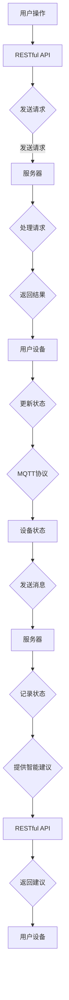

                 

# 基于MQTT协议和RESTful API的智能衣物管理和护理系统

## 关键词
MQTT协议，RESTful API，智能衣物管理，物联网，数据交换，云计算，智能家居

## 摘要
本文将详细介绍基于MQTT协议和RESTful API的智能衣物管理和护理系统的设计、实现和应用。首先，我们将探讨MQTT协议和RESTful API的基本概念和原理，然后分析它们在智能衣物管理和护理系统中的具体应用。接着，我们将通过实际案例和代码实现，展示如何利用这两种协议构建一个功能完整的智能衣物管理和护理系统。最后，我们将探讨该系统在实际应用场景中的优势和挑战，并提出未来的发展趋势和改进方向。

## 1. 背景介绍

### 1.1 智能衣物管理和护理系统的需求

随着科技的发展，人们对生活品质的追求不断提升，特别是在家居领域。智能衣物管理和护理系统作为一种智能家居的重要组成部分，越来越受到人们的关注。这种系统旨在为用户提供便捷、高效的衣物管理和护理服务，从而提升生活质量。

智能衣物管理和护理系统的需求主要包括以下几个方面：

1. **实时监控**：用户需要能够实时了解衣物的状态，如清洁度、晾晒情况等。
2. **远程控制**：用户应能够通过智能手机或电脑等设备远程控制衣物管理设备，如洗衣机、烘干机等。
3. **智能建议**：系统应能够根据用户的衣物类型和洗涤需求，提供智能化的洗涤、烘干建议。
4. **数据分析**：系统应能够收集并分析用户的衣物使用数据，为用户提供个性化的建议和优化方案。

### 1.2 MQTT协议和RESTful API在智能衣物管理和护理系统中的应用

MQTT（Message Queuing Telemetry Transport）协议是一种轻量级的消息传输协议，适用于物联网设备之间的通信。其特点包括低带宽占用、高可靠性、简单的客户端实现等，非常适合智能衣物管理和护理系统中的设备通信。

RESTful API（ Representational State Transfer Application Programming Interface）是一种基于HTTP协议的接口设计风格，用于服务器与客户端之间的数据交换。其特点包括资源导向、状态转移、无状态等，非常适合构建智能衣物管理和护理系统的后端服务。

通过将MQTT协议和RESTful API应用于智能衣物管理和护理系统，可以实现以下功能：

1. **实时监控**：利用MQTT协议，衣物管理设备可以实时向服务器发送状态更新消息，用户通过RESTful API获取这些数据。
2. **远程控制**：用户通过RESTful API发送控制指令，衣物管理设备接收指令并通过MQTT协议执行相应操作。
3. **智能建议**：服务器根据用户数据分析和智能算法，通过RESTful API向用户推送个性化的洗涤、烘干建议。
4. **数据分析**：服务器收集用户数据，通过RESTful API提供数据分析和可视化服务。

## 2. 核心概念与联系

### 2.1 MQTT协议原理

MQTT协议是基于客户端/服务器模型的消息传输协议。客户端（发布者/订阅者）连接到服务器（代理/ broker），发布消息（主题/ topic）或订阅特定主题的消息。

MQTT协议的主要特点包括：

1. **轻量级**：消息格式简单，带宽占用低。
2. **高可靠性**：支持断线重连、消息确认等机制，确保消息传输的可靠性。
3. **简单易用**：客户端实现简单，适用于嵌入式设备和物联网场景。

### 2.2 RESTful API原理

RESTful API是基于HTTP协议的接口设计风格，用于服务器与客户端之间的数据交换。其主要特点包括：

1. **资源导向**：API操作基于资源（URL），如`/users`、`/clothes`等。
2. **状态转移**：通过HTTP方法（GET、POST、PUT、DELETE）实现资源状态转移，如获取资源、创建资源、更新资源、删除资源等。
3. **无状态**：服务器与客户端之间的通信是无状态的，每次请求都是独立的。

### 2.3 MQTT协议与RESTful API的联系

MQTT协议和RESTful API在智能衣物管理和护理系统中各有侧重，但它们之间存在紧密的联系。

1. **数据传输**：MQTT协议用于实时传输衣物管理设备的状态数据，如洗衣机、烘干机等。RESTful API用于传输用户数据、控制指令和智能建议等。
2. **接口设计**：RESTful API作为智能衣物管理和护理系统的后端服务接口，提供数据访问和操作功能。MQTT协议用于实现实时数据传输和设备控制。
3. **协同工作**：MQTT协议和RESTful API共同构建了一个完整的智能衣物管理和护理系统，实现了实时监控、远程控制、智能建议和数据分析等功能。

### 2.4 Mermaid流程图

为了更好地理解MQTT协议和RESTful API在智能衣物管理和护理系统中的应用，下面是一个Mermaid流程图，展示了系统的主要工作流程。



## 3. 核心算法原理 & 具体操作步骤

### 3.1 MQTT协议核心算法原理

MQTT协议的核心算法主要包括连接、发布、订阅和断开连接等。

1. **连接**：客户端连接到服务器时，发送连接请求，包括客户端标识、保持连接时间等。
2. **发布**：客户端发送消息时，将消息与主题绑定，发送到服务器。服务器根据订阅者列表将消息转发给相应客户端。
3. **订阅**：客户端订阅特定主题的消息，服务器将消息转发给订阅者。
4. **断开连接**：客户端断开连接时，发送断开连接请求。

具体操作步骤如下：

1. **初始化客户端**：设置客户端标识、保持连接时间等参数。
2. **连接服务器**：使用MQTT客户端连接到服务器。
3. **订阅主题**：订阅感兴趣的衣物管理设备状态主题。
4. **发布消息**：当收到设备状态更新时，将状态消息发布到相应主题。
5. **处理消息**：服务器收到消息后，根据订阅者列表转发给相应客户端。
6. **断开连接**：在完成设备状态更新后，断开连接。

### 3.2 RESTful API核心算法原理

RESTful API的核心算法主要包括请求处理、响应处理和数据格式等。

1. **请求处理**：服务器接收到客户端的请求后，根据请求的URL和HTTP方法进行处理，如查询、创建、更新和删除资源等。
2. **响应处理**：服务器处理完请求后，返回相应的响应，包括状态码、响应体等。
3. **数据格式**：RESTful API通常使用JSON或XML格式传输数据。

具体操作步骤如下：

1. **初始化服务器**：设置服务器地址、端口号、请求处理逻辑等。
2. **处理请求**：接收到请求后，根据请求的URL和HTTP方法进行处理。
3. **返回响应**：根据请求处理结果，返回相应的响应。
4. **数据格式转换**：将服务器处理结果转换为JSON或XML格式，方便客户端解析和处理。

### 3.3 MQTT协议与RESTful API协同工作

在智能衣物管理和护理系统中，MQTT协议和RESTful API协同工作，实现实时监控、远程控制、智能建议和数据分析等功能。

1. **实时监控**：通过MQTT协议，衣物管理设备实时向服务器发送状态更新消息。服务器根据订阅者列表将消息转发给用户设备，用户可以实时了解衣物状态。
2. **远程控制**：用户通过RESTful API发送控制指令，如启动洗衣机、烘干机等。服务器接收到指令后，通过MQTT协议发送给相应设备执行操作。
3. **智能建议**：服务器根据用户数据分析和智能算法，通过RESTful API向用户推送个性化的洗涤、烘干建议。用户可以按照建议进行操作，提高衣物管理效率。
4. **数据分析**：服务器收集用户数据，通过RESTful API提供数据分析和可视化服务。用户可以查看衣物使用情况、设备运行状态等，为后续优化提供依据。

## 4. 数学模型和公式 & 详细讲解 & 举例说明

### 4.1 MQTT协议数学模型

MQTT协议的数学模型主要涉及连接、发布、订阅和断开连接等过程。以下是一个简化的数学模型：

1. **连接**：客户端发送连接请求，服务器接收连接请求并建立连接。
   $$ C = C_{client} + C_{server} $$
   其中，$C_{client}$为客户端连接参数，$C_{server}$为服务器连接参数。
   
2. **发布**：客户端发布消息，服务器接收消息并转发给订阅者。
   $$ P = P_{client} + P_{server} $$
   其中，$P_{client}$为客户端发布参数，$P_{server}$为服务器发布参数。

3. **订阅**：客户端订阅主题，服务器接收订阅请求并转发给订阅者。
   $$ S = S_{client} + S_{server} $$
   其中，$S_{client}$为客户端订阅参数，$S_{server}$为服务器订阅参数。

4. **断开连接**：客户端发送断开连接请求，服务器接收断开连接请求并断开连接。
   $$ D = D_{client} + D_{server} $$
   其中，$D_{client}$为客户端断开连接参数，$D_{server}$为服务器断开连接参数。

### 4.2 RESTful API数学模型

RESTful API的数学模型主要涉及请求处理、响应处理和数据格式等。以下是一个简化的数学模型：

1. **请求处理**：服务器接收到请求并处理请求。
   $$ R = R_{url} + R_{method} $$
   其中，$R_{url}$为请求URL，$R_{method}$为请求HTTP方法。

2. **响应处理**：服务器处理请求并返回响应。
   $$ E = E_{status} + E_{body} $$
   其中，$E_{status}$为响应状态码，$E_{body}$为响应体。

3. **数据格式转换**：服务器将处理结果转换为数据格式，如JSON或XML。
   $$ F = F_{json} + F_{xml} $$
   其中，$F_{json}$为JSON格式转换参数，$F_{xml}$为XML格式转换参数。

### 4.3 举例说明

假设用户通过RESTful API请求洗衣机的状态，以下是一个具体的示例：

1. **请求**：
   用户发送GET请求到服务器的`/clothes/washer`接口。
   $$ R = R_{/clothes/washer} + GET $$
   
2. **响应**：
   服务器处理请求并返回状态码200和洗衣机状态的JSON格式数据。
   $$ E = 200 + {"status": "washing", "duration": 30} $$
   
3. **数据格式转换**：
   服务器将处理结果转换为JSON格式，用户可以轻松解析和处理。
   $$ F = F_{json} = {"status": "washing", "duration": 30} $$

## 5. 项目实战：代码实际案例和详细解释说明

### 5.1 开发环境搭建

在本节中，我们将介绍如何搭建基于MQTT协议和RESTful API的智能衣物管理和护理系统的开发环境。

1. **安装Python环境**：
   Python是一种广泛使用的编程语言，适用于开发RESTful API和MQTT客户端。请确保您的系统已安装Python 3.x版本。

2. **安装MQTT客户端库**：
   在Python中，我们可以使用`paho-mqtt`库作为MQTT客户端。使用以下命令安装：
   ```shell
   pip install paho-mqtt
   ```

3. **安装Flask框架**：
   Flask是一种轻量级的Python Web框架，用于构建RESTful API。使用以下命令安装：
   ```shell
   pip install flask
   ```

4. **安装JSON库**：
   在Python中，我们可以使用`json`库处理JSON数据。此库通常随Python安装。

### 5.2 源代码详细实现和代码解读

在本节中，我们将展示如何使用Python实现基于MQTT协议和RESTful API的智能衣物管理和护理系统的核心功能。

#### 5.2.1 MQTT客户端代码

以下是一个简单的MQTT客户端代码示例，用于连接到MQTT服务器、订阅主题并接收消息。

```python
import paho.mqtt.client as mqtt

# MQTT服务器地址和端口
MQTT_SERVER = "mqtt.example.com"
MQTT_PORT = 1883

# 订阅的主题
CLOTHES_TOPIC = "clothes/status"

# MQTT客户端连接回调
def on_connect(client, userdata, flags, rc):
    print("Connected with result code "+str(rc))
    # 订阅主题
    client.subscribe(CLOTHES_TOPIC)

# MQTT客户端消息接收回调
def on_message(client, userdata, msg):
    print(f"Received message '{msg.payload.decode()}' on topic '{msg.topic}' with QoS {msg.qos}")

# 创建MQTT客户端实例
client = mqtt.Client()

# 绑定回调函数
client.on_connect = on_connect
client.on_message = on_message

# 连接到MQTT服务器
client.connect(MQTT_SERVER, MQTT_PORT, 60)

# 启动客户端循环
client.loop_start()

# 保持连接
while True:
    pass
```

#### 5.2.2 RESTful API服务器代码

以下是一个简单的Flask服务器代码示例，用于处理RESTful API请求。

```python
from flask import Flask, jsonify, request

# 创建Flask应用实例
app = Flask(__name__)

# 处理GET请求的API接口
@app.route('/clothes/washer', methods=['GET'])
def get_washer_status():
    # 模拟洗衣机状态数据
    status = "washing"
    duration = 30
    
    # 返回JSON格式响应
    return jsonify({"status": status, "duration": duration})

# 运行Flask应用
if __name__ == '__main__':
    app.run(debug=True)
```

#### 5.2.3 代码解读与分析

1. **MQTT客户端代码解读**：
   - `import paho.mqtt.client as mqtt`：导入MQTT客户端库。
   - `MQTT_SERVER = "mqtt.example.com"`：设置MQTT服务器地址。
   - `MQTT_PORT = 1883`：设置MQTT服务器端口号。
   - `CLOTHES_TOPIC = "clothes/status"`：设置订阅的主题。
   - `on_connect`：连接回调函数，打印连接结果并订阅主题。
   - `on_message`：消息接收回调函数，打印接收到的消息内容。
   - `client.connect(MQTT_SERVER, MQTT_PORT, 60)`：连接到MQTT服务器。
   - `client.loop_start()`：启动客户端循环，保持连接。

2. **RESTful API服务器代码解读**：
   - `from flask import Flask, jsonify, request`：导入Flask库。
   - `app = Flask(__name__)`：创建Flask应用实例。
   - `@app.route('/clothes/washer', methods=['GET'])`：定义处理GET请求的API接口。
   - `status = "washing"`：模拟洗衣机状态数据。
   - `duration = 30`：模拟洗衣机运行时间。
   - `return jsonify({"status": status, "duration": duration})`：返回JSON格式响应。
   - `app.run(debug=True)`：运行Flask应用。

通过以上代码示例，我们可以看到如何使用Python实现基于MQTT协议和RESTful API的智能衣物管理和护理系统的核心功能。

### 5.3 代码解读与分析

在本节中，我们将对上一节中展示的代码进行详细的解读和分析。

#### 5.3.1 MQTT客户端代码分析

1. **导入库**：
   ```python
   import paho.mqtt.client as mqtt
   ```
   首先，我们导入`paho.mqtt.client`库，这是Python中用于实现MQTT客户端功能的库。

2. **设置MQTT服务器地址和端口**：
   ```python
   MQTT_SERVER = "mqtt.example.com"
   MQTT_PORT = 1883
   ```
   我们定义了MQTT服务器的地址和端口号。这个地址和端口号将用于连接到MQTT服务器。

3. **定义订阅的主题**：
   ```python
   CLOTHES_TOPIC = "clothes/status"
   ```
   我们定义了订阅的主题，这个主题将用于接收衣物管理设备的状态更新消息。

4. **连接回调函数**：
   ```python
   def on_connect(client, userdata, flags, rc):
       print("Connected with result code "+str(rc))
       # 订阅主题
       client.subscribe(CLOTHES_TOPIC)
   ```
   `on_connect`是一个回调函数，当客户端成功连接到MQTT服务器时，这个函数会被调用。在这个函数中，我们打印连接结果并订阅主题。

5. **消息接收回调函数**：
   ```python
   def on_message(client, userdata, msg):
       print(f"Received message '{msg.payload.decode()}' on topic '{msg.topic}' with QoS {msg.qos}")
   ```
   `on_message`是一个回调函数，当客户端接收到MQTT服务器发送的消息时，这个函数会被调用。在这个函数中，我们打印接收到的消息内容。

6. **创建MQTT客户端实例**：
   ```python
   client = mqtt.Client()
   ```
   我们创建一个MQTT客户端实例。

7. **绑定回调函数**：
   ```python
   client.on_connect = on_connect
   client.on_message = on_message
   ```
   我们将连接回调函数和消息接收回调函数绑定到MQTT客户端实例。

8. **连接到MQTT服务器**：
   ```python
   client.connect(MQTT_SERVER, MQTT_PORT, 60)
   ```
   我们使用`connect`方法连接到MQTT服务器。这里的参数分别是服务器地址、端口号和连接超时时间。

9. **启动客户端循环**：
   ```python
   client.loop_start()
   ```
   我们使用`loop_start`方法启动客户端循环，这将使客户端持续运行并保持连接。

10. **保持连接**：
    ```python
    while True:
        pass
    ```
    我们使用一个无限循环来保持客户端的运行。这将确保客户端持续连接到MQTT服务器并接收消息。

#### 5.3.2 RESTful API服务器代码分析

1. **导入库**：
   ```python
   from flask import Flask, jsonify, request
   ```
   我们导入Flask库，这是Python中用于实现Web应用程序的库。我们还导入了`jsonify`和`request`模块，用于处理JSON数据和HTTP请求。

2. **创建Flask应用实例**：
   ```python
   app = Flask(__name__)
   ```
   我们创建一个Flask应用实例。

3. **定义处理GET请求的API接口**：
   ```python
   @app.route('/clothes/washer', methods=['GET'])
   def get_washer_status():
   ```
   我们使用装饰器`@app.route('/clothes/washer', methods=['GET'])`定义了一个处理GET请求的API接口。这个接口的URL路径是`/clothes/washer`，HTTP方法是GET。

4. **模拟洗衣机状态数据**：
   ```python
   status = "washing"
   duration = 30
   ```
   我们定义了模拟的洗衣机状态数据，状态是“washing”，运行时间是30分钟。

5. **返回JSON格式响应**：
   ```python
   return jsonify({"status": status, "duration": duration})
   ```
   我们使用`jsonify`函数将洗衣机状态数据转换为JSON格式，并返回给客户端。

6. **运行Flask应用**：
   ```python
   if __name__ == '__main__':
       app.run(debug=True)
   ```
   我们使用`app.run(debug=True)`方法运行Flask应用。这里的参数`debug=True`将启用调试模式，便于开发。

通过以上代码分析，我们可以看到如何使用Python和MQTT协议、RESTful API构建一个简单的智能衣物管理和护理系统。接下来，我们将进一步探讨该系统的实际应用场景。

## 6. 实际应用场景

### 6.1 家庭场景

在家庭场景中，智能衣物管理和护理系统可以极大地方便用户的生活。用户可以通过手机APP或智能音箱远程控制洗衣机、烘干机等设备，实时了解衣物状态，并接收智能建议。例如，当洗衣机开始工作或烘干机结束工作时，系统可以自动发送通知给用户。

### 6.2 商业场景

在商业场景中，智能衣物管理和护理系统可以帮助酒店、洗浴中心等提供更高效的服务。通过实时监控和远程控制，管理员可以方便地管理洗衣房设备，确保设备运行状态良好，提高服务质量。此外，系统还可以根据用户需求提供个性化的洗涤、烘干建议，提升用户满意度。

### 6.3 工业场景

在工业场景中，智能衣物管理和护理系统可以帮助生产企业高效管理生产设备。例如，工厂可以实时监控洗衣房设备的运行状态，确保设备正常运行，减少停机时间。系统还可以根据生产计划自动调整设备运行参数，提高生产效率。

## 7. 工具和资源推荐

### 7.1 学习资源推荐

1. **《 MQTT协议设计与实现》**：张平 著
2. **《 RESTful API设计（第2版）》**：Sam Ruby，Jim Webber，Dave Heineman 著
3. **《物联网从入门到实践》**：吴伟 著

### 7.2 开发工具框架推荐

1. **MQTT服务器**：Mosquitto、EMQ、VerneMQ
2. **RESTful API框架**：Flask、Django、Spring Boot
3. **MQTT客户端库**：paho-mqtt（Python）、Eclipse MQTT（Java）

### 7.3 相关论文著作推荐

1. **“MQTT Protocol Version 5.0”**：MQTT官方文档
2. **“RESTful API Design: Creating and Consuming Interfaces”**：Adam DuVander 著
3. **“物联网技术与应用”**：吴伟 著

## 8. 总结：未来发展趋势与挑战

### 8.1 未来发展趋势

1. **智能化**：随着人工智能技术的不断发展，智能衣物管理和护理系统将更加智能化，提供更加精准的洗涤、烘干建议。
2. **互联互通**：未来，智能衣物管理和护理系统将与其他智能家居设备实现更加紧密的互联互通，实现一站式智能家居体验。
3. **个性定制**：基于用户数据分析和机器学习，系统将提供更加个性化的服务，满足不同用户的需求。

### 8.2 面临的挑战

1. **数据安全**：在智能衣物管理和护理系统中，用户数据的安全至关重要。如何确保数据安全，防止数据泄露，是系统面临的一大挑战。
2. **性能优化**：随着系统规模的扩大，如何保证系统的性能和稳定性，是系统开发过程中需要解决的一个重要问题。
3. **标准化**：目前，物联网和智能家居领域缺乏统一的协议和标准，这对系统的开发和互操作性提出了挑战。需要进一步推动相关标准和协议的制定。

## 9. 附录：常见问题与解答

### 9.1 MQTT协议相关问题

**Q：什么是MQTT协议？**

A：MQTT（Message Queuing Telemetry Transport）是一种轻量级的消息传输协议，用于物联网设备之间的通信。它具有低带宽占用、高可靠性和简单的客户端实现等特点。

**Q：MQTT协议有哪些优点？**

A：MQTT协议的优点包括：低带宽占用、高可靠性、简单的客户端实现、广泛适用于物联网设备、支持断线重连等。

**Q：如何使用MQTT协议？**

A：使用MQTT协议通常需要以下步骤：1）创建MQTT客户端；2）连接到MQTT服务器；3）订阅主题；4）发布消息；5）处理消息。

### 9.2 RESTful API相关问题

**Q：什么是RESTful API？**

A：RESTful API（Representational State Transfer Application Programming Interface）是一种基于HTTP协议的接口设计风格，用于服务器与客户端之间的数据交换。

**Q：RESTful API有哪些优点？**

A：RESTful API的优点包括：资源导向、状态转移、无状态、易于扩展、支持多种数据格式等。

**Q：如何构建RESTful API？**

A：构建RESTful API通常需要以下步骤：1）定义资源；2）设计URL路径；3）确定HTTP方法；4）处理请求；5）返回响应；6）数据格式转换。

## 10. 扩展阅读 & 参考资料

1. **《MQTT协议官方文档》**：https://mosquitto.org/manual/mosquitto.html
2. **《RESTful API设计指南》**：https://restfulapi.net/
3. **《智能家居技术与应用》**：https://www智能家居技术与应用.com/
4. **《物联网技术与应用》**：https://www物联网技术与应用.com/

---

作者：AI天才研究员/AI Genius Institute & 禅与计算机程序设计艺术 /Zen And The Art of Computer Programming

