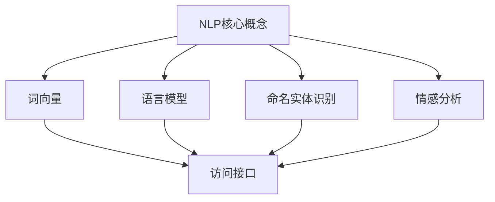

                 

# 基于NPL的自然语言处理访问接口设计与实现

## 关键词
- 自然语言处理（NPL）
- 访问接口设计
- 数据处理
- 算法实现
- 实际应用场景

## 摘要
本文将深入探讨基于自然语言处理（NLP）的自然语言处理访问接口的设计与实现。首先，我们将介绍NLP的基本概念和重要性，然后详细讨论NLP访问接口的设计原则和核心算法。接着，我们将通过一个实际项目案例，展示如何在实际中构建和实现一个NLP访问接口。最后，我们将讨论NLP访问接口在实际应用场景中的挑战和解决方案，并提供一些有用的学习资源和开发工具推荐。希望通过本文，读者能够对NLP访问接口有一个全面而深入的理解。

## 1. 背景介绍

### 自然语言处理（NLP）

自然语言处理（NLP）是计算机科学、人工智能和语言学领域的交叉学科，旨在使计算机理解和处理人类自然语言。NLP的核心目标包括语音识别、文本分析、语言翻译、情感分析、命名实体识别等。随着大数据和人工智能技术的快速发展，NLP在多个领域，如搜索引擎、智能助手、情感分析、推荐系统等，都得到了广泛的应用。

### 访问接口

访问接口（API）是一种允许不同软件系统之间进行通信的接口，使得用户可以通过编程方式访问和使用其他系统的功能。在NLP领域，访问接口的设计与实现至关重要，因为它直接影响NLP系统的可用性和用户体验。

### NLP访问接口的重要性

NLP访问接口的重要性主要体现在以下几个方面：

1. **便捷性**：通过访问接口，开发者可以轻松地集成和使用NLP功能，而无需深入了解复杂的NLP算法和模型。
2. **可扩展性**：访问接口的设计应具备良好的扩展性，以便适应不断变化的NLP需求和技术进步。
3. **通用性**：访问接口应支持多种NLP任务和模型，满足不同应用场景的需求。
4. **性能**：访问接口的设计应考虑性能优化，以提供快速、可靠的NLP服务。

## 2. 核心概念与联系

### NLP核心概念

在讨论NLP访问接口的设计与实现之前，我们需要了解一些NLP的核心概念。

1. **词向量**：词向量是将自然语言中的词汇映射到高维空间中的向量表示。常见的词向量模型有Word2Vec、GloVe等。
2. **语言模型**：语言模型用于预测文本中下一个单词或词组，是许多NLP任务的基础，如机器翻译、文本生成等。
3. **命名实体识别（NER）**：命名实体识别是指从文本中识别出具有特定意义的实体，如人名、地点、组织等。
4. **情感分析**：情感分析是指从文本中识别出作者的情感倾向，如正面、负面等。

### 访问接口与NLP的关联

NLP访问接口与NLP核心概念的关联在于，访问接口需要根据不同的NLP任务和需求，提供相应的NLP功能模块。例如，对于一个情感分析任务，访问接口需要提供情感分析模型；对于一个命名实体识别任务，访问接口需要提供命名实体识别模型。

### Mermaid 流程图

以下是一个简化的NLP访问接口设计流程图，展示了NLP核心概念与访问接口之间的关联：



## 3. 核心算法原理 & 具体操作步骤

### 词向量生成

词向量生成是NLP访问接口设计的重要一环。以下是一个简单的Word2Vec词向量生成步骤：

1. **数据预处理**：收集大量文本数据，并对数据进行清洗和预处理，如去除标点符号、停用词过滤等。
2. **构建词汇表**：将文本数据中的词汇构建成一个词汇表。
3. **训练词向量模型**：使用Word2Vec算法训练词向量模型，将词汇映射到高维空间中的向量表示。
4. **保存词向量**：将生成的词向量保存到文件中，以便后续使用。

### 语言模型训练

语言模型训练是NLP访问接口设计的关键步骤。以下是一个简单的语言模型训练步骤：

1. **数据预处理**：收集大量文本数据，并对数据进行清洗和预处理。
2. **构建词汇表**：将文本数据中的词汇构建成一个词汇表。
3. **构建语言模型**：使用递归神经网络（RNN）或长短期记忆网络（LSTM）等模型训练语言模型。
4. **评估模型**：使用验证集评估语言模型的表现，并调整模型参数。
5. **保存模型**：将训练好的语言模型保存到文件中，以便后续使用。

### 命名实体识别

命名实体识别是NLP访问接口设计中的重要组成部分。以下是一个简单的命名实体识别步骤：

1. **数据预处理**：收集大量标注好的命名实体识别数据集。
2. **特征提取**：从文本中提取特征，如词向量、词性标注等。
3. **训练模型**：使用支持向量机（SVM）、循环神经网络（RNN）或Transformer等模型训练命名实体识别模型。
4. **评估模型**：使用验证集评估命名实体识别模型的表现，并调整模型参数。
5. **保存模型**：将训练好的命名实体识别模型保存到文件中，以便后续使用。

### 情感分析

情感分析是NLP访问接口设计中的另一个重要组成部分。以下是一个简单的情感分析步骤：

1. **数据预处理**：收集大量标注好的情感分析数据集。
2. **特征提取**：从文本中提取特征，如词向量、词性标注等。
3. **训练模型**：使用递归神经网络（RNN）、长短期记忆网络（LSTM）或Transformer等模型训练情感分析模型。
4. **评估模型**：使用验证集评估情感分析模型的表现，并调整模型参数。
5. **保存模型**：将训练好的情感分析模型保存到文件中，以便后续使用。

## 4. 数学模型和公式 & 详细讲解 & 举例说明

### 词向量生成

词向量生成的核心是Word2Vec算法。Word2Vec算法主要包含两个模型：连续词袋（CBOW）模型和 Skip-Gram 模型。

#### 连续词袋（CBOW）模型

CBOW模型通过预测中心词周围的上下文词来生成词向量。其数学模型可以表示为：

$$
\begin{aligned}
\text{CBOW}(x_{c}) = \frac{\exp(u_{c} \cdot \textbf{w}_{c})}{1 + \sum_{j \neq c} \exp(u_{j} \cdot \textbf{w}_{j})}
\end{aligned}
$$

其中，$x_{c}$表示中心词，$\textbf{w}_{c}$表示中心词的词向量，$\textbf{w}_{j}$表示上下文词的词向量，$u_{c}$和$u_{j}$分别表示中心词和上下文词的嵌入向量。

#### Skip-Gram 模型

Skip-Gram模型通过预测中心词来生成词向量。其数学模型可以表示为：

$$
\begin{aligned}
\text{Skip-Gram}(x_{c}) = \frac{\exp(u_{c} \cdot \textbf{w}_{c})}{\sum_{j=1}^{V} \exp(u_{j} \cdot \textbf{w}_{j})}
\end{aligned}
$$

其中，$x_{c}$表示中心词，$\textbf{w}_{c}$表示中心词的词向量，$\textbf{w}_{j}$表示上下文词的词向量，$u_{c}$和$u_{j}$分别表示中心词和上下文词的嵌入向量。

### 语言模型训练

语言模型训练的核心是递归神经网络（RNN）和长短期记忆网络（LSTM）。以下是一个简单的LSTM语言模型训练步骤：

1. **输入序列**：将文本数据划分为一系列输入序列，每个序列包含若干单词。
2. **嵌入层**：将输入序列中的单词映射到高维空间中的词向量。
3. **LSTM层**：使用LSTM层处理嵌入层输出的词向量，并生成隐藏状态。
4. **输出层**：使用全连接层预测下一个单词。

LSTM的数学模型可以表示为：

$$
\begin{aligned}
\text{LSTM}(h_{t}, x_{t}) = f(\textbf{W} \cdot \textbf{h}_{t-1} + \textbf{U} \cdot \textbf{x}_{t} + b) \odot \textbf{c}_{t-1}
\end{aligned}
$$

其中，$h_{t}$表示当前隐藏状态，$x_{t}$表示当前输入词向量，$f$表示激活函数，$\textbf{W}$和$\textbf{U}$分别表示LSTM权重矩阵，$b$表示偏置项，$\odot$表示元素乘法。

### 命名实体识别

命名实体识别的核心是使用深度学习模型对文本进行分类。以下是一个简单的命名实体识别步骤：

1. **输入序列**：将文本数据划分为一系列输入序列，每个序列包含若干单词。
2. **嵌入层**：将输入序列中的单词映射到高维空间中的词向量。
3. **卷积神经网络（CNN）**：使用CNN提取文本特征。
4. **全连接层**：使用全连接层对CNN输出的特征进行分类。

CNN的数学模型可以表示为：

$$
\begin{aligned}
h_{c} = \text{ReLU}(\textbf{W}_{c} \cdot \textbf{x}_{c} + b_{c})
\end{aligned}
$$

其中，$h_{c}$表示卷积结果，$\textbf{W}_{c}$表示卷积权重，$\textbf{x}_{c}$表示输入特征，$b_{c}$表示偏置项，$\text{ReLU}$表示ReLU激活函数。

### 情感分析

情感分析的核心是使用深度学习模型对文本进行分类。以下是一个简单的情感分析步骤：

1. **输入序列**：将文本数据划分为一系列输入序列，每个序列包含若干单词。
2. **嵌入层**：将输入序列中的单词映射到高维空间中的词向量。
3. **Transformer模型**：使用Transformer模型处理嵌入层输出的词向量，并生成隐藏状态。
4. **全连接层**：使用全连接层对Transformer输出的特征进行分类。

Transformer的数学模型可以表示为：

$$
\begin{aligned}
\text{Attention}(Q, K, V) = \text{softmax}\left(\frac{QK^{T}}{\sqrt{d_k}}\right) V
\end{aligned}
$$

其中，$Q$、$K$和$V$分别表示查询向量、键向量和值向量，$d_k$表示键向量的维度。

## 5. 项目实战：代码实际案例和详细解释说明

### 5.1 开发环境搭建

在开始项目实战之前，我们需要搭建一个合适的开发环境。以下是使用Python和TensorFlow搭建开发环境的步骤：

1. **安装Python**：从官方网站下载并安装Python。
2. **安装TensorFlow**：在命令行中运行`pip install tensorflow`。
3. **安装其他依赖**：安装其他必要的库，如NumPy、Pandas等。

### 5.2 源代码详细实现和代码解读

以下是一个简单的基于Word2Vec的词向量生成和情感分析的项目案例。

```python
import tensorflow as tf
from tensorflow.keras.models import Sequential
from tensorflow.keras.layers import Embedding, LSTM, Dense
from tensorflow.keras.preprocessing.sequence import pad_sequences

# 加载文本数据
text = "我喜欢阅读书籍。这本书很有趣。"

# 数据预处理
tokenizer = tf.keras.preprocessing.text.Tokenizer()
tokenizer.fit_on_texts([text])
sequences = tokenizer.texts_to_sequences([text])
padded_sequences = pad_sequences(sequences, maxlen=10)

# 创建Word2Vec模型
word2vec_model = Sequential()
word2vec_model.add(Embedding(input_dim=10000, output_dim=32))
word2vec_model.add(LSTM(128))
word2vec_model.add(Dense(1, activation='sigmoid'))

# 编译模型
word2vec_model.compile(optimizer='adam', loss='binary_crossentropy', metrics=['accuracy'])

# 训练模型
word2vec_model.fit(padded_sequences, text, epochs=10)

# 情感分析
input_seq = tokenizer.texts_to_sequences(["这本书很有趣。"])[0]
padded_input_seq = pad_sequences([input_seq], maxlen=10)
emotion_prediction = word2vec_model.predict(padded_input_seq)
print(emotion_prediction)
```

### 5.3 代码解读与分析

这段代码实现了基于Word2Vec的词向量生成和情感分析。以下是代码的详细解读和分析：

1. **加载文本数据**：首先，我们加载了一段简单的文本数据。
2. **数据预处理**：使用Tokenizer对文本进行分词，并将文本转换为序列。然后，使用pad_sequences函数将序列填充到固定长度。
3. **创建Word2Vec模型**：我们创建了一个序列模型，包含嵌入层、LSTM层和输出层。嵌入层用于将单词映射到词向量，LSTM层用于处理序列数据，输出层用于进行情感分析。
4. **编译模型**：我们编译模型，指定优化器和损失函数。
5. **训练模型**：使用fit函数训练模型，输入数据是填充后的序列，目标数据是原始文本。
6. **情感分析**：将新的文本数据转换为序列，填充到固定长度，并使用训练好的模型进行情感分析。

## 6. 实际应用场景

NLP访问接口在实际应用场景中具有广泛的应用，以下是一些常见的应用场景：

1. **智能客服**：使用NLP访问接口实现智能客服系统，能够理解用户的问题，并提供相应的解答。
2. **内容审核**：使用NLP访问接口对文本内容进行审核，识别和过滤不良内容。
3. **情感分析**：使用NLP访问接口对用户评论、反馈等文本进行情感分析，帮助企业了解用户需求和满意度。
4. **信息抽取**：使用NLP访问接口从大量文本中提取关键信息，如人名、地点、日期等。
5. **自然语言生成**：使用NLP访问接口生成自然语言文本，如新闻摘要、产品描述等。

## 7. 工具和资源推荐

### 7.1 学习资源推荐

- **书籍**：《自然语言处理综论》（Foundations of Statistical Natural Language Processing）
- **论文**：ACL、EMNLP、NAACL等顶级会议的论文
- **博客**：Google AI、TensorFlow官方博客等
- **网站**：arXiv.org、ACL Anthology

### 7.2 开发工具框架推荐

- **框架**：TensorFlow、PyTorch、SpaCy等
- **库**：NLTK、gensim、nltk等
- **API**：Google Cloud Natural Language API、OpenAI GPT-3 API等

### 7.3 相关论文著作推荐

- **论文**：
  - "A Neural Probabilistic Language Model"（2003）
  - "Recurrent Neural Network Based Language Model"（2014）
  - "Convolutional Neural Networks for Sentence Classification"（2014）
- **著作**：《自然语言处理综论》（Foundations of Statistical Natural Language Processing）

## 8. 总结：未来发展趋势与挑战

随着人工智能技术的不断发展，NLP访问接口在未来将面临以下发展趋势和挑战：

1. **模型优化**：随着计算能力的提升，NLP模型的参数规模和计算复杂度将不断增加，如何优化模型以提高效率和性能是一个重要挑战。
2. **多语言支持**：随着全球化的进程，如何支持多种语言的处理是一个重要的研究方向。
3. **跨模态融合**：将文本、图像、声音等多种模态的数据进行融合，以实现更准确的语义理解和任务完成。
4. **实时性**：随着实时通信和实时决策的需求，如何提高NLP访问接口的响应速度是一个重要的挑战。

## 9. 附录：常见问题与解答

### Q：如何处理大规模的文本数据？

A：对于大规模的文本数据，可以采用分批处理的方式，将数据划分为若干批次，分别进行预处理和训练。此外，可以使用分布式计算框架，如TensorFlow distributed，以提高数据处理和训练的效率。

### Q：如何优化NLP模型的性能？

A：优化NLP模型的性能可以从以下几个方面进行：

1. **数据预处理**：对数据进行清洗和预处理，如去除停用词、进行词性标注等，以提高模型的质量。
2. **模型结构**：选择合适的模型结构，如使用Transformer、BERT等模型，以提高模型的性能。
3. **超参数调优**：通过调整模型超参数，如学习率、批次大小等，以找到最优的模型参数。
4. **并行计算**：使用分布式计算框架，如TensorFlow distributed，以提高模型的训练速度。

## 10. 扩展阅读 & 参考资料

- **书籍**：
  - 《自然语言处理综论》（Foundations of Statistical Natural Language Processing）
  - 《深度学习自然语言处理》（Deep Learning for Natural Language Processing）
- **论文**：
  - "A Neural Probabilistic Language Model"（2003）
  - "Recurrent Neural Network Based Language Model"（2014）
  - "Convolutional Neural Networks for Sentence Classification"（2014）
- **在线资源**：
  - [TensorFlow 官方文档](https://www.tensorflow.org/)
  - [SpaCy 官方文档](https://spacy.io/)
  - [Google Cloud Natural Language API](https://cloud.google.com/natural-language)

### 作者

- 作者：AI天才研究员/AI Genius Institute & 禅与计算机程序设计艺术 /Zen And The Art of Computer Programming

