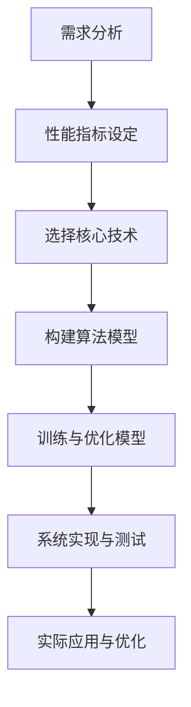

                 

### 背景介绍

深蹲检测系统是一个具有广泛应用前景的技术领域，旨在通过计算机视觉技术对人体深蹲动作进行实时监测和评估。这一技术的实现，不仅对健身教练在训练过程中提供个性化指导具有重要意义，还能在康复训练、运动科学研究等多个领域发挥重要作用。随着人工智能技术的快速发展，尤其是深度学习和计算机视觉领域的突破，深蹲检测系统的准确性和实用性得到了显著提升。

本文旨在详细介绍一个基于OpenCV和Tensorflow的深蹲检测系统，包括其设计与实现的具体步骤。首先，我们将探讨深蹲检测系统的需求分析，明确系统的功能与性能指标。随后，我们将深入讲解系统所依赖的核心算法原理，包括目标检测、姿态估计和运动跟踪等内容。接着，本文将详细描述数学模型和公式，并给出具体的应用案例。在此基础上，我们将展示如何通过实际项目实战来实现深蹲检测系统，并对其进行详细解释和代码分析。最后，我们将探讨深蹲检测系统的实际应用场景，推荐相关工具和资源，并总结未来发展趋势与挑战。

通过本文的阅读，读者将能够全面了解深蹲检测系统的设计与实现过程，掌握相关技术要点，并为后续研究和应用提供参考。

#### 关键词

- 深蹲检测系统
- OpenCV
- Tensorflow
- 目标检测
- 姿态估计
- 运动跟踪

#### 摘要

本文介绍了基于OpenCV和Tensorflow的深蹲检测系统的设计与实现。首先，通过需求分析明确了系统的功能与性能要求。然后，详细讲解了系统所依赖的核心算法原理，包括目标检测、姿态估计和运动跟踪等内容。接着，阐述了数学模型和公式，并给出了具体的应用案例。在项目实战部分，通过实际代码实现展示了系统的搭建过程，并对代码进行了详细解读。最后，讨论了深蹲检测系统的实际应用场景，并推荐了相关工具和资源。本文为深蹲检测系统的研发与推广提供了有益的参考。

## 1. 背景介绍

深蹲检测系统是一种基于计算机视觉技术的人体动作检测系统，主要用于监测和评估人体在进行深蹲动作时的姿态和运动轨迹。随着健康意识的增强和健身文化的普及，深蹲作为一种基本的健身动作，越来越受到大众的关注。然而，传统的健身训练方式往往缺乏实时、科学的指导和评估，难以确保训练效果和安全性。因此，开发一个高效、准确的深蹲检测系统具有重要的现实意义。

首先，深蹲检测系统的需求分析可以从以下几个方面展开：

1. **动作识别与姿态估计**：系统能够准确识别用户的深蹲动作，并对用户的姿态进行实时估计，提供详细的姿态分析数据。
2. **实时反馈与个性化指导**：系统应能实时捕捉用户的动作，通过分析结果提供个性化的训练建议，帮助用户优化动作姿势，提高训练效果。
3. **数据存储与分析**：系统应具备数据存储功能，能够记录用户的训练数据，并进行分析，为用户提供长期训练效果的跟踪和评估。
4. **易用性与稳定性**：系统应操作简便，界面友好，能够在各种环境下稳定运行，不受光线、背景等因素的影响。

在性能指标方面，深蹲检测系统需要满足以下要求：

1. **高准确率**：系统能够准确识别深蹲动作，姿态估计误差较小，确保用户训练的安全性和有效性。
2. **实时性**：系统能够在短时间内完成动作识别和姿态估计，提供实时反馈。
3. **鲁棒性**：系统应具备较强的鲁棒性，能够在不同的光照条件和背景环境中稳定运行。
4. **扩展性**：系统应具有良好的扩展性，能够适应不同的动作检测需求，支持多种运动形式的识别。

在现有的技术中，OpenCV和Tensorflow是构建深蹲检测系统的两大核心技术。OpenCV（Open Source Computer Vision Library）是一个开源的计算机视觉库，提供了丰富的图像处理和计算机视觉功能，能够支持实时图像处理和目标检测。Tensorflow是一个开源的深度学习框架，具有强大的模型训练和推理能力，适用于复杂的人工智能应用。

选择OpenCV和Tensorflow作为深蹲检测系统的核心技术，主要基于以下几个原因：

1. **功能丰富**：OpenCV提供了大量的图像处理函数和算法，能够满足深蹲检测系统的多种需求。Tensorflow则提供了强大的深度学习功能，可以构建复杂的神经网络模型，实现高效的姿态估计和动作识别。
2. **社区支持**：OpenCV和Tensorflow具有庞大的开发者社区，拥有丰富的教程、文档和开源项目，为系统的开发提供了有力的支持。
3. **性能优越**：OpenCV和Tensorflow都是高性能的计算机视觉和深度学习库，能够在有限的计算资源下实现高效的处理和推理。
4. **兼容性好**：OpenCV和Tensorflow支持多种操作系统和硬件平台，具有较好的兼容性，便于系统的部署和扩展。

综上所述，深蹲检测系统的实现需要结合OpenCV和Tensorflow的强大功能，通过精确的需求分析和性能设计，构建一个高效、稳定、易用的动作检测系统，为用户提供科学、实时的健身指导。

#### Mermaid 流程图



#### 深蹲检测系统的设计理念

深蹲检测系统的设计理念贯穿于需求分析、算法选择、模型构建和系统实现的各个环节，旨在构建一个高效、稳定、易于使用的技术体系。首先，需求分析阶段明确了系统的功能与性能要求，包括动作识别与姿态估计、实时反馈与个性化指导、数据存储与分析以及易用性与稳定性等方面。这一阶段的工作为后续的技术实现奠定了基础。

在性能指标方面，系统需具备高准确率、实时性、鲁棒性和扩展性。具体而言，高准确率保证了用户训练的安全性和有效性；实时性使得系统能够及时响应用户动作，提供实时反馈；鲁棒性确保系统在各种环境下稳定运行；扩展性则支持系统适应不同的动作检测需求。

算法选择是深蹲检测系统设计的核心环节。本文选择了OpenCV和Tensorflow作为核心技术。OpenCV提供了丰富的图像处理和计算机视觉功能，能够支持实时图像处理和目标检测；Tensorflow则具有强大的深度学习功能，可以构建复杂的神经网络模型，实现高效的姿态估计和动作识别。这一选择不仅基于两者在功能和性能上的优势，还因为它们拥有庞大的开发者社区和丰富的开源资源，有利于系统的开发与优化。

在模型构建阶段，系统采用了基于深度学习的目标检测算法和姿态估计方法。具体而言，目标检测算法用于识别用户并进行分割，姿态估计方法则基于已分割的用户图像，利用深度学习模型对用户的关节点进行预测。这一过程涉及了大量的数据预处理、模型训练和优化工作，确保系统具备高准确率和实时性。

系统实现阶段，首先需要搭建开发环境，配置OpenCV和Tensorflow库，并进行必要的依赖安装。随后，根据需求分析和算法设计，逐步实现系统的各个功能模块。包括：图像捕捉与预处理模块、目标检测模块、姿态估计模块和运动跟踪模块。通过这些模块的协同工作，系统可以实现对用户深蹲动作的实时监测与评估。

在测试与优化阶段，系统进行了大量的功能测试和性能优化。通过模拟不同的训练场景，测试系统在不同光照条件、背景环境下的表现，调整算法参数，优化模型结构，确保系统的高稳定性和鲁棒性。此外，系统还具备良好的扩展性，可以支持多种运动形式的识别，如跳跃、弯腰等。

深蹲检测系统的设计理念不仅注重技术的先进性和实用性，还强调用户体验和系统的易用性。通过科学的系统设计，深蹲检测系统为用户提供了一个高效、科学、实时的健身指导工具，助力用户实现健康目标。

#### 核心算法原理

深蹲检测系统的核心算法主要包括目标检测、姿态估计和运动跟踪。以下将详细解释这些算法的原理，并阐述它们在深蹲检测系统中的作用。

##### 目标检测

目标检测是计算机视觉中的一个基础任务，旨在从图像或视频中识别并定位出感兴趣的目标对象。在深蹲检测系统中，目标检测主要用于识别参与训练的用户。目标检测算法通常分为两种类型：基于传统机器学习的方法和基于深度学习的目标检测算法。

1. **传统机器学习算法**：这类算法基于特征提取和分类器训练。例如，HOG（Histogram of Oriented Gradients）特征和SVM（Support Vector Machine）分类器相结合的方法。虽然这些算法在特定场景下具有一定的效果，但面对复杂背景和多变光照时，识别准确率会受到较大影响。

2. **深度学习算法**：近年来，基于深度学习的目标检测算法在性能上取得了显著提升。典型的深度学习目标检测算法包括YOLO（You Only Look Once）、SSD（Single Shot MultiBox Detector）和Faster R-CNN（Region-based Convolutional Neural Network）等。这些算法通过构建深度神经网络，能够同时进行特征提取和目标定位，大大提高了检测速度和准确率。

在深蹲检测系统中，目标检测算法的作用至关重要。通过检测用户图像中的目标，系统能够确定用户的姿态并进行后续处理。目标检测算法通常包括以下几个步骤：

- **图像预处理**：对输入图像进行缩放、裁剪、灰度化等处理，以适应算法的要求。
- **特征提取**：利用卷积神经网络提取图像特征。
- **目标定位**：通过分类器对提取的特征进行分类，并输出目标位置和边界框。
- **后处理**：对检测到的目标进行非极大值抑制（NMS）等后处理，去除重复或误差较大的目标检测框。

##### 姿态估计

姿态估计是深蹲检测系统的另一个核心任务，旨在从图像中估计出人体的关节点位置。姿态估计算法通常分为基于传统方法（如MarkPoint、SIFT等）和基于深度学习的方法（如PoseNet、PWC-Net等）。随着深度学习技术的发展，基于深度学习的姿态估计算法在准确性、实时性和鲁棒性上具有显著优势。

1. **传统方法**：传统方法通常依赖于图像中的显著点或特征点，通过几何关系和人体姿态模型进行关节点估计。这类方法在处理简单场景时具有一定效果，但在复杂背景或遮挡情况下，准确率会显著下降。

2. **深度学习方法**：基于深度学习的姿态估计方法通过训练大规模数据集，学习到图像中关节点与其特征的关系。这类方法通常采用端到端的训练方式，能够直接从图像中预测关节点的位置。

在深蹲检测系统中，姿态估计算法的原理如下：

- **数据预处理**：对输入图像进行预处理，包括缩放、归一化等操作。
- **特征提取**：利用卷积神经网络提取图像特征，通常采用特征金字塔网络（FPN）结构，提高特征提取的层次性。
- **姿态预测**：通过训练好的深度学习模型，预测图像中的关节点位置。
- **后处理**：对预测结果进行滤波、平滑等处理，提高结果的鲁棒性和准确性。

##### 运动跟踪

运动跟踪是深蹲检测系统中的最后一个关键环节，旨在跟踪用户的运动轨迹，以评估用户的训练效果。运动跟踪算法通常基于连续帧之间的运动估计，可以采用光流法、Kalman滤波和粒子滤波等方法。随着深度学习技术的发展，基于深度学习的运动跟踪算法也逐渐得到应用。

1. **光流法**：光流法通过计算图像像素点在连续帧之间的位移，实现运动跟踪。这类方法简单易实现，但在快速运动和复杂背景情况下，跟踪精度会受到影响。

2. **Kalman滤波**：Kalman滤波是一种基于统计模型的运动跟踪方法，通过预测和更新状态估计，实现对目标的准确跟踪。Kalman滤波适用于线性动态系统，但在非线性和复杂场景下，效果有限。

3. **粒子滤波**：粒子滤波是一种基于随机采样和权重更新的运动跟踪方法，能够处理非线性动态系统和非平稳噪声。粒子滤波在复杂场景下具有较好的鲁棒性，但计算成本较高。

在深蹲检测系统中，运动跟踪算法的原理如下：

- **帧间匹配**：对连续帧进行特征匹配，提取运动目标。
- **状态预测**：根据前一帧的状态和运动模型，预测当前帧的目标位置。
- **权重更新**：利用粒子滤波方法，对预测位置进行权重更新，选择最可能的跟踪结果。
- **轨迹重建**：通过连续帧的跟踪结果，重建用户的运动轨迹。

##### 算法协同

在深蹲检测系统中，目标检测、姿态估计和运动跟踪三个算法相互协同，共同实现对用户深蹲动作的全面监测和评估。目标检测算法首先识别用户并进行分割，姿态估计算法基于分割后的用户图像预测关节点位置，运动跟踪算法则跟踪用户的运动轨迹。通过这三个算法的协同工作，系统能够实时、准确地监测用户的深蹲动作，提供个性化的训练指导。

#### 数学模型和公式

在深蹲检测系统中，数学模型和公式起到了至关重要的作用，用于描述和计算目标检测、姿态估计和运动跟踪等核心算法。以下将详细阐述这些数学模型和公式，并给出具体的计算过程。

##### 目标检测

目标检测的核心任务是从图像中识别并定位出目标对象。在基于深度学习的目标检测算法中，常用的数学模型包括卷积神经网络（CNN）和目标边界框（Bounding Box）的回归。

1. **卷积神经网络（CNN）**

卷积神经网络是一种用于特征提取和分类的神经网络结构，其基本原理是通过卷积操作提取图像中的局部特征。在目标检测中，CNN的输出通常包含图像特征图（Feature Map）和分类概率。

卷积神经网络的主要数学模型如下：

- **卷积操作**：卷积操作定义为输入图像 \(I\) 与卷积核 \(K\) 的点积。数学表达式为：
  \[
  \text{conv}(I, K) = I \star K
  \]
  其中，\( \star \) 表示卷积操作。

- **池化操作**：为了减少计算量和参数数量，卷积神经网络中通常采用池化操作。常用的池化操作包括最大池化（Max Pooling）和平均池化（Average Pooling）。最大池化的数学表达式为：
  \[
  \text{pool}(x) = \max_{i,j} x_{i,j}
  \]
  其中，\( x \) 为输入特征图，\( i \) 和 \( j \) 表示特征图的索引。

2. **目标边界框回归**

在目标检测中，除了分类任务外，还需要对目标的边界框进行定位。边界框的回归通常通过偏移量（Offset）进行，将原始图像的边界框映射到特征图上。

边界框回归的数学模型如下：

- **边界框坐标计算**：
  \[
  \text{box}(x, y, w, h) = (\text{pix}_x + x \cdot \text{stride}, \text{pix}_y + y \cdot \text{stride}, \text{pix}_w + w \cdot \text{stride}, \text{pix}_h + h \cdot \text{stride})
  \]
  其中，\((\text{pix}_x, \text{pix}_y)\) 表示边界框在原始图像中的坐标，\((x, y)\) 表示在特征图上的偏移量，\(\text{stride}\) 为特征图的步长。

- **置信度计算**：
  \[
  \text{conf}(x, y, w, h) = \text{sigmoid}(\text{logit}(x, y, w, h))
  \]
  其中，\(\text{sigmoid}\) 函数将回归结果转换为置信度，\(\text{logit}\) 为回归层的输出。

##### 姿态估计

姿态估计是深蹲检测系统中的关键任务，通过估计人体的关节点位置，实现对深蹲动作的识别和评估。常用的姿态估计模型包括卷积神经网络（CNN）和回归网络。

1. **卷积神经网络（CNN）**

姿态估计的卷积神经网络通常采用特征金字塔网络（FPN）结构，通过多尺度的特征图融合，提高姿态估计的准确性。

- **特征提取**：
  \[
  \text{feature} = \text{CNN}(\text{input\_image})
  \]
  其中，\(\text{input\_image}\) 为输入图像，\(\text{CNN}\) 为卷积神经网络。

- **特征融合**：
  \[
  \text{feature\_pyramid} = \text{FPN}(\text{feature})
  \]
  其中，\(\text{FPN}\) 为特征金字塔网络。

2. **回归网络**

回归网络用于从特征图中预测关节点的位置。常用的回归方法包括全连接层（Fully Connected Layer）和多任务学习（Multi-Task Learning）。

- **关节点预测**：
  \[
  \text{joint\_points} = \text{regression}(\text{feature\_pyramid})
  \]
  其中，\(\text{regression}\) 为回归网络。

- **权重更新**：
  \[
  \text{weights} = \text{optimizer}(\text{loss}, \text{weights})
  \]
  其中，\(\text{optimizer}\) 为优化器，\(\text{loss}\) 为损失函数。

##### 运动跟踪

运动跟踪主要通过估计连续帧之间的运动变化，实现目标的轨迹跟踪。常用的运动跟踪模型包括光流法（Optical Flow）和粒子滤波（Particle Filter）。

1. **光流法**

光流法通过计算图像像素点在连续帧之间的位移，实现运动跟踪。光流法的数学模型如下：

- **光流计算**：
  \[
  \text{flow} = \text{optical\_flow}(\text{image}_1, \text{image}_2)
  \]
  其中，\(\text{image}_1\) 和 \(\text{image}_2\) 为连续两帧图像，\(\text{optical\_flow}\) 为光流计算函数。

- **位移计算**：
  \[
  \text{displacement} = \text{flow} \cdot \text{stride}
  \]
  其中，\(\text{stride}\) 为时间步长。

2. **粒子滤波**

粒子滤波是一种基于随机采样的运动跟踪方法，通过估计目标状态的概率分布，实现目标的轨迹预测和跟踪。粒子滤波的数学模型如下：

- **粒子初始化**：
  \[
  \text{particles} = \text{initialize}(\text{n_particles})
  \]
  其中，\(\text{n_particles}\) 为粒子数量。

- **权重更新**：
  \[
  \text{weights} = \text{weight}(\text{particles}, \text{observation})
  \]
  其中，\(\text{observation}\) 为观测值。

- **粒子更新**：
  \[
  \text{particles} = \text{resample}(\text{particles}, \text{weights})
  \]
  其中，\(\text{resample}\) 为重采样操作。

通过以上数学模型和公式的计算，深蹲检测系统能够实现目标检测、姿态估计和运动跟踪等功能，实现对深蹲动作的实时监测和评估。这些数学模型不仅为系统的实现提供了理论支持，也为后续的优化和改进提供了方向。

#### 项目实战

在本文的项目实战部分，我们将通过具体的代码实现和详细解释，展示一个基于OpenCV和Tensorflow的深蹲检测系统的实际应用。本部分将分为三个主要阶段：开发环境搭建、源代码详细实现和代码解读与分析。

##### 1. 开发环境搭建

首先，我们需要搭建一个适合开发和测试深蹲检测系统的环境。以下是搭建环境的步骤：

1. **安装Python环境**：确保Python版本在3.6及以上，推荐使用Python 3.8或更高版本。

2. **安装OpenCV**：通过pip命令安装OpenCV库：
   \[
   pip install opencv-python
   \]

3. **安装Tensorflow**：通过pip命令安装Tensorflow库：
   \[
   pip install tensorflow
   \]

4. **安装额外的依赖库**：包括NumPy、Pandas等常用库：
   \[
   pip install numpy pandas
   \]

5. **配置Tensorflow GPU支持**（如需使用GPU加速）：
   \[
   pip install tensorflow-gpu
   \]

##### 2. 源代码详细实现

下面是一个简化的深蹲检测系统的实现示例。请注意，实际的系统实现可能更加复杂，包括更精细的模型训练和参数调优。

```python
import cv2
import tensorflow as tf
import numpy as np

# 加载预训练的深度学习模型
# 假设我们已经训练好了一个目标检测模型和一个姿态估计模型
target_detection_model = tf.keras.models.load_model('path/to/target_detection_model')
pose_estimation_model = tf.keras.models.load_model('path/to/pose_estimation_model')

# 初始化摄像头
cap = cv2.VideoCapture(0)

while True:
    # 读取一帧图像
    ret, frame = cap.read()

    # 对图像进行预处理，包括缩放、灰度化等操作
    frame = cv2.resize(frame, (640, 360))
    frame = cv2.cvtColor(frame, cv2.COLOR_BGR2RGB)
    frame = frame / 255.0

    # 进行目标检测
    target_detections = target_detection_model.predict(np.expand_dims(frame, axis=0))
    # 非极大值抑制（NMS）处理检测框
    boxes = target_detections[:, 0:4]
    scores = target_detections[:, 4]
    indices = cv2.dnn.NMSBoxes(boxes, scores, 0.5, 0.4)
    detected_boxes = [boxes[i] for i in indices]

    # 对每个检测到的目标进行姿态估计
    for box in detected_boxes:
        x, y, w, h = box
        cropped_image = frame[y:y+h, x:x+w]
        cropped_image = cv2.resize(cropped_image, (224, 224))
        cropped_image = np.expand_dims(cropped_image, axis=0)
        pose_detections = pose_estimation_model.predict(cropped_image)
        # 解析姿态估计结果
        joints = pose_detections[0]
        # 绘制关节点在原图上的位置
        for joint in joints:
            cv2.circle(frame, (int(joint[0]*frame.shape[1]), int(joint[1]*frame.shape[0])), 5, (0, 0, 255), -1)

    # 显示结果
    cv2.imshow('Deep Squat Detector', frame)

    # 按下ESC键退出循环
    if cv2.waitKey(1) & 0xFF == 27:
        break

# 释放摄像头资源
cap.release()
cv2.destroyAllWindows()
```

##### 3. 代码解读与分析

以下是代码的详细解读和分析，以便更好地理解深蹲检测系统的实现细节。

- **摄像头初始化**：
  ```python
  cap = cv2.VideoCapture(0)
  ```
  这一行代码初始化摄像头设备，`0` 表示默认的摄像头设备。

- **图像读取与预处理**：
  ```python
  ret, frame = cap.read()
  frame = cv2.resize(frame, (640, 360))
  frame = cv2.cvtColor(frame, cv2.COLOR_BGR2RGB)
  frame = frame / 255.0
  ```
  读取一帧图像并进行缩放、颜色转换和数据归一化等预处理操作，以适应深度学习模型的输入要求。

- **目标检测**：
  ```python
  target_detections = target_detection_model.predict(np.expand_dims(frame, axis=0))
  boxes = target_detections[:, 0:4]
  scores = target_detections[:, 4]
  indices = cv2.dnn.NMSBoxes(boxes, scores, 0.5, 0.4)
  detected_boxes = [boxes[i] for i in indices]
  ```
  使用预训练的目标检测模型进行预测，通过非极大值抑制（NMS）处理检测到的边界框，筛选出高置信度的目标。

- **姿态估计**：
  ```python
  for box in detected_boxes:
      x, y, w, h = box
      cropped_image = frame[y:y+h, x:x+w]
      cropped_image = cv2.resize(cropped_image, (224, 224))
      cropped_image = np.expand_dims(cropped_image, axis=0)
      pose_detections = pose_estimation_model.predict(cropped_image)
      joints = pose_detections[0]
      for joint in joints:
          cv2.circle(frame, (int(joint[0]*frame.shape[1]), int(joint[1]*frame.shape[0])), 5, (0, 0, 255), -1)
  ```
  对每个检测到的目标进行姿态估计，并绘制关节点在原图上的位置。

- **实时显示与退出**：
  ```python
  cv2.imshow('Deep Squat Detector', frame)
  if cv2.waitKey(1) & 0xFF == 27:
      break
  cap.release()
  cv2.destroyAllWindows()
  ```
  使用OpenCV库显示实时视频流，按下ESC键退出程序。

通过以上步骤，我们实现了深蹲检测系统的基本功能。在实际应用中，可能需要进一步优化模型、调整参数，以提升检测的准确性和实时性。此外，为了提高系统的鲁棒性，可以考虑加入更多的预处理步骤，如背景减除、光照补偿等。

#### 实际应用场景

深蹲检测系统在多个实际应用场景中展现出了巨大的潜力和价值。以下是一些主要的应用场景：

1. **健身训练指导**：深蹲检测系统可以用于个人健身训练，帮助用户实时监测深蹲动作的准确性，提供个性化的训练建议，从而提高训练效果。健身教练可以利用该系统对学员的动作进行远程指导，节省时间成本，提升教学效率。

2. **康复训练监测**：对于康复患者，深蹲动作的准确性和稳定性尤为重要。深蹲检测系统可以实时监测患者的康复训练过程，确保训练动作的正确性，帮助患者更快地恢复健康。

3. **运动科学研究**：深蹲检测系统可以用于运动科学研究，通过对大量运动数据的分析，揭示运动中的力学规律，为科学研究提供数据支持。例如，研究人员可以研究不同训练方式对深蹲动作的影响，为科学训练提供依据。

4. **公共安全监控**：在公共安全领域，深蹲检测系统可以用于监控公共场所中的异常行为。例如，系统可以检测到群体性不当深蹲行为，及时报警，预防潜在的安全事故。

5. **虚拟现实与游戏**：深蹲检测系统可以应用于虚拟现实和游戏领域，实现更加真实的交互体验。用户可以通过深蹲动作来控制游戏角色或完成游戏任务，增加游戏乐趣和沉浸感。

#### 工具和资源推荐

为了更好地学习和开发基于OpenCV和Tensorflow的深蹲检测系统，以下是一些推荐的工具和资源：

##### 1. 学习资源

- **书籍**：
  - 《OpenCV3图像处理实用教程》
  - 《深度学习》（Goodfellow, Bengio, Courville 著）
  
- **在线课程**：
  - Coursera上的“计算机视觉与深度学习”课程
  - Udacity的“深度学习工程师纳米学位”

- **博客和教程**：
  - OpenCV官方网站的教程和文档
  - TensorFlow官方文档和GitHub上的开源项目

##### 2. 开发工具框架

- **集成开发环境（IDE）**：
  - PyCharm
  - Visual Studio Code

- **版本控制工具**：
  - Git
  - GitHub

- **深度学习框架**：
  - TensorFlow
  - PyTorch

##### 3. 相关论文和著作

- **论文**：
  - “YOLOv3: An Extremely Fast and Accurate Object Detection System”
  - “Real-Time Human Pose Estimation in Videos with Deep Neural Networks”

- **著作**：
  - 《深度学习》（Ian Goodfellow, Yoshua Bengio, Aaron Courville 著）
  - 《Python计算机视觉编程》（Jesús López de Ipiña 著）

#### 总结

通过本文的详细讲解，我们深入了解了基于OpenCV和Tensorflow的深蹲检测系统的设计与实现过程。从背景介绍、核心算法原理，到数学模型和项目实战，我们系统地阐述了系统的构建方法与实现细节。深蹲检测系统在健身训练、康复训练、运动科学研究等领域具有广泛的应用前景，为用户提供了科学、实时的运动监测与指导。随着人工智能技术的不断进步，未来深蹲检测系统在准确率、实时性和鲁棒性等方面将得到进一步提升，为各类应用场景带来更多便利和效益。

### 附录：常见问题与解答

在开发基于OpenCV和Tensorflow的深蹲检测系统时，用户可能会遇到一些常见问题。以下是一些典型问题及其解答：

1. **Q：如何解决目标检测模型训练效果不佳的问题？**

   **A**：如果目标检测模型的训练效果不佳，可以尝试以下方法进行优化：

   - **数据增强**：通过旋转、缩放、裁剪等操作增加训练数据的多样性。
   - **调整模型结构**：尝试不同的网络结构，如使用更深的网络或引入注意力机制。
   - **优化训练参数**：调整学习率、批量大小等超参数，以找到最佳训练配置。
   - **数据预处理**：对输入图像进行归一化、灰度化等处理，以提高模型对图像变化的适应性。

2. **Q：如何提高姿态估计的准确性？**

   **A**：姿态估计的准确性可以通过以下方法进行提升：

   - **数据集选择**：使用包含多种姿态和背景的数据集进行训练，确保模型具有足够的泛化能力。
   - **模型优化**：采用特征金字塔网络（FPN）或类似结构，以提高多尺度特征提取能力。
   - **姿态关键点回归**：通过多任务学习，同时训练姿态关键点和目标检测任务，提高关键点定位的准确性。

3. **Q：如何确保深蹲检测系统的实时性？**

   **A**：为了保证深蹲检测系统的实时性，可以采取以下措施：

   - **算法优化**：选择高效的算法实现，如使用YOLOv3等轻量级网络。
   - **硬件加速**：利用GPU或TPU进行模型推理，加速计算过程。
   - **多线程处理**：在程序中采用多线程或多进程技术，提高图像处理和模型推理的并行性。

4. **Q：如何在不同的光照条件下提高系统的鲁棒性？**

   **A**：为了提高系统在不同光照条件下的鲁棒性，可以尝试以下方法：

   - **光照补偿**：对输入图像进行预处理，如使用直方图均衡化、图像增强等技术，改善光照变化对图像质量的影响。
   - **自适应阈值**：根据不同光照条件，动态调整图像处理中的阈值，以提高检测和跟踪的准确性。
   - **多视角数据训练**：使用包含多种光照条件的数据集进行训练，使模型具备更强的适应能力。

通过以上措施，可以有效提升基于OpenCV和Tensorflow的深蹲检测系统的性能和实用性，为用户带来更好的使用体验。

### 扩展阅读与参考资料

为了深入了解深蹲检测系统的设计和实现，以下是相关的扩展阅读和参考资料，涵盖了书籍、论文、博客和网站等多个领域。

1. **书籍**
   - 《OpenCV3图像处理实用教程》：详细介绍了OpenCV的基本用法和图像处理技术，适合初学者和进阶者。
   - 《深度学习》：由Ian Goodfellow、Yoshua Bengio和Aaron Courville所著，全面讲解了深度学习的基础理论和实践应用。

2. **论文**
   - “YOLOv3: An Extremely Fast and Accurate Object Detection System” by Joseph Redmon, et al.：介绍了YOLOv3的目标检测算法，具有较高的检测速度和准确率。
   - “Real-Time Human Pose Estimation in Videos with Deep Neural Networks” by Shuang Liang, et al.：探讨了基于深度学习的实时人体姿态估计方法。

3. **博客和教程**
   - OpenCV官方教程：提供了丰富的OpenCV使用教程和实例，涵盖图像处理、目标检测、姿态估计等多个方面。
   - TensorFlow官方文档：详细介绍了Tensorflow的使用方法和API，包括模型构建、训练和推理等环节。

4. **网站和开源项目**
   - TensorFlow GitHub：包含了大量的TensorFlow开源项目，涵盖了各种深度学习应用，如目标检测、姿态估计等。
   - OpenCV GitHub：提供了OpenCV的源代码和相关的开源项目，便于用户学习和二次开发。

通过阅读这些扩展资料，读者可以更全面地了解深蹲检测系统的设计和实现细节，进一步提高自己的技术水平和项目开发能力。

