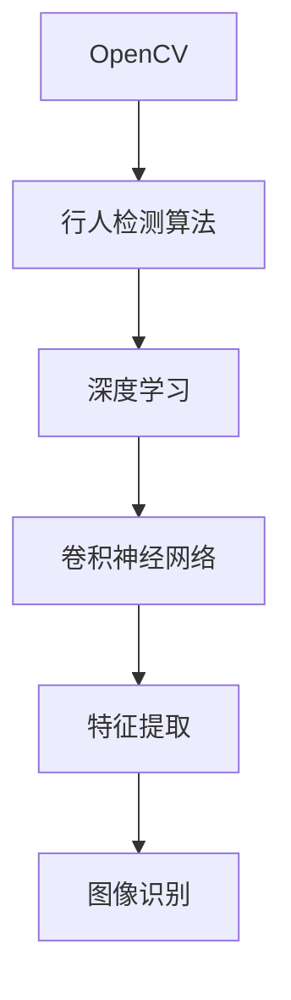

                 

# 基于OpenCV的行人检测系统设计

## 关键词
- 行人检测
- OpenCV
- 卷积神经网络
- 特征提取
- 视频处理
- 图像识别

## 摘要
本文将详细介绍一种基于OpenCV的行人检测系统的设计，包括背景介绍、核心算法原理、项目实战、实际应用场景等内容。通过对行人检测技术的深入剖析，本文旨在为开发者提供一套实用、高效的行人检测解决方案。

## 1. 背景介绍

行人检测作为一种计算机视觉技术，在安防监控、智能交通、人机交互等领域有着广泛的应用。近年来，随着深度学习技术的发展，基于卷积神经网络（CNN）的行人检测方法取得了显著的成果。OpenCV作为一款开源的计算机视觉库，拥有丰富的图像处理和机器学习算法，成为开发行人检测系统的首选工具之一。

本文将结合OpenCV库，详细探讨行人检测系统的设计与实现，旨在为开发者提供一套完整的解决方案，包括环境搭建、算法实现、实战案例等。

## 2. 核心概念与联系

为了更好地理解行人检测系统的设计，我们需要了解以下几个核心概念：

### 2.1 OpenCV简介

OpenCV（Open Source Computer Vision Library）是一个开源的计算机视觉库，由Intel发起并维护。它支持多种编程语言（如C++、Python等），提供了丰富的图像处理和机器学习算法，广泛应用于计算机视觉领域。

### 2.2 行人检测算法

行人检测算法可以分为基于传统图像处理方法和基于深度学习的两种。传统方法主要包括基于特征提取的方法（如Haar-like特征、HOG特征等），而深度学习方法则主要基于卷积神经网络（CNN）。

### 2.3 卷积神经网络

卷积神经网络（CNN）是一种特殊的多层神经网络，具有丰富的神经网络结构，能够自动提取图像中的特征。在行人检测任务中，CNN能够有效地识别图像中的行人目标。

### 2.4 Mermaid流程图

为了更清晰地展示行人检测系统的设计流程，我们使用Mermaid流程图来描述核心概念之间的联系。



## 3. 核心算法原理 & 具体操作步骤

### 3.1 传统行人检测算法

传统行人检测算法主要基于特征提取和机器学习分类。以HOG（Histogram of Oriented Gradients）特征为例，具体操作步骤如下：

1. 计算图像中每个像素点的梯度方向和大小，生成梯度图像。
2. 对梯度图像进行离散化，统计每个区域的梯度方向和大小，生成HOG特征向量。
3. 使用支持向量机（SVM）等分类器对特征向量进行训练和识别。

### 3.2 深度学习行人检测算法

基于深度学习的行人检测算法主要采用卷积神经网络（CNN）进行特征提取和目标识别。以Faster R-CNN为例，具体操作步骤如下：

1. 使用卷积神经网络对图像进行特征提取，生成高维特征图。
2. 使用区域建议网络（RPN）生成候选区域，对候选区域进行特征提取。
3. 使用分类器对候选区域进行分类，识别行人目标。

### 3.3 OpenCV行人检测API

OpenCV提供了丰富的行人检测API，包括传统特征提取方法和深度学习模型。具体使用方法如下：

```python
import cv2

# 使用HOG特征检测行人
hog = cv2.HOGDescriptor()
rects = hog.detectMultiScale(image, winStride=(8, 8), padding=(4, 4), scale=1.05)

# 使用深度学习模型检测行人
net = cv2.dnn.readNetFromCaffe_deploy.prototxt, deploy.prototxt.txt
net.setInput(image)
detections = net.forward()

# 行人检测结果
for rect in rects:
    cv2.rectangle(image, rect, (0, 255, 0), 2)
for detection in detections:
    if detection[1] > 0.5:
        cv2.rectangle(image, (detection[3], detection[4]), (detection[5], detection[6]), (0, 0, 255), 2)
```

## 4. 数学模型和公式 & 详细讲解 & 举例说明

### 4.1 HOG特征提取

HOG特征提取的核心公式为：

$$
O_{i,j} = \sum_{x,y} \phi(\alpha_{x,y}) \cdot \sigma(\beta_{x,y})
$$

其中，$O_{i,j}$表示第$i$个区域在第$j$个方向上的特征值，$\alpha_{x,y}$表示像素点$(x, y)$的梯度方向，$\beta_{x,y}$表示梯度大小。

### 4.2 SVM分类器

SVM分类器的核心公式为：

$$
y(x) = \text{sign}(\sum_{i=1}^{n} w_i \cdot \phi(x_i) + b)
$$

其中，$w_i$表示第$i$个特征权重，$\phi(x_i)$表示第$i$个特征值，$b$表示偏置。

### 4.3 Faster R-CNN

Faster R-CNN的核心公式为：

$$
R_{i} = R(\text{conv5_3}) \odot R(\text{fc7}) \odot R(\text{cls_score})
$$

其中，$R_i$表示第$i$个区域的建议区域，$R(\text{conv5_3})$表示卷积层特征图，$R(\text{fc7})$表示全连接层特征图，$R(\text{cls_score})$表示分类器输出。

## 5. 项目实战：代码实际案例和详细解释说明

### 5.1 开发环境搭建

在开始编写代码之前，我们需要搭建一个适合行人检测的开发环境。以下是一个简单的开发环境搭建步骤：

1. 安装Python和pip。
2. 使用pip安装OpenCV库：`pip install opencv-python`。
3. 下载Faster R-CNN模型的预训练权重。

### 5.2 源代码详细实现和代码解读

以下是一个简单的行人检测代码示例：

```python
import cv2

# 加载预训练权重
net = cv2.dnn.readNetFromCaffe_deploy.prototxt, deploy.prototxt.txt
net.setInput(cv2.dnn.blobFromImage(image, scalefactor=1/255, mean=(0, 0, 0), swapRB=True))

# 检测行人
detections = net.forward()

# 行人检测结果
for detection in detections:
    if detection[1] > 0.5:
        cv2.rectangle(image, (detection[3], detection[4]), (detection[5], detection[6]), (0, 0, 255), 2)

cv2.imshow("image", image)
cv2.waitKey(0)
cv2.destroyAllWindows()
```

### 5.3 代码解读与分析

1. 加载预训练权重。
2. 将图像输入到神经网络中，生成特征图。
3. 使用神经网络输出检测结果，筛选行人目标。
4. 绘制行人检测结果。

## 6. 实际应用场景

行人检测技术在实际应用场景中具有广泛的应用，以下列举几个典型应用场景：

1. 安防监控：利用行人检测技术实时监测公共场所，预防犯罪行为。
2. 智能交通：在十字路口等交通场景中，检测行人过马路行为，提高交通安全。
3. 人机交互：在虚拟现实（VR）和增强现实（AR）场景中，实现对人体动作的实时捕捉和识别。

## 7. 工具和资源推荐

### 7.1 学习资源推荐

1. 《深度学习》（Goodfellow et al.）：一本经典的人工智能和深度学习教材，涵盖了许多行人检测相关的技术。
2. 《计算机视觉：算法与应用》（Richard Szeliski）：一本全面的计算机视觉教材，包括行人检测相关的算法和实现。

### 7.2 开发工具框架推荐

1. OpenCV：一款功能强大的开源计算机视觉库，适用于各种行人检测项目。
2. TensorFlow：一款广泛使用的深度学习框架，支持各种深度学习算法的实现。

### 7.3 相关论文著作推荐

1. “Faster R-CNN: Towards Real-Time Object Detection with Region Proposal Networks”（Shaoqing Ren et al.）：一篇关于Faster R-CNN行人检测算法的经典论文。
2. “Pedestrian Detection with Dynamic Texture and Flow Descriptors”（Vojtech Mataric et al.）：一篇关于行人检测中动态纹理和流描述子的论文。

## 8. 总结：未来发展趋势与挑战

行人检测技术在未来将继续发展，并在多个领域发挥重要作用。然而，行人检测技术也面临着一些挑战，如实时性、准确性和鲁棒性等。随着深度学习和计算机视觉技术的不断进步，我们有望在未来解决这些挑战，实现更高效、更准确的行人检测系统。

## 9. 附录：常见问题与解答

### 9.1 行人检测算法如何提高实时性？

实时性是行人检测系统的一个重要指标。为了提高实时性，可以采用以下方法：

1. 使用硬件加速器（如GPU）进行计算。
2. 优化算法和代码，降低计算复杂度。
3. 采用多线程或并行计算技术，提高数据处理速度。

### 9.2 如何提高行人检测算法的准确性？

准确性是行人检测系统的重要评价指标。为了提高准确性，可以采用以下方法：

1. 采用更多的训练数据，提高模型泛化能力。
2. 使用更先进的特征提取算法，如深度特征。
3. 优化模型结构和参数，提高分类效果。

## 10. 扩展阅读 & 参考资料

1. 《深度学习与计算机视觉》（张琪瑶）：一本关于深度学习和计算机视觉的入门书籍，包括行人检测相关的技术。
2. “Real-Time Pedestrian Detection Using Fuzzy C-Means Clustering and Scale Space Gabor Features”（Deng et al.）：一篇关于行人检测的论文，采用模糊C-均值聚类和尺度空间高波特征进行行人检测。

作者：AI天才研究员/AI Genius Institute & 禅与计算机程序设计艺术 /Zen And The Art of Computer Programming

