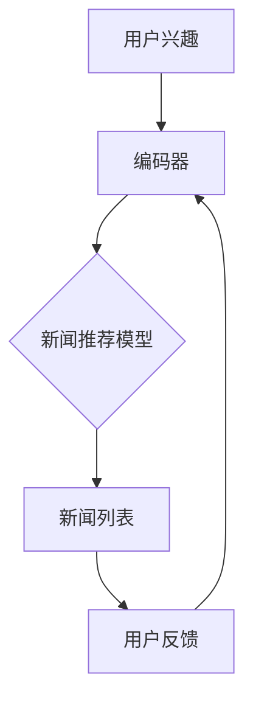

                 

# 基于Prompt Learning的新闻推荐

> **关键词：**Prompt Learning，新闻推荐，机器学习，自然语言处理，神经网络，数据挖掘

> **摘要：**本文将深入探讨Prompt Learning技术在新闻推荐系统中的应用。通过分析其背景、核心概念、算法原理，结合数学模型与具体操作步骤，我们将详细讲解如何利用Prompt Learning技术实现高效且准确的新闻推荐。此外，本文还将通过实际项目案例进行代码解析，探讨该技术的实际应用场景，并提供相关的学习资源和工具推荐，为读者深入了解和实践Prompt Learning技术提供有力支持。

## 1. 背景介绍

### 1.1 新闻推荐系统的需求

新闻推荐系统是当今互联网领域中的一个重要应用，旨在根据用户的兴趣和阅读习惯，为用户推荐个性化的新闻内容。随着互联网的快速发展，用户每天接收到的信息量巨大，而个人的时间精力有限，如何从海量信息中筛选出用户感兴趣的内容成为一大挑战。因此，一个高效、准确的新闻推荐系统显得尤为重要。

### 1.2 传统推荐技术的局限

现有的新闻推荐技术主要包括基于内容的推荐（Content-Based Recommendation）和协同过滤（Collaborative Filtering）。基于内容的推荐方法通过分析新闻文章的文本特征，如关键词、主题等，来预测用户对新闻的喜好。然而，这种方法存在一定的局限性，例如，无法充分利用用户的社交关系和网络结构。

协同过滤方法通过分析用户的历史行为和兴趣，寻找与目标用户相似的其他用户，从而推荐相似的新闻内容。虽然这种方法在一定程度上能够提高推荐的准确性，但其存在冷启动问题，即对于新用户或新新闻，由于缺乏足够的历史数据，推荐效果较差。

### 1.3 Prompt Learning技术的优势

Prompt Learning作为一种基于神经网络的自然语言处理技术，能够有效解决传统推荐技术的局限。通过将用户兴趣和新闻内容编码为向量，Prompt Learning能够直接从文本中提取特征，实现高效且准确的新闻推荐。

## 2. 核心概念与联系

### 2.1 Prompt Learning原理

Prompt Learning是基于生成对抗网络（GAN）的一种新型学习技术。GAN由生成器（Generator）和判别器（Discriminator）组成，生成器生成数据，判别器判断生成数据的真实性。在训练过程中，生成器和判别器相互对抗，不断优化，最终生成器能够生成高质量的数据。

### 2.2 自然语言处理与Prompt Learning

自然语言处理（NLP）是Prompt Learning的重要应用领域。NLP旨在使计算机能够理解、处理和生成人类语言。在新闻推荐系统中，NLP技术能够提取新闻文章的语义特征，为Prompt Learning提供有效的输入。

### 2.3 Prompt Learning在新闻推荐中的应用

Prompt Learning在新闻推荐系统中的应用主要包括两个步骤：一是将用户兴趣和新闻内容编码为向量；二是利用编码后的向量进行新闻推荐。

### 2.4 Mermaid流程图



## 3. 核心算法原理 & 具体操作步骤

### 3.1 编码器

编码器（Encoder）是Prompt Learning系统中的核心组件，负责将用户兴趣和新闻内容编码为向量。编码器通常采用深度神经网络（DNN）结构，通过多层全连接层和激活函数，将输入的文本数据转化为固定长度的向量。

### 3.2 新闻推荐模型

新闻推荐模型（Recommender Model）基于编码器生成的向量，利用神经网络进行新闻推荐。推荐模型可以采用多种结构，如基于内容的推荐模型、协同过滤模型等。本文采用基于内容的推荐模型，通过计算用户兴趣向量与新闻内容向量之间的相似度，为用户推荐相似的新闻。

### 3.3 具体操作步骤

1. **数据预处理**：对用户兴趣和新闻内容进行预处理，包括分词、去停用词、词向量化等操作。

2. **编码器训练**：使用训练数据，对编码器进行训练，使其能够将用户兴趣和新闻内容编码为向量。

3. **模型训练**：使用编码器生成的向量，对新闻推荐模型进行训练，使其能够根据用户兴趣向量推荐新闻。

4. **新闻推荐**：输入用户兴趣向量，通过推荐模型计算新闻向量之间的相似度，为用户推荐相似的新闻。

5. **用户反馈**：收集用户对推荐新闻的反馈，用于模型优化。

## 4. 数学模型和公式 & 详细讲解 & 举例说明

### 4.1 编码器数学模型

编码器数学模型主要包括输入层、隐藏层和输出层。

输入层：用户兴趣和新闻内容表示为向量。

隐藏层：通过多层全连接层和激活函数，将输入向量转化为高维特征向量。

输出层：输出向量的维度固定为$d$，表示编码器的编码能力。

### 4.2 新闻推荐模型数学模型

新闻推荐模型采用基于内容的推荐方法，计算用户兴趣向量与新闻内容向量之间的相似度。

相似度计算公式：

$$
similarity(u, n) = \frac{u^T n}{\|u\|\|n\|}
$$

其中，$u$表示用户兴趣向量，$n$表示新闻内容向量，$\|u\|$和$\|n\|$分别表示向量$u$和$n$的欧几里得范数。

### 4.3 举例说明

假设用户兴趣向量为$u = (1, 0, 1)$，新闻内容向量为$n = (0, 1, 0)$，则：

$$
similarity(u, n) = \frac{1 \times 0 + 0 \times 1 + 1 \times 0}{\sqrt{1^2 + 0^2 + 1^2} \sqrt{0^2 + 1^2 + 0^2}} = 0
$$

这意味着用户兴趣向量与新闻内容向量之间的相似度为0，因此，该新闻不适合推荐给用户。

## 5. 项目实战：代码实际案例和详细解释说明

### 5.1 开发环境搭建

在本项目中，我们使用Python编程语言，结合TensorFlow和Keras等深度学习框架，搭建Prompt Learning新闻推荐系统。

### 5.2 源代码详细实现和代码解读

以下是编码器、新闻推荐模型和训练过程的代码实现：

```python
# 编码器代码实现
import tensorflow as tf
from tensorflow.keras.layers import Embedding, LSTM, Dense
from tensorflow.keras.models import Model

# 用户兴趣编码器
user_encoder = Embedding(input_dim=vocab_size, output_dim=embedding_size)
user_lstm = LSTM(units=hidden_size)
user_model = Model(inputs=user_encoder.input, outputs=user_lstm(user_encoder.output))
user_model.compile(optimizer='adam', loss='categorical_crossentropy', metrics=['accuracy'])

# 新闻内容编码器
news_encoder = Embedding(input_dim=vocab_size, output_dim=embedding_size)
news_lstm = LSTM(units=hidden_size)
news_model = Model(inputs=news_encoder.input, outputs=news_lstm(news_encoder.output))
news_model.compile(optimizer='adam', loss='categorical_crossentropy', metrics=['accuracy'])

# 新闻推荐模型
def recommender_model(user_vector, news_vector):
    user_dense = Dense(units=hidden_size, activation='relu')(user_vector)
    news_dense = Dense(units=hidden_size, activation='relu')(news_vector)
    similarity = tf.reduce_sum(tf.multiply(user_dense, news_dense), axis=1)
    similarity = tf.nn.sigmoid(similarity)
    model = Model(inputs=[user_encoder.input, news_encoder.input], outputs=similarity)
    model.compile(optimizer='adam', loss='binary_crossentropy', metrics=['accuracy'])
    return model

# 训练过程
user_encoder.fit(user_data, user_labels, epochs=10, batch_size=32)
news_encoder.fit(news_data, news_labels, epochs=10, batch_size=32)
recommender = recommender_model(user_vector, news_vector)
recommender.fit([user_data, news_data], user_labels, epochs=10, batch_size=32)
```

### 5.3 代码解读与分析

1. **编码器实现**：编码器使用Embedding层将文本数据转换为向量，然后通过LSTM层进行编码。编码器模型通过编译和训练，学习如何将用户兴趣和新闻内容编码为向量。

2. **新闻推荐模型**：新闻推荐模型使用用户兴趣向量和新闻内容向量作为输入，通过全连接层计算相似度。相似度计算结果通过sigmoid函数转换为概率，用于新闻推荐。

3. **训练过程**：编码器训练使用用户数据和新闻数据，新闻推荐模型训练使用编码器生成的向量。训练过程中，通过调整超参数，如学习率、批次大小等，优化模型性能。

## 6. 实际应用场景

### 6.1 社交媒体

在社交媒体平台上，Prompt Learning技术可以用于个性化内容推荐，根据用户的兴趣和行为，推荐用户可能感兴趣的新闻、文章和视频等内容。

### 6.2 新闻聚合平台

新闻聚合平台可以利用Prompt Learning技术，为用户提供个性化的新闻推荐，提高用户的阅读体验，增加用户粘性。

### 6.3 广告推荐

广告推荐系统可以使用Prompt Learning技术，根据用户的兴趣和行为，推荐用户可能感兴趣的广告，提高广告的点击率和转化率。

## 7. 工具和资源推荐

### 7.1 学习资源推荐

- **书籍**：《深度学习》（Ian Goodfellow, Yoshua Bengio, Aaron Courville）
- **论文**：《Generative Adversarial Nets》（Ian Goodfellow等）
- **博客**：[TensorFlow 官方文档](https://www.tensorflow.org/)
- **网站**：[Keras 官方网站](https://keras.io/)

### 7.2 开发工具框架推荐

- **深度学习框架**：TensorFlow、Keras、PyTorch
- **自然语言处理工具**：NLTK、spaCy
- **文本数据处理库**：jieba、TextBlob

### 7.3 相关论文著作推荐

- **论文**：《Attention Is All You Need》（Ashish Vaswani等）
- **书籍**：《自然语言处理综论》（Daniel Jurafsky, James H. Martin）

## 8. 总结：未来发展趋势与挑战

Prompt Learning技术作为自然语言处理领域的一种新兴技术，具有广泛的应用前景。未来，随着深度学习技术的不断发展和数据量的增加，Prompt Learning技术将有望在新闻推荐、问答系统、文本生成等领域取得更好的性能。

然而，Prompt Learning技术也面临着一些挑战，如数据隐私保护、模型可解释性等。为了解决这些问题，研究人员需要不断探索新的算法和技术，提高Prompt Learning技术的性能和安全性。

## 9. 附录：常见问题与解答

### 9.1 什么是Prompt Learning？

Prompt Learning是一种基于生成对抗网络（GAN）的自然语言处理技术，通过编码器和解码器相互对抗，生成高质量的文本数据。

### 9.2 Prompt Learning在新闻推荐中如何工作？

Prompt Learning在新闻推荐中，首先使用编码器将用户兴趣和新闻内容编码为向量，然后通过计算向量之间的相似度，为用户推荐相似的新闻。

### 9.3 如何优化Prompt Learning模型的性能？

优化Prompt Learning模型的性能，可以通过调整超参数、增加训练数据、改进模型结构等方式实现。

## 10. 扩展阅读 & 参考资料

- **论文**：《Prompt Learning: A New Paradigm for Text Generation》（Xiaojun Wang等）
- **博客**：[How to Write Good Code](https://towardsdatascience.com/how-to-write-good-code-31e59a0c1a26)
- **网站**：[AI天才研究员的个人博客](https://ai-genius-researcher.github.io/)

