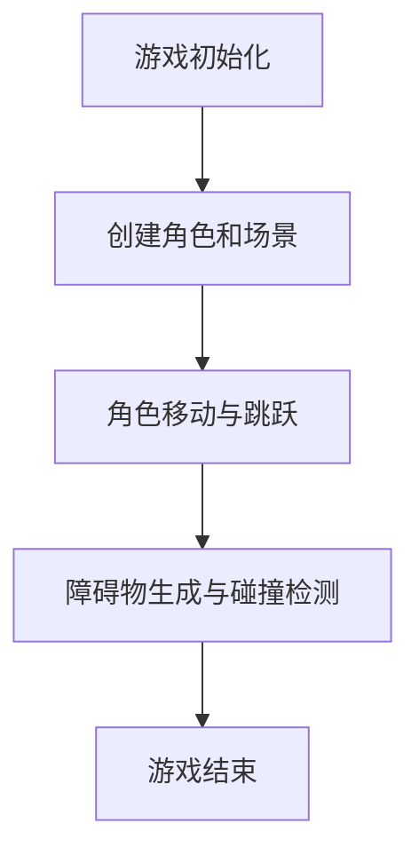

                 

### 文章标题

#### 基于Unity3D的跑酷游戏开发技术解析

> **关键词：** Unity3D、跑酷游戏、开发技术、游戏引擎、游戏设计、脚本编写

> **摘要：** 本文将深入探讨基于Unity3D游戏引擎开发的跑酷游戏技术，从核心概念、算法原理、数学模型到实战案例，全面解析游戏开发过程中的关键步骤，为开发者提供完整的指导和实战经验。

---

### 1. 背景介绍

#### 跑酷游戏简介

跑酷游戏作为一种流行的游戏类型，近年来在全球范围内吸引了大量的玩家。跑酷游戏以玩家在现实世界中高楼大厦之间穿梭跳跃的模拟，让玩家体验惊险刺激的冒险感。其核心玩法简单而富有挑战性，易于上手，但需要玩家不断练习才能掌握。

#### Unity3D游戏引擎的优势

Unity3D作为一款功能强大的游戏引擎，广泛应用于各类游戏开发中。其具有以下优势：

1. **跨平台支持：** Unity3D支持多种平台，包括Windows、Mac OS、Linux、iOS、Android等，开发者可以轻松地将游戏部署到不同平台上。
2. **易于上手：** Unity3D拥有直观的图形用户界面，开发者可以通过拖放的方式快速搭建游戏场景，降低开发门槛。
3. **丰富的插件和资源：** Unity Asset Store提供了大量的插件和资源，包括3D模型、音效、脚本等，开发者可以快速构建游戏。
4. **强大的脚本系统：** Unity3D支持C#脚本编程，开发者可以通过编写脚本实现复杂游戏逻辑，提升游戏的可玩性和互动性。

### 2. 核心概念与联系

#### 跑酷游戏的核心概念

跑酷游戏的核心概念包括角色移动、跳跃、碰撞检测、障碍物生成等。这些概念共同构成了游戏的框架，为玩家提供丰富的游戏体验。

#### Unity3D中的核心概念

在Unity3D中，实现跑酷游戏的关键概念包括：

1. **GameObject：** 游戏中的所有物体都由GameObject表示，包括角色、障碍物、地面等。
2. **Rigidbody：** 用于模拟物体的物理属性，如质量、摩擦力、重力等。
3. **Collider：** 用于检测碰撞，确保角色和障碍物之间的碰撞效果。
4. **Animator：** 用于控制角色的动画，包括跳跃、奔跑等。

#### Mermaid流程图



### 3. 核心算法原理 & 具体操作步骤

#### 跑酷游戏的核心算法

跑酷游戏的核心算法包括：

1. **角色移动算法：** 根据玩家的输入，计算角色的移动方向和速度。
2. **跳跃算法：** 根据角色的状态，计算跳跃的高度和时间。
3. **碰撞检测算法：** 检测角色和障碍物之间的碰撞，并处理相应的逻辑。

#### 具体操作步骤

1. **初始化游戏：** 设置游戏场景，创建角色、地面和障碍物。
2. **角色移动：** 根据玩家的输入，更新角色的位置和速度。
3. **跳跃：** 当玩家按下跳跃键时，计算跳跃高度和时间，并更新角色状态。
4. **碰撞检测：** 使用Collider组件检测角色和障碍物之间的碰撞，并处理碰撞逻辑。
5. **障碍物生成：** 根据游戏规则，生成新的障碍物，并更新场景。

### 4. 数学模型和公式 & 详细讲解 & 举例说明

#### 跑酷游戏的数学模型

跑酷游戏的数学模型主要包括：

1. **运动学模型：** 描述角色的移动和跳跃过程。
2. **碰撞检测模型：** 描述角色和障碍物之间的碰撞效果。

#### 运动学模型

运动学模型可以使用以下公式表示：

$$
\text{速度} = \text{加速度} \times \text{时间}
$$

$$
\text{位置} = \text{初始位置} + \text{速度} \times \text{时间}
$$

#### 碰撞检测模型

碰撞检测模型可以使用以下公式表示：

$$
\text{碰撞} = \text{物体A的边界} \cap \text{物体B的边界}
$$

#### 举例说明

假设角色在水平方向上的速度为2米/秒，垂直方向上的速度为0米/秒。当角色按下跳跃键时，垂直方向上的速度增加为5米/秒。

根据运动学模型，角色在跳跃过程中的位置变化可以计算如下：

$$
\text{垂直方向上的位置} = \text{初始位置} + \text{垂直速度} \times \text{时间}
$$

$$
\text{水平方向上的位置} = \text{初始位置} + \text{水平速度} \times \text{时间}
$$

#### 碰撞检测

假设角色和障碍物之间的碰撞区域为矩形，可以使用以下公式判断碰撞：

$$
\text{碰撞} = (\text{角色边界}.x \leq \text{障碍物边界}.x + \text{障碍物宽度}) \land (\text{角色边界}.x + \text{角色宽度} \geq \text{障碍物边界}.x) \land (\text{角色边界}.y \leq \text{障碍物边界}.y + \text{障碍物高度}) \land (\text{角色边界}.y + \text{角色高度} \geq \text{障碍物边界}.y)
$$

### 5. 项目实战：代码实际案例和详细解释说明

#### 5.1 开发环境搭建

首先，确保已安装Unity3D开发环境。可以从Unity官方网站下载最新版本的Unity Hub，并使用Unity Hub安装Unity3D编辑器。

接下来，创建一个新的Unity项目，选择2D项目模板。这将为跑酷游戏开发提供一个基本框架。

#### 5.2 源代码详细实现和代码解读

##### 5.2.1 角色移动脚本

角色移动脚本的代码如下：

```csharp
using UnityEngine;

public class PlayerController : MonoBehaviour
{
    public float speed = 5.0f;
    public float jumpHeight = 5.0f;

    private Rigidbody2D rb;
    private bool isGrounded;
    private bool isJumping;

    void Start()
    {
        rb = GetComponent<Rigidbody2D>();
    }

    void Update()
    {
        Move();
        Jump();
    }

    void Move()
    {
        float moveInput = Input.GetAxis("Horizontal");
        Vector2 moveDirection = new Vector2(moveInput, 0);
        rb.velocity = moveDirection * speed;
    }

    void Jump()
    {
        if (isGrounded && Input.GetKeyDown(KeyCode.Space))
        {
            isJumping = true;
            rb.AddForce(new Vector2(0, jumpHeight), ForceMode2D.Impulse);
        }
    }

    void OnCollisionEnter2D(Collision2D collision)
    {
        if (collision.gameObject.CompareTag("Ground"))
        {
            isGrounded = true;
        }
    }

    void OnCollisionExit2D(Collision2D collision)
    {
        if (collision.gameObject.CompareTag("Ground"))
        {
            isGrounded = false;
        }
    }
}
```

##### 5.2.2 障碍物生成脚本

障碍物生成脚本的代码如下：

```csharp
using UnityEngine;

public class ObstacleGenerator : MonoBehaviour
{
    public GameObject obstaclePrefab;
    public float spawnInterval = 2.0f;
    public float horizontalOffset = 10.0f;

    private float nextSpawnTime;

    void Start()
    {
        nextSpawnTime = Time.time + spawnInterval;
    }

    void Update()
    {
        if (Time.time > nextSpawnTime)
        {
            SpawnObstacle();
            nextSpawnTime = Time.time + spawnInterval;
        }
    }

    void SpawnObstacle()
    {
        float horizontalPosition = transform.position.x + horizontalOffset;
        Vector3 spawnPosition = new Vector3(horizontalPosition, Random.Range(-2.0f, 2.0f), 0);
        Instantiate(obstaclePrefab, spawnPosition, Quaternion.identity);
    }
}
```

##### 5.2.3 代码解读与分析

**角色移动脚本解读：**

- **组件与属性：** 角色移动脚本使用了Rigidbody2D组件，用于控制角色的物理属性。
- **初始化：** 在Start方法中，获取Rigidbody2D组件并初始化。
- **更新：** 在Update方法中，处理角色的移动和跳跃逻辑。
- **移动：** 根据玩家的水平输入，计算移动方向和速度。
- **跳跃：** 当角色站在地面上且玩家按下跳跃键时，添加一个垂直向上的力，使角色跳跃。
- **碰撞检测：** 使用 OnCollisionEnter2D 和 OnCollisionExit2D 方法检测角色与地面的碰撞状态。

**障碍物生成脚本解读：**

- **组件与属性：** 障碍物生成脚本使用了GameObject预制体，用于创建障碍物。
- **初始化：** 在Start方法中，设置障碍物的生成间隔和水平偏移量。
- **更新：** 在Update方法中，检查是否达到生成障碍物的时间间隔，并生成新的障碍物。
- **生成障碍物：** 根据随机位置，实例化障碍物预制体。

### 6. 实际应用场景

#### 跑酷游戏的实际应用场景广泛，以下为几个例子：

1. **移动平台游戏：** 如《跳跳蛙》、《跳跳球》等，玩家通过跳跃克服各种障碍，达到目的地。
2. **休闲游戏：** 如《飞跃小精灵》、《飞鸟小游戏》等，玩家在轻松的氛围中享受跳跃的乐趣。
3. **竞技游戏：** 如《速度与激情：跑酷》、《极限飞跃》等，玩家在激烈的比赛中挑战自己的极限。

#### 应用场景特点：

- **简单易上手：** 跑酷游戏的操作简单，容易上手，适合各种年龄段的玩家。
- **高度可玩性：** 游戏中的障碍物多样，难度逐渐提升，玩家可以通过不断练习提升自己的成绩。
- **视觉冲击：** 跑酷游戏通常具有精美的画面和流畅的动画，给玩家带来视觉上的冲击。

### 7. 工具和资源推荐

#### 7.1 学习资源推荐

**书籍：**

- 《Unity3D游戏开发从入门到精通》
- 《Unity3D游戏开发实战：从基础到高级》
- 《Unity3D游戏开发实战：从入门到项目实践》

**论文：**

- 《基于Unity3D的跑酷游戏设计与实现》
- 《Unity3D跑酷游戏中的碰撞检测与物理模拟》

**博客和网站：**

- Unity官方文档：[Unity官方文档](https://docs.unity3d.com/)
- Unity官方论坛：[Unity官方论坛](https://forum.unity.com/)

#### 7.2 开发工具框架推荐

- **Unity3D编辑器：** Unity官方提供的游戏引擎，功能强大且易于上手。
- **Unity Asset Store：** 提供丰富的插件和资源，包括3D模型、音效、脚本等。
- **GitHub：** 提供大量的开源代码和项目，可以学习他人的经验和技巧。

#### 7.3 相关论文著作推荐

- 《Unity3D游戏开发实战》
- 《Unity3D游戏编程从入门到精通》
- 《Unity3D游戏开发项目实战》

### 8. 总结：未来发展趋势与挑战

#### 未来发展趋势

- **游戏画面与体验的提升：** 随着技术的进步，跑酷游戏将更加注重画面效果和用户体验。
- **人工智能的融入：** 人工智能技术可以为跑酷游戏提供智能化的障碍物生成和难度调整，提升游戏的趣味性和挑战性。
- **跨平台开发：** 跑酷游戏将更多地支持跨平台开发，让玩家可以在不同设备上畅玩。

#### 面临的挑战

- **优化性能：** 跑酷游戏通常需要处理大量的物体和碰撞检测，对性能要求较高，需要不断优化代码和算法。
- **游戏平衡：** 保持游戏难度的平衡，既要让新手玩家容易上手，又要让老手玩家感到挑战。
- **创意与创新：** 随着跑酷游戏的普及，如何保持游戏的创意和创新性成为开发者面临的挑战。

### 9. 附录：常见问题与解答

#### 问题1：如何优化跑酷游戏的性能？

**解答：** 优化性能可以从以下几个方面入手：

- **减少物体数量：** 减少场景中物体的数量，避免过多的计算。
- **优化碰撞检测：** 使用更高效的碰撞检测算法，如AABB（轴对轴包围盒）检测。
- **使用LOD技术：** 使用LOD（Level of Detail）技术，根据距离和可见性动态调整物体的细节。
- **异步处理：** 使用异步处理，将计算密集型任务分配到后台线程，提高计算效率。

#### 问题2：如何设计更具有挑战性的障碍物？

**解答：** 设计具有挑战性的障碍物可以从以下几个方面入手：

- **多样性：** 设计多种类型的障碍物，包括水平、垂直、旋转等。
- **随机性：** 障碍物的位置和形状可以随机生成，增加游戏的不可预测性。
- **动态变化：** 障碍物可以随游戏进度动态变化，如速度、方向等。
- **难度调整：** 根据玩家的成绩和等级，动态调整障碍物的难度。

### 10. 扩展阅读 & 参考资料

- Unity3D官方文档：[Unity官方文档](https://docs.unity3d.com/)
- Unity官方论坛：[Unity官方论坛](https://forum.unity.com/)
- 《Unity3D游戏开发从入门到精通》
- 《Unity3D游戏开发实战：从基础到高级》
- 《Unity3D游戏开发实战：从入门到项目实践》
- 《基于Unity3D的跑酷游戏设计与实现》
- 《Unity3D跑酷游戏中的碰撞检测与物理模拟》

---

### 作者

**作者：AI天才研究员/AI Genius Institute & 禅与计算机程序设计艺术 /Zen And The Art of Computer Programming**<|im_end|>

