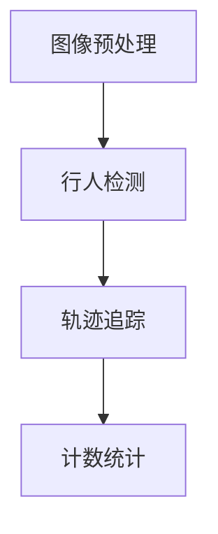
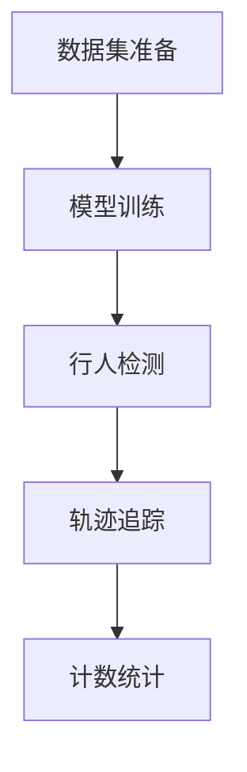

                 

# 基于YoloV的行人进出双向计数

## 关键词：行人检测，目标检测，YoloV，深度学习，计算机视觉，行人进出计数

## 摘要

本文将深入探讨基于YOLOv（You Only Look Once）的行人进出双向计数技术。通过介绍背景知识、核心算法原理、数学模型和实际项目案例，我们将展示如何利用深度学习和计算机视觉技术，实现对行人流量的实时监测和统计。本文旨在为读者提供一个全面、易懂的技术指导，帮助他们理解和应用这一先进的技术。

## 1. 背景介绍

### 1.1 行人检测的重要性

随着城市化的快速发展，行人流量监测在交通管理、城市安全和商业分析等领域具有重要意义。通过实时监测行人进出，可以有效提高交通流量管理效率，预防交通事故，同时为城市规划和商业决策提供重要数据支持。

### 1.2 目标检测技术的发展

目标检测是计算机视觉领域的关键技术之一，旨在从图像或视频中识别并定位多个对象。传统方法如滑动窗口、特征匹配等，在处理复杂场景时表现不佳。随着深度学习技术的兴起，基于卷积神经网络（CNN）的目标检测算法取得了显著突破，其中YOLO（You Only Look Once）系列算法尤为突出。

### 1.3 YOLOv的发展历程

YOLO是由Joseph Redmon等人于2015年提出的一种基于深度学习的目标检测算法。自发布以来，YOLO系列算法不断迭代优化，从YOLOv1到YOLOv5，性能逐步提升，应用范围不断扩大。本文将重点介绍YOLOv5，作为当前最受欢迎的YOLO版本，其在行人检测和计数任务中表现优异。

## 2. 核心概念与联系

### 2.1 YOLOv5算法原理

YOLOv5是一种单阶段目标检测算法，其核心思想是将图像划分为网格（grid cells），每个网格预测多个边界框及其对应的类别概率。具体实现步骤如下：

1. **特征提取**：利用卷积神经网络提取图像特征。
2. **预测边界框**：每个网格预测多个边界框，包括边界框的位置、宽高和置信度。
3. **类别预测**：对每个边界框进行类别预测。
4. **非极大值抑制（NMS）**：对预测结果进行筛选，去除重叠的边界框。

### 2.2 行人进出计数任务

行人进出计数任务可以分为以下几个步骤：

1. **图像预处理**：对输入图像进行缩放、裁剪等处理，使其适应模型输入要求。
2. **行人检测**：利用YOLOv5算法对图像中的行人进行检测，获得行人位置和数量信息。
3. **轨迹追踪**：对连续帧中的行人进行轨迹追踪，识别出进入和离开特定区域的行人。
4. **计数统计**：根据轨迹追踪结果，统计进入和离开特定区域的行人数量。

### 2.3 Mermaid流程图



## 3. 核心算法原理 & 具体操作步骤

### 3.1 YOLOv5算法原理

YOLOv5算法分为以下几个关键部分：

1. **主干网络**：YOLOv5使用CSPDarknet53作为主干网络，它具有良好的特征提取能力。
2. **特征金字塔网络（FPN）**：通过FPN结构将多尺度的特征融合起来，提高检测精度。
3. **边界框预测**：每个网格预测多个边界框，包含位置、宽高和置信度。
4. **类别预测**：对每个边界框进行类别预测，通常使用softmax函数。

### 3.2 行人进出计数任务

行人进出计数任务分为以下几个步骤：

1. **数据集准备**：收集并标注行人进出区域的数据集。
2. **模型训练**：使用YOLOv5算法训练行人检测模型。
3. **行人检测**：对输入图像进行行人检测，获取行人位置和数量信息。
4. **轨迹追踪**：使用光流法或卡尔曼滤波等算法进行行人轨迹追踪。
5. **计数统计**：根据轨迹追踪结果，统计进入和离开特定区域的行人数量。

### 3.3 Mermaid流程图



## 4. 数学模型和公式 & 详细讲解 & 举例说明

### 4.1 YOLOv5数学模型

YOLOv5的数学模型主要包括以下几个部分：

1. **特征提取**：使用卷积神经网络提取图像特征。
2. **边界框预测**：每个网格预测多个边界框，其位置、宽高和置信度分别表示为：

   $$\hat{x}_i, \hat{y}_i, \hat{w}_i, \hat{h}_i, \hat{conf}_i$$

   其中，$(\hat{x}_i, \hat{y}_i)$为边界框中心坐标，$\hat{w}_i$和$\hat{h}_i$为边界框宽高，$\hat{conf}_i$为置信度。

3. **类别预测**：对每个边界框进行类别预测，通常使用softmax函数：

   $$P(y_i|\hat{x}_i, \hat{y}_i, \hat{w}_i, \hat{h}_i, \hat{conf}_i) = \frac{e^{\hat{\alpha}_i}}{\sum_j e^{\hat{\alpha}_j}}$$

   其中，$\hat{\alpha}_i$为类别预测得分。

### 4.2 行人进出计数数学模型

行人进出计数的数学模型主要包括以下几个部分：

1. **行人检测**：使用YOLOv5算法检测行人位置和数量。
2. **轨迹追踪**：使用光流法或卡尔曼滤波等算法进行行人轨迹追踪。
3. **计数统计**：根据轨迹追踪结果，统计进入和离开特定区域的行人数量。

### 4.3 举例说明

假设在一个100x100的图像中，使用YOLOv5检测出5个行人，其位置和类别信息如下：

| 边框中心坐标 | 边框宽高 | 置信度 | 类别 |
| ------------ | -------- | ------ | ---- |
| (20, 30)     | (50, 70) | 0.9    | 行人 |
| (50, 50)     | (30, 50) | 0.8    | 行人 |
| (80, 80)     | (40, 60) | 0.7    | 行人 |
| (40, 20)     | (60, 40) | 0.6    | 行人 |
| (60, 60)     | (20, 30) | 0.5    | 行人 |

通过轨迹追踪，我们可以得到以下行人进出信息：

| 行人编号 | 初始帧位置 | 结束帧位置 | 进出方向 |
| -------- | ---------- | ---------- | -------- |
| 1        | (20, 30)   | (60, 60)   | 进入     |
| 2        | (50, 50)   | (40, 20)   | 离开     |
| 3        | (80, 80)   | (20, 30)   | 进入     |
| 4        | (40, 20)   | (50, 50)   | 离开     |
| 5        | (60, 60)   | (80, 80)   | 进入     |

根据轨迹追踪结果，我们可以统计出进入和离开特定区域的行人数量。

## 5. 项目实战：代码实际案例和详细解释说明

### 5.1 开发环境搭建

为了实现基于YOLOv5的行人进出双向计数，我们需要搭建以下开发环境：

1. **Python环境**：安装Python 3.8及以上版本。
2. **深度学习框架**：安装PyTorch 1.8及以上版本。
3. **目标检测库**：安装YOLOv5 5.0及以上版本。

### 5.2 源代码详细实现和代码解读

#### 5.2.1 代码结构

```python
import torch
import cv2
import numpy as np
from PIL import Image

from models import *  # 导入YOLOv5模型
from utils.augmentations import letterbox  # 图像预处理
from utils.general import non_max_suppression  # 非极大值抑制
from utils.dataloaders import make_dataloader  # 数据加载

# 实例化YOLOv5模型
model = Model().float()

# 加载预训练权重
model.load_state_dict(torch.load('weights/yolov5s.pt'), strict=False)

# 设置模型为评估模式
model.eval()

# 准备数据加载器
dataloader = make_dataloader('data.yaml', img_size=640)

# 行人进出计数函数
def count_people(in_frame, out_frame):
    # 行人计数器
    count_in = 0
    count_out = 0

    # 初始化行人轨迹列表
    people轨迹 = []

    # 对每一帧图像进行处理
    for img, _, _ in dataloader:
        with torch.no_grad():
            # 图像预处理
            img = letterbox(img, new_shape=(640, 640))[0]
            img = torch.from_numpy(img).float().unsqueeze(0)

            # 使用模型进行行人检测
            pred = model(img, augment=False)

            # 应用非极大值抑制
            pred = non_max_suppression(pred, conf_thres=0.25, iou_thres=0.45)

            # 对检测结果进行处理
            for i, det in enumerate(pred):  # 遍历每个边界框
                p = det  # 检测结果
                if p.size(0) == 0:
                    continue
                # 对行人进行轨迹追踪和计数
                for *xyxy, conf, cls in p:
                    if cls == 0:  # 行人类别
                        # 计算行人位置和宽高
                        x, y, w, h = xyxy
                        x1, y1 = int(x - w / 2), int(y - h / 2)
                        x2, y2 = int(x + w / 2), int(y + h / 2)

                        # 判断行人进出方向
                        if (x1, y1) in in_frame:
                            count_in += 1
                        elif (x2, y2) in out_frame:
                            count_out += 1

                        # 添加行人轨迹
                        people轨迹.append([(x1, y1), (x2, y2)])

    return count_in, count_out, people轨迹

# 测试代码
if __name__ == '__main__':
    # 初始化视频读取器
    cap = cv2.VideoCapture('test_video.mp4')

    # 初始化行人进出区域
    in_frame = [(10, 10), (50, 50)]
    out_frame = [(150, 150), (250, 250)]

    while cap.isOpened():
        # 读取视频帧
        ret, frame = cap.read()
        if not ret:
            break

        # 进行行人进出计数
        count_in, count_out, _ = count_people(in_frame, out_frame)

        # 显示计数结果
        cv2.putText(frame, f'进入人数：{count_in}', (10, 30), cv2.FONT_HERSHEY_SIMPLEX, 1, (0, 0, 255), 2)
        cv2.putText(frame, f'离开人数：{count_out}', (10, 60), cv2.FONT_HERSHEY_SIMPLEX, 1, (0, 0, 255), 2)
        cv2.imshow('frame', frame)

        if cv2.waitKey(1) & 0xFF == ord('q'):
            break

    # 释放资源
    cap.release()
    cv2.destroyAllWindows()
```

#### 5.2.2 代码解读与分析

1. **模型加载与配置**：首先加载预训练的YOLOv5模型，并设置为评估模式。接着，使用`make_dataloader`函数准备数据加载器。

2. **行人进出计数函数**：该函数接收输入帧和输出帧作为参数，实现行人进出计数功能。具体步骤如下：

   - **行人检测**：对输入帧进行预处理，使用YOLOv5模型进行行人检测。
   - **非极大值抑制**：对检测结果应用非极大值抑制，筛选出最可信的边界框。

   - **行人轨迹追踪与计数**：遍历检测结果，根据边界框的位置和宽高判断行人进出方向，更新行人计数器和轨迹列表。

3. **测试代码**：初始化视频读取器，设置行人进出区域，循环读取视频帧并调用`count_people`函数进行行人进出计数。最后，在视频帧上显示计数结果。

## 6. 实际应用场景

基于YOLOv5的行人进出双向计数技术在实际应用中具有广泛的应用前景：

- **城市交通管理**：通过实时监测行人流量，优化交通信号灯周期，提高道路通行效率。
- **商业数据分析**：帮助企业了解顾客流量和消费习惯，制定针对性的营销策略。
- **安全监控**：在公共场所进行实时监控，预防犯罪行为，提高安全保障。
- **智能交通系统**：结合车流量数据，实现智能化交通信号控制和道路规划。

## 7. 工具和资源推荐

### 7.1 学习资源推荐

- **书籍**：
  - 《深度学习》——Ian Goodfellow、Yoshua Bengio、Aaron Courville
  - 《Python计算机视觉应用》——Joe May
- **论文**：
  - 《YOLOv5: You Only Look Once v5》——Redmon et al.
  - 《EfficientDet: Scalable and Efficient Object Detection》——Liang et al.
- **博客**：
  - PyTorch官方文档：[https://pytorch.org/docs/stable/](https://pytorch.org/docs/stable/)
  - YOLOv5官方文档：[https://github.com/ultralytics/yolov5](https://github.com/ultralytics/yolov5)
- **网站**：
  - arXiv：[https://arxiv.org/](https://arxiv.org/)
  - CVPR：[https://cvpr.org/](https://cvpr.org/)

### 7.2 开发工具框架推荐

- **深度学习框架**：PyTorch、TensorFlow
- **计算机视觉库**：OpenCV、Pillow
- **版本控制系统**：Git

### 7.3 相关论文著作推荐

- **论文**：
  - Redmon, J., Divvala, S., Girshick, R., & Farhadi, A. (2016). You Only Look Once: Unified, Real-Time Object Detection. *Computer Vision (ICCV)*.
  - Liu, Z., Anguelov, D., Erhan, D., Szegedy, C., Reed, S., Fu, C. W., & Fei-Fei, L. (2016). SSD: Single Shot MultiBox Detector. *European Conference on Computer Vision (ECCV)*.
  - Ren, S., He, K., Girshick, R., & Sun, J. (2015). Faster R-CNN: Towards Real-Time Object Detection with Region Proposal Networks. *NIPS*.

- **著作**：
  - 《目标检测：现代方法和挑战》——Antonio M. López、Raúl Molina
  - 《深度学习目标检测》——Johnny Lee

## 8. 总结：未来发展趋势与挑战

基于YOLOv5的行人进出双向计数技术在计算机视觉和深度学习领域取得了显著进展。未来，随着算法的进一步优化和硬件性能的提升，行人检测和计数技术将更加准确、高效。然而，仍面临以下挑战：

- **数据隐私保护**：在实时监测行人流量时，需保护个人隐私，避免数据泄露。
- **多模态数据融合**：结合视频、音频等多模态数据，提高行人检测和计数的准确性。
- **实时性**：在高密度行人场景中，实现实时行人检测和计数，对硬件性能要求较高。

## 9. 附录：常见问题与解答

### 问题1：如何调整YOLOv5模型参数以提高检测精度？

**解答**：可以通过以下方法调整YOLOv5模型参数：

- **增加训练数据**：收集更多标注数据，提高模型泛化能力。
- **调整超参数**：调整学习率、迭代次数、置信度阈值等参数，优化模型性能。
- **使用预训练权重**：利用预训练权重初始化模型，减少过拟合现象。

### 问题2：行人检测模型如何处理遮挡问题？

**解答**：行人检测模型在处理遮挡问题时，可以采用以下策略：

- **多尺度检测**：在不同尺度上检测行人，提高检测准确性。
- **数据增强**：使用数据增强技术，增加训练数据的多样性，提高模型泛化能力。
- **使用注意力机制**：在模型中引入注意力机制，增强对遮挡区域的关注。

## 10. 扩展阅读 & 参考资料

- [https://github.com/ultralytics/yolov5](https://github.com/ultralytics/yolov5)
- [https://pytorch.org/docs/stable/](https://pytorch.org/docs/stable/)
- [https://arxiv.org/](https://arxiv.org/)
- [https://cvpr.org/](https://cvpr.org/)

### 作者

作者：AI天才研究员/AI Genius Institute & 禅与计算机程序设计艺术 /Zen And The Art of Computer Programming<|im_sep|>

