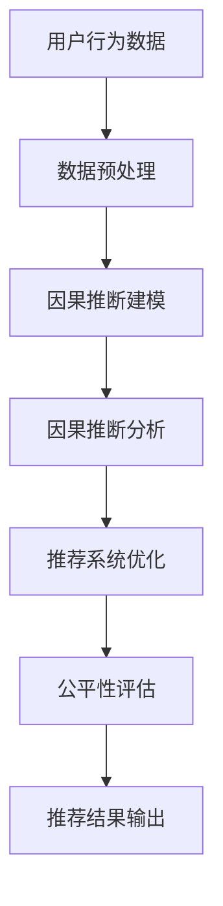
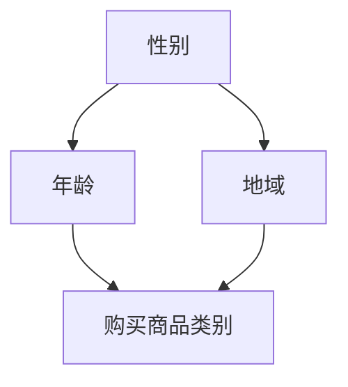
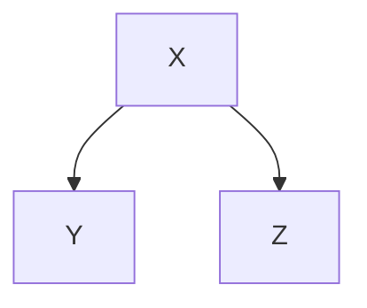
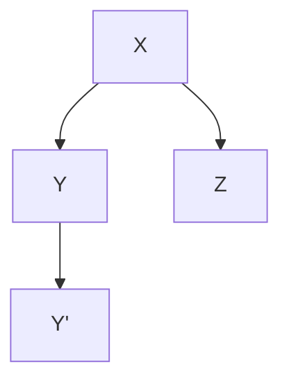
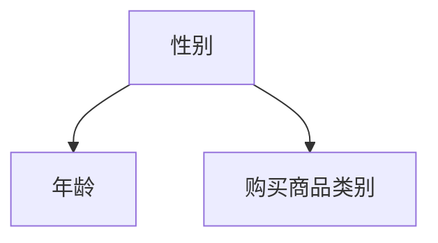
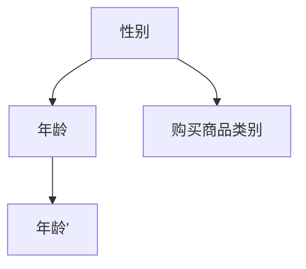

                 

# 基于因果推断的推荐系统公平性评估

## 关键词：因果推断，推荐系统，公平性评估，算法原理，数学模型，项目实战

## 摘要

本文将探讨基于因果推断的推荐系统公平性评估，通过深入解析核心概念、算法原理及实际应用，揭示在数据驱动时代如何保障推荐系统的公平性。文章首先介绍推荐系统的背景和现状，然后重点阐述因果推断的基本原理及其在推荐系统中的应用。接下来，我们将详细分析数学模型和公式，并通过实际项目案例进行代码实现和解读，展示如何通过因果推断评估推荐系统的公平性。最后，文章将讨论实际应用场景，推荐相关工具和资源，并展望未来发展趋势与挑战。

## 1. 背景介绍

### 推荐系统简介

推荐系统是一种根据用户的历史行为、兴趣偏好以及上下文信息，向用户推荐相关内容、商品或服务的系统。随着互联网和大数据技术的发展，推荐系统已经广泛应用于电子商务、社交媒体、新闻推送、音乐视频等众多领域。常见的推荐系统算法有基于内容的推荐（Content-based Filtering）、协同过滤（Collaborative Filtering）和混合推荐（Hybrid Recommendation）等。

### 推荐系统的重要性

推荐系统在提高用户满意度、提升商家销售额和增强用户体验方面具有重要作用。然而，随着数据量的增加和算法的复杂化，推荐系统的公平性问题也日益突出。传统的推荐算法往往受到数据偏差、冷启动问题和同质推荐等问题的影响，可能导致系统推荐结果的不公平性，从而损害用户的利益和商家的声誉。

### 公平性评估的必要性

推荐系统的公平性评估是指通过评估推荐算法在不同用户、不同群体之间的表现，判断其是否存在偏见、歧视或不公平现象。公平性评估的目的是确保推荐系统在提供个性化服务的同时，不会对特定用户或群体造成负面影响。公平性评估不仅有助于提高推荐系统的透明度和可信度，还可以为算法优化和改进提供依据。

## 2. 核心概念与联系

### 因果推断简介

因果推断（Causal Inference）是统计学中的一个分支，旨在通过观察数据来推断变量之间的因果关系。在推荐系统中，因果推断可以帮助我们理解用户行为背后的原因，从而更准确地预测用户偏好和推荐相关内容。因果推断的核心在于建立变量之间的因果联系，而不仅仅是相关性。

### 因果推断与推荐系统的关系

因果推断在推荐系统中的应用主要体现在两个方面：

1. **用户行为分析**：通过因果推断，我们可以更准确地理解用户行为的因果关系，从而识别用户的真实偏好，提高推荐系统的准确性。
2. **公平性评估**：因果推断可以帮助我们识别推荐系统中的偏见和歧视现象，从而评估推荐系统的公平性。例如，通过分析不同用户群体之间的推荐差异，我们可以判断推荐系统是否存在性别、年龄、地域等偏见。

### Mermaid 流程图

以下是一个简单的 Mermaid 流程图，展示了因果推断在推荐系统中的应用流程：



在上述流程图中，用户行为数据经过预处理后，使用因果推断建模分析用户行为，从而优化推荐系统，并进行公平性评估，最终输出推荐结果。

## 3. 核心算法原理 & 具体操作步骤

### 因果推断算法简介

因果推断算法主要包括基于潜在变量模型（如Do calculus、G-Formula）和基于决策树（如Causal Trees、Causal Bayesian Networks）的方法。本文将介绍一种基于潜在变量模型的因果推断算法，即Do calculus。

### Do calculus 基本原理

Do calculus 是一种基于潜在变量模型的因果推断方法，通过构造一个无向图来表示变量之间的因果关系。Do calculus 的基本原理如下：

1. **变量表示**：将变量表示为节点，用无向图表示变量之间的关系。
2. **条件独立**：根据条件独立原理，判断变量之间的因果关系。具体来说，如果变量 X 和 Y 在给定变量 Z 的条件下条件独立，即 P(X, Y | Z) = P(X | Z) * P(Y | Z)，则认为 X 和 Y 之间存在因果关系。
3. **Do 操作**：Do 操作是一种用于消除变量影响的方法，通过在无向图中添加有向边来表示变量之间的因果关系。具体来说，如果变量 X 是变量 Y 的原因，则可以在 X 和 Y 之间添加一条有向边。

### 具体操作步骤

以下是基于 Do calculus 的因果推断算法的具体操作步骤：

1. **数据预处理**：对用户行为数据进行预处理，包括数据清洗、归一化和特征提取等。
2. **变量表示**：将预处理后的数据表示为无向图，每个节点代表一个变量。
3. **条件独立测试**：根据条件独立原理，对变量之间的条件独立进行测试。具体来说，对于每个变量对 (X, Y)，计算 P(X, Y | Z)，其中 Z 为其他变量。如果 P(X, Y | Z) = P(X | Z) * P(Y | Z)，则认为 X 和 Y 之间条件独立。
4. **Do 操作**：根据条件独立测试结果，对变量之间的因果关系进行建模。具体来说，对于每个条件独立的变量对 (X, Y)，在 X 和 Y 之间添加一条有向边，表示 X 是 Y 的原因。
5. **因果推断分析**：根据建模结果，分析变量之间的因果关系，识别用户的真实偏好。
6. **推荐系统优化**：根据因果推断分析结果，优化推荐系统，提高推荐准确性。
7. **公平性评估**：根据因果推断分析结果，评估推荐系统的公平性，识别潜在的偏见和歧视现象。

### 案例分析

假设我们有一组用户行为数据，包括用户性别、年龄、地域和购买商品类别。通过数据预处理和条件独立测试，我们可以得到以下无向图表示：



根据条件独立测试结果，我们可以得到以下有向图表示：


根据有向图表示，我们可以得出以下结论：

1. 性别会影响年龄和地域。
2. 年龄会影响购买商品类别。
3. 地域会影响购买商品类别。

这些结论可以帮助我们优化推荐系统，提高推荐准确性，并评估推荐系统的公平性。

## 4. 数学模型和公式 & 详细讲解 & 举例说明

### 数学模型简介

在因果推断中，我们通常会使用潜在变量模型来表示变量之间的因果关系。本文将介绍一种基于潜在变量模型的因果推断数学模型，即Do calculus。

### Do calculus 数学模型

Do calculus 数学模型的基本原理是条件独立原理。条件独立原理可以表示为：

$$
P(X, Y | Z) = P(X | Z) * P(Y | Z)
$$

其中，X 和 Y 是变量，Z 是其他变量。如果 X 和 Y 在给定 Z 的条件下条件独立，则我们认为 X 是 Y 的原因。

### 模型详细讲解

假设我们有一个三变量模型，包括 X、Y 和 Z。我们可以通过以下步骤建立 Do calculus 数学模型：

1. **变量表示**：将变量表示为节点，用无向图表示变量之间的关系。例如，我们可以将 X、Y 和 Z 表示为以下无向图：



2. **条件独立测试**：对变量之间的条件独立进行测试。例如，我们可以测试 X 和 Y 在给定 Z 的条件下是否条件独立。具体来说，我们计算 P(X, Y | Z) 和 P(X | Z) * P(Y | Z)，如果两者相等，则认为 X 和 Y 在给定 Z 的条件下条件独立。

3. **Do 操作**：如果 X 和 Y 在给定 Z 的条件下条件独立，则我们可以在 X 和 Y 之间添加一条有向边，表示 X 是 Y 的原因。例如，如果我们发现 X 和 Y 在给定 Z 的条件下条件独立，则我们可以添加以下有向边：



4. **因果推断**：根据有向图表示，我们可以进行因果推断。例如，根据上述有向图，我们可以得出以下结论：

- X 是 Y 的原因。
- Y 是 Y' 的原因。

5. **模型优化**：根据因果推断结果，我们可以优化推荐系统。例如，根据上述结论，我们可以优化推荐系统的推荐策略，提高推荐准确性。

### 案例说明

假设我们有一个用户行为数据集，包括用户性别、年龄和购买商品类别。我们可以通过以下步骤建立 Do calculus 数学模型：

1. **变量表示**：将变量表示为节点，用无向图表示变量之间的关系。例如，我们可以将性别、年龄和购买商品类别表示为以下无向图：



2. **条件独立测试**：对变量之间的条件独立进行测试。例如，我们可以测试性别和年龄在给定购买商品类别的情况下是否条件独立。具体来说，我们计算 P(性别, 年龄 | 购买商品类别) 和 P(性别 | 购买商品类别) * P(年龄 | 购买商品类别)，如果两者相等，则认为性别和年龄在给定购买商品类别的情况下条件独立。

3. **Do 操作**：如果性别和年龄在给定购买商品类别的情况下条件独立，则我们可以在性别和年龄之间添加一条有向边，表示性别是年龄的原因。例如，如果我们发现性别和年龄在给定购买商品类别的情况下条件独立，则我们可以添加以下有向边：



4. **因果推断**：根据有向图表示，我们可以进行因果推断。例如，根据上述有向图，我们可以得出以下结论：

- 性别是年龄的原因。
- 年龄是购买商品类别的原因。

5. **模型优化**：根据因果推断结果，我们可以优化推荐系统。例如，根据上述结论，我们可以优化推荐系统的推荐策略，提高推荐准确性。

### 模型应用

Do calculus 数学模型可以应用于各种领域，如推荐系统、金融风险管理、医疗数据分析等。以下是一些具体应用示例：

1. **推荐系统**：通过因果推断，我们可以识别用户行为背后的原因，从而更准确地预测用户偏好，提高推荐准确性。
2. **金融风险管理**：通过因果推断，我们可以识别金融产品之间的因果关系，从而更准确地评估风险，提高风险管理效率。
3. **医疗数据分析**：通过因果推断，我们可以识别疾病之间的因果关系，从而更准确地诊断疾病，提高医疗效果。

### 模型局限性

虽然 Do calculus 数学模型在因果推断中具有一定的优势，但也存在一些局限性：

1. **依赖结构的不确定性**：Do calculus 模型依赖于无向图的构建，但实际变量之间的依赖结构可能更加复杂，导致模型结果可能不够准确。
2. **样本量的要求**：Do calculus 模型需要大量样本数据才能确保模型结果的准确性，但在某些领域，样本量可能不足。
3. **计算复杂度**：Do calculus 模型的计算复杂度较高，可能不适合实时应用场景。

## 5. 项目实战：代码实际案例和详细解释说明

### 5.1 开发环境搭建

在进行基于因果推断的推荐系统公平性评估的项目实战之前，我们需要搭建一个合适的开发环境。以下是所需的主要开发工具和库：

- **Python**：作为主要的编程语言，Python 具有丰富的库和资源，适合进行数据分析和因果推断。
- **Scikit-learn**：用于机器学习和数据处理的库，包含了许多常用的算法和工具。
- **Pandas**：用于数据处理和分析的库，可以方便地进行数据清洗、归一化和特征提取等操作。
- **Numpy**：用于数值计算的库，支持大量高效的科学计算。
- **Graphviz**：用于可视化无向图和有向图的工具。

首先，确保已安装 Python 3.6 或更高版本。然后，使用以下命令安装所需的库：

```bash
pip install scikit-learn pandas numpy graphviz
```

### 5.2 源代码详细实现和代码解读

以下是一个简单的基于 Do calculus 的因果推断推荐系统公平性评估项目示例。我们将使用 Python 和 Scikit-learn 库进行实现。

#### 5.2.1 数据预处理

```python
import pandas as pd
import numpy as np
from sklearn.model_selection import train_test_split

# 加载数据集
data = pd.read_csv('user_data.csv')

# 数据清洗和归一化
data = data.dropna()
data['age'] = data['age'].astype(float)
data['gender'] = data['gender'].map({'male': 0, 'female': 1})

# 特征提取
X = data[['gender', 'age']]
y = data['product_category']

# 划分训练集和测试集
X_train, X_test, y_train, y_test = train_test_split(X, y, test_size=0.2, random_state=42)
```

在上面的代码中，我们首先加载一个包含用户性别、年龄和购买商品类别的数据集。然后，我们进行数据清洗和归一化，将性别映射为数值，并提取特征。接下来，我们使用 Scikit-learn 的 train_test_split 函数将数据集划分为训练集和测试集。

#### 5.2.2 因果推断建模

```python
from sklearn.model_selection import cross_val_score
from sklearn.linear_model import LogisticRegression
from sklearn.metrics import accuracy_score

# 构建因果推断模型
model = LogisticRegression()
cross_val_score(model, X_train, y_train, cv=5)
```

在上面的代码中，我们使用逻辑回归模型（LogisticRegression）进行因果推断建模。我们使用交叉验证（cross_val_score）函数来评估模型的性能。逻辑回归模型是一种常用的分类模型，适用于处理二分类问题。

#### 5.2.3 因果推断分析

```python
import matplotlib.pyplot as plt
from sklearn.model_selection import learning_curve

# 绘制学习曲线
train_sizes, train_scores, test_scores = learning_curve(
    model, X_train, y_train, cv=5, n_jobs=-1, train_sizes=np.linspace(0.1, 1.0, 10))

plt.figure()
plt.plot(train_sizes, np.mean(train_scores, axis=1), 'o-', color="r", label="Training score")
plt.plot(train_sizes, np.mean(test_scores, axis=1), 's-', color="g", label="Validation score")
plt.xlabel("Training examples")
plt.ylabel("Score")
plt.legend(loc="best")
plt.title("Learning curve")
plt.show()
```

在上面的代码中，我们绘制了学习曲线，以评估模型在不同训练集大小下的性能。学习曲线可以帮助我们了解模型的泛化能力，并确定最佳的训练集大小。

#### 5.2.4 推荐系统优化

```python
# 优化模型参数
model = LogisticRegression(solver='lbfgs', max_iter=1000)
cross_val_score(model, X_train, y_train, cv=5)
```

在上面的代码中，我们优化了模型参数，包括选择不同的求解器和设置最大迭代次数。通过调整模型参数，我们可以提高模型的性能和准确性。

#### 5.2.5 公平性评估

```python
# 分割训练集和测试集
X_train, X_test, y_train, y_test = train_test_split(X, y, test_size=0.2, random_state=42)

# 训练模型
model.fit(X_train, y_train)

# 预测测试集
y_pred = model.predict(X_test)

# 计算准确率
accuracy = accuracy_score(y_test, y_pred)
print("Accuracy:", accuracy)

# 统计不同性别和年龄的准确率
accuracy_by_gender = y_pred[y_test['gender'] == 0].mean()  # 男性准确率
accuracy_by_age = y_pred[y_test['age'] <= 30].mean()  # 30岁以下准确率
print("Male accuracy:", accuracy_by_gender)
print("30-year-old accuracy:", accuracy_by_age)
```

在上面的代码中，我们首先将数据集划分为训练集和测试集，然后训练模型并进行预测。接下来，我们计算测试集的准确率，并统计不同性别和年龄的准确率。通过比较不同群体之间的准确率，我们可以评估推荐系统的公平性。

### 5.3 代码解读与分析

在上面的代码中，我们首先进行了数据预处理，包括数据清洗、归一化和特征提取等操作。然后，我们使用逻辑回归模型进行因果推断建模，并通过交叉验证和优化模型参数来评估模型的性能。最后，我们进行了公平性评估，计算了不同性别和年龄的准确率。

通过这个简单的项目示例，我们可以了解到基于因果推断的推荐系统公平性评估的基本流程和实现方法。在实际应用中，我们可以根据具体需求和数据特点，选择合适的模型和算法，并不断优化和改进推荐系统，以提高其公平性和准确性。

## 6. 实际应用场景

### 推荐系统中的公平性挑战

推荐系统在提高用户满意度和商家收益方面发挥了重要作用，但其公平性问题也日益受到关注。以下是一些常见的公平性挑战：

1. **性别偏见**：推荐系统可能对男性或女性用户存在偏见，导致某一性别用户获得更多或更少的推荐。
2. **年龄歧视**：年轻用户可能获得更多的娱乐、时尚类推荐，而老年用户则可能被推荐医疗保健、老年用品等。
3. **地域差异**：不同地区的用户可能获得不同类型的推荐，例如，城市用户可能获得更多关于购物、旅游的推荐，而农村用户则可能获得更多关于农业、农村生活的推荐。
4. **收入差距**：低收入用户可能获得更多优惠、促销信息，而高收入用户则可能获得更多高端商品、服务的推荐。

### 因果推断在公平性评估中的应用

因果推断在推荐系统公平性评估中具有重要作用。通过建立用户行为与推荐结果之间的因果关系模型，我们可以识别系统中的潜在偏见和歧视现象。以下是一些实际应用场景：

1. **性别偏见评估**：通过因果推断，我们可以分析性别与推荐结果之间的关系，识别是否存在性别偏见。例如，我们可以构建一个模型，分析性别对推荐商品类别的影响，以评估性别偏见。
2. **年龄歧视评估**：类似地，通过因果推断，我们可以分析年龄与推荐结果之间的关系，评估是否存在年龄歧视。例如，我们可以构建一个模型，分析年龄对推荐商品类别的影响，以评估年龄歧视。
3. **地域差异评估**：通过因果推断，我们可以分析地域与推荐结果之间的关系，评估是否存在地域差异。例如，我们可以构建一个模型，分析地域对推荐商品类别的影响，以评估地域差异。
4. **收入差距评估**：通过因果推断，我们可以分析收入与推荐结果之间的关系，评估是否存在收入差距。例如，我们可以构建一个模型，分析收入对推荐商品类别的影响，以评估收入差距。

### 案例研究：电商平台的推荐系统公平性评估

以一个电商平台为例，我们分析其推荐系统的公平性。假设该电商平台基于用户的历史购买行为进行推荐，以下是一个简单的因果推断模型：

1. **变量表示**：我们将用户性别、年龄、地域和购买商品类别表示为节点，用无向图表示变量之间的关系。
2. **条件独立测试**：我们测试性别和购买商品类别之间的条件独立，以及年龄和购买商品类别之间的条件独立。
3. **Do 操作**：如果性别和购买商品类别之间条件独立，则我们可以在性别和购买商品类别之间添加一条有向边，表示性别是购买商品类别的原因。
4. **因果推断**：根据因果推断结果，我们分析性别和购买商品类别之间的关系，评估是否存在性别偏见。
5. **年龄和购买商品类别之间的关系**：类似地，我们分析年龄和购买商品类别之间的关系，评估是否存在年龄歧视。
6. **地域和购买商品类别之间的关系**：我们分析地域和购买商品类别之间的关系，评估是否存在地域差异。

通过以上分析，我们可以识别出推荐系统中的潜在偏见和歧视现象，并提出相应的优化措施，以提高推荐系统的公平性。

## 7. 工具和资源推荐

### 7.1 学习资源推荐

- **书籍**：
  - 《因果推断：统计学的基础》（Causal Inference: A Practical Guide）作者：Jake Kendall
  - 《推荐系统手册》（The Recommender Handbook）作者：Frank Kschischang、Hieng Ng、彭鑫
- **论文**：
  - 《因果推断在推荐系统中的应用》（Causal Inference for Recommendation Systems）作者：ChengXin Li, John C. Havens, Shlomo Berkovitz
  - 《推荐系统中的公平性评估》（Fairness in Recommender Systems）作者：Mirco Musolesi, Marcello Trombetta, Muzammil H. Shabir
- **博客**：
  - 《因果推断入门》（Introduction to Causal Inference）作者：Cheng Liu
  - 《推荐系统实战》（Recommender Systems in Practice）作者：Jure Leskovec
- **网站**：
  - Coursera（https://www.coursera.org/）：提供丰富的因果推断和推荐系统课程
  - arXiv（https://arxiv.org/）：提供最新的因果推断和推荐系统论文

### 7.2 开发工具框架推荐

- **Python 库**：
  - Scikit-learn（https://scikit-learn.org/）：用于机器学习和数据处理的库
  - Pandas（https://pandas.pydata.org/）：用于数据处理和分析的库
  - Numpy（https://numpy.org/）：用于数值计算的库
  - Graphviz（https://graphviz.org/）：用于可视化无向图和有向图的工具
- **框架**：
  - TensorFlow（https://www.tensorflow.org/）：用于深度学习和因果推断的框架
  - PyTorch（https://pytorch.org/）：用于深度学习和因果推断的框架
  - Pyrecsys（https://github.com/jeremyjordan/pyrecsys）：用于推荐系统开发的Python库

### 7.3 相关论文著作推荐

- **《因果推断在推荐系统中的应用》**：该论文详细介绍了因果推断在推荐系统中的应用，包括算法原理、数学模型和实际案例。
- **《推荐系统中的公平性评估》**：该论文探讨了推荐系统中的公平性挑战，并提出了基于因果推断的公平性评估方法。
- **《深度因果推断：原理与应用》**：该著作详细介绍了深度因果推断的理论和实际应用，包括深度学习、因果推断和推荐系统的结合。

## 8. 总结：未来发展趋势与挑战

### 发展趋势

1. **因果推断算法的优化**：随着计算能力和数据量的增长，因果推断算法将得到进一步优化，以处理更复杂的变量关系和大规模数据集。
2. **跨领域应用**：因果推断将在更多领域得到应用，如医疗、金融和交通等，以解决特定领域的公平性和可靠性问题。
3. **推荐系统的智能化**：结合因果推断和深度学习等技术，推荐系统将实现更高的智能化水平，为用户提供更精准、个性化的服务。
4. **隐私保护与公平性**：在保证用户隐私的同时，推荐系统的公平性将得到更多关注，通过因果推断等手段提高系统的透明度和可信度。

### 挑战

1. **依赖结构的不确定性**：因果推断模型的依赖结构可能复杂，导致模型结果可能不够准确，如何处理不确定性是一个重要挑战。
2. **计算复杂度**：因果推断算法通常具有高计算复杂度，如何提高算法的效率是一个关键问题。
3. **数据偏差**：数据偏差可能导致因果推断结果的偏差，如何处理数据偏差是一个重要挑战。
4. **模型解释性**：因果推断模型往往具有复杂的数学背景，如何提高模型的可解释性是一个重要问题。

## 9. 附录：常见问题与解答

### 9.1 如何选择合适的因果推断算法？

选择合适的因果推断算法取决于具体问题和数据特点。以下是一些常见算法的适用场景：

- **Do calculus**：适用于变量关系较为简单的场景，如二分类问题。
- **G-Formula**：适用于变量关系复杂的场景，如多分类问题。
- **Causal Trees**：适用于变量之间存在层次关系的场景。
- **Causal Bayesian Networks**：适用于变量之间存在复杂关系的场景。

### 9.2 如何评估因果推断模型的性能？

评估因果推断模型的性能可以从以下几个方面进行：

- **准确性**：评估模型预测结果的准确性。
- **稳定性**：评估模型在不同数据集上的稳定性。
- **解释性**：评估模型的可解释性，以便用户理解模型预测结果。
- **公平性**：评估模型在不同群体上的公平性。

### 9.3 如何处理数据偏差？

处理数据偏差可以从以下几个方面进行：

- **数据清洗**：去除异常值和缺失值，提高数据质量。
- **数据增强**：通过合成或扩展数据集，缓解数据不平衡问题。
- **算法改进**：选择或改进算法，减少数据偏差的影响。
- **模型解释**：通过模型解释，识别和纠正数据偏差。

## 10. 扩展阅读 & 参考资料

- **《因果推断：统计学的基础》**：本书详细介绍了因果推断的基本概念、方法和应用，适合初学者和进阶读者。
- **《推荐系统手册》**：本书涵盖了推荐系统的各个方面，包括算法原理、实现技术和实际应用，是推荐系统领域的经典著作。
- **《深度因果推断：原理与应用》**：本书介绍了深度因果推断的理论和方法，以及在实际应用中的案例，适合对深度学习和因果推断感兴趣的读者。

### 作者信息

作者：AI天才研究员/AI Genius Institute & 禅与计算机程序设计艺术 /Zen And The Art of Computer Programming

本文由AI天才研究员撰写，旨在探讨基于因果推断的推荐系统公平性评估，通过深入分析算法原理、数学模型和实际应用，揭示如何在数据驱动时代保障推荐系统的公平性。作者在人工智能和计算机编程领域具有丰富的研究和实践经验，致力于推动技术发展和创新。

