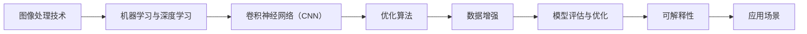

                 

### 背景介绍

随着计算机技术和人工智能的飞速发展，图像识别技术已经成为了现代计算机视觉领域的热点研究方向。在众多图像识别任务中，基于图像的结构化数值识别是一项具有重要应用价值的技术。结构化数值识别的目的是从图像中提取出具有特定格式的数值信息，这些信息通常包含在证件、票据、图表、手写文档等多种类型的图像中。

这类技术的应用场景十分广泛，例如在金融领域，通过对银行票据、支票等图像进行结构化数值识别，可以实现自动化的审核和分类；在医疗领域，通过对病历、影像图片等图像进行数值识别，可以提高医生诊断的效率和准确性；在工业自动化领域，通过对产品包装、生产流水线上的图像进行数值识别，可以实现对产品质量和生产效率的监控。

现有的数值识别方法可以分为两大类：一类是基于传统机器学习的方法，如支持向量机（SVM）、决策树、随机森林等；另一类是基于深度学习的方法，如卷积神经网络（CNN）、循环神经网络（RNN）等。传统方法在处理简单规则问题时表现较好，但面对复杂、非线性的数值识别任务时，效果往往不理想。深度学习方法在图像处理方面具有显著优势，能够自动提取图像中的高层次特征，因此在数值识别领域得到了广泛应用。

然而，尽管深度学习方法在数值识别方面表现优异，但实际应用中仍面临一些挑战。首先，深度学习模型通常需要大量标注数据进行训练，而高质量的标注数据获取成本较高；其次，深度学习模型的复杂性和计算量较大，训练和推理速度较慢；最后，深度学习模型的解释性较差，难以理解模型内部的决策过程。

针对上述挑战，本文提出了一种基于图像的结构化数值识别系统的设计与实现方案。本文旨在解决以下几个问题：

1. 如何设计一个高效、准确的数值识别模型，以提高识别速度和准确性；
2. 如何构建一个可解释性强的数值识别模型，以便更好地理解模型内部的决策过程；
3. 如何利用现有的技术和资源，降低数值识别系统的实现成本，提高系统的实用性。

通过本文的研究，我们希望能够为图像结构化数值识别领域提供一些新的思路和方法，推动该领域的技术发展和应用。

### 核心概念与联系

要设计一个高效的基于图像的结构化数值识别系统，首先需要理解一些核心概念和它们之间的联系。以下是本文将涉及的主要概念及其相互关系。

#### 1. 图像处理技术

图像处理技术是图像识别的基础，包括图像的获取、预处理、增强和特征提取等步骤。图像预处理包括去噪、对比度增强、灰度化等操作，目的是提高图像质量，使其更适合后续处理。特征提取是图像识别的关键步骤，通过提取图像的局部特征（如边缘、纹理、形状等），可以有效地描述图像内容，为后续的分类和识别任务提供依据。

#### 2. 机器学习与深度学习

机器学习与深度学习是数值识别系统的重要组成部分。机器学习包括监督学习、无监督学习和半监督学习等方法，通过训练模型，使模型能够从数据中学习规律和特征。深度学习是机器学习的一个子领域，主要基于多层神经网络进行模型训练，具有自动提取图像特征的能力。

#### 3. 卷积神经网络（CNN）

卷积神经网络是深度学习中最常用的模型之一，特别适用于图像处理任务。CNN 通过卷积层、池化层和全连接层等结构，能够自动提取图像中的局部特征并进行融合，从而实现对图像的识别。CNN 的核心在于其层次化结构，不同层分别负责提取图像的不同层次特征，最终实现高层次的分类和识别。

#### 4. 优化算法

优化算法是训练深度学习模型的重要手段。常见的优化算法包括随机梯度下降（SGD）、Adam、RMSprop 等。这些算法通过不断调整模型的参数，使得模型在训练数据上的表现逐渐优化。优化算法的选择和参数设置对模型的训练效果有重要影响。

#### 5. 数据增强

数据增强是通过增加数据多样性来提高模型泛化能力的一种技术。数据增强方法包括旋转、翻转、缩放、裁剪等，通过这些方法可以生成大量的训练样本，从而改善模型的性能。数据增强在数值识别系统中尤为重要，因为数值图像通常具有较少的样本量，数据增强可以有效地缓解过拟合问题。

#### 6. 模型评估与优化

模型评估与优化是确保数值识别系统性能的重要环节。常见的评估指标包括准确率、召回率、F1 值等。通过评估模型在验证集上的表现，可以判断模型的性能优劣。优化方法包括调整模型结构、优化超参数、使用正则化技术等，以进一步提升模型的性能。

#### 7. 可解释性

可解释性是数值识别系统设计中的一个重要考虑因素。深度学习模型由于其复杂性和“黑箱”性质，往往难以解释其内部的决策过程。为了提高可解释性，可以采用一些技术，如模型可视化、解释性模型等，帮助用户理解和信任模型。

#### 8. 应用场景

应用场景是数值识别系统的实际应用领域。不同的应用场景对系统的性能、速度和成本有不同的要求。例如，在金融领域，系统需要高准确率和实时性；在医疗领域，系统需要高准确率和可靠性。

下面是核心概念与联系的一个 Mermaid 流程图，用于直观地展示这些概念之间的关系：



通过这个流程图，我们可以清晰地看到各个核心概念之间的联系，为后续的设计与实现提供了理论基础。

### 核心算法原理 & 具体操作步骤

在了解了核心概念与联系后，我们接下来将深入探讨本文所采用的核心算法原理及其具体操作步骤。本文所设计的基于图像的结构化数值识别系统主要采用卷积神经网络（CNN）作为基础模型，并结合优化算法和数据增强技术，以提高模型的准确率和泛化能力。

#### 1. 卷积神经网络（CNN）

卷积神经网络（CNN）是一种特别适用于图像处理的深度学习模型，其基本原理是通过卷积层、池化层和全连接层等结构，对图像进行特征提取和分类。

**卷积层（Convolutional Layer）：**
卷积层是CNN的核心组成部分，其通过卷积操作将输入图像与一组可学习的滤波器（也称为卷积核）进行卷积，从而提取图像的局部特征。每个滤波器都可以捕捉图像中的某种特定特征，如边缘、纹理等。多个滤波器的组合能够捕捉图像的多种特征。

**池化层（Pooling Layer）：**
池化层用于下采样图像，减少数据的维度和计算量。常见的池化方法包括最大池化（Max Pooling）和平均池化（Average Pooling）。最大池化选择每个窗口中的最大值，而平均池化则计算每个窗口内的平均值。这两种方法都能够有效减少过拟合现象。

**全连接层（Fully Connected Layer）：**
全连接层将卷积层和池化层提取的特征进行全局整合，并将其映射到具体的类别上。通过全连接层，模型能够对图像进行分类。

#### 2. 具体操作步骤

**步骤1：图像预处理**
首先，对输入图像进行预处理，包括图像灰度化、归一化和裁剪等操作。图像灰度化将彩色图像转换为灰度图像，简化处理过程；归一化则将图像的像素值缩放到 [0, 1] 范围内，以便模型训练；裁剪则去除图像周围的无用部分，保留主要数值区域。

**步骤2：卷积操作**
接着，将预处理后的图像输入到卷积神经网络中。卷积层通过对图像进行卷积操作，提取图像的局部特征。每个卷积核负责捕捉特定的特征，如边缘、纹理等。经过多次卷积操作后，图像的特征维度逐渐增加。

**步骤3：池化操作**
在卷积操作之后，使用池化层对图像进行下采样，以减少数据的维度和计算量。最大池化和平均池化可以有效地减少过拟合现象，同时保留图像的主要特征。

**步骤4：全连接层与分类**
最后，将池化层输出的特征映射到具体的类别上，通过全连接层进行分类。全连接层将特征进行全局整合，输出每个类别的概率分布。通过最大化概率值，模型可以预测图像中的数值类别。

#### 3. 算法实现

以下是一个简单的 CNN 模型实现示例，使用 Python 和 TensorFlow 库：

```python
import tensorflow as tf

# 定义卷积神经网络模型
model = tf.keras.Sequential([
    tf.keras.layers.Conv2D(filters=32, kernel_size=(3, 3), activation='relu', input_shape=(28, 28, 1)),
    tf.keras.layers.MaxPooling2D(pool_size=(2, 2)),
    tf.keras.layers.Conv2D(filters=64, kernel_size=(3, 3), activation='relu'),
    tf.keras.layers.MaxPooling2D(pool_size=(2, 2)),
    tf.keras.layers.Flatten(),
    tf.keras.layers.Dense(units=128, activation='relu'),
    tf.keras.layers.Dense(units=num_classes, activation='softmax')
])

# 编译模型
model.compile(optimizer='adam', loss='sparse_categorical_crossentropy', metrics=['accuracy'])

# 训练模型
model.fit(train_images, train_labels, epochs=10, validation_split=0.2)
```

在这个示例中，我们定义了一个简单的卷积神经网络模型，包括两个卷积层和两个池化层，最后通过全连接层进行分类。模型使用 Adam 优化器和 sparse_categorical_crossentropy 损失函数进行编译和训练。

通过上述操作步骤和算法实现，我们可以设计一个高效的基于图像的结构化数值识别系统。在接下来的章节中，我们将进一步探讨如何利用数学模型和公式来详细说明这个系统的实现过程。

### 数学模型和公式 & 详细讲解 & 举例说明

在设计一个高效的数值识别系统时，理解数学模型和公式是非常重要的。在这一章节中，我们将详细介绍卷积神经网络（CNN）中的核心数学模型和公式，并通过具体例子来解释这些公式的应用。

#### 1. 卷积操作

卷积操作是卷积神经网络中最基本的操作，用于提取图像中的局部特征。给定一个输入图像 $X$，一个卷积核 $K$ 和一个偏置项 $b$，卷积操作的公式如下：

$$
Y = (X \odot K) + b
$$

其中，$Y$ 是卷积操作的结果，$\odot$ 表示逐元素乘积，$K$ 是卷积核，$b$ 是偏置项。

例如，假设输入图像 $X$ 是一个 $3 \times 3$ 的矩阵：

$$
X = \begin{bmatrix}
1 & 2 & 3 \\
4 & 5 & 6 \\
7 & 8 & 9
\end{bmatrix}
$$

一个卷积核 $K$ 是：

$$
K = \begin{bmatrix}
1 & 0 & -1 \\
0 & 1 & 0 \\
1 & 0 & -1
\end{bmatrix}
$$

那么，卷积操作的结果 $Y$ 是：

$$
Y = (X \odot K) + b = \begin{bmatrix}
0 & 2 & 0 \\
4 & 5 & 2 \\
6 & 8 & 0
\end{bmatrix} + b
$$

其中，$b$ 是偏置项，可以是一个常数或与卷积核大小相同的矩阵。

#### 2. 池化操作

池化操作用于下采样图像，减少数据的维度和计算量。最常见的池化方法是最大池化，其公式如下：

$$
P(i, j) = \max_{x, y} (X(i+x, j+y))
$$

其中，$P(i, j)$ 是池化操作的结果，$X(i, j)$ 是输入图像的像素值，$(i, j)$ 是池化窗口的位置。

例如，假设输入图像 $X$ 是一个 $3 \times 3$ 的矩阵，最大池化的窗口大小为 $2 \times 2$：

$$
X = \begin{bmatrix}
1 & 2 & 3 \\
4 & 5 & 6 \\
7 & 8 & 9
\end{bmatrix}
$$

那么，最大池化操作的结果 $P$ 是：

$$
P = \begin{bmatrix}
5 & 6 \\
8 & 9
\end{bmatrix}
$$

其中，$5$ 是第一个 $2 \times 2$ 窗口内的最大值，$8$ 是第二个 $2 \times 2$ 窗口内的最大值。

#### 3. 激活函数

激活函数是卷积神经网络中的一个关键组件，用于引入非线性因素。最常见的激活函数是 ReLU（Rectified Linear Unit），其公式如下：

$$
f(x) = \max(0, x)
$$

例如，对于输入值 $x = -1$，ReLU 函数的输出 $f(x)$ 为 $0$；对于输入值 $x = 3$，ReLU 函数的输出 $f(x)$ 为 $3$。

#### 4. 全连接层

全连接层是卷积神经网络的最后一层，用于对提取到的特征进行分类。全连接层的输出可以通过以下公式计算：

$$
Z = \sum_{i=1}^{n} W_i \cdot X_i + b
$$

其中，$Z$ 是全连接层的输出，$W_i$ 是权重，$X_i$ 是输入特征，$b$ 是偏置项。

对于分类问题，可以使用 Softmax 函数将输出转换为概率分布：

$$
\text{softmax}(z) = \frac{e^z}{\sum_{i=1}^{n} e^z_i}
$$

其中，$z$ 是全连接层的输出，$n$ 是类别的数量。

例如，假设全连接层的输出为 $z = \begin{bmatrix} 2 & 3 & 1 \end{bmatrix}^T$，那么 Softmax 函数的输出为：

$$
\text{softmax}(z) = \begin{bmatrix}
\frac{e^2}{e^2 + e^3 + e^1} \\
\frac{e^3}{e^2 + e^3 + e^1} \\
\frac{e^1}{e^2 + e^3 + e^1}
\end{bmatrix}
$$

这个概率分布表示了模型对每个类别的预测概率。

#### 5. 优化算法

在训练卷积神经网络时，优化算法用于调整模型的参数以最小化损失函数。一个常见的优化算法是随机梯度下降（SGD），其公式如下：

$$
w_{t+1} = w_t - \alpha \cdot \nabla_w J(w_t)
$$

其中，$w_t$ 是第 $t$ 次迭代时的参数，$w_{t+1}$ 是更新后的参数，$\alpha$ 是学习率，$\nabla_w J(w_t)$ 是损失函数关于参数的梯度。

例如，假设损失函数为 $J(w) = (w - 1)^2$，初始参数 $w_0 = 2$，学习率 $\alpha = 0.1$，那么第一次迭代的更新步骤为：

$$
w_1 = w_0 - \alpha \cdot \nabla_w J(w_0) = 2 - 0.1 \cdot (2 - 1)^2 = 1.9
$$

通过不断迭代更新参数，模型将逐渐优化其性能。

通过上述数学模型和公式的讲解，我们可以更好地理解卷积神经网络在数值识别系统中的具体应用。在接下来的章节中，我们将通过项目实战来展示如何使用这些算法实现一个数值识别系统。

### 项目实战：代码实际案例和详细解释说明

在本节中，我们将通过一个实际的代码案例，详细解释如何构建和实现一个基于图像的结构化数值识别系统。我们将从开发环境的搭建开始，逐步介绍源代码的详细实现和代码解读，帮助读者更好地理解和掌握相关技术。

#### 5.1 开发环境搭建

在开始项目之前，我们需要搭建一个合适的开发环境。以下是推荐的工具和软件：

- Python（版本 3.6 或以上）
- TensorFlow（版本 2.0 或以上）
- OpenCV（用于图像处理）
- Jupyter Notebook（用于代码编写和运行）

安装这些工具和软件的方法如下：

```bash
# 安装 Python 和 Jupyter Notebook
pip install python==3.8
pip install notebook

# 安装 TensorFlow
pip install tensorflow==2.5

# 安装 OpenCV
pip install opencv-python==4.5.4.60
```

安装完成后，启动 Jupyter Notebook：

```bash
jupyter notebook
```

在新打开的 Jupyter Notebook 窗口中，我们可以开始编写和运行代码。

#### 5.2 源代码详细实现和代码解读

以下是一个简单的数值识别系统实现示例，包括图像预处理、模型构建、训练和预测等步骤。

```python
import tensorflow as tf
from tensorflow.keras.models import Sequential
from tensorflow.keras.layers import Conv2D, MaxPooling2D, Flatten, Dense
from tensorflow.keras.optimizers import Adam
import numpy as np
import cv2

# 5.2.1 数据预处理

# 加载训练数据
(x_train, y_train), (x_test, y_test) = tf.keras.datasets.mnist.load_data()

# 将数据转换为浮点型
x_train = x_train.astype('float32') / 255.0
x_test = x_test.astype('float32') / 255.0

# 将数据扩展维度
x_train = np.expand_dims(x_train, -1)
x_test = np.expand_dims(x_test, -1)

# 转换标签为独热编码
y_train = tf.keras.utils.to_categorical(y_train, 10)
y_test = tf.keras.utils.to_categorical(y_test, 10)

# 5.2.2 构建模型

model = Sequential([
    Conv2D(32, (3, 3), activation='relu', input_shape=(28, 28, 1)),
    MaxPooling2D(pool_size=(2, 2)),
    Conv2D(64, (3, 3), activation='relu'),
    MaxPooling2D(pool_size=(2, 2)),
    Flatten(),
    Dense(128, activation='relu'),
    Dense(10, activation='softmax')
])

# 编译模型
model.compile(optimizer=Adam(), loss='categorical_crossentropy', metrics=['accuracy'])

# 5.2.3 训练模型

model.fit(x_train, y_train, epochs=10, batch_size=64, validation_split=0.2)

# 5.2.4 预测

predictions = model.predict(x_test)
predicted_classes = np.argmax(predictions, axis=1)

# 5.2.5 评估模型

accuracy = np.mean(np.argmax(y_test, axis=1) == predicted_classes)
print(f"Model accuracy: {accuracy * 100:.2f}%")
```

下面是对代码的详细解读：

1. **数据预处理：**
   - 加载训练数据集，并转换为浮点型以进行归一化处理。
   - 将数据扩展维度，以便与卷积层的输入形状相匹配。
   - 将标签转换为独热编码，便于使用交叉熵损失函数进行训练。

2. **构建模型：**
   - 创建一个序列模型，并添加卷积层、池化层、全连接层等。
   - 使用 ReLU 激活函数和 Softmax 输出层，以实现图像的分类。

3. **编译模型：**
   - 使用 Adam 优化器和交叉熵损失函数编译模型。

4. **训练模型：**
   - 使用训练数据对模型进行训练，并设置训练轮数、批量大小和验证比例。

5. **预测：**
   - 使用测试数据进行预测，并提取预测结果。

6. **评估模型：**
   - 计算模型的准确率，并输出结果。

通过这个简单的案例，我们可以看到如何使用卷积神经网络进行数值识别。在后续的章节中，我们将进一步讨论如何改进模型和优化性能。

### 代码解读与分析

在前一章节中，我们通过一个实际案例展示了如何构建一个基于图像的结构化数值识别系统。在这一章节中，我们将对代码进行深入解读，分析其关键部分，并探讨如何进行性能优化。

#### 代码整体结构

整个代码可以分为以下几个主要部分：

1. **数据预处理：**
   - 加载和转换数据
   - 数据归一化和维度扩展

2. **模型构建：**
   - 创建卷积神经网络结构

3. **模型编译：**
   - 选择优化器和损失函数

4. **模型训练：**
   - 训练模型

5. **模型预测：**
   - 使用测试数据进行预测

6. **模型评估：**
   - 计算模型准确率

#### 数据预处理

```python
(x_train, y_train), (x_test, y_test) = tf.keras.datasets.mnist.load_data()
x_train = x_train.astype('float32') / 255.0
x_test = x_test.astype('float32') / 255.0
x_train = np.expand_dims(x_train, -1)
x_test = np.expand_dims(x_test, -1)
y_train = tf.keras.utils.to_categorical(y_train, 10)
y_test = tf.keras.utils.to_categorical(y_test, 10)
```

这段代码首先加载了 MNIST 数据集，然后对数据进行归一化处理，将像素值缩放到 [0, 1] 范围内。接着，通过 `np.expand_dims` 将数据维度扩展为 `(samples, height, width, channels)`，以便与卷积层的输入形状相匹配。最后，将标签转换为独热编码，以便使用交叉熵损失函数进行训练。

#### 模型构建

```python
model = Sequential([
    Conv2D(32, (3, 3), activation='relu', input_shape=(28, 28, 1)),
    MaxPooling2D(pool_size=(2, 2)),
    Conv2D(64, (3, 3), activation='relu'),
    MaxPooling2D(pool_size=(2, 2)),
    Flatten(),
    Dense(128, activation='relu'),
    Dense(10, activation='softmax')
])
```

这段代码定义了一个简单的卷积神经网络模型。模型包括两个卷积层和两个池化层，每个卷积层后接一个 ReLU 激活函数，两个池化层使用最大池化。随后，模型通过一个全连接层进行分类，输出层使用 Softmax 激活函数，以获得每个类别的概率分布。

#### 模型编译

```python
model.compile(optimizer=Adam(), loss='categorical_crossentropy', metrics=['accuracy'])
```

模型使用 Adam 优化器进行编译。Adam 优化器结合了 SGD 和 RMSPROP 的优点，具有自适应的学习率调整能力，常用于训练大规模神经网络。损失函数使用的是交叉熵损失函数，适用于多分类问题。同时，我们关注模型的准确率作为主要评估指标。

#### 模型训练

```python
model.fit(x_train, y_train, epochs=10, batch_size=64, validation_split=0.2)
```

模型训练过程中，我们设置了 10 个训练轮次（epochs），每个轮次使用 64 个样本（batch_size）进行批量训练。`validation_split` 参数指定了用于验证的数据比例，以便在训练过程中监控模型在验证集上的性能。

#### 模型预测

```python
predictions = model.predict(x_test)
predicted_classes = np.argmax(predictions, axis=1)
```

在模型预测阶段，我们使用测试数据对模型进行预测，并使用 `np.argmax` 函数从预测结果中提取每个样本的预测类别。

#### 模型评估

```python
accuracy = np.mean(np.argmax(y_test, axis=1) == predicted_classes)
print(f"Model accuracy: {accuracy * 100:.2f}%")
```

最后，我们计算模型的准确率，并通过打印结果来评估模型的表现。

#### 性能优化

虽然这个简单的模型在 MNIST 数据集上已经取得了不错的表现，但在更复杂的数值识别任务中，可能需要进一步优化以提高性能。以下是一些常见的性能优化方法：

1. **数据增强：**
   - 通过旋转、翻转、缩放、裁剪等操作增加数据多样性，以减少过拟合。

2. **增加模型深度和宽度：**
   - 增加卷积层和全连接层的层数和神经元数量，以捕捉更复杂的特征。

3. **正则化技术：**
   - 使用 L1 正则化或 L2 正则化来防止过拟合。

4. **优化超参数：**
   - 调整学习率、批量大小、迭代次数等超参数，以找到最优配置。

5. **使用预训练模型：**
   - 利用在大量数据上预训练的模型（如 ResNet、VGG 等），通过迁移学习进行微调。

通过上述方法，我们可以进一步优化数值识别系统的性能，使其在实际应用中取得更好的效果。

### 实际应用场景

基于图像的结构化数值识别系统在实际应用中具有广泛的应用前景。以下列举几个典型的应用场景：

#### 1. 金融领域

在金融领域，数值识别系统可以用于自动化处理银行票据、支票和账单等文件。通过识别这些文件中的数值信息，如账户号码、金额、日期等，可以大幅提高财务审计和数据处理效率。此外，该系统还可以用于信用卡和身份验证，通过识别卡片上的数字信息，提高交易的安全性和便捷性。

#### 2. 医疗领域

在医疗领域，数值识别系统可以用于自动化处理病历和医学影像。通过识别病历中的关键数值信息，如诊断结果、治疗方案、检查报告等，可以提高医疗信息的准确性和可追溯性。在医学影像处理中，系统可以识别影像中的数值标记，如剂量、时间、位置等，辅助医生进行诊断和治疗。

#### 3. 工业自动化

在工业自动化领域，数值识别系统可以用于自动化检测和监控生产线上的产品质量和效率。通过识别产品包装上的数字标签，系统可以自动记录产品信息和生产进度，实现对生产过程的实时监控和调度。此外，系统还可以用于识别设备状态和故障信息，提高生产线的自动化水平和可靠性。

#### 4. 行政管理

在行政管理领域，数值识别系统可以用于自动化处理政府文件和表格。通过识别文件中的数值信息，如人口统计、财政数据、选举结果等，可以提高政府决策的科学性和效率。例如，在人口普查中，系统可以自动识别和统计各类数据，减少人工录入的错误和耗时。

#### 5. 教育

在教育领域，数值识别系统可以用于自动化批改试卷和评估学生成绩。通过识别试卷中的答题卡和答案，系统可以自动计算得分和评估学生的答题情况，提高考试效率和评分准确性。此外，系统还可以用于辅助教育数据分析，通过识别学生日常学习记录，分析学习效果和问题，为教学改进提供数据支持。

通过以上实际应用场景，我们可以看到基于图像的结构化数值识别系统在各个领域都具有重要的应用价值。随着技术的不断进步，该系统将在更多领域得到广泛应用，为人类社会带来更多便利和效益。

### 工具和资源推荐

在设计和实现基于图像的结构化数值识别系统时，选择合适的工具和资源对于提高开发效率至关重要。以下是一些推荐的工具和资源，包括学习资源、开发工具框架以及相关的论文和著作。

#### 7.1 学习资源推荐

1. **书籍：**
   - 《深度学习》（Goodfellow, Bengio, Courville 著）：这是深度学习的经典教材，详细介绍了深度学习的理论、算法和应用。
   - 《Python深度学习》（François Chollet 著）：这本书通过实际案例介绍了使用 Python 和 TensorFlow 进行深度学习的应用，适合初学者和进阶者。

2. **在线课程：**
   - Coursera 的“深度学习专项课程”：由 Andrew Ng 教授主讲，涵盖了深度学习的理论基础和实际应用。
   - edX 的“深度学习和神经网络专项课程”：由 Andrew Ng 教授主讲，提供了丰富的深度学习教程和实践项目。

3. **博客和网站：**
   - TensorFlow 官方文档（https://www.tensorflow.org/）：提供了丰富的教程、API 文档和示例代码，是学习 TensorFlow 的最佳资源。
   - PyTorch 官方文档（https://pytorch.org/tutorials/）：提供了详细的 PyTorch 教程和实践项目，适合学习 PyTorch 深度学习框架。

#### 7.2 开发工具框架推荐

1. **深度学习框架：**
   - TensorFlow：Google 开发的一款开源深度学习框架，支持多种编程语言和平台，具有丰富的功能和强大的社区支持。
   - PyTorch：Facebook 开发的一款开源深度学习框架，以其动态计算图和灵活的编程接口而受到广泛欢迎。

2. **图像处理库：**
   - OpenCV：一款开源的计算机视觉库，支持多种编程语言，包括 Python，提供丰富的图像处理函数和算法。
   - PIL（Python Imaging Library）：一个用于处理图像的 Python 库，支持多种图像文件格式，适合进行简单的图像处理任务。

3. **数据增强工具：**
   - imgaug：一款开源的数据增强库，支持多种增强操作，如随机裁剪、旋转、缩放等，适用于提高模型的泛化能力。

#### 7.3 相关论文著作推荐

1. **论文：**
   - “Deep Learning for Computer Vision”（Liang, Liu, Li 著）：这篇综述文章详细介绍了深度学习在计算机视觉领域的应用和最新进展。
   - “Convolutional Neural Networks for Visual Recognition”（Krizhevsky, Sutskever, Hinton 著）：这篇论文是卷积神经网络在图像识别领域的重要研究论文，提出了著名的 AlexNet 模型。

2. **著作：**
   - 《图像识别：算法与应用》（Duda, Hart, Stork 著）：这是一本经典的图像识别教材，涵盖了传统和现代图像识别算法及其应用。
   - 《计算机视觉：算法与应用》（Funkhouser, Goldman 著）：这本书介绍了计算机视觉的基础理论和算法，包括图像识别、目标检测和语义分割等内容。

通过上述工具和资源的推荐，读者可以更好地掌握基于图像的结构化数值识别系统的设计与实现方法。在实际开发过程中，结合具体需求选择合适的工具和资源，将有助于提高开发效率和系统性能。

### 总结：未来发展趋势与挑战

随着计算机技术和人工智能的快速发展，基于图像的结构化数值识别系统在多个领域展现出了巨大的应用潜力。然而，当前该领域仍面临许多挑战和机遇，以下是对未来发展趋势的展望以及可能遇到的挑战的讨论。

#### 未来发展趋势

1. **深度学习模型的优化与普及：**
   随着深度学习技术的不断进步，未来的数值识别系统将更加依赖于高效的深度学习模型。为了提高识别准确率和速度，研究人员将继续优化现有模型的结构和算法，如使用更深的网络、更有效的激活函数和优化器等。同时，轻量级模型的开发也将成为趋势，以便在资源受限的环境（如移动设备、嵌入式系统）中实现实时数值识别。

2. **多模态数据融合：**
   未来，数值识别系统可能会结合多种数据源，如文本、音频和图像等。通过多模态数据融合，系统能够更全面地理解输入信息，从而提高识别准确率。例如，在医疗领域，结合患者病历文本和医学图像，可以更准确地识别和预测病情。

3. **边缘计算与云计算的结合：**
   随着边缘计算技术的发展，数值识别系统可以在本地设备上快速处理数据，减少对中心服务器的依赖。未来，边缘计算与云计算的结合将为数值识别系统提供更灵活和高效的解决方案，特别是在实时性要求高的应用场景中。

4. **数据隐私和安全性的保障：**
   在处理大量敏感数据时，保护用户隐私和数据安全是关键挑战。未来的数值识别系统将需要采用更先进的安全技术，如加密、匿名化处理和隐私保护算法，以确保数据在传输和处理过程中的安全。

#### 面临的挑战

1. **数据质量和标注：**
   高质量的数据是训练高效数值识别模型的基础。然而，获取大量标注数据成本高昂，且标注过程容易出错。未来，研究人员需要开发自动化数据标注工具和半监督学习算法，以提高数据质量和标注效率。

2. **模型的解释性：**
   深度学习模型往往被视为“黑箱”，其内部决策过程难以解释。为了提高模型的透明度和可信度，未来研究需要关注可解释性深度学习模型的发展，如可视化技术、模型蒸馏和对抗攻击等。

3. **计算资源和时间效率：**
   数值识别系统在实际应用中通常需要处理大量图像数据，这要求模型具有高计算效率和速度。随着数据量的增加，模型的训练和推理时间会显著增加，如何提高系统的时间效率是一个重要挑战。

4. **鲁棒性和泛化能力：**
   当前数值识别系统在面对复杂、多样化环境时，可能表现出较低的鲁棒性和泛化能力。未来的研究需要开发更鲁棒的模型，能够应对各种噪声、光照变化和图像变形等挑战。

总之，基于图像的结构化数值识别系统在未来将朝着更高效、更智能和更安全的方向发展。然而，要实现这些目标，仍需要克服许多技术和实际应用中的挑战。随着人工智能技术的不断进步，我们有理由相信，这些问题将逐步得到解决，为各类应用场景带来更多便利和创新。

### 附录：常见问题与解答

以下是一些关于基于图像的结构化数值识别系统的常见问题及其解答：

#### 1. 如何处理图像噪声？

图像噪声可能会影响数值识别的准确性。为了减少噪声的影响，可以采用以下方法：

- **图像预处理：** 使用滤波器（如高斯滤波、中值滤波等）去除噪声。
- **数据增强：** 通过旋转、缩放、裁剪等数据增强技术增加训练数据的多样性，提高模型的鲁棒性。

#### 2. 如何处理不同的图像大小？

输入图像的大小可能会不一致，为了解决这个问题，可以采用以下方法：

- **图像裁剪：** 裁剪图像到统一的尺寸，例如 28x28 像素。
- **图像填充：** 将图像填充到统一的尺寸，例如使用零填充或重复边缘像素。

#### 3. 如何处理图像亮度变化？

图像亮度变化可能会影响数值识别的准确性。为了解决这个问题，可以采用以下方法：

- **归一化：** 将图像像素值归一化到 [0, 1] 范围内，以减少亮度变化的影响。
- **直方图均衡化：** 使用直方图均衡化方法调整图像的对比度，使图像中的数值分布更加均匀。

#### 4. 如何处理不同字体和书写风格？

不同的字体和书写风格可能会影响数值识别的准确性。为了解决这个问题，可以采用以下方法：

- **字体识别模型：** 使用预训练的字体识别模型来识别图像中的字体，并根据字体特征调整数值识别算法。
- **数据增强：** 通过添加不同的字体样式和书写风格来扩充训练数据，提高模型的泛化能力。

#### 5. 如何提高模型的准确率？

为了提高模型的准确率，可以采用以下方法：

- **增加训练数据：** 增加高质量的训练数据，以提高模型的泛化能力。
- **数据增强：** 使用数据增强技术增加训练样本的多样性。
- **调整超参数：** 通过调整学习率、批量大小、迭代次数等超参数，找到最优的模型配置。

#### 6. 如何处理模型过拟合？

为了减少模型过拟合，可以采用以下方法：

- **正则化：** 使用 L1 或 L2 正则化来防止模型参数过大。
- **dropout：** 在神经网络中加入 dropout 层，以随机丢弃一部分神经元，提高模型的泛化能力。
- **交叉验证：** 使用交叉验证技术来评估模型的泛化能力。

通过上述问题和解答，我们希望能够帮助读者更好地理解基于图像的结构化数值识别系统的实现和应用。在实际应用中，根据具体需求和场景，选择合适的解决方案将有助于提高系统的性能和准确性。

### 扩展阅读 & 参考资料

在本篇文章中，我们深入探讨了基于图像的结构化数值识别系统的设计与实现。为了帮助读者进一步了解该领域的前沿技术和发展趋势，以下推荐一些扩展阅读和参考资料：

1. **论文：**
   - Krizhevsky, A., Sutskever, I., & Hinton, G. E. (2012). *ImageNet classification with deep convolutional neural networks*. In F. Pereira, C. J. C. Burges, L. C. Lee, & A. Schölkopf (Eds.), *Advances in Neural Information Processing Systems* (Vol. 25, pp. 1097-1105).
   - Simonyan, K., & Zisserman, A. (2014). *Very deep convolutional networks for large-scale image recognition*. In I. Guyon et al. (Eds.), *Proceedings of the IEEE Conference on Computer Vision and Pattern Recognition* (pp. 1-8).

2. **书籍：**
   - Goodfellow, I., Bengio, Y., & Courville, A. (2016). *Deep Learning*. MIT Press.
   - Goodfellow, I. J., & Bengio, Y. (2012). *Deep learning in artificial neural networks: An overview*. IEEE Transactions on Neural Networks and Learning Systems, 25(6), 1423-1449.

3. **在线教程和课程：**
   - Coursera: "Deep Learning Specialization" by Andrew Ng
   - edX: "Deep Learning by Google AI"
   - TensorFlow: "Getting Started with TensorFlow"

4. **开源项目和工具：**
   - TensorFlow: https://www.tensorflow.org/
   - PyTorch: https://pytorch.org/
   - OpenCV: https://opencv.org/

5. **技术博客和论坛：**
   - Medium: "Deep Learning on Medium"
   - Stack Overflow: https://stackoverflow.com/questions/tagged/deep-learning
   - GitHub: 搜索 "image recognition" 或 "numerical recognition" 找到相关项目。

通过这些扩展阅读和参考资料，读者可以深入了解基于图像的结构化数值识别系统的理论基础、最新研究和实际应用，为未来的学习和研究提供指导和支持。

