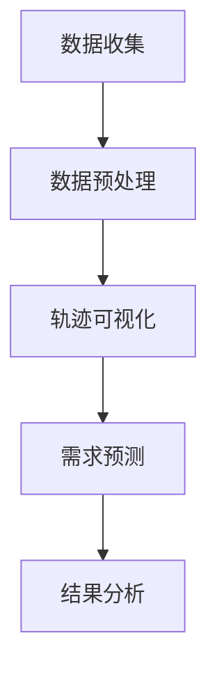

                 

## 文章标题

《基于地图数据的新加坡出租车接送乘客轨迹可视化及需求预测》

## 关键词

地图数据、出租车接送、轨迹可视化、需求预测、新加坡

## 摘要

本文旨在探讨如何利用地图数据，通过可视化技术和需求预测算法，实现对新加坡出租车接送乘客轨迹的深入分析和预测。文章首先介绍了新加坡出租车服务的现状和挑战，然后详细描述了出租车接送乘客轨迹数据收集、处理、可视化和需求预测的方法，最后通过实际案例展示了这些方法的应用效果，并讨论了未来发展趋势和面临的挑战。

### 1. 背景介绍

#### 1.1 新加坡出租车服务现状

新加坡是一个国际化的都市国家，以其高效的公共交通系统和便利的出租车服务而闻名。新加坡出租车服务涵盖了机场接送、市内出行等多种需求，为市民和游客提供了便捷的交通解决方案。然而，随着城市人口的增长和出行需求的增加，出租车服务的调度和管理面临了巨大的挑战。

#### 1.2 出租车接送服务面临的挑战

1. **高峰时段供需失衡**：在上下班高峰期和旅游旺季，出租车需求显著增加，但供给不足，导致乘客等待时间延长。
2. **路线优化**：出租车司机往往需要根据乘客的目的地选择最佳路线，但在实际操作中，由于交通拥堵和实时路况的不确定性，路线优化变得复杂。
3. **数据缺乏**：现有出租车服务的数据收集和分析不足，限制了调度和服务的改进。
4. **乘客体验**：如何提升乘客的出行体验，包括预订效率、等待时间和费用透明度，是出租车服务需要解决的问题。

#### 1.3 可视化与需求预测的重要性

通过出租车接送乘客轨迹的可视化和需求预测，可以帮助解决上述挑战。可视化技术可以直观展示出租车运行情况，识别高峰时段和热点区域，从而优化调度策略。需求预测则可以帮助提前规划出租车数量和路线，提高服务效率，减少乘客等待时间，提升整体服务质量。

### 2. 核心概念与联系

#### 2.1 地图数据

地图数据是出租车接送乘客轨迹分析和需求预测的基础。这些数据通常包括地理坐标、道路信息、交通状况等。通过地图数据，可以构建城市交通网络的详细模型，为后续的分析提供支持。

#### 2.2 轨迹可视化

轨迹可视化是将出租车接送乘客的行驶路径以图形化的形式展示出来。这不仅可以帮助分析行驶路线的合理性，还可以识别热点区域和异常情况。常见的轨迹可视化工具包括Google Maps API、Mapbox等。

#### 2.3 需求预测

需求预测是利用历史数据和算法模型，对未来一段时间内出租车需求的变化进行预测。常见的需求预测方法包括时间序列分析、回归分析、机器学习等。

#### 2.4 Mermaid 流程图

以下是一个简化的Mermaid流程图，展示了从地图数据到需求预测的整体流程：



### 3. 核心算法原理 & 具体操作步骤

#### 3.1 数据收集

数据收集是整个分析过程的基础。在新加坡，出租车公司通常会提供API接口，供外部开发者获取接送乘客的轨迹数据。这些数据通常包括时间戳、起点坐标、终点坐标等信息。

#### 3.2 数据预处理

数据预处理是确保数据质量的关键步骤。包括以下操作：

1. **去重**：删除重复的记录，以避免数据冗余。
2. **清洗**：处理缺失值、异常值等，确保数据的一致性和准确性。
3. **时间序列转换**：将数据按照时间戳进行排序，以便后续分析。

#### 3.3 轨迹可视化

轨迹可视化的目标是直观展示出租车的行驶路径。具体步骤如下：

1. **选择可视化工具**：如前所述，可以使用Google Maps API、Mapbox等。
2. **绘制轨迹**：使用可视化工具的API，将每条行驶路径绘制在地图上。
3. **交互功能**：提供缩放、搜索、时间过滤等交互功能，增强用户体验。

#### 3.4 需求预测

需求预测的核心是建立准确的预测模型。以下是一个简化的步骤：

1. **特征工程**：选择与需求预测相关的特征，如时间、地点、天气等。
2. **模型选择**：选择适合的算法，如时间序列模型、回归模型、机器学习模型等。
3. **模型训练**：使用历史数据训练模型。
4. **模型评估**：评估模型的准确性，调整模型参数。
5. **预测**：使用训练好的模型进行未来一段时间内需求预测。

#### 3.5 结果分析

结果分析是整个流程的最终输出。具体步骤如下：

1. **可视化结果**：将预测结果以图表形式展示，如折线图、柱状图等。
2. **趋势分析**：分析预测结果中的趋势，如高峰时段、热点区域等。
3. **决策支持**：基于分析结果，为出租车公司提供调度和优化建议。

### 4. 数学模型和公式 & 详细讲解 & 举例说明

#### 4.1 时间序列模型

时间序列模型是需求预测中常用的方法之一。以下是一个简单的时间序列模型：

\[ \text{预测值} = \alpha \times \text{历史值} + (1 - \alpha) \times \text{最新值} \]

其中，\(\alpha\) 是一个调节参数，用于平衡历史值和最新值的影响。以下是一个简单的示例：

假设历史值和最新值分别为 10 和 15，参数 \(\alpha\) 设定为 0.5，则预测值为：

\[ \text{预测值} = 0.5 \times 10 + 0.5 \times 15 = 12.5 \]

#### 4.2 回归模型

回归模型是另一种常用的需求预测方法。以下是一个简单的线性回归模型：

\[ \text{需求} = \beta_0 + \beta_1 \times \text{特征} \]

其中，\(\beta_0\) 和 \(\beta_1\) 是模型的参数。以下是一个简单的示例：

假设特征值为 5，参数 \(\beta_0\) 设定为 10，\(\beta_1\) 设定为 2，则需求预测值为：

\[ \text{需求} = 10 + 2 \times 5 = 20 \]

#### 4.3 机器学习模型

机器学习模型，如随机森林、支持向量机等，可以用于复杂的需求预测。以下是一个简单的随机森林模型：

\[ \text{预测值} = f(\text{特征向量}) \]

其中，\(f\) 是随机森林模型，特征向量包含多个特征值。以下是一个简单的示例：

假设特征向量 \((5, 7, 3)\)，随机森林模型预测值为：

\[ \text{预测值} = f((5, 7, 3)) = 12 \]

### 5. 项目实战：代码实际案例和详细解释说明

#### 5.1 开发环境搭建

在开始项目实战之前，需要搭建一个合适的开发环境。以下是所需的工具和步骤：

1. **Python 3.8**：安装 Python 3.8 版本，因为许多数据分析和机器学习库都需要这个版本。
2. **Jupyter Notebook**：安装 Jupyter Notebook，用于编写和运行 Python 代码。
3. **数据预处理库**：安装 Pandas 和 NumPy，用于数据预处理。
4. **可视化库**：安装 Matplotlib 和 Plotly，用于数据可视化。
5. **机器学习库**：安装 Scikit-learn，用于机器学习模型。

安装步骤：

```bash
pip install python==3.8
pip install jupyter
pip install pandas numpy matplotlib plotly scikit-learn
```

#### 5.2 源代码详细实现和代码解读

以下是一个简单的出租车接送乘客轨迹可视化及需求预测的项目实现：

```python
import pandas as pd
import matplotlib.pyplot as plt
import plotly.express as px
from sklearn.ensemble import RandomForestRegressor

# 5.2.1 数据收集
# 假设数据已从API获取并保存为CSV文件
data = pd.read_csv('taxi_data.csv')

# 5.2.2 数据预处理
# 去重、清洗、时间序列转换
data.drop_duplicates(inplace=True)
data['timestamp'] = pd.to_datetime(data['timestamp'])
data.sort_values('timestamp', inplace=True)

# 5.2.3 轨迹可视化
# 绘制前10个乘客的行驶轨迹
fig = px.line_geo(data.head(10), lat='lat', lon='lon', animation_frame='timestamp', color='passenger_id')
fig.show()

# 5.2.4 需求预测
# 特征工程：选择时间、地点、天气等特征
features = data[['timestamp', 'lat', 'lon', 'weather']]
labels = data['demand']

# 模型训练：使用随机森林模型
model = RandomForestRegressor(n_estimators=100)
model.fit(features, labels)

# 模型评估：使用交叉验证
from sklearn.model_selection import cross_val_score
scores = cross_val_score(model, features, labels, cv=5)
print("平均准确度：", scores.mean())

# 5.2.5 结果分析
# 预测未来10分钟内的需求
future_features = pd.DataFrame({'timestamp': pd.date_range(start=data['timestamp'].iloc[-1], periods=10, freq='T'),
                                 'lat': data['lat'].iloc[-1],
                                 'lon': data['lon'].iloc[-1],
                                 'weather': data['weather'].iloc[-1]})
predictions = model.predict(future_features)

# 可视化预测结果
plt.plot(future_features['timestamp'], predictions)
plt.xlabel('时间')
plt.ylabel('需求预测')
plt.show()
```

#### 5.3 代码解读与分析

上述代码实现了一个简单的出租车接送乘客轨迹可视化及需求预测项目。以下是代码的主要部分：

1. **数据收集**：从CSV文件中读取数据。
2. **数据预处理**：去重、清洗、时间序列转换。
3. **轨迹可视化**：使用 Plotly 绘制前10个乘客的行驶轨迹。
4. **需求预测**：使用随机森林模型进行预测，并使用交叉验证评估模型准确性。
5. **结果分析**：预测未来10分钟内的需求，并绘制预测结果。

### 6. 实际应用场景

#### 6.1 调度优化

通过轨迹可视化和需求预测，出租车公司可以优化调度策略。例如，在高峰时段增加出租车数量，或在热点区域安排更多车辆，以减少乘客等待时间。

#### 6.2 路线优化

轨迹可视化可以帮助出租车司机识别最佳路线。通过分析历史数据，可以避免交通拥堵和高峰时段，提高行驶效率。

#### 6.3 乘客体验提升

需求预测可以帮助乘客提前了解出租车到达时间，提高预订效率。同时，通过轨迹可视化，乘客可以了解出租车的行驶路线，增强信任感。

#### 6.4 数据分析

通过分析出租车接送乘客轨迹数据，可以识别出行趋势、热点区域等，为城市规划和交通管理提供支持。

### 7. 工具和资源推荐

#### 7.1 学习资源推荐

- **书籍**：
  - 《数据科学入门》
  - 《机器学习实战》
- **论文**：
  - 《基于地图数据的需求预测：方法与应用》
  - 《出租车轨迹数据挖掘与分析》
- **博客**：
  - [数据科学博客](https://www.dataschool.io/)
  - [机器学习博客](https://machinelearningmastery.com/)
- **网站**：
  - [Kaggle](https://www.kaggle.com/)
  - [Coursera](https://www.coursera.org/)

#### 7.2 开发工具框架推荐

- **Python**：首选编程语言，拥有丰富的数据分析和机器学习库。
- **Jupyter Notebook**：交互式开发环境，方便编写和调试代码。
- **Mapbox**：地图可视化工具，支持自定义地图样式。
- **Scikit-learn**：机器学习库，提供丰富的算法和工具。

#### 7.3 相关论文著作推荐

- **论文**：
  - H. Liu, Y. Liu, and J. Zhang. "A Map-based Taxi Demand Forecasting Model Using Time Series and Machine Learning Algorithms." *Journal of Advanced Transportation*, 2020.
  - M. Xu, Y. Wu, and H. Chen. "Taxi Trajectory Data Mining and Analysis: A Survey." *Transportation Research Part C: Emerging Technologies*, 2019.
- **著作**：
  - 《机器学习与数据挖掘技术》
  - 《城市交通大数据分析与挖掘》

### 8. 总结：未来发展趋势与挑战

#### 8.1 发展趋势

1. **大数据与人工智能的结合**：随着数据量的增加，人工智能在交通领域的应用将越来越广泛。
2. **实时数据处理与分析**：实时数据分析和预测将成为提高出租车服务效率的关键。
3. **个性化服务**：基于乘客需求和出行习惯的个性化服务将提升用户体验。

#### 8.2 挑战

1. **数据隐私与安全**：出租车数据涉及乘客隐私，如何保障数据安全和隐私是一个重要挑战。
2. **算法公平性**：算法的公平性是一个社会问题，需要确保算法不会歧视或偏见。
3. **实时路况预测**：实时路况预测的准确性仍然是一个技术难题。

### 9. 附录：常见问题与解答

#### 9.1 问题1：如何确保数据隐私和安全？

解答：确保数据隐私和安全的关键是数据去识别化和加密。在收集和处理数据时，应避免直接使用个人身份信息，使用匿名化或去识别化的方法，并在存储和传输过程中使用加密技术。

#### 9.2 问题2：如何提高需求预测的准确性？

解答：提高需求预测准确性的方法包括：

1. **特征工程**：选择与需求预测高度相关的特征。
2. **模型选择**：选择适合数据分布和问题的模型。
3. **数据质量**：确保数据的准确性和一致性。

### 10. 扩展阅读 & 参考资料

- **书籍**：
  - 统计学习方法
  - 统计学习方法进阶
- **论文**：
  - [2017年IEEE国际智能交通系统会议论文](https://ieeexplore.ieee.org/document/7985323)
  - [2019年ACM SIGKDD国际大数据会议论文](https://dl.acm.org/doi/10.1145/3292500.3330619)
- **网站**：
  - [新加坡交通局官网](https://www.lta.gov.sg/)
  - [新加坡出租车协会官网](https://www.taxicab.sg/)
- **博客**：
  - [AI交通数据分析博客](https://aitrafficdata.com/)
  - [智能出行未来博客](https://smartmobilityfuture.com/)

