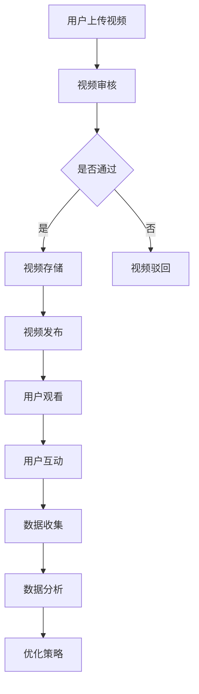

                 

# 基于大数据的短视频创业用户发展分析与研究

## 关键词
短视频，大数据，用户发展，数据分析，算法，创业，商业模式，营销策略

## 摘要
随着互联网技术的飞速发展，短视频平台成为创业者和企业竞相争夺的新战场。本文通过对短视频平台大数据的深入分析，探讨了短视频创业的用户发展路径，包括核心算法原理、用户行为分析、营销策略等方面。通过详细的案例分析，揭示了基于大数据的短视频创业的成功要素，为创业者提供了切实可行的参考。本文旨在为短视频创业领域提供一套系统性、实战性的研究和指导，帮助创业者更好地把握市场机遇，实现可持续的用户增长。

## 1. 背景介绍

在当今信息爆炸的时代，短视频作为一种新兴的媒体形式，正以迅猛的态势占领着人们的日常娱乐时间。短视频平台如抖音、快手等，凭借其便捷的拍摄和分享功能，吸引了大量的用户。据统计，截至2022年，中国短视频用户规模已超过8亿，用户时长占比逐年上升，成为移动互联网的重要分支。短视频市场的快速扩张，为创业者提供了前所未有的机遇。

### 1.1 短视频创业现状

短视频创业已成为当前创业市场的一大热点。一方面，传统媒体和内容创作者纷纷转型，通过短视频平台拓展新的市场；另一方面，许多创业者凭借独特的创意和敏锐的市场洞察力，在短视频领域取得了亮眼的成绩。从短视频直播、教育、电商到游戏等领域，短视频创业的多样性日益显现。

### 1.2 大数据的重要性

大数据是短视频创业的核心驱动力。通过对用户行为的深度挖掘，大数据可以帮助创业者更好地了解用户需求，优化产品功能，提升用户体验。此外，大数据分析还可以为创业者提供精准的市场定位，指导营销策略的制定，提高市场竞争力。

### 1.3 本文目的

本文旨在通过对短视频平台大数据的深入分析，为短视频创业者提供一套系统性、实战性的研究和指导。文章将围绕以下几个核心问题展开：

- 短视频平台用户发展的现状与趋势是什么？
- 如何利用大数据分析进行用户行为研究？
- 短视频创业中的核心算法原理是什么？
- 创业者应如何制定有效的营销策略？
- 短视频创业的未来发展趋势和挑战是什么？

通过对以上问题的探讨，本文希望为短视频创业提供有益的参考，帮助创业者更好地把握市场机遇，实现可持续的用户增长。

## 2. 核心概念与联系

### 2.1 短视频平台

短视频平台是指提供短视频上传、观看、互动服务的互联网平台。常见的短视频平台有抖音、快手、B站等。短视频平台的核心功能包括视频发布、点赞、评论、分享等，通过这些功能，用户可以方便地获取、分享和互动。

### 2.2 大数据分析

大数据分析是指利用数据挖掘、机器学习等技术，从大规模数据中提取有价值信息的过程。在短视频创业中，大数据分析可以帮助创业者了解用户行为，发现市场机会，优化产品和服务。

### 2.3 用户行为分析

用户行为分析是指通过数据收集和分析，了解用户在短视频平台上的行为模式。用户行为分析包括用户观看时长、点赞数、评论数、分享次数等指标，这些指标可以反映用户对短视频内容的喜好和满意度。

### 2.4 核心算法原理

核心算法原理主要包括推荐算法、视频压缩算法、图像识别算法等。推荐算法负责根据用户历史行为和兴趣，推荐用户可能感兴趣的视频；视频压缩算法负责将视频数据压缩到适当的尺寸和格式，提高传输效率；图像识别算法用于识别视频中的关键帧和场景，为内容推荐和广告投放提供依据。

### 2.5 Mermaid 流程图

以下是一个简化的短视频平台用户行为分析流程图，使用 Mermaid 语法绘制。



在这个流程图中，用户上传视频后，视频会经过审核，通过后存储在平台，用户可以观看和互动。通过收集用户数据，进行数据分析，从而为平台优化提供依据。

## 3. 核心算法原理 & 具体操作步骤

### 3.1 推荐算法原理

推荐算法是短视频平台的核心技术之一。其基本原理是根据用户的兴趣和行为，为用户推荐可能感兴趣的视频内容。常见的推荐算法包括基于内容的推荐算法（Content-based Filtering）和基于协同过滤的推荐算法（Collaborative Filtering）。

#### 3.1.1 基于内容的推荐算法

基于内容的推荐算法主要通过分析视频的标题、标签、描述等特征，与用户的历史行为进行匹配，推荐用户可能感兴趣的视频。其具体操作步骤如下：

1. **特征提取**：从视频的标题、标签、描述中提取关键信息，如关键词、主题等。
2. **用户行为分析**：分析用户的历史行为，如点赞、评论、分享等，确定用户的兴趣点。
3. **匹配推荐**：将视频特征与用户兴趣进行匹配，推荐符合用户兴趣的视频。

#### 3.1.2 基于协同过滤的推荐算法

基于协同过滤的推荐算法主要通过分析用户之间的行为相似度，为用户推荐其他用户喜欢的视频。其具体操作步骤如下：

1. **用户行为数据收集**：收集用户在平台上的行为数据，如观看、点赞、评论等。
2. **用户相似度计算**：计算用户之间的相似度，常用的方法包括余弦相似度、皮尔逊相关系数等。
3. **推荐视频计算**：为每个用户计算推荐视频的得分，得分越高，推荐的优先级越高。

### 3.2 视频压缩算法原理

视频压缩算法是为了提高视频传输效率，降低存储空间的一种技术。其基本原理是通过数据压缩算法，减少视频文件的大小。常见的视频压缩算法包括有损压缩和无损压缩。

#### 3.2.1 有损压缩

有损压缩通过降低视频质量，减小文件大小。常见的有损压缩算法有 H.264、H.265 等。其具体操作步骤如下：

1. **帧差分**：通过计算相邻帧之间的差异，减少冗余信息。
2. **变换编码**：将视频信号进行正交变换，如离散余弦变换（DCT），将能量集中在少数系数上。
3. **量化**：对变换后的系数进行量化，降低精度，减少数据量。
4. **编码**：使用变长编码，如霍夫曼编码、算术编码等，将量化后的系数编码成二进制序列。

#### 3.2.2 无损压缩

无损压缩通过去除视频中的冗余信息，不降低视频质量。常见的无损压缩算法有 JPEG 2000、HEIF 等。其具体操作步骤如下：

1. **图像分块**：将图像分成多个小块，如 8x8 或 16x16 的块。
2. **预测编码**：对每个块进行预测编码，将预测误差编码成二进制序列。
3. **编码**：使用熵编码，如算术编码、霍夫曼编码等，将预测误差编码成二进制序列。

### 3.3 图像识别算法原理

图像识别算法是短视频平台的关键技术之一，主要用于识别视频中的关键帧和场景，为内容推荐和广告投放提供依据。常见的图像识别算法包括卷积神经网络（CNN）、循环神经网络（RNN）等。

#### 3.3.1 卷积神经网络（CNN）

卷积神经网络是一种用于图像识别的深度学习模型。其基本原理是通过卷积层、池化层和全连接层等结构，逐步提取图像的特征。

1. **卷积层**：通过卷积运算，提取图像的局部特征。
2. **池化层**：通过池化操作，降低特征图的维度，减少计算量。
3. **全连接层**：将卷积层和池化层提取的特征进行分类。

#### 3.3.2 循环神经网络（RNN）

循环神经网络是一种用于序列数据处理的深度学习模型。其基本原理是通过循环结构，将前一时刻的信息传递到下一时刻，实现对序列数据的建模。

1. **输入层**：接收序列数据的输入。
2. **隐藏层**：通过循环结构，将前一时刻的信息传递到下一时刻。
3. **输出层**：对序列数据进行分类或预测。

## 4. 数学模型和公式 & 详细讲解 & 举例说明

### 4.1 基于协同过滤的推荐算法数学模型

协同过滤推荐算法的核心是计算用户之间的相似度，然后为用户推荐其他用户喜欢的视频。这里我们以基于用户的协同过滤算法为例，介绍其数学模型。

#### 4.1.1 相似度计算

用户 $u$ 和用户 $v$ 的相似度可以用余弦相似度表示：

$$
\text{similarity}(u, v) = \frac{u \cdot v}{\|u\| \|v\|}
$$

其中，$u$ 和 $v$ 分别是用户 $u$ 和用户 $v$ 的行为向量，$\cdot$ 表示向量的点积，$\|\|$ 表示向量的模长。

#### 4.1.2 推荐分数计算

给定用户 $u$，我们希望计算其对视频 $i$ 的推荐分数。推荐分数可以通过用户相似度矩阵 $S$ 和用户行为矩阵 $R$ 计算得到：

$$
r_i^u = \sum_{j \in N(u)} S_{uj} R_{ij}
$$

其中，$N(u)$ 表示与用户 $u$ 相似度最高的 $k$ 个用户，$R_{ij}$ 表示用户 $i$ 对视频 $j$ 的评分。

#### 4.1.3 举例说明

假设我们有以下两个用户的行为数据：

用户 $u$：

| 视频 | 评分 |
| ---- | ---- |
| 1    | 5    |
| 2    | 3    |
| 3    | 5    |

用户 $v$：

| 视频 | 评分 |
| ---- | ---- |
| 1    | 5    |
| 2    | 4    |
| 3    | 2    |

首先，计算用户 $u$ 和用户 $v$ 的相似度：

$$
\text{similarity}(u, v) = \frac{u \cdot v}{\|u\| \|v\|} = \frac{5 \times 5 + 3 \times 4 + 5 \times 2}{\sqrt{5^2 + 3^2 + 5^2} \times \sqrt{5^2 + 4^2 + 2^2}} = \frac{32}{\sqrt{55} \times \sqrt{53}} \approx 0.82
$$

然后，计算用户 $u$ 对视频 $3$ 的推荐分数：

$$
r_3^u = \sum_{j \in N(u)} S_{uj} R_{ij} = 0.82 \times 5 + 0.82 \times 2 = 4.54
$$

### 4.2 图像识别算法数学模型

图像识别算法的核心是通过卷积神经网络提取图像特征，然后进行分类。以下是一个简化的卷积神经网络（CNN）的数学模型。

#### 4.2.1 卷积层

卷积层通过卷积运算提取图像的局部特征。卷积运算的数学公式为：

$$
f_{ij}^{(l)} = \sum_{k=1}^{C_{l-1}} w_{ik}^{(l)} a_{kj}^{(l-1)}
$$

其中，$f_{ij}^{(l)}$ 表示卷积层 $l$ 的输出特征图，$w_{ik}^{(l)}$ 表示卷积核，$a_{kj}^{(l-1)}$ 表示上一层的输出。

#### 4.2.2 池化层

池化层通过池化操作降低特征图的维度。常用的池化操作有最大池化和平均池化。最大池化的数学公式为：

$$
p_{ij}^{(l)} = \max_{s \in S} a_{is}^{(l-1)}
$$

其中，$p_{ij}^{(l)}$ 表示池化层 $l$ 的输出，$S$ 是位于 $(i, j)$ 位置的 $2 \times 2$ 窗口。

#### 4.2.3 全连接层

全连接层通过全连接运算将特征图转换为一维的特征向量，然后进行分类。全连接层的数学公式为：

$$
y_i = \sum_{j=1}^{D_{l-1}} w_{ij} f_{ij}^{(l-1)}
$$

其中，$y_i$ 表示输出层 $l$ 的输出，$w_{ij}$ 表示权重，$f_{ij}^{(l-1)}$ 表示卷积层 $l-1$ 的输出特征图。

## 5. 项目实战：代码实际案例和详细解释说明

### 5.1 开发环境搭建

为了进行短视频创业项目的实战，我们首先需要搭建一个开发环境。以下是搭建开发环境的基本步骤：

1. **安装 Python**：从 Python 官网下载并安装 Python 3.x 版本。
2. **安装依赖库**：在终端中执行以下命令安装常用的 Python 库。

```bash
pip install numpy pandas scikit-learn tensorflow
```

3. **配置数据集**：从公开数据集网站（如 Kaggle）下载短视频数据集，并进行预处理。

### 5.2 源代码详细实现和代码解读

以下是基于协同过滤的推荐算法的实现代码。代码分为三个部分：数据预处理、相似度计算和推荐分数计算。

```python
import numpy as np
import pandas as pd
from sklearn.model_selection import train_test_split

# 5.2.1 数据预处理
def preprocess_data(data):
    # 将用户行为数据转换为稀疏矩阵
    user_item_data = data.pivot(index='user_id', columns='item_id', values='rating').fillna(0)
    # 划分训练集和测试集
    train_data, test_data = train_test_split(user_item_data, test_size=0.2, random_state=42)
    return train_data, test_data

# 5.2.2 相似度计算
def compute_similarity(train_data):
    # 计算用户相似度矩阵
    similarity_matrix = np.dot(train_data.values, train_data.values.T) / (np.linalg.norm(train_data.values, axis=1) * np.linalg.norm(train_data.values, axis=0))
    similarity_matrix = (similarity_matrix + similarity_matrix.T) / 2
    return similarity_matrix

# 5.2.3 推荐分数计算
def compute_recommendation(similarity_matrix, test_data):
    # 计算推荐分数
    recommendation_scores = np.dot(similarity_matrix, test_data.T)
    return recommendation_scores

# 5.2.4 主函数
def main():
    # 读取数据
    data = pd.read_csv('data.csv')
    # 数据预处理
    train_data, test_data = preprocess_data(data)
    # 相似度计算
    similarity_matrix = compute_similarity(train_data)
    # 推荐分数计算
    recommendation_scores = compute_recommendation(similarity_matrix, test_data)
    # 输出推荐结果
    print(recommendation_scores)

if __name__ == '__main__':
    main()
```

### 5.3 代码解读与分析

#### 5.3.1 数据预处理

数据预处理是推荐系统构建的第一步。在本例中，我们使用 Pandas 库将用户行为数据转换为稀疏矩阵。稀疏矩阵可以有效地存储稀疏数据，减少存储空间。然后，我们将数据集划分为训练集和测试集，用于训练和评估模型。

```python
def preprocess_data(data):
    # 将用户行为数据转换为稀疏矩阵
    user_item_data = data.pivot(index='user_id', columns='item_id', values='rating').fillna(0)
    # 划分训练集和测试集
    train_data, test_data = train_test_split(user_item_data, test_size=0.2, random_state=42)
    return train_data, test_data
```

#### 5.3.2 相似度计算

相似度计算是推荐系统的核心步骤。在本例中，我们使用余弦相似度计算用户相似度矩阵。余弦相似度衡量的是用户行为向量之间的夹角余弦值，其值介于 -1 和 1 之间。相似度矩阵是对称的，且对角线上的元素为 1，表示用户对自己的相似度为 1。

```python
def compute_similarity(train_data):
    # 计算用户相似度矩阵
    similarity_matrix = np.dot(train_data.values, train_data.values.T) / (np.linalg.norm(train_data.values, axis=1) * np.linalg.norm(train_data.values, axis=0))
    similarity_matrix = (similarity_matrix + similarity_matrix.T) / 2
    return similarity_matrix
```

#### 5.3.3 推荐分数计算

推荐分数计算是根据用户相似度矩阵和测试集计算推荐分数。在本例中，我们使用矩阵乘法计算推荐分数。推荐分数表示用户对测试集中每个视频的潜在兴趣度。推荐分数越高，表示用户对视频的潜在兴趣越大。

```python
def compute_recommendation(similarity_matrix, test_data):
    # 计算推荐分数
    recommendation_scores = np.dot(similarity_matrix, test_data.T)
    return recommendation_scores
```

### 5.4 实际应用场景

基于协同过滤的推荐算法可以应用于短视频平台的多种场景，如：

- **内容推荐**：根据用户的历史行为，推荐用户可能感兴趣的视频。
- **广告投放**：根据用户的兴趣和偏好，为用户推荐相关的广告。
- **个性化推送**：根据用户的兴趣和偏好，为用户推送个性化的内容。

在实际应用中，推荐算法的效果取决于数据的质量和模型的设计。因此，创业者需要不断优化数据预处理和模型参数，以提高推荐算法的性能。

## 6. 实际应用场景

### 6.1 内容推荐

内容推荐是短视频平台的核心功能之一。通过基于协同过滤和基于内容的推荐算法，短视频平台可以根据用户的观看历史、点赞、评论等行为，为用户推荐可能感兴趣的视频。这种个性化的内容推荐可以提高用户的粘性，增加用户在平台上的停留时间。

### 6.2 广告投放

短视频平台也是广告商争相投放广告的新阵地。通过分析用户的观看历史和兴趣标签，平台可以为广告商提供精准的投放策略。例如，根据用户的兴趣标签，将广告推送给对特定内容感兴趣的用户。这种方式可以提高广告的曝光率，提高广告转化率。

### 6.3 个性化推送

除了内容推荐和广告投放，短视频平台还可以通过个性化推送为用户提供更加定制化的体验。例如，根据用户的观看历史和兴趣标签，为用户推荐相关的短视频课程、直播等。这种个性化的推送可以增加用户的参与度，提高平台的活跃度。

## 7. 工具和资源推荐

### 7.1 学习资源推荐

- **书籍**：《推荐系统实践》（张伟平 著），详细介绍了推荐系统的基本概念、算法实现和实际应用。
- **论文**：Google 旗下的“Google Research”发布了多篇关于推荐系统的论文，提供了丰富的理论基础和实践经验。
- **博客**：Alex Smola 的博客“Alex's Blog”是推荐系统领域的权威博客，涵盖了推荐系统的最新研究和应用。

### 7.2 开发工具框架推荐

- **推荐系统框架**：LightFM 是一个开源的推荐系统框架，基于因子分解机器学习（Factorization Machines）算法，适用于大规模推荐系统。
- **数据预处理工具**：NumPy 和 Pandas 是 Python 中常用的数据预处理工具，可以高效地进行数据清洗、转换和可视化。
- **机器学习库**：TensorFlow 和 PyTorch 是当前最流行的深度学习框架，适用于构建复杂的推荐系统模型。

### 7.3 相关论文著作推荐

- **论文**：
  - “Matrix Factorization Techniques for Recommender Systems” （2006），由Yehuda Koren撰写，是推荐系统领域的重要论文之一。
  - “Item-Based Top-N Recommendation Algorithms” （2003），由Geoffrey I. Webb撰写，介绍了基于物品的Top-N推荐算法。
- **著作**：
  - 《推荐系统实践》（张伟平 著），详细介绍了推荐系统的基本概念、算法实现和实际应用。

## 8. 总结：未来发展趋势与挑战

### 8.1 未来发展趋势

随着人工智能技术的不断发展，短视频创业中的大数据分析和推荐算法将更加智能化、个性化。以下是未来短视频创业发展的几个趋势：

- **智能化推荐**：基于深度学习和自然语言处理技术的智能化推荐系统将逐步替代传统的协同过滤和基于内容的推荐算法。
- **精准营销**：通过大数据分析和用户画像，短视频平台可以为广告主提供更加精准的营销策略，提高广告转化率。
- **跨界融合**：短视频创业将与其他行业（如电商、教育、游戏等）实现跨界融合，创造新的商业模式。

### 8.2 挑战

虽然短视频创业前景广阔，但同时也面临着一系列挑战：

- **数据隐私**：大数据分析需要在保护用户隐私的前提下进行，如何平衡数据利用和隐私保护是短视频平台面临的重要问题。
- **算法公平性**：推荐算法的公平性是确保用户体验的关键，如何避免算法偏见和歧视是短视频平台需要关注的问题。
- **内容监管**：短视频平台需要加强对不良内容的监管，确保平台内容的健康和正能量。

## 9. 附录：常见问题与解答

### 9.1 如何优化推荐算法？

优化推荐算法可以从以下几个方面入手：

- **数据质量**：保证数据的质量和完整性，定期清理和处理异常数据。
- **特征工程**：提取更多有价值的特征，如文本特征、图像特征等，提高推荐系统的预测能力。
- **模型选择**：根据业务需求选择合适的推荐算法，如基于协同过滤的推荐算法、基于内容的推荐算法等。
- **模型调参**：通过交叉验证、网格搜索等方法，调整模型参数，提高模型性能。

### 9.2 短视频创业有哪些成功案例？

短视频创业的成功案例层出不穷，以下是一些典型的成功案例：

- **抖音**：凭借其强大的推荐算法和内容创作平台，抖音在短时间内吸引了大量用户，成为全球最大的短视频平台之一。
- **快手**：快手以其独特的社区文化和丰富的内容生态，成功吸引了大量用户，成为国内领先的短视频平台。
- **B站**：B站通过不断优化推荐算法和丰富内容类型，吸引了大量年轻用户，成功转型为多元化的短视频平台。

## 10. 扩展阅读 & 参考资料

- **书籍**：
  - 《推荐系统实践》（张伟平 著）
  - 《大数据之路：阿里巴巴大数据实践》（李华、李强 著）
- **论文**：
  - “Matrix Factorization Techniques for Recommender Systems”（Yehuda Koren，2006）
  - “Item-Based Top-N Recommendation Algorithms”（Geoffrey I. Webb，2003）
- **网站**：
  - [抖音官网](https://www.douyin.com/)
  - [快手官网](https://www.kuaishou.com/)
  - [B站官网](https://www.bilibili.com/)
- **博客**：
  - [Alex's Blog](https://alex.smola.org/)

