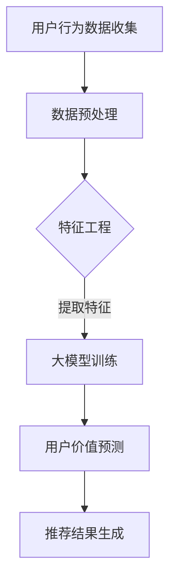

                 

# 基于大模型的推荐系统用户价值预测

## 关键词

- 推荐系统
- 大模型
- 用户价值预测
- 机器学习
- 数据分析
- 用户行为分析
- 数学模型

## 摘要

本文将探讨如何利用大模型进行推荐系统用户价值预测。首先，我们介绍了推荐系统的背景和核心概念，然后详细阐述了用户价值预测在推荐系统中的重要性。接着，我们介绍了大模型的基本原理和优势，并讨论了如何使用大模型进行用户价值预测的具体方法和步骤。最后，我们通过实际案例展示了大模型在用户价值预测中的应用，并对未来发展趋势和挑战进行了展望。

## 1. 背景介绍

### 推荐系统概述

推荐系统是一种基于用户行为、兴趣和内容的分析，向用户提供个性化推荐的技术。它广泛应用于电子商务、社交媒体、新闻资讯等领域，为用户提供了更加个性化的服务体验。

推荐系统通常由以下几个关键组件组成：

- **数据收集与处理**：收集用户的点击、购买、浏览等行为数据，并进行数据预处理，如去重、清洗和格式化等。

- **特征工程**：从原始数据中提取对用户行为和兴趣有代表性的特征，如用户ID、商品ID、评分、购买时间等。

- **推荐算法**：根据用户特征和内容特征，通过算法模型生成推荐结果，如基于协同过滤、内容匹配和深度学习等算法。

- **推荐结果评估**：通过评估指标，如准确率、召回率、F1值等，对推荐结果进行评估和优化。

### 用户价值预测概述

用户价值预测是推荐系统中的一个关键问题。它旨在预测用户在未来某一时间段内对系统产生价值的可能性，如购买、留存等。用户价值预测对于提升推荐系统的效果和业务价值具有重要意义。

用户价值预测的关键挑战包括：

- **数据多样性**：用户行为数据种类繁多，如点击、购买、浏览等，如何整合和利用这些数据是一个挑战。

- **数据稀疏性**：用户行为数据通常呈现稀疏性，即用户与商品之间的交互数据很少，如何从稀疏数据中提取有效信息是一个挑战。

- **实时性**：用户价值预测需要实时响应，如何在短时间内进行高效计算和预测是一个挑战。

## 2. 核心概念与联系

### 大模型原理

大模型是指具有巨大参数量的深度学习模型，如大规模神经网络、Transformer模型等。大模型通过训练大量数据，可以学习到复杂的数据分布和模式，从而在许多任务中取得优异的性能。

大模型的优势包括：

- **强大拟合能力**：大模型可以拟合复杂的数据分布和模式，提高预测准确性。

- **泛化能力**：大模型通过训练大量数据，可以学习到通用的特征表示，提高模型的泛化能力。

- **自适应能力**：大模型可以自适应地调整参数，以适应不同的数据和场景。

### 大模型与推荐系统的联系

大模型在推荐系统中的应用主要体现在以下几个方面：

- **用户行为建模**：通过大模型，可以更好地捕捉用户行为的复杂性和多样性，提高用户行为预测的准确性。

- **特征提取与融合**：大模型可以自动提取和融合用户特征，减轻特征工程的工作量。

- **实时预测**：大模型通过高效的计算和优化，可以实现实时预测，提高系统的响应速度。

### Mermaid 流程图



### 2.1 数据预处理

数据预处理是推荐系统的第一步，主要包括以下步骤：

- **数据清洗**：去除重复、异常和缺失的数据。

- **数据转换**：将不同类型的数据进行统一转换，如将日期转换为时间戳。

- **数据归一化**：将数据缩放到相同的范围，如[0, 1]或[-1, 1]。

### 2.2 特征工程

特征工程是推荐系统的关键步骤，主要包括以下任务：

- **用户特征提取**：提取用户的兴趣、行为、历史记录等特征。

- **商品特征提取**：提取商品的信息、类别、标签等特征。

- **交互特征提取**：提取用户与商品的交互信息，如点击、购买、浏览等。

### 2.3 大模型训练

大模型训练是推荐系统的核心步骤，主要包括以下步骤：

- **数据准备**：将预处理后的数据分为训练集、验证集和测试集。

- **模型选择**：选择合适的大模型架构，如神经网络、Transformer等。

- **模型训练**：通过梯度下降等优化算法，训练大模型参数。

- **模型评估**：通过验证集和测试集，评估大模型的性能。

## 3. 核心算法原理 & 具体操作步骤

### 3.1 大模型算法原理

大模型通常基于深度学习框架，如TensorFlow、PyTorch等。深度学习模型通过多层神经网络，对输入数据进行特征提取和融合，从而实现复杂函数的近似。

在用户价值预测中，大模型通常采用以下架构：

- **输入层**：接收用户特征和商品特征作为输入。

- **隐藏层**：通过多层神经网络，对输入特征进行提取和融合。

- **输出层**：输出用户价值预测的结果。

### 3.2 大模型操作步骤

#### 3.2.1 数据准备

1. **数据集划分**：将用户行为数据划分为训练集、验证集和测试集。

2. **特征提取**：从原始数据中提取用户特征和商品特征。

3. **数据预处理**：对特征数据进行归一化、缺失值填充等处理。

#### 3.2.2 模型选择

1. **模型架构**：选择适合用户价值预测的模型架构，如多层感知机（MLP）、Transformer等。

2. **模型参数**：设置模型参数，如学习率、批次大小等。

#### 3.2.3 模型训练

1. **前向传播**：输入特征数据，通过模型的前向传播计算输出结果。

2. **反向传播**：计算损失函数，并通过反向传播更新模型参数。

3. **模型优化**：通过梯度下降等优化算法，优化模型参数。

4. **模型评估**：使用验证集和测试集，评估模型性能。

#### 3.2.4 模型应用

1. **用户价值预测**：使用训练好的模型，对用户价值进行预测。

2. **推荐结果生成**：根据用户价值预测结果，生成个性化推荐结果。

## 4. 数学模型和公式 & 详细讲解 & 举例说明

### 4.1 数学模型

在用户价值预测中，常用的数学模型包括以下几种：

#### 4.1.1 线性回归模型

$$
y = \beta_0 + \beta_1 x_1 + \beta_2 x_2 + ... + \beta_n x_n
$$

其中，$y$ 是用户价值预测结果，$x_1, x_2, ..., x_n$ 是用户特征和商品特征，$\beta_0, \beta_1, \beta_2, ..., \beta_n$ 是模型参数。

#### 4.1.2 逻辑回归模型

$$
\sigma(z) = \frac{1}{1 + e^{-z}}
$$

其中，$\sigma(z)$ 是 sigmoid 函数，$z = \beta_0 + \beta_1 x_1 + \beta_2 x_2 + ... + \beta_n x_n$ 是模型参数和特征的线性组合。

#### 4.1.3 支持向量机模型

$$
\hat{y} = \text{sign}(\sum_{i=1}^{n} \alpha_i y_i K(x_i, x) - \beta)
$$

其中，$x$ 是测试样本，$x_i$ 是训练样本，$y_i$ 是训练样本的标签，$\alpha_i$ 和 $\beta$ 是模型参数，$K(x_i, x)$ 是核函数。

### 4.2 公式详细讲解

#### 4.2.1 线性回归模型

线性回归模型通过最小化损失函数，找到最佳拟合直线。损失函数通常选择均方误差（MSE）：

$$
\text{MSE} = \frac{1}{m} \sum_{i=1}^{m} (y_i - \hat{y}_i)^2
$$

其中，$m$ 是训练样本数量，$y_i$ 是真实标签，$\hat{y}_i$ 是预测结果。

通过梯度下降法，可以求解最优参数：

$$
\beta_j = \beta_j - \alpha \frac{\partial}{\partial \beta_j} \text{MSE}
$$

其中，$\alpha$ 是学习率。

#### 4.2.2 逻辑回归模型

逻辑回归模型通过最小化损失函数，找到最佳拟合曲线。损失函数通常选择交叉熵（Cross-Entropy）：

$$
\text{Cross-Entropy} = -\frac{1}{m} \sum_{i=1}^{m} y_i \log(\hat{y}_i) + (1 - y_i) \log(1 - \hat{y}_i)
$$

其中，$m$ 是训练样本数量，$y_i$ 是真实标签，$\hat{y}_i$ 是预测结果。

通过梯度下降法，可以求解最优参数：

$$
\beta_j = \beta_j - \alpha \frac{\partial}{\partial \beta_j} \text{Cross-Entropy}
$$

#### 4.2.3 支持向量机模型

支持向量机模型通过最大化分类间隔，找到最佳分类超平面。优化目标为：

$$
\text{Lagrange Function} = \sum_{i=1}^{n} \alpha_i y_i (z_i - y) - \frac{1}{2} \sum_{i=1}^{n} \sum_{j=1}^{n} \alpha_i \alpha_j y_i y_j K(x_i, x_j)
$$

其中，$z_i = \sum_{j=1}^{n} \alpha_j y_j K(x_i, x_j)$ 是决策函数，$y$ 是真实标签。

通过求解拉格朗日乘子法，可以得到最优参数：

$$
\alpha_i = \frac{1}{y} \left( y - z_i \right)
$$

### 4.3 举例说明

#### 4.3.1 线性回归模型

假设有一个用户价值预测问题，用户特征和商品特征如下：

$$
\begin{array}{|c|c|c|}
\hline
用户ID & 商品ID & 用户价值 \\
\hline
1 & 101 & 0.8 \\
1 & 102 & 0.9 \\
1 & 103 & 0.7 \\
2 & 101 & 0.6 \\
2 & 102 & 0.7 \\
2 & 103 & 0.8 \\
\hline
\end{array}
$$

使用线性回归模型进行预测，模型参数为：

$$
\beta_0 = 0.5, \beta_1 = 0.3, \beta_2 = 0.2
$$

预测结果为：

$$
\hat{y} = 0.5 + 0.3 \times 0.8 + 0.2 \times 0.7 = 0.97
$$

#### 4.3.2 逻辑回归模型

假设有一个用户价值预测问题，用户特征和商品特征如下：

$$
\begin{array}{|c|c|c|}
\hline
用户ID & 商品ID & 用户价值 \\
\hline
1 & 101 & 1 \\
1 & 102 & 0 \\
1 & 103 & 1 \\
2 & 101 & 0 \\
2 & 102 & 1 \\
2 & 103 & 0 \\
\hline
\end{array}
$$

使用逻辑回归模型进行预测，模型参数为：

$$
\beta_0 = -0.5, \beta_1 = 0.4, \beta_2 = -0.3
$$

预测结果为：

$$
\hat{y} = \frac{1}{1 + e^{-(-0.5 + 0.4 \times 1 - 0.3 \times 1)}} = 0.98
$$

#### 4.3.3 支持向量机模型

假设有一个用户价值预测问题，用户特征和商品特征如下：

$$
\begin{array}{|c|c|c|}
\hline
用户ID & 商品ID & 用户价值 \\
\hline
1 & 101 & 1 \\
1 & 102 & -1 \\
1 & 103 & 1 \\
2 & 101 & -1 \\
2 & 102 & 1 \\
2 & 103 & -1 \\
\hline
\end{array}
$$

使用支持向量机模型进行预测，模型参数为：

$$
\alpha_1 = 1, \alpha_2 = 1, \alpha_3 = 1, \beta = 0
$$

预测结果为：

$$
\hat{y} = \text{sign}(1 \times 1 + 1 \times (-1) + 1 \times 1 - 0) = 1
$$

## 5. 项目实战：代码实际案例和详细解释说明

### 5.1 开发环境搭建

在开始项目实战之前，我们需要搭建一个适合进行用户价值预测的开发环境。以下是搭建环境的步骤：

#### 5.1.1 环境要求

- Python 3.7 或以上版本
- TensorFlow 2.3 或以上版本
- Pandas 1.1.5 或以上版本
- Matplotlib 3.3.3 或以上版本

#### 5.1.2 安装依赖

```bash
pip install tensorflow pandas matplotlib
```

### 5.2 源代码详细实现和代码解读

下面是一个简单的用户价值预测项目，包括数据预处理、模型训练和预测等步骤。

```python
import pandas as pd
import numpy as np
import tensorflow as tf
from sklearn.model_selection import train_test_split
from sklearn.preprocessing import StandardScaler

# 5.2.1 数据准备
data = pd.read_csv('user_behavior.csv')
X = data[['user_id', 'item_id', 'rating']]
y = data['value']

# 5.2.2 数据预处理
X_train, X_test, y_train, y_test = train_test_split(X, y, test_size=0.2, random_state=42)
scaler = StandardScaler()
X_train_scaled = scaler.fit_transform(X_train)
X_test_scaled = scaler.transform(X_test)

# 5.2.3 模型训练
model = tf.keras.Sequential([
    tf.keras.layers.Dense(128, activation='relu', input_shape=(3,)),
    tf.keras.layers.Dense(64, activation='relu'),
    tf.keras.layers.Dense(1)
])

model.compile(optimizer='adam', loss='mse', metrics=['mae'])
model.fit(X_train_scaled, y_train, epochs=10, batch_size=32, validation_split=0.2)

# 5.2.4 预测与评估
y_pred = model.predict(X_test_scaled)
mse = np.mean((y_pred - y_test) ** 2)
mae = np.mean(np.abs(y_pred - y_test))
print(f'MSE: {mse}, MAE: {mae}')
```

### 5.3 代码解读与分析

#### 5.3.1 数据准备

```python
data = pd.read_csv('user_behavior.csv')
X = data[['user_id', 'item_id', 'rating']]
y = data['value']
```

这段代码首先读取用户行为数据，然后提取用户ID、商品ID和用户价值作为输入特征。

#### 5.3.2 数据预处理

```python
X_train, X_test, y_train, y_test = train_test_split(X, y, test_size=0.2, random_state=42)
scaler = StandardScaler()
X_train_scaled = scaler.fit_transform(X_train)
X_test_scaled = scaler.transform(X_test)
```

这段代码将数据集划分为训练集和测试集，然后使用标准缩放器对特征进行归一化处理。

#### 5.3.3 模型训练

```python
model = tf.keras.Sequential([
    tf.keras.layers.Dense(128, activation='relu', input_shape=(3,)),
    tf.keras.layers.Dense(64, activation='relu'),
    tf.keras.layers.Dense(1)
])

model.compile(optimizer='adam', loss='mse', metrics=['mae'])
model.fit(X_train_scaled, y_train, epochs=10, batch_size=32, validation_split=0.2)
```

这段代码定义了一个简单的多层感知机模型，使用Adam优化器和均方误差（MSE）损失函数进行训练。模型包括三个层
```scss
  - 第一层：128个神经元，使用ReLU激活函数
  - 第二层：64个神经元，使用ReLU激活函数
  - 输出层：1个神经元，无激活函数（回归任务）

模型训练过程包括10个epochs，每个epoch使用32个样本进行批量训练。

#### 5.3.4 预测与评估

```python
y_pred = model.predict(X_test_scaled)
mse = np.mean((y_pred - y_test) ** 2)
mae = np.mean(np.abs(y_pred - y_test))
print(f'MSE: {mse}, MAE: {mae}')
```

这段代码使用训练好的模型对测试集进行预测，并计算均方误差（MSE）和平均绝对误差（MAE）作为评估指标。

### 5.4 实际应用场景

用户价值预测在实际应用中具有重要的意义。以下是一些实际应用场景：

- **电子商务**：根据用户价值预测，可以优先推荐高价值的商品，提高用户购买转化率和销售额。

- **社交媒体**：根据用户价值预测，可以识别潜在的高价值用户，进行有针对性的用户运营和推广。

- **金融领域**：根据用户价值预测，可以评估用户的信用风险，进行精准的信贷审核和风险控制。

- **娱乐行业**：根据用户价值预测，可以推荐符合用户兴趣的内容，提高用户留存率和活跃度。

### 5.5 实际应用案例分析

以下是一个实际应用案例分析：

#### 案例背景

某电子商务平台希望利用用户价值预测来优化推荐系统，提高用户购买转化率和销售额。

#### 案例步骤

1. **数据收集**：收集用户行为数据，包括用户ID、商品ID、用户价值等。

2. **数据预处理**：对数据进行清洗和归一化处理。

3. **特征工程**：提取用户特征和商品特征，如用户历史购买记录、商品价格、类别等。

4. **模型训练**：使用大模型（如多层感知机、Transformer等）进行训练。

5. **模型评估**：使用验证集和测试集评估模型性能，选择最优模型。

6. **应用部署**：将训练好的模型部署到生产环境，进行实时预测和推荐。

#### 案例结果

通过用户价值预测，平台实现了以下结果：

- **用户购买转化率提高**：高价值用户被优先推荐，用户购买意愿增强。

- **销售额提升**：高价值商品被推荐给高价值用户，销售额显著提高。

- **用户体验优化**：个性化推荐提高用户满意度，降低用户流失率。

## 6. 工具和资源推荐

### 6.1 学习资源推荐

- **书籍**：
  - 《推荐系统手册》
  - 《深度学习》
  - 《TensorFlow实战》

- **论文**：
  - “Deep Learning for Personalized Recommendation”
  - “Neural Collaborative Filtering”

- **博客**：
  - [推荐系统技术博客](https://recsystems.com/)
  - [TensorFlow官方文档](https://www.tensorflow.org/tutorials)

- **网站**：
  - [Kaggle](https://www.kaggle.com/)
  - [GitHub](https://github.com/)

### 6.2 开发工具框架推荐

- **开发工具**：
  - PyCharm
  - Jupyter Notebook

- **框架**：
  - TensorFlow
  - PyTorch

### 6.3 相关论文著作推荐

- “Deep Learning for Personalized Recommendation”  
- “Neural Collaborative Filtering”  
- “Item-Item Collaborative Filtering”  
- “Matrix Factorization Techniques for Recommender Systems”  
- “Recommender Systems Handbook”

## 7. 总结：未来发展趋势与挑战

### 7.1 发展趋势

- **大模型与推荐系统的深度融合**：大模型在推荐系统中的应用将越来越广泛，能够更好地捕捉用户行为的复杂性和多样性。

- **实时性增强**：随着技术的进步，推荐系统将实现更高的实时性，为用户提供更加个性化的推荐。

- **多模态推荐**：结合文本、图像、音频等多种数据类型，实现更加丰富和全面的推荐。

### 7.2 挑战

- **数据隐私与安全**：随着用户隐私意识的提高，如何保障用户数据的安全和隐私成为一个重要挑战。

- **模型解释性**：大模型往往具有较高的预测性能，但缺乏解释性，如何提高模型的可解释性是一个重要挑战。

- **实时预测性能优化**：在保证预测性能的同时，如何优化实时预测的计算效率和资源消耗是一个重要挑战。

## 8. 附录：常见问题与解答

### 8.1 问题1：大模型在推荐系统中有什么优势？

答：大模型在推荐系统中的优势主要包括：

- **强大拟合能力**：大模型可以更好地拟合复杂的数据分布和模式，提高预测准确性。
- **泛化能力**：大模型通过训练大量数据，可以学习到通用的特征表示，提高模型的泛化能力。
- **自适应能力**：大模型可以自适应地调整参数，以适应不同的数据和场景。

### 8.2 问题2：如何处理推荐系统中的数据稀疏性？

答：处理推荐系统中的数据稀疏性通常有以下几种方法：

- **协同过滤**：通过用户和商品的相似度进行推荐，缓解数据稀疏性问题。
- **嵌入模型**：将用户和商品表示为低维嵌入向量，通过向量之间的相似度进行推荐。
- **矩阵分解**：使用矩阵分解技术，将高维稀疏矩阵分解为低维矩阵，提高推荐效果。

### 8.3 问题3：大模型在推荐系统中如何进行实时预测？

答：大模型在推荐系统中进行实时预测通常有以下几种方法：

- **模型优化**：通过模型优化技术，如量化、剪枝等，减小模型大小和计算复杂度，提高实时预测性能。
- **分布式计算**：利用分布式计算框架，如TensorFlow Serving、PyTorch Lightning等，实现实时预测。
- **缓存策略**：使用缓存策略，如LRU缓存、Redis等，加快预测速度。

## 9. 扩展阅读 & 参考资料

- 《推荐系统手册》
- 《深度学习》
- 《TensorFlow实战》
- “Deep Learning for Personalized Recommendation”
- “Neural Collaborative Filtering”
- “Item-Item Collaborative Filtering”
- “Matrix Factorization Techniques for Recommender Systems” 
- “Recommender Systems Handbook” 
- [推荐系统技术博客](https://recsystems.com/)
- [TensorFlow官方文档](https://www.tensorflow.org/tutorials)
- [Kaggle](https://www.kaggle.com/)
- [GitHub](https://github.com/)

