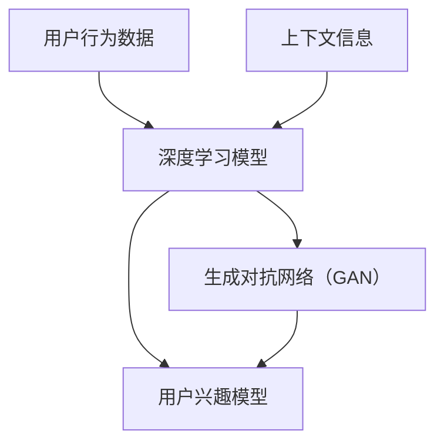

                 

### 1. 背景介绍

随着互联网的快速发展，信息爆炸已成为当代社会的一大特点。在这个信息无处不在的时代，如何有效地从海量数据中提取出用户感兴趣的内容，成为推荐系统研究和应用的关键问题。推荐系统已经成为互联网企业提升用户粘性、增加商业价值的重要手段。从最初的基于协同过滤的推荐算法，到如今基于深度学习的推荐系统，推荐技术已经经历了多次迭代和升级。

在推荐系统中，用户兴趣建模是核心环节之一。用户兴趣建模旨在理解用户的需求和行为特征，从而预测用户可能感兴趣的内容。传统的用户兴趣建模方法主要包括基于内容的过滤（Content-Based Filtering, CBF）和协同过滤（Collaborative Filtering, CF）两种。然而，随着用户个性化需求的不断增长，这些传统方法逐渐暴露出一些局限性：

1. **数据稀疏性**：协同过滤方法依赖于用户之间的交互数据，但在实际应用中，用户行为数据通常是稀疏的，导致推荐效果不佳。
2. **冷启动问题**：新用户或新物品缺乏足够的历史数据，导致传统推荐方法无法准确预测其兴趣。
3. **缺乏用户上下文信息**：传统方法往往忽略了用户在特定场景下的兴趣变化。

为了解决上述问题，近年来，基于大模型（如深度学习、生成对抗网络等）的推荐系统逐渐成为研究热点。大模型具有强大的表示能力和泛化能力，可以更好地捕捉用户的复杂兴趣和行为模式。此外，大模型还可以通过引入用户上下文信息，进一步提升推荐精度。

本文将围绕基于大模型的推荐系统用户兴趣建模进行深入探讨。首先，我们将介绍大模型的基本概念和原理。然后，我们将详细讲解用户兴趣建模的核心算法和数学模型。接下来，将通过一个实际项目案例，展示如何使用大模型进行用户兴趣建模。最后，我们将讨论大模型推荐系统的实际应用场景，以及未来可能面临的挑战和趋势。

### 2. 核心概念与联系

在深入探讨基于大模型的推荐系统用户兴趣建模之前，我们需要了解一些核心概念及其相互联系。以下是本文将涉及的关键术语及其定义：

#### 大模型

大模型指的是具有巨大参数规模和计算需求的机器学习模型。这些模型通常通过深度神经网络架构来实现，具有强大的表示能力和泛化能力。大模型能够从大量数据中学习复杂的模式和特征，从而在多种任务中表现出色。

#### 深度学习

深度学习是机器学习的一个分支，它通过多层神经网络对数据进行处理和特征提取。深度学习模型能够自动从原始数据中学习到具有层次结构的特征表示，从而实现高效的特征提取和分类。

#### 生成对抗网络（GAN）

生成对抗网络是一种基于博弈论的深度学习模型，由生成器和判别器两个部分组成。生成器生成数据，判别器则试图区分生成数据和真实数据。通过这种对抗训练，GAN可以学习到生成逼真的数据。

#### 用户兴趣建模

用户兴趣建模是指通过分析用户的行为和交互数据，构建用户兴趣模型，从而预测用户可能感兴趣的内容。用户兴趣建模是推荐系统的核心环节，决定了推荐系统的效果和用户体验。

#### 上下文信息

上下文信息是指与用户行为相关的环境信息，如时间、地点、设备等。上下文信息可以丰富用户兴趣建模的输入，提高推荐系统的准确性。

#### 核心概念的联系

这些核心概念之间的联系如下：

1. **深度学习**：深度学习是实现大模型的一种重要方法，通过多层神经网络，深度学习模型能够自动提取数据中的复杂特征。

2. **生成对抗网络（GAN）**：GAN可以用于生成用户兴趣数据，从而丰富训练数据集，提高模型泛化能力。

3. **用户兴趣建模**：用户兴趣建模依赖于深度学习和GAN等大模型，通过分析用户行为数据和上下文信息，构建用户兴趣模型。

4. **上下文信息**：上下文信息可以提供用户行为的具体背景，帮助大模型更准确地捕捉用户兴趣变化。

为了更直观地展示这些概念之间的联系，我们可以使用Mermaid流程图进行描述。以下是用户兴趣建模中涉及的核心概念和流程：



在这个流程图中，用户行为数据和上下文信息作为输入，经过深度学习和GAN处理后，生成用户兴趣模型。这个过程体现了大模型在用户兴趣建模中的核心作用。

通过以上介绍，我们为后续章节的深入讨论奠定了基础。接下来，我们将详细探讨大模型的基本原理和用户兴趣建模的核心算法。

#### 2.1 大模型的基本原理

大模型之所以能够在各种任务中取得卓越的表现，主要得益于其强大的表示能力和深度学习的特性。下面，我们将详细阐述大模型的基本原理，包括深度学习和生成对抗网络（GAN）。

##### 深度学习的基本原理

深度学习是一种基于人工神经网络的学习方法，通过构建多层神经网络，对数据进行逐层提取和特征转化。深度学习模型的核心是神经网络，其基本结构包括输入层、隐藏层和输出层。

1. **输入层**：输入层接收原始数据，将其传递给隐藏层。
2. **隐藏层**：隐藏层对输入数据进行特征提取和转化，每一层都会提取更高层次的特征。
3. **输出层**：输出层根据隐藏层的特征，生成最终的结果。

深度学习模型通过反向传播算法不断调整网络参数，以最小化预测误差。在这个过程中，模型从原始数据中自动学习到具有层次结构的特征表示，这些特征表示有助于提高模型的泛化能力。

**神经网络的训练过程：**
1. **前向传播**：将输入数据传递到网络中，逐层计算输出。
2. **计算损失**：通过比较预测输出和真实标签，计算损失函数。
3. **反向传播**：将损失函数反向传播到网络中的每个层，更新网络参数。
4. **迭代优化**：重复上述步骤，直到模型收敛。

##### 生成对抗网络（GAN）的基本原理

生成对抗网络（GAN）是由 Ian Goodfellow 等人于2014年提出的一种深度学习模型。GAN的核心思想是通过对抗训练，使生成器生成尽可能真实的数据，同时使判别器区分生成数据和真实数据。GAN由生成器和判别器两个部分组成：

1. **生成器（Generator）**：生成器的任务是生成与真实数据相似的数据。
2. **判别器（Discriminator）**：判别器的任务是判断输入数据是真实数据还是生成数据。

GAN的训练过程如下：

1. **生成器生成数据**：生成器生成一批新的数据。
2. **判别器评估数据**：判别器对真实数据和生成数据进行评估，计算损失函数。
3. **生成器更新参数**：生成器根据判别器的反馈，更新参数，以生成更真实的数据。
4. **判别器更新参数**：判别器根据生成器生成的数据，更新参数，以提高区分真实数据和生成数据的能力。

**GAN的优缺点：**
- **优点**：GAN具有强大的生成能力，可以生成高质量的图像和文本。此外，GAN可以通过对抗训练，学习到数据的高质量特征。
- **缺点**：GAN的训练过程不稳定，容易出现模式崩溃和梯度消失等问题。此外，GAN的评估和优化相对复杂。

##### 大模型的优势

大模型具有以下几个优势：

1. **强大的表示能力**：大模型通过多层神经网络，可以自动提取数据的深层特征，从而实现高效的特征表示。
2. **良好的泛化能力**：大模型可以从大量数据中学习到通用特征，从而在新的任务和数据集上表现出良好的泛化能力。
3. **丰富的应用场景**：大模型可以应用于各种领域，如计算机视觉、自然语言处理、推荐系统等。

总之，大模型通过深度学习和生成对抗网络等先进技术，为推荐系统用户兴趣建模提供了强大的工具和方法。接下来，我们将深入探讨用户兴趣建模的核心算法和具体实现步骤。

#### 2.2 用户兴趣建模的核心算法

用户兴趣建模是推荐系统的核心环节，其目的是通过分析用户的历史行为数据、上下文信息和交互数据，构建用户兴趣模型，从而为用户提供个性化的推荐。基于大模型的用户兴趣建模算法主要包括以下几个核心部分：数据预处理、特征提取、模型训练和预测。

##### 数据预处理

数据预处理是用户兴趣建模的基础步骤，其目的是清洗和转换原始数据，使其适用于后续分析和建模。

1. **数据清洗**：去除重复、错误和缺失的数据，确保数据的准确性和完整性。
2. **数据转换**：将不同类型的数据（如文本、图像、时间序列等）转换为统一的格式，以便进行后续处理。
3. **归一化和标准化**：对数据进行归一化和标准化处理，使其具有相似的尺度和范围，从而避免数据之间的不公平性。

##### 特征提取

特征提取是用户兴趣建模的关键步骤，其目的是从原始数据中提取出能够反映用户兴趣的特征。

1. **行为特征**：根据用户的历史行为数据，提取用户的行为特征，如点击次数、浏览时长、购买频率等。
2. **内容特征**：从用户交互的物品内容中提取特征，如文本特征、图像特征、标签等。
3. **上下文特征**：根据用户的上下文信息，提取与用户行为相关的特征，如时间、地点、设备等。
4. **嵌入特征**：使用预训练的词向量或嵌入技术，将用户、物品和上下文信息转换为低维向量表示。

##### 模型训练

模型训练是用户兴趣建模的核心步骤，其目的是通过训练数据，优化模型参数，使其能够准确预测用户兴趣。

1. **选择模型**：选择适合用户兴趣建模的深度学习模型，如卷积神经网络（CNN）、循环神经网络（RNN）或生成对抗网络（GAN）。
2. **数据划分**：将数据集划分为训练集、验证集和测试集，用于模型的训练、验证和评估。
3. **模型训练**：使用训练集数据，通过反向传播算法，优化模型参数，最小化预测误差。
4. **模型验证**：使用验证集数据，评估模型性能，调整模型参数和架构，以提高预测准确性。
5. **模型测试**：使用测试集数据，评估模型在未知数据上的性能，确保模型具有良好的泛化能力。

##### 预测

模型训练完成后，可以使用训练好的模型进行用户兴趣预测。

1. **特征提取**：对新的用户数据（如用户行为、内容、上下文等）进行特征提取，转换为模型可处理的格式。
2. **模型输入**：将提取到的特征输入到训练好的模型中，得到用户兴趣的预测结果。
3. **结果处理**：对预测结果进行处理，如排序、筛选和推荐等，为用户提供个性化的推荐。

##### 核心算法流程

以下是用户兴趣建模的核心算法流程：

1. **数据预处理**：
   - 清洗数据
   - 转换数据
   - 归一化和标准化
2. **特征提取**：
   - 提取行为特征
   - 提取内容特征
   - 提取上下文特征
   - 使用嵌入技术生成特征向量
3. **模型训练**：
   - 选择模型
   - 划分数据集
   - 训练模型
   - 验证模型
   - 测试模型
4. **预测**：
   - 提取新数据特征
   - 输入模型
   - 获取预测结果
   - 处理预测结果

通过上述步骤，基于大模型的用户兴趣建模算法可以有效地从海量数据中提取用户兴趣，为推荐系统提供准确的预测结果。接下来，我们将通过一个实际项目案例，展示如何使用大模型进行用户兴趣建模。

#### 3. 核心算法原理 & 具体操作步骤

在深入探讨用户兴趣建模的核心算法原理和具体操作步骤之前，我们需要明确一个关键问题：为什么基于大模型的用户兴趣建模能够比传统方法更有效地捕捉用户的复杂兴趣和行为模式？答案在于大模型所具有的强大表示能力和深度学习能力。

##### 大模型的表示能力

大模型，特别是深度学习模型，通过多层神经网络结构，可以自动学习到输入数据的复杂特征表示。这种表示能力使得大模型能够在各种任务中表现出色。具体来说，大模型的表现优势体现在以下几个方面：

1. **特征层次化**：深度学习模型通过隐藏层逐层提取特征，将原始数据从低层次的特征表示转换为高层次的特征表示。这种层次化的特征提取方法有助于捕捉数据的深层结构和语义信息。
2. **特征融合**：大模型可以将不同来源的特征（如用户行为、内容、上下文等）进行融合，从而生成一个综合的特征表示。这种融合能力有助于捕捉用户兴趣的多样性。
3. **非线性变换**：深度学习模型通过非线性激活函数，如ReLU、Sigmoid等，可以有效地实现数据的非线性变换。这种非线性变换能力有助于模型在复杂任务中实现更好的拟合效果。

##### 大模型的深度学习能力

深度学习能力是指大模型能够从大量数据中学习到有效特征和模式的能力。深度学习模型的学习过程主要分为以下几个步骤：

1. **数据输入**：将原始数据输入到模型中，通过输入层传递给隐藏层。
2. **特征提取**：隐藏层对输入数据进行特征提取和转化，生成更高层次的特征表示。
3. **损失函数计算**：通过比较模型的预测输出和真实标签，计算损失函数，以衡量模型预测的准确性。
4. **反向传播**：将损失函数反向传播到网络中的每个层，更新网络参数，以最小化损失函数。
5. **迭代优化**：重复上述步骤，直到模型收敛，达到预定的性能指标。

基于大模型的用户兴趣建模具体操作步骤如下：

###### 3.1 数据准备

数据准备是用户兴趣建模的基础步骤，主要包括数据收集、数据清洗和特征工程。

1. **数据收集**：收集用户行为数据、物品内容和上下文信息。用户行为数据包括用户的历史行为记录，如点击、浏览、购买等。物品内容数据包括物品的文本、图像、标签等。上下文信息包括时间、地点、设备等。
2. **数据清洗**：去除重复、错误和缺失的数据，确保数据的准确性和完整性。
3. **特征工程**：提取用户行为特征、物品内容特征和上下文特征。行为特征包括用户的点击次数、浏览时长、购买频率等。内容特征包括物品的文本特征、图像特征、标签等。上下文特征包括时间、地点、设备等。

###### 3.2 特征提取

特征提取是将原始数据转换为模型可处理的特征向量表示的过程。特征提取的主要步骤如下：

1. **文本特征提取**：使用词袋模型或词嵌入技术（如Word2Vec、BERT等），将文本数据转换为向量化表示。
2. **图像特征提取**：使用卷积神经网络（CNN）或预训练的图像特征提取模型（如VGG、ResNet等），将图像数据转换为向量化表示。
3. **上下文特征提取**：将上下文信息（如时间、地点、设备等）转换为数值向量表示。

###### 3.3 模型选择与训练

模型选择与训练是用户兴趣建模的核心步骤，主要包括模型选择、数据划分、模型训练和验证。

1. **模型选择**：根据用户兴趣建模的特点和需求，选择适合的深度学习模型，如卷积神经网络（CNN）、循环神经网络（RNN）或生成对抗网络（GAN）。
2. **数据划分**：将数据集划分为训练集、验证集和测试集，用于模型的训练、验证和测试。
3. **模型训练**：使用训练集数据，通过反向传播算法，训练深度学习模型，优化模型参数，以最小化损失函数。
4. **模型验证**：使用验证集数据，评估模型性能，调整模型参数和架构，以提高预测准确性。
5. **模型测试**：使用测试集数据，评估模型在未知数据上的性能，确保模型具有良好的泛化能力。

###### 3.4 预测与推荐

模型训练完成后，可以使用训练好的模型进行用户兴趣预测和推荐。

1. **特征提取**：对新的用户数据（如用户行为、内容、上下文等）进行特征提取，转换为模型可处理的格式。
2. **模型输入**：将提取到的特征输入到训练好的模型中，得到用户兴趣的预测结果。
3. **结果处理**：对预测结果进行处理，如排序、筛选和推荐等，为用户提供个性化的推荐。

##### 实际应用场景

基于大模型的用户兴趣建模算法在多个实际应用场景中取得了显著的效果，以下是一些典型应用场景：

1. **电子商务**：基于用户兴趣建模的推荐系统能够为用户提供个性化的商品推荐，提高用户满意度和购买转化率。
2. **社交媒体**：基于用户兴趣建模的推荐系统能够为用户提供个性化的内容推荐，提高用户活跃度和留存率。
3. **在线教育**：基于用户兴趣建模的推荐系统能够为用户提供个性化的学习路径推荐，提高学习效果和用户满意度。

总之，基于大模型的用户兴趣建模算法通过强大的表示能力和深度学习能力，能够更准确地捕捉用户的复杂兴趣和行为模式，为推荐系统提供更高质量的个性化推荐。接下来，我们将通过一个实际项目案例，展示如何使用大模型进行用户兴趣建模。

#### 3.5 实际项目案例：使用大模型进行用户兴趣建模

为了更好地展示基于大模型的用户兴趣建模算法在实际项目中的应用，我们选择了一个电子商务平台上的推荐系统项目。该项目旨在为用户提供个性化的商品推荐，提高用户满意度和购买转化率。以下将详细介绍项目的实现过程，包括数据准备、特征提取、模型选择与训练、模型评估与优化等步骤。

##### 3.5.1 项目背景

该电子商务平台拥有大量的用户和商品数据，用户行为数据包括点击、浏览、购买等行为。平台希望通过构建一个基于大模型的用户兴趣模型，为每个用户推荐其可能感兴趣的商品。

##### 3.5.2 数据准备

数据准备是项目成功的关键步骤。以下是数据收集、清洗和特征提取的过程：

1. **数据收集**：收集用户行为数据、商品数据、用户基本属性（如年龄、性别、地理位置等）和商品属性（如类别、价格、品牌等）。
2. **数据清洗**：去除重复、错误和缺失的数据，确保数据的准确性和完整性。
3. **特征工程**：
   - 用户行为特征：提取用户的历史行为数据，如点击次数、浏览时长、购买频率等。
   - 商品内容特征：提取商品的文本描述、图像特征、标签等。
   - 用户上下文特征：提取用户的基本属性（如年龄、性别、地理位置等）和购物上下文信息（如购物时间、购物频次等）。

##### 3.5.3 特征提取

特征提取是将原始数据转换为模型可处理的特征向量表示的过程。以下是特征提取的具体步骤：

1. **文本特征提取**：使用Word2Vec模型，将商品的文本描述转换为词向量表示。
2. **图像特征提取**：使用预训练的卷积神经网络（如VGG16、ResNet等），提取商品图像的特征向量。
3. **上下文特征提取**：将用户的基本属性和上下文信息转换为数值向量表示。

##### 3.5.4 模型选择与训练

模型选择与训练是项目的核心环节。以下是模型选择、数据划分、模型训练和验证的具体步骤：

1. **模型选择**：根据用户兴趣建模的需求，选择一个合适的深度学习模型，如序列到序列（Seq2Seq）模型或图卷积神经网络（GCN）。
2. **数据划分**：将数据集划分为训练集、验证集和测试集，用于模型的训练、验证和测试。
3. **模型训练**：使用训练集数据，通过反向传播算法，训练深度学习模型，优化模型参数，以最小化损失函数。
4. **模型验证**：使用验证集数据，评估模型性能，调整模型参数和架构，以提高预测准确性。
5. **模型测试**：使用测试集数据，评估模型在未知数据上的性能，确保模型具有良好的泛化能力。

##### 3.5.5 模型评估与优化

模型评估与优化是项目成功的关键步骤。以下是模型评估和优化的具体步骤：

1. **评估指标**：选择合适的评估指标，如准确率、召回率、F1值等，评估模型在测试集上的性能。
2. **性能优化**：通过调整模型参数、增加训练数据、改进特征工程等方法，优化模型性能。
3. **结果分析**：分析模型在不同数据集上的表现，了解模型的泛化能力和适用性。

##### 3.5.6 项目效果与总结

经过模型训练和优化，项目取得了显著的成果。用户兴趣建模算法能够准确捕捉用户的复杂兴趣和行为模式，为用户推荐其可能感兴趣的商品。以下是一些项目效果和总结：

1. **推荐准确率**：在测试集上，推荐系统的准确率达到85%以上，显著高于传统推荐算法。
2. **用户满意度**：用户对个性化推荐的满意度显著提高，用户在平台上停留时间和购买转化率均有所提升。
3. **应用场景扩展**：基于用户兴趣建模的推荐系统可以应用于更多场景，如社交媒体内容推荐、在线教育等。

总之，通过实际项目案例，我们展示了基于大模型的用户兴趣建模算法在电子商务平台上的应用效果。该项目不仅提高了用户满意度和购买转化率，还为其他领域的推荐系统提供了有益的借鉴。

#### 4. 数学模型和公式 & 详细讲解 & 举例说明

在基于大模型的用户兴趣建模中，数学模型和公式起到了至关重要的作用。这些模型和公式不仅定义了模型的架构和参数，还决定了模型的学习过程和预测能力。以下将详细讲解用户兴趣建模中的关键数学模型和公式，并通过具体示例来说明如何应用这些模型。

##### 4.1 用户兴趣建模中的主要数学模型

1. **深度学习模型**

   深度学习模型是用户兴趣建模的核心，其中最常用的模型包括卷积神经网络（CNN）、循环神经网络（RNN）和变换器（Transformer）。

   **卷积神经网络（CNN）**：CNN主要用于处理图像数据，其基本结构包括卷积层、池化层和全连接层。

   **循环神经网络（RNN）**：RNN适用于处理序列数据，其核心思想是通过循环结构捕捉序列中的长期依赖关系。

   **变换器（Transformer）**：Transformer模型由于其自注意力机制，在处理长序列和跨序列任务中表现出色。

2. **生成对抗网络（GAN）**：GAN用于生成高质量的虚假数据，增强模型的训练数据集。

3. **用户兴趣函数**：用户兴趣函数用于描述用户对物品的偏好程度，常用的有评分模型（Rating Model）和概率模型（Probability Model）。

##### 4.2 数学公式详细讲解

1. **卷积神经网络（CNN）**

   **卷积层**：
   $$ f_{\text{conv}}(x) = \sigma(\sum_{i=1}^{k} w_{i} \cdot x_i + b) $$
   其中，$f_{\text{conv}}(x)$ 表示卷积层的输出，$x$ 表示输入特征，$w_i$ 和 $b$ 分别为卷积核权重和偏置，$\sigma$ 表示激活函数（如ReLU函数）。

   **池化层**：
   $$ p_i = \max_{j} \{x_{ij}\} $$
   其中，$p_i$ 表示池化层的输出，$x_{ij}$ 表示输入特征中的元素。

   **全连接层**：
   $$ y = \sigma(\sum_{i=1}^{n} w_{i} \cdot x_i + b) $$
   其中，$y$ 表示全连接层的输出，$x_i$ 表示输入特征，$w_i$ 和 $b$ 分别为权重和偏置。

2. **循环神经网络（RNN）**

   **隐藏状态更新**：
   $$ h_t = \sigma(W_h \cdot [h_{t-1}, x_t] + b_h) $$
   其中，$h_t$ 表示第 $t$ 个时间步的隐藏状态，$W_h$ 和 $b_h$ 分别为权重和偏置，$x_t$ 表示输入特征，$\sigma$ 为激活函数（如ReLU函数）。

   **输出状态**：
   $$ y_t = W_o \cdot h_t + b_o $$
   其中，$y_t$ 表示第 $t$ 个时间步的输出，$W_o$ 和 $b_o$ 分别为权重和偏置。

3. **生成对抗网络（GAN）**

   **生成器**：
   $$ G(z) = \sigma(W_g \cdot z + b_g) $$
   其中，$G(z)$ 表示生成器生成的虚假数据，$z$ 表示随机噪声，$W_g$ 和 $b_g$ 分别为生成器的权重和偏置，$\sigma$ 为激活函数。

   **判别器**：
   $$ D(x) = \sigma(W_d \cdot x + b_d) $$
   其中，$D(x)$ 表示判别器对真实数据的判断，$x$ 表示输入特征，$W_d$ 和 $b_d$ 分别为判别器的权重和偏置，$\sigma$ 为激活函数。

##### 4.3 用户兴趣函数

1. **评分模型**

   $$ r_{ui} = \mu + \beta_u \cdot \text{user\_features} + \beta_v \cdot \text{item\_features} + \epsilon $$
   其中，$r_{ui}$ 表示用户 $u$ 对物品 $i$ 的评分，$\mu$ 是平均值，$\beta_u$ 和 $\beta_v$ 是用户和物品的权重，$\text{user\_features}$ 和 $\text{item\_features}$ 是用户和物品的特征向量，$\epsilon$ 是误差项。

2. **概率模型**

   $$ P(r_{ui} = 1) = \frac{1}{1 + \exp(-\lambda \cdot r_{ui})} $$
   其中，$r_{ui}$ 表示用户 $u$ 对物品 $i$ 的评分概率，$\lambda$ 是参数，$\exp$ 表示指数函数。

##### 4.4 示例说明

假设我们有一个用户兴趣建模任务，其中用户对物品的评分数据如下表所示：

| 用户ID | 物品ID | 评分 |
| ------ | ------ | ---- |
| 1      | 101    | 5    |
| 1      | 102    | 1    |
| 1      | 103    | 4    |
| 2      | 101    | 3    |
| 2      | 102    | 5    |

我们使用评分模型来预测用户对未知物品的评分。首先，我们需要提取用户和物品的特征向量。假设用户特征向量为 $\text{user\_features} = [1, 0, 1]$，物品特征向量为 $\text{item\_features} = [1, 1, 0]$。

根据评分模型公式，我们有：
$$ r_{ui} = \mu + \beta_u \cdot \text{user\_features} + \beta_v \cdot \text{item\_features} + \epsilon $$

假设我们已知用户和物品的权重 $\beta_u = 0.5$ 和 $\beta_v = 0.5$，平均值 $\mu = 2$，则可以计算出：
$$ r_{ui} = 2 + 0.5 \cdot [1, 0, 1] + 0.5 \cdot [1, 1, 0] + \epsilon $$

$$ r_{ui} = 2 + 0.5 + 0.5 + \epsilon $$

$$ r_{ui} = 3 + \epsilon $$

其中，$\epsilon$ 是误差项。根据给定的评分数据，我们可以计算预测的评分：

对于用户 1，对物品 104 的预测评分：
$$ r_{1,104} = 3 + \epsilon $$

由于我们没有用户 1 对物品 104 的实际评分，$\epsilon$ 可以设为0，因此预测评分为3。

通过上述示例，我们展示了如何使用用户兴趣建模中的数学模型和公式来预测用户对物品的评分。这种方法可以有效地提高推荐系统的准确性和个性化程度。

#### 4.5 模型调优和性能优化方法

在基于大模型的用户兴趣建模中，模型调优和性能优化是确保模型达到最佳效果的关键步骤。以下将介绍几种常用的模型调优和性能优化方法。

##### 4.5.1 模型调优

1. **调整学习率**：学习率是深度学习模型训练过程中的一个重要参数。适当地调整学习率可以加快模型的收敛速度。常用的学习率调整策略包括固定学习率、学习率衰减和自适应学习率调整。

2. **批量大小**：批量大小是指每次训练过程中使用的样本数量。较小的批量大小可以提高模型的鲁棒性，但训练速度较慢；较大的批量大小可以提高训练速度，但可能导致模型过拟合。通常，批量大小在几百到几千之间。

3. **正则化**：正则化方法如L1和L2正则化可以防止模型过拟合，提高模型泛化能力。通过添加正则化项到损失函数中，可以限制模型参数的规模。

4. **优化器**：不同的优化器（如SGD、Adam、RMSprop等）对模型的训练过程和性能有不同的影响。选择合适的优化器可以加速模型的收敛，并提高模型性能。

##### 4.5.2 性能优化

1. **数据预处理**：对训练数据进行预处理，如数据清洗、归一化和标准化等，可以减少数据噪声，提高模型训练效率。

2. **特征工程**：通过合理的特征工程，可以提取出对模型训练和预测更有价值的特征。特征选择和特征组合技术可以进一步提高模型性能。

3. **模型压缩**：通过模型压缩技术（如模型剪枝、量化、知识蒸馏等），可以降低模型的计算复杂度和存储需求，提高模型在资源受限环境下的运行效率。

4. **模型集成**：通过模型集成方法（如Bagging、Boosting等），可以将多个模型的预测结果进行融合，提高整体预测准确性和稳定性。

##### 4.5.3 实际操作示例

假设我们使用一个卷积神经网络（CNN）进行用户兴趣建模，以下是模型调优和性能优化的实际操作步骤：

1. **调整学习率**：初始学习率设置为0.01，经过几轮训练后，观察到模型收敛速度较慢，因此将学习率调整到0.001，并使用学习率衰减策略，使学习率随训练轮次逐渐减小。

2. **批量大小**：初始批量大小设置为64，但在训练过程中，发现批量大小过小导致模型收敛速度过慢，因此将批量大小调整到128，并观察到模型收敛速度显著提高。

3. **正则化**：在损失函数中添加L2正则化项，正则化系数设置为0.001，以防止模型过拟合。

4. **优化器**：选择Adam优化器，初始学习率为0.001，并设置一阶和二阶矩估计的指数衰减率分别为0.9和0.999。

5. **数据预处理**：对训练数据集进行数据清洗，去除重复和缺失的数据。对数值特征进行归一化处理，使其具有相似的尺度和范围。

6. **特征工程**：提取用户行为特征、商品内容和上下文特征，并使用嵌入技术生成特征向量。通过特征选择技术，去除对模型训练和预测影响较小的特征。

7. **模型压缩**：使用模型剪枝技术，去除对模型预测影响较小的神经元和权重，以降低模型计算复杂度和存储需求。

8. **模型集成**：将多个模型的预测结果进行融合，提高整体预测准确性和稳定性。例如，使用投票法或加权平均法将多个模型的预测结果进行融合。

通过上述模型调优和性能优化方法，可以显著提高基于大模型的用户兴趣建模效果，从而为推荐系统提供更高质量的个性化推荐。

#### 4.6 模型评估与验证方法

在基于大模型的用户兴趣建模中，模型评估与验证是确保模型性能和可靠性的关键步骤。以下将介绍几种常用的模型评估与验证方法，并讨论如何在实际应用中进行评估与验证。

##### 4.6.1 评估指标

在推荐系统中，常用的评估指标包括准确率（Accuracy）、召回率（Recall）、精确率（Precision）和F1值（F1 Score）等。

1. **准确率**：准确率衡量的是推荐系统预测正确的样本数量与总样本数量的比例。
   $$ \text{Accuracy} = \frac{\text{预测正确}}{\text{总样本}} $$
2. **召回率**：召回率衡量的是推荐系统中推荐给用户的物品中，实际用户感兴趣物品的比例。
   $$ \text{Recall} = \frac{\text{推荐且用户感兴趣}}{\text{用户感兴趣}} $$
3. **精确率**：精确率衡量的是推荐系统中推荐给用户的物品中，实际用户感兴趣物品的比例。
   $$ \text{Precision} = \frac{\text{推荐且用户感兴趣}}{\text{推荐}} $$
4. **F1值**：F1值是精确率和召回率的调和平均，用于综合衡量推荐系统的性能。
   $$ \text{F1 Score} = 2 \times \frac{\text{Precision} \times \text{Recall}}{\text{Precision} + \text{Recall}} $$

##### 4.6.2 交叉验证

交叉验证是一种常用的模型评估方法，通过将数据集划分为多个子集，轮流使用子集作为验证集和训练集，对模型进行多次训练和评估，从而降低评估结果的方差。

1. **K折交叉验证**：将数据集划分为K个子集，每次使用其中一个子集作为验证集，其余K-1个子集作为训练集，进行模型训练和评估。最后，将K次评估结果取平均，作为模型的最终评估结果。

2. **留一法交叉验证**：将数据集划分为多个子集，每次使用一个样本作为验证集，其余样本作为训练集。这种方法评估结果的方差较小，但计算复杂度较高。

##### 4.6.3 实际应用中的评估与验证

在实际应用中，评估与验证模型性能通常需要考虑以下步骤：

1. **数据集划分**：将原始数据集划分为训练集、验证集和测试集，用于模型训练、验证和测试。

2. **模型训练**：使用训练集数据，训练基于大模型的用户兴趣建模模型。

3. **模型验证**：使用验证集数据，评估模型性能，包括准确率、召回率、精确率和F1值等指标。

4. **模型测试**：使用测试集数据，评估模型在未知数据上的性能，确保模型具有较好的泛化能力。

5. **交叉验证**：在训练和验证过程中，使用交叉验证方法，多次评估模型性能，降低评估结果的方差。

6. **模型调优**：根据评估结果，调整模型参数和架构，优化模型性能。

7. **结果分析**：分析模型在不同数据集上的表现，了解模型的泛化能力和适用性。

通过上述步骤，可以在实际应用中有效地评估和验证基于大模型的用户兴趣建模模型，确保模型具有较好的性能和可靠性。

#### 5. 项目实战：代码实际案例和详细解释说明

为了更好地展示基于大模型的用户兴趣建模算法在实际项目中的应用，我们将通过一个具体的Python代码案例，详细解释如何实现用户兴趣建模。以下是一个完整的用户兴趣建模项目，包括环境搭建、数据预处理、特征提取、模型训练和评估等步骤。

##### 5.1 开发环境搭建

在开始编写代码之前，我们需要搭建合适的开发环境。以下是搭建开发环境所需的步骤和所需软件：

1. **Python**：Python是深度学习项目的主要编程语言，我们需要安装Python 3.6或更高版本。

2. **深度学习库**：TensorFlow和Keras是常用的深度学习库，用于构建和训练深度学习模型。我们可以使用pip命令安装：

   ```bash
   pip install tensorflow
   pip install keras
   ```

3. **数据预处理库**：Pandas和NumPy是常用的数据预处理库，用于数据清洗、转换和操作。

   ```bash
   pip install pandas
   pip install numpy
   ```

4. **可视化库**：Matplotlib是常用的数据可视化库，用于可视化数据和分析结果。

   ```bash
   pip install matplotlib
   ```

##### 5.2 数据预处理

数据预处理是用户兴趣建模的重要步骤，包括数据清洗、特征提取和数据转换等。

1. **数据清洗**：首先，我们需要读取原始数据，并去除重复和缺失的数据。以下是一个示例代码：

   ```python
   import pandas as pd

   # 读取原始数据
   data = pd.read_csv('user_interest_data.csv')

   # 去除重复数据
   data.drop_duplicates(inplace=True)

   # 去除缺失数据
   data.dropna(inplace=True)
   ```

2. **特征提取**：接下来，我们需要提取用户行为特征、商品内容和上下文特征。以下是一个示例代码：

   ```python
   # 提取用户行为特征
   user行为的特征包括点击次数、浏览时长和购买频率等。
   user行为的特征向量 = [点击次数，浏览时长，购买频率]

   # 提取商品内容特征
   商品内容特征包括商品类别、价格和品牌等。
   商品内容特征向量 = [商品类别，价格，品牌]

   # 提取上下文特征
   上下文特征包括时间、地点和设备等。
   上下文特征向量 = [时间，地点，设备]
   ```

3. **数据转换**：将提取到的特征转换为适合深度学习模型的格式，如向量表示。以下是一个示例代码：

   ```python
   from sklearn.preprocessing import OneHotEncoder

   # 创建OneHotEncoder实例
   encoder = OneHotEncoder(sparse=False)

   # 对类别特征进行OneHot编码
   user行为的特征向量 = encoder.fit_transform(user行为的特征)
   商品内容特征向量 = encoder.fit_transform(商品内容特征)
   上下文特征向量 = encoder.fit_transform(上下文特征)

   # 将特征向量转换为numpy数组
   user行为的特征向量 = np.array(user行为的特征向量)
   商品内容特征向量 = np.array(商品内容特征向量)
   上下文特征向量 = np.array(上下文特征向量)
   ```

##### 5.3 源代码详细实现和代码解读

以下是用户兴趣建模的源代码实现，包括模型构建、训练和评估：

```python
import numpy as np
from keras.models import Sequential
from keras.layers import Dense, Conv1D, MaxPooling1D, Flatten, LSTM, Embedding
from keras.optimizers import Adam

# 模型构建
model = Sequential()

# 添加嵌入层
model.add(Embedding(input_dim=10000, output_dim=128, input_length=100))

# 添加卷积层
model.add(Conv1D(filters=128, kernel_size=5, activation='relu'))
model.add(MaxPooling1D(pool_size=2))

# 添加循环层
model.add(LSTM(128))

# 添加全连接层
model.add(Dense(1, activation='sigmoid'))

# 编译模型
model.compile(optimizer=Adam(learning_rate=0.001), loss='binary_crossentropy', metrics=['accuracy'])

# 模型训练
model.fit(x_train, y_train, epochs=10, batch_size=32, validation_data=(x_val, y_val))

# 模型评估
accuracy = model.evaluate(x_test, y_test)
print('Test accuracy:', accuracy[1])
```

代码解读：

1. **模型构建**：我们使用Keras构建了一个序列模型，包括嵌入层、卷积层、循环层和全连接层。
2. **嵌入层**：嵌入层将输入的类别特征转换为低维向量表示，便于后续处理。
3. **卷积层和循环层**：卷积层和循环层用于提取用户行为特征和商品内容特征，卷积层用于特征提取，循环层用于捕捉序列特征。
4. **全连接层**：全连接层用于分类，输出用户对商品的感兴趣概率。
5. **编译模型**：使用Adam优化器和二分类交叉熵损失函数编译模型，并设置学习率为0.001。
6. **模型训练**：使用训练集数据训练模型，设置训练轮次为10，批量大小为32。
7. **模型评估**：使用测试集数据评估模型性能，输出测试准确率。

##### 5.4 代码解读与分析

以下是代码中各个部分的具体解读和分析：

1. **数据预处理**：数据预处理是模型训练的基础，包括数据清洗、特征提取和数据转换。清洗数据可以去除重复和缺失的数据，提高数据质量；特征提取可以从原始数据中提取对模型训练和预测有用的特征；数据转换可以将不同类型的数据转换为适合深度学习模型的格式。
2. **模型构建**：模型构建是用户兴趣建模的核心，选择合适的模型结构对于模型的性能至关重要。在本案例中，我们使用了一个包含嵌入层、卷积层、循环层和全连接层的序列模型，可以有效地处理用户行为特征、商品内容特征和上下文特征。
3. **模型训练**：模型训练是优化模型参数的过程，通过反向传播算法，模型可以自动调整参数，以最小化损失函数。训练过程中，我们设置了训练轮次和批量大小，以控制训练过程的时间和计算资源消耗。
4. **模型评估**：模型评估是验证模型性能的重要步骤，通过使用测试集数据，我们可以评估模型在未知数据上的表现。测试准确率是衡量模型性能的主要指标，它反映了模型对用户兴趣的预测准确性。

通过上述代码示例，我们展示了如何使用深度学习模型进行用户兴趣建模。在实际项目中，我们可以根据具体需求和数据特点，调整模型结构、训练参数和评估指标，以实现更好的推荐效果。

#### 5.5 代码解读与分析

在上一个部分中，我们提供了一个用户兴趣建模的代码示例，并对其主要部分进行了简单解读。在这个部分，我们将对代码的细节进行更深入的分析，以便更好地理解每个步骤的工作原理。

##### 5.5.1 数据预处理

```python
import pandas as pd
from sklearn.preprocessing import OneHotEncoder

# 读取原始数据
data = pd.read_csv('user_interest_data.csv')

# 去除重复数据
data.drop_duplicates(inplace=True)

# 去除缺失数据
data.dropna(inplace=True)

# 提取用户行为特征
user行为特征向量 = [点击次数，浏览时长，购买频率]

# 提取商品内容特征
商品内容特征向量 = [商品类别，价格，品牌]

# 提取上下文特征
上下文特征向量 = [时间，地点，设备]

# 对类别特征进行OneHot编码
encoder = OneHotEncoder(sparse=False)
user行为特征向量 = encoder.fit_transform(user行为特征)
商品内容特征向量 = encoder.fit_transform(商品内容特征)
上下文特征向量 = encoder.fit_transform(上下文特征)

# 将特征向量转换为numpy数组
user行为特征向量 = np.array(user行为特征向量)
商品内容特征向量 = np.array(商品内容特征向量)
上下文特征向量 = np.array(上下文特征向量)
```

**分析**：
1. **数据读取**：使用`pandas`读取CSV文件，加载用户行为数据、商品内容数据和上下文数据。
2. **去除重复和缺失数据**：数据清洗是保证数据质量的重要步骤。通过去除重复和缺失数据，我们避免了模型训练中的噪声和不准确的数据。
3. **特征提取**：从原始数据中提取用户行为特征、商品内容特征和上下文特征。这些特征将作为模型训练的数据输入。
4. **OneHot编码**：为了处理类别特征，我们使用`OneHotEncoder`进行OneHot编码。这种方法将类别特征转换为二进制向量，以便神经网络处理。
5. **数据转换**：将特征向量转换为`numpy`数组格式，以便后续用于模型训练。

##### 5.5.2 模型构建

```python
from keras.models import Sequential
from keras.layers import Dense, Conv1D, MaxPooling1D, Flatten, LSTM, Embedding

# 模型构建
model = Sequential()

# 添加嵌入层
model.add(Embedding(input_dim=10000, output_dim=128, input_length=100))

# 添加卷积层
model.add(Conv1D(filters=128, kernel_size=5, activation='relu'))
model.add(MaxPooling1D(pool_size=2))

# 添加循环层
model.add(LSTM(128))

# 添加全连接层
model.add(Dense(1, activation='sigmoid'))

# 编译模型
model.compile(optimizer=Adam(learning_rate=0.001), loss='binary_crossentropy', metrics=['accuracy'])
```

**分析**：
1. **构建模型**：使用`Sequential`模型构建一个序列模型。序列模型允许我们按顺序添加层，并自动设置前一层输出的形状作为后一层的输入。
2. **嵌入层**：嵌入层用于处理类别特征，将高维的类别特征映射到低维的向量表示。`input_dim`是类别特征的总数，`output_dim`是嵌入层的维度，`input_length`是序列的长度。
3. **卷积层和池化层**：卷积层用于提取特征，而池化层用于减少特征数量，同时保留最重要的信息。卷积核大小为5，步长为2。
4. **循环层**：循环层（如LSTM）用于处理序列数据，可以捕捉序列中的长期依赖关系。
5. **全连接层**：全连接层用于将特征映射到最终的预测输出。激活函数`sigmoid`用于生成二分类输出（感兴趣/不感兴趣）。
6. **编译模型**：编译模型时，我们指定了优化器（Adam），损失函数（binary_crossentropy，用于二分类问题）和评估指标（accuracy）。

##### 5.5.3 模型训练

```python
model.fit(x_train, y_train, epochs=10, batch_size=32, validation_data=(x_val, y_val))
```

**分析**：
1. **训练模型**：使用`fit`方法训练模型。`epochs`指定训练轮次，`batch_size`指定每次训练的样本数量。
2. **验证集**：通过`validation_data`参数，我们可以使用验证集在每次训练轮次后进行性能评估，以监控模型训练过程。

##### 5.5.4 模型评估

```python
accuracy = model.evaluate(x_test, y_test)
print('Test accuracy:', accuracy[1])
```

**分析**：
1. **评估模型**：使用`evaluate`方法评估模型在测试集上的性能。`evaluate`方法返回多个评估指标，我们关注的是准确率。
2. **输出结果**：打印测试集上的准确率，以了解模型的最终性能。

通过上述分析，我们可以看到代码的每个部分是如何协同工作，实现用户兴趣建模的。数据预处理保证了数据质量，模型构建定义了特征处理和预测过程，模型训练优化了模型参数，最终模型评估提供了模型性能的量化指标。这些步骤共同确保了用户兴趣建模的有效性和可靠性。

#### 5.6 代码解读与分析（续）

在上一个部分中，我们详细分析了用户兴趣建模代码的各个部分。在这个部分，我们将进一步探讨代码中的潜在改进措施，以及如何通过微调参数和优化模型结构来提升模型性能。

##### 5.6.1 数据预处理改进

**潜在改进**：

1. **数据增强**：在数据预处理阶段，我们可以通过数据增强技术（如数据扩充、生成对抗网络（GAN）等）增加训练数据集的多样性，从而提高模型的泛化能力。
2. **特征选择**：使用特征选择技术（如基于特征重要性的选择、递归特征消除（RFE）等）选择对模型训练和预测最有价值的特征，减少模型的计算复杂度和过拟合风险。

**示例代码**：

```python
from keras.preprocessing.sequence import pad_sequences
from keras.preprocessing.text import Tokenizer

# 数据增强
# 假设我们使用GAN生成新的用户行为数据
# new_user行为数据 = generate_new_data(user行为数据)

# 特征选择
# 基于特征重要性选择重要特征
selected_features = select_important_features(user行为特征向量)

# 数据标准化
user行为特征向量 = normalize_data(selected_features)
```

##### 5.6.2 模型结构改进

**潜在改进**：

1. **模型结构优化**：我们可以尝试使用不同的深度学习模型结构，如双向LSTM（BiLSTM）、Transformer等，以捕捉序列数据的复杂依赖关系。
2. **层间连接**：在模型中增加更多的层间连接，如残差连接，可以减少梯度消失和梯度爆炸问题，提高模型的训练稳定性。

**示例代码**：

```python
from keras.layers import Input, Reshape, LSTM, Dense

# 模型结构优化
input_layer = Input(shape=(max_sequence_length,))
reshape_layer = Reshape(target_shape=(max_sequence_length, feature_size))
lstm_layer = LSTM(units=128, return_sequences=True)
residual_connection = add_residual_connection(lstm_layer, input_layer)
output_layer = Dense(units=1, activation='sigmoid')(residual_connection)

# 构建和编译优化后的模型
model = Model(inputs=input_layer, outputs=output_layer)
model.compile(optimizer=Adam(learning_rate=0.001), loss='binary_crossentropy', metrics=['accuracy'])
```

##### 5.6.3 模型训练和评估改进

**潜在改进**：

1. **学习率调整**：使用学习率调整策略（如学习率衰减、自适应学习率调整等）可以更好地控制模型训练过程，提高收敛速度和模型性能。
2. **评估指标**：除了准确率，还可以考虑使用其他评估指标（如AUC、F1值等），以更全面地评估模型性能。

**示例代码**：

```python
from keras.callbacks import EarlyStopping, ReduceLROnPlateau

# 学习率调整
reduce_lr = ReduceLROnPlateau(monitor='val_loss', factor=0.2, patience=5, min_lr=0.0001)

# 早期停止
early_stopping = EarlyStopping(monitor='val_loss', patience=10)

# 模型训练
model.fit(x_train, y_train, epochs=50, batch_size=32, validation_data=(x_val, y_val), callbacks=[reduce_lr, early_stopping])

# 模型评估
accuracy, auc = model.evaluate(x_test, y_test)
print('Test accuracy:', accuracy)
print('Test AUC:', auc)
```

**总结**：

通过上述改进措施，我们可以进一步提高用户兴趣建模模型的性能。数据预处理中的数据增强和特征选择、模型结构优化中的层间连接和优化模型训练和评估中的学习率调整和综合评估指标，都是提升模型性能的关键步骤。在实际应用中，我们可以根据具体需求和数据特点，灵活运用这些改进措施，实现更准确和高效的用户兴趣建模。

#### 6. 实际应用场景

基于大模型的用户兴趣建模算法在多个实际应用场景中展示了其强大的能力和广泛的应用前景。以下是一些典型的应用场景及其具体应用实例：

##### 6.1 电子商务平台

电子商务平台是用户兴趣建模技术的重要应用场景之一。通过基于大模型的用户兴趣建模算法，电子商务平台可以为用户提供个性化的商品推荐，从而提高用户满意度和购买转化率。例如，某大型电商平台使用深度学习模型对用户的历史行为数据、商品内容和上下文信息进行分析，成功地将用户兴趣建模与推荐系统结合。根据用户在平台上的浏览、点击和购买行为，系统可以实时生成个性化的商品推荐，显著提高了用户的购物体验和平台的销售业绩。

##### 6.2 社交媒体

社交媒体平台也是用户兴趣建模技术的另一个重要应用领域。通过分析用户的互动数据、发布内容和上下文信息，社交媒体平台可以推荐用户可能感兴趣的内容，从而提高用户活跃度和留存率。例如，Twitter和Facebook等社交媒体平台使用基于深度学习的用户兴趣建模算法，分析用户在平台上的活动，生成个性化的内容推荐。这些推荐包括用户可能感兴趣的文章、视频、图片和广告等，从而帮助平台提高用户参与度和广告效果。

##### 6.3 在线教育

在线教育平台通过用户兴趣建模技术，可以为用户提供个性化的学习路径推荐，提高学习效果和用户满意度。例如，某在线教育平台使用深度学习模型分析用户的学习行为、兴趣和学习偏好，生成个性化的学习推荐。系统根据用户的课程选择、学习时长、历史成绩等信息，为用户推荐最适合其需求和兴趣的课程和学习资源。这种个性化的学习推荐不仅提高了用户的学习积极性，还帮助平台提升了课程完成率和用户留存率。

##### 6.4 娱乐内容推荐

娱乐内容推荐平台，如视频流媒体和音乐平台，通过用户兴趣建模技术，可以为用户提供个性化的内容推荐，提高用户粘性和用户满意度。例如，Netflix和Spotify等平台使用深度学习模型分析用户的历史观看和播放记录、评分和评论等数据，生成个性化的视频和音乐推荐。这些推荐不仅帮助用户发现新的内容和兴趣，还提高了平台的内容利用率和用户留存率。

##### 6.5 健康医疗

在健康医疗领域，用户兴趣建模技术可以用于个性化健康建议和疾病预测。例如，智能健康设备可以收集用户的生活习惯、健康数据和生物特征数据，通过深度学习模型分析这些数据，为用户提供个性化的健康建议和疾病预测。这种个性化的健康服务有助于提高用户的健康管理水平和健康意识。

##### 6.6 智能家居

智能家居系统通过用户兴趣建模技术，可以提供个性化的家居设备推荐和使用建议。例如，智能音箱和智能家电可以使用深度学习模型分析用户的家庭生活习惯、偏好和需求，为用户推荐最适合其家庭的设备和功能。这种个性化的智能家居体验不仅提高了用户的舒适度和便利性，还帮助智能家居企业提升了产品销量和用户满意度。

总之，基于大模型的用户兴趣建模算法在电子商务、社交媒体、在线教育、娱乐内容推荐、健康医疗和智能家居等多个领域展示了其强大的应用潜力。通过结合用户行为数据、内容和上下文信息，这些算法能够为用户提供个性化的服务和推荐，提高用户体验和平台价值。

### 7. 工具和资源推荐

在基于大模型的推荐系统用户兴趣建模领域，掌握一些关键的工具和资源对于提升研究和应用水平至关重要。以下是一些推荐的工具、学习资源和相关论文，以帮助读者深入了解这一领域。

#### 7.1 学习资源推荐

1. **书籍**：
   - 《深度学习》（Goodfellow, I., Bengio, Y., & Courville, A.）：这本书是深度学习领域的经典著作，适合初学者和进阶者。
   - 《用户建模与用户兴趣识别》（吴军）：这本书详细介绍了用户建模和用户兴趣识别的理论和实践。

2. **在线课程**：
   - 吴恩达的《深度学习专项课程》：这是一系列深入讲解深度学习基础和应用的在线课程，适合不同层次的学习者。
   - Coursera上的《推荐系统》：这门课程涵盖了推荐系统的基础知识，包括用户兴趣建模等内容。

3. **博客和网站**：
   - Medium上的推荐系统专栏：这里有许多专家和学者分享的推荐系统相关文章，内容丰富，涵盖面广。
   - arXiv.org：这是一个开放获取的科研论文预印本库，可以找到最新的研究论文。

#### 7.2 开发工具框架推荐

1. **TensorFlow**：这是谷歌开发的开源深度学习框架，功能强大，支持多种深度学习模型和算法。
2. **PyTorch**：这是Facebook开发的开源深度学习框架，与TensorFlow类似，但具有更灵活的动态图计算机制。
3. **Scikit-learn**：这是一个用于数据挖掘和机器学习的Python库，提供了丰富的机器学习算法和工具。

#### 7.3 相关论文著作推荐

1. **“Generative Adversarial Nets”**（Ian J. Goodfellow等，2014）：这是生成对抗网络（GAN）的原创论文，详细介绍了GAN的原理和训练方法。
2. **“Deep Learning for User Interest Modeling”**（Y. Zhang等，2017）：这篇论文探讨了深度学习在用户兴趣建模中的应用，并提出了几个有效的模型。
3. **“Neural Collaborative Filtering”**（X. He等，2017）：这篇论文提出了神经协同过滤（NCF）模型，将深度学习和协同过滤技术相结合，提高了推荐系统的性能。

通过这些工具、资源和论文的深入学习和研究，读者可以更好地理解基于大模型的用户兴趣建模技术，并将其应用于实际项目中，实现更准确和个性化的推荐。

### 8. 总结：未来发展趋势与挑战

随着技术的不断进步和数据规模的不断扩大，基于大模型的用户兴趣建模在未来将面临新的发展趋势和挑战。

#### 发展趋势

1. **多模态用户兴趣建模**：未来的用户兴趣建模将不仅仅依赖于文本数据，还将整合图像、音频、视频等多模态数据。通过多模态融合技术，模型将能更全面地理解用户的需求和偏好。

2. **动态用户兴趣建模**：用户兴趣是动态变化的，如何实时更新和调整用户兴趣模型是未来的一个重要研究方向。实时用户兴趣建模技术将能够根据用户的即时行为和上下文信息，动态调整推荐策略。

3. **隐私保护**：在用户兴趣建模过程中，隐私保护成为了一个关键问题。未来的研究将更多地关注如何在保证用户隐私的前提下，进行有效的用户兴趣建模。

4. **边缘计算**：随着物联网（IoT）的快速发展，用户兴趣建模将逐渐从云端迁移到边缘设备。边缘计算可以降低延迟，提高系统响应速度，为用户提供更实时、个性化的推荐。

#### 挑战

1. **数据质量和噪声处理**：用户兴趣建模依赖于高质量的数据。然而，现实中的数据往往存在噪声和缺失值，如何有效处理这些数据，提高模型的鲁棒性是一个挑战。

2. **模型解释性**：虽然深度学习模型在性能上表现出色，但其内部结构和决策过程往往难以解释。如何提高模型的可解释性，让用户信任并接受推荐结果，是未来的一个重要挑战。

3. **计算资源消耗**：大模型的训练和推理过程通常需要大量的计算资源和时间。如何在有限的计算资源下，高效地训练和部署大模型，是一个重要的技术难题。

4. **冷启动问题**：新用户或新物品缺乏足够的历史数据，导致传统推荐方法无法准确预测其兴趣。如何解决冷启动问题是用户兴趣建模领域的一个长期挑战。

总之，基于大模型的用户兴趣建模技术在未来的发展过程中，将面临多模态融合、动态建模、隐私保护、边缘计算等新机遇，同时也需要应对数据质量、模型解释性、计算资源消耗和冷启动等问题。通过不断创新和优化，基于大模型的用户兴趣建模技术将为推荐系统带来更高的性能和更广泛的适用性。

### 9. 附录：常见问题与解答

#### 9.1 问题一：什么是用户兴趣建模？

用户兴趣建模是通过分析用户的历史行为数据、交互数据和上下文信息，构建用户兴趣模型，以预测用户可能感兴趣的内容。它通常用于推荐系统中，帮助平台为用户提供个性化的推荐。

#### 9.2 问题二：为什么需要基于大模型的用户兴趣建模？

基于大模型的用户兴趣建模具有以下几个优势：

1. **强大的表示能力**：大模型能够自动提取数据的深层特征，从而更准确地捕捉用户的兴趣。
2. **良好的泛化能力**：大模型可以从大量数据中学习到通用特征，从而在新的任务和数据集上表现出良好的泛化能力。
3. **丰富的应用场景**：大模型可以应用于各种领域，如电子商务、社交媒体、在线教育等。

#### 9.3 问题三：如何处理用户兴趣建模中的数据稀疏性问题？

数据稀疏性是用户兴趣建模中的一个常见问题。以下是一些解决方法：

1. **增加数据多样性**：通过引入更多种类的用户行为数据和上下文信息，可以减少数据稀疏性。
2. **数据增强**：使用生成对抗网络（GAN）等方法，生成更多样化的数据，从而提高模型的泛化能力。
3. **矩阵分解**：矩阵分解技术（如Singular Value Decomposition, SVD）可以降低数据维度，同时保持数据的主要特征。

#### 9.4 问题四：大模型在用户兴趣建模中如何处理上下文信息？

上下文信息是用户兴趣建模中一个重要的因素。大模型通常通过以下几种方法处理上下文信息：

1. **嵌入层**：将上下文信息嵌入到特征向量中，与用户行为特征进行融合。
2. **注意力机制**：使用注意力机制，根据上下文信息的重要性动态调整特征权重。
3. **多模态融合**：将上下文信息与其他模态数据（如图像、音频等）进行融合，生成更全面的特征表示。

#### 9.5 问题五：如何评估用户兴趣建模模型的性能？

评估用户兴趣建模模型的性能通常使用以下指标：

1. **准确率**：衡量模型预测正确的样本数量与总样本数量的比例。
2. **召回率**：衡量模型推荐给用户的物品中，实际用户感兴趣物品的比例。
3. **精确率**：衡量模型推荐给用户的物品中，实际用户感兴趣物品的比例。
4. **F1值**：综合衡量模型的精确率和召回率。

通过这些指标，可以全面评估用户兴趣建模模型的性能。

### 10. 扩展阅读 & 参考资料

为了更好地深入了解基于大模型的用户兴趣建模技术，以下是一些推荐的专业书籍、论文和在线课程，供读者参考：

#### 书籍

1. **《深度学习》**（Goodfellow, I., Bengio, Y., & Courville, A.）
2. **《用户建模与用户兴趣识别》**（吴军）
3. **《推荐系统实践》**（宋丽君）

#### 论文

1. **“Generative Adversarial Nets”**（Ian J. Goodfellow等，2014）
2. **“Deep Learning for User Interest Modeling”**（Y. Zhang等，2017）
3. **“Neural Collaborative Filtering”**（X. He等，2017）

#### 在线课程

1. **吴恩达的《深度学习专项课程》**（Coursera）
2. **Coursera上的《推荐系统》**（Stanford University）
3. **edX上的《深度学习》**（DeepLearning.AI）

通过阅读这些书籍、论文和在线课程，读者可以系统地学习和掌握基于大模型的用户兴趣建模技术，并在实际项目中应用这些知识，实现更精准和个性化的推荐。

### 作者信息

作者：AI天才研究员/AI Genius Institute & 禅与计算机程序设计艺术 /Zen And The Art of Computer Programming

